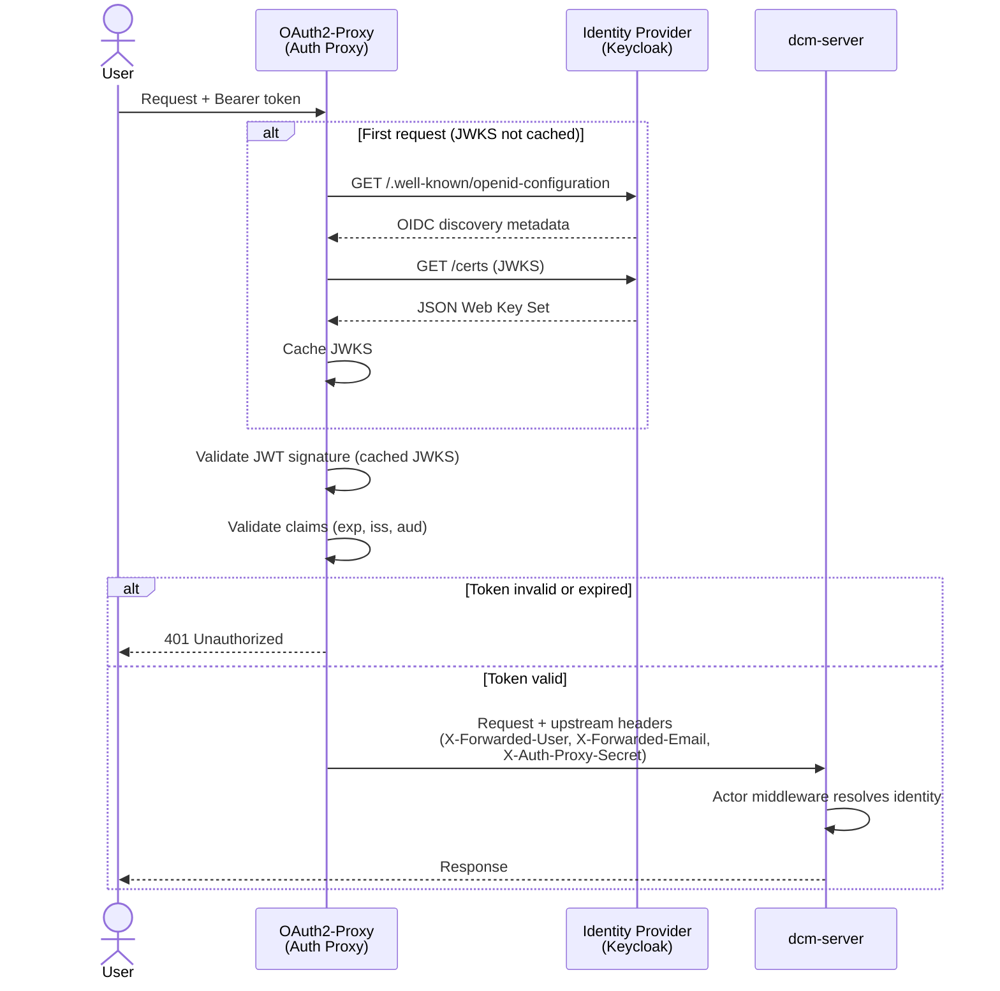
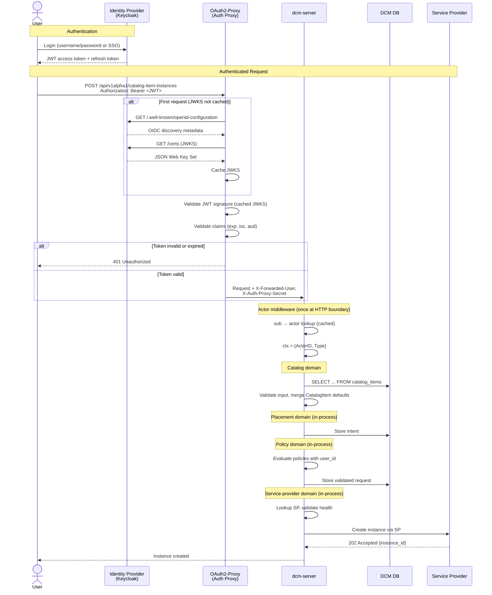

# IDM/IAM Authentication Layer

## Summary

This enhancement introduces identity management and authentication to DCM. It
establishes an Auth Provider strategy using OAuth2-Proxy as the auth proxy,
defines the actor data model, and propagates authenticated identity through the
request chain. This resolves the authentication and identity gaps explicitly
deferred by every existing DCM enhancement.

## Motivation

DCM currently has no authentication or authorization enforcement. This means:

- Any client with network access can call any API endpoint without
  authentication
- The Policy Engine assumes `user_id` is available during evaluation, but no
  component provides it
- The ACM Cluster SP exposes kubeconfig credentials in unauthenticated GET
  responses
- The RHDH Backstage plugin already obtains and forwards OAuth2 bearer tokens to
  the gateway, which ignores them

Every existing enhancement explicitly defers authentication and authorization as
a non-goal. This enhancement is the foundation those deferrals depend on.

### Goals

- Define the auth provider strategy using OAuth2-Proxy for OIDC/JWT validation
  at the auth proxy layer, with Keycloak as the V1 identity provider
- Establish proxy-level authentication using OAuth2-Proxy as a reverse proxy in
  front of dcm-server
- Define the actor data model (users, service accounts)
- Propagate authenticated identity (actor ID, actor type) through the request
  context to all domain handlers in dcm-server
- Add `securitySchemes` to the OpenAPI specification and replace the current
  no-auth middleware with actor middleware in the HTTP handler chain
- Add CLI authentication (`dcm login`) using OIDC Device Authorization Grant so
  the CLI is usable when gateway auth is enforced

### Non-Goals

- **Authorization / RBAC** (role-based access control, permission matrices, role
  assignment APIs) — tracked separately under
  [FLPATH-2799](https://redhat.atlassian.net/browse/FLPATH-2799)
- **Multi-tenancy and tenant isolation** (tenant data model, tenant-scoped
  queries, cross-tenant access control) — tracked separately under
  [FLPATH-4115](https://redhat.atlassian.net/browse/FLPATH-4115)
- **Service Provider authentication** (SP registration auth, DCM-to-SP
  credential exchange, NATS messaging auth) — tracked by
  [FLPATH-4196](https://redhat.atlassian.net/browse/FLPATH-4196)

## Proposal

### User Stories

1. **Platform Admin** configures an identity provider so all API access requires
   authentication
2. **Consumer Developer** authenticates via SSO and browses the service catalog
3. **Policy Engine** receives verified `user_id` to evaluate policies against
   the authenticated caller

### Implementation Details/Notes/Constraints

#### Architectural Context: Control-Plane Monolith

This enhancement targets the control-plane monolith architecture: one binary
(`dcm-server`), one database, in-process domain calls. Actor middleware runs
once at the HTTP boundary; identity propagates via request context. OAuth2-Proxy
is introduced as a focused auth proxy (see Alternative 3 for the trade-off
analysis).

#### Existing Codebase Integration Points

The codebase already has the scaffolding for auth — it just needs to be wired
up:

| Component                                                                | Current State                                   | Integration Point                                                                              |
| ------------------------------------------------------------------------ | ----------------------------------------------- | ---------------------------------------------------------------------------------------------- |
| Auth Proxy                                                               | Not deployed                                    | Deploy OAuth2-Proxy as reverse proxy in front of dcm-server                                    |
| [dcm-server](https://github.com/dcm-project/control-plane) (all domains) | No auth middleware configured                   | Insert actor middleware in the HTTP handler chain                                              |
| [OpenAPI specs](https://github.com/dcm-project/control-plane)            | 401/403 responses defined, no `securitySchemes` | Add Bearer token security scheme                                                               |
| [CLI (`dcm`)](https://github.com/dcm-project/cli)                        | Plain HTTP client, no auth headers              | Add token acquisition (device flow or token file) and `Authorization: Bearer` header injection |
| RHDH plugin                                                              | SSO token exchange already implemented          | OAuth2-Proxy validates the tokens it already sends                                             |
| [Policy domain](https://github.com/dcm-project/control-plane)            | Policy hierarchy defined                        | Provide verified identity from request context for policy evaluation                           |

### Risks and Mitigations

| Risk                                                                                                                            | Impact                                                              | Mitigation                                                                                                                                                                                                                                                                                                                                                                                                                                                              |
| ------------------------------------------------------------------------------------------------------------------------------- | ------------------------------------------------------------------- | ----------------------------------------------------------------------------------------------------------------------------------------------------------------------------------------------------------------------------------------------------------------------------------------------------------------------------------------------------------------------------------------------------------------------------------------------------------------------- |
| Auth adds latency to every request                                                                                              | User-perceived slowdown                                             | JWT validation is local (cached JWKS, no IdP call per request)                                                                                                                                                                                                                                                                                                                                                                                                          |
| Breaking existing dev workflows                                                                                                 | Developer friction                                                  | Seed migration creates admin actor from `DCM_ADMIN_SUBJECT` at first startup; local dev uses a containerized Keycloak with a pre-configured realm; long-lived dev tokens                                                                                                                                                                                                                                                                                                |
| Keycloak becomes a single point of failure                                                                                      | Auth outage blocks all API access                                   | Cached JWTs remain valid during short outages (no per-request IdP call); OAuth2-Proxy session cookies survive brief Keycloak downtime                                                                                                                                                                                                                                                                                                                                   |
| OAuth2-Proxy is both auth and routing — its failure blocks all traffic, not just authenticated traffic                          | Total API outage                                                    | Liveness probe restarts the container; compose `restart: unless-stopped`; OAuth2-Proxy is a single static binary with minimal failure surface                                                                                                                                                                                                                                                                                                                           |
| Header forgery via direct backend access — any process bypassing OAuth2-Proxy can forge X-Forwarded-\* identity headers         | Full identity impersonation until inter-service auth is implemented | Defense in depth: (1) OAuth2-Proxy injects a shared-secret header (`X-Auth-Proxy-Secret`) that dcm-server validates on every request — requests with a missing or incorrect secret are rejected. The secret is a shared value configured as an environment variable in both containers via compose; (2) compose network isolation restricts dcm-server access; with the monolith, internal domain calls are in-process so this risk is limited to external access paths |
| Service providers have no authentication mechanism — SP API calls (registration, instance management) fail when auth is enabled | SP compose profiles are non-functional with auth enabled            | `AUTH_DISABLED=true` environment variable on dcm-server bypasses auth middleware. SP compose profiles set this flag until [FLPATH-4196](https://redhat.atlassian.net/browse/FLPATH-4196) delivers service provider authentication. `AUTH_DISABLED` is a transitional mechanism — it must not be used in production deployments                                                                                                                                          |

## Design Details

### 1. Auth Provider Strategy

With OAuth2-Proxy handling JWT validation at the auth proxy layer, dcm-server
never interacts with the identity provider directly. The Auth Provider interface
is an OAuth2-Proxy configuration concern — OAuth2-Proxy supports Keycloak,
generic OIDC, and dozens of other providers through provider-specific
configuration flags.

#### V1 Implementations

**Keycloak (OIDC):** The primary provider. The RHDH Backstage plugin already
performs OAuth2 `client_credentials` token exchange against Red Hat SSO
(Keycloak-based). OAuth2-Proxy validates those same tokens at the gateway.

**Bootstrap:** The initial admin account is seeded at deploy time via the
`DCM_ADMIN_SUBJECT` environment variable, which contains the Keycloak `sub`
claim of the platform administrator. On first startup, dcm-server runs a seed
migration that creates an admin actor linked to that Keycloak subject through an
identity binding. No custom token endpoint, JWKS endpoint, or local password
storage is needed — all authentication flows go through Keycloak and
OAuth2-Proxy.

Local development and CI use a containerized Keycloak instance with a
pre-configured realm (realm export JSON shipped in the repository).

#### Build Scope

V1 custom code:

- [Actor middleware](#what-dcm-builds-on-top) — resolves identity from
  OAuth2-Proxy headers, populates request context
- [Database migrations](#3-actor-data-model) — auth tables (actors,
  actor_identities)
- [Seed migration](#v1-implementations) — bootstrap admin actor from
  `DCM_ADMIN_SUBJECT`
- [OAuth2-Proxy configuration](#2-auth-proxy-layer) — container in compose,
  configured as reverse proxy in front of dcm-server

### 2. Auth Proxy Layer

[OAuth2-Proxy](https://github.com/oauth2-proxy/oauth2-proxy) serves as both the
authentication gateway and the reverse proxy in front of dcm-server. It
validates JWTs, manages JWKS caching, handles the OIDC protocol, and proxies
authenticated traffic to the backend — eliminating the need for a separate API
gateway or custom auth service.

**HA considerations:** For high availability, a load balancer is placed in front
of OAuth2-Proxy — a deployment topology change that does not affect the auth
architecture defined here.



#### What DCM Builds on Top

OAuth2-Proxy validates the JWT and forwards standard OIDC claims as headers. DCM
consumes a single claim: the JWT `sub`, forwarded as `X-Forwarded-User`.
(`X-Forwarded-Groups` is forwarded but not consumed in V1 — reserved for future
RBAC integration under
[FLPATH-2799](https://redhat.atlassian.net/browse/FLPATH-2799).)

The actor middleware replaces the current no-auth configuration in dcm-server's
HTTP handler chain. It reads `X-Forwarded-User`, looks up the actor via
`actor_identities.external_id`, caches the result (configurable TTL, default
60s), checks actor status (rejects 403 if not active), and populates
`ActorID`/`ActorType` on the request context. Downstream handlers read from
context — they never touch HTTP headers directly.

dcm-server trusts `X-Forwarded-*` headers because OAuth2-Proxy strips and
overwrites client-supplied `X-Forwarded-*` headers before proxying to the
upstream.

#### First Login / Unknown Subject

When OAuth2-Proxy forwards a `sub` claim that has no matching `actor_identities`
record, the actor middleware returns `403 Forbidden` — an admin must pre-create
the actor record before the user can access DCM.

#### Token Lifetime and Revocation

Access tokens are short-lived (5-15 min TTL); refresh tokens handle session
continuity with rotation on each use.

| Revocation Layer                                        | Latency            | V1 Scope                                       |
| ------------------------------------------------------- | ------------------ | ---------------------------------------------- |
| Actor record suspension (`actors.status = 'suspended'`) | < 60s (cache TTL)  | Primary mechanism                              |
| Refresh token revocation at Keycloak                    | Next token refresh | Combined with suspension                       |
| `jti` deny list in actor middleware                     | Immediate          | Deferred — natural expiry is sufficient for V1 |
| OIDC back-channel logout (browser sessions only)        | Immediate          | Supported by OAuth2-Proxy                      |

Role changes propagate at the next token refresh (bounded by access token TTL).

### 3. Actor Data Model

These entities are new tables in DCM's PostgreSQL database — they don't
duplicate Keycloak's user store. Keycloak owns authentication (passwords, SSO
sessions, MFA); these tables map Keycloak identities to DCM-internal actors so
the control plane can track identity and ownership.

#### Actor Entity

```json
{
  "id": "uuid",
  "username": "jdoe",
  "email": "jdoe@example.com",
  "display_name": "Jane Doe",
  "type": "human | service_account",
  "status": "active | suspended | deactivated",
  "created_at": "timestamp",
  "updated_at": "timestamp"
}
```

V1 defines two actor types: `human` for interactive users and `service_account`
for programmatic API clients (CI pipelines, RHDH plugin).

Usernames are globally unique — enforced by a unique constraint on `username`.

#### Actor Identity Entity

Authentication credentials are separated from the actor entity. An actor can
have multiple identity bindings (one per external identity provider).

```json
{
  "id": "uuid",
  "actor_id": "uuid",
  "auth_provider": "keycloak",
  "external_id": "keycloak-sub-claim",
  "created_at": "timestamp",
  "updated_at": "timestamp"
}
```

**Entity relationships:** An actor has one or more identity bindings (one per
external identity provider).

#### Actor Status Enforcement

The actor middleware checks `actors.status` on every request (included in the
cached actor lookup). Requests are rejected before reaching any handler:

| Status              | Behavior                                                                     | HTTP Response                           |
| ------------------- | ---------------------------------------------------------------------------- | --------------------------------------- |
| Actor `active`      | Request proceeds normally                                                    | —                                       |
| Actor `suspended`   | Request blocked; actor can be reactivated by an admin                        | `403 Forbidden` — "account suspended"   |
| Actor `deactivated` | Request blocked; actor record retained for audit, login permanently disabled | `403 Forbidden` — "account deactivated" |

Suspension is reversible; deactivation is a soft delete (record preserved for
audit, cannot be reactivated). Status changes take effect within the actor cache
TTL (60s).

### 4. OpenAPI Security Scheme

All OpenAPI specifications gain a `securitySchemes` definition and per-endpoint
`security` requirements:

```yaml
components:
  securitySchemes:
    bearerAuth:
      type: http
      scheme: bearer
      bearerFormat: JWT
      description: JWT token obtained from the configured Auth Provider

security:
  - bearerAuth: []
```

The existing `401 Unauthorized` (`UNAUTHENTICATED`) and `403 Forbidden`
(`PERMISSION_DENIED`) response types already defined in all specs become active.
The generated server-side authentication hook validates the security
requirements against the request.

#### Required API Changes to Existing Enhancements

This enhancement introduces identity context (`user_id`) that the Policy and
Placement enhancements must consume from the request context. The details of how
each domain integrates this value are documented in their respective
enhancements.

### 5. Authentication Flow: End-to-End

Complete flow from user login through authenticated resource creation. With the
control-plane monolith, the catalog, placement, policy, and service-provider
domains run in one process. Identity propagates via request context — no
inter-domain HTTP calls.



### 6. CLI Authentication

The DCM CLI (`dcm`) currently builds a plain HTTP client with no authentication
headers. Adding auth is straightforward because all API calls already flow
through a single HTTP client factory.

#### Token Acquisition

The CLI supports two token acquisition methods:

1. **OIDC Device Authorization Grant (interactive).** `dcm login` opens the
   IdP's device authorization flow — the user visits a URL in their browser,
   authenticates with Keycloak, and the CLI receives an access token + refresh
   token. Tokens are stored locally in `~/.config/dcm/credentials.json` (file
   permissions `0600`). This is the standard approach used by `oc login`,
   `gh auth login`, and `kubectl` with OIDC plugins.
2. **Token file / environment variable (non-interactive).** For CI/CD and
   scripting, the CLI reads a bearer token from `--token`, the `DCM_TOKEN`
   environment variable, or a token file path via `--token-file`. No device flow
   needed.

### Upgrade / Downgrade Strategy

Authentication ships as a required capability — there is no existing deployment
to migrate from. The schema is created alongside existing domain tables at
initial deployment. **Downgrade:** Remove OAuth2-Proxy from the compose stack
and revert the actor middleware to a no-op.

## Drawbacks

- **Operational complexity:** Adds Keycloak as an external dependency for all
  deployments. Mitigated by reusing existing Red Hat SSO infrastructure and
  providing a containerized Keycloak for local development.
- **Development friction:** Local development requires a containerized Keycloak
  instance. Mitigated by a pre-configured realm export shipped in the repository
  and a compose profile that starts Keycloak alongside dcm-server.

## Alternatives

**Kessel/SpiceDB:** Out of scope — Kessel is an authorization (ReBAC) concern,
not authentication. Tracked separately.

### Alternative 1: Kuadrant/Authorino for Gateway Auth

#### Description

Use [Kuadrant](https://kuadrant.io/) with
[Authorino](https://github.com/Kuadrant/authorino), Red Hat's Kubernetes-native
API gateway authentication and authorization framework. Authorino runs as an
Envoy ext_authz gRPC service, providing OIDC validation, API key auth, and
policy evaluation at the gateway layer. This is the approach used by OSAC (Open
Source Assurance Cloud).

#### Pros

- Red Hat-supported and actively maintained
- Rich auth capabilities: OIDC, API key, mTLS, Kubernetes ServiceAccount token
  validation
- Built-in policy evaluation (Rego/OPA) at the gateway
- Integrates with Keycloak natively

#### Cons

- Requires Kubernetes — Authorino is deployed as a CRD-driven operator, making
  it unsuitable for bare-metal or docker-compose deployment profiles
- Requires Envoy (or Istio) as the gateway proxy — DCM does not use Envoy or
  Istio
- Significant infrastructure change from the current stack
- Adds operational complexity for minimal/dev deployment profiles

#### Status

Deferred

#### Rationale

Kuadrant/Authorino is a strong fit for Kubernetes-native deployments and may be
adopted in the future when DCM targets production Kubernetes environments. For
V1, DCM must support non-Kubernetes deployment profiles (docker-compose,
minimal) where Authorino cannot run. The OAuth2-Proxy approach works across all
deployment targets. If DCM later adopts Envoy or Istio as its gateway, Authorino
becomes a natural upgrade path.

### Alternative 2: Service Mesh for All Auth (Istio)

#### Description

Delegate all authentication and authorization to an Istio service mesh using
PeerAuthentication and AuthorizationPolicy CRDs.

#### Pros

- Zero application-level auth code
- mTLS between all services out of the box
- Industry-standard approach for Kubernetes-native platforms

#### Cons

- Significant operational complexity (Istio control plane, sidecar injection)
- DCM targets minimal/dev deployment profiles where a service mesh is excessive
- Application still needs identity propagation — mesh handles transport auth,
  not application-level identity

#### Status

Rejected

#### Rationale

A service mesh solves transport-level security but not application-level
identity management (identity propagation, policy engine integration). DCM would
still need most of this enhancement even with Istio. A mesh approach may be
adopted independently for external SP communication.

### Alternative 3: JWT Validation Inside the Monolith (No Auth Proxy)

#### Description

dcm-server validates JWTs directly using a JWT validation library as middleware,
without an external auth proxy.

#### Pros

- No external auth component — simplest possible deployment
- One fewer container to configure and monitor
- With the monolith, there is only one service, so the "duplication across
  services" concern from the pre-monolith architecture no longer applies

#### Cons

- Couples OIDC protocol concerns (JWKS fetching, OIDC discovery, token refresh,
  session management) into the application binary
- Must implement and maintain JWKS caching, key rotation handling, and OIDC
  discovery — all solved problems in OAuth2-Proxy
- No TLS termination unless added separately
- Loses OAuth2-Proxy's multi-provider support and session management

#### Status

Rejected

#### Rationale

Centralizing auth at an external proxy separates OIDC protocol concerns from the
application binary. OAuth2-Proxy provides JWKS caching, OIDC discovery, session
management, TLS termination, and multi-provider support as configuration — no
custom code. Keeping dcm-server free of these dependencies simplifies the
application and avoids reimplementing solved problems.

## Infrastructure Needed

- **Keycloak:** Containerized instance in the compose stack for all deployment
  profiles (production uses existing Red Hat SSO). A pre-configured realm export
  JSON is shipped in the repository for local dev and CI.
- **OAuth2-Proxy:** Container in the compose stack, configured as a reverse
  proxy in front of dcm-server.
- **Database migrations:** Auth tables (actors, actor_identities), applied in
  the existing migration stream.
