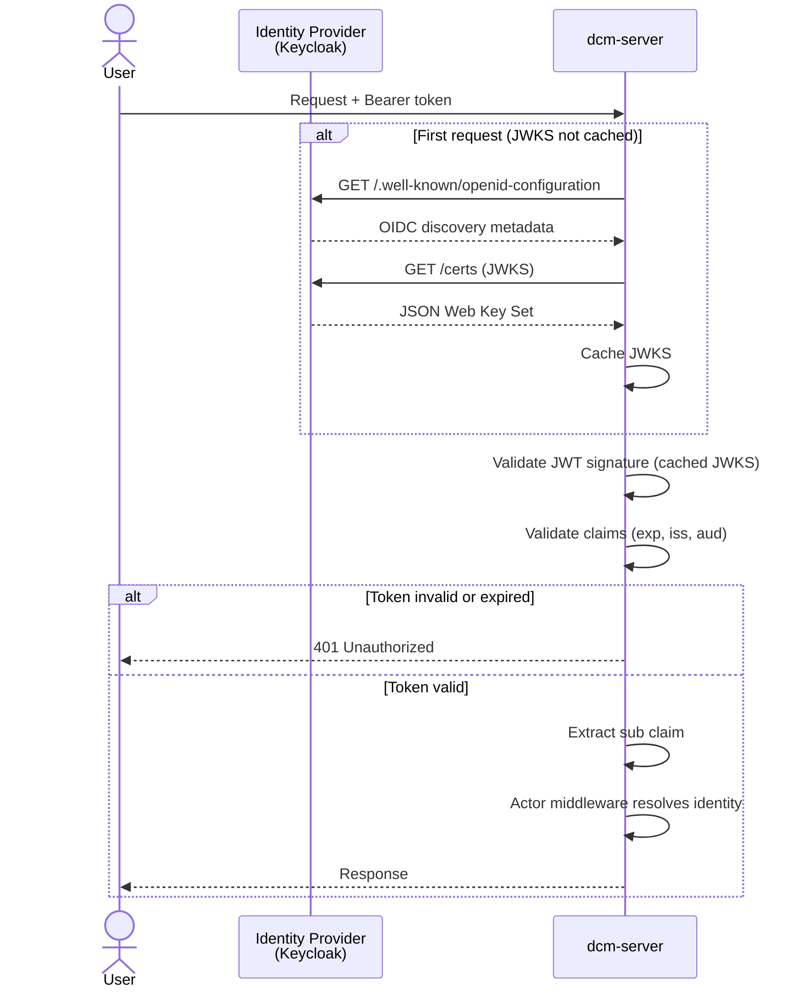
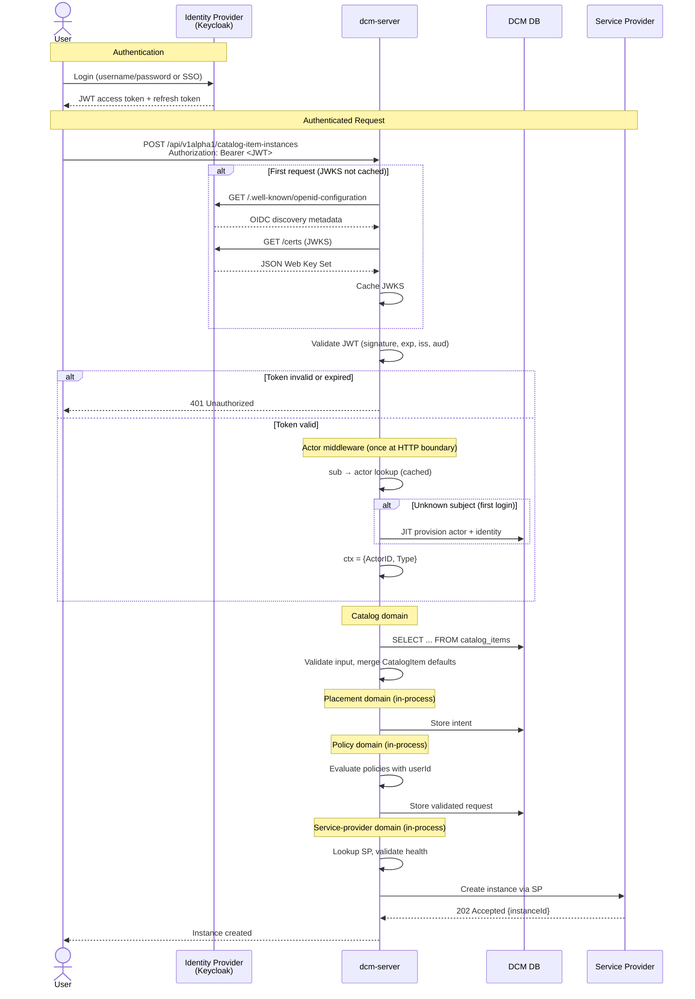

# IDM/IAM Authentication Layer

## Summary

This enhancement introduces identity management and authentication to DCM. It
validates JWTs in-app using OIDC discovery against Keycloak, defines the actor
data model, and propagates authenticated identity through the request chain.
This resolves the authentication and identity gaps explicitly deferred by every
existing DCM enhancement.

## Motivation

DCM currently has no authentication or authorization enforcement. This means:

- Any client with network access can call any API endpoint without
  authentication
- The Policy Engine assumes `userId` is available during evaluation, but no
  component provides it
- The ACM Cluster SP exposes kubeconfig credentials in unauthenticated GET
  responses
- The RHDH Backstage plugin already obtains and forwards OAuth2 bearer tokens to
  the gateway, which ignores them

Every existing enhancement explicitly defers authentication and authorization as
a non-goal. This enhancement is the foundation those deferrals depend on.

### Goals

- Define the auth provider strategy using in-app JWT validation via OIDC
  discovery, with Keycloak as the V1 identity provider
- Establish in-app JWT validation middleware in dcm-server that validates bearer
  tokens directly against Keycloak's JWKS endpoint
- Define the actor data model (users, service accounts)
- Propagate authenticated identity (actor ID, actor type) through the request
  context to all domain handlers in dcm-server
- Add `securitySchemes` to the OpenAPI specification and replace the current
  no-auth middleware with actor middleware in the HTTP handler chain
- Add CLI authentication (`dcm login`) using OIDC Device Authorization Grant so
  the CLI is usable when gateway auth is enforced

### Non-Goals

- **Authorization / RBAC** (role-based access control, permission matrices, role
  assignment APIs) — tracked separately under
  [FLPATH-2799](https://redhat.atlassian.net/browse/FLPATH-2799)
- **Multi-tenancy and tenant isolation** (tenant data model, tenant-scoped
  queries, cross-tenant access control) — tracked separately under
  [FLPATH-4115](https://redhat.atlassian.net/browse/FLPATH-4115)
- **Service Provider authentication** (SP registration auth, DCM-to-SP
  credential exchange, NATS messaging auth) — tracked by
  [FLPATH-4196](https://redhat.atlassian.net/browse/FLPATH-4196)

## Proposal

### User Stories

1. **Platform Admin** configures an identity provider so all API access requires
   authentication
2. **Consumer Developer** authenticates via SSO and browses the service catalog
3. **Policy Engine** receives verified `userId` to evaluate policies against the
   authenticated caller

### Implementation Details/Notes/Constraints

#### Architectural Context: Control-Plane Monolith

This enhancement targets the control-plane monolith architecture: one binary
(`dcm-server`), one database, in-process domain calls. Actor middleware runs
once at the HTTP boundary; identity propagates via request context. With a
single service, JWT validation runs in-app — there is no "duplication across
services" concern (see Alternative 1 for the trade-off analysis).

#### Existing Codebase Integration Points

The codebase already has the scaffolding for auth — it just needs to be wired
up:

| Component                                                                | Current State                                   | Integration Point                                                                              |
| ------------------------------------------------------------------------ | ----------------------------------------------- | ---------------------------------------------------------------------------------------------- |
| [dcm-server](https://github.com/dcm-project/control-plane) (all domains) | No auth middleware configured                   | Insert actor middleware in the HTTP handler chain; validate JWTs via OIDC discovery            |
| [OpenAPI specs](https://github.com/dcm-project/control-plane)            | 401/403 responses defined, no `securitySchemes` | Add Bearer token security scheme                                                               |
| [CLI (`dcm`)](https://github.com/dcm-project/cli)                        | Plain HTTP client, no auth headers              | Add token acquisition (device flow or token file) and `Authorization: Bearer` header injection |
| RHDH plugin                                                              | SSO token exchange already implemented          | dcm-server validates the bearer tokens the plugin already sends                                |
| [Policy domain](https://github.com/dcm-project/control-plane)            | Policy hierarchy defined                        | Provide verified identity from request context for policy evaluation                           |

### Risks and Mitigations

| Risk                                                                                                                                                      | Mitigation                                                                                                                                                                                                                                                                                                                     |
| --------------------------------------------------------------------------------------------------------------------------------------------------------- | ------------------------------------------------------------------------------------------------------------------------------------------------------------------------------------------------------------------------------------------------------------------------------------------------------------------------------ |
| Auth adds latency to every request, causing user-perceived slowdown                                                                                       | JWT validation is local (cached JWKS, no IdP call per request)                                                                                                                                                                                                                                                                 |
| Breaking existing dev workflows increases developer friction                                                                                              | Seed migration creates admin actor from `DCM_ADMIN_SUBJECT` at first startup; local dev uses a containerized Keycloak with a pre-configured realm; long-lived dev tokens                                                                                                                                                       |
| Keycloak becomes a single point of failure — an outage blocks all API access                                                                              | Cached JWKS keys remain valid during short outages (no per-request IdP call); cached JWTs continue to validate until expiry                                                                                                                                                                                                    |
| Header forgery via the proxy-header fallback — any process with the shared secret can inject identity headers, enabling impersonation if the secret leaks | The proxy-header path requires a shared secret validated on every request via constant-time comparison; the JWT path (primary) is immune to header forgery because identity is extracted from the cryptographically verified token, not from headers                                                                           |
| Service providers have no authentication mechanism — SP API calls fail when auth is enabled, making SP compose profiles non-functional                    | `AUTH_DISABLED=true` environment variable on dcm-server bypasses auth middleware. SP compose profiles set this flag until [FLPATH-4196](https://redhat.atlassian.net/browse/FLPATH-4196) delivers service provider authentication. `AUTH_DISABLED` is a transitional mechanism — it must not be used in production deployments |

## Design Details

### 1. Auth Provider Strategy

dcm-server validates JWTs directly using OIDC discovery. On startup, the
middleware fetches the identity provider's `/.well-known/openid-configuration`
endpoint to discover the JWKS URI, then caches the signing keys. Each request's
bearer token is validated against the cached JWKS (signature, expiry, issuer,
audience) — no per-request call to the identity provider.

#### V1 Implementations

**Keycloak (OIDC):** The primary provider. Two Keycloak clients are configured:

- **`dcm-proxy`** (confidential) — used for programmatic client authentication
  (RHDH Backstage plugin, CI pipelines). Supports direct access grants and
  service account roles.
- **`dcm-cli`** (public) — used for CLI authentication via Device Authorization
  Grant. No client secret required.

Both clients include an audience mapper that adds `dcm-api` to the token's `aud`
claim, which dcm-server validates via the `AUTH_JWT_AUDIENCE` configuration.

The RHDH Backstage plugin already performs OAuth2 `client_credentials` token
exchange against Red Hat SSO (Keycloak-based). dcm-server validates those same
tokens directly.

**Bootstrap:** The initial admin account is seeded at deploy time via the
`DCM_ADMIN_SUBJECT` environment variable, which contains the Keycloak `sub`
claim of the platform administrator. On first startup, dcm-server runs a seed
migration that creates an admin actor linked to that Keycloak subject through an
identity binding. No custom token endpoint, JWKS endpoint, or local password
storage is needed — all authentication flows go through Keycloak.

Local development and CI use a containerized Keycloak instance with a
pre-configured realm (realm export JSON shipped in the repository).

#### Build Scope

V1 custom code:

- [Authentication middleware](#2-authentication-middleware) — dual-path
  middleware: validates JWT bearer tokens (primary) and proxy-header with shared
  secret (fallback), resolves actors, populates request context
- [JWT validation](#2-authentication-middleware) — OIDC discovery and JWKS
  verification
- [Database migrations](#3-actor-data-model) — auth tables (actors,
  actor_identities)
- [Seed migration](#v1-implementations) — bootstrap admin actor from
  `DCM_ADMIN_SUBJECT`
- [JIT actor provisioning](#first-login--unknown-subject) — auto-create actors
  on first authenticated request

### 2. Authentication Middleware

dcm-server validates JWTs in-app — no external auth proxy is required. The
authentication middleware supports two paths:

1. **JWT bearer token (primary):** Extracts the token from the
   `Authorization: Bearer` header, validates it against the identity provider's
   JWKS (signature, expiry, issuer, audience), and extracts the `sub` and
   `preferred_username` claims.
2. **Proxy-header with shared secret (fallback):** For deployments that place a
   trusted proxy in front of dcm-server, the middleware accepts
   `X-Forwarded-User` and `X-Forwarded-Preferred-Username` headers when
   accompanied by a valid `X-Auth-Proxy-Secret` header (constant-time
   comparison).

When auth is enabled, all V1 callers (Backstage plugin, dcm-cli, CI pipelines)
use the JWT path. The proxy-header path exists for deployment flexibility.

**Configuration:**

| Environment Variable | Purpose                                       | Default |
| -------------------- | --------------------------------------------- | ------- |
| `AUTH_DISABLED`      | Bypass auth middleware entirely               | `true`  |
| `AUTH_ISSUER_URL`    | OIDC issuer URL for JWT validation (Keycloak) | —       |
| `AUTH_JWT_AUDIENCE`  | Expected `aud` claim in JWT tokens            | —       |
| `AUTH_PROXY_SECRET`  | Shared secret for proxy-header fallback path  | —       |
| `AUTH_CACHE_TTL`     | TTL for the actor resolution cache            | `60s`   |
| `DCM_ADMIN_SUBJECT`  | Keycloak `sub` claim for the admin actor seed | —       |



#### What DCM Builds on Top

The authentication middleware validates the JWT and extracts the `sub` claim as
the identity key. The `preferred_username` claim is also extracted for use
during JIT actor provisioning.

The actor middleware reads the `sub` claim, looks up the actor via
`actor_identities.external_id`, caches the result (configurable TTL, default
60s), checks actor status (rejects 403 if not active), and populates the actor
ID and actor type on the request context. Downstream handlers read from context
— they never touch HTTP headers or JWT claims directly.

#### First Login / Unknown Subject

When a validated JWT contains a `sub` claim that has no matching
`actor_identities` record, the middleware performs JIT (just-in-time) actor
provisioning: it creates a new actor record and identity binding in a single
transaction. The `preferred_username` claim populates the actor's username. Race
conditions from concurrent first requests with the same subject are handled via
unique constraint violation detection and retry.

#### Token Lifetime and Revocation

Access tokens are short-lived (5-15 min TTL); refresh tokens handle session
continuity with rotation on each use.

| Revocation Layer                                        | Latency            | V1 Scope                                       |
| ------------------------------------------------------- | ------------------ | ---------------------------------------------- |
| Actor record suspension (`actors.status = 'suspended'`) | < 60s (cache TTL)  | Primary mechanism                              |
| Refresh token revocation at Keycloak                    | Next token refresh | Combined with suspension                       |
| `jti` deny list in actor middleware                     | Immediate          | Deferred — natural expiry is sufficient for V1 |

Role and permission propagation semantics are defined in the RBAC enhancement
([FLPATH-2799](https://redhat.atlassian.net/browse/FLPATH-2799)).

### 3. Actor Data Model

These entities are new tables in DCM's PostgreSQL database — they don't
duplicate Keycloak's user store. Keycloak owns authentication (passwords, SSO
sessions, MFA); these tables map Keycloak identities to DCM-internal actors so
the control plane can track identity and ownership.

#### Actor Entity

```json
{
  "id": "uuid",
  "username": "jdoe",
  "email": "jdoe@example.com",
  "displayName": "Jane Doe",
  "type": "human | service_account",
  "status": "active | suspended | deactivated",
  "createdAt": "timestamp",
  "updatedAt": "timestamp"
}
```

V1 defines two actor types: `human` for interactive users and `service_account`
for programmatic API clients (CI pipelines, RHDH plugin).

Usernames are globally unique — enforced by a unique constraint on `username`.

#### Actor Identity Entity

Authentication credentials are separated from the actor entity. An actor can
have multiple identity bindings (one per external identity provider).

```json
{
  "id": "uuid",
  "actorId": "uuid",
  "authProvider": "keycloak",
  "externalId": "keycloak-sub-claim",
  "createdAt": "timestamp",
  "updatedAt": "timestamp"
}
```

**Entity relationships:** An actor has one or more identity bindings (one per
external identity provider).

#### Actor Status Enforcement

The actor middleware checks `actors.status` on every request (included in the
cached actor lookup). Requests are rejected before reaching any handler:

| Status              | Behavior                                                                     | HTTP Response                           |
| ------------------- | ---------------------------------------------------------------------------- | --------------------------------------- |
| Actor `active`      | Request proceeds normally                                                    | —                                       |
| Actor `suspended`   | Request blocked; actor can be reactivated by an admin                        | `403 Forbidden` — "account suspended"   |
| Actor `deactivated` | Request blocked; actor record retained for audit, login permanently disabled | `403 Forbidden` — "account deactivated" |

Suspension is reversible; deactivation is a soft delete (record preserved for
audit, cannot be reactivated). Status changes take effect within the actor cache
TTL (60s).

### 4. OpenAPI Security Scheme

All OpenAPI specifications gain a `securitySchemes` definition and per-endpoint
`security` requirements:

```yaml
components:
  securitySchemes:
    bearerAuth:
      type: http
      scheme: bearer
      bearerFormat: JWT
      description: JWT token obtained from the configured Auth Provider

security:
  - bearerAuth: []
```

The existing `401 Unauthorized` (`UNAUTHENTICATED`) and `403 Forbidden`
(`PERMISSION_DENIED`) response types already defined in all specs become active.
dcm-server enforces the security requirements against each request.

#### Required API Changes to Existing Enhancements

This enhancement introduces identity context (`userId`) that the Policy and
Placement enhancements must consume from the request context. The details of how
each domain integrates this value are documented in their respective
enhancements.

### 5. Authentication Flow: End-to-End

Complete flow from user login through authenticated resource creation. With the
control-plane monolith, the catalog, placement, policy, and service-provider
domains run in one process. Identity propagates via request context — no
inter-domain HTTP calls.



### 6. CLI Authentication

The DCM CLI (`dcm`) currently builds a plain HTTP client with no authentication
headers. Adding auth is straightforward because all API calls already flow
through a single HTTP client factory.

#### Token Acquisition

The CLI supports two token acquisition methods:

1. **OIDC Device Authorization Grant (interactive).** `dcm login` opens the
   IdP's device authorization flow — the user visits a URL in their browser,
   authenticates with Keycloak, and the CLI receives an access token + refresh
   token. Tokens are stored locally in `~/.config/dcm/credentials.json` (file
   permissions `0600`). This is the standard approach used by `oc login`,
   `gh auth login`, and `kubectl` with OIDC plugins. The `dcm-cli` Keycloak
   client (public, no client secret) is configured for this flow.
2. **Token file / environment variable (non-interactive).** For CI/CD and
   scripting, the CLI reads a bearer token from `--token`, the `DCM_TOKEN`
   environment variable, or a token file path via `--token-file`. No device flow
   needed.

### Upgrade / Downgrade Strategy

Authentication ships as a required capability — there is no existing deployment
to migrate from. The schema is created alongside existing domain tables at
initial deployment. **Downgrade:** Set `AUTH_DISABLED=true` to revert the actor
middleware to a no-op that passes all requests with a system identity.

## Implementation History

- 2026-05-13: Enhancement created
- 2026-07-08: V1 implementation landed in control-plane (commit 1274730) —
  in-app JWT validation, JIT actor provisioning, dual-path middleware

## Drawbacks

- **Operational complexity:** Adds Keycloak as an external dependency for all
  deployments. Mitigated by reusing existing Red Hat SSO infrastructure and
  providing a containerized Keycloak for local development.
- **Development friction:** Local development requires a containerized Keycloak
  instance. Mitigated by a pre-configured realm export shipped in the repository
  and a compose profile that starts Keycloak alongside dcm-server.
- **OIDC protocol coupling:** JWT validation, JWKS caching, and OIDC discovery
  run inside the application binary. This is acceptable for a single-service
  monolith but would need to be revisited if DCM splits into multiple services
  (see Alternative 1).

## Alternatives

### Alternative 1: OAuth2-Proxy as Reverse Auth Proxy

#### Description

Deploy [OAuth2-Proxy](https://github.com/oauth2-proxy/oauth2-proxy) as a reverse
proxy in front of dcm-server to handle JWT validation and OIDC protocol concerns
externally.

#### Pros

- Separates OIDC concerns from the application binary
- Provides JWKS caching, session management, and multi-provider support with no
  custom code

#### Cons

- Cannot inject identity headers (`X-Forwarded-User`) for programmatic bearer
  token requests — confirmed limitation through v7.15.3. All DCM callers are
  programmatic, so the proxy provides no value for the V1 caller set.
- Adds an infrastructure SPOF for all API traffic

#### Status

Rejected

#### Rationale

All DCM callers send programmatic bearer tokens. OAuth2-Proxy cannot forward
identity headers for these requests, so dcm-server would still need in-app JWT
validation — making the proxy an infrastructure dependency with no
authentication benefit.

### Alternative 2: Kuadrant/Authorino for Gateway Auth

#### Description

Use [Kuadrant](https://kuadrant.io/) with
[Authorino](https://github.com/Kuadrant/authorino), Red Hat's Kubernetes-native
API gateway authentication and authorization framework. Authorino runs as an
Envoy ext_authz gRPC service, providing OIDC validation, API key auth, and
policy evaluation at the gateway layer. This is the approach used by OSAC (Open
Source Assurance Cloud).

#### Pros

- Red Hat-supported and actively maintained
- Rich auth capabilities: OIDC, API key, mTLS, Kubernetes ServiceAccount token
  validation
- Built-in policy evaluation (Rego/OPA) at the gateway
- Integrates with Keycloak natively

#### Cons

- Requires Kubernetes — Authorino is deployed as a CRD-driven operator, making
  it unsuitable for bare-metal or docker-compose deployment profiles
- Requires Envoy (or Istio) as the gateway proxy — DCM does not use Envoy or
  Istio
- Significant infrastructure change from the current stack
- Adds operational complexity for minimal/dev deployment profiles

#### Status

Deferred

#### Rationale

Kuadrant/Authorino is a strong fit for Kubernetes-native deployments and may be
adopted in the future when DCM targets production Kubernetes environments. For
V1, DCM must support non-Kubernetes deployment profiles (docker-compose,
minimal) where Authorino cannot run. The in-app JWT validation approach works
across all deployment targets. If DCM later adopts Envoy or Istio as its
gateway, Authorino becomes a natural upgrade path.

### Alternative 3: Service Mesh for All Auth (Istio)

#### Description

Delegate all authentication and authorization to an Istio service mesh using
PeerAuthentication and AuthorizationPolicy CRDs.

#### Pros

- Zero application-level auth code
- mTLS between all services out of the box
- Industry-standard approach for Kubernetes-native platforms

#### Cons

- Significant operational complexity (Istio control plane, sidecar injection)
- DCM targets minimal/dev deployment profiles where a service mesh is excessive
- Application still needs identity propagation — mesh handles transport auth,
  not application-level identity

#### Status

Rejected

#### Rationale

A service mesh solves transport-level security but not application-level
identity management (identity propagation, policy engine integration). DCM would
still need most of this enhancement even with Istio. A mesh approach may be
adopted independently for external SP communication.

## Infrastructure Needed

- **Keycloak:** Containerized instance in the compose stack for all deployment
  profiles (production uses existing Red Hat SSO). A pre-configured realm export
  JSON is shipped in the repository for local dev and CI. The realm includes two
  clients (`dcm-proxy`, `dcm-cli`) with a `dcm-api` audience mapper.
- **Database migrations:** Auth tables (actors, actor_identities), applied in
  the existing migration stream.
