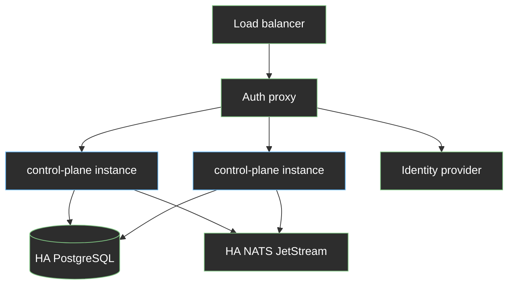
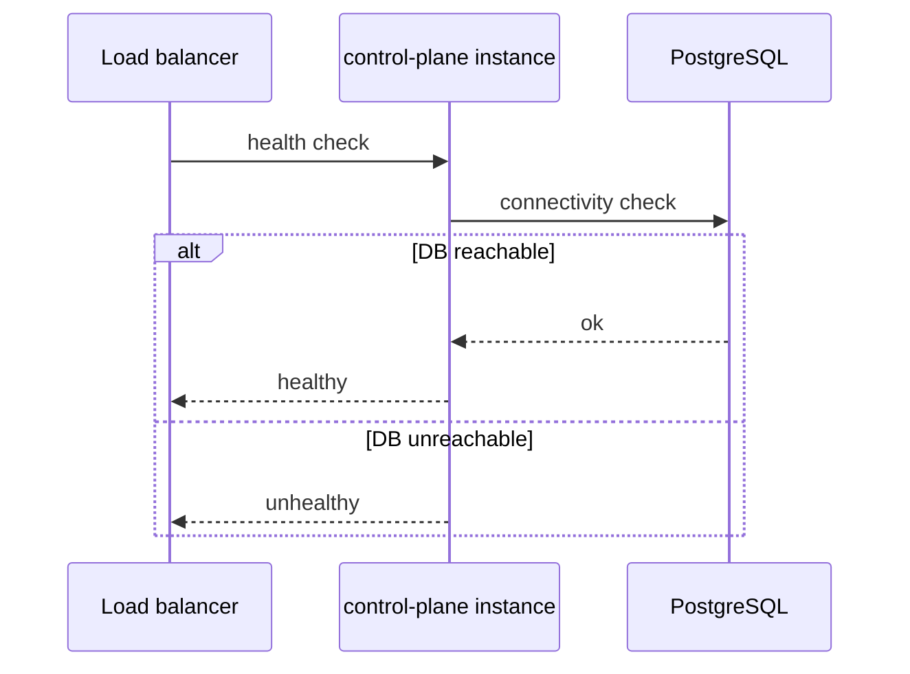

# Control Plane High Availability

## Open Questions

1. Should database schema updates run once at deploy time instead of on every
   instance startup when running multiple instances?

## Summary

This enhancement describes how the DCM control plane should run in production
when individual components fail. PostgreSQL remains the system of record, while
the control plane itself runs as multiple instances behind a load balancer.
Postgres and NATS JetStream must also be highly available, either from
infrastructure the customer already operates or from reference packaging in
DCM's Helm charts and Compose files when a complete installation is needed. When
authentication is enabled, the identity layer is expected to follow the same
pattern.

DCM connects to stable database and messaging endpoints and does not manage
failover for those dependencies. Although the HTTP layer is already largely
stateless, the control plane is not yet ready for a safe multi-instance
production deployment, and the remaining gaps are documented under
[Current gaps](#current-gaps).

## Motivation

### Why high availability is needed

Production environments use DCM to provision and manage resources, so when the
control plane is unavailable administrators cannot drive new work, in-flight
provisioning stalls, and status updates stop. A single control-plane process, or
a single Postgres or NATS node with no failover, is a single point of failure
that is acceptable for development with one instance and bundled dependencies,
but not for production, where the platform must keep running when a node, pod,
or process fails.

### What high availability means for DCM

High availability (HA) means the platform continues to serve traffic when an
individual component fails. It does not guarantee zero downtime in every case.
It means failures are detected, work routes to healthy instances, and
dependencies reconnect through stable endpoints without reconfiguring DCM.

For DCM, production HA spans three layers, and the table below describes what
the environment must provide rather than what DCM is obliged to install, since
most customers already operate HA Postgres or NATS and connect DCM to those
endpoints through configuration.

| Layer         | Production requirement                          | Who typically provides it                            |
| ------------- | ----------------------------------------------- | ---------------------------------------------------- |
| Control plane | Two or more instances behind a load balancer    | Customer platform (DCM supplies the application)     |
| PostgreSQL    | HA database with one stable read-write endpoint | Customer, or bundled Postgres in reference packaging |
| Messaging     | HA NATS deployment with JetStream enabled       | Customer, or bundled NATS in reference packaging     |

Customers who already have HA Postgres and NATS do not need additional database
or messaging products, while reference packaging can still supply both for
installs that do not yet have Postgres or NATS in place. The messaging layer
must remain NATS with JetStream, as Kafka, RabbitMQ, or another bus would
require a major redesign.

The control plane is a single process today. Reference packaging (Compose, Helm)
deploys one instance and bundled single-instance Postgres and
[NATS](https://nats.io/). That is acceptable for local development but not for
production.

DCM is platform agnostic. It runs as a process or container on whatever
environment the customer uses (bare metal, VMs, Kubernetes, OpenShift, or
Compose for dev). High availability is defined at the application and dependency
level, not tied to one orchestrator.

Platform teams often already operate HA Postgres through managed cloud databases
or Kubernetes Postgres operators. DCM must support that path. Other customers
have no Postgres and want a complete deployment from reference packaging. This
enhancement documents both options, production prerequisites, the gaps in the
current control plane, and the changes required for safe horizontal scaling.

### Current gaps

The control plane is not ready for multi-instance production today:

- Reference Helm chart defaults to one control-plane replica.
- `/api/v1alpha1/health` does not check Postgres or NATS connectivity.
- Schema migration (`AutoMigrate`) runs on every instance startup.
- Background workers start in every instance without leader election or
  database-backed job claiming. This includes JetStream consumers, deferred
  deletion scheduling, and agent heartbeat handling.
- Reference packaging ships single-instance Postgres and NATS, which is fine for
  development but not for production HA.

Closing these gaps is follow-up implementation work. This document captures the
target architecture and decisions from the HA exploration.

### Goals

- Keep PostgreSQL as the system of record and NATS JetStream as the messaging
  layer for control-plane state and events.
- Define separate dev and production deployment profiles.
- Support bundled Postgres in reference packaging and external Postgres via
  configuration.
- Document HA prerequisites for messaging and for customer-operated Postgres.
- Specify control-plane requirements before running multiple instances (health
  checks, background workers, connection settings).
- Evaluate alternative stores and HA mechanisms and mark them rejected or
  deferred.

### Non-Goals

- Failover orchestration for Postgres or messaging inside the control-plane
  application. Dependency HA is a platform concern. DCM connects to stable
  endpoints.
- Requiring every production deployment to supply external Postgres. Bundled
  Postgres remains available for customers who want a complete install.

## Proposal

### Deployment profiles

These profiles describe what DCM needs in development versus production. How
instances are run and how traffic is load-balanced is up to the customer.

| Profile | Control plane | Postgres                              | NATS / messaging                              | Auth (when adopted)           |
| ------- | ------------- | ------------------------------------- | --------------------------------------------- | ----------------------------- |
| Dev     | 1 instance    | Bundled single instance               | Bundled single instance                       | Optional, disabled by default |
| Prod    | ≥ 2 instances | Bundled or bring-your-own HA Postgres | Bundled or bring-your-own HA NATS (JetStream) | Customer HA IdP + auth proxy  |

**Postgres in production.** DCM does not mandate a specific Postgres product or
operator. The database must be PostgreSQL and expose one stable read-write
endpoint (DNS name, virtual IP (VIP), [PgBouncer](https://www.pgbouncer.org/),
or managed URL). Customers choose one of two paths:

- **Bundled** — Postgres shipped with DCM reference packaging (Helm or Compose)
  for a complete install.
- **Bring your own** — Postgres the customer already runs (for example RDS,
  Azure Database, Cloud SQL, or a Kubernetes operator such as Percona,
  CloudNativePG, or Crunchy).

In both cases DCM connects through configuration (`DB_HOST`, TLS, pool
settings). DCM does not run failover or replication. That stays with the
database platform.

**NATS in production.** DCM uses [NATS](https://nats.io/) with
[JetStream](https://docs.nats.io/nats-concepts/jetstream) enabled. Production
needs a highly available NATS deployment (typically several NATS servers behind
one connection endpoint), either bundled in reference packaging or operated by
the customer. DCM does not support replacing NATS with another messaging
product.

### Control-plane scaling

HTTP handlers are stateless. Multiple control-plane instances may sit behind a
load balancer. Shared state lives only in Postgres and the messaging system.

Service provider health polling runs on the agent (see
[environment-agent](../environment-agent/environment-agent.md)). DCM tracks
agent liveness through periodic heartbeats and persists agent registration in
the Agent Registry.

Background work that remains on the control plane includes JetStream
consumption, deferred deletion scheduling, and agent heartbeat handling. Before
production multi-instance deploy:

- Only one instance should run schedulers that are not safe to duplicate, unless
  workers claim work in the database first.
- JetStream consumers must use durable consumer semantics so multiple instances
  do not process the same message twice.
- Health checks must verify Postgres connectivity and NATS when enabled. An
  instance that cannot reach Postgres must not receive traffic.
- Database schema updates must run once per release, not from every instance at
  startup. When several instances boot together they share one Postgres. If each
  instance applies migrations at the same time, schema changes can conflict or
  fail.

### Assumptions

- The control-plane monolith architecture (one binary, one database) remains in
  place.
- Every control-plane instance can reach HA Postgres and HA messaging on the
  network.
- Agents register environments, consume bus topics, and poll service provider
  health. DCM receives heartbeats and agent health events and maintains the
  Agent Registry.
- DCM assigns resource and agent identifiers so retries and redelivery stay
  idempotent.
- When authentication is enabled, the
  [authentication enhancement](../authentication/authentication.md) auth proxy
  and identity provider are deployed and operated outside this enhancement.

### User Stories

#### Platform team runs DCM in production

Administrators run two or more control-plane instances. Postgres may come from
reference packaging or from a customer-operated HA service. NATS connection
settings point at customer HA JetStream. Database failover is handled outside
DCM. On Kubernetes this may mean Helm `replicas` with bundled or external
database URLs. On other platforms the same logic applies (systemd units, VM
scale set, or any supervisor the customer uses).

#### Developer runs the default stack locally

A developer uses Compose or Helm with defaults (one control-plane instance,
bundled Postgres, bundled NATS). No HA configuration is required.

#### Administrator verifies an instance is ready for traffic

When Postgres is unreachable, the instance must fail health checks and stop
receiving traffic. On Kubernetes that is a readiness probe. Elsewhere it is the
same contract exposed through `/api/v1alpha1/health` or an equivalent check the
load balancer uses.

### Implementation Details/Notes/Constraints

**Data store.** Control-plane data is relational (catalog, policies, placement
records, Agent Registry entries, service-type instances). External service
providers register to the agent, not DCM directly. JSON columns hold
semi-structured specs. Unique constraints and foreign keys matter. SQL fits this
model. A document or key-value store would force a rewrite.

**Connection configuration.** Production deployments need configurable TLS and
optional pool parameters. A single `DB_HOST` pointing at the write endpoint is
sufficient when the platform handles failover.

**Messaging.** Resource status events and agent health warnings use
[NATS JetStream](https://docs.nats.io/nats-concepts/jetstream). The
[environment-agent enhancement](../environment-agent/environment-agent.md)
routes creation and deletion through the bus. SPRM publishes to per-agent
topics. Production must treat messaging as HA infrastructure with persistence
and explicit delivery semantics.

**Authentication stack.** The
[authentication enhancement](../authentication/authentication.md) places an auth
proxy in front of the control plane. That component must be scaled and operated
alongside DCM. JWT validation in the monolith remains stateless per instance.

### Risks and Mitigations

| Risk                                                     | Mitigation                                                                                      |
| -------------------------------------------------------- | ----------------------------------------------------------------------------------------------- |
| Duplicate background work across instances               | Leader election or DB-backed job claiming before multi-instance prod                            |
| Duplicate JetStream message processing                   | Durable consumers with queue groups or equivalent load-sharing semantics                        |
| Duplicate agent heartbeat handling                       | Idempotent upsert of heartbeat and agent state in the database                                  |
| Connection pool exhaustion (instances × max connections) | Document sizing. Recommend [PgBouncer](https://www.pgbouncer.org/) or lower per-instance limits |
| Bundled Postgres mistaken for HA without documentation   | Packaging docs label profiles and HA expectations per option                                    |
| Messaging outage blocks provisioning                     | Document HA JetStream requirements. Buffer and retry per bus capabilities                       |
| Failover window drops in-flight DB connections           | Use connection pooling with reconnect. Drop unhealthy instances from LB                         |

## Design Details

### Production topology

### Multi-replica readiness

### Test Plan

- Integration test with two control-plane instances against one Postgres.
  Concurrent API creates must not corrupt data.
- Documented multi-instance deploy test (for example Helm with two replicas on
  Kubernetes, or two processes behind a local load balancer).
- Subsystem tests may keep single-instance Postgres.
- Manual test that stops the Postgres primary must fail instance health checks.
  Restored connectivity should recover instances when the driver reconnects.

### Upgrade / Downgrade Strategy

**Upgrade.** Run more control-plane instances, point `DB_HOST` and `NATS_URL` at
HA endpoints, add Postgres-aware health checks, and migrate schedulers to safe
multi-instance behavior. HA alone does not require a data model change.

**Downgrade.** Run a single control-plane instance and revert to bundled infra
values where applicable. External HA services may remain. DCM does not require
them for a single instance.

## Implementation History

N/A. This enhancement documents target architecture and gaps. Implementation
work in the control-plane repository has not started.

## Drawbacks

- Production may use bundled or customer-operated Postgres and messaging. The
  operational bar depends on which profile the customer chooses.
- Agent HA is out of scope for this enhancement (see
  [environment-agent enhancement](../environment-agent/environment-agent.md)).
- A multi-replica control plane adds instances and pool tuning without removing
  the shared database as a coordination point.

## Alternatives

### Alternative 1 — Bundled Postgres in DCM reference packaging

#### Description

Ship Postgres as part of DCM Helm or Compose packaging so customers without an
existing database get a complete deployment. Customers who already operate
Postgres configure external connection settings instead.

#### Pros

- Single install experience for smaller environments and new deployments without
  existing database or messaging infrastructure.
- DCM team can test and document one known database topology.

#### Cons

- Database backup, upgrade, and monitoring remain operational work even when
  bundled.
- Customers with an existing Postgres standard may prefer their own service.
- HA topology for bundled Postgres must be defined and documented separately
  from the control-plane scaling work in this enhancement.

#### Status

Accepted

#### Rationale

Some customers have no Postgres and want a complete deployment. Others already
run HA Postgres and should connect DCM to their endpoint. Reference packaging
supports both through configuration.

### Alternative 2 — [CockroachDB](https://www.cockroachlabs.com/) or another distributed SQL engine

#### Description

Replace Postgres with a distributed SQL database that replicates data
internally.

#### Pros

- Built-in replication and failover without an external database operator.
- Postgres-compatible wire protocol may limit application change.

#### Cons

- Another distributed system to operate and troubleshoot.
- Application drivers and migrations must be validated across engines.
- Current schema and tooling assume Postgres.

#### Status

Rejected

#### Rationale

DCM does not need geo-distributed SQL at current scale. Customer HA Postgres
meets the requirement with less change.

### Alternative 3 — [etcd](https://etcd.io/) or Kubernetes CRDs as the control-plane store

#### Description

Persist desired state in [etcd](https://etcd.io/) or as CRDs on a Kubernetes
cluster. Agents watch and reconcile, similar to the Kubernetes controller
pattern.

#### Pros

- Watch semantics and HA storage come from the Kubernetes API.
- Could remove the messaging bus for creation requests.

#### Cons

- Full rewrite of the store and APIs.
- Requires DCM to run on Kubernetes with a watchable API.
- Agents need credentials to DCM's cluster. Token lifecycle becomes an
  operational burden.
- Status reporting still needs asynchronous messaging.

#### Status

Deferred

#### Rationale

Evaluated in the
[environment-agent enhancement](../environment-agent/environment-agent.md) and
deferred there. DCM does not expose watch APIs today. Revisit only if messaging
operational cost outweighs building native notification semantics.

### Alternative 4 — In-memory state with [RAFT](https://raft.github.io/) consensus

#### Description

Embed a [RAFT](https://raft.github.io/) cluster inside the control plane for
replicated in-memory state.

#### Pros

- No external database for control-plane metadata.

#### Cons

- Poor fit for ad hoc queries, JSON specs, and the existing relational model.
- Large implementation and operations cost.
- Persistence and backup are non-trivial.

#### Status

Rejected

#### Rationale

The data model is relational and already implemented on Postgres.
[RAFT](https://raft.github.io/) solves a problem DCM does not have if Postgres
HA is outsourced to the platform.

### Alternative 5 — [Patroni](https://github.com/patroni/patroni)-managed Postgres operated by DCM

#### Description

DCM deploys and configures [Patroni](https://github.com/patroni/patroni) with
[etcd](https://etcd.io/) for Postgres failover, as documented in vendor HA
guides.

#### Pros

- Well-known Postgres HA pattern.
- Stays on Postgres.

#### Cons

- Still bundles database operations into DCM.
- Adds [etcd](https://etcd.io/) as another dependency to operate.

#### Status

Rejected

#### Rationale

[Patroni](https://github.com/patroni/patroni) with [etcd](https://etcd.io/) is
one valid way to run HA Postgres, but it is not the only bundled option and not
required for every deployment. DCM needs a stable connection string whether
Postgres is bundled or customer-operated.

## Infrastructure Needed

- Application support for multiple instances (safe background workers, DB-aware
  health checks, connection settings).
- Reference packaging updates where applicable (for example Helm
  `controlPlane.replicas`, optional bundled Postgres, external database and
  `nats.url`).
- Environment variables for database TLS mode and related DSN options.
- Documentation in control-plane deploy guides for production prerequisites and
  connection limits per instance.
