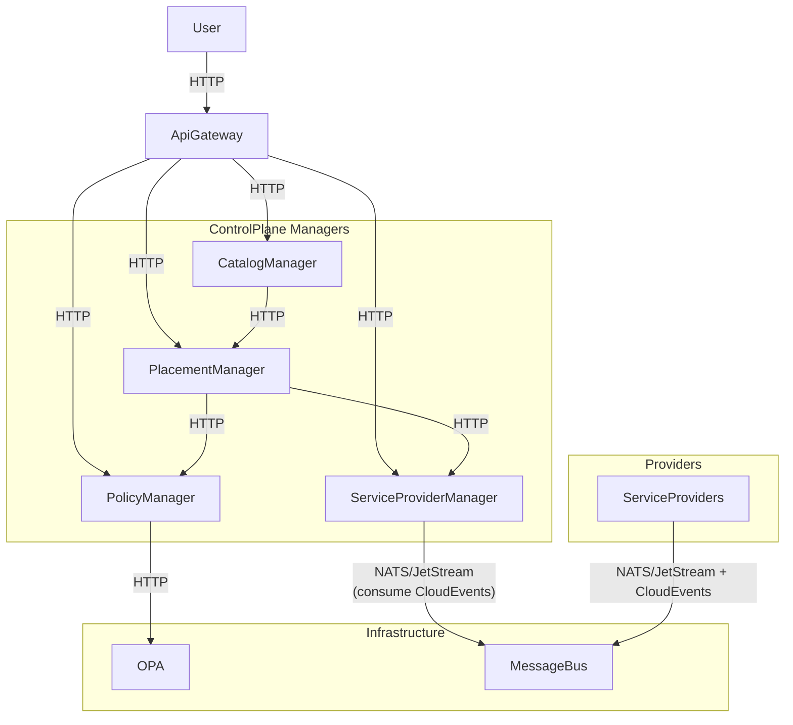
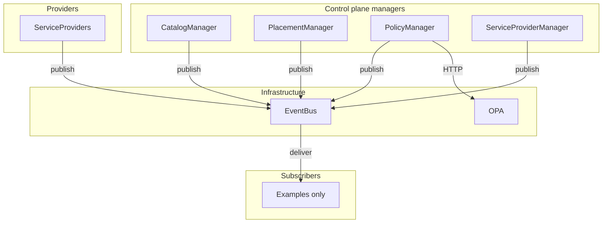
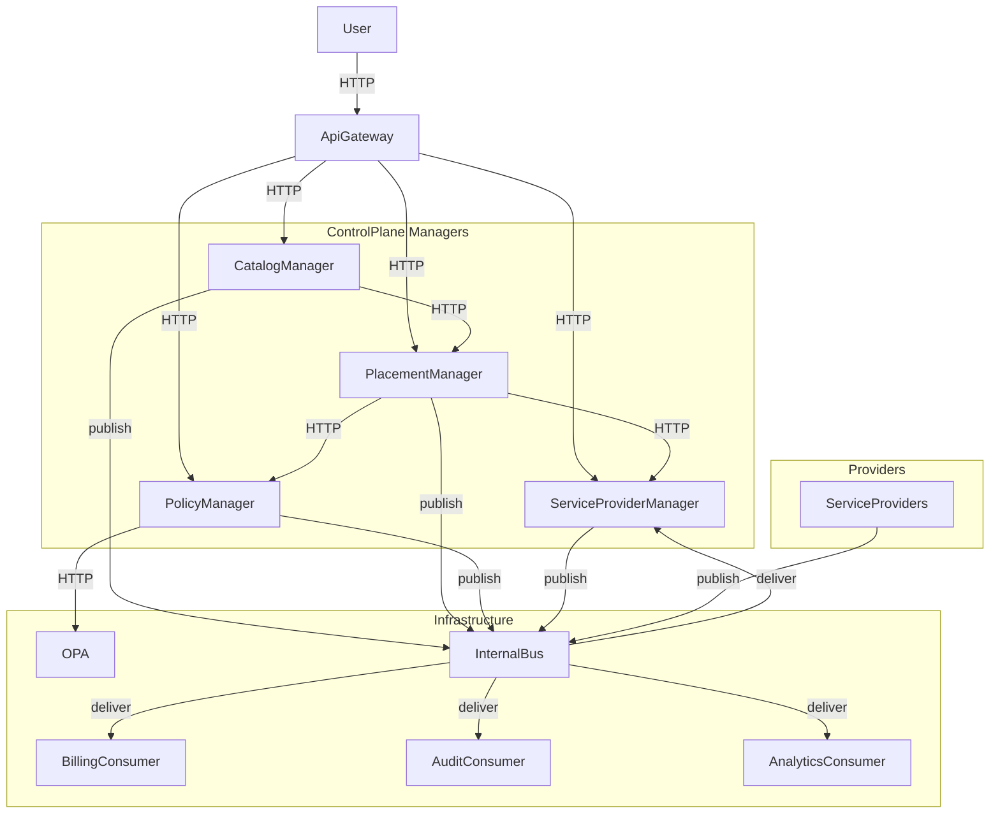
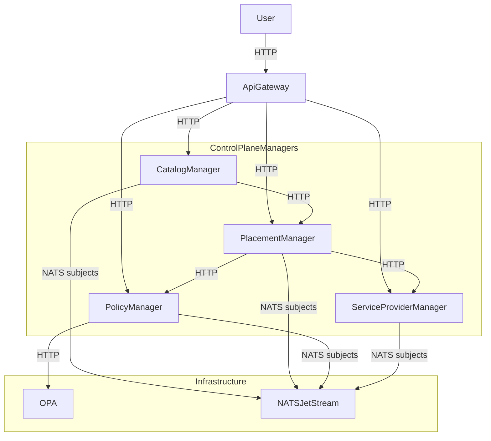
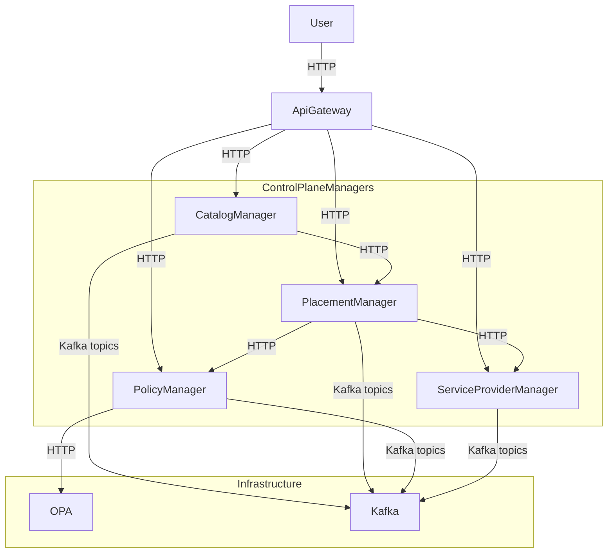
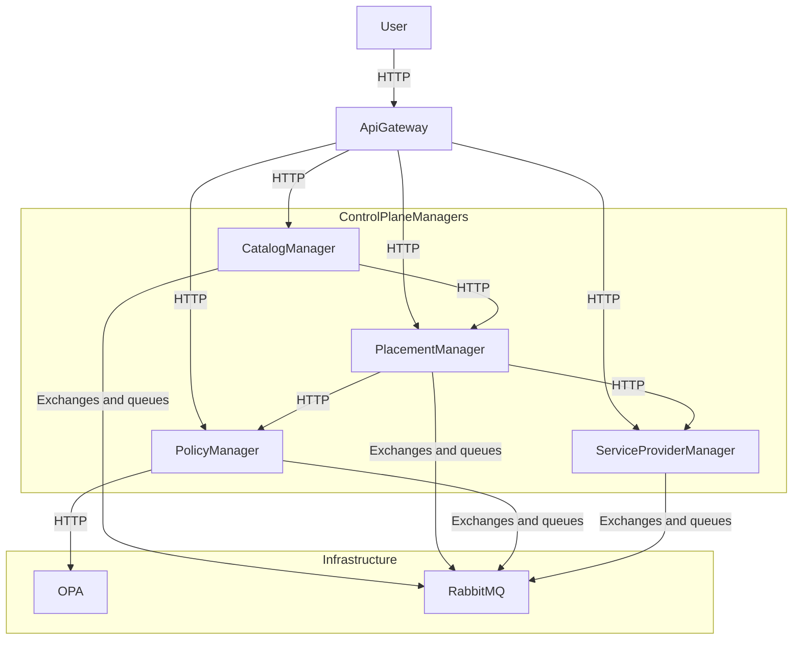

# Control Plane Message Bus

## Open Questions

1. Should DCM standardize on one broker for all internal asynchronous traffic,
   or allow per-domain broker choices behind a common event contract?
2. Which internal control plane flows should stay request/response by design
   (for example, create/delete commands), and which should move to asynchronous
   events?
3. Do we need multi-cluster or cross-region event routing in the first phase?
4. Should deployments prefer a customer-operated broker when one already exists
   and meets DCM needs (reuse Kafka, RabbitMQ, or similar), and use a DCM-managed or
   bundled internal broker only when the customer has no suitable messaging tier?
5. Should control-plane TLS (external APIs, internal manager HTTP, and broker
   connections) be defined in this enhancement or deferred to a dedicated TLS
   enhancement?

## Summary

The **proposed implementation** is a **hybrid** control-plane communication
model: keep synchronous HTTP for commands and immediate validation, and use a
message bus for asynchronous internal lifecycle and state events. The concrete
broker (for example NATS/JetStream, Kafka, or RabbitMQ) is not fixed in this
document. It is chosen per deployment behind a stable event contract, with
preference for reusing a customer-operated broker when one already fits DCM
needs.

The **Alternatives** section compares **broker-centric** patterns only (all
internal events on one product). Those are not the primary recommendation. They
inform broker choice under the hybrid model and document why a bus-only layout
is not adopted as the whole control plane story in one step.

The goal is to reduce coupling between components, let one published event reach
many downstream consumers without custom wiring, and keep operational complexity
visible before implementation.

## Motivation

Current DCM communication is mostly synchronous HTTP between managers, with
event-driven status reporting already used for Service Providers through
[NATS](https://docs.nats.io/) (Neural Autonomic Transport System) in the
[Service Provider Status Reporting via messaging system by
CloudEvents](../state-management/service-provider-status-reporting.md#summary)
enhancement. That split is workable today, yet it does not scale evenly:
synchronous manager-to-manager calls multiply coupling and retry behavior as
more flows and consumers are added, while status already benefits from a bus.
Without a clear internal event story, each new cross-cutting concern tends to
add more HTTP integration points, harder delivery to many subscribers, and a
wider blast radius when any manager or API path becomes a bottleneck.

### Goals

- Define clear communication boundaries between synchronous control-plane
  commands and asynchronous internal events.
- Define an as-is and to-be control plane topology that covers inter-manager
  communication and Service Provider status flows.
- Evaluate messaging integration against the current implementation using
  explicit tradeoffs:
  - Reuse of a customer-operated broker where possible.
  - Dedicated or bundled broker where that fits better (for example
    small-footprint installs), or when no suitable customer broker exists to
    reuse.
  - How representative products (NATS/JetStream, Kafka, RabbitMQ) map to those
    deployment models.
- Define implementation verification criteria for functional and operational
  behavior.

### Non-Goals

- Replacing all manager-to-manager request/response APIs in a single phase.
- Mandating one broker product as part of this design document alone.
- Requiring every customer to provision an additional DCM-only broker when they
  already operate a suitable enterprise messaging service that could be reused.
- Defining transport security (TLS and mTLS), authentication, authorization, or
  encryption policy for control-plane HTTP and message buses until Open Question 5
  is closed. If the answer is to define TLS in this document, relax this non-goal
  in a follow-up edit. If the answer is a dedicated TLS enhancement, keep that
  material there and link it from see-also when the path exists.
- Changing Service Provider domain payload semantics or lifecycle status models.

## Proposal

### Overview

This proposal recommends evolving DCM to a **hybrid** model (detailed in
[Proposed implementation](#proposed-implementation-hybrid-commands-and-events)
below): synchronous HTTP for commands, asynchronous bus for events, phased
rollout. [Current Topology](#current-topology-as-is) documents today’s shape
first, then the proposed hybrid. [Alternatives](#alternatives) evaluate **full
bus-centric** topologies per broker product. They support broker selection and
tradeoff discussion, not a competing primary design.

### Current Topology (As-Is)

The key points are listed below:

- Gateway and manager traffic is HTTP in local deployment.
- Internal manager URLs are configured as `http://...`.
- NATS is configured as `nats://...` for status events. Service Provider Manager
  consumes status with JetStream and explicit ack handling.
- Traefik reference stacks expose an unencrypted `web` entrypoint for local use.
- Persistence paths (SQL/DB) are unchanged and intentionally omitted from these
  diagrams for readability. Diagrams that show **all** manager event traffic on a
  single broker product (NATS, Kafka, or RabbitMQ) sit under
  [Alternatives](#alternatives) for comparison only.

### User Stories

#### Story 1

As a developer, I want to use a message bus for internal DCM communication so
lifecycle and state can flow asynchronously to many subscribers. I still want
synchronous HTTP where commands need immediate validation and stable call chains
between managers.

#### Story 2

As a platform engineer deploying DCM next to an existing messaging tier, I want
to reuse that broker when it meets DCM needs so the footprint does not require a
second cluster dedicated only to control-plane events.

#### Story 3

As someone building dashboards, billing, or audit flows on resource lifecycle, I
want stable internal event contracts so downstream logic can react without
custom polling of each manager API.

### Proposed implementation: hybrid commands and events

Managers and the API gateway keep **synchronous HTTP** for command
submission, validation, and manager-to-manager chains (including PolicyManager
to OPA). **Asynchronous domain events** (state and lifecycle) are published to
a message bus so many consumers can subscribe without new point-to-point HTTP
for every pair. Long-running work can complete behind the first HTTP response
using status and events. The bus implementation is **pluggable**: NATS/JetStream,
Kafka, RabbitMQ, or a customer-operated equivalent (see Open Question 4).

**Why not “everything on the bus.”** A broker-only design would force
command-style flows into fire-and-forget patterns, reply routing, and duplicate
handling without a clear gain for typical control-plane verbs. The hybrid
split matches how callers need immediate accept or reject feedback while still
gaining fan-out and decoupling for events.

Reference docs: [HTTP Semantics (RFC
9110)](https://www.rfc-editor.org/rfc/rfc9110),
[CloudEvents](https://cloudevents.io/), [NATS
Documentation](https://docs.nats.io/), [Kafka
Documentation](https://kafka.apache.org/documentation/), [RabbitMQ
Documentation](https://www.rabbitmq.com/docs/).

**Pros**

- Preserves existing command semantics and API contracts during adoption.
- Lower migration risk than replacing all manager HTTP in one phase.
- Room to standardize on open-source broker cores and avoid proprietary lock-in
  when choosing the bus product.
- Broker choice can follow customer footprint (reuse vs DCM-managed) without
  changing the command versus event split.

**Tradeoffs**

- Requires clear per-domain rules so teams do not mix patterns inconsistently.
- Temporary dual paths (HTTP commands plus bus events) add operational surface
  until rollout stabilizes.

The figure below shows **publish** from managers and Service Providers into the
bus and **deliver** from the bus to subscribers (same convention as the target
topology in Design Details). **PolicyManager to OPA** stays **HTTP**. **PlacementManager**
is with the other managers. **Service Providers** use the bus like the as-is
topology (for example status and lifecycle). Gateway and the rest of the manager
HTTP chain stay in [Current Topology](#current-topology-as-is).

## Design Details

This figure matches the [proposed hybrid
implementation](#proposed-implementation-hybrid-commands-and-events): same HTTP
command scaffold as the as-is diagram, plus asynchronous publication to a logical
bus.

The diagram is **broker-agnostic** on purpose. The node `InternalBus` is the
event channel from the hybrid proposal, not a product name. It generalizes the
as-is `MessageBus` role (today mainly Service Provider status on NATS) to
internal domain events from every manager and from Service Providers. Which
physical broker backs that channel is a deployment choice (see Open Question 4,
the [decision matrix](#decision-matrix-vs-current-implementation), and
broker-centric options under [Alternatives](#alternatives)).

Extra nodes such as BillingConsumer, AuditConsumer, and AnalyticsConsumer are
**examples** of possible bus subscribers (for instance billing, compliance, or
observability). They are not a committed roadmap, a required set of services,
or a fixed naming scheme. A real deployment may add different consumers, rename
them, or have none beyond `Service Provider Manager` until new work lands. In the
diagram, `publish` means async publication of domain events onto the bus, and
`deliver` means async fan-out to subscribers (not HTTP request/response).

## Design Details

### Communication Partitioning Model

DCM communication should be partitioned by intent:

- **Commands (sync):** operations where caller needs immediate response.
- **Events (async):** state transitions and lifecycle notifications that may
  have multiple downstream consumers.

**Why HTTP fits commands.** 
The caller or upstream manager usually needs a
definitive outcome in the same interaction (accepted, rejected, or validation
errors) so the API or next step in a chain can branch immediately. HTTP
request/response maps directly to that model, carries structured status and
error payloads that fit existing gateways and clients, and lines up with
familiar retries, timeouts, and tracing. Chaining several managers in order
stays explicit in the call graph instead of correlating command and reply topics
across components. Long-running work can still complete asynchronously behind
that first response using status and events. Putting every command on the bus
instead would push callers toward fire-and-forget plus reply routing, duplicate
delivery handling, and harder surfacing of failures back to the user without a
clear gain for typical control-plane verbs.

This partitioning keeps existing API contracts stable while improving internal
extensibility.

### Decision Matrix vs Current Implementation

Many customers already run a messaging platform (for example Kafka or RabbitMQ).
Where that footprint meets DCM needs, integration should bias toward reusing it
instead of assuming a net-new broker cluster solely for DCM. The columns below
name representative technologies. They stand in for “how we attach to
messaging,” not only “which new broker DCM ships.”

| [Criterion](#decision-matrix-vs-current-implementation) | [Current (sync HTTP + status events)](#current-topology-as-is) | [NATS/JetStream](#alternative-1-natsjetstream-centered-internal-events) | [Kafka](#alternative-2-kafka-centered-internal-events) | [RabbitMQ](#alternative-3-rabbitmq-centered-internal-events) | [Hybrid (this proposal)](#proposed-implementation-hybrid-commands-and-events) |
|---|---|---|---|---|---|
| Latency | Good for direct calls, with burst pressure on APIs | Low latency, good delivery to many subscribers | Higher end-to-end latency | Moderate latency | Depends on selected bus |
| Throughput burst handling | Limited by API capacity/retries | Good for bursty pub/sub | Strong for high throughput | Can bottleneck on broker routing | Improved where events are applied |
| Replay/Audit | Limited by API logs + DB history | Needs JetStream retention design | Strong built-in retention/replay | Queue-focused, replay less natural | Depends on broker + retention policy |
| Coupling | High for producer/consumer endpoints | Lower, subject-based decoupling | Lower, topic-based decoupling | Lower, exchange-based decoupling | Lower for evented flows |
| Operational complexity | Lower today | Moderate | Higher | Moderate-high | Phased complexity |
| Delivery semantics | Request/response semantics | At-most-once default, stronger with JetStream | Strong durability semantics | Strong ack/retry semantics | Per-flow semantics |
| Migration effort | Baseline | Incremental from existing usage | Higher migration and ops change | Moderate migration and ops change | Lowest risk migration path |
| Licensing and cost | No additional broker license | Open-source core, no paid hosted or enterprise lock-in | Open-source core, no paid proprietary platform features | Open-source core, no paid enterprise broker dependencies | Depends on selected broker and operating model |

### Risks and Mitigations

| Risk | Mitigation |
|---|---|
| Event contract drift across teams | Versioned event schemas and a published compatibility policy so producers and consumers do not silently diverge. |
| Duplicate or out-of-order processing | Idempotent consumers and stable event identifiers so retries and replays cannot corrupt state. |
| Mixed sync/async confusion | For each functional domain (for example catalog, placement, policy, or service provider lifecycle), keep a short written contract next to that code or team.  It should list which operations stay on synchronous HTTP for commands and immediate validation, which paths use the bus only for events, and how subjects or topics are named for that domain. |

### Test Plan

Implementation verification should include:

1. Unit tests for event schema validation and command/event boundary logic.
2. Integration tests for publish/consume behavior with failure injection.
3. E2E tests for key user flows under normal and degraded broker conditions.
4. Load tests comparing baseline API-only behavior vs event-enabled paths.

### Upgrade / Downgrade Strategy

- Roll out message-bus integrations one domain at a time, each gated by a
  configuration switch. While the switch is off, that domain keeps its current
  behavior. Turning the switch on enables the bus path for that domain only,
  and turning it off restores the previous path without requiring a full
  redeploy of the control plane.
- Keep current synchronous APIs as fallback during rollout.
- Allow per-domain rollback from async path to existing sync path.
- Migrate domains one at a time to control blast radius.

## Implementation History

<!-- TBD -->

## Drawbacks

- Adds architectural and operational complexity compared to all-sync HTTP.
- The team takes on more responsibility for cross-cutting messaging work:
  event contracts (schema versions, compatibility rules, and subject or topic
  naming so producers and consumers stay aligned) and broker posture (how the
  messaging tier is run, whether that is one broker process, a replicated
  deployment for availability, or a managed service, plus security, capacity,
  upgrades, and observability). If we do not
  keep investing there, contracts drift and broker changes can break consumers
  in ways that are harder to trace than a single failing HTTP call.
- Introduces new failure modes (consumer lag, topic/subject drift, replay bugs).

## Alternatives

The sections below are **broker-centric** reference designs: they assume
**all** internal event traffic from managers uses one broker product in the
diagram.

### Alternative 1: NATS/JetStream-Centered Internal Events

#### Description

NATS/JetStream is a lightweight messaging platform where services publish events
to subjects and consumers subscribe to those subjects. It is a good fit when DCM
needs low-latency delivery to many subscribers and simple operations, while
still supporting durable streams and replay when JetStream is enabled. Official
docs: [nats.io](https://nats.io/), [NATS Documentation](https://docs.nats.io/),
[JetStream](https://docs.nats.io/nats-concepts/jetstream).

#### Pros

- Aligns with existing DCM status reporting direction.
- Low latency and simple routing so one publish can reach many subscribers.
- Supports incremental adoption from current footprint.
- Open-source core broker fits a no-new-license path.

#### Cons

- Requires explicit stream/retention design to guarantee replay.
- Semantics can vary by subject unless conventions are enforced.
- Managed or enterprise add-ons can reintroduce license/cost pressure.

#### Status

Rejected

#### Rationale

Viable option, but not selected as the standalone recommendation because DCM
still needs an explicit command/event split strategy (hybrid model) rather than
a broker-only decision.

### Alternative 2: Kafka-Centered Internal Events

#### Description

Kafka is a distributed event streaming platform that stores events in durable,
ordered logs (topics). It is a good fit when DCM needs long event retention,
strong replay capabilities, and independent consumer groups processing the same
event stream at different speeds. Official docs: [Apache
Kafka](https://kafka.apache.org/), [Kafka
Documentation](https://kafka.apache.org/documentation/).

#### Pros

- Strong retention and replay for audit-heavy event domains.
- Mature consumer-group model for downstream services.
- Open-source core broker is available for self-managed deployment.

#### Cons

- Higher operational footprint and platform complexity.
- May be heavier than needed for near-real-time state propagation.
- Enterprise ecosystems around Kafka can increase cost if not constrained.

#### Status

Deferred

#### Rationale

Strong technical fit for replay-heavy workloads, but deferred for phase one due
to higher operational cost and migration complexity.

### Alternative 3: RabbitMQ-Centered Internal Events

#### Description

RabbitMQ is a message broker centered on queues and exchanges. Producers send
messages to exchanges, exchanges route to queues, and consumers acknowledge
processing. It is a good fit when DCM needs explicit routing control and
work-queue style distribution. Official docs:
[RabbitMQ](https://www.rabbitmq.com/), [RabbitMQ
Documentation](https://www.rabbitmq.com/docs/).

#### Pros

- Flexible routing and mature acknowledgement behavior.
- Useful for queue-oriented processing patterns.
- Open-source core broker supports no-new-license adoption.

#### Cons

- Exchange/queue lifecycle management adds configuration overhead.
- May become complex at large dynamic scale.
- Certain advanced enterprise features can introduce extra license costs.

#### Status

Deferred

#### Rationale

Useful for queue-driven integration patterns, but not preferred for DCM phase
one compared to hybrid strategy with NATS/JetStream-first implementation.

## Infrastructure Needed

- Broker deployment model for non-development environments.
- Observability for event lag, retries, and dead-letter behavior.
