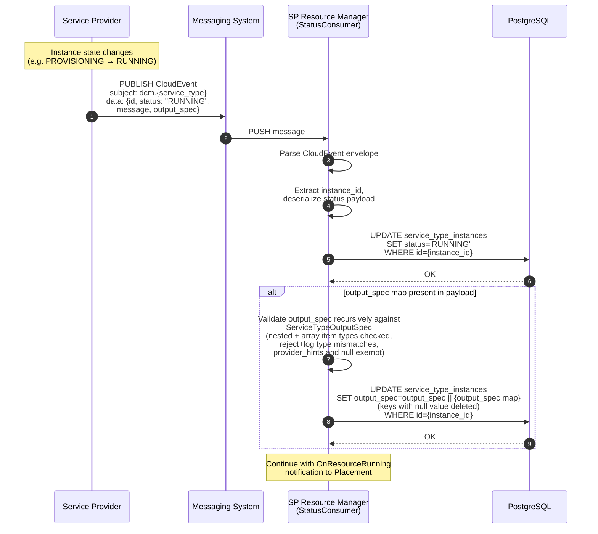
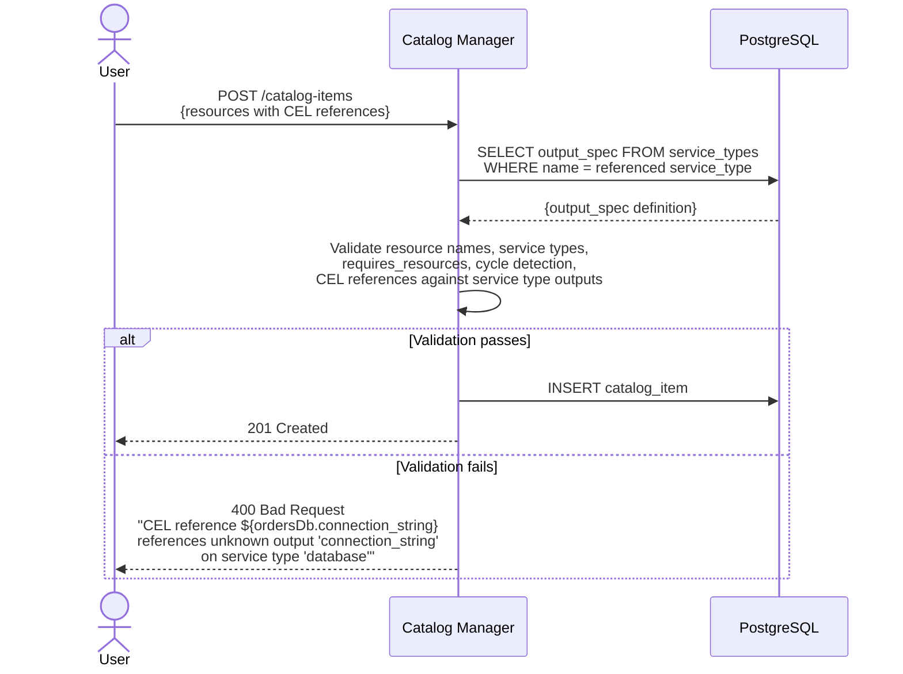

# Cross-Provider Outputs

## Summary

This enhancement adds the output data layer for cross-service provider metadata
sharing: a standard `output_spec` map in service provider CloudEvent status
payloads, persistent storage in an `output_spec` column on the
`service_type_instances` table (typed JSONB), typed output definitions on the
service type (consistent with how input schemas are already defined), validation
of published outputs against those definitions at capture time, and CEL
reference validation at authoring time.

## Motivation

Consumer developers and platform engineers need to provision multi-resource
(composite) catalog items where resources depend on runtime metadata from other
resources managed by different service providers (e.g., load balancers needing
backend service endpoints, containers needing database connection strings).

DCM currently cannot enable this because:

1. **No Output Publishing** - Service providers do not populate a standard
   `output_spec` field. Runtime data exists within provider-specific response
   structures but is not surfaced in a provider-agnostic way.

2. **No Output Persistence** - The `service_type_instances table` captures `id`,
   `status` and `status_message` but not the runtime output data; outputs are
   not retained for downstream consumption.

3. **No Output Definition on Service Types** - Service types define their input
   schema (the spec fields accepted for provisioning) but not their output
   schema. DCM has no way to know what outputs a given service type produces,
   which prevents authoring-time validation of CEL output references and leaves
   no typed contract to validate published outputs against once providers (which
   are independently authorable) start emitting them.

### Goals

1. **Output Publishing & Persistence** - Read runtime outputs from a standard
   `output_spec` map in service provider CloudEvent status payloads. Store
   outputs persistently in an `output_spec` column on the
   `service_type_instances` table as typed JSONB. The same mechanism works for
   any service provider combination, regardless of underlying platform.

2. **Typed Output Definition on Service Types** - Extend the service type
   definition with an `output_spec` definition (a typed schema per service type,
   scalar and structured) that declares which output fields a service type
   produces. Outputs are internal to the service type, defined centrally in the
   Catalog domain alongside the input schema, not declared per catalog resource
   or per provider.

3. **Output Validation at Capture** - Validate published outputs recursively
   against the service type's output definition before storage, so mistyped or
   undeclared outputs are rejected at the boundary rather than propagating to a
   downstream consumer. The reserved `provider_hints` object and explicit `null`
   retracts are exempt.

4. **Authoring-Time CEL Reference Validation** - Provide the output definition
   that enables validating CEL output references at catalog item authoring time:
   references must resolve to declared outputs of resources declared as
   dependencies. (This enhancement supplies the definition to validate against;
   it does not build the CEL engine.)

### Non-Goals

- **Multi-Resource Orchestration** - Graph-based provisioning, topological
  sorting, and dependency-ordered resource creation are defined in the
  [declarative-api](/enhancements/declarative-api/declarative-api.md)
  enhancement.
- **Instance-Level Relationships** - Resources provisioned from different
  catalog items cannot reference each other's metadata.
- **Real-Time Metadata Updates** - Metadata is captured once at provisioning
  time. Changes to upstream resources are not propagated.
- **Provider-to-Provider Direct Calls** - Providers communicate through the DCM
  control plane, not peer-to-peer.
- **Provision-Time Value Injection** - Defining, capturing, storing, validating,
  and authoring-time-checking outputs is in scope for any shape (scalar and
  structured). Injecting a resolved output into a consuming resource at
  provision time is out of scope: it depends on declarative-api orchestration.
- **UDLM Relationships** - Full bidirectional UDLM relationship model is
  deferred until UDLM is released.

## Proposal

### Overview

1. **Output Definition on Service Types:** The service type definition is
   extended with an `output_spec` definition that declares which output fields a
   service type produces. Providers implement the contract by populating the
   declared output fields in their CloudEvent status payloads.

2. **Output Capture (Provider to DCM):** When a resource's status changes, the
   service provider publishes a CloudEvent status event that includes a standard
   `output_spec` map in the data payload, populated according to the output
   fields defined for its service type. The StatusConsumer, already processing
   status events per the
   [sp-resource-status-reader](/enhancements/sp-resource-status-reader/sp-resource-status-reader.md)
   enhancement, extracts the `output_spec` map and stores it in the
   `output_spec` column of the resource's `service_type_instances` row. Capture
   happens for every provisioned resource, regardless of whether outputs are
   consumed downstream.

3. **CEL Reference Validation (Authoring Time):** When a catalog item is
   created, DCM validates all CEL output references (`${resource.outputName}`)
   against the service type's output definition. The Catalog domain already owns
   the service type definitions, so no cross-domain call is needed for
   validation.

4. **Stored Outputs for CEL Resolution:** The `output_spec` column on
   `service_type_instances` provides the data store that the declarative-api's
   two-phase CEL evaluation reads from when resolving output references like
   `${ordersDb.connection_string}`.

**MVP delivers independently:**

- Output definitions on service types, scalar and structured (nested object and
  array item types)
- Single-resource capture of outputs of any shape (provision a resource, read
  and store its outputs), validated recursively against the definition
- CEL reference validation at catalog item authoring time, including nested and
  indexed reference paths
- Internal retrieval of stored outputs (`GetOutputSpec`) for CEL resolution; the
  output _schema_ is exposed publicly via the Service Type Response, while a
  public endpoint for output _values_ is deferred pending an authz model

**Requires declarative-api orchestration:**

- End-to-end cross-provider flow where outputs from one resource are injected
  into another at provision time via CEL resolution

### Assumptions

- Service providers add an `output_spec` map to their CloudEvent status payloads
- The StatusConsumer's message processing pipeline can be extended to extract
  and store outputs from status events

### User Stories

#### Story 1: Single-Resource Output Capture (MVP)

**As a platform engineer**, I define a database catalog item:

```yaml
resources:
  - name: ordersDb
    service_type: database
    fields:
      - path: engine
        default: postgresql
      - path: version
        default: "18"
```

The `database` service type defines the output field `connection_string` in its
service type spec. When a consumer provisions this catalog item and the resource
reaches `Running` status, the service provider publishes a CloudEvent status
event that includes the `output_spec` map. The StatusConsumer processes this
event and stores the outputs in the `output_spec` column of the instance row. No
per-resource output declaration is needed, the outputs are defined by the
service type.

#### Story 2: CEL Reference Validation at Authoring Time (MVP)

**As a platform engineer**, I create a multi-resource catalog item with CEL
output references:

```yaml
resources:
  - name: ordersDb
    service_type: database
    fields:
      - path: engine
        default: postgresql
      - path: version
        default: "18"

  - name: app
    service_type: container
    requires_resources: [ordersDb]
    fields:
      - path: process.env[0].name
        default: DATABASE_URL
      - path: process.env[0].value
        default: "${ordersDb.connection_string}"
```

DCM validates at creation time that `ordersDb` exists, is in `app`'s
`requires_resources`, and that the `database` service type defines
`connection_string` in its output definition (the structured
`ServiceTypeOutputSpec` schema of named fields, not the output _values_ captured
at runtime). Invalid references are rejected with clear errors.

#### Story 3: Database + Application (Target State)

**As a consumer developer**, I provision a catalog item containing a PostgreSQL
database and a web application where the application automatically receives the
database connection string.

> **Note:** This story requires the
> [declarative-api](/enhancements/declarative-api/declarative-api.md)
> orchestration in addition to the output primitives built here.

### Implementation Details/Notes/Constraints

**Three meanings of "outputs":**

"Outputs" refers to three distinct things: the output _definition_ (structured,
authored on the service type) and the output _values_ it produces at runtime
(typed per service type, captured then resolved). CEL validation checks
references against the definition; CEL resolution reads the values.

| Term                        | What it is                                                           | Shape                          | Where it lives                                                                |
| --------------------------- | -------------------------------------------------------------------- | ------------------------------ | ----------------------------------------------------------------------------- |
| Output **definition**       | Fields a service type declares it produces (name, type, description) | Structured, named fields       | `ServiceTypeOutputSpec`; the `output_spec` field on the Service Type Response |
| Stored output **values**    | Runtime values captured for an instance                              | Typed per service type (JSONB) | `output_spec` column on `service_type_instances`                              |
| Published output **values** | Runtime values a provider emits on status change                     | Typed per service type         | `output_spec` map in the CloudEvent status payload (NATS)                     |

**Service Type Output Contract:**

Output fields are drawn from the service type's spec field definitions in
`api/catalog/v1alpha1/servicetypes/<type>/spec.yaml` (the `readOnly` fields
added in control-plane PR #41). These are the primary source for the declared
output field names: the same names that appear in the spec schema are what
providers publish in their CloudEvent status payload's `output_spec` map, with
no separately-invented field set for the declared contract. Fields marked
`readOnly: true` must not be set at authoring time and appear in GET responses
as runtime state, so a single spec definition serves both the REST API shape and
the declared output contract. All declared fields are strictly typed.
Provider-specific data that falls outside the declared schema goes in a single
reserved `provider_hints` object within `output_spec`: it is opaque, populated
at the provider's discretion, and the only part of `output_spec` not validated
against the output definition.

How a provider maps its internal data to the declared fields is an
implementation detail of the provider. For example, the database SP populates
`connection_string` from its internal connection metadata; the contract defines
what fields must be present, not how they are sourced.

**CloudEvent Status Payload Extension:**

Providers extend their existing CloudEvent status payload with an optional
`output_spec` map:

```json
{
  "id": "db-uuid-123",
  "status": "RUNNING",
  "message": "Database is running",
  "output_spec": {
    "connection_string": "jdbc:postgresql://10.0.1.5:5432/orders"
  }
}
```

Output values may be scalars or structured types (arrays, nested objects),
matching the shape defined in the service type spec. For example, a container
provider publishes structured outputs:

```json
{
  "id": "container-uuid-456",
  "status": "RUNNING",
  "message": "Container is running",
  "output_spec": {
    "namespace": "default",
    "endpoints": [
      { "address": "10.96.45.12", "port": 8080, "scope": "internal" }
    ],
    "provider_hints": { "node": "worker-3" }
  }
}
```

Service providers are expected to emit values with the types declared in the
service type's output definition, for example, if a `port` is an integer in the
`output_spec` map then it's populated as integer and also stored as an integer
in the JSONB column.

However, the actual enforcement boundary is the control plane: since anyone can
author a service provider, the control plane, before storing, validates the
captured `output_spec` recursively against the service type's output definition,
descending into nested object fields and array item types. A drifted type (e.g.
a `port` sent as a string, whether top-level or nested inside an `endpoints[]`
item) is caught at capture and rejected before it is stored, rather than being
persisted as a contract violation and propagated to a downstream consumer. Two
things are exempt from the check: the `provider_hints` object (see the Service
Type Output Contract above) and an explicit `null` value.

A provider retracts a stale output by publishing an explicit `null` value for
its key; the StatusConsumer deletes that key on merge (see the capture sequence
diagram below). Keys absent from the payload are left untouched.

**CEL Output Reference Syntax:**

`${<resourceName>.<outputPath>}`, where `outputPath` is an output field name
with optional nested and indexed access (e.g. `endpoints[0].address`). A
reference resolves to the referenced field's value — a string, a non-string
scalar, or a nested object/array. This is the grammar authoring-time validation
checks references against, and it aligns with the CEL syntax defined in the
catalog-item-schema and declarative-api enhancements.

**Rehydration:** Follows the same provisioning path as initial creation. Old
outputs are cleaned up automatically when old resource instance rows are
removed.

### Risks and Mitigations

| Risk                                                                         | Mitigation                                                                                                                                                                                                                                                                                     |
| ---------------------------------------------------------------------------- | ---------------------------------------------------------------------------------------------------------------------------------------------------------------------------------------------------------------------------------------------------------------------------------------------- |
| Service providers must extend CloudEvent status payloads                     | Additive, non-breaking. Roll out incrementally.                                                                                                                                                                                                                                                |
| Outputs column growth                                                        | Outputs are deleted automatically when the instance row is deleted; individual stale keys can be retracted via a `null` value. Future phase adds TTL-based cleanup if needed.                                                                                                                  |
| CEL reference errors in catalog items                                        | Validation at creation time catches errors before provisioning.                                                                                                                                                                                                                                |
| End-to-end flow requires declarative-api orchestration                       | MVP delivers standalone value: output capture and CEL validation.                                                                                                                                                                                                                              |
| Output field names drift from spec definitions                               | Output field names are drawn directly from the spec field definitions, one source of truth. No separately-invented field set to diverge.                                                                                                                                                       |
| Output value type drift (a provider changes a field's type)                  | Captured values are validated recursively against the service type's output definition before storage (see CloudEvent Status Payload Extension), so a drifted type — top-level or nested inside an array/object — is rejected at capture rather than propagating to a downstream CEL consumer. |
| Structured output field/type definitions diverge from UDLM once it finalizes | Structured definitions are transcribed to best current knowledge and flagged for reconciliation — the same posture already accepted for scalar fields. The blast radius is a catalog-side spec edit, not a wire/contract break (see Output Typing and UDLM Alignment).                         |

## Design Details

### Sequence Diagram: Single-Resource Output Capture (MVP)

Resource creation follows the existing flows defined in the
[placement-manager](/enhancements/placement-manager/placement-manager.md) and
[user-flows](/enhancements/user-flows/user-flows.md) enhancements. Status
reporting follows the
[sp-resource-status-reader](/enhancements/sp-resource-status-reader/sp-resource-status-reader.md)
enhancement. This diagram shows how the StatusConsumer's existing status event
pipeline is extended to capture outputs when a resource reaches `Running`
status.



### Sequence Diagram: CEL Reference Validation at Authoring Time



> For the target-state flow where outputs are injected during DAG provisioning,
> see the [declarative-api](/enhancements/declarative-api/declarative-api.md)
> enhancement.

### Output Typing and UDLM Alignment

UDLM defines the schema and types of a resource's outputs. This enhancement
consumes those types rather than inventing a parallel system: it transcribes the
UDLM-defined output fields and their types into the service type spec
(`spec.yaml`, following the existing input-schema pattern) and validates CEL
references against them. Pinning to concrete UDLM version is covered in
enhancement "Aligning DCM with UDLM".

### What the MVP Covers

The MVP covers the full output pipeline up to — but not including —
provision-time injection, and it does so for outputs of **any shape** (scalar or
structured):

- **Definition:** output fields and their types are declared on the service type
  spec (`spec.yaml`), including nested object fields and array item types (e.g.
  `endpoints[]{address, port, scope}`).
- **Capture and storage:** the StatusConsumer stores captured values in the
  `output_spec` JSONB column whatever their shape.
- **Capture-time validation:** captured values are validated recursively against
  the definition (nested object fields and array item types included) before
  storage.
- **Authoring-time CEL reference validation:** references are checked against
  the definition, including nested and indexed paths
  (`${container.endpoints[0].address}`).

Structured is included because the cost is small: the definition is authored in
the same `spec.yaml` already being extended, JSONB stores nested values
natively, and validation is one recursive walk of the same schema (see the Data
Model worked example). It does not depend on a separate typed-value transport.

**Deferred:** provision-time injection of a resolved value into a consuming
resource. This depends on declarative-api's DAG orchestration (see Non-Goals),
regardless of output shape.

### Data Model

**Service Type Output Definition (extension to service type spec):**

```yaml
ServiceTypeOutputSpec:
  type: object
  description: >
    Declares the output fields a service type produces. Defined centrally on the
    service type, alongside the input schema. Keys are output field names drawn
    from the service type's spec field definitions; values define the type and
    description of each output (scalars, arrays, or nested objects). This is the
    output *definition*, a structured, named-field schema. It is returned as the
    `output_spec` field on the Service Type Response (see API Changes) and is
    the schema that authoring-time CEL reference validation checks against. It
    is distinct from the captured output *values* (the `output_spec` column on
    `service_type_instances` and the `output_spec` map in the CloudEvent status
    payload), which conform to this same schema.
  additionalProperties:
    type: object
    properties:
      type:
        type: string
        description:
          JSON type of the output value (string, integer, array, object)
      description:
        type: string
        description: Human-readable description of the output field
```

**Worked example, the `container` service type's output definition:**

```yaml
output_spec:
  namespace:
    type: string
    description: Kubernetes namespace the container runs in
  endpoints:
    type: array
    description: Network endpoints exposed by the container
    items:
      type: object
      properties:
        address:
          type: string
        port:
          type: integer
        scope:
          type: string
          description: internal or external
```

A catalog item references these outputs by path, for example
`${container.namespace}` (scalar) or `${container.endpoints[0].address}`
(indexed into the structured `endpoints[]` field). There is no `api_endpoint`
field. The container schema exposes `endpoints[]{address, port, scope}`, per PR
#41.

**Stored Outputs (column on `service_type_instances`):**

```yaml
output_spec:
  type: object
  description: >
    Captured outputs stored as JSONB, conforming to the service type's
    `ServiceTypeOutputSpec` schema. Keys match those declared in the output
    definition; values are captured from the CloudEvent status payload.
  additionalProperties: true
```

**Instance Repository Operations (additions to existing repository):**

| Operation          | Input                    | Output                               | Description                                                                           |
| ------------------ | ------------------------ | ------------------------------------ | ------------------------------------------------------------------------------------- |
| UpdateOutputSpec   | instance_id, outputs map | error                                | Merge outputs into the instance row's outputs column; a `null` value deletes that key |
| GetOutputSpec      | instance_id              | outputs map, error                   | Retrieve outputs for a single resource                                                |
| GetOutputSpecBatch | instance_id list         | map of instance_id to outputs, error | Retrieve outputs for multiple resources                                               |

### API Changes

**Output schema exposure (public):**

The service type's output _definition_ is already exposed publicly through the
Service Type Response (`GET /api/v1alpha1/service-types/{name}`, below), so
consumers can discover what outputs a service type produces without exposing any
runtime values.

```
GET /api/v1alpha1/service-type-instances/{id}/output-spec
```

**Output values (internal for MVP):**

Stored output _values_ are retrieved internally via the `GetOutputSpec`
repository operation for CEL resolution during DAG provisioning. A public
endpoint for reading instance output values is deferred: output values can be
credential-shaped, so exposing them requires an authn/authz model that is out of
scope for this MVP. A future phase may add such an endpoint once that
access-control model is defined:

**Extended: CloudEvent Status Payload**

The CloudEvent data payload defined in the
[service-provider-status-reporting](/enhancements/state-management/service-provider-status-reporting.md)
enhancement is extended with an optional `output_spec` field:

```yaml
StatusEventData:
  type: object
  properties:
    id:
      type: string
    status:
      type: string
    message:
      type: string
    output_spec:
      type: object
      description: >
        Provider-agnostic runtime data conforming to the service type's
        `ServiceTypeOutputSpec` schema. Keys match the output fields defined on
        the service type. An explicit `null` value retracts (deletes) that key
        on merge. Absent or empty when the resource has no outputs to publish. A
        reserved `provider_hints` object may carry opaque provider-specific
        values and is not validated against the output definition.
      additionalProperties: true
```

**Extended: Service Type Response**

`GET /api/v1alpha1/service-types/{name}` returns an `output_spec` field
alongside the existing `spec`:

```yaml
ServiceType:
  type: object
  properties:
    uid:
      type: string
      readOnly: true
    api_version:
      type: string
    service_type:
      type: string
    spec:
      type: object
      description: Input schema (existing, defines provisioning fields)
      additionalProperties: true
    output_spec:
      type: object
      description: >
        The service type's output definition (see ServiceTypeOutputSpec).
        Declares the output fields this service type produces for CEL
        cross-provider references. Any provider implementing this service type
        is expected to populate these fields in its CloudEvent status payload.
      additionalProperties:
        type: object
    path:
      type: string
      readOnly: true
    create_time:
      type: string
      format: date-time
      readOnly: true
    update_time:
      type: string
      format: date-time
      readOnly: true
```

### Testing Strategy

Golden file tests for capture-time validation: maintain reference files per
service type (CloudEvent status payload, the service type's
`ServiceTypeOutputSpec`, expected stored `output_spec` after merge). Unit tests
assert payload + definition -> stored outputs, covering the recursive path
(nested objects, array item types), the `provider_hints` and `null` exemptions,
and rejection of drifted/undeclared fields.

CEL reference validation unit tests assert that references resolving against a
service type's output definition pass and that unknown-output and
missing-dependency references are rejected with clear errors. (Cross-resource
cycle detection is declarative-api's DAG concern, out of scope here.)

Migration: a test asserts GORM AutoMigrate adds the `output_spec` column to
`service_type_instances` on a fresh database, is idempotent on re-run, and leaves
existing rows with an empty/null `output_spec`.

Backward-compatibility: a status payload from an SP that omits `output_spec` is
captured as a no-op — the row's existing outputs and status are preserved with no
error — covering the old-provider case.

Integration tests with real SPs (storage first for the scalar path, container
for structured capture) added as needed.

### Upgrade / Downgrade Strategy

**Upgrade:** The `output_spec` column is added to `service_type_instances` via
GORM AutoMigrate alongside the existing domain table migrations. Providers add
`output_spec` to CloudEvent status payloads incrementally.

**Downgrade:** Deploy the previous control-plane image. The `output_spec` column
remains inert; the `output_spec` field in CloudEvent payloads and on service
type definitions is ignored by older versions.

## Implementation History

- 2026-07-31: Initial enhancement proposal created.

## Drawbacks

1. **Structural Dependency on Declarative-API** - The primary use case
   (injecting outputs across providers at provision time) requires the
   declarative-api's DAG orchestration. This enhancement is designed to be
   implemented and tested independently, but its full value is realized only
   when both are deployed.

## Alternatives

### Alternative 1: Provider-to-Provider Direct Calls

#### Description

Service providers call each other directly to share metadata.

#### Pros

- No central coordination required; lower latency

#### Cons

- Tight coupling between providers (N-squared complexity)
- Breaks provider isolation model; no central audit trail

#### Status

Rejected

#### Rationale

Violates DCM's provider isolation model.

### Alternative 2: Separate NATS Topics for Metadata

#### Description

Providers publish metadata to dedicated NATS topics (e.g., `dcm.outputs.*`)
separate from status events, with a new consumer that processes output messages
independently.

#### Pros

- Decouples output delivery from status reporting
- Allows independent scaling of output and status consumers

#### Cons

- Adds a second consumer and topic hierarchy to maintain
- Outputs and status may arrive out of order, complicating the OnResourceRunning
  notification (status says Running but outputs have not arrived yet)

#### Status

Rejected

#### Rationale

Piggybacking outputs on the existing status event payload avoids a second
consumer and guarantees that outputs and status arrive atomically in the same
message. The ordering concern outweighs the separation-of-concerns benefit.

### Alternative 3: Synchronous Polling via Service Provider GET

#### Description

After the StatusConsumer receives a `Running` status event via NATS, the SP
Resource Manager makes a single HTTP GET request to the service provider's
resource endpoint to retrieve the full resource state including outputs. The
provider adds an `output_spec` map to its existing GET response.

#### Pros

- Provider outputs are fetched on demand, so the CloudEvent status payload does
  not need to change
- Outputs are guaranteed to reflect the provider's current state at query time

#### Cons

- Introduces a new call pattern: the SP Resource Manager currently only calls
  providers for create and delete, not for status queries
- Adds a synchronous HTTP round-trip after every `Running` transition, including
  error handling, retries, and timeouts for a call that may fail independently
  of the status event
- Couples output availability to provider reachability at query time. If the
  provider is briefly unreachable after publishing `Running`, the outputs poll
  fails even though the resource is healthy

#### Status

Rejected

#### Rationale

The extra HTTP round-trip is redundant when the provider can include outputs in
the status event it already publishes. Embedding outputs in the CloudEvent
payload keeps the capture path purely event-driven with no new call patterns and
no additional failure modes.

### Alternative 4: `readOnly` Spec Fields as the Sole Output Definition

#### Description

Use the `readOnly: true` markers in the service type spec YAML as the sole
output contract, eliminating the separate `output_spec` field on the
`ServiceType` model. The CEL validation function derives output field names by
scanning the spec for `readOnly: true` entries rather than reading a dedicated
`Outputs` field.

#### Pros

- Single source of truth: one definition in spec.yaml covers both the REST API
  shape and the output contract
- PR #41's `readOnly` fields become the canonical output definition
- No separately-invented output field names to maintain

#### Cons

- The `readOnly` JSON Schema marker conflates two different semantics: "do not
  let users set this field" (input validation) and "this is a cross-provider
  output" (CEL contract). These are independent concerns.
- Discovering CEL-referenceable output fields by scanning and parsing the spec
  schema at validation time is more complex than reading a dedicated field.

#### Status

Partially adopted

#### Rationale

The field naming principle of this alternative was adopted: output field names
are drawn from the spec field definitions (PR #41) rather than a
separately-invented set. However, the `output_spec` field on the `ServiceType`
model is retained for efficient CEL reference validation and API responses,
populated from the spec definitions. The runtime scanning approach (deriving
output names by parsing the spec schema at validation time) was not adopted. A
dedicated `output_spec` field is simpler to query and does not require
schema-walking logic.

### Alternative 5: Separate `output_spec` Table

#### Description

Store outputs in a dedicated `output_spec` table with a foreign key referencing
`service_type_instances.id` and CASCADE DELETE.

#### Pros

- Independent schema evolution: the outputs table can grow columns (e.g. TTL,
  version) without touching the instance table
- Explicit foreign key makes the relationship visible in the schema

#### Cons

- Adds a new table, new repository (~200 LOC), and a JOIN or second query
  everywhere instance outputs are needed
- Diverges from the established DCM pattern: the `spec` column on
  `service_type_instances` already stores flexible input as JSONB using the same
  GORM serialization approach
- CASCADE DELETE is redundant. The column approach achieves the same cleanup
  automatically as part of the row deletion
- GORM AutoMigrate cannot handle new tables without explicit registration;
  column additions to an existing model are handled automatically

#### Status

Rejected

#### Rationale

The `output_spec` column on `service_type_instances` is simpler, follows the
existing `spec` JSONB pattern, requires no new repository, and cleans up
automatically.

### Alternative 6: Opaque Output Values

#### Description

Store and publish output _values_ as an opaque `additionalProperties: true` map,
keeping only the output _definition_ typed.

#### Pros

- Providers can add fields without a schema change
- Simplest possible capture path (store the map verbatim)

#### Cons

- A provider changing a field's type (e.g. `port` integer → string) breaks a
  downstream CEL consumer silently, with no schema-level signal
- The stored/published shape diverges from the typed definition, so the two must
  be reconciled by hand rather than by one schema

#### Status

Rejected

#### Rationale

Capture-time validation against the typed definition (see CloudEvent Status
Payload Extension) catches the exact failure mode that makes an opaque map
unsafe: silent type drift reaching a downstream CEL consumer. The flexibility
this alternative offers is retained through the reserved `provider_hints`
extension point rather than a fully-opaque map.

## Infrastructure Needed

N/A. Uses existing DCM infrastructure (PostgreSQL, service type definition
mechanism).
