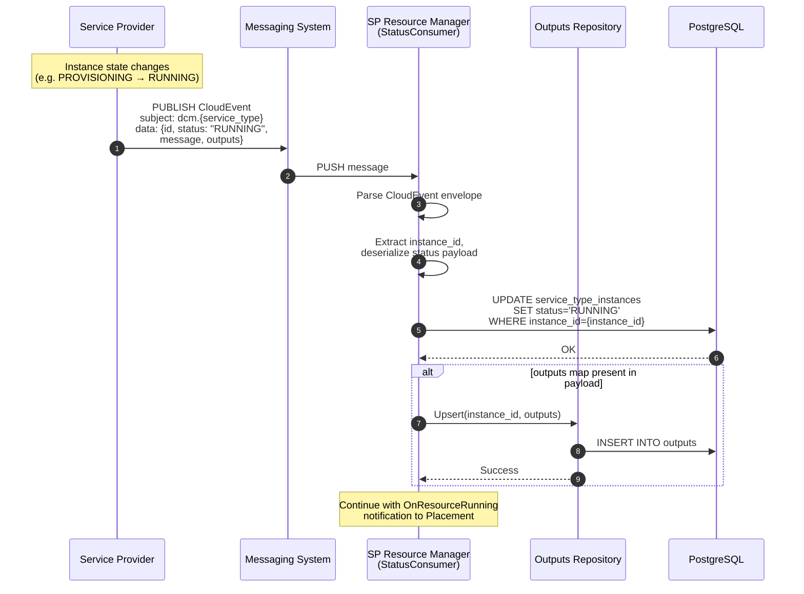
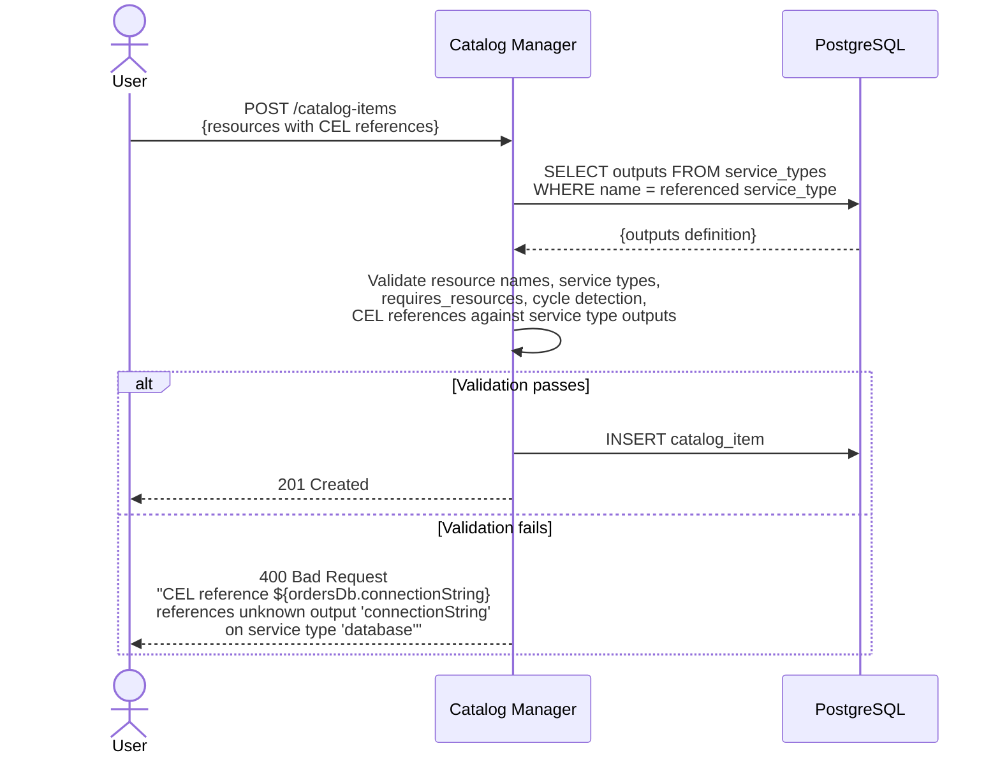

# Cross-Provider Outputs

## Open Questions

1. **Service Provider Outputs Implementation:** Which service providers should
   implement the `outputs` map first?
   - **Proposed:** Start with k8s-container-sp and the k8s-storage-sp, enabling
     a composite catalog item where a container references outputs. Then the
     cloudnative-pg-database-sp as it matures.

2. **Output Capture Semantics:** Should output capture use merge semantics
   (preserve existing keys, update provided keys) or replace semantics
   (overwrite the entire map on each status event)?
   - **Proposed:** Merge. The Upsert operation merges incoming keys into the
     stored outputs map — new keys are added, existing keys are updated, keys
     absent from the payload are preserved. A status event with no `outputs`
     field is a no-op (no overwrite with empty). Explicit cleanup happens via
     CASCADE DELETE on instance removal.

## Summary

This enhancement adds the output data layer for cross-service provider metadata
sharing: a standard `outputs` map in service provider CloudEvent status
payloads, persistent storage in an `outputs` table (typed JSONB), output
definitions on the service type (consistent with how input schemas are already
defined), and CEL reference validation at authoring time.

## Motivation

Consumer developers and platform engineers need to provision multi-resource
(composite) catalog items where resources depend on runtime metadata from other
resources managed by different service providers (e.g., load balancers needing
backend service endpoints, containers needing database connection strings).

DCM currently cannot enable this because:

1. **No Output Publishing** - Service providers do not populate a standard
   `outputs` field. Runtime data exists within provider-specific response
   structures but is not surfaced in a provider-agnostic way.

2. **No Output Persistence** - There is no storage mechanism for runtime
   outputs. Even if a provider published outputs, DCM has nowhere to store them
   for downstream consumption.

3. **No Output Definition on Service Types** - Service types define their input
   schema (the spec fields accepted for provisioning) but not their output
   schema. DCM has no way to know what outputs a given service type produces,
   which prevents authoring-time validation of CEL output references.

### Goals

1. **Output Publishing** - Read runtime outputs from a standard `outputs` map in
   service provider CloudEvent status payloads. Store outputs persistently in
   the `outputs` table as typed JSONB.

2. **Output Definition on Service Types** - Extend the service type definition
   with an `outputs` spec that declares which output fields a service type
   produces. Outputs are intrinsic to the service type — defined centrally in
   the Catalog domain alongside the input schema, not declared per catalog
   resource or per provider.

3. **Universal Cross-Provider Pattern** - Same mechanism works for any service
   provider combination, regardless of underlying platform.

4. **CEL Reference Validation** - Validate CEL output references at catalog item
   authoring time. Ensure referenced resources exist, are declared as
   dependencies, and that the referenced output field exists in the service
   type's output definition.

### Non-Goals

- **Multi-Resource Orchestration** - Graph-based provisioning, topological
  sorting, and dependency-ordered resource creation are defined in the
  [declarative-api](/enhancements/declarative-api/declarative-api.md)
  enhancement.
- **Instance-Level Relationships** - Resources provisioned from different
  catalog items cannot reference each other's metadata.
- **Real-Time Metadata Updates** - Metadata is captured once at provisioning
  time. Changes to upstream resources are not propagated.
- **Provider-to-Provider Direct Calls** - Providers communicate through the DCM
  control plane, not peer-to-peer.
- **UDLM Relationships** - Full bidirectional UDLM relationship model is
  deferred until UDLM is released.

## Proposal

### Overview

1. **Output Definition on Service Types:** The service type definition is
   extended with an `outputs` spec that declares which output fields a service
   type produces. Providers implement the contract by populating the declared
   output fields in their CloudEvent status payloads.

2. **Output Capture (Provider to DCM):** When a resource's status changes, the
   service provider publishes a CloudEvent status event that includes a standard
   `outputs` map in the data payload, populated according to the output fields
   defined for its service type. The StatusConsumer — already processing status
   events per the
   [sp-resource-status-reader](/enhancements/sp-resource-status-reader/sp-resource-status-reader.md)
   enhancement — extracts the `outputs` map and stores it in the `outputs`
   table. Capture happens for every provisioned resource, regardless of whether
   outputs are consumed downstream.

3. **CEL Reference Validation (Authoring Time):** When a catalog item is
   created, DCM validates all CEL output references (`${resource.outputName}`)
   against the service type's output definition. The Catalog Manager already
   owns the service type definitions, so no cross-domain call is needed for
   validation.

4. **Stored Outputs for CEL Resolution:** The `outputs` table provides the data
   store that the declarative-api's two-phase CEL evaluation reads from when
   resolving output references like `${ordersDb.connectionString}`.

**MVP delivers independently:**

- Output definitions on service types
- Single-resource output capture (provision a resource, read and store its
  outputs)
- CEL reference validation at catalog item authoring time
- Outputs query endpoint for retrieving stored outputs

**Requires declarative-api orchestration:**

- End-to-end cross-provider flow where outputs from one resource are injected
  into another at provision time via CEL resolution

### Assumptions

- Service providers add an `outputs` map to their CloudEvent status payloads
- The StatusConsumer's message processing pipeline can be extended to extract
  and store outputs from status events
- The `outputs` table can be added to the existing PostgreSQL database

### User Stories

#### Story 1: Single-Resource Output Capture (MVP)

**As a platform engineer**, I define a database catalog item:

```yaml
resources:
  - name: ordersDb
    service_type: database
```

The `database` service type defines output fields like `connectionString`,
`host`, and `port` in its service type spec. When a consumer provisions this
catalog item and the resource reaches `Running` status, the service provider
publishes a CloudEvent status event that includes the `outputs` map. The
StatusConsumer processes this event and stores the outputs in the `outputs`
table. No per-resource output declaration is needed — the outputs are defined by
the service type.

#### Story 2: CEL Reference Validation at Authoring Time (MVP)

**As a platform engineer**, I create a multi-resource catalog item with CEL
output references:

```yaml
resources:
  - name: ordersDb
    service_type: database

  - name: app
    service_type: container
    requires_resources: [ordersDb]
    fields:
      - path: process.env[0].name
        default: DATABASE_URL
      - path: process.env[0].value
        default: "${ordersDb.connectionString}"
```

DCM validates at creation time that `ordersDb` exists, is in `app`'s
`requires_resources`, and that the `database` service type defines
`connectionString` in its output spec. Invalid references are rejected with
clear errors.

#### Story 3: Database + Application (Target State)

**As a consumer developer**, I provision a catalog item containing a PostgreSQL
database and a web application where the application automatically receives the
database connection string.

> **Note:** This story requires the
> [declarative-api](/enhancements/declarative-api/declarative-api.md)
> orchestration in addition to the output primitives built here.

### Implementation Details/Notes/Constraints

**Service Type Output Contract:**

Output fields are seeded from spec files at
`api/catalog/v1alpha1/servicetypes/<type>/`. The service type definition
declares each output's name, type, and description. Any provider that implements
the service type populates these fields in its CloudEvent status payload's
`outputs` map.

How a provider maps its internal data to the declared output fields is an
implementation detail of the provider. For example, the container SP extracts
`ip` from its Pod status and `cluster_ip` from its Service object. The service
type contract only defines what fields must be present, not how they are
sourced.

**CloudEvent Status Payload Extension:**

Providers extend their existing CloudEvent status payload with an optional
`outputs` map:

```json
{
  "id": "db-uuid-123",
  "status": "RUNNING",
  "message": "Database is running",
  "outputs": {
    "connectionString": "jdbc:postgresql://10.0.1.5:5432/orders",
    "host": "10.0.1.5",
    "port": 5432
  }
}
```

Type enforcement lives at the provider level. Types are preserved naturally from
the source data: if a port is an integer in the Kubernetes API response, it
arrives as an integer in the `outputs` map, is stored as an integer in the JSONB
column, and is resolved as an integer by the CEL evaluator. The StatusConsumer
reads the `outputs` map as-is — no extraction or field mapping.

Existing providers (k8s-container-sp, kubevirt-sp) need to be extended.
Providers without `outputs` continue to work; output capture is skipped.

**CEL Output Reference Syntax:**

`${<resourceName>.<outputName>}`

This aligns with the CEL syntax defined in the catalog-item-schema and
declarative-api enhancements.

**CEL Reference Validation Rules:**

- Referenced resource must exist in the catalog item
- Referenced resource must be in `requires_resources`
- Referenced output must exist in the service type's output definition
- Dependency graph must be acyclic

**Rehydration:** Follows the same provisioning path as initial creation. Old
outputs are cleaned up via CASCADE DELETE when old resource instances are
removed.

### Risks and Mitigations

| Risk                                                     | Mitigation                                                                |
| -------------------------------------------------------- | ------------------------------------------------------------------------- |
| Service providers must extend CloudEvent status payloads | Additive, non-breaking. Roll out incrementally.                           |
| Outputs table growth                                     | CASCADE DELETE on instance deletion. Future phase adds TTL-based cleanup. |
| CEL reference errors in catalog items                    | Validation at creation time catches errors before provisioning.           |
| End-to-end flow requires declarative-api orchestration   | MVP delivers standalone value: output capture and CEL validation.         |

## Design Details

### Sequence Diagram: Single-Resource Output Capture (MVP)

Resource creation follows the existing flows defined in the
[placement-manager](/enhancements/placement-manager/placement-manager.md) and
[user-flows](/enhancements/user-flows/user-flows.md) enhancements. Status
reporting follows the
[sp-resource-status-reader](/enhancements/sp-resource-status-reader/sp-resource-status-reader.md)
enhancement. This diagram shows how the StatusConsumer's existing status event
pipeline is extended to capture outputs when a resource reaches `Running`
status.



### Sequence Diagram: CEL Reference Validation at Authoring Time



> For the target-state flow where outputs are injected during DAG provisioning,
> see the [declarative-api](/enhancements/declarative-api/declarative-api.md)
> enhancement.

### Data Model

**Service Type Output Definition (extension to service type spec):**

```yaml
ServiceTypeOutputs:
  type: object
  description: >
    Declares the output fields a service type produces. Defined centrally on the
    service type, alongside the input schema. Keys are output field names;
    values define the type and description of each output.
  additionalProperties:
    type: object
    properties:
      type:
        type: string
        description:
          JSON type of the output value (string, integer, array, object)
      description:
        type: string
        description: Human-readable description of the output field
```

**Stored Outputs (record in `outputs` table):**

```yaml
StoredOutputs:
  type: object
  required: [instance_id, outputs]
  properties:
    instance_id:
      type: string
      description: References service_type_instances.id
    outputs:
      type: object
      description: >
        Key-value pairs of captured outputs stored as typed JSONB. Keys match
        those declared in the service type's output definition. Values preserve
        their native JSON types from the CloudEvent status payload (strings,
        integers, booleans).
      additionalProperties: true
    created_at:
      type: string
      format: date-time
    updated_at:
      type: string
      format: date-time
```

**Outputs Repository Operations:**

| Operation | Input                    | Output                               | Description                             |
| --------- | ------------------------ | ------------------------------------ | --------------------------------------- |
| Upsert    | instance_id, outputs map | error                                | Insert or update outputs for a resource |
| Get       | instance_id              | outputs map, error                   | Retrieve outputs for a single resource  |
| GetBatch  | instance_id list         | map of instance_id to outputs, error | Retrieve outputs for multiple resources |
| Delete    | instance_id              | error                                | Remove outputs for a resource           |

### API Changes

**New: Outputs Query Endpoint**

```
GET /api/v1alpha1/service-type-instances/{id}/outputs
```

Returns the stored outputs for a resource instance.

**Extended: CloudEvent Status Payload**

The CloudEvent data payload defined in the
[service-provider-status-reporting](/enhancements/state-management/service-provider-status-reporting.md)
enhancement is extended with an optional `outputs` field:

```yaml
StatusEventData:
  type: object
  properties:
    id:
      type: string
    status:
      type: string
    message:
      type: string
    outputs:
      type: object
      description: >
        Provider-agnostic key-value pairs of runtime data. Keys match the output
        fields defined on the service type. Absent or empty when the resource
        has no outputs to publish.
      additionalProperties: true
```

**Extended: Service Type Response**

`GET /api/v1alpha1/service-types/{name}` returns an `outputs` field alongside
the existing `spec`:

```yaml
ServiceType:
  type: object
  properties:
    uid:
      type: string
      readOnly: true
    api_version:
      type: string
    service_type:
      type: string
    spec:
      type: object
      description: Input schema (existing — defines provisioning fields)
      additionalProperties: true
    outputs:
      type: object
      description: >
        Declares output fields this service type produces. Keys are output field
        names; values define type and description. Any provider implementing
        this service type is expected to populate these fields in its CloudEvent
        status payload.
      additionalProperties: true
    path:
      type: string
      readOnly: true
    create_time:
      type: string
      format: date-time
      readOnly: true
    update_time:
      type: string
      format: date-time
      readOnly: true
```

### Upgrade / Downgrade Strategy

**Upgrade:** The `outputs` table is created alongside existing domain tables.
Providers add `outputs` to CloudEvent status payloads incrementally.

**Downgrade:** Deploy the previous control-plane image. The `outputs` table
remains inert; the `outputs` field in CloudEvent payloads and on service type
definitions is ignored by older versions.

## Implementation History

- 2026-07-31: Initial enhancement proposal created.

## Drawbacks

1. **Structural Dependency on Declarative-API** - The primary use case
   (injecting outputs across providers at provision time) requires the
   declarative-api's DAG orchestration. This enhancement is designed to be
   implemented and tested independently, but its full value is realized only
   when both are deployed.

2. **Cross-Repo Coordination** - Providers must add an `outputs` map to their
   CloudEvent status payloads, requiring coordinated changes across multiple
   repos.

## Alternatives

### Alternative 1: Provider-to-Provider Direct Calls

#### Description

Service providers call each other directly to share metadata.

#### Pros

- No central coordination required; lower latency

#### Cons

- Tight coupling between providers (N-squared complexity)
- Breaks provider isolation model; no central audit trail

#### Status

Rejected

#### Rationale

Violates DCM's provider isolation model.

### Alternative 2: Separate NATS Topics for Metadata

#### Description

Providers publish metadata to dedicated NATS topics (e.g., `dcm.outputs.*`)
separate from status events, with a new consumer that processes output messages
independently.

#### Pros

- Decouples output delivery from status reporting
- Allows independent scaling of output and status consumers

#### Cons

- Adds a second consumer and topic hierarchy to maintain
- Outputs and status may arrive out of order, complicating the OnResourceRunning
  notification (status says Running but outputs have not arrived yet)

#### Status

Rejected

#### Rationale

Piggybacking outputs on the existing status event payload avoids a second
consumer and guarantees that outputs and status arrive atomically in the same
message. The ordering concern outweighs the separation-of-concerns benefit.

### Alternative 3: Synchronous Polling via Service Provider GET

#### Description

After the StatusConsumer receives a `Running` status event via NATS, the SP
Resource Manager makes a single HTTP GET request to the service provider's
resource endpoint to retrieve the full resource state including outputs. The
provider adds an `outputs` map to its existing GET response.

#### Pros

- Provider outputs are fetched on demand — the CloudEvent status payload does
  not need to change
- Outputs are guaranteed to reflect the provider's current state at query time

#### Cons

- Introduces a new call pattern: the SP Resource Manager currently only calls
  providers for create and delete, not for status queries
- Adds a synchronous HTTP round-trip after every `Running` transition, including
  error handling, retries, and timeouts for a call that may fail independently
  of the status event
- Couples output availability to provider reachability at query time — if the
  provider is briefly unreachable after publishing `Running`, the outputs poll
  fails even though the resource is healthy

#### Status

Rejected

#### Rationale

The extra HTTP round-trip is redundant when the provider can include outputs in
the status event it already publishes. Embedding outputs in the CloudEvent
payload keeps the capture path purely event-driven with no new call patterns and
no additional failure modes.

## Infrastructure Needed

N/A — Uses existing DCM infrastructure (PostgreSQL, service type definition
mechanism).
