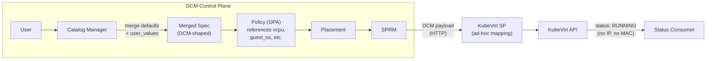

# Aligning DCM with UDLM

## Summary

Align DCM (Data Center Management) Service Provider boundary with UDLM
(Universal Data Lifecycle Model) so that UDLM becomes the common language
between all Service Providers (SPs) and the DCM control plane. This means
request payloads sent to SPs follow UDLM structure (`Compute.VM`,
`Compute.Container`, etc.) and realized payloads returned from SPs follow UDLM's
`outputs` schema (IPs, hostnames, provider handles). A shared SDK provides UDLM
types and the SP interface contract, enabling new SPs to integrate by
implementing naturalize/denaturalize (translate between UDLM and provider-native
formats) against UDLM types without learning DCM's internal schema.

## Motivation

DCM currently uses its own ServiceType schemas (`spec.yaml`) with field names
and structures that differ from UDLM. Each SP implements ad-hoc field mapping
against DCM's internal format, and SPs return only a status string (`"RUNNING"`)
with no structured outputs (no IP, hostname, MAC). There is no shared contract
between SPs, so each one must learn DCM-specific conventions.

UDLM provides a vendor-neutral specification that defines resource schemas,
types, and outputs. Aligning DCM with UDLM establishes a single contract at the
SP boundary, simplifies new SP onboarding, and enables structured outputs that
consumers (CLI, UI, other services) can use without provider-specific parsing.

### Goals

- Request payloads sent from the control plane to any SP follow UDLM structure
  (e.g., `Compute.VM`)
- Realized payloads returned from any SP follow UDLM's `outputs` schema
- A shared SDK provides UDLM types that both the control plane and every SP
  import
- New SPs integrate by importing the SDK and implementing the interface -- no
  DCM-specific schema knowledge required
- DCM's internal schemas converge to UDLM over time

### Non-Goals

- Replacing DCM's internal catalog system, policy engine, or placement manager
- Changing the NATS transport layer or Environment Agent architecture -- those
  are independent efforts
  ([FLPATH-4487](https://redhat.atlassian.net/browse/FLPATH-4487),
  [FLPATH-4767](https://redhat.atlassian.net/browse/FLPATH-4767))
- Defining new UDLM types -- this enhancement consumes existing UDLM
  specifications

## Proposal

### Approach

Two options were evaluated (see [Alternatives](#alternatives) for full
comparison):

- **Option A** -- adopt UDLM schemas directly across all components at once
- **Option B** -- add a translation layer at the dispatch boundary; each SP
  migrates independently

**Decision: Option B first, converge to Option A over time.**

#### Why Option B -- blast radius analysis

A field-name rename (Option A) is not isolated to Service Providers. The VM
field names flow through the entire stack:

```
spec.yaml → codegen → seed.go → PostgreSQL → spec_builder → OPA engine → SPRM → SP
```

| Component                               | Impact of Option A (rename)                                                                                                                                                                 | Option B (translation layer)                        |
| --------------------------------------- | ------------------------------------------------------------------------------------------------------------------------------------------------------------------------------------------- | --------------------------------------------------- |
| **OPA Policies**                        | **Critical (silent failure).** Rego code references `input.spec.vcpu`, `input.spec.guest_os`. After rename, these evaluate to `undefined` with no error -- policies silently stop matching. | **No change.** Policies keep using DCM field names. |
| **PostgreSQL CatalogItems**             | **Critical (data migration).** Field paths like `"vcpu.count"`, `"guest_os.type"` are persisted in JSONB. Requires DB migration.                                                            | **No change.** CatalogItems stay in DCM format.     |
| **KubeVirt SP** (`mapper.go`)           | Code break -- references `.Vcpu`, `.Memory`, `.Storage`, `.GuestOs`                                                                                                                         | Changes to accept UDLM types (intended)             |
| **OSAC SP** (`translate.go`, `disk.go`) | Code break                                                                                                                                                                                  | Changes on its own schedule                         |
| **seed.go + tests**                     | Code break -- map keys, assertions                                                                                                                                                          | **No change**                                       |
| **e2e tests**                           | Code break -- struct fields, JSON payloads                                                                                                                                                  | **No change**                                       |

Components that are already field-name-agnostic (safe with either option): SPRM
(`map[string]any` pass-through), Placement (DAG structure only), spec_builder
(dot-paths), CLI (generated clients).

The translation layer at the SPRM (Service Provider Resource Manager) dispatch
boundary is the right cut point. Everything upstream continues using DCM field
names. Only the SP side changes.

### User Stories

#### Story 1: SP developer receives structured request

A KubeVirt SP developer receives a `Compute.VM` payload with typed fields
(`cpu.count`, `memory.size`, `networks[]`) instead of a raw `map[string]any`
with DCM field names. The SDK provides Go structs and the `VMServiceProvider`
interface, so the developer implements `Naturalize()` and `Denaturalize()`
instead of writing ad-hoc field mapping.

#### Story 2: Consumer retrieves VM outputs

A CLI user or UI component queries the CatalogItemInstance API and receives
structured outputs: `ip_addresses`, `hostname`, `mac_addresses`,
`provider_handle`, `observed_run_state`. Today they only get a status string.

#### Story 3: New SP onboarding

A team building a VMware SP imports the shared SDK, implements the
`VMServiceProvider` interface with vSphere-specific naturalize/denaturalize
logic, and registers with DCM. No control plane changes needed. The SP receives
`Compute.VM` and returns `ComputeVMOutputs` -- the same contract as every other
VM SP.

### Implementation Details/Notes/Constraints

#### VM Provisioning: Today vs Target

**Today (DCM-shaped payload, HTTP dispatch, status string back):**

1. User submits a VM request via CLI or API.
2. Catalog Manager merges CatalogItem defaults with user-provided overrides.
3. Policy engine (OPA) validates the merged payload.
4. Placement selects a target SP and environment.
5. Control plane sends a DCM-shaped payload directly to the KubeVirt SP via
   HTTP.
6. KubeVirt SP performs ad-hoc field mapping and creates a `VirtualMachine` CR.
7. SP reports back a status string (`"RUNNING"`) via NATS. No IP, no hostname,
   no MAC.

**Target (UDLM payload, agent-based NATS dispatch, structured outputs back):**

1. Steps 1-4 are identical.
2. DCM-to-UDLM translator converts the merged payload to a UDLM `Compute.VM`
   payload.
3. Control plane publishes the UDLM-shaped payload (+ `provider_hints` as a
   sidecar) to NATS.
4. The Environment Agent receives the message and forwards it to the local SP
   (transparent relay).
5. KubeVirt SP calls `Naturalize()` to convert `Compute.VM` to a KubeVirt
   `VirtualMachine` CR.
6. SP creates the VM via the KubeVirt API.
7. SP calls `Denaturalize()` to convert VMI status to structured
   `ComputeVMOutputs`.
8. SP hands outputs to the Environment Agent, which publishes them back to NATS.

#### Architecture: Today vs Target

**Today:**



**Target (with UDLM alignment):**

```mermaid
flowchart LR
    subgraph cp [DCM Control Plane]
        User --> CatalogMgr["Catalog Manager"]
        CatalogMgr -->|"merge defaults\n+ user_values"| Spec["Merged Spec\n(DCM-shaped)"]
        Spec --> OPA["Policy (OPA)\n(unchanged)"]
        OPA --> Placement
        Placement --> SPRM
        SPRM --> Translator["DCM-to-UDLM\nTranslator"]
    end

    subgraph env [Remote Environment]
        Agent["Environment\nAgent"] --> KubevirtSP["KubeVirt SP\n(shared SDK)"]
        KubevirtSP -->|"Naturalize()"| KubeVirtAPI["KubeVirt API"]
        KubeVirtAPI -->|"Denaturalize()"| Outputs["ComputeVMOutputs\nIPs, hostname,\nMAC, run_state"]
    end

    Translator -->|"UDLM Compute.VM\n+ provider_hints\n(NATS)"| Agent
    Outputs -->|"structured outputs\n(NATS)"| StatusConsumer["Status Consumer"]
```



**The key boundary:** The translator sits between SPRM and NATS. Everything to
the left (OPA, Placement, CatalogItems, PostgreSQL) stays in DCM format.
Everything to the right (SPs) speaks UDLM via the shared SDK.

#### What Needs to Change -- 4 Layers

> VM used as example. Each layer applies to all service types.

**Layer 1: Schema alignment (request payload)**

The translation layer lives in the control plane at the SPRM dispatch boundary.
It converts DCM `map[string]any` to UDLM typed structs before sending to SPs.

| DCM Field                | UDLM Field                                 | Notes                                                           |
| ------------------------ | ------------------------------------------ | --------------------------------------------------------------- |
| `vcpu`                   | `cpu`                                      | Add `sockets`, `cores_per_socket`                               |
| `memory.size` (MB/GB/TB) | `memory.size` (Mi/Gi/MB/GB/TB/MiB/GiB/TiB) | Add binary units                                                |
| `storage.disks[]`        | `layout_ref` + `storage` + `storage_tier`  | Structural transform -- disks become `Storage.Layout` reference |
| _(not in DCM)_           | `networks[]`                               | vlan, subnet, zone, tier, mac, ip_address_ref                   |
| _(not in DCM)_           | `placement`                                | location_ref, zone, affinity rules                              |
| _(not in DCM)_           | `firmware`                                 | type (bios/uefi), secure_boot, vtpm                             |
| _(not in DCM)_           | `run_state`                                | desired_state: running/stopped/suspended                        |
| _(not in DCM)_           | `instance_size`                            | Alternative to explicit cpu+memory (`oneOf`)                    |
| `provider_hints`         | Provider Class optional fields             | During transition, pass as sidecar alongside UDLM payload       |

**How provider-specific required fields are resolved**

UDLM defines the portable fields -- what the user wants (cpu, memory, guest_os).
But each provider needs additional platform-specific data to create a functional
resource. For example, KubeVirt requires a `namespace`; VMware requires a
`datacenter`, `cluster`, and `datastore`. These fields are not in UDLM's
`Compute.VM` because they are not portable across providers.

The provider-specific data comes from three sources, merged in priority order
(later wins):

| Priority | Source                  | Example (KubeVirt)                                | Example (VMware)                             |
| -------- | ----------------------- | ------------------------------------------------- | -------------------------------------------- |
| 1        | SP environment config   | `namespace: production-vms`                       | `datacenter: DC-RDU2, cluster: Prod`         |
| 2        | CatalogItem defaults    | may override SP defaults                          | may override SP defaults                     |
| 3        | User request            | `cpu: 4, memory: 8Gi`                             | `cpu: 4, memory: 8Gi`                        |
| 4        | `provider_hints` (user) | `namespace: my-special-ns` (overrides SP default) | `folder: /vm/testing` (overrides SP default) |

This means a CatalogItem can be fully portable -- just `cpu`, `memory`,
`guest_os` -- and Placement decides which SP handles it. The SP fills in
platform-specific required fields from its own environment config.
Naturalization is the step in each SP that combines UDLM portable fields with
provider-specific context to produce a functional provider-native resource
(e.g., a KubeVirt `VirtualMachine` CR or a vSphere VM spec).

In UDLM terms, provider-specific fields are declared in **Provider Classes**
(e.g., `Compute.VM.OCPVirt` for KubeVirt, `Compute.VM.VSphere` for VMware).
During the transition, these fields travel as `provider_hints` alongside the
UDLM payload. Long-term, they are formally declared in the Provider Class schema
so they are typed and validated.

**Layer 2: Outputs contract (realized payload)**

The biggest gap and the recommended starting point.

Current status payload:

```json
{
  "id": "string",
  "status": "string",
  "message": "string"
}
```

Target (aligned with UDLM `outputs`):

```json
{
  "ip_addresses": ["string"],
  "primary_ip": "string",
  "hostname": "string",
  "mac_addresses": ["string"],
  "provider_handle": "string",
  "observed_run_state": "string",
  "target_segment": "string"
}
```

Actions required:

1. Define outputs schema aligned with UDLM for each service type.
2. Update the status consumer to store structured outputs.
3. Update the `CatalogItemInstance` API to serve outputs on GET.

**Layer 3: SP contract / SDK**

The SDK is a shared library (e.g., evolve `dcm-project/service-provider-api`)
that both the control plane and every SP import:

- **Control plane** imports the SDK for the translator (needs `ComputeVM` as
  target type) and the StatusConsumer (needs `ComputeVMOutputs` to parse SP
  responses).
- **Each SP** imports the SDK to implement the `VMServiceProvider` interface
  (`Naturalize`, `Realize`, `Denaturalize`) using the shared types.

The shared SDK repository contains:

- UDLM type schemas (`Compute.VM`, `Compute.VM` outputs, `Compute.Container`,
  etc.)
- SP interface contract (naturalize, realize, denaturalize)
- Common helpers (unit conversion, validation)
- Standard error schema

Each SP repository imports the shared SDK and provides provider-specific
naturalization and denaturalization logic.

Both sides of the boundary speak the same types. A new SP joins by importing the
SDK and implementing the interface.

The SDK also defines a standard error schema:

```json
{
  "code": "NATURALIZE_FAILED | REALIZE_FAILED | DENATURALIZE_FAILED",
  "message": "string"
}
```

**Layer 4: Migration path (KubeVirt SP as reference)**

- Accept UDLM-shaped `Compute.VM` payloads
- Implement denaturalization: extract IP, hostname, MAC from VMI status and
  return as UDLM outputs
- Add `networks[]` support (map to KubeVirt interfaces/networks)
- Add `placement` support (map to node selectors/affinity rules)
- Add `firmware` support (map to KubeVirt domain firmware/features)
- Serves as the reference implementation for other SPs

#### Transition Mechanism

During the transition, both DCM-shaped and UDLM-shaped payloads coexist. Each SP
declares its capability at registration:

| Payload format | Request                    | Response                      |
| -------------- | -------------------------- | ----------------------------- |
| `"dcm"`        | DCM-shaped payload (as-is) | Status string                 |
| `"udlm"`       | UDLM `Compute.VM` payload  | Structured `ComputeVMOutputs` |

The outputs-first sequencing creates a natural intermediate state (DCM payload
in, structured outputs out):

|                     | Status string out | Structured outputs out |
| ------------------- | ----------------- | ---------------------- |
| **DCM payload in**  | Current state     | Phase 2 target         |
| **UDLM payload in** | _(not planned)_   | Full alignment         |

The Environment Agent
([FLPATH-4487](https://redhat.atlassian.net/browse/FLPATH-4487)) is a
transparent relay -- it does not need to know whether the payload is DCM-shaped
or UDLM-shaped. The transport change (HTTP -> agent+NATS) and payload format
change (DCM -> UDLM) should remain independent.

### Risks and Mitigations

| Risk                                                         | Impact                                                   | Mitigation                                                    |
| ------------------------------------------------------------ | -------------------------------------------------------- | ------------------------------------------------------------- |
| FLPATH-4491 is blocked (UDLM not finalized)                  | Schemas may still change                                 | Pin SDK to UDLM v1.5.3; outputs and SDK structure can proceed |
| Outputs work (FLPATH-4298/4748/4749) proceeding without UDLM | Locks in a DCM-specific format                           | Add UDLM reference to those tickets immediately               |
| NATS migration (FLPATH-4487/4767) timing                     | Adds scope if coupled                                    | Treat transport and payload format changes as independent     |
| Translation layer complexity                                 | Some mappings are structural transforms, not renames     | Spike the VM translator in code first                         |
| `additionalProperties: false` shift                          | Undocumented fields passed through open schema may break | Audit actual SP payload usage before designing translator     |
| Translation layer becomes permanent                          | No incentive to remove once working                      | Plan for convergence; the layer is explicitly temporary       |

## Design Details

### Sequencing

| Phase | Action                                             | Dependency                                                  |
| ----- | -------------------------------------------------- | ----------------------------------------------------------- |
| 1     | **Finalize UDLM** (FLPATH-4491)                    | Blocker -- schemas must be stable                           |
| 2     | **Define outputs contract** aligned with UDLM      | Easiest win; aligns with in-flight FLPATH-4748/4749         |
| 3     | **Build SP SDK** with UDLM types                   | Gives SPs a target to code against                          |
| 4     | **Update KubeVirt SP** as reference implementation | First SP to implement naturalize/denaturalize using the SDK |
| 5     | **Add translation layer** in control plane         | Converts DCM payloads to UDLM before dispatch               |
| 6     | **Converge DCM schemas** to UDLM                   | Once all SPs are UDLM-native, remove the translation layer  |

### Versioning

Pin the SDK to the current UDLM version (v1.5.3). Since DCM is not yet in
production, a UDLM version update is a coordinated SDK update. No multi-version
support needed at this stage.

### Testing Strategy

Golden file tests for `Compute.VM`: maintain reference files (DCM input payload,
expected UDLM output, KubeVirt VMI status, expected `ComputeVMOutputs`).
Translation layer unit tests assert input -> expected output. Integration tests
with real SPs added as needed.

### Upgrade / Downgrade Strategy

Not applicable at this stage -- DCM is not in production. The per-SP
`payload_format` flag allows incremental migration. An SP can revert to `"dcm"`
format if UDLM integration introduces issues.

## Drawbacks

- Maintaining a translation layer adds complexity during the transition period
- Two schema formats coexist until convergence, increasing cognitive load for
  developers working across the boundary
- The SDK becomes a shared dependency that all SPs and the control plane must
  keep in sync

## Open Questions

1. FLPATH-4491 (Finalize UDLM) is blocked. Should work proceed against UDLM
   v1.5.3 at risk, or wait for finalization?
2. Should the shared SDK live in `dcm-project/service-provider-api` or a new
   repo?
3. How should `storage.disks[]` -> `layout_ref` + `Storage.Layout` structural
   transform be handled? Needs a code spike.

### Related Jira Tickets

| Ticket                                                         | Summary                                                        | UDLM Mention         |
| -------------------------------------------------------------- | -------------------------------------------------------------- | -------------------- |
| [FLPATH-4436](https://redhat.atlassian.net/browse/FLPATH-4436) | Align DCM types with UDLM (epic)                               | Yes                  |
| [FLPATH-4793](https://redhat.atlassian.net/browse/FLPATH-4793) | Enhancement: Align DCM with UDLM at the SP boundary            | Yes (this document)  |
| [FLPATH-4491](https://redhat.atlassian.net/browse/FLPATH-4491) | Finalize UDLM (blocker, status: New)                           | Yes                  |
| [FLPATH-4654](https://redhat.atlassian.net/browse/FLPATH-4654) | Test alignment of DCM types with UDLM                          | Yes                  |
| [FLPATH-4298](https://redhat.atlassian.net/browse/FLPATH-4298) | Define output parameters for service types                     | **No**               |
| [FLPATH-4748](https://redhat.atlassian.net/browse/FLPATH-4748) | Define output definitions on service types with CEL validation | **No**               |
| [FLPATH-4749](https://redhat.atlassian.net/browse/FLPATH-4749) | Add outputs query endpoint for service type instances          | **No**               |
| [FLPATH-4487](https://redhat.atlassian.net/browse/FLPATH-4487) | Implement Environment Agent usage in DCM control plane         | No (transport layer) |
| [FLPATH-4767](https://redhat.atlassian.net/browse/FLPATH-4767) | Remove KubeVirt SP HTTP APIs in favor of agent-based (NATS)    | No (transport layer) |

> **Risk:** FLPATH-4298/4748/4749 are building the outputs subsystem without
> referencing UDLM. This risks locking in a DCM-specific format that will need
> rework.

## Alternatives

### Alternative 1: Option A -- Adopt UDLM schemas directly

#### Description

Replace DCM's ServiceType schemas (`spec.yaml`) with UDLM field names and
structure. All components switch at once.

#### Pros

- One schema, no translation layer, no dual-format maintenance
- Cleanest long-term architecture

#### Cons

- Breaking change across 7 ServiceType schemas, 5+ SPs, OPA policies, PostgreSQL
  data, seed files, and e2e tests simultaneously
- OPA policies would silently fail (evaluate to `undefined`) if any Rego code is
  missed during rename -- silent policy bypass with no error
- Requires coordinated update across multiple teams working in parallel
- PostgreSQL CatalogItems store field paths in JSONB -- requires DB migration

See [blast radius analysis](#why-option-b----blast-radius-analysis) for the full
impact breakdown.

#### Status

Deferred

#### Rationale

Option A is the target end state but not feasible as a first step given the
blast radius. Option B provides the migration bridge. Once all SPs are
UDLM-native and DCM schemas converge, Option A is achieved and the translation
layer is removed.

## Infrastructure Needed

- Shared SDK repository (new or evolve `dcm-project/service-provider-api`)
- Golden file test fixtures for each ServiceType translation
