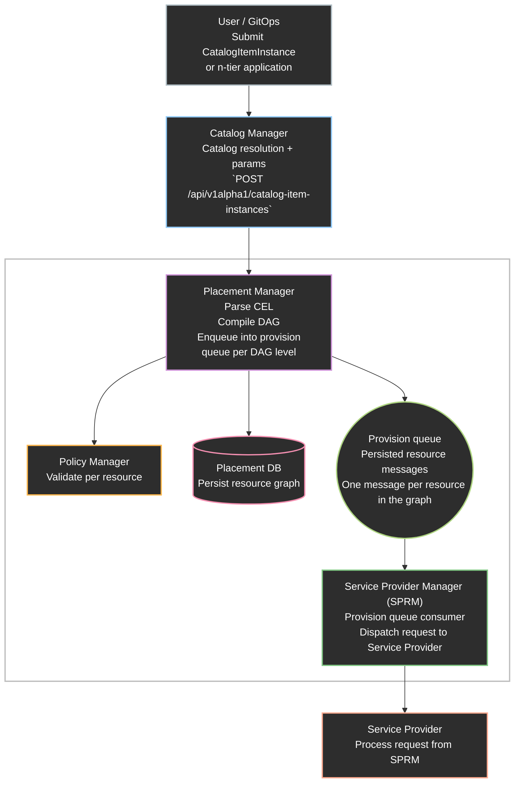
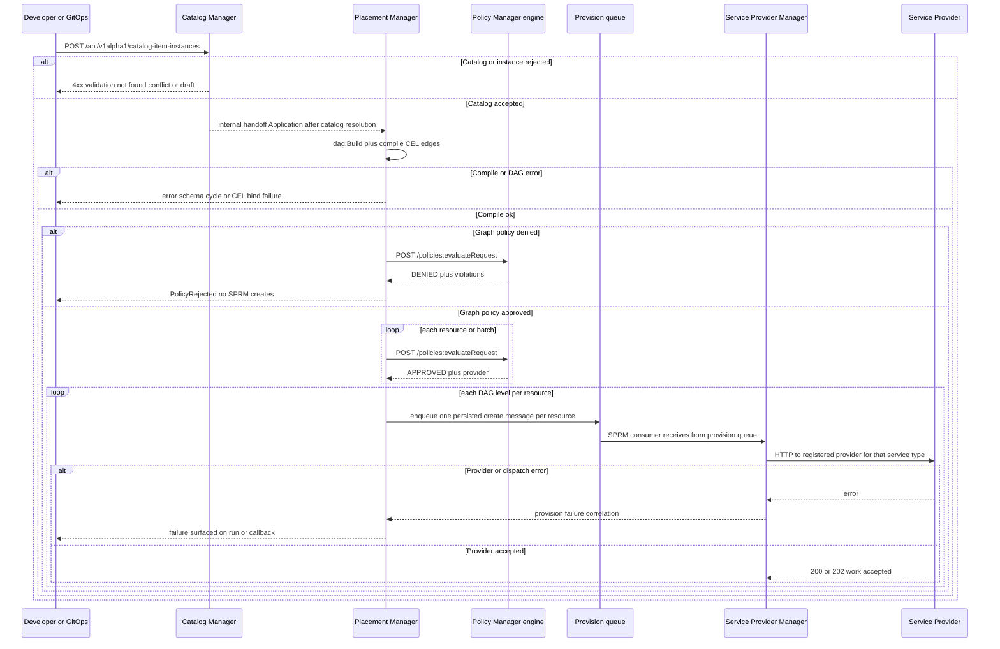

# Declarative API — Catalog and orchestration

## Open Questions

1. Provision Queue: Introduced a Provision queue to holds requests 
   published by Placement and consumed by the SPRM to creation operation.
   Any objection/concerns/suggestion/alternative?
2. State Queue: Should Placement also consume from the state queue? The state
   queue holds the messages published by the SPs and is currently consumes by SPRM.
3. Hybrid support (catalog plus freeform): Do we want to support both in the future?
   Freeform might need RBAC implementation.
4. Placement Manager evaluates policy per single resource or whole graph or both?

## Summary

This proposal describes how DCM implements multi-tier (n-tier) applications
through a single declarative flow, whether the user chooses a catalog-backed
`Application` path (reference to a `CatalogItem`) or a freeform
`Application` (non referenced catalog). This approach uses
[CEL](https://cel.dev/) for wiring values and a Direct Acyclic Graph (DAG) for
dependency order and safe parallelism on the effective resource graph, whether
produced by catalog resolution or authored as freeform (_Open Question 3_).

## Motivation

Operators and platform teams need a declarative, multi-tier flow that combines 
catalog governance (approved templates and constrained parameters) with
orchestration that can provision more than one related resource 
as part of a single application request.
**Current limitations**: Creating resources today is oriented around
one resource per request through catalog, placement, with policy and provisioning 
invoked per call. There is no end-to-end flow defined for allowing and processing
multiple resources within a single request.
**Why this enhancement**: This proposal defines that flow. How a single request
(via catalog resolution or freeform input) becomes an effective graph,
how the platform validates and applies policy to the intended graph before 
provisioning, and how dependency order drives which resources are
created and when. It also establishes the contract needed if we later 
support freeform graphs (_Open Question 3_). Freeform graphs are 
application layouts developers define directly, not from a catalog template.

### Goals

- Define the mechanism of supporting multi-tier catalog items and freeform usage for
  Application.
- Define end to end flow for requesting an n-tier application to evaluate how
  CEL parser, DAG build and policy work.
- Understand how declarative flow maps into the current architecture components
  (Catalog Manager, Placement Manager, Policy Manager and SP Manager).

### Non-Goals

- Define the resource types, catalog items and DAG engine.
- Define state management for each resources within the Application.
- Choosing different environments per resource and validating network
  connectivity between them those resources (environment 
  based placement and overlay connectivity).

## Proposal

### Assumptions
- Each application run targets one placement context 
  (no per-resource environment choice or cross-environment checks).
- Dependent resources are provisioned in DAG order only. Placement/Policy does not
  validate that assigned service providers are network reachable 
  across providers until environment based placement is introduced.

### Overview

The proposed solution is a single declarative graph (`spec.resources[]`) after
catalog resolution (catalog path) or freeform input. CEL (`${…}`) expresses
values and cross-resource wiring; the engine parses those expressions to infer
dependencies alongside explicit `requirements`. A DAG is built from that graph
so the platform knows valid order and safe parallelism (topological
levels). Policy runs on the intended graph before provisioning.
Placement then walks the DAG, resolving CEL against outputs as dependencies
become ready.

### User Stories

#### Story 1 — Request from catalog

A developer submits an Application (or catalog item instance) that references a
CatalogItem plus params. The system loads the blueprint, merges params,
resolves the catalog into an effective resource graph, compiles CEL and the DAG,
evaluates policy on the whole graph, then begins provisioning
in DAG order, checks observable status until terminal success or failure.

#### Story 2 — Freeform Application

A developer submits `spec.resources` without a catalog reference. The system
skips catalog fetch, validates params if present, then runs the same compile,
policy, plan, and apply phases on the submitted graph.

### Proposed System Architecture

#### Flow Description

1. User/GitOps → Catalog Manager 
   User submits catalog-backed intent (i.e`POST /api/v1alpha1/catalog-item-instances`). 
   Catalog Manager resolves the blueprint and sends the effective graph
   to Placement Manager. Placement runs orchestration on that graph
   For freeform (_Open Question 3_), the client submits an application graph
   through a user-facing API (maybe not directly to Placement, still yet to be determined).
   Placement still receives an effective `spec.resources[]`
   via an internal handoff and runs the same orchestration as the catalog path.

2. Catalog Manager → Placement Manager 
   On the catalog path, catalog resolution turns blueprint plus params into `spec.resources[]`.
   Placement receives that handoff and builds the DAG (CEL edges, topological levels), 
   plans against state, and persists intent and graph snapshots in Placement DB.

3. Placement Manager → Policy Manager
   Sends request to endpoint`POST {POLICY_ENGINE}/api/v1alpha1/policies:evaluateRequest` 
   (same pattern as today's [policy client)](https://github.com/dcm-project/policy-manager). 
   Orchestration must not call SPRM for creates until
   this gate succeeds for the intended graph.

4. Placement Manager → provision queue → SPRM 
   As Placement walks each DAG level, it enqueues one persisted message per resource 
   with create operation for that node in `spec.resources[]`.
   SPRM consumes from the provision queue so Placement is not blocked on long provider work.

5. SPRM → Service Provider 
   For each consumed item, SPRM resolves the service type in its registry 
   and invokes the registered Service Provider over
   HTTP to perform create or lifecycle for that instance.

### Design Details

#### Simulated flow (catalog-backed).

1. User / GitOps → Catalog Manager 
   Submit catalog-backed intent (`POST /api/v1alpha1/catalog-item-instances`)
   with catalog item identity and user_values. 
   Catalog Manager validates and persists the instance intent per
   its API contract.

2. Catalog Manager → Placement Manager 
   Catalog Manager resolves the blueprint and params into `spec.resources[]`. 
   Placement receives an Application handoff after catalog resolution.

3. Placement Manager
   Placement builds the DAG and compiles CEL edges on the
   resolved graph (schema bind, cycle detection, classify plan-time versus
   apply-time CEL), and records intent or run metadata in Placement DB as
   designed.

4. Placement Manager → Policy Manager Sends
   `POST /api/v1alpha1/policies:evaluateRequest` for each resource or batch
   until the full graph is authorized (same pattern as today's 
   [policy client](https://github.com/dcm-project/policy-manager)).
   On deny, surface PolicyRejected with aggregate violations and do not invoke
   SPRM creates.

5. Placement Manager → provision queue → SPRM → Service Provider
   For each resource in DAG order (parallel within a level when safe), Placement
   enqueues one persisted message on the provision queue that tells SPRM
   to create a resource from the graph (payload includes enough
   identity for idempotency). 
   SPRM consumes the provision queue, records intent, resolves the service 
   type in its registry, and invokes the registered Service Provider.

**Note**: Freeform Submission skips steps 1 and 2 above; the client sends an
Application (or equivalent) with `spec.resources[]` directly to the
orchestration entry Placement Manager uses today. Steps 3 through 5 apply
unchanged on the submitted graph.

#### CEL and DAG

`spec.resources[]` is treated as a graph of resources. CEL fills in
values and wires resources to each other (for example referencing another
resource’s outputs). A DAG (directed acyclic graph) captures
dependencies so the platform knows a valid order for provisioning and
which resources may run in parallel at the same step.

##### Dependency Edges

1. CEL expressions: References such as `${db.outputField}` imply an edge
   from `db` to the resource that uses the expression (the consumer
   depends on the producer’s output).
2. Explicit `requirements`: These are edges declared directly on a resource.
   That is, the resource must not be applied before its dependencies.

##### Executable Flow

1. Start from resolved `spec.resources[]` (after catalog resolution, or
   from freeform input as-is).
2. Extract dependency pairs from CEL + `requirements` → build a directed
   graph (nodes = resources, edges = “must come before”).
3. Detect cycles; if any cycle exists, the graph is invalid for a linear
   provision order and should be rejected at compile time.
4. Topological sort → assign levels (layer 0 has no predecessors, layer
   _k_ depends only on lower layers). Resources in the same level may be
   provisioned in parallel when policy allow.

##### Database Record Persistence

The whole graph will be persisted so orchestration can be
replayed, audited, and shown clearly in the UI.

##### Two-phase CEL

Treat CEL as two evaluation stages so nothing assumes a dependency
output exists before it really does. Before any create,
resolve expressions that only need params, literals, schema, and
already known state (for example previously stored ids or outputs).
During or after each create, resolve expressions that
reference new outputs from dependencies as those values appear in state.

Workers for level _L_ must not start until state shows `Ready` (and
required output fields) for dependencies at _L−1_. Expressions that only use
schema and params can be evaluated earlier; expressions that need another
resource’s outputs stay deferred until that resource is `Ready`.

#### Queuing

The `provision` queue handles the requests between Placement and SPRM.
Placement publishes one logical create per resource. SPRM acts a consumer
from the queue and calls Service Providers.
Also, Placement consumes messages from the `state` queue, to check the
readiness of resources before the continues walking a DAG application.
For Idempotency, resources are keyed by `runId` + `resourceName`
so duplicate delivery cannot double create.

#### Policy evaluation

Evaluation flow:

1. Input: resolved `resources[]`, params snapshot, environment label,
   optional previous state.
2. Per-resource: run policy (OPA) on each resource
   with graph context in the evaluate payload (neighbors, paths, or a
   bounded subgraph) so many cross-resource checks do not need a separate
   global pass. (Depends on how Policy will treat this, unclear here)
3. Whole-graph rules (_Open Question 4_): If a rule needs the entire graph at once,
   this flow is yet to be determined.
4. Output: allow or deny per resource and/or global denies (_Open Question 4_);
   aggregate violations for API responses.

### Risks and Mitigations

| Risk                                               | Mitigation                                                                                         |
| -------------------------------------------------- | -------------------------------------------------------------------------------------------------- |
| Partial graphs after per-resource policy           | Enforce full-graph policy gate before any SPRM create; single orchestration success criterion. |
| DAG sort mutates internal graph                    | Snapshot edges for policy and audit before topological ordering; rebuild if needed.                |
| Catalog instance stores paths only, not full graph | Implement catalog resolution producing auditable effective resources[].                    |

## Drawbacks

- Later first mutation versus streaming per-resource approval when using a
  full-graph policy gate—acceptable trade-off for safety with global rules.
- Operational complexity when adopting pub/sub for apply—defer until load
  warrants it.

## Alternatives

### Alternative 1 — One NATS stream for both status and provision

#### Description

Use a single NATS stream (or subject hierarchy) for both message types:
status events from Service Providers (observed state, e.g. PENDING → RUNNING)
and provision commands from Placement to SPRM (`create` work for graph
resources). Provisioning would reuse the same stream or subjects already used
for provider status reporting instead of introducing a dedicated provision queue.

#### Pros

- Less messaging infrastructure to deploy and monitor at first (one stream to
  configure, one consumer pattern).
- Reuses an existing integration path that Service Providers already use for
  status updates.

#### Cons

- Commands and telemetry share one channel: Status traffic (high volume with
  many publishers) and provision commands (control-plane, low volume, strict
  ordering expectations) compete on the same stream.
- Schema and versioning are tied together: Changes to status event shape or
  provision payload format affect the same stream hence it is
  harder to evolve independently.
- Blast radius is larger: Misconfiguration, consumer bugs, or stream outages
  affect both observation (status) and action (provision), not one concern in
  isolation.

#### Status

Rejected

#### Rationale

Status ingestion and provisioning serve different roles: Status is high-volume,
with provider-originated telemetry. Provisioning is control plane commands with
stricter delivery and lifecycle needs. Separate streams or subjects keep
versioning, scaling, and failure domains independent.

### Alternative 2 — Policy validates then provisions per resource (incremental)

#### Description

Evaluate policy and start provisioning one resource at a time in graph order,
without waiting for authorization of the full application graph. For each
resource in DAG order, Placement calls Policy Manager for that resource only;
on approval, it immediately enqueues or invokes SPRM create for that resource,
then moves to the next resource and repeats policy evaluation there. Later
resources are not validated by policy until earlier ones are approved 
and provision has begun.

#### Pros

- Resources at the front of the graph can start provisioning sooner, which
  may shorten the wait until the first resource begins provisioning,
  when policy is fast and graph-wide rules are simple or absent.
- Failures surface per resource as each step completes, which can feel more
  incremental to callers watching individual resources.

#### Cons

- Unsafe when policies depend on the whole graph. A resource approved and
  provisioned early may later be invalidated by rules that apply to the full
  application or to relationships between resources.
- Allows partial illegal graphs: some resources may reach SPRM or the provider
  before the run is rejected, requiring compensation, rollback, or cleanup.
- Graph-wide deny rules cannot be enforced atomically at admission; the caller
  may believe progress is valid while the run is ultimately invalid.
- Duplicates policy invocation and complicates run-level success criteria.

#### Status

Rejected

#### Rationale

The proposed flow runs policy on the intended graph before any SPRM create, so
the run is either authorized as a whole or rejected before side effects. Incremental
approve-then-provision fits single resource flows but conflicts with graph level
policy and coordinated provider or placement rules planned for n-tier applications.

### Alternative 3 — SPRM as provision-queue consumer and publisher (bulk enqueue, dependency requeue)

#### Description

Placement publishes all provision messages for the application graph at once
(one message per resource, including every DAG level), then returns. SPRM is the
sole orchestrator on the provision queue. It consumes `create` messages,
checks whether each resource’s dependencies are in a `Ready` state (via SPRM
instance status or the state queue). If dependencies are ready, SPRM
call the Service Provider to provision the resource. If dependencies are
not ready, it re-publishes/requeues the same message until dependencies are
ready. SPRM acts as both consumer and publisher on the provision queue for
deferred work. Placement does not walk DAG levels and does not consume the state
queue for readiness.

#### Pros

- Placement admission stays simple: one bulk publish after policy validation,
  no per-level enqueue loop or state-driven progression in Placement.
- Dependency waiting and retries are centralized in SPRM, close to instance status.

#### Cons

- SPRM must understand graph dependencies or carry enough metadata on each
  message to evaluate them, duplicating orchestration knowledge that otherwise
  lives in Placement.
- Requeue loops risk duplicate delivery, delayed visibility, and harder
  debugging (“stuck” messages) without strict idempotency and backoff.
- Expands SPRM beyond its core role: it must coordinate dependency order and
  retries, not only create instances and record status.
- Resources that share a DAG level may be provisioned in parallel: SPRM must
  treat them as ready together once dependencies are met, or some peers may wait
  indefinitely while others are retried.

#### Status

Considered

#### Rationale

The proposed flow keeps DAG progression in Placement (enqueue per level when
dependencies are ready, using the state queue) and limits SPRM to consuming
provision messages and executing resource provisioning.
Publishing the full graph at once and deferring work in SPRM can simplify 
Placement. But SPRM would own dependency ordering, retries, and requeues,
and would need graph aware logic that Placement already holds, 
adding operational overhead and duplicated orchestration rules.