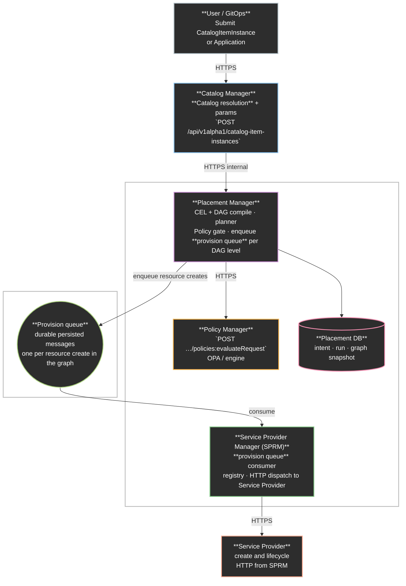
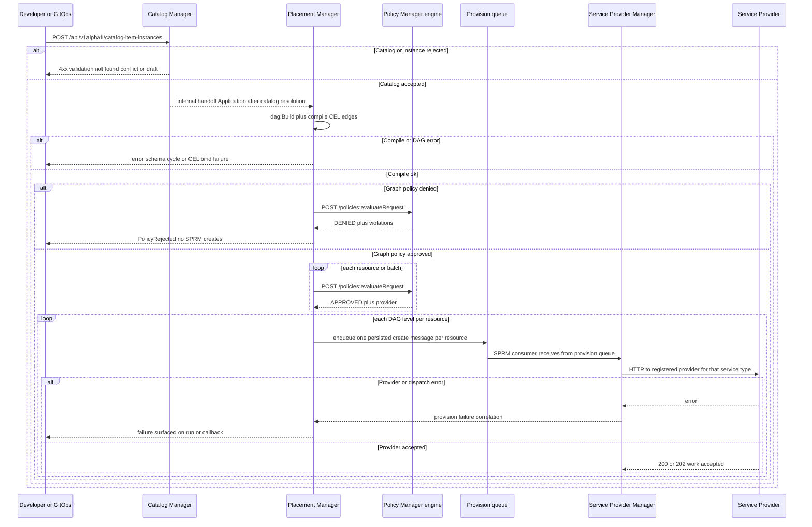

# Declarative API — Catalog and orchestration

## Open Questions

1. Provision Queue: Should we introduce a Provision queue to hold 
   requests consumed by the SPRM to create the resource. .
2. State Queue: Should Placement also consume from the state queue? The state
   queue holds the messages published by the SPs and is currenly consumes by SPRM.
3. Hybrid catalog plus freeform: Do we want to support both in the future?
   Freeform might need RBAC implementation.
4. Catalog Manager: Should catalog manager stores only user_values paths or a full
   `resources[]` graph after catalog resolution?
5. Placement Manager evaluates policy per single resource or whole graph or both?

## Summary

This proposal describes how DCM implements multi-tier (n-tier) applications
through a single declarative flow, whether the user chooses a catalog-backed
`Application` path (reference to a `CatalogItem`) or a freeform
`Application` (non referenced catalog). This approach uses
[CEL](https://cel.dev/) for wiring values and a Direct Acyclic Graph (DAG) for
dependency order and safe parallelism on the effective resource graph, whether
produced by catalog resolution or authored as freeform (?).

## Motivation

Operators and platform teams need a declarative, multi-tier flow that combines
catalog governance (approved templates and constrained parameters) with freeform
graphs where policy allows. Here an arbitrary graph means a
developer-defined topology: which resource types appear, how many instances,
how they are wired together (using `CEL` references with explicit requirements),
and therefore what the dependency `DAG` looks like — without being limited to a
single pre-published `CatalogItem` shape. The same engine must treat a freeform
graph as a valid input when permitted, rather than forcing every workload into a
one-size catalog.

Without a documented orchestration contract, the risk grows for partial illegal
graphs, unclear policy gates, and ad hoc duplication of DAG logic across
services.

### Goals

- Define the mechanism of supporting catalog items and freeform usage for
  Application.
- Define end to end flow for requesting an n-tier application to evaluate how
  CEL parser, DAG build and policy work.
- Understand how declarative flow maps into the current architecture components
  (Catalog Manager, Placement Manager, Policy Manager and SP Manager).

### Non-Goals

- Define the resource types, catalog items and DAG engine.
- Define state management for each resources within the Application

## Proposal

### Overview

The proposed solution is a single declarative graph (`spec.resources[]`) after
catalog resolution (catalog path) or freeform input. CEL (`${…}`) expresses
values and cross-resource wiring; the engine parses those expressions to infer
dependencies alongside explicit `requirements`. A DAG is built from that graph
so the platform knows valid order and safe parallelism (topological
levels). Policy runs on the intended graph before provisioning.
Placement then walks the DAG, resolving CEL against outputs as dependencies
become ready.

### User Stories

#### Story 1 — Request from catalog

A developer submits an Application (or catalog item instance) that references a
CatalogItem plus params. The system loads the blueprint, merges params,
resolves the catalog into an effective resource graph, compiles CEL and the DAG,
evaluates policy on the whole graph, then begins provisioning
in DAG order, checks observable status until terminal success or failure.

#### Story 2 — Freeform Application

A developer submits `spec.resources` without a catalog reference. The system
skips catalog fetch, validates params if present, then runs the same compile,
policy, plan, and apply phases on the submitted graph.

### System architecture

#### Flow Description

1. User / GitOps → Catalog Manager 
   Submit catalog-backed intent (for example
   `POST /api/v1alpha1/catalog-item-instances`). For freeform, the same stages
   apply once Placement Manager receives `spec.resources[]`.

2. Catalog Manager → Placement Manager 
   On the catalog path, catalog resolution turns blueprint plus params into `spec.resources[]`.
   Placement receives that handoff and builds the DAG (CEL edges, topological levels), 
   plans against state, and persists intent and graph snapshots in Placement DB.

3. Placement Manager → Policy Manager
   Sends request to endpoint`POST {POLICY_ENGINE}/api/v1alpha1/policies:evaluateRequest` 
   (same pattern as today's policy client). Orchestration must not call SPRM for creates until
   this gate succeeds for the intended graph.

4. Placement Manager → provision queue → SPRM 
   As Placement walks each DAG level, it enqueues one persisted message per resource 
   with create operation for that node in `spec.resources[]`.
   SPRM consumes from the provision queue so Placement is not blocked on long provider work.

5. SPRM → Service Provider 
   For each consumed item, SPRM resolves the service type in its registry 
   and invokes the registered Service Provider over
   HTTP to perform create or lifecycle for that instance.

### Design Details

#### Simulated flow (catalog-backed).

1. User / GitOps → Catalog Manager 
   Submit catalog-backed intent (`POST /api/v1alpha1/catalog-item-instances`)
   with catalog item identity and user_values. 
   Catalog Manager validates and persists the instance intent per
   its API contract.

2. Catalog Manager → Placement Manager 
   Catalog Manager resolves the blueprint and params into `spec.resources[]`. 
   Placement receives an Application handoff after catalog resolution.

3. Placement Manager
   Placement builds the DAG and compiles CEL edges on the
   resolved graph (schema bind, cycle detection, classify plan-time versus
   apply-time CEL), and records intent or run metadata in Placement DB as
   designed.

4. Placement Manager → Policy Manager Sends
   `POST /api/v1alpha1/policies:evaluateRequest` for each resource or batch
   until the full graph is authorized (same pattern as today's policy client).
   On deny, surface PolicyRejected with aggregate violations and do not invoke
   SPRM creates.

5. Placement Manager → provision queue → SPRM → Service Provider
   For each resource in DAG order (parallel within a level when safe), Placement
   enqueues one persisted message on the provision queue that tells SPRM
   to create a resource from the graph (payload includes enough
   identity for idempotency). 
   SPRM consumes the provision queue, records intent, resolves the service 
   type in its registry, and invokes the registered Service Provider.

**Note**: Freeform Submission skips steps 1 and 2 above; the client sends an
Application (or equivalent) with `spec.resources[]` directly to the
orchestration entry Placement Manager uses today. Steps 3 through 5 apply
unchanged on the submitted graph.

#### CEL and DAG

`spec.resources[]` is treated as a graph of resources. CEL fills in
values and wires resources to each other (for example referencing another
resource’s outputs). A DAG (directed acyclic graph) captures
dependencies so the platform knows a valid order for provisioning and
which resources may run in parallel at the same step.

##### Dependency Edges

1. CEL expressions: References such as `${db.outputField}` imply an edge
   from `db` to the resource that uses the expression (the consumer
   depends on the producer’s output).
2. Explicit `requirements`: These are edges declared directly on a resource.
   That is, the resource must not be applied before its dependencies.

##### Executable Flow

1. Start from resolved `spec.resources[]` (after catalog resolution, or
   from freeform input as-is).
2. Extract dependency pairs from CEL + `requirements` → build a directed
   graph (nodes = resources, edges = “must come before”).
3. Detect cycles; if any cycle exists, the graph is invalid for a linear
   provision order and should be rejected at compile time.
4. Topological sort → assign levels (layer 0 has no predecessors, layer
   _k_ depends only on lower layers). Resources in the same level may be
   provisioned in parallel when policy allow.

##### Database Record Persistence

The whole graph will be persisted so orchestration can be
replayed, audited, and shown clearly in the UI.

##### Two-phase CEL

Treat CEL as two evaluation stages so nothing assumes a dependency
output exists before it really does. Before any create,
resolve expressions that only need params, literals, schema, and
already known state (for example previously stored ids or outputs).
During or after each create, resolve expressions that
reference new outputs from dependencies as those values appear in state.

Workers for level _L_ must not start until state shows Ready (and
required output fields) for dependencies at _L−1_. Expressions that only use
schema and params can be evaluated earlier; expressions that need another
resource’s outputs stay deferred until that resource is `Ready`.

#### Queuing

The `provision` queue handles the requests between Placement and SPRM.
Placement publishes one logical create per resource. SPRM acts a consumer
from the queue and calls Service Providers.
Also, Placement consumes messages from the `state` queue, to check the
readiness of resources before the continues walking a DAG application.
For Idempotency, resources are keyed by `runId` + `resourceName`
so duplicate delivery cannot double create.

#### Policy evaluation

Evaluation flow:

1. Input: resolved `resources[]`, params snapshot, environment id,
   tenant context, optional previous state.
2. Per-resource: run policy (OPA) on each resource
   with graph context in the evaluate payload (neighbors, paths, or a
   bounded subgraph) so many cross-resource checks do not need a separate
   global pass. (Depends on how Policy will treat this, unclear here)
3. Whole-graph rules (?): If a rule needs the entire graph at once,
   this flow is yet to be determined.
4. Output: allow or deny per resource plus global denies (?);
   aggregate violations for API responses.

### Risks and Mitigations

| Risk                                               | Mitigation                                                                                         |
| -------------------------------------------------- | -------------------------------------------------------------------------------------------------- |
| Partial graphs after per-resource policy           | Enforce full-graph policy gate before any SPRM create; single orchestration success criterion. |
| DAG sort mutates internal graph                    | Snapshot edges for policy and audit before topological ordering; rebuild if needed.                |
| Catalog instance stores paths only, not full graph | Implement catalog resolution producing auditable effective resources[].                    |

## Drawbacks

- Later first mutation versus streaming per-resource approval when using a
  full-graph policy gate—acceptable trade-off for safety with global rules.
- Operational complexity when adopting pub/sub for apply—defer until load
  warrants it.

## Alternatives

### Alternative 1 — One NATS stream for both status and provision

#### Description

Reuse the existing provider status subject for provisioning commands.

#### Pros

- Fewer streams to operate initially.

#### Cons

- Couples telemetry with commands; harder versioning and blast-radius control.

#### Status

Rejected

#### Rationale

Status ingestion and provisioning work have different reliability and schema
lifecycles; separate subjects or streams reduce coupling.

### Alternative 2 — Policy validates then provisions per resource (incremental)

#### Description

Approve and provision resource R before policy-checking later resources.

#### Pros

- Potential earlier partial feedback.

#### Cons

- Unsafe under graph-wide rules; partial illegal graphs and costly rollback.

#### Status

Rejected

#### Rationale

Prefer full-graph policy before provision for atomic intent on new runs.
