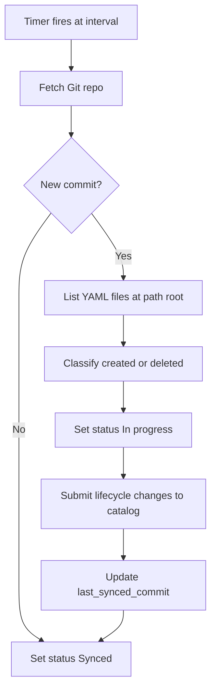
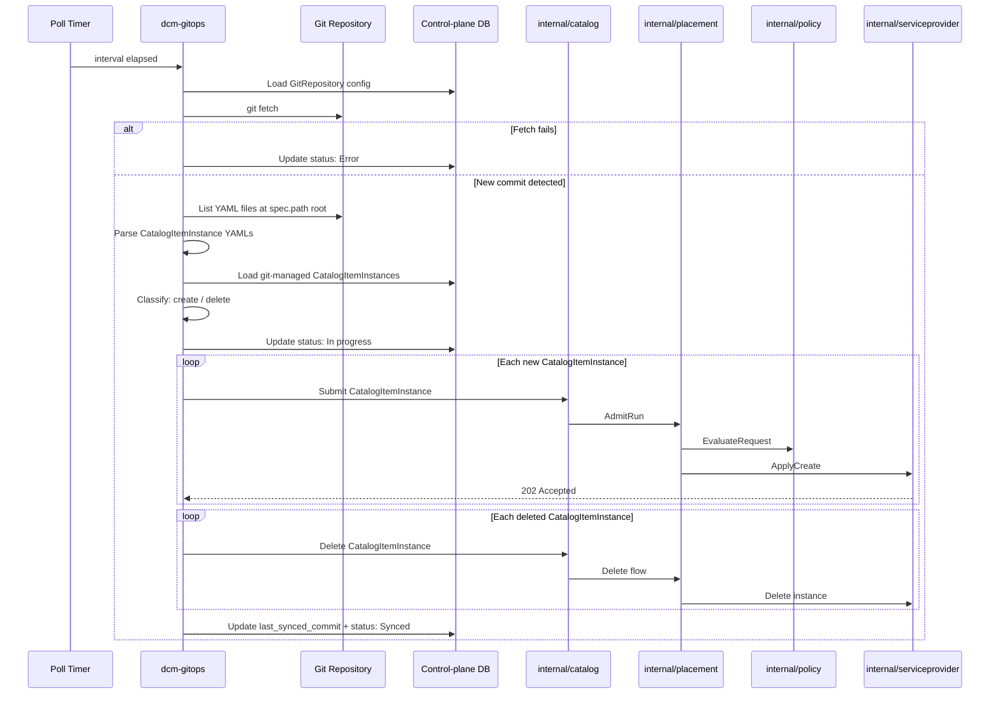

# GitOps Controller -- Git-driven CatalogItemInstance Lifecycle

## Summary

This enhancement adds Git-driven CatalogItemInstance lifecycle management to
DCM. A new `GitRepository` API resource lets users point DCM at a Git repository
containing CatalogItemInstance YAML definitions. A GitOps controller shipped as
a separate executable in the control-plane repository polls configured
repositories, detects changes to CatalogItemInstance YAML files at the root of
each watched path, and reconciles DCM state to match the desired state declared
in Git. Operators run this binary alongside `dcm-server` to enable GitOps. The
controller automatically applies lifecycle changes from Git — including
automatic deletion when a YAML file is removed from the repository — and reports
sync status.

## Motivation

Platform teams adopting DCM want the same Git-as-source-of-truth workflow they
use for infrastructure and Kubernetes workloads. Today, CatalogItemInstances are
submitted exclusively through the DCM API (either directly or via the UI). This
forces teams to build custom CI/CD integrations to bridge Git and DCM. A native
GitOps capability removes that gap, enables PR-based review for
CatalogItemInstance changes, provides a clear audit trail via Git history, and
allows teams to manage CatalogItemInstance definitions alongside the
infrastructure code that supports them.

The declarative-api enhancement already identifies "User/GitOps" as a submission
source
([see the architecture diagram in declarative-api.md](../declarative-api/declarative-api.md)),
confirming that GitOps was anticipated as a first-class entry point into the
catalog and placement flow.

### Goals

- Define a new `GitRepository` API resource for configuring Git repository
  connections (URL, branch, path, polling interval, and retry behavior).
- Define a GitOps controller component, shipped as a separate `dcm-gitops`
  binary in the control-plane repository, that polls Git repositories, detects
  changes, and reconciles CatalogItemInstance state in DCM.
- Integrate with the existing catalog/placement flow -- the GitOps controller
  submits CatalogItemInstances through the same internal path as API-driven
  submissions.
- Provide sync status reporting for Git repository reconciliation.
- Define the behavior for create and delete of CatalogItemInstances based on Git
  file changes at the root of the configured path (non-recursive).

### Non-Goals

- Watching non-CatalogItemInstance resources in Git (placements, service
  providers, policies, catalog items are out of scope).
- Webhook/push-based sync (only polling in v1; webhook can be added later as an
  optimization).
- Supporting Helm charts, Kustomize overlays, or any templating beyond raw DCM
  CatalogItemInstance YAML.
- Multi-cluster or federated GitOps (one DCM control plane, one controller).
- Git write-back (writing DCM status back into the Git repo).
- Approval-required reconciliation mode (deferred; v1 is auto-apply only).
- Handling Git authentication/credentials (users must provide Git repos that are
  public or otherwise accessible without custom credential management; v1 does
  not solve general Git credentials).
- Defining behavior for update operations on existing CatalogItemInstances (how
  updates in Git are propagated to instances in DCM) is out of scope for this
  enhancement and will be specified in a future proposal.
- Drift detection between Git desired state and DCM actual state (requires
  update reconciliation and is deferred until that capability exists).
- Recursive scanning of subdirectories under `spec.path` (v1 reads only files
  directly at the path root).

## Proposal

### Overview

The proposal introduces two resources and a controller:

1. **`GitRepository` resource** -- a new DCM API object that configures a
   connection to a Git repository. The resource specifies which branch and path
   to watch and how often to poll. The controller reads CatalogItemInstance YAML
   files located directly at `spec.path` — not in nested subdirectories. When a
   YAML file is removed from that path, the controller automatically deletes the
   corresponding instance in DCM.

2. **GitOps controller** -- reconciliation logic in the control-plane
   repository, built and deployed as a separate `dcm-gitops` binary. The code
   lives in the same monorepo as `dcm-server` and reuses control-plane packages,
   but operators must run `dcm-gitops` as its own process to enable GitOps.
   Without this binary, `GitRepository` resources can be configured through the
   DCM API but no polling or reconciliation occurs. For each `GitRepository`
   resource, the controller clones/fetches the repo at the configured interval,
   lists YAML files at the root of `spec.path`, detects lifecycle changes, and
   submits create/delete operations through the existing catalog integration.

### User Stories

#### Story 1 -- Platform engineer configures a Git source

A platform engineer has a Git repository
`https://git.example.com/team/dcm-apps.git` with CatalogItemInstance YAML files
directly under `apps/production/` (not in subfolders). They create a
`GitRepository` resource via the DCM API specifying the repo URL, branch `main`,
path `apps/production/`, a 60-second polling interval. With `dcm-gitops` running
alongside `dcm-server`, the GitOps controller begins polling and submits any
CatalogItemInstance definitions it finds at that path root.

#### Story 2 -- CatalogItemInstance removed from Git

A developer removes a CatalogItemInstance YAML file from the watched path and
merges the change. On the next poll, the GitOps controller detects the deletion
and automatically deletes the corresponding CatalogItemInstance in DCM.

### Implementation Details/Notes/Constraints

#### GitRepository Resource Schema

```yaml
api_version: v1alpha1
kind: GitRepository
metadata:
  name: production-apps
spec:
  url: "https://git.example.com/team/dcm-apps.git"
  ref:
    branch: main
  path: "apps/production/"
  interval: 60s
  reconciliation:
    retry_policy:
      max_retries: 3
      backoff_seconds: 30
```

**Spec fields:**

| Field                                              | Type     | Default  | Description                                                                                |
| -------------------------------------------------- | -------- | -------- | ------------------------------------------------------------------------------------------ |
| `spec.url`                                         | string   | required | Git repository URL                                                                         |
| `spec.ref.branch`                                  | string   | `main`   | Branch to watch                                                                            |
| `spec.path`                                        | string   | `/`      | Directory within the repo; only YAML files at this path root are read (not subdirectories) |
| `spec.interval`                                    | duration | `60s`    | Polling interval (min 10s)                                                                 |
| `spec.reconciliation.retry_policy.max_retries`     | int      | `3`      | Max retries on submit failure                                                              |
| `spec.reconciliation.retry_policy.backoff_seconds` | int      | `30`     | Backoff between retries                                                                    |

**Sync statuses:**

| Status        | Meaning                                       |
| ------------- | --------------------------------------------- |
| `Synced`      | DCM state matches Git at `last_synced_commit` |
| `Error`       | Sync failed (auth, network, parse errors)     |
| `In progress` | Lifecycle changes from Git are being applied  |

**Sync status transitions:**

- **Synced**: The controller sets the status to `Synced` when all
  CatalogItemInstance YAML files present in Git at `last_synced_commit` have
  corresponding instances in DCM, lifecycle operations from the latest
  reconciliation completed without failure, and no pending create or delete work
  remains.
- **Error**: If the controller attempts to create or delete a
  CatalogItemInstance from Git in DCM and that operation fails, the status
  transitions to `Error`.
- **In progress**: When the controller detects new or deleted YAML files in the
  watched Git repository, it moves the status to `In progress`. This state
  persists while those lifecycle changes are being applied to DCM, and reverts
  to `Synced` after all operations complete successfully.

These status flags help users and systems track the current reconciliation phase
and any issues that might need intervention.

#### File Discovery

The controller discovers CatalogItemInstance definitions by listing files
directly at `spec.path` after each fetch. v1 does not walk nested
subdirectories.

| Location                            | Included in reconciliation |
| ----------------------------------- | -------------------------- |
| `{spec.path}/webserver.yaml`        | Yes                        |
| `{spec.path}/database.yaml`         | Yes                        |
| `{spec.path}/team-a/webserver.yaml` | No                         |
| Files outside `spec.path`           | No                         |

Only regular files with a `.yaml` or `.yml` extension at the path root are
considered. Other file types and nested paths are ignored.

The controller lists files at the path root in alphabetical order by filename
and processes them in that sequence.

If more than one YAML file at the path root defines the same CatalogItemInstance
identity (same `metadata.name`), the file that sorts last alphabetically wins.
For example, given `alpha.yaml` and `zebra.yaml` with the same `metadata.name`,
`zebra.yaml` takes precedence. Operators should keep one YAML file per
CatalogItemInstance at the path root and avoid duplicate definitions.

#### API Endpoints

| Method | Endpoint                                     | Description            |
| ------ | -------------------------------------------- | ---------------------- |
| POST   | `/api/v1alpha1/git-repositories`             | Create a GitRepository |
| GET    | `/api/v1alpha1/git-repositories`             | List GitRepositories   |
| GET    | `/api/v1alpha1/git-repositories/{id}`        | Get a GitRepository    |
| PUT    | `/api/v1alpha1/git-repositories/{id}`        | Update a GitRepository |
| DELETE | `/api/v1alpha1/git-repositories/{id}`        | Delete a GitRepository |
| GET    | `/api/v1alpha1/git-repositories/{id}/status` | Get sync status        |
| POST   | `/api/v1alpha1/git-repositories/{id}:sync`   | Trigger immediate sync |

#### Controller Architecture

The GitOps controller is a separate process from `dcm-server`:

| Component    | Role                                                                |
| ------------ | ------------------------------------------------------------------- |
| `dcm-server` | Serves the `GitRepository` API and stores repository configuration  |
| `dcm-gitops` | Polls Git, reconciles CatalogItemInstance lifecycle, updates status |

Both binaries are built from the control-plane repository. `dcm-gitops` connects
to the same control-plane database and submits CatalogItemInstance changes
through the catalog integration shared with `dcm-server`.

```
cmd/dcm-gitops/      # entrypoint for the GitOps binary
internal/gitops/
  controller.go      # main reconciliation loop
  repository.go      # git clone/fetch/diff operations
  parser.go          # parse CatalogItemInstance YAML from files
  reconciler.go      # classify desired (Git) vs actual (DCM) lifecycle state
```

`dcm-gitops` runs one reconciliation timer per `GitRepository` resource. It must
be deployed and kept running for GitOps sync to occur.

#### Reconciliation Loop



#### Interaction with Existing Catalog/Placement Flow

The GitOps controller acts as an automated submission source. It does NOT bypass
catalog or placement:

1. **Create**: The controller submits CatalogItemInstances through the same path
   as `POST /api/v1alpha1/catalog-item-instances`. Catalog resolves the
   blueprint, placement builds the DAG, policy evaluates, and SPRM provisions.

2. **Delete**: When a YAML file disappears from the watched Git path, the
   controller automatically deletes the corresponding CatalogItemInstance
   through the catalog delete path, which triggers the existing delete flow
   through placement and SPRM.

Each CatalogItemInstance created by the GitOps controller is tagged with
metadata:

- `gitops.dcm.io/managed-by: gitops-controller`
- `gitops.dcm.io/repository: <git-repository-id>`
- `gitops.dcm.io/source-path: apps/production/my-app.yaml`
- `gitops.dcm.io/commit: <sha>`

This metadata identifies Git-managed instances and prevents conflicts with
manually created CatalogItemInstances.

#### Conflict Resolution

| Scenario                    | Behavior                                     |
| --------------------------- | -------------------------------------------- |
| Git changed, DCM unchanged  | Auto-apply Git lifecycle changes             |
| Git unchanged, DCM changed  | No action (updates out of scope)             |
| Git changed AND DCM changed | Git wins for lifecycle changes               |
| App in DCM but not in Git   | Automatically delete in DCM                  |
| App in Git but not in DCM   | Create in DCM                                |
| Invalid YAML in Git         | Skip file; report error in status conditions |
| Duplicate instance identity | Last file alphabetically wins                |

#### Database Schema Additions

New tables in the control-plane database:

- `git_repositories` -- stores GitRepository resource fields, status, and last
  synced commit.

## Design Details



## Drawbacks

- Polling adds load on both DCM and Git servers, especially with many
  repositories or short intervals. Webhook support would be more efficient but
  adds complexity and requires DCM to expose an ingress endpoint.
- Git-as-source-of-truth means operators must commit changes to Git rather than
  using the DCM API directly for GitOps-managed CatalogItemInstances.
- Removing a YAML file from Git automatically deletes the corresponding
  CatalogItemInstance in DCM. A mistaken Git deletion can trigger unintended
  teardown before an operator intervenes.
- Duplicate CatalogItemInstance definitions at the path root are resolved by
  alphabetical filename order; the last file alphabetically wins, which can hide
  conflicting definitions until an operator notices unexpected behavior.
- GitOps requires an additional deployable (`dcm-gitops`) beyond `dcm-server`.
  If `dcm-gitops` is not running, repository configuration is stored but
  reconciliation does not occur.
- The GitOps binary runs as a separate process, isolating polling workload from
  the API server. A bug in the polling loop does not take down `dcm-server`, but
  operators must monitor and operate a second control-plane component.

## Alternatives

### Alternative 1 -- Webhook-based sync

#### Description

Instead of polling, DCM exposes a webhook endpoint that Git providers call on
push events. The controller processes changes on-demand rather than on a timer.

#### Pros

- Near-instant sync; no polling overhead.
- Lower resource usage when repositories change infrequently.

#### Cons

- Requires DCM to expose an externally reachable HTTP endpoint.
- Git-provider-specific webhook payload formats (GitHub, GitLab, Gitea differ).
- Missed webhooks require a fallback polling mechanism anyway.

#### Status

Deferred

#### Rationale

Polling is simpler to implement, works with any Git provider (generic git
protocol), and does not require DCM to be reachable from the Git server. Webhook
support can be added as an optimization later, with polling as the fallback.

### Alternative 2 -- Embed GitOps controller in `dcm-server`

#### Description

Run the GitOps reconciliation loop inside the `dcm-server` process as a
background goroutine started at boot, rather than as a separate binary.

#### Pros

- One fewer deployable for operators to run and monitor.
- No separate process lifecycle to manage.

#### Cons

- Polling and Git fetch workload shares the API server process.
- A bug in the reconciliation loop could affect core DCM API availability.

#### Status

Rejected

#### Rationale

A separate `dcm-gitops` binary keeps polling isolated from the API server while
still sharing code and the control-plane database within one repository.
Operators opt in to GitOps by running the additional binary rather than paying
the polling cost on every `dcm-server` deployment.

## Future Improvements

- **Explicit-action deletion mode**: Add an optional mode where YAML removals
  from Git produce a pending delete record that an operator must confirm before
  the corresponding CatalogItemInstance is removed from DCM.
- **Approval-required reconciliation mode**: Add a configurable mode where
  changes produce pending sync records that an operator must approve before they
  are applied.
- **Webhook-based sync**: Add an optional webhook endpoint for near-instant
  sync, with polling as the fallback (see Alternative 1).
- **Support for Git credentials**: Allow users to configure authentication
  credentials (such as HTTPS username/password or SSH keys) for private
  repositories. The GitRepository resource would be extended to reference or
  store credential information securely, enabling the GitOps controller to
  access private repositories in enterprise environments.
- **Recursive path scanning**: Extend file discovery to walk subdirectories
  under `spec.path` for teams that organize CatalogItemInstance YAMLs in nested
  folders.
- **Update reconciliation and drift detection**: Add support for propagating Git
  spec changes to existing CatalogItemInstances and reporting divergence between
  Git desired state and DCM actual state.
