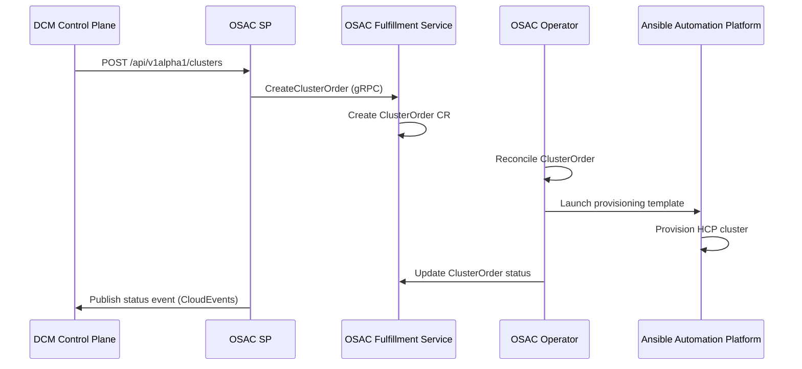

# OSAC Service Provider

## Open Questions

> 1. Should the OSAC SP support catalog item selection (exposing OSAC's cluster
>    catalog items to DCM), or should DCM manage its own catalog and translate
>    to OSAC template parameters?
> 2. How should multi-hub topologies be handled? OSAC supports multiple
>    infrastructure hubs managed by a single fulfillment service — should DCM be
>    aware of hub selection or should OSAC handle placement internally?
> 3. What authentication mechanism should the OSAC SP use to communicate with
>    the OSAC fulfillment service (service account token, mTLS, or OAuth)?

## Summary

The OSAC Service Provider (OSAC SP) is a REST API that manages OpenShift
clusters through the Open Sovereign AI Cloud (OSAC) platform. It exposes
endpoints for creating, reading, and deleting clusters, and integrates with the
DCM Service Provider Registry. The OSAC SP acts as an adapter between DCM and
the OSAC fulfillment service, translating DCM cluster requests into OSAC
fulfillment API calls.

### Scope Notes (v1)

This document defines the v1 implementation scope, which focuses on:

- **Service Type**: `cluster` only (OpenShift clusters via Hosted Control
  Planes)
- **Integration Path**: OSAC fulfillment service public gRPC API
  (`osac.public.v1.ClusterOrders`)

**VM-as-a-Service (deferred):** OSAC's `ComputeInstance` CRD and operator
controller are feature-complete (multi-NIC networking, security groups, console
proxy, provisioning webhooks). However, the OSAC fulfillment service does not
yet expose a public gRPC service for VM operations — the public API currently
lists only `ClusterOrders`, `Clusters`, and `ClusterTemplates`. Once OSAC
surfaces VM lifecycle operations through their public fulfillment API, a
subsequent version of this enhancement will add `serviceType: "vm"` registration
using the same adapter pattern. This avoids bypassing OSAC's intended
architecture by creating CRDs directly on the hub cluster.

## Motivation

OSAC provides a self-service platform for provisioning OpenShift clusters, VMs,
and bare metal hosts at scale, currently deployed at the Mass Open Cloud (MOC).
Integrating OSAC as a DCM Service Provider enables DCM to leverage OSAC's mature
provisioning infrastructure — including Hosted Control Planes, template-based
automation via Ansible Automation Platform (AAP), and multi-hub support —
without duplicating OSAC's existing orchestration logic.

### Goals

- Define the lifecycle of an SP using OSAC to provision OpenShift clusters.
- Define the registration flow with DCM SP API.
- Define `CREATE`, `READ`, and `DELETE` endpoints for managing clusters
  provisioned via OSAC.
- Define status reporting mechanism for DCM requests.
- Define how cluster credentials are communicated to the user.

### Non-Goals

- Define endpoints for day 2 operations (`scale`, `upgrade`, `hibernate`) for
  cluster instances.
- **VM-as-a-Service provisioning** — OSAC's ComputeInstance operator is
  feature-complete, but the fulfillment service public gRPC API does not yet
  expose VM operations. VM support will be added once OSAC surfaces
  `ComputeInstance` lifecycle through `osac.public.v1.*`. See
  [Scope Notes](#scope-notes-v1).
- Bare Metal-as-a-Service as a standalone service type — bare metal hosts are
  the underlying infrastructure for OSAC clusters, not a separate user-facing
  service.
- Deployment strategy for the OSAC SP API.
- Define `UPDATE` endpoint, as this is out of scope for v1.
- Multi-hub placement logic — OSAC handles hub selection internally.
- OSAC internal components (operator, AAP playbooks, networking controllers).

## Proposal

### Assumptions

- The OSAC platform is deployed and operational, including the fulfillment
  service, OSAC operator, and AAP backend.
- The OSAC fulfillment service is reachable from the OSAC SP via gRPC or REST.
- The OSAC SP has valid credentials (service account token) to authenticate
  against the OSAC fulfillment service.
- The DCM Service Provider Registry is reachable for registration.
- DCM messaging system is reachable for publishing status updates.
- At least one infrastructure hub is registered with the OSAC fulfillment
  service and has capacity to provision clusters.
- Network policies allow OSAC SP to communicate with both DCM and the OSAC
  fulfillment service.

### Integration Points

#### OSAC Fulfillment Service Integration

The OSAC SP communicates with the OSAC fulfillment service using its gRPC API.
The fulfillment service manages the lifecycle of cluster orders by coordinating
with the OSAC operator on the hub cluster.

- Uses the OSAC fulfillment service gRPC API to create, query, and delete
  cluster orders.
- The fulfillment service translates requests into `ClusterOrder` custom
  resources on the hub cluster.
- The OSAC operator reconciles `ClusterOrder` CRDs by triggering AAP
  provisioning templates.
- Clusters are provisioned using Hosted Control Planes via ACM on the hub
  cluster.



#### DCM SP Registry

- Auto-registration on startup with DCM SP Registrar. See documentation for
  [DCM Registration Flow](https://github.com/dcm-project/enhancements/blob/main/enhancements/sp-registration-flow/sp-registration-flow.md).

#### DCM SP Health Check

OSAC SP must expose a health endpoint `http://<provider-ip>:<port>/health` for
DCM control plane to poll every 10 seconds. See documentation for
[SP Health Check](https://github.com/dcm-project/enhancements/blob/main/enhancements/service-provider-health-check/service-provider-health-check.md).

#### DCM SP Status Reporting

- Publish status updates for cluster instances to the messaging system using
  CloudEvents format. Events are published to the subject:
  `dcm.providers.{providerName}.cluster.instances.{instanceId}.status`
- See documentation for
  [SP Status Reporting](https://github.com/dcm-project/enhancements/blob/main/enhancements/state-management/service-provider-status-reporting.md).
- Use a polling loop against the OSAC fulfillment service to detect status
  changes on ClusterOrder resources.

### User Stories

#### Story 1: Provision an OpenShift Cluster

As a DCM user, I want to request an OpenShift cluster through DCM so that I
receive a fully provisioned cluster with credentials, without needing to
interact with OSAC directly.

#### Story 2: Query Cluster Status

As a DCM user, I want to check the status of my cluster provisioning request so
that I know when my cluster is ready and can retrieve the access credentials.

#### Story 3: Delete a Cluster

As a DCM user, I want to delete a cluster I no longer need so that
infrastructure resources are released.

### SP Configuration

The OSAC SP supports configuration options that control how it connects to the
OSAC fulfillment service.

#### Fulfillment Service Configuration

| Field                | Type   | Default | Description                                   |
| -------------------- | ------ | ------- | --------------------------------------------- |
| fulfillmentAddress   | string | ""      | OSAC fulfillment service gRPC address         |
| fulfillmentTokenFile | string | ""      | Path to file containing the gRPC auth token   |
| defaultHubName       | string | ""      | Default hub for cluster provisioning          |
| tlsEnabled           | bool   | true    | Enable TLS for fulfillment service connection |
| tlsCertFile          | string | ""      | Path to TLS certificate file                  |

### Registration Flow

The OSAC SP API must successfully complete a registration process to ensure DCM
is aware of it and can use it. During startup, the service uses the DCM
registration client to send a request to the SP API registration endpoint
`POST /api/v1alpha1/providers`. See DCM
[registration flow](https://github.com/dcm-project/enhancements/blob/main/enhancements/sp-registration-flow/sp-registration-flow.md)
for more information.

Example request payload:

```json
{
  "name": "osac-sp",
  "serviceType": "cluster",
  "displayName": "OSAC Service Provider",
  "endpoint": "https://osac-sp.example.com/api/v1alpha1/clusters",
  "metadata": {
    "capabilities": {
      "supportedPlatforms": ["baremetal"],
      "supportedProvisioningTypes": ["hypershift"],
      "kubernetesSupportedVersions": ["1.29", "1.30", "1.31"]
    }
  },
  "operations": ["CREATE", "DELETE", "READ"]
}
```

#### Capability Advertisement

| Field                       | Type     | Description                                        |
| --------------------------- | -------- | -------------------------------------------------- |
| supportedPlatforms          | []string | Platforms this SP can provision (baremetal)        |
| supportedProvisioningTypes  | []string | Provisioning methods available (hypershift for v1) |
| kubernetesSupportedVersions | []string | Kubernetes versions supported by this SP           |

The SP populates these values based on the capabilities reported by the OSAC
fulfillment service. The OSAC platform provisions clusters on bare metal
infrastructure using Hosted Control Planes.

#### Registration Process

The OSAC SP follows the standard self-registration process defined in the
[SP registration flow](https://github.com/dcm-project/enhancements/blob/main/enhancements/sp-registration-flow/sp-registration-flow.md):

- API server starts and initializes HTTP listener.
- After the server is ready, registration runs in a background goroutine.
- Registration request is sent to the DCM Service Provider Registry.
- On success, the service is registered and available for DCM to use.
- Registration failures are retried with exponential backoff and logged but do
  not block server startup.

### API Endpoints

The CRUD endpoints are consumed by the DCM SP API to create and manage cluster
resources.

#### Endpoints Overview

| Method | Endpoint                           | Description               |
| ------ | ---------------------------------- | ------------------------- |
| POST   | /api/v1alpha1/clusters             | Create a new cluster      |
| GET    | /api/v1alpha1/clusters             | List all clusters         |
| GET    | /api/v1alpha1/clusters/{clusterId} | Get a cluster instance    |
| DELETE | /api/v1alpha1/clusters/{clusterId} | Delete a cluster instance |
| GET    | /api/v1alpha1/health               | OSAC SP health check      |

##### AEP Compliance

These endpoints are defined based on AEP standards and use `aep-openapi-linter`
to check for compliance with AEP.

#### POST /api/v1alpha1/clusters

**Description:** Create a new OpenShift cluster.

The POST endpoint follows the contract defined in the Cluster schema spec
pre-defined by DCM core. See
[Cluster Schema](https://github.com/dcm-project/enhancements/blob/main/enhancements/service-type-definitions/service-type-definitions.md#kubernetes-cluster)
for the complete specification.

The OSAC SP translates the DCM cluster request into an OSAC fulfillment service
`CreateClusterOrder` gRPC call, mapping DCM fields to OSAC's ClusterOrder
specification.

**Field Mapping (DCM to OSAC):**

| DCM Field                | OSAC ClusterOrder Field | Notes                                  |
| ------------------------ | ----------------------- | -------------------------------------- |
| version                  | templateParameters      | Mapped to OpenShift release image      |
| nodes.controlPlane.count | nodeRequests[cp].count  | HCP manages internally; passed as hint |
| nodes.worker.count       | nodeRequests[w].count   | Number of worker nodes                 |
| nodes.worker.cpu         | nodeRequests[w].cpu     | CPU per worker node                    |
| nodes.worker.memory      | nodeRequests[w].memory  | Memory per worker node                 |
| nodes.worker.storage     | nodeRequests[w].storage | Storage per worker node                |
| metadata.name            | name                    | Cluster name                           |
| providerHints.osac       | templateParameters      | OSAC-specific parameters (see below)   |

**Provider Hints (osac):**

| Field        | Type   | Description                                          |
| ------------ | ------ | ---------------------------------------------------- |
| hubName      | string | Target hub for provisioning (overrides default)      |
| templateId   | string | OSAC catalog template to use for provisioning        |
| baseDomain   | string | Base DNS domain for the cluster                      |
| pullSecret   | string | Pull secret reference for cluster image pulls        |
| sshKey       | string | SSH public key for node access                       |
| releaseImage | string | Specific OpenShift release image (overrides version) |

**Example Request Payload:**

```json
{
  "version": "4.16",
  "nodes": {
    "controlPlane": {
      "count": 3,
      "cpu": 4,
      "memory": "16GB",
      "storage": "120GB"
    },
    "worker": {
      "count": 3,
      "cpu": 8,
      "memory": "32GB",
      "storage": "250GB"
    }
  },
  "metadata": {
    "name": "sovereign-ai-cluster-01"
  },
  "providerHints": {
    "osac": {
      "baseDomain": "moc.example.com",
      "templateId": "default-hcp"
    }
  },
  "serviceType": "cluster"
}
```

**Response:** Returns `201 Created` with the following payload. The status is
set to `PENDING` after the resource is created.

```json
{
  "requestId": "a1b2c3d4-e5f6-7890-abcd-ef1234567890",
  "name": "sovereign-ai-cluster-01",
  "status": "PENDING",
  "platform": "baremetal",
  "version": "4.16",
  "apiEndpoint": "",
  "consoleUrl": "",
  "nodes": {
    "controlPlane": {
      "ready": 0,
      "total": 3
    },
    "worker": {
      "ready": 0,
      "total": 3
    }
  },
  "kubeconfig": "",
  "metadata": {
    "namespace": "sovereign-ai-cluster-01",
    "createdAt": "2026-06-29T14:30:00Z"
  }
}
```

**Error Handling:**

- **400 Bad Request**: Invalid request payload or missing required fields
- **409 Conflict**: Cluster with the same `metadata.name` already exists
- **422 Unprocessable Entity**: Unsupported configuration or version
- **500 Internal Server Error**: Unexpected error during resource creation
- **502 Bad Gateway**: OSAC fulfillment service is unreachable

#### GET /api/v1alpha1/clusters

**Description:** List all cluster instances with pagination support.

**Query Parameters:**

- `max_page_size` (optional): Maximum number of resources to return in a single
  page. Default: 50.
- `page_token` (optional): Token indicating the starting point for the page.

**Process Flow:**

1. Handler receives `GET` request with optional pagination parameters.
2. Calls OSAC fulfillment service `ListClusterOrders` gRPC method.
3. Filters results to those created by this SP instance.
4. Returns fully-populated cluster resources per AEP-132.
5. Response includes pagination metadata (`next_page_token`).

**Error Handling:**

- **400 Bad Request**: Invalid pagination parameters
- **500 Internal Server Error**: Unexpected error querying OSAC
- **502 Bad Gateway**: OSAC fulfillment service is unreachable

#### GET /api/v1alpha1/clusters/{clusterId}

**Description:** Get a specific cluster instance.

**Process Flow:**

1. Handler receives `GET` request with `clusterId` path parameter.
2. Calls OSAC fulfillment service `GetClusterOrder` gRPC method using the stored
   OSAC order ID mapped to `clusterId`.
3. Translates OSAC ClusterOrder status and details to DCM response format.
4. Populates `kubeconfig` field when cluster reaches `READY` status.
5. Returns complete cluster instance object.

**Kubeconfig Field Behavior:**

- **READY**: Contains the base64-encoded kubeconfig retrieved from the OSAC
  fulfillment service. Users can decode this to access the cluster.
- **PROVISIONING/PENDING**: Empty string. Credentials are not yet available.
- **FAILED**: Empty string. Cluster provisioning failed.

**Error Handling:**

- **404 Not Found**: Cluster with the specified `clusterId` does not exist
- **500 Internal Server Error**: Unexpected error querying OSAC
- **502 Bad Gateway**: OSAC fulfillment service is unreachable

#### DELETE /api/v1alpha1/clusters/{clusterId}

**Description:** Delete a cluster instance.

Sends a `DeleteClusterOrder` gRPC call to the OSAC fulfillment service, which
triggers the OSAC operator to decommission the cluster via AAP. Returns
`204 No Content`.

**Process Flow:**

1. Handler receives `DELETE` request with `clusterId` path parameter.
2. Looks up the OSAC order ID mapped to `clusterId`.
3. Calls OSAC fulfillment service `DeleteClusterOrder` gRPC method.
4. Returns `204 No Content` on success.

**Error Handling:**

- **404 Not Found**: Cluster with the specified `clusterId` does not exist
- **500 Internal Server Error**: Unexpected error during deletion
- **502 Bad Gateway**: OSAC fulfillment service is unreachable

#### GET /api/v1alpha1/health

**Description:** Retrieve the health status for the OSAC Service Provider API.

The health check verifies:

- Connectivity to the OSAC fulfillment service (gRPC health check)
- Valid authentication credentials
- At least one hub is registered and available

### Implementation Details/Notes/Constraints

#### ID Mapping

The OSAC SP maintains a mapping between DCM instance IDs (`clusterId`) and OSAC
order IDs. This mapping is stored locally and used to translate between DCM and
OSAC identifiers on all operations.

#### Status Polling

Unlike SPs that watch Kubernetes CRDs directly, the OSAC SP polls the OSAC
fulfillment service at a configurable interval (default: 30 seconds) to detect
status changes on cluster orders. When a status change is detected, the SP
publishes a CloudEvents status update to DCM.

#### Version Translation

The OSAC SP translates between DCM's Kubernetes version format (e.g., `1.29`)
and OSAC's OpenShift version format (e.g., `4.16`). The SP maintains an internal
compatibility matrix for this translation. If a user specifies `version` using
the OpenShift format directly (e.g., `4.16`), the SP accepts it without
translation.

### Risks and Mitigations

| Risk                                                                    | Mitigation                                                                                                             |
| ----------------------------------------------------------------------- | ---------------------------------------------------------------------------------------------------------------------- |
| OSAC fulfillment service is unavailable, causing all operations to fail | Health check detects connectivity loss; exponential backoff on retries; DCM can route to alternative cluster providers |
| Status polling introduces latency in reporting cluster readiness        | Configurable poll interval; future enhancement to use OSAC webhooks or streaming for real-time status                  |
| ID mapping data loss (local storage) causes orphaned clusters           | Persist mapping in a durable store; reconciliation loop matches OSAC orders by metadata labels                         |
| OSAC platform version upgrades change the gRPC API contract             | Pin to a specific OSAC API version; version negotiation on startup                                                     |
| Network partition between OSAC SP and fulfillment service               | Circuit breaker pattern; return 502 to DCM so it can retry or failover                                                 |

## Design Details

### Status Reporting to DCM

The OSAC SP uses a polling loop to monitor cluster order status changes in the
OSAC fulfillment service and publishes updates to DCM via CloudEvents.

#### Polling Loop

- Runs in a background goroutine at a configurable interval (default: 30s).
- Queries the OSAC fulfillment service for all cluster orders created by this SP
  instance.
- Compares current status against last-known status from the local cache.
- Publishes a CloudEvents status update for each order that has changed.

#### CloudEvents Format

Status updates are published using the [CloudEvents](https://cloudevents.io/)
specification (v1.0).

**Message Subject:**

`dcm.providers.{providerName}.cluster.instances.{instanceId}.status`

**Event Type:**

`dcm.providers.{providerName}.status.update`

**Payload:**

```json
{
  "status": "READY",
  "message": "Cluster is ready and all nodes are available."
}
```

#### Status Mapping (OSAC to DCM)

| DCM Status   | OSAC ClusterOrder Condition        | Description                     |
| ------------ | ---------------------------------- | ------------------------------- |
| PENDING      | Accepted=True, Progressing=False   | Order accepted, not yet started |
| PROVISIONING | Progressing=True                   | Cluster is being provisioned    |
| READY        | Available=True                     | Cluster is fully operational    |
| FAILED       | Failed=True                        | Provisioning failed             |
| UNAVAILABLE  | Available=False, Progressing=False | Cluster is not available        |
| DELETED      | N/A                                | ClusterOrder not found          |

### Upgrade / Downgrade Strategy

The OSAC SP is a stateless adapter service. Upgrades are performed by deploying
a new version of the SP image. The ID mapping store must be preserved across
upgrades. Downgrades are safe as long as the OSAC fulfillment service gRPC API
remains backward-compatible.

## Implementation History

- 2026-06-29: Initial enhancement proposal created.

## Drawbacks

The primary drawback is the additional indirection layer. Unlike the ACM Cluster
SP which creates HyperShift CRDs directly on the hub cluster, the OSAC SP goes
through the OSAC fulfillment service, adding a network hop and dependency. This
introduces:

- Higher latency on provisioning requests (additional gRPC call).
- An additional failure point (fulfillment service availability).
- Status reporting via polling rather than direct CRD watches, which adds
  latency to status updates.

This tradeoff is acceptable because it preserves OSAC's existing orchestration
logic (multi-hub placement, template-based automation, catalog management)
without reimplementing it in the SP, and aligns with OSAC's intended integration
model where external consumers go through the fulfillment API.

## Alternatives

### Alternative 1: Direct CRD Creation on OSAC Hub Cluster

#### Description

The OSAC SP creates `ClusterOrder` CRDs directly on the OSAC hub cluster,
bypassing the fulfillment service entirely. This is similar to how the ACM
Cluster SP creates `HostedCluster` CRDs directly.

#### Pros

- Lower latency (no gRPC hop to fulfillment service)
- Direct CRD watch for real-time status updates (SharedIndexInformer)
- Fewer moving parts in the data path
- Simpler error handling (fewer network boundaries)

#### Cons

- Bypasses OSAC's fulfillment logic (catalog items, multi-hub placement, access
  control)
- Requires OSAC SP to have cluster-admin credentials on the hub cluster
- Tightly couples DCM to OSAC's internal CRD schema, which may change
- Cannot leverage OSAC's built-in rate limiting and request validation
- Breaks OSAC's intended architecture where external consumers use the API

#### Status

Rejected

#### Rationale

The fulfillment service exists precisely to provide a governed, stable API
surface for external consumers. Bypassing it would require the OSAC SP to
reimplement OSAC's orchestration logic and would create a maintenance burden as
OSAC's internal CRD schema evolves. The additional latency of the gRPC hop is
negligible compared to cluster provisioning time (minutes to hours).

### Alternative 2: OSAC REST Gateway Instead of gRPC

#### Description

Use the OSAC fulfillment service's REST gateway instead of the gRPC API for
communication between the OSAC SP and OSAC.

#### Pros

- Simpler implementation (HTTP/JSON vs. Protocol Buffers)
- Easier to debug with standard HTTP tooling (curl, browser)
- No protobuf dependency in the OSAC SP codebase

#### Cons

- REST gateway may not expose all gRPC features (streaming, bidirectional)
- Additional translation layer (REST gateway is itself a gRPC client)
- Slightly higher overhead (JSON serialization vs. protobuf)
- REST gateway may lag behind gRPC API in feature parity

#### Status

Deferred

#### Rationale

gRPC provides better performance, type safety via generated clients, and access
to the full OSAC API surface including streaming for future real-time status
updates. If the REST gateway achieves full feature parity and the team prefers
HTTP-based integration, this can be revisited. The implementation could support
both backends via a configurable transport layer.

### Alternative 3: Include VM Support in v1 via Direct CRD Creation

#### Description

Add `serviceType: "vm"` support in v1 by having the OSAC SP create
`ComputeInstance` CRDs directly on the OSAC hub cluster, bypassing the
fulfillment service for VM operations while using the fulfillment gRPC API for
clusters.

#### Pros

- Delivers both service types in v1
- OSAC's ComputeInstance operator is already feature-complete
- Users get VM provisioning without waiting for OSAC's fulfillment API

#### Cons

- Creates two different integration paths within a single SP (gRPC for clusters,
  direct CRD for VMs), increasing complexity
- Bypasses OSAC's intended architecture for external consumers
- Tightly couples the OSAC SP to the ComputeInstance CRD schema, which is still
  evolving (e.g., OSAC-769 multi-NIC migration completed June 2026)
- Requires cluster-admin credentials on the hub for VM operations
- When OSAC does expose VMs through the fulfillment API, the SP would need to
  migrate from direct CRD to gRPC — a breaking change in integration pattern
- No access to OSAC's catalog templates, rate limiting, or access control for
  VMs

#### Status

Rejected

#### Rationale

The short-term benefit of delivering VM support in v1 does not justify the
technical debt of maintaining two divergent integration paths. The
ComputeInstance CRD is still undergoing schema changes (recent field removals,
immutability additions), and coupling to it directly would create a maintenance
burden. Waiting for OSAC to expose VMs through their public fulfillment API
ensures a consistent adapter pattern across both service types and avoids a
costly migration later.

## Infrastructure Needed

- Access to an OSAC deployment (fulfillment service, operator, hub cluster with
  AAP) for integration testing.
- gRPC client stubs generated from OSAC's protobuf definitions.
- CI/CD pipeline for building and testing the OSAC SP image.
- Container registry for publishing the OSAC SP image.
