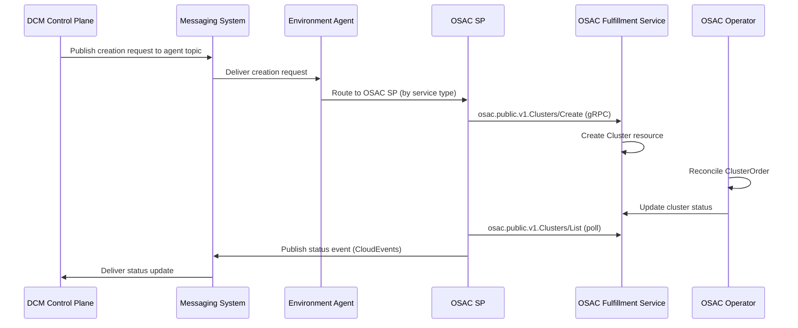
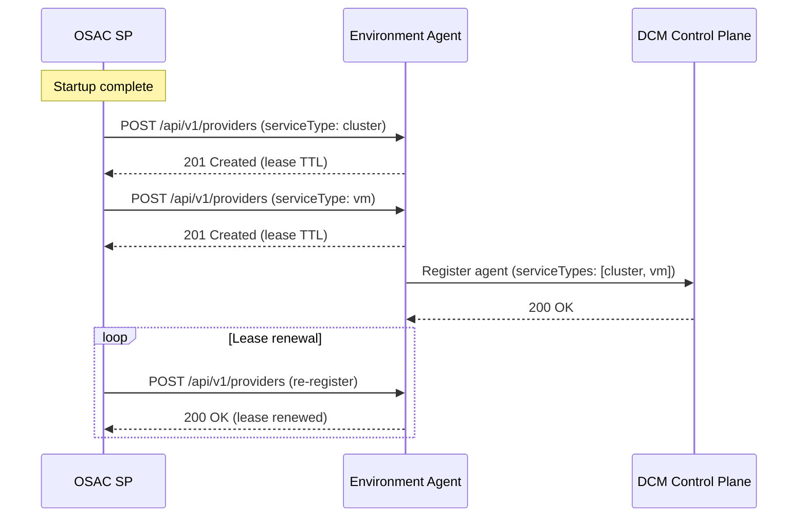
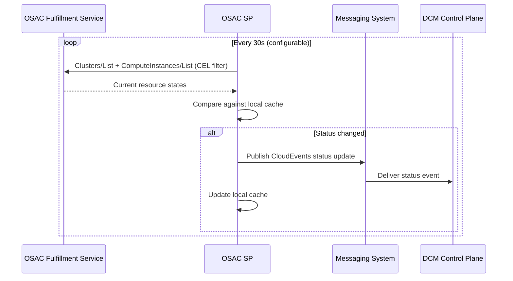
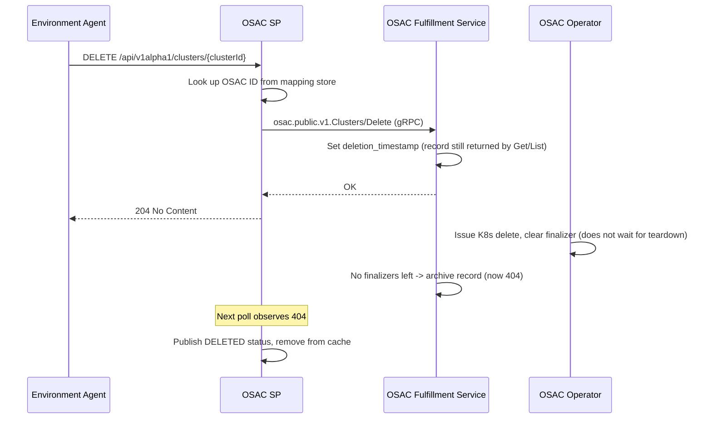
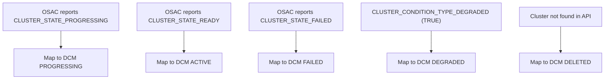

# OSAC Service Provider

## Open Questions

N/A — all open questions raised during review have been resolved; see the
resolution notes in [Node Sizing](#node-sizing) and [VM Sizing](#vm-sizing).

## Summary

The OSAC Service Provider (OSAC SP) is an external Service Provider that
integrates the Open Sovereign AI Cloud (OSAC) platform with DCM through the
environment agent model. It provisions OpenShift clusters and VMs by translating
agent-routed requests into OSAC fulfillment service gRPC API calls, and reports
status changes back via the messaging system.

## Motivation

OSAC provides a self-service platform for provisioning OpenShift clusters, VMs,
and bare metal hosts at scale, currently deployed at the Mass Open Cloud (MOC).
Integrating OSAC as a DCM Service Provider enables DCM to leverage OSAC's mature
provisioning infrastructure — including Hosted Control Planes, template-based
automation via Ansible Automation Platform (AAP), and multi-hub support —
without duplicating OSAC's existing orchestration logic.

### Goals

- Define the lifecycle of an SP using OSAC to provision OpenShift clusters and
  VMs.
- Define the registration flow with the environment agent.
- Define `CREATE`, `READ`, and `DELETE` endpoints for managing clusters and VMs
  provisioned via OSAC.
- Define status reporting mechanism for DCM requests via CloudEvents.
- Define how cluster credentials are communicated to the user.

### Non-Goals

- Define endpoints for day 2 operations (`scale`, `upgrade`, `hibernate`) for
  cluster instances — the DCM SP API does not yet define an `UPDATE` verb or
  mutable-field contract for cluster resources. OSAC's fulfillment service
  supports
  [`Clusters/Update`](https://github.com/osac-project/fulfillment-service/blob/98c6b6860cc3844acfbe505402ebb2f4d80523c9/proto/public/osac/public/v1/clusters_service.proto),
  so day 2 operations can be added once DCM standardizes the update contract.
- Bare Metal-as-a-Service as a standalone service type — bare metal hosts are
  the underlying infrastructure for OSAC clusters, not a separate user-facing
  service.
- Deployment strategy for the OSAC SP API.
- Define `UPDATE` endpoint — blocked on the same DCM SP API dependency as day 2
  operations above.
- Multi-hub placement logic — OSAC handles hub selection internally; DCM
  placement selects the environment agent, not the SP.
- OSAC internal components (operator, AAP playbooks, networking controllers).

## Proposal

### Assumptions

- The OSAC platform is deployed and operational, including the fulfillment
  service, OSAC operator, and AAP backend.
- The OSAC fulfillment service is reachable from the OSAC SP via gRPC or REST.
- The OSAC SP is registered as an OAuth 2.0 client in OSAC's Keycloak instance
  and has valid credentials (client ID and secret) to authenticate via OIDC
  client credentials flow. The OSAC
  [authorization policy](https://github.com/osac-project/fulfillment-service/blob/98c6b6860cc3844acfbe505402ebb2f4d80523c9/internal/auth/policies/authz.rego)
  grants `Clusters/Create`, `ComputeInstances/Create`, and all other CRUD
  methods to any authenticated client — no elevated permissions are required.
- An environment agent is deployed and reachable for SP registration.
- The DCM messaging system is reachable for publishing status updates.
- At least one infrastructure hub is registered with the OSAC fulfillment
  service and has capacity to provision clusters.
- Network policies allow OSAC SP to communicate with both the environment agent
  and the OSAC fulfillment service.

### Authentication

OSAC uses Keycloak as its identity provider with standard OIDC support. The OSAC
SP authenticates against the OSAC fulfillment service using the OAuth 2.0 client
credentials flow:

1. The OSAC SP is registered as a client in OSAC's Keycloak instance.
2. On startup (and periodically), the SP obtains a JWT from Keycloak using its
   client credentials.
3. The JWT is passed as a bearer token on all gRPC calls to the OSAC fulfillment
   service.

For multi-tenant fleet management, OSAC does **not** support Keycloak token
exchange (RFC 8693) — the realm configuration explicitly sets
`standard.token.exchange.enabled: false`
([realm.json](https://github.com/osac-project/fulfillment-service/blob/98c6b6860cc3844acfbe505402ebb2f4d80523c9/it/charts/keycloak/files/realm.json)),
and
[`AUTH.md`](https://github.com/osac-project/fulfillment-service/blob/98c6b6860cc3844acfbe505402ebb2f4d80523c9/docs/AUTH.md)
documents only client credentials for service accounts and group-based tenancy
for users. Instead, OSAC resolves tenancy from Keycloak group membership:
Authorino maps the caller's Keycloak groups (or, for service accounts, the
`admin_groups` claim) into a `tenants` claim, which the fulfillment service uses
to determine assignable, default, and visible tenants for each request. A
service account granted an admin role receives the universal tenant set `["*"]`
and can see and manage resources across all tenants without per-tenant
credentials. The OSAC SP authenticates as a single service account; OSAC lets
that caller set a resource's
[`metadata.tenant`](https://github.com/osac-project/fulfillment-service/blob/98c6b6860cc3844acfbe505402ebb2f4d80523c9/proto/public/osac/public/v1/metadata_type.proto#L42-L43)
explicitly on create, validated against the assignable tenant set
[determined from the JWT's `tenants` claim](https://github.com/osac-project/fulfillment-service/blob/98c6b6860cc3844acfbe505402ebb2f4d80523c9/internal/auth/default_tenancy_logic.go#L59-L75).
**This is not yet wired end-to-end today, though:** DCM-to-SP credential
exchange and tenant propagation are explicitly out of scope for
[`authentication.md`](../authentication/authentication.md#non-goals), tracked
separately by [FLPATH-4196](https://redhat.atlassian.net/browse/FLPATH-4196),
and the DCM create flow currently calls the SP with no tenant identifier on the
wire. Until that lands, the OSAC SP has no per-request tenant value to set and
falls back to its own service account's default tenant for every object it
creates — true DCM-tenant-to-OSAC-tenant scoping depends on FLPATH-4196 defining
how tenant context reaches the SP.

### Multi-Hub Topology

OSAC supports multiple infrastructure hubs managed by a single fulfillment
service. Hub selection is an internal OSAC placement decision handled by the
fulfillment service, opaque to both the agent and DCM. DCM's placement operates
at the agent level — selecting the environment agent that contains this SP — per
the [environment agent enhancement](../environment-agent/environment-agent.md).

### Catalog Independence

DCM and OSAC maintain independent service catalogs. The OSAC SP does not expose
OSAC's cluster catalog items to DCM, nor does DCM push its catalog definitions
into OSAC. Instead, the OSAC SP maps DCM requests to OSAC templates via the
`providerHints.osac.templateId` field. Administrators configure DCM catalog
items that reference the appropriate OSAC template, keeping each system's
catalog management self-contained.

### Integration Points

#### OSAC Fulfillment Service Integration

The OSAC SP communicates with the OSAC fulfillment service using its public gRPC
API. The fulfillment service manages the lifecycle of clusters and VMs by
coordinating with the OSAC operator on the hub cluster.

- Uses the
  [`osac.public.v1.Clusters`](https://github.com/osac-project/fulfillment-service/blob/98c6b6860cc3844acfbe505402ebb2f4d80523c9/proto/public/osac/public/v1/clusters_service.proto)
  gRPC service for cluster operations.
- Uses the
  [`osac.public.v1.ComputeInstances`](https://github.com/osac-project/fulfillment-service/blob/98c6b6860cc3844acfbe505402ebb2f4d80523c9/proto/public/osac/public/v1/compute_instances_service.proto)
  gRPC service for VM operations.
- The fulfillment service translates requests into `ClusterOrder` custom
  resources on the hub cluster (reconciled by the
  [OSAC operator](https://github.com/osac-project/osac-operator/blob/065c4fd420e367ddb54bf0f63c64315c27fd87a9/internal/controller/clusterorder_controller.go)).
- Clusters are provisioned using Hosted Control Planes via ACM on the hub
  cluster.



#### Environment Agent Registration

The OSAC SP is an **external SP** that registers with the environment agent via
`POST /api/v1/providers`, following the contract defined in the
[environment agent enhancement](../environment-agent/environment-agent.md#sp-registration-to-agent).
Registration is per service type — the OSAC SP registers twice (once for
`cluster`, once for `vm`), per the
[SP registration flow](../sp-registration-flow/sp-registration-flow.md).



**Registration conflicts:** the agent enforces one SP per service type — the
first SP to register for `cluster` or `vm` claims it, and any other SP
registering for the same type is rejected with `409 Conflict`
([Service Type Uniqueness](../environment-agent/environment-agent.md#service-type-uniqueness)).
This matters for `vm` specifically, since OSAC SP is not necessarily the only SP
capable of serving it (e.g., `kubevirt-sp` also registers `vm`). If the OSAC
SP's `vm` registration is rejected because another SP already holds the slot,
the OSAC SP logs the conflict and does **not** treat it as fatal to the whole
process — `cluster` registration proceeds independently. The `vm` registration
attempt is retried on the same periodic cadence as lease renewal (see diagram
above), so OSAC SP automatically acquires the `vm` slot later if the incumbent
SP's lease ever expires, without requiring an OSAC SP restart. Until it holds
the slot, the agent simply never routes `vm` requests to OSAC SP in that
environment — there is no separate unhealthy/degraded status to report for a
registration it was never granted. Running multiple SPs for the same service
type concurrently (e.g., failover or capacity-based routing between OSAC SP and
`kubevirt-sp`) is out of scope until the agent supports it
([Multiple SPs per Service Type](../environment-agent/environment-agent.md#multiple-sps-per-service-type-consolidation)).

**Registration on agent restart:** the environment agent persists SP
registrations to local storage, so an already-registered SP retains its service
type slot across an agent restart — the slot is freed only if the SP fails to
renew its lease before expiry, not simply because another SP registers first
([SP Registration to Agent](../environment-agent/environment-agent.md#sp-registration-to-agent)).
This means an agent restart does not, by itself, cause the OSAC SP to lose a
service type slot to a competing SP as long as it keeps renewing its lease
normally.

#### SP Health Check

OSAC SP exposes a `GET /health` endpoint that the environment agent polls to
monitor SP health using the three-state model (Ready, Unhealthy, Unavailable).
See
[SP Health Check](../service-provider-health-check/service-provider-health-check.md).

#### Status Reporting

Status updates are published to the messaging system using CloudEvents format.
Per the
[SP Status Reporting](../state-management/service-provider-status-reporting.md)
enhancement:

- **Subject:** `dcm.cluster` or `dcm.vm`
- **Type:** `dcm.status.cluster` or `dcm.status.vm`
- **Source:** `dcm/providers/{providerName}`



### User Stories

#### Story 1: Provision an OpenShift Cluster

As a DCM user, I want to request an OpenShift cluster through DCM so that I
receive a fully provisioned cluster with credentials, without needing to
interact with OSAC directly.

#### Story 2: Provision a VM

As a DCM user, I want to request a VM through DCM so that I receive a running
compute instance with connectivity details, without needing to interact with
OSAC directly.

#### Story 3: Query Resource Status

As a DCM user, I want to check the status of my provisioning request so that I
know when my resource is ready and can retrieve access credentials.

#### Story 4: Delete a Resource

As a DCM user, I want to delete a cluster or VM I no longer need so that
infrastructure resources are released.

### SP Configuration

The OSAC SP supports configuration options that control how it connects to the
OSAC fulfillment service.

#### Fulfillment Service Configuration

| Field              | Type   | Required | Description                                   |
| ------------------ | ------ | -------- | --------------------------------------------- |
| fulfillmentAddress | string | Yes      | OSAC fulfillment service gRPC address         |
| oidcIssuerUrl      | string | Yes      | Keycloak OIDC issuer URL                      |
| oidcClientId       | string | Yes      | OAuth 2.0 client ID registered in Keycloak    |
| oidcClientSecret   | string | Yes      | OAuth 2.0 client secret (or path to file)     |
| tlsEnabled         | bool   | No       | Enable TLS for fulfillment service connection |
| tlsCertFile        | string | No       | Path to TLS CA certificate file               |

### Registration Flow

The OSAC SP registers with the environment agent on startup. Since registration
is per service type, the SP makes two registration calls. The two calls use
**different `name` values** — the agent's registration endpoint is idempotent on
`name` alone (not `name`+`serviceType`), so registering both service types under
the same name would make the second call an _update_ of the first, overwriting
the `cluster` registration's `serviceType` instead of adding a second one (see
[SP Registration Flow](../sp-registration-flow/sp-registration-flow.md#update-service-provider-capabilities-flow)).
The single OSAC SP process registers as two distinct named providers:

**Cluster registration:**

```json
{
  "name": "osac-sp-cluster",
  "serviceType": "cluster",
  "endpoint": "https://osac-sp.example.com/api/v1alpha1/clusters"
}
```

**VM registration:**

```json
{
  "name": "osac-sp-vm",
  "serviceType": "vm",
  "endpoint": "https://osac-sp.example.com/api/v1alpha1/vms"
}
```

The agent then includes these service types in its registration with DCM. The
agent advertises capabilities (Kubernetes versions, platforms) based on what the
SP reports.

#### Capability Advertisement

| Field                       | Type     | Description                                        |
| --------------------------- | -------- | -------------------------------------------------- |
| supportedPlatforms          | []string | Platforms this SP can provision (baremetal)        |
| supportedProvisioningTypes  | []string | Provisioning methods available (hypershift for v1) |
| kubernetesSupportedVersions | []string | Kubernetes versions supported by this SP           |

OSAC has no capability-discovery API for these values — its
[`Capabilities`](https://github.com/osac-project/fulfillment-service/blob/98c6b6860cc3844acfbe505402ebb2f4d80523c9/proto/public/osac/public/v1/capabilities_service.proto)
service reports only authentication metadata (trusted OAuth token issuers), not
supported platforms or versions. The SP therefore advertises
`supportedPlatforms` and `supportedProvisioningTypes` as static values
(`baremetal`, `hypershift`), since OSAC currently supports nothing else.
`kubernetesSupportedVersions` is a hardcoded compatibility list maintained by
the SP (see [Version Translation](#version-translation)), not a value queried
from OSAC.

#### Registration Process

The OSAC SP follows the external SP registration process defined in the
[environment agent enhancement](../environment-agent/environment-agent.md#external-sp-registration):

- API server starts and initializes HTTP listener.
- After the server is ready, registration runs in a background goroutine.
- Registration requests are sent to the agent (`POST /api/v1/providers`) — one
  per service type.
- External SPs periodically re-register to maintain their lease with the agent.
- Registration failures are retried with exponential backoff and logged but do
  not block server startup.

### API Endpoints

The CRUD endpoints are consumed by the environment agent, which routes requests
from the messaging topic to the appropriate SP based on service type.

#### Cluster Endpoints

| Method | Endpoint                           | Description               |
| ------ | ---------------------------------- | ------------------------- |
| POST   | /api/v1alpha1/clusters             | Create a new cluster      |
| GET    | /api/v1alpha1/clusters             | List all clusters         |
| GET    | /api/v1alpha1/clusters/{clusterId} | Get a cluster instance    |
| DELETE | /api/v1alpha1/clusters/{clusterId} | Delete a cluster instance |

#### VM Endpoints

| Method | Endpoint                 | Description          |
| ------ | ------------------------ | -------------------- |
| POST   | /api/v1alpha1/vms        | Create a new VM      |
| GET    | /api/v1alpha1/vms        | List all VMs         |
| GET    | /api/v1alpha1/vms/{vmId} | Get a VM instance    |
| DELETE | /api/v1alpha1/vms/{vmId} | Delete a VM instance |

#### Common Endpoints

| Method | Endpoint             | Description          |
| ------ | -------------------- | -------------------- |
| GET    | /api/v1alpha1/health | OSAC SP health check |

##### AEP Compliance

These endpoints are defined based on AEP standards and use `aep-openapi-linter`
to check for compliance with AEP.

#### POST /api/v1alpha1/clusters

**Description:** Create a new OpenShift cluster.

The POST endpoint follows the contract defined in the
[Cluster Schema](../service-type-definitions/service-type-definitions.md#kubernetes-cluster).

The OSAC SP translates the DCM cluster request into an
`osac.public.v1.Clusters/Create` gRPC call, mapping DCM fields to OSAC's
[`ClusterSpec`](https://github.com/osac-project/fulfillment-service/blob/98c6b6860cc3844acfbe505402ebb2f4d80523c9/proto/public/osac/public/v1/cluster_type.proto).

**Field Mapping (DCM to OSAC Fulfillment API):**

| DCM Field                | OSAC Field               | Notes                                                          |
| ------------------------ | ------------------------ | -------------------------------------------------------------- |
| version                  | spec.release_image       | SP translates K8s version to OCP image                         |
| nodes.controlPlane.count | (managed by HCP)         | Hosted Control Planes manage CP internally                     |
| nodes.worker.count       | spec.node_sets[key].size | Number of worker nodes for template's key                      |
| nodes.worker.cpu/memory  | (informational only)     | `host_type` is template-fixed; see [Node Sizing](#node-sizing) |
| metadata.name            | metadata.name            | Cluster name (DNS label format)                                |
| providerHints.osac       | (see below)              | OSAC-specific parameters                                       |

##### Node Sizing

OSAC clusters use
[`ClusterNodeSet`](https://github.com/osac-project/fulfillment-service/blob/98c6b6860cc3844acfbe505402ebb2f4d80523c9/proto/public/osac/public/v1/cluster_type.proto)
with `host_type` (a predefined identifier like `acme_1tb` from the
[HostTypes service](https://github.com/osac-project/fulfillment-service/blob/98c6b6860cc3844acfbe505402ebb2f4d80523c9/proto/public/osac/public/v1/host_types_service.proto))
and `size` (node count). Node-set keys (e.g. `compute`, `gpu`) are also defined
by the template, not a fixed `worker`/`controlPlane` split.

Critically, `host_type` for each node-set key is **fixed by the OSAC cluster
template selected for the request**:
[`Clusters/Create`'s validation](https://github.com/osac-project/fulfillment-service/blob/98c6b6860cc3844acfbe505402ebb2f4d80523c9/internal/servers/private_clusters_server.go)
rejects a client-supplied `host_type` that doesn't match the template's own
value for that node-set key, and overwrites whatever is accepted with the
template's value regardless. There is no request path where the SP computes a
`host_type` from DCM's raw `cpu`/`memory`/`storage` values and has OSAC honor it
at create time — the only lever available per request is `size` (worker count)
for the node-set key the template already defines.

DCM must therefore select a template whose node sets already provide the desired
host type:

- Each DCM catalog item for a cluster size tier (e.g. `small`, `medium`,
  `large`) is configured with a different `providerHints.osac.templateId`, and
  the corresponding OSAC template pre-defines the host type(s) appropriate for
  that tier.
- `nodes.worker.cpu`/`memory`/`storage` in the DCM request are informational
  only for OSAC — the SP does not use them to select or override `host_type`.
  Only `nodes.worker.count` is translated, to `size`.
- Introducing a new host type for an existing cluster (a new node-set key not
  already in the template) is only possible via `Update`
  ([`validateNodeSetHostTypeImmutability`](https://github.com/osac-project/fulfillment-service/blob/98c6b6860cc3844acfbe505402ebb2f4d80523c9/internal/servers/private_clusters_server.go#L456-L480)
  only restricts _existing_ node-set host types from changing, not the addition
  of new ones), which is a day-2 operation out of scope for v1 per
  [Non-Goals](#non-goals).

**Resolution:** reviewers agreed cluster sizing is coarser-grained than VM
sizing for v1 — each DCM catalog size tier is configured with a
`providerHints.osac.templateId` pointing at a pre-provisioned OSAC template for
that tier, per the mapping above. The OSAC SP does **not** maintain an internal
size-tier matrix — it is a pass-through: whatever `templateId` arrives in
`providerHints.osac` is sent to OSAC as-is (see
[Catalog Independence](#catalog-independence)). The mapping is entirely
expressed as DCM catalog item configuration, authored by whoever administers the
DCM catalog. This still leaves DCM catalog size tiers and OSAC template tiers as
two independently-maintained sources of truth: whoever adds a new DCM size tier
must also ensure a matching OSAC template exists and wire the `templateId` by
hand, with no automated check that keeps them in sync. Accepted for v1 on the
assumption that size tiers change infrequently; if catalog churn makes the
manual wiring error-prone in practice, revisit whether DCM needs a way to query
the SP's supported size tiers (or vice versa) instead of relying on an admin to
keep both catalogs aligned.

**Provider Hints (osac):**

| Field        | Type   | Required | Description                                    |
| ------------ | ------ | -------- | ---------------------------------------------- |
| templateId   | string | Yes      | OSAC cluster template to use for provisioning  |
| baseDomain   | string | No       | Base DNS domain for the cluster                |
| pullSecret   | string | No       | Pull secret reference for cluster image pulls  |
| sshKey       | string | No       | SSH public key for node access                 |
| releaseImage | string | No       | Specific OCP release image (overrides version) |

**Example Request Payload:**

```json
{
  "version": "1.29",
  "nodes": {
    "controlPlane": {
      "count": 3
    },
    "worker": {
      "count": 3,
      "cpu": 8,
      "memory": "32GB",
      "storage": "250GB"
    }
  },
  "metadata": {
    "name": "sovereign-ai-cluster-01"
  },
  "providerHints": {
    "osac": {
      "templateId": "default-hcp",
      "baseDomain": "moc.example.com"
    }
  },
  "serviceType": "cluster"
}
```

**Response:** Returns `201 Created` with the cluster resource in its initial
state:

```json
{
  "requestId": "a1b2c3d4-e5f6-7890-abcd-ef1234567890",
  "name": "sovereign-ai-cluster-01",
  "status": "PROGRESSING",
  "platform": "baremetal",
  "version": "1.29",
  "apiEndpoint": "",
  "consoleUrl": "",
  "nodes": {
    "controlPlane": { "ready": 0, "total": 3 },
    "worker": { "ready": 0, "total": 3 }
  },
  "kubeconfig": "",
  "metadata": {
    "namespace": "sovereign-ai-cluster-01",
    "createdAt": "2026-06-29T14:30:00Z"
  }
}
```

**Error Handling:**

- **400 Bad Request**: Invalid request payload or missing required fields
- **401 Unauthorized**: OIDC token expired or invalid (SP-to-OSAC auth failure)
- **403 Forbidden**: Insufficient permissions in OSAC's Keycloak realm
- **409 Conflict**: Cluster with the same `metadata.name` already exists
- **422 Unprocessable Entity**: No suitable host_type for requested resources
- **500 Internal Server Error**: Unexpected error during resource creation
- **502 Bad Gateway**: OSAC fulfillment service is unreachable

#### POST /api/v1alpha1/vms

**Description:** Create a new VM (compute instance).

The POST endpoint follows the contract defined in the
[VM Schema](../service-type-definitions/service-type-definitions.md#virtual-machine).

The OSAC SP translates the DCM VM request into a
`osac.public.v1.ComputeInstances/Create` gRPC call, mapping DCM fields to OSAC's
[`ComputeInstanceSpec`](https://github.com/osac-project/fulfillment-service/blob/98c6b6860cc3844acfbe505402ebb2f4d80523c9/proto/public/osac/public/v1/compute_instance_type.proto).

**Field Mapping (DCM to OSAC Fulfillment API):**

| DCM Field                     | OSAC Field              | Notes                                                            |
| ----------------------------- | ----------------------- | ---------------------------------------------------------------- |
| vcpu.count                    | spec.cores              | Only when `providerHints.osac.instanceType` is unset — see below |
| memory.size                   | spec.memory_gib         | Convert to GiB integer; only when `instanceType` is unset        |
| storage.disks[boot].capacity  | spec.boot_disk.size_gib | Boot disk size in GiB                                            |
| storage.disks[*]              | spec.additional_disks   | Additional disks                                                 |
| guestOS.type                  | spec.image              | Mapped to image source_ref                                       |
| access.sshPublicKey           | spec.ssh_key            | SSH public key                                                   |
| metadata.name                 | metadata.name           | Instance name (DNS label)                                        |
| providerHints.osac.templateId | spec.template           | OSAC template reference                                          |

**Provider Hints (osac) for VMs:**

| Field        | Type   | Required | Description                                                           |
| ------------ | ------ | -------- | --------------------------------------------------------------------- |
| templateId   | string | Yes      | OSAC compute instance template                                        |
| instanceType | string | No       | OSAC instance_type name; mutually exclusive with `cores`/`memory_gib` |
| isWindows    | bool   | No       | Windows guest OS flag                                                 |

`instance_type` and `cores`/`memory_gib` are mutually exclusive on
`ComputeInstances/Create` — setting both is rejected. When
`providerHints.osac.instanceType` is set, the SP sends `spec.instance_type` and
omits `spec.cores`/`spec.memory_gib` entirely (dropping `vcpu.count`/
`memory.size` from the request). When it's unset, the SP falls back to the
direct `cores`/`memory_gib` mapping, which OSAC currently accepts but flags as
deprecated (see [VM Sizing](#vm-sizing)).

##### VM Sizing

OSAC now has a live
[`InstanceTypes`](https://github.com/osac-project/fulfillment-service/blob/98c6b6860cc3844acfbe505402ebb2f4d80523c9/proto/public/osac/public/v1/instance_types_service.proto)
catalog ([OSAC-46](https://redhat.atlassian.net/browse/OSAC-46), In Progress),
and `ComputeInstances/Create`
[already rejects](https://github.com/osac-project/fulfillment-service/blob/98c6b6860cc3844acfbe505402ebb2f4d80523c9/internal/servers/private_compute_instances_server.go#L419-L433)
setting `instance_type` together with `cores`/`memory_gib` (mutually exclusive),
and returns a deprecation warning — _"Direct cores/memory_gib is deprecated, use
instance_type instead. This path will be removed in a future release."_ —
whenever `cores`/`memory_gib` are set without an `instance_type`. No removal
date is set yet.

**Resolution:** reviewers agreed to keep the direct mapping for v1 —
`vcpu.count`/`memory.size` map straight to `cores`/`memory_gib`, and the SP
accepts the deprecation warning on every VM create rather than resolving a
best-fit `instance_type` from DCM's raw values. `InstanceTypes/List` already
exposes `spec.cores`/`spec.memory_gib` per type
([`instance_type_type.proto#L85-L100`](https://github.com/osac-project/fulfillment-service/blob/98c6b6860cc3844acfbe505402ebb2f4d80523c9/proto/public/osac/public/v1/instance_type_type.proto#L85-L100)),
so best-fit matching is technically feasible today, but `OSAC-46` is still **In
Progress** — the catalog's shape may still change before it's done, and building
matching logic against a moving target isn't worth the churn risk yet. Revisit
once OSAC-46 stabilizes and a removal date for the direct `cores`/`memory_gib`
fields is set.

**Response:** Returns `201 Created` with the VM resource in its initial state:

```json
{
  "requestId": "b2c3d4e5-f6a7-8901-bcde-f23456789012",
  "name": "ai-worker-01",
  "status": "PROVISIONING",
  "metadata": {
    "namespace": "ai-worker-01",
    "createdAt": "2026-06-29T15:00:00Z"
  }
}
```

**Error Handling:**

- **400 Bad Request**: Invalid request payload or missing required fields
- **401 Unauthorized**: OIDC token expired or invalid
- **403 Forbidden**: Insufficient permissions in OSAC's Keycloak realm
- **409 Conflict**: VM with the same `metadata.name` already exists
- **422 Unprocessable Entity**: Unsupported configuration
- **500 Internal Server Error**: Unexpected error during resource creation
- **502 Bad Gateway**: OSAC fulfillment service is unreachable

#### GET /api/v1alpha1/clusters (List)

**Description:** List all cluster instances with pagination support.

**Query Parameters:**

- `max_page_size` (optional): Maximum number of resources to return. Default: 50
- `page_token` (optional): Token indicating the starting point for the page.

**Pagination Translation:** OSAC uses `offset`/`limit` pagination
([`ClustersListRequest`](https://github.com/osac-project/fulfillment-service/blob/98c6b6860cc3844acfbe505402ebb2f4d80523c9/proto/public/osac/public/v1/clusters_service.proto)).
The SP encodes the `offset` into the opaque `page_token` and maps
`max_page_size` to `limit`. OSAC also supports
[CEL filter expressions](https://github.com/osac-project/fulfillment-service/blob/98c6b6860cc3844acfbe505402ebb2f4d80523c9/proto/public/osac/public/v1/clusters_service.proto)
— the SP uses `this.metadata.labels["dcm.io/managed-by"] == "dcm"` to filter
results to resources it manages.

**Response:** Returns `200 OK` with the AEP-132 pagination wrapper:

```json
{
  "results": [
    {
      "requestId": "a1b2c3d4-e5f6-7890-abcd-ef1234567890",
      "name": "sovereign-ai-cluster-01",
      "status": "ACTIVE",
      "platform": "baremetal",
      "version": "1.29",
      "apiEndpoint": "https://api.sovereign-ai-cluster-01.moc.example.com:6443",
      "consoleUrl": "https://console-openshift-console.apps.sovereign-ai-cluster-01.moc.example.com",
      "nodes": {
        "controlPlane": { "ready": 3, "total": 3 },
        "worker": { "ready": 3, "total": 3 }
      },
      "metadata": {
        "namespace": "sovereign-ai-cluster-01",
        "createdAt": "2026-06-29T14:30:00Z"
      }
    }
  ],
  "next_page_token": "opaque-token-offset-50"
}
```

**Error Handling:**

- **400 Bad Request**: Invalid pagination parameters
- **401 Unauthorized**: OIDC token expired or invalid
- **403 Forbidden**: Insufficient permissions
- **500 Internal Server Error**: Unexpected error querying OSAC
- **502 Bad Gateway**: OSAC fulfillment service is unreachable

#### GET /api/v1alpha1/clusters/{clusterId}

**Description:** Get a specific cluster instance.

**Process Flow:**

1. Handler receives `GET` request with `clusterId` path parameter.
2. Calls `osac.public.v1.Clusters/Get` gRPC method using the stored OSAC cluster
   ID mapped to `clusterId`.
3. Translates OSAC cluster status to DCM response format.
4. When cluster reaches `ACTIVE` status, retrieves credentials via
   `osac.public.v1.Clusters/GetKubeconfig`.
5. Returns complete cluster instance object.

**Kubeconfig Field Behavior:**

- **ACTIVE**: Contains the base64-encoded kubeconfig retrieved via
  [`Clusters/GetKubeconfig`](https://github.com/osac-project/fulfillment-service/blob/98c6b6860cc3844acfbe505402ebb2f4d80523c9/proto/public/osac/public/v1/clusters_service.proto).
- **PROGRESSING**: Empty string. Credentials are not yet available.
- **FAILED/DEGRADED**: Empty string.

**Error Handling:**

- **401 Unauthorized**: OIDC token expired or invalid
- **403 Forbidden**: Insufficient permissions
- **404 Not Found**: Cluster with the specified `clusterId` does not exist
- **500 Internal Server Error**: Unexpected error querying OSAC
- **502 Bad Gateway**: OSAC fulfillment service is unreachable

#### DELETE /api/v1alpha1/clusters/{clusterId}

**Description:** Delete a cluster instance.

Sends a `osac.public.v1.Clusters/Delete` gRPC call to the OSAC fulfillment
service, which triggers the OSAC operator to decommission the cluster. Returns
`204 No Content`.

**Deletion is asynchronous at the API level, not just for infrastructure
teardown:** `Clusters/Delete` does not remove the cluster record immediately.
The fulfillment service's
[`dao.Delete()`](https://github.com/osac-project/fulfillment-service/blob/98c6b6860cc3844acfbe505402ebb2f4d80523c9/internal/database/dao/generic_dao_delete.go#L178-L192)
sets `deletion_timestamp` on the record; since a finalizer is always present
after creation, it fires an `Updated` event instead of a `Deleted` event, and
`Get`/`List` **keep returning the object** — not `404` — until the record is
archived. The
[cluster reconciler](https://github.com/osac-project/fulfillment-service/blob/98c6b6860cc3844acfbe505402ebb2f4d80523c9/internal/controllers/cluster/cluster_reconciler_function.go#L359-L403)
picks up the timestamp, issues the Kubernetes delete, and clears its finalizer
in the **same pass** — without waiting for confirmation the CR is actually gone.
Once no finalizers remain, the DAO archives the record and `Get`/`List` start
returning `404`. In practice this means the cluster can disappear from OSAC's
API before the underlying Hosted Control Plane teardown finishes. `ClusterState`
has no `DELETING` value (only `PROGRESSING`, `READY`, `FAILED`) — the SP has no
intermediate status to report — so it polls silently and, like `acm-cluster-sp`,
publishes `DELETED` and removes the entry from its local mapping store as soon
as it observes the `404`.

This is a known gap being actively worked on OSAC's side, not just a stale SP
assumption: [OSAC-1586](https://redhat.atlassian.net/browse/OSAC-1586) tracks
that the cluster feedback controller's `handleDelete` is a literal TODO, and
[OSAC-1391](https://redhat.atlassian.net/browse/OSAC-1391) tracks adding
`DELETING`/`DELETE_FAILED` states to `Cluster` (both targeted for OSAC v0.2).
VMs don't have this gap today: the
[`computeinstance` reconciler's `delete()`](https://github.com/osac-project/fulfillment-service/blob/98c6b6860cc3844acfbe505402ebb2f4d80523c9/internal/controllers/computeinstance/computeinstance_reconciler_function.go#L291-L325)
waits for the underlying Kubernetes object to be confirmed gone before clearing
its finalizer, so a VM's `404` reliably means the VM is actually torn down — the
opposite tradeoff from clusters (slower to report `DELETED`, but no window where
the API says "gone" while the infrastructure is still being cleaned up).



**Error Handling:**

- **401 Unauthorized**: OIDC token expired or invalid
- **403 Forbidden**: Insufficient permissions
- **404 Not Found**: Cluster with the specified `clusterId` does not exist
- **500 Internal Server Error**: Unexpected error during deletion
- **502 Bad Gateway**: OSAC fulfillment service is unreachable

#### GET /api/v1alpha1/vms (List) / GET /api/v1alpha1/vms/{vmId} / DELETE

VM endpoints follow the same patterns as cluster endpoints, using
`osac.public.v1.ComputeInstances` methods (`List`, `Get`, `Delete`). Pagination
uses the same `offset`/`limit` translation. Error handling includes the same
401/403/502 codes.

#### GET /api/v1alpha1/health

**Description:** Retrieve the health status for the OSAC Service Provider API.

The health check verifies:

- Connectivity to the OSAC fulfillment service (gRPC health check)
- Valid OIDC token (can obtain or refresh JWT from Keycloak)
- At least one hub is registered and available

### Implementation Details/Notes/Constraints

#### ID Mapping

The OSAC SP maintains a mapping between DCM instance IDs and OSAC resource IDs.
This mapping is stored locally and used to translate between DCM and OSAC
identifiers on all operations (see
[Status Mapping](#status-mapping-osac-to-dcm)).

**Rehydration:** Per the
[rehydration flow](../rehydration-flow/rehydration-flow.md), DCM rehydrates a
resource by issuing an ordinary `POST` with a new `instanceId` to create the
replacement, followed by an ordinary (deferred) `DELETE` on the old `instanceId`
once the new one is ready. Both calls are standard lifecycle operations from the
SP's point of view — the new `instanceId` gets its own mapping entry pointing to
a new OSAC resource, and the old entry is removed independently when its
`DELETE` is processed. The SP requires no rehydration-specific logic: the two
instance IDs are never correlated in the mapping store.

#### Ownership Tracking

The SP sets
[OSAC metadata labels](https://github.com/osac-project/fulfillment-service/blob/98c6b6860cc3844acfbe505402ebb2f4d80523c9/proto/public/osac/public/v1/metadata_type.proto)
on every created resource:

- `metadata.labels["dcm.io/managed-by"] = "dcm"`
- `metadata.labels["dcm.io/instance-id"] = "<DCM-UUID>"`
- `metadata.labels["dcm.io/service-type"] = "cluster"` or `"vm"`

These labels enable:

- Filtering owned resources via OSAC's CEL filter:
  `this.metadata.labels["dcm.io/managed-by"] == "dcm"`
- Reconciliation after ID mapping data loss (matching OSAC resources back to DCM
  IDs)
- No Kubernetes labels are needed — OSAC's metadata API handles ownership
  natively since OSAC manages resources through its fulfillment service, not via
  direct Kubernetes API access.

#### Default Network Provisioning

`osac.public.v1.ComputeInstances/Create`
[requires at least one entry](https://github.com/osac-project/fulfillment-service/blob/98c6b6860cc3844acfbe505402ebb2f4d80523c9/internal/servers/private_compute_instances_server.go#L208-L213)
in `spec.network_attachments`, each referencing a
[`Subnet`](https://github.com/osac-project/fulfillment-service/blob/98c6b6860cc3844acfbe505402ebb2f4d80523c9/proto/public/osac/public/v1/subnet_type.proto)
in `READY` state. DCM's VM schema has no networking concept, so the SP
provisions and manages a default network per tenant transparently, with no DCM
schema change required:

1. On the first VM request for a tenant, the SP checks (via `Subnets/List`
   filtered by `metadata.tenant`) whether it has already provisioned a default
   subnet for that tenant.
2. If not, it creates a
   [`VirtualNetwork`](https://github.com/osac-project/fulfillment-service/blob/98c6b6860cc3844acfbe505402ebb2f4d80523c9/proto/public/osac/public/v1/virtual_network_type.proto)
   — omitting `network_class` so the platform's default `NetworkClass` is used —
   and a `Subnet` under it, then waits for both to reach `READY`.
3. The resulting subnet ID is cached per tenant in the SP's local mapping store.
4. Every subsequent VM create for that tenant attaches
   `network_attachments: [{subnet: "<cached-id>"}]` automatically.

#### Status Polling

The OSAC SP polls the fulfillment service (`osac.public.v1.Clusters/List` and
`osac.public.v1.ComputeInstances/List`) at a configurable interval (default: 30
seconds) to detect status changes. When a status change is detected, the SP
publishes a CloudEvents status update to the messaging system.

OSAC also exposes a streaming
[`Events/Watch`](https://github.com/osac-project/fulfillment-service/blob/98c6b6860cc3844acfbe505402ebb2f4d80523c9/proto/public/osac/public/v1/events_service.proto)
RPC with CEL-based filtering as an alternative to polling. However, OSAC
explicitly states "the server doesn't make any guarantee about the delivery or
order of these events" and recommends combining watch with periodic
reconciliation. The SP may use Events/Watch for lower-latency detection with
polling as a reconciliation fallback.

#### Version Translation

The OSAC SP translates between DCM's Kubernetes version format (e.g., `1.29`)
and OSAC's OpenShift release image format. The SP maintains an internal
compatibility matrix for this translation. Users specify Kubernetes versions per
the
[service type definition](../service-type-definitions/service-type-definitions.md#kubernetes-cluster)
— they are unaware of the underlying OpenShift platform. The SP maps the K8s
version to the appropriate OSAC `release_image` in
[`ClusterSpec`](https://github.com/osac-project/fulfillment-service/blob/98c6b6860cc3844acfbe505402ebb2f4d80523c9/proto/public/osac/public/v1/cluster_type.proto).

### Risks and Mitigations

| Risk                                                                         | Mitigation                                                                                                                   |
| ---------------------------------------------------------------------------- | ---------------------------------------------------------------------------------------------------------------------------- |
| OSAC fulfillment service unavailable                                         | Health check detects connectivity loss; agent marks SP unhealthy; DCM routes to alternative providers                        |
| Status polling introduces latency                                            | Configurable poll interval; Events/Watch streaming for lower-latency detection with polling as fallback                      |
| ID mapping data loss causes orphaned resources                               | Persist mapping in a durable store; reconciliation loop uses OSAC metadata labels to recover ownership                       |
| OSAC platform version upgrades change the gRPC API                           | Pin to a specific OSAC API version; version negotiation on startup                                                           |
| OIDC token expiry causes transient auth failures                             | Token refresh before expiry; 401 triggers immediate refresh and retry                                                        |
| DCM catalog size tiers don't line up with available OSAC templates           | Catalog admins provision one OSAC template per size tier in advance; `422` error when no matching template exists            |
| Default network provisioning fails or is slow on a tenant's first VM request | Pre-provision default subnets for known tenants at SP startup; surface provisioning failure as `502` on VM create with retry |

## Design Details

### Status Reporting

The OSAC SP publishes status updates to the messaging system using
[CloudEvents v1.0](https://cloudevents.io/) per the
[SP Status Reporting](../state-management/service-provider-status-reporting.md)
enhancement.

**CloudEvents Fields:**

| Field   | Value                                                                                                                        |
| ------- | ---------------------------------------------------------------------------------------------------------------------------- |
| Subject | `dcm.cluster` or `dcm.vm`                                                                                                    |
| Type    | `dcm.status.cluster` or `dcm.status.vm`                                                                                      |
| Source  | `dcm/providers/osac-sp-cluster` or `dcm/providers/osac-sp-vm` (matches the registered provider `name` for that service type) |

**Payload:**

```json
{
  "id": "a1b2c3d4",
  "status": "ACTIVE",
  "message": "Cluster is ready and all nodes are available."
}
```

#### Status Mapping (OSAC to DCM)

**Cluster Status:**

The OSAC fulfillment service exposes cluster state via
[`ClusterState`](https://github.com/osac-project/fulfillment-service/blob/98c6b6860cc3844acfbe505402ebb2f4d80523c9/proto/public/osac/public/v1/cluster_type.proto)
and
[`ClusterConditionType`](https://github.com/osac-project/fulfillment-service/blob/98c6b6860cc3844acfbe505402ebb2f4d80523c9/proto/public/osac/public/v1/cluster_type.proto).
The operator
[feedback controller](https://github.com/osac-project/osac-operator/blob/065c4fd420e367ddb54bf0f63c64315c27fd87a9/internal/controller/feedback_controller.go)
maps CRD phases to these states.

| DCM Status  | OSAC Signal                              | Source                | Notes                                             |
| ----------- | ---------------------------------------- | --------------------- | ------------------------------------------------- |
| PROGRESSING | `CLUSTER_STATE_PROGRESSING`              | `status.state`        | Covers both initial provisioning and spec updates |
| ACTIVE      | `CLUSTER_STATE_READY`                    | `status.state`        |                                                   |
| DEGRADED    | `CLUSTER_CONDITION_TYPE_DEGRADED` (TRUE) | `status.conditions[]` | Defined in proto; not yet implemented in operator |
| FAILED      | `CLUSTER_STATE_FAILED`                   | `status.state`        |                                                   |
| DELETED     | Cluster not found (404)                  | API response          |                                                   |

Per
[`service-provider-status-reporting.md`](../state-management/service-provider-status-reporting.md#cluster-status),
DCM's cluster status enum uses a single `PROGRESSING` status for both create and
update, so the SP does not need to track prior cluster state to distinguish them
— it maps `CLUSTER_STATE_PROGRESSING` straight to `PROGRESSING` regardless of
whether the request that triggered it was a create or an update.



**VM Status:**

The OSAC fulfillment service exposes VM state via
[`ComputeInstanceState`](https://github.com/osac-project/fulfillment-service/blob/98c6b6860cc3844acfbe505402ebb2f4d80523c9/proto/public/osac/public/v1/compute_instance_type.proto).
DCM VM lifecycle phases are defined in the
[SP Status Reporting](../state-management/service-provider-status-reporting.md)
enhancement.

| DCM Status   | OSAC ComputeInstanceState         | Notes            |
| ------------ | --------------------------------- | ---------------- |
| PROVISIONING | `COMPUTE_INSTANCE_STATE_STARTING` | VM being created |
| RUNNING      | `COMPUTE_INSTANCE_STATE_RUNNING`  | VM operational   |
| STOPPED      | `COMPUTE_INSTANCE_STATE_STOPPED`  | VM stopped       |
| FAILED       | `COMPUTE_INSTANCE_STATE_FAILED`   | VM unusable      |
| DELETING     | `COMPUTE_INSTANCE_STATE_DELETING` | VM being removed |
| STOPPING     | `COMPUTE_INSTANCE_STATE_STOPPING` | VM shutting down |
| PAUSED       | `COMPUTE_INSTANCE_STATE_PAUSED`   | VM suspended     |
| DELETED      | Instance not found (404)          | API response     |

### Upgrade / Downgrade Strategy

The OSAC SP is a stateless adapter service. Upgrades are performed by deploying
a new version of the SP image. The ID mapping store must be preserved across
upgrades. Downgrades are safe as long as the OSAC fulfillment service gRPC API
remains backward-compatible.

## Implementation History

- 2026-06-29: Initial enhancement proposal created.
- 2026-06-30: Updated to agent model, added VM support, fixed OSAC API
  references per PR #78 review feedback.

## Drawbacks

The primary drawback is the additional indirection layer. Unlike the ACM Cluster
SP which creates HyperShift CRDs directly on the hub cluster, the OSAC SP goes
through the OSAC fulfillment service, adding a network hop and dependency. This
introduces:

- Higher latency on provisioning requests (additional gRPC call).
- An additional failure point (fulfillment service availability).
- Status reporting via polling rather than direct CRD watches, which adds
  latency to status updates.

This tradeoff is acceptable because it preserves OSAC's existing orchestration
logic (multi-hub placement, template-based automation, catalog management)
without reimplementing it in the SP, and aligns with OSAC's intended integration
model where external consumers go through the fulfillment API.

A secondary drawback is coarser-grained cluster sizing than DCM's schema
implies. OSAC fixes each template's node-set host types server-side (see
[Node Sizing](#node-sizing)), so DCM cannot request an arbitrary `cpu`/`memory`
combination for cluster workers — only whichever discrete sizes the provisioned
OSAC templates expose, selected via catalog items.

## Alternatives

### Alternative 1: Direct CRD Creation on OSAC Hub Cluster

#### Description

The OSAC SP creates CRDs directly on the OSAC hub cluster, bypassing the
fulfillment service entirely. This is similar to how the ACM Cluster SP creates
`HostedCluster` CRDs directly.

#### Pros

- Lower latency (no gRPC hop to fulfillment service)
- Direct CRD watch for real-time status updates
- Fewer moving parts in the data path

#### Cons

- Bypasses OSAC's fulfillment logic (catalog items, multi-hub placement, access
  control, authorization policy)
- Requires OSAC SP to have cluster-admin credentials on the hub cluster
- Tightly couples DCM to OSAC's internal CRD schema, which may change
- Cannot leverage OSAC's built-in rate limiting and request validation
- Breaks OSAC's intended architecture where external consumers use the API

#### Status

Rejected

#### Rationale

The fulfillment service exists precisely to provide a governed, stable API
surface for external consumers. The
[OPA authorization policy](https://github.com/osac-project/fulfillment-service/blob/98c6b6860cc3844acfbe505402ebb2f4d80523c9/internal/auth/policies/authz.rego)
grants all necessary CRUD operations to standard clients — no elevated access is
needed via the API path. Bypassing it would require cluster-admin credentials
and would create a maintenance burden as OSAC's internal CRD schema evolves. The
additional latency of the gRPC hop is negligible compared to cluster
provisioning time (minutes to hours).

### Alternative 2: OSAC REST Gateway Instead of gRPC

#### Description

Use the OSAC fulfillment service's REST gateway instead of the gRPC API for
communication between the OSAC SP and OSAC.

#### Pros

- Simpler implementation (HTTP/JSON vs. Protocol Buffers)
- Easier to debug with standard HTTP tooling (curl, browser)
- No protobuf dependency in the OSAC SP codebase

#### Cons

- REST gateway may not expose all gRPC features (streaming Events/Watch)
- Additional translation layer (REST gateway is itself a gRPC client)
- Slightly higher overhead (JSON serialization vs. protobuf)
- REST gateway may lag behind gRPC API in feature parity

#### Status

Deferred

#### Rationale

gRPC provides better performance, type safety via generated clients, and access
to the full OSAC API surface including the streaming `Events/Watch` service for
real-time status updates. If the REST gateway achieves full feature parity and
the team prefers HTTP-based integration, this can be revisited. The
implementation could support both backends via a configurable transport layer.

## Infrastructure Needed

- Access to an OSAC deployment (fulfillment service, operator, hub cluster with
  AAP) for integration testing.
- gRPC client stubs generated from OSAC's protobuf definitions
  ([`proto/public/osac/public/v1/`](https://github.com/osac-project/fulfillment-service/tree/98c6b6860cc3844acfbe505402ebb2f4d80523c9/proto/public/osac/public/v1)).
- CI/CD pipeline for building and testing the OSAC SP image.
- Container registry for publishing the OSAC SP image.
