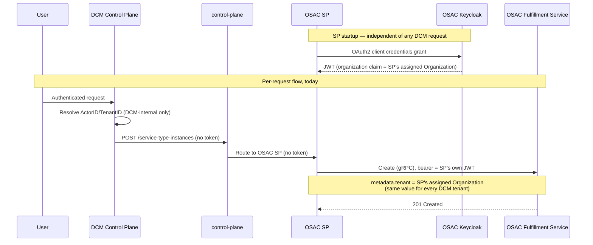
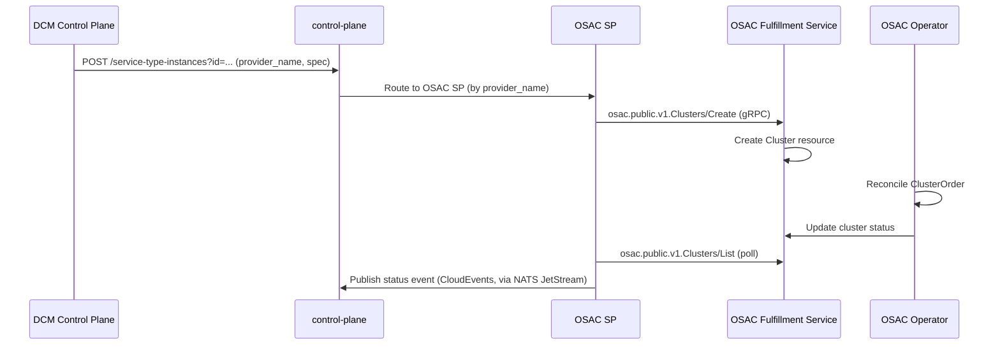
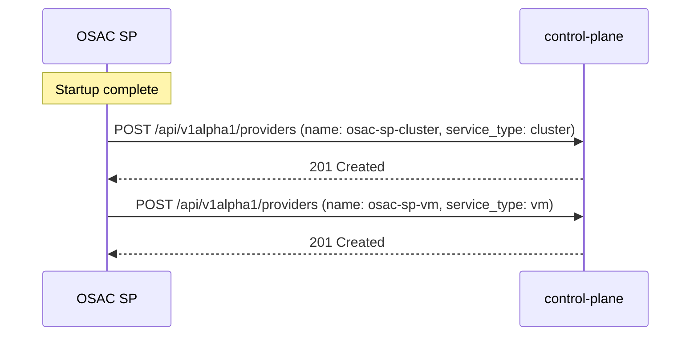
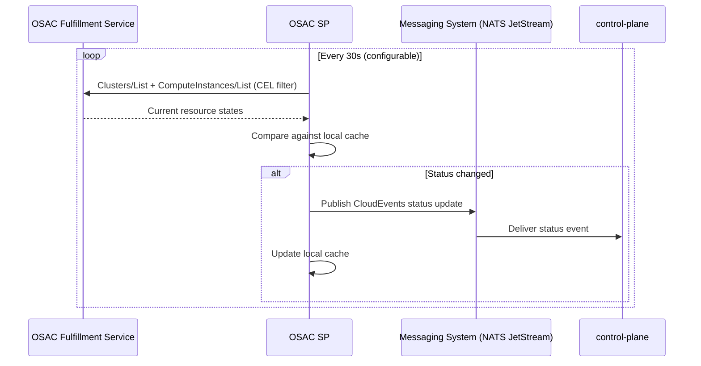
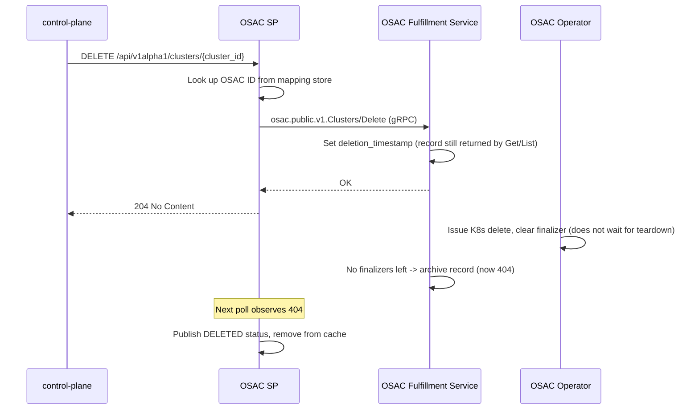
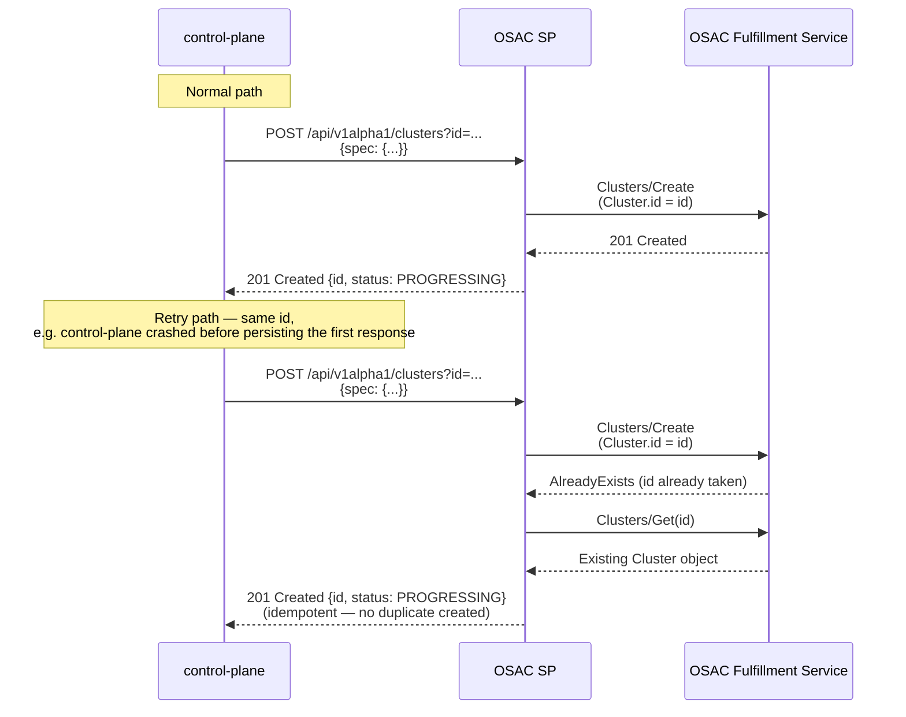
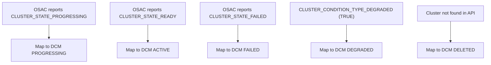

# OSAC Service Provider

## Open Questions

N/A — all open questions raised during review have been resolved; see the
resolution notes in [Node Sizing](#node-sizing) and [VM Sizing](#vm-sizing).

## Summary

The OSAC Service Provider (OSAC SP) is an external Service Provider that
integrates the Open Sovereign AI Cloud (OSAC) platform with DCM. It provisions
OpenShift clusters and VMs by translating DCM-routed requests into OSAC
fulfillment service gRPC API calls, and reports status changes back via the
messaging system. Delivery is two-phase: Phase 1 registers with and dispatches
through `control-plane`'s Service Provider API; Phase 2 migrates to the
environment agent model once it reaches sufficient maturity. See
[Phased Delivery](#phased-delivery) for the rationale and migration criteria.

## Motivation

OSAC provides a self-service platform for provisioning OpenShift clusters, VMs,
and bare metal hosts at scale, currently deployed at the Mass Open Cloud (MOC).
Integrating OSAC as a DCM Service Provider enables DCM to leverage OSAC's mature
provisioning infrastructure — including Hosted Control Planes, template-based
automation via Ansible Automation Platform (AAP), and multi-hub support —
without duplicating OSAC's existing orchestration logic.

### Goals

- Define the lifecycle of an SP using OSAC to provision OpenShift clusters and
  VMs.
- Define a two-phase registration/dispatch delivery: Phase 1 registers with and
  dispatches through `control-plane`'s Service Provider API
  (`api/sp/v1alpha1/provider`, `api/sp/v1alpha1/resource_manager`); Phase 2
  migrates to the environment agent once it reaches sufficient maturity (see
  [Phased Delivery](#phased-delivery)).
- Define `CREATE`, `READ`, and `DELETE` endpoints for managing clusters and VMs
  provisioned via OSAC.
- Define status reporting mechanism for DCM requests via CloudEvents.
- Define how cluster credentials are communicated to the user.

### Non-Goals

- Define endpoints for day 2 operations (`scale`, `upgrade`, `hibernate`) for
  cluster instances — the DCM SP API does not yet define an `UPDATE` verb or
  mutable-field contract for cluster resources. OSAC's fulfillment service
  supports
  [`Clusters/Update`](https://github.com/osac-project/fulfillment-service/blob/98c6b6860cc3844acfbe505402ebb2f4d80523c9/proto/public/osac/public/v1/clusters_service.proto),
  so day 2 operations can be added once DCM standardizes the update contract.
- Bare Metal-as-a-Service as a standalone service type — bare metal hosts are
  the underlying infrastructure for OSAC clusters, not a separate user-facing
  service.
- Deployment strategy for the OSAC SP API.
- Define `UPDATE` endpoint — blocked on the same DCM SP API dependency as day 2
  operations above.
- Multi-hub placement logic — OSAC handles hub selection internally; DCM
  placement selects the registered SP `provider_name` (Phase 1) or the
  environment agent (Phase 2), not a hub within OSAC.
- OSAC internal components (operator, AAP playbooks, networking controllers).
- Per-DCM-tenant isolation within OSAC — the OSAC SP authenticates as a single
  service account assigned to one OSAC Organization, so v1 is single-tenant from
  OSAC's perspective: every DCM tenant's clusters and VMs land in the same OSAC
  Organization and share the same default network. Propagating DCM's own tenant
  identity into SP-to-provider calls depends on
  [FLPATH-4115](https://redhat.atlassian.net/browse/FLPATH-4115) (DCM
  multi-tenancy and isolation), which has not yet landed. See
  [Authentication](#authentication) for details.

## Proposal

### Phased Delivery

This enhancement was originally reviewed and merged against the environment
agent model (see [Implementation History](#implementation-history)). At
implementation time, the environment agent's provider-registration handler was
still generated-stub-only (no `internal/handlers`/`internal/service`
implementation, no tagged release), while `control-plane`'s equivalent SP
registration and dispatch path
([`api/sp/v1alpha1/provider`](https://github.com/dcm-project/control-plane/blob/6c16c0654018cd779a7c3ad8739427644732c41b/api/sp/v1alpha1/provider/openapi.yaml),
[`api/sp/v1alpha1/resource_manager`](https://github.com/dcm-project/control-plane/blob/6c16c0654018cd779a7c3ad8739427644732c41b/api/sp/v1alpha1/resource_manager/openapi.yaml))
was already complete and wired end-to-end against a real store. Delivery is
therefore split into two phases:

- **Phase 1 (first release):** the OSAC SP registers with and dispatches through
  `control-plane`'s SP API instead of the environment agent. This is the model
  documented throughout the rest of this proposal.
- **Phase 2 (future):** migrate registration and dispatch to the environment
  agent once it reaches a defined maturity bar: a merged, non-stub
  implementation of its provider-registration and dispatch handlers, plus at
  least one tagged release. Until that bar is met, Phase 2 remains unscheduled
  rather than time-boxed, since forcing a date onto an unimplemented dependency
  would just produce a missed deadline.

`control-plane`'s dispatch model differs from the environment agent's in ways
that go beyond which service the SP registers with:

| Concern                | Environment agent (Phase 2)                                       | `control-plane` (Phase 1)                                                                                     |
| ---------------------- | ----------------------------------------------------------------- | ------------------------------------------------------------------------------------------------------------- |
| Registration           | `POST /api/v1/providers`, per-service-type lease with renewal     | `POST /api/v1alpha1/providers`, idempotent on `name`/`id`, no lease — see [SP Health Check](#sp-health-check) |
| Routing to this SP     | First SP to register a service type claims it (`409` on conflict) | Caller specifies `provider_name` explicitly per request; no service-type exclusivity                          |
| Create/Delete dispatch | Routed via messaging topic, `resource_id` in the CloudEvent body  | Direct synchronous REST, resource ID passed as an `id` query parameter                                        |
| Status reporting       | CloudEvents via the agent's messaging topic                       | CloudEvents via NATS JetStream, consumed directly by `control-plane`                                          |
| Health monitoring      | Agent polls `GET /health`                                         | `control-plane` polls `GET /health` (same contract, different poller)                                         |

The sections below describe the Phase 1 (`control-plane`) contract. Where a
mechanism is unchanged between the two targets (e.g. the `/health` payload
shape, the OSAC-side idempotent-create handling), this is called out explicitly
rather than duplicated.

### User Stories

#### Story 1: Provision an OpenShift Cluster

As a DCM user, I want to request an OpenShift cluster through DCM so that I
receive a fully provisioned cluster with credentials, without needing to
interact with OSAC directly.

#### Story 2: Provision a VM

As a DCM user, I want to request a VM through DCM so that I receive a running
compute instance with connectivity details, without needing to interact with
OSAC directly.

#### Story 3: Query Resource Status

As a DCM user, I want to check the status of my provisioning request so that I
know when my resource is ready and can retrieve access credentials.

#### Story 4: Delete a Resource

As a DCM user, I want to delete a cluster or VM I no longer need so that
infrastructure resources are released.

### Assumptions

- The OSAC platform is deployed and operational, including the fulfillment
  service, OSAC operator, and AAP backend.
- The OSAC fulfillment service is reachable from the OSAC SP via gRPC or REST.
- The OSAC SP is registered as an OAuth 2.0 client in OSAC's Keycloak instance
  and has valid credentials (client ID and secret) to authenticate via OIDC
  client credentials flow. The OSAC
  [authorization policy](https://github.com/osac-project/fulfillment-service/blob/98c6b6860cc3844acfbe505402ebb2f4d80523c9/internal/auth/policies/authz.rego)
  grants `Clusters/Create`, `ComputeInstances/Create`, and all other CRUD
  methods to any authenticated client — no elevated permissions are required.
- `control-plane` is deployed and reachable for SP registration and instance
  dispatch (Phase 1); an environment agent deployment is not required until
  Phase 2.
- The DCM messaging system (NATS JetStream) is reachable for publishing status
  updates, and `control-plane`'s status consumer is subscribed to the subject
  the OSAC SP publishes on.
- At least one infrastructure hub is registered with the OSAC fulfillment
  service and has capacity to provision clusters.
- Network policies allow OSAC SP to communicate with both `control-plane`
  (Phase 1) and the OSAC fulfillment service.

### Authentication

**This flow is single-tenant in v1:** the OSAC SP authenticates to OSAC as one
shared service account, so every DCM tenant's requests resolve to the same
OSAC-side Organization. Per-DCM-tenant isolation is an explicit non-goal (see
[Non-Goals](#non-goals)), pending
[FLPATH-4115](https://redhat.atlassian.net/browse/FLPATH-4115).

OSAC uses Keycloak as its identity provider with standard OIDC support. The OSAC
SP authenticates against the OSAC fulfillment service using the OAuth 2.0 client
credentials flow:

1. The OSAC SP is registered as a client in OSAC's Keycloak instance.
2. On startup (and periodically), the SP obtains a JWT from Keycloak using its
   client credentials.
3. The JWT is passed as a bearer token on all gRPC calls to the OSAC fulfillment
   service.


```mermaid
sequenceDiagram
    participant User
    participant DCM as DCM Control Plane
    participant CP as control-plane
    participant SP as OSAC SP
    participant KC as OSAC Keycloak
    participant FS as OSAC Fulfillment Service

    Note over SP,KC: SP startup — independent of any DCM request
    SP->>KC: OAuth2 client credentials grant
    KC-->>SP: JWT (organization claim = SP's assigned Organization)

    Note over User,FS: Per-request flow, today
    User->>DCM: Authenticated request
    DCM->>DCM: Resolve ActorID/TenantID (DCM-internal only)
    DCM->>CP: POST /service-type-instances (no token)
    CP->>SP: Route to OSAC SP (no token)
    SP->>FS: Create (gRPC), bearer = SP's own JWT
    Note over SP,FS: metadata.tenant = SP's assigned Organization<br/>(same value for every DCM tenant)
    FS-->>SP: 201 Created
```

`control-plane`'s SP API has no authentication middleware of its own today
([verified](https://github.com/dcm-project/control-plane/blob/main/internal/app/run.go)
— its chain is request-ID/recovery/OpenAPI-validation only, and its
`provider`/`resource_manager` OpenAPI specs declare no `security` scheme), so
this is unchanged from the environment agent model: no bearer token reaches the
SP through either path.

The SP is never handed a DCM token to begin with — it mints its own, independent
of whatever request triggered the call — so there is no way for DCM's own tenant
identity to reach OSAC today. Every DCM tenant's resources land under the same
OSAC Organization assigned to the SP's service account.

Tenancy resolution no longer goes through Authorino: as of
[`58c8ac44`](https://github.com/osac-project/fulfillment-service/commit/58c8ac447b083ef5115b4901e1fa46a8bfdcb682),
OSAC replaced Authorino with in-process JWT validation and OPA-based
authorization. The
[`GrpcAuthnInterceptor`](https://github.com/osac-project/fulfillment-service/blob/98c6b6860cc3844acfbe505402ebb2f4d80523c9/internal/auth/auth_jwks_cache.go#L142-L154)
validates bearer tokens against JWKS discovered from a **list** of trusted
issuer URLs (`--grpc-authn-trusted-token-issuers`, already multi-valued in the
Go API), and the
[`GrpcAuthzInterceptor`](https://github.com/osac-project/fulfillment-service/blob/98c6b6860cc3844acfbe505402ebb2f4d80523c9/internal/auth/grpc_authz_interceptor.go#L472-L493)
extracts `organization`/`organizations`/`groups` and `realm_access.roles` claims
and evaluates them against an embedded
[Rego policy](https://github.com/osac-project/fulfillment-service/blob/98c6b6860cc3844acfbe505402ebb2f4d80523c9/internal/auth/policies/authz.rego#L67-L96)
to determine assignable, default, and visible tenants for each request. The
[`organization` claim](https://github.com/osac-project/fulfillment-service/blob/98c6b6860cc3844acfbe505402ebb2f4d80523c9/internal/auth/policies/authz.rego#L67-L88)
in the caller's JWT — populated by Keycloak's Organizations feature — is what
drives this: the OSAC SP authenticates as a single service account provisioned
with its own Organization in OSAC's realm, so
[`metadata.tenant` resolves to that Organization automatically](https://github.com/osac-project/fulfillment-service/blob/98c6b6860cc3844acfbe505402ebb2f4d80523c9/internal/auth/default_tenancy_logic.go#L77-L94)
on every create call — the SP does not set it explicitly, and it never falls
into
[`SharedTenant`](https://github.com/osac-project/fulfillment-service/blob/98c6b6860cc3844acfbe505402ebb2f4d80523c9/internal/auth/tenancy_logic.go#L46-L47),
OSAC's universally-visible `"shared"` tenant, unless the SP's service account is
misconfigured with universal (admin) access instead of a scoped Organization.

Per-DCM-tenant isolation is out of scope for this version (see
[Non-Goals](#non-goals)).

### Multi-Hub Topology

OSAC supports multiple infrastructure hubs managed by a single fulfillment
service. Hub selection is an internal OSAC placement decision handled by the
fulfillment service, opaque to DCM. In Phase 1, DCM's placement/catalog layer
resolves the target `provider_name` (`osac-sp-cluster` or `osac-sp-vm`) at
request time and passes it to `control-plane`'s resource-management API, which
looks up the registered `Provider` by that name and dispatches directly to its
endpoint — see [Registration Flow](#registration-flow) and
[API Endpoints](#api-endpoints). In Phase 2, placement operates at the agent
level instead — selecting the environment agent that contains this SP — per the
[environment agent enhancement](../environment-agent/environment-agent.md).

### Catalog Independence

DCM and OSAC maintain independent service catalogs. The OSAC SP does not expose
OSAC's cluster catalog items to DCM, nor does DCM push its catalog definitions
into OSAC. Instead, the OSAC SP maps DCM requests to OSAC templates via the
`provider_hints.osac.template_id` field. Administrators configure DCM catalog
items that reference the appropriate OSAC template, keeping each system's
catalog management self-contained.

### Integration Points

#### OSAC Fulfillment Service Integration

The OSAC SP communicates with the OSAC fulfillment service using its public gRPC
API. The fulfillment service manages the lifecycle of clusters and VMs by
coordinating with the OSAC operator on the hub cluster.

- Uses the
  [`osac.public.v1.Clusters`](https://github.com/osac-project/fulfillment-service/blob/98c6b6860cc3844acfbe505402ebb2f4d80523c9/proto/public/osac/public/v1/clusters_service.proto)
  gRPC service for cluster operations.
- Uses the
  [`osac.public.v1.ComputeInstances`](https://github.com/osac-project/fulfillment-service/blob/98c6b6860cc3844acfbe505402ebb2f4d80523c9/proto/public/osac/public/v1/compute_instances_service.proto)
  gRPC service for VM operations.
- The fulfillment service translates requests into `ClusterOrder` custom
  resources on the hub cluster (reconciled by the
  [OSAC operator](https://github.com/osac-project/osac-operator/blob/065c4fd420e367ddb54bf0f63c64315c27fd87a9/internal/controller/clusterorder_controller.go)).
- Clusters are provisioned using Hosted Control Planes via ACM on the hub
  cluster.


```mermaid
sequenceDiagram
    participant DCM as DCM Control Plane
    participant CP as control-plane
    participant SP as OSAC SP
    participant FS as OSAC Fulfillment Service
    participant OP as OSAC Operator

    DCM->>CP: POST /service-type-instances?id=... (provider_name, spec)
    CP->>SP: Route to OSAC SP (by provider_name)
    SP->>FS: osac.public.v1.Clusters/Create (gRPC)
    FS->>FS: Create Cluster resource
    OP->>OP: Reconcile ClusterOrder
    OP->>FS: Update cluster status
    SP->>FS: osac.public.v1.Clusters/List (poll)
    SP->>CP: Publish status event (CloudEvents, via NATS JetStream)
```

#### Registration with control-plane (Phase 1)

The OSAC SP is an **external SP** that registers with `control-plane` via
`POST /api/v1alpha1/providers`
([Provider API](https://github.com/dcm-project/control-plane/blob/main/api/sp/v1alpha1/provider/openapi.yaml)).
Registration is per service type — the OSAC SP registers twice (once for
`cluster`, once for `vm`), reusing the two-name pattern from the
[SP registration flow](../sp-registration-flow/sp-registration-flow.md); see
[Registration Flow](#registration-flow) for the exact payloads.


```mermaid
sequenceDiagram
    participant SP as OSAC SP
    participant CP as control-plane

    Note over SP: Startup complete
    SP->>CP: POST /api/v1alpha1/providers (name: osac-sp-cluster, service_type: cluster)
    CP-->>SP: 201 Created
    SP->>CP: POST /api/v1alpha1/providers (name: osac-sp-vm, service_type: vm)
    CP-->>SP: 201 Created
```

**Registration conflicts:** `control-plane` has no per-service-type exclusivity.
Its conflict rule is `name`/`id`-based only — a request fails with
`409 Conflict` only if `name` already exists under a different provider `id`, or
`id` already exists under a different `name`
([`RegisterOrUpdateProvider`](https://github.com/dcm-project/control-plane/blob/main/internal/sp/service/provider/provider.go)).
The "OSAC SP may lose the `vm` slot to `kubevirt-sp`" contention scenario from
the environment agent model (Phase 2) therefore does not apply in Phase 1:
multiple providers may register the same `service_type` simultaneously, and
routing for a given request is resolved by whichever `provider_name` the caller
(DCM's catalog/placement layer) specifies — see
[Multi-Hub Topology](#multi-hub-topology).

**No lease renewal:** unlike the environment agent model, `control-plane` does
not require periodic re-registration to keep a provider's slot. Once registered,
the OSAC SP's liveness is tracked by `control-plane`'s own health poller (see
[SP Health Check](#sp-health-check)), not by the SP renewing a lease.
Registration therefore runs once at startup, retried with exponential backoff on
failure, without blocking server startup.

#### SP Health Check

OSAC SP exposes a `GET /health` endpoint. In Phase 1, `control-plane` actively
polls this endpoint on a per-provider interval and updates the provider's stored
health status; the SP does not push health updates itself. The response payload
and the three-state model (Ready, Unhealthy, Unavailable) are unchanged from the
environment agent model — see
[SP Health Check](../service-provider-health-check/service-provider-health-check.md).
`control-plane` derives `Unavailable` itself (consecutive-failure count with
backoff) when the endpoint is unreachable or unparsable; the SP only ever needs
to report `healthy` or `unhealthy` in its payload.

#### Status Reporting

Status updates are published to the messaging system using CloudEvents format,
carried over NATS JetStream, and consumed directly by `control-plane`. Per the
[SP Status Reporting](../state-management/service-provider-status-reporting.md)
enhancement:

- **Subject:** `dcm.cluster` or `dcm.vm`
- **Type:** `dcm.status.cluster` or `dcm.status.vm`
- **Source:** `dcm/providers/{provider_name}`

This is unchanged in shape from the environment agent model (Phase 2) — only the
consumer differs: `control-plane` subscribes to the status subject directly
rather than the environment agent forwarding events on DCM's behalf.


```mermaid
sequenceDiagram
    participant FS as OSAC Fulfillment Service
    participant SP as OSAC SP
    participant MS as Messaging System (NATS JetStream)
    participant CP as control-plane

    loop Every 30s (configurable)
        SP->>FS: Clusters/List + ComputeInstances/List (CEL filter)
        FS-->>SP: Current resource states
        SP->>SP: Compare against local cache
        alt Status changed
            SP->>MS: Publish CloudEvents status update
            MS->>CP: Deliver status event
            SP->>SP: Update local cache
        end
    end
```

### SP Configuration

The OSAC SP supports configuration options that control how it connects to the
OSAC fulfillment service.

#### Fulfillment Service Configuration

| Field              | Type   | Required | Description                                   |
| ------------------ | ------ | -------- | --------------------------------------------- |
| fulfillmentAddress | string | Yes      | OSAC fulfillment service gRPC address         |
| oidcIssuerUrl      | string | Yes      | Keycloak OIDC issuer URL                      |
| oidcClientId       | string | Yes      | OAuth 2.0 client ID registered in Keycloak    |
| oidcClientSecret   | string | Yes      | OAuth 2.0 client secret (or path to file)     |
| tlsEnabled         | bool   | No       | Enable TLS for fulfillment service connection |
| tlsCertFile        | string | No       | Path to TLS CA certificate file               |

### Registration Flow

The OSAC SP registers with `control-plane` on startup (Phase 1). Since
registration is per service type, the SP makes two registration calls to
`POST /api/v1alpha1/providers`. The two calls use **different `name` values** —
`control-plane`'s registration endpoint is idempotent on `name` (and optionally
a client-supplied `id` query parameter), so registering both service types under
the same name would make the second call an _update_ of the first, overwriting
the `cluster` registration's `service_type` instead of adding a second one. The
single OSAC SP process registers as two distinct named providers:

**Cluster registration:**

```json
{
  "name": "osac-sp-cluster",
  "service_type": "cluster",
  "endpoint": "https://osac-sp.example.com/api/v1alpha1/clusters",
  "schema_version": "v1alpha1"
}
```

**VM registration:**

```json
{
  "name": "osac-sp-vm",
  "service_type": "vm",
  "endpoint": "https://osac-sp.example.com/api/v1alpha1/vms",
  "schema_version": "v1alpha1"
}
```

`control-plane` stores these as independent `Provider` records; there is no
downstream agent registration step to chain off of. `Provider.metadata` allows
arbitrary additional properties, so capability advertisement (below) is carried
there, letting DCM's catalog/placement layer read it when resolving a
`provider_name` for a given request (see
[Multi-Hub Topology](#multi-hub-topology)).

#### Capability Advertisement

| Field                         | Type     | Description                                        |
| ----------------------------- | -------- | -------------------------------------------------- |
| supported_platforms           | []string | Platforms this SP can provision (baremetal)        |
| supported_provisioning_types  | []string | Provisioning methods available (hypershift for v1) |
| kubernetes_supported_versions | []string | Kubernetes versions supported by this SP           |

OSAC has no capability-discovery API for these values — its
[`Capabilities`](https://github.com/osac-project/fulfillment-service/blob/98c6b6860cc3844acfbe505402ebb2f4d80523c9/proto/public/osac/public/v1/capabilities_service.proto)
service reports only authentication metadata (trusted OAuth token issuers), not
supported platforms or versions. The SP therefore advertises
`supported_platforms` and `supported_provisioning_types` as static values
(`baremetal`, `hypershift`), since OSAC currently supports nothing else.
`kubernetes_supported_versions` is a hardcoded compatibility list maintained by
the SP (see [Version Translation](#version-translation)), not a value queried
from OSAC.

#### Registration Process

- API server starts and initializes HTTP listener.
- After the server is ready, registration runs in a background goroutine.
- Registration requests are sent to `control-plane`
  (`POST /api/v1alpha1/providers`) — one per service type.
- Registration is one-shot per service type, not a renewed lease (see
  [No lease renewal](#registration-with-control-plane-phase-1)) —
  `control-plane`'s own health poller tracks liveness after that.
- Registration failures are retried with exponential backoff and logged but do
  not block server startup.

### API Endpoints

The CRUD endpoints are consumed by `control-plane`'s SP resource-management API
([`api/sp/v1alpha1/resource_manager`](https://github.com/dcm-project/control-plane/blob/main/api/sp/v1alpha1/resource_manager/openapi.yaml)),
which dispatches a create/delete request directly to the `endpoint` of whichever
`Provider` the caller named — see
[Registration with control-plane](#registration-with-control-plane-phase-1).

#### Cluster Endpoints

| Method | Endpoint                            | Description               |
| ------ | ----------------------------------- | ------------------------- |
| POST   | /api/v1alpha1/clusters              | Create a new cluster      |
| GET    | /api/v1alpha1/clusters              | List all clusters         |
| GET    | /api/v1alpha1/clusters/{cluster_id} | Get a cluster instance    |
| DELETE | /api/v1alpha1/clusters/{cluster_id} | Delete a cluster instance |

#### VM Endpoints

| Method | Endpoint                  | Description          |
| ------ | ------------------------- | -------------------- |
| POST   | /api/v1alpha1/vms         | Create a new VM      |
| GET    | /api/v1alpha1/vms         | List all VMs         |
| GET    | /api/v1alpha1/vms/{vm_id} | Get a VM instance    |
| DELETE | /api/v1alpha1/vms/{vm_id} | Delete a VM instance |

#### Common Endpoints

| Method | Endpoint             | Description          |
| ------ | -------------------- | -------------------- |
| GET    | /api/v1alpha1/health | OSAC SP health check |

##### AEP Compliance

These endpoints are defined based on AEP standards and use `aep-openapi-linter`
to check for compliance with AEP.

#### POST /api/v1alpha1/clusters

**Description:** Create a new OpenShift cluster.

The POST endpoint follows the contract defined in the
[Cluster Schema](../service-type-definitions/service-type-definitions.md#kubernetes-cluster).

The OSAC SP translates the DCM cluster request into an
`osac.public.v1.Clusters/Create` gRPC call, mapping DCM fields to OSAC's
[`ClusterSpec`](https://github.com/osac-project/fulfillment-service/blob/98c6b6860cc3844acfbe505402ebb2f4d80523c9/proto/public/osac/public/v1/cluster_type.proto).
In Phase 1, `control-plane` forwards the request as
`POST {endpoint}?id={resource_id}` with the DCM `ClusterSpec` nested under a
top-level `spec` key (see [API Endpoints](#api-endpoints)); `resource_id` itself
travels as the `id` query parameter, not a body field.

**Field Mapping (DCM to OSAC Fulfillment API):**

| DCM Field                      | OSAC Field               | Notes                                                                                        |
| ------------------------------ | ------------------------ | -------------------------------------------------------------------------------------------- |
| `id` query parameter           | id                       | DCM-issued identifier, set as `Cluster.id` — see [Idempotent Creation](#idempotent-creation) |
| spec.version                   | spec.release_image       | SP translates K8s version to OCP image                                                       |
| spec.nodes.control_plane.count | (managed by HCP)         | Hosted Control Planes manage CP internally                                                   |
| spec.nodes.worker.count        | spec.node_sets[key].size | Number of worker nodes for template's key                                                    |
| spec.nodes.worker.cpu/memory   | (informational only)     | `host_type` is template-fixed; see [Node Sizing](#node-sizing)                               |
| spec.metadata.name             | metadata.name            | Cluster name (DNS label format)                                                              |
| spec.provider_hints.osac       | (see below)              | OSAC-specific parameters                                                                     |

##### Node Sizing

OSAC clusters use
[`ClusterNodeSet`](https://github.com/osac-project/fulfillment-service/blob/98c6b6860cc3844acfbe505402ebb2f4d80523c9/proto/public/osac/public/v1/cluster_type.proto)
with `host_type` (a predefined identifier like `acme_1tb` from the
[HostTypes service](https://github.com/osac-project/fulfillment-service/blob/98c6b6860cc3844acfbe505402ebb2f4d80523c9/proto/public/osac/public/v1/host_types_service.proto))
and `size` (node count). Node-set keys (e.g. `compute`, `gpu`) are also defined
by the template, not a fixed `worker`/`control_plane` split.

Critically, `host_type` for each node-set key is **fixed by the OSAC cluster
template selected for the request**:
[`Clusters/Create`'s validation](https://github.com/osac-project/fulfillment-service/blob/98c6b6860cc3844acfbe505402ebb2f4d80523c9/internal/servers/private_clusters_server.go)
rejects a client-supplied `host_type` that doesn't match the template's own
value for that node-set key, and overwrites whatever is accepted with the
template's value regardless. There is no request path where the SP computes a
`host_type` from DCM's raw `cpu`/`memory`/`storage` values and has OSAC honor it
at create time — the only lever available per request is `size` (worker count)
for the node-set key the template already defines.

DCM must therefore select a template whose node sets already provide the desired
host type:

- Each DCM catalog item for a cluster size tier (e.g. `small`, `medium`,
  `large`) is configured with a different `provider_hints.osac.template_id`, and
  the corresponding OSAC template pre-defines the host type(s) appropriate for
  that tier.
- `nodes.worker.cpu`/`memory`/`storage` in the DCM request are informational
  only for OSAC — the SP does not use them to select or override `host_type`.
  Only `nodes.worker.count` is translated, to `size`.
- Introducing a new host type for an existing cluster (a new node-set key not
  already in the template) is only possible via `Update`
  ([`validateNodeSetHostTypeImmutability`](https://github.com/osac-project/fulfillment-service/blob/98c6b6860cc3844acfbe505402ebb2f4d80523c9/internal/servers/private_clusters_server.go#L456-L480)
  only restricts _existing_ node-set host types from changing, not the addition
  of new ones), which is a day-2 operation out of scope for v1 per
  [Non-Goals](#non-goals).

**Resolution:** reviewers agreed cluster sizing is coarser-grained than VM
sizing for v1 — each DCM catalog size tier is configured with a
`provider_hints.osac.template_id` pointing at a pre-provisioned OSAC template
for that tier, per the mapping above. The OSAC SP does **not** maintain an
internal size-tier matrix — it is a pass-through: whatever `template_id` arrives
in `provider_hints.osac` is sent to OSAC as-is (see
[Catalog Independence](#catalog-independence)). The mapping is entirely
expressed as DCM catalog item configuration, authored by whoever administers the
DCM catalog. This still leaves DCM catalog size tiers and OSAC template tiers as
two independently-maintained sources of truth: whoever adds a new DCM size tier
must also ensure a matching OSAC template exists and wire the `template_id` by
hand, with no automated check that keeps them in sync. Accepted for v1 on the
assumption that size tiers change infrequently; if catalog churn makes the
manual wiring error-prone in practice, revisit whether DCM needs a way to query
the SP's supported size tiers (or vice versa) instead of relying on an admin to
keep both catalogs aligned.

**Provider Hints (osac):**

| Field         | Type   | Required | Description                                    |
| ------------- | ------ | -------- | ---------------------------------------------- |
| template_id   | string | Yes      | OSAC cluster template to use for provisioning  |
| base_domain   | string | No       | Base DNS domain for the cluster                |
| pull_secret   | string | No       | Pull secret reference for cluster image pulls  |
| ssh_key       | string | No       | SSH public key for node access                 |
| release_image | string | No       | Specific OCP release image (overrides version) |

**Example Request:**
`POST /api/v1alpha1/clusters?id=a1b2c3d4-e5f6-7890-abcd-ef1234567890`

```json
{
  "spec": {
    "version": "1.29",
    "nodes": {
      "control_plane": {
        "count": 3
      },
      "worker": {
        "count": 3,
        "cpu": 8,
        "memory": "32GB",
        "storage": "250GB"
      }
    },
    "metadata": {
      "name": "sovereign-ai-cluster-01"
    },
    "provider_hints": {
      "osac": {
        "template_id": "default-hcp",
        "base_domain": "moc.example.com"
      }
    }
  }
}
```

The `id` query parameter is DCM-issued and forwarded unchanged by
`control-plane` from whatever request created the corresponding
`ServiceTypeInstance` (see [API Endpoints](#api-endpoints)). See
[Idempotent Creation](#idempotent-creation) for how the SP uses it.

**Response:** Returns `201 Created` with the cluster resource in its initial
state:

```json
{
  "id": "a1b2c3d4-e5f6-7890-abcd-ef1234567890",
  "name": "sovereign-ai-cluster-01",
  "status": "PROGRESSING",
  "platform": "baremetal",
  "version": "1.29",
  "api_endpoint": "",
  "console_url": "",
  "nodes": {
    "control_plane": { "ready": 0, "total": 3 },
    "worker": { "ready": 0, "total": 3 }
  },
  "kubeconfig": "",
  "metadata": {
    "namespace": "sovereign-ai-cluster-01",
    "created_at": "2026-06-29T14:30:00Z"
  }
}
```

The top-level `id` and `status` fields are required — `control-plane` reads them
directly off the response to populate the dispatched `ServiceTypeInstance`
record
([`CreateInstance`](https://github.com/dcm-project/control-plane/blob/main/internal/sp/service/resource_manager/service_type_instance.go)).
`id` echoes the same value passed in as the request's `id` query parameter — it
is not a newly generated identifier (see
[Idempotent Creation](#idempotent-creation)). The remaining fields are
OSAC-SP-specific and are returned as-is for callers that query the SP directly,
but are not otherwise interpreted by `control-plane`.

**Error Handling:**

- **400 Bad Request**: Invalid request payload or missing required fields
- **401 Unauthorized**: OIDC token expired or invalid (SP-to-OSAC auth failure)
- **403 Forbidden**: Insufficient permissions in OSAC's Keycloak realm
- **409 Conflict**: A cluster with the same `id` (from the query parameter) or
  `metadata.name` already exists — see
  [Idempotent Creation](#idempotent-creation) for how an `id` conflict is
  handled
- **422 Unprocessable Entity**: No suitable host_type for requested resources
- **500 Internal Server Error**: Unexpected error during resource creation
- **502 Bad Gateway**: OSAC fulfillment service is unreachable

#### POST /api/v1alpha1/vms

**Description:** Create a new VM (compute instance).

The POST endpoint follows the contract defined in the
[VM Schema](../service-type-definitions/service-type-definitions.md#virtual-machine).

The OSAC SP translates the DCM VM request into a
`osac.public.v1.ComputeInstances/Create` gRPC call, mapping DCM fields to OSAC's
[`ComputeInstanceSpec`](https://github.com/osac-project/fulfillment-service/blob/98c6b6860cc3844acfbe505402ebb2f4d80523c9/proto/public/osac/public/v1/compute_instance_type.proto).

In Phase 1, `control-plane` forwards the request as `POST {endpoint}?id={id}`
with the DCM `VMSpec` nested under a top-level `spec` key, the same envelope
used for cluster creation (see
[POST /api/v1alpha1/clusters](#post-apiv1alpha1clusters)).

**Field Mapping (DCM to OSAC Fulfillment API):**

| DCM Field                            | OSAC Field              | Notes                                                                                                |
| ------------------------------------ | ----------------------- | ---------------------------------------------------------------------------------------------------- |
| `id` query parameter                 | id                      | DCM-issued identifier, set as `ComputeInstance.id` — see [Idempotent Creation](#idempotent-creation) |
| spec.vcpu.count                      | spec.cores              | Only when `spec.provider_hints.osac.instance_type` is unset — see below                              |
| spec.memory.size                     | spec.memory_gib         | Convert to GiB integer; only when `instance_type` is unset                                           |
| spec.storage.disks[boot].capacity    | spec.boot_disk.size_gib | Boot disk size in GiB                                                                                |
| spec.storage.disks[*]                | spec.additional_disks   | Additional disks                                                                                     |
| spec.guest_os.type                   | spec.image              | Mapped to image source_ref                                                                           |
| spec.access.ssh_public_key           | spec.ssh_key            | SSH public key                                                                                       |
| spec.metadata.name                   | metadata.name           | Instance name (DNS label)                                                                            |
| spec.provider_hints.osac.template_id | spec.template           | OSAC template reference                                                                              |

As with cluster creation, the `id` query parameter is DCM-issued and forwarded
unchanged by `control-plane` — see [Idempotent Creation](#idempotent-creation).

**Provider Hints (osac) for VMs:**

| Field         | Type   | Required | Description                                                           |
| ------------- | ------ | -------- | --------------------------------------------------------------------- |
| template_id   | string | Yes      | OSAC compute instance template                                        |
| instance_type | string | No       | OSAC instance_type name; mutually exclusive with `cores`/`memory_gib` |
| is_windows    | bool   | No       | Windows guest OS flag                                                 |

`instance_type` and `cores`/`memory_gib` are mutually exclusive on
`ComputeInstances/Create` — setting both is rejected. When
`provider_hints.osac.instance_type` is set, the SP sends `spec.instance_type`
and omits `spec.cores`/`spec.memory_gib` entirely (dropping `vcpu.count`/
`memory.size` from the request). When it's unset, the SP falls back to the
direct `cores`/`memory_gib` mapping, which OSAC currently accepts but flags as
deprecated (see [VM Sizing](#vm-sizing)).

##### VM Sizing

OSAC now has a live
[`InstanceTypes`](https://github.com/osac-project/fulfillment-service/blob/98c6b6860cc3844acfbe505402ebb2f4d80523c9/proto/public/osac/public/v1/instance_types_service.proto)
catalog ([OSAC-46](https://redhat.atlassian.net/browse/OSAC-46), In Progress),
and `ComputeInstances/Create`
[already rejects](https://github.com/osac-project/fulfillment-service/blob/98c6b6860cc3844acfbe505402ebb2f4d80523c9/internal/servers/private_compute_instances_server.go#L419-L433)
setting `instance_type` together with `cores`/`memory_gib` (mutually exclusive),
and returns a deprecation warning — _"Direct cores/memory_gib is deprecated, use
instance_type instead. This path will be removed in a future release."_ —
whenever `cores`/`memory_gib` are set without an `instance_type`. No removal
date is set yet.

**Resolution:** reviewers agreed to keep the direct mapping for v1 —
`vcpu.count`/`memory.size` map straight to `cores`/`memory_gib`, and the SP
accepts the deprecation warning on every VM create rather than resolving a
best-fit `instance_type` from DCM's raw values. `InstanceTypes/List` already
exposes `spec.cores`/`spec.memory_gib` per type
([`instance_type_type.proto#L85-L100`](https://github.com/osac-project/fulfillment-service/blob/98c6b6860cc3844acfbe505402ebb2f4d80523c9/proto/public/osac/public/v1/instance_type_type.proto#L85-L100)),
so best-fit matching is technically feasible today, but `OSAC-46` is still **In
Progress** — the catalog's shape may still change before it's done, and building
matching logic against a moving target isn't worth the churn risk yet. Revisit
once OSAC-46 stabilizes and a removal date for the direct `cores`/`memory_gib`
fields is set.

**Response:** Returns `201 Created` with the VM resource in its initial state:

```json
{
  "id": "b2c3d4e5-f6a7-8901-bcde-f23456789012",
  "name": "ai-worker-01",
  "status": "PROVISIONING",
  "metadata": {
    "namespace": "ai-worker-01",
    "created_at": "2026-06-29T15:00:00Z"
  }
}
```

The top-level `id` echoes the `id` query parameter from the request; `status` is
read directly by `control-plane` (see
[POST /api/v1alpha1/clusters](#post-apiv1alpha1clusters)). See
[Idempotent Creation](#idempotent-creation).

**Error Handling:**

- **400 Bad Request**: Invalid request payload or missing required fields
- **401 Unauthorized**: OIDC token expired or invalid
- **403 Forbidden**: Insufficient permissions in OSAC's Keycloak realm
- **409 Conflict**: A VM with the same `id` (from the query parameter) or
  `metadata.name` already exists — see
  [Idempotent Creation](#idempotent-creation) for how an `id` conflict is
  handled
- **422 Unprocessable Entity**: Unsupported configuration
- **500 Internal Server Error**: Unexpected error during resource creation
- **502 Bad Gateway**: OSAC fulfillment service is unreachable

#### GET /api/v1alpha1/clusters (List)

**Description:** List all cluster instances with pagination support.

**Query Parameters:**

- `max_page_size` (optional): Maximum number of resources to return. Default: 50
- `page_token` (optional): Token indicating the starting point for the page.

**Pagination Translation:** OSAC uses `offset`/`limit` pagination
([`ClustersListRequest`](https://github.com/osac-project/fulfillment-service/blob/98c6b6860cc3844acfbe505402ebb2f4d80523c9/proto/public/osac/public/v1/clusters_service.proto)).
The SP encodes the `offset` into the opaque `page_token` and maps
`max_page_size` to `limit`. OSAC also supports
[CEL filter expressions](https://github.com/osac-project/fulfillment-service/blob/98c6b6860cc3844acfbe505402ebb2f4d80523c9/proto/public/osac/public/v1/clusters_service.proto)
— the SP uses `this.metadata.labels["dcm.io/managed-by"] == "dcm"` to filter
results to resources it manages.

**Response:** Returns `200 OK` with the AEP-132 pagination wrapper:

```json
{
  "results": [
    {
      "id": "a1b2c3d4-e5f6-7890-abcd-ef1234567890",
      "name": "sovereign-ai-cluster-01",
      "status": "ACTIVE",
      "platform": "baremetal",
      "version": "1.29",
      "api_endpoint": "https://api.sovereign-ai-cluster-01.moc.example.com:6443",
      "console_url": "https://console-openshift-console.apps.sovereign-ai-cluster-01.moc.example.com",
      "nodes": {
        "control_plane": { "ready": 3, "total": 3 },
        "worker": { "ready": 3, "total": 3 }
      },
      "metadata": {
        "namespace": "sovereign-ai-cluster-01",
        "created_at": "2026-06-29T14:30:00Z"
      }
    }
  ],
  "next_page_token": "opaque-token-offset-50"
}
```

**Error Handling:**

- **400 Bad Request**: Invalid pagination parameters
- **401 Unauthorized**: OIDC token expired or invalid
- **403 Forbidden**: Insufficient permissions
- **500 Internal Server Error**: Unexpected error querying OSAC
- **502 Bad Gateway**: OSAC fulfillment service is unreachable

#### GET /api/v1alpha1/clusters/{cluster_id}

**Description:** Get a specific cluster instance.

**Process Flow:**

1. Handler receives `GET` request with `cluster_id` path parameter.
2. Calls `osac.public.v1.Clusters/Get` gRPC method using the stored OSAC cluster
   ID mapped to `cluster_id`.
3. Translates OSAC cluster status to DCM response format.
4. When cluster reaches `ACTIVE` status, retrieves credentials via
   `osac.public.v1.Clusters/GetKubeconfig`.
5. Returns complete cluster instance object.

**Kubeconfig Field Behavior:**

- **ACTIVE**: Contains the base64-encoded kubeconfig retrieved via
  [`Clusters/GetKubeconfig`](https://github.com/osac-project/fulfillment-service/blob/98c6b6860cc3844acfbe505402ebb2f4d80523c9/proto/public/osac/public/v1/clusters_service.proto).
- **PROGRESSING**: Empty string. Credentials are not yet available.
- **FAILED/DEGRADED**: Empty string.

**Error Handling:**

- **401 Unauthorized**: OIDC token expired or invalid
- **403 Forbidden**: Insufficient permissions
- **404 Not Found**: Cluster with the specified `cluster_id` does not exist
- **500 Internal Server Error**: Unexpected error querying OSAC
- **502 Bad Gateway**: OSAC fulfillment service is unreachable

#### DELETE /api/v1alpha1/clusters/{cluster_id}

**Description:** Delete a cluster instance.

Sends a `osac.public.v1.Clusters/Delete` gRPC call to the OSAC fulfillment
service, which triggers the OSAC operator to decommission the cluster. Returns
`204 No Content`.

**Deletion is asynchronous at the API level, not just for infrastructure
teardown:** `Clusters/Delete` does not remove the cluster record immediately.
The fulfillment service's
[`dao.Delete()`](https://github.com/osac-project/fulfillment-service/blob/98c6b6860cc3844acfbe505402ebb2f4d80523c9/internal/database/dao/generic_dao_delete.go#L178-L192)
sets `deletion_timestamp` on the record; since a finalizer is always present
after creation, it fires an `Updated` event instead of a `Deleted` event, and
`Get`/`List` **keep returning the object** — not `404` — until the record is
archived. The
[cluster reconciler](https://github.com/osac-project/fulfillment-service/blob/98c6b6860cc3844acfbe505402ebb2f4d80523c9/internal/controllers/cluster/cluster_reconciler_function.go#L359-L403)
picks up the timestamp, issues the Kubernetes delete, and clears its finalizer
in the **same pass** — without waiting for confirmation the CR is actually gone.
Once no finalizers remain, the DAO archives the record and `Get`/`List` start
returning `404`. In practice this means the cluster can disappear from OSAC's
API before the underlying Hosted Control Plane teardown finishes. `ClusterState`
has no `DELETING` value (only `PROGRESSING`, `READY`, `FAILED`) — the SP has no
intermediate status to report — so it polls silently and, like `acm-cluster-sp`,
publishes `DELETED` and removes the entry from its local mapping store as soon
as it observes the `404`.

This is a known gap being actively worked on OSAC's side, not just a stale SP
assumption: [OSAC-1586](https://redhat.atlassian.net/browse/OSAC-1586) tracks
that the cluster feedback controller's `handleDelete` is a literal TODO, and
[OSAC-1391](https://redhat.atlassian.net/browse/OSAC-1391) tracks adding
`DELETING`/`DELETE_FAILED` states to `Cluster` (both targeted for OSAC v0.2).
VMs don't have this gap today: the
[`computeinstance` reconciler's `delete()`](https://github.com/osac-project/fulfillment-service/blob/98c6b6860cc3844acfbe505402ebb2f4d80523c9/internal/controllers/computeinstance/computeinstance_reconciler_function.go#L291-L325)
waits for the underlying Kubernetes object to be confirmed gone before clearing
its finalizer, so a VM's `404` reliably means the VM is actually torn down — the
opposite tradeoff from clusters (slower to report `DELETED`, but no window where
the API says "gone" while the infrastructure is still being cleaned up).


```mermaid
sequenceDiagram
    participant CP as control-plane
    participant SP as OSAC SP
    participant FS as OSAC Fulfillment Service
    participant OP as OSAC Operator

    CP->>SP: DELETE /api/v1alpha1/clusters/{cluster_id}
    SP->>SP: Look up OSAC ID from mapping store
    SP->>FS: osac.public.v1.Clusters/Delete (gRPC)
    FS->>FS: Set deletion_timestamp (record still returned by Get/List)
    FS-->>SP: OK
    SP-->>CP: 204 No Content
    OP->>OP: Issue K8s delete, clear finalizer (does not wait for teardown)
    FS->>FS: No finalizers left -> archive record (now 404)
    Note over SP: Next poll observes 404
    SP->>SP: Publish DELETED status, remove from cache
```

**Error Handling:**

- **401 Unauthorized**: OIDC token expired or invalid
- **403 Forbidden**: Insufficient permissions
- **404 Not Found**: Cluster with the specified `cluster_id` does not exist
- **500 Internal Server Error**: Unexpected error during deletion
- **502 Bad Gateway**: OSAC fulfillment service is unreachable

#### GET /api/v1alpha1/vms (List) / GET /api/v1alpha1/vms/{vm_id} / DELETE /api/v1alpha1/vms/{vm_id}

VM endpoints follow the same patterns as cluster endpoints, using
`osac.public.v1.ComputeInstances` methods (`List`, `Get`, `Delete`). Pagination
uses the same `offset`/`limit` translation. Error handling includes the same
401/403/502 codes.

#### GET /api/v1alpha1/health

**Description:** Retrieve the health status for the OSAC Service Provider API.

The health check verifies:

- Connectivity to the OSAC fulfillment service (gRPC health check)
- Valid OIDC token (can obtain or refresh JWT from Keycloak)
- At least one hub is registered and available

### Implementation Details/Notes/Constraints

#### Idempotent Creation

In Phase 1, `control-plane`'s own `POST /service-type-instances?id=...` accepts
a client-supplied `id` and rejects a second create for an `id` that already has
a stored `ServiceTypeInstance` record with `409 Conflict` — this alone catches a
retried request that arrives **after** the first request's database write
completed. It does not catch every retry, though: `control- plane` calls the SP
and only writes its own record once the SP's response comes back successfully,
so a retry that lands **between** the SP successfully creating the OSAC resource
and `control-plane` persisting its record (e.g. `control-plane` crashing or
timing out mid-request) still reaches the SP a second time with the same `id`.
The OSAC SP therefore still needs its own idempotent-create handling, exactly as
it would under the environment agent model (Phase 2) — the only change is that
the `id` now arrives as a query parameter on a direct `POST`, not as a
`resource_id` field inside a CloudEvent-delivered body.

OSAC's fulfillment service already supports this pattern natively: its generic
create path
[accepts a caller-supplied `id`](https://github.com/osac-project/fulfillment-service/blob/98c6b6860cc3844acfbe505402ebb2f4d80523c9/internal/database/dao/generic_dao_create.go#L65-L69)
and only generates one when the field is left empty:

```go
// Generate an identifier if needed:
id := r.object.GetId()
if id == "" {
	id = uuid.New()
}
```

— and a second `Create` call for an `id` that already exists is
[rejected with `AlreadyExists`](https://github.com/osac-project/fulfillment-service/blob/98c6b6860cc3844acfbe505402ebb2f4d80523c9/internal/database/dao/generic_dao_create.go#L213-L218)
rather than silently duplicating the resource, since the column is unique:

```go
case pgerrcode.UniqueViolation:
	return &ErrAlreadyExists{
		Table: r.dao.table,
		ID:    id,
		Name:  name,
	}
```

which the
[generic server surfaces as a real gRPC status](https://github.com/osac-project/fulfillment-service/blob/98c6b6860cc3844acfbe505402ebb2f4d80523c9/internal/servers/generic_server.go#L479-L482)
the SP can branch on:

```go
var alreadyExistsErr *dao.ErrAlreadyExists
if errors.As(err, &alreadyExistsErr) {
	return grpcstatus.Errorf(grpccodes.AlreadyExists, "%s", alreadyExistsErr.Error())
}
```

The OSAC SP sets the `id` query parameter as `Cluster.id`/`ComputeInstance.id`
on every `Create` call instead of leaving it empty. On a retried request with
the same `id`, OSAC's `AlreadyExists` response is treated as success: the SP
fetches the existing object by `id` and returns it as if the create had just
succeeded, rather than surfacing an error to `control-plane`.


```mermaid
sequenceDiagram
    participant CP as control-plane
    participant SP as OSAC SP
    participant FS as OSAC Fulfillment Service

    Note over CP: Normal path
    CP->>SP: POST /api/v1alpha1/clusters?id=...<br/>{spec: {...}}
    SP->>FS: Clusters/Create<br/>(Cluster.id = id)
    FS-->>SP: 201 Created
    SP-->>CP: 201 Created {id, status: PROGRESSING}

    Note over CP: Retry path — same id,<br/>e.g. control-plane crashed before persisting the first response
    CP->>SP: POST /api/v1alpha1/clusters?id=...<br/>{spec: {...}}
    SP->>FS: Clusters/Create<br/>(Cluster.id = id)
    FS-->>SP: AlreadyExists (id already taken)
    SP->>FS: Clusters/Get(id)
    FS-->>SP: Existing Cluster object
    SP-->>CP: 201 Created {id, status: PROGRESSING}<br/>(idempotent — no duplicate created)
```

#### ID Mapping

Because DCM's resource identifier is passed through as OSAC's own `id` at
creation time — as the `id` query parameter in Phase 1 (see
[Idempotent Creation](#idempotent-creation)) — the two identifiers are the same
value — the SP does not need a separate translation table to go from a DCM
identifier to an OSAC one. `GET`/`DELETE` on
`/api/v1alpha1/clusters/{cluster_id}` and `/api/v1alpha1/vms/{vm_id}` use that
same value directly as OSAC's `id` (see
[Status Mapping](#status-mapping-osac-to-dcm)).

**Rehydration:** From the SP's perspective, rehydration is indistinguishable
from an ordinary create followed by an ordinary delete for a different
`resource_id` — the SP has no rehydration-specific logic. See
[Rehydration Flow](../rehydration-flow/rehydration-flow.md) for how DCM
generates the new `resource_id` and defers the old resource's deletion.

#### Ownership Tracking

The SP sets
[OSAC metadata labels](https://github.com/osac-project/fulfillment-service/blob/98c6b6860cc3844acfbe505402ebb2f4d80523c9/proto/public/osac/public/v1/metadata_type.proto)
on every created resource:

- `metadata.labels["dcm.io/managed-by"] = "dcm"`
- `metadata.labels["dcm.io/instance-id"] = "<resource_id>"`
- `metadata.labels["dcm.io/service-type"] = "cluster"` or `"vm"`

`dcm.io/instance-id` duplicates the object's own `id` (see
[Idempotent Creation](#idempotent-creation)) as a queryable label rather than a
separate identifier.

These labels enable:

- Filtering owned resources via OSAC's CEL filter:
  `this.metadata.labels["dcm.io/managed-by"] == "dcm"`
- Reconciliation if DCM's own instance records are lost (listing OSAC resources
  by `dcm.io/managed-by` and reading `id`/`dcm.io/instance-id` back)
- No Kubernetes labels are needed — OSAC's metadata API handles ownership
  natively since OSAC manages resources through its fulfillment service, not via
  direct Kubernetes API access.

#### Default Network Provisioning

`osac.public.v1.ComputeInstances/Create`
[requires at least one entry](https://github.com/osac-project/fulfillment-service/blob/98c6b6860cc3844acfbe505402ebb2f4d80523c9/internal/servers/private_compute_instances_server.go#L208-L213)
in `spec.network_attachments`, each referencing a
[`Subnet`](https://github.com/osac-project/fulfillment-service/blob/98c6b6860cc3844acfbe505402ebb2f4d80523c9/proto/public/osac/public/v1/subnet_type.proto)
in `READY` state. DCM's VM schema has no networking concept, so the SP
provisions and manages a default network transparently, with no DCM schema
change required:

1. On the first VM request, the SP checks (via `Subnets/List` filtered by
   `metadata.tenant`) whether it has already provisioned a default subnet for
   that tenant.
2. If not, it creates a
   [`VirtualNetwork`](https://github.com/osac-project/fulfillment-service/blob/98c6b6860cc3844acfbe505402ebb2f4d80523c9/proto/public/osac/public/v1/virtual_network_type.proto)
   — omitting `network_class` so the platform's default `NetworkClass` is used —
   and a `Subnet` under it, then waits for both to reach `READY`.
3. The resulting subnet ID is cached per tenant in the SP's local mapping store.
4. Every subsequent VM create for that tenant attaches
   `network_attachments: [{subnet: "<cached-id>"}]` automatically.

Since `metadata.tenant` resolves to the SP's single assigned Organization (see
[Non-Goals](#non-goals)), this logic provisions one shared default subnet for
all DCM tenants today, not one per tenant.

#### Status Polling

The OSAC SP polls the fulfillment service (`osac.public.v1.Clusters/List` and
`osac.public.v1.ComputeInstances/List`) at a configurable interval (default: 30
seconds) to detect status changes. When a status change is detected, the SP
publishes a CloudEvents status update to the messaging system.

OSAC also exposes a streaming
[`Events/Watch`](https://github.com/osac-project/fulfillment-service/blob/98c6b6860cc3844acfbe505402ebb2f4d80523c9/proto/public/osac/public/v1/events_service.proto)
RPC with CEL-based filtering as an alternative to polling. However, OSAC
explicitly states "the server doesn't make any guarantee about the delivery or
order of these events" and recommends combining watch with periodic
reconciliation. The SP may use Events/Watch for lower-latency detection with
polling as a reconciliation fallback.

#### Version Translation

The OSAC SP translates between DCM's Kubernetes version format (e.g., `1.29`)
and OSAC's OpenShift release image format. The SP maintains an internal
compatibility matrix for this translation. Users specify Kubernetes versions per
the
[service type definition](../service-type-definitions/service-type-definitions.md#kubernetes-cluster)
— they are unaware of the underlying OpenShift platform. The SP maps the K8s
version to the appropriate OSAC `release_image` in
[`ClusterSpec`](https://github.com/osac-project/fulfillment-service/blob/98c6b6860cc3844acfbe505402ebb2f4d80523c9/proto/public/osac/public/v1/cluster_type.proto).

### Risks and Mitigations

| Risk                                                                         | Mitigation                                                                                                                   |
| ---------------------------------------------------------------------------- | ---------------------------------------------------------------------------------------------------------------------------- |
| OSAC fulfillment service unavailable                                         | Health check detects connectivity loss; `control-plane` marks SP unhealthy; DCM routes to alternative providers              |
| Status polling introduces latency                                            | Configurable poll interval; Events/Watch streaming for lower-latency detection with polling as fallback                      |
| ID mapping data loss causes orphaned resources                               | Persist mapping in a durable store; reconciliation loop uses OSAC metadata labels to recover ownership                       |
| OSAC platform version upgrades change the gRPC API                           | Pin to a specific OSAC API version; version negotiation on startup                                                           |
| OIDC token expiry causes transient auth failures                             | Token refresh before expiry; 401 triggers immediate refresh and retry                                                        |
| DCM catalog size tiers don't line up with available OSAC templates           | Catalog admins provision one OSAC template per size tier in advance; `422` error when no matching template exists            |
| Default network provisioning fails or is slow on a tenant's first VM request | Pre-provision default subnets for known tenants at SP startup; surface provisioning failure as `502` on VM create with retry |

## Design Details

### Status Reporting

The OSAC SP publishes status updates to the messaging system using
[CloudEvents v1.0](https://cloudevents.io/) per the
[SP Status Reporting](../state-management/service-provider-status-reporting.md)
enhancement.

**Transport (Phase 1):** the OSAC SP publishes directly to NATS JetStream;
`control-plane` runs a durable consumer against a configurable subject
(defaulting to a `dcm.*` wildcard, matching the `dcm.cluster`/`dcm.vm` subjects
below) and applies each event to the corresponding `ServiceTypeInstance` record.
This is the same CloudEvents shape the environment agent model (Phase 2) already
assumes — only the consumer differs.

**CloudEvents Fields:**

| Field   | Value                                                                                                                        |
| ------- | ---------------------------------------------------------------------------------------------------------------------------- |
| Subject | `dcm.cluster` or `dcm.vm`                                                                                                    |
| Type    | `dcm.status.cluster` or `dcm.status.vm`                                                                                      |
| Source  | `dcm/providers/osac-sp-cluster` or `dcm/providers/osac-sp-vm` (matches the registered provider `name` for that service type) |

**Payload:**

```json
{
  "id": "a1b2c3d4",
  "status": "ACTIVE",
  "message": "Cluster is ready and all nodes are available.",
  "timestamp": "2026-07-27T21:00:00Z"
}
```

#### Status Mapping (OSAC to DCM)

**Cluster Status:**

The OSAC fulfillment service exposes cluster state via
[`ClusterState`](https://github.com/osac-project/fulfillment-service/blob/98c6b6860cc3844acfbe505402ebb2f4d80523c9/proto/public/osac/public/v1/cluster_type.proto)
and
[`ClusterConditionType`](https://github.com/osac-project/fulfillment-service/blob/98c6b6860cc3844acfbe505402ebb2f4d80523c9/proto/public/osac/public/v1/cluster_type.proto).
The operator
[feedback controller](https://github.com/osac-project/osac-operator/blob/065c4fd420e367ddb54bf0f63c64315c27fd87a9/internal/controller/feedback_controller.go)
maps CRD phases to these states.

| DCM Status  | OSAC Signal                              | Source                | Notes                                             |
| ----------- | ---------------------------------------- | --------------------- | ------------------------------------------------- |
| PROGRESSING | `CLUSTER_STATE_PROGRESSING`              | `status.state`        | Covers both initial provisioning and spec updates |
| ACTIVE      | `CLUSTER_STATE_READY`                    | `status.state`        |                                                   |
| DEGRADED    | `CLUSTER_CONDITION_TYPE_DEGRADED` (TRUE) | `status.conditions[]` | Defined in proto; not yet implemented in operator |
| FAILED      | `CLUSTER_STATE_FAILED`                   | `status.state`        |                                                   |
| DELETED     | Cluster not found (404)                  | API response          |                                                   |

Per
[`service-provider-status-reporting.md`](../state-management/service-provider-status-reporting.md#cluster-status),
DCM's cluster status enum uses a single `PROGRESSING` status for both create and
update, so the SP does not need to track prior cluster state to distinguish them
— it maps `CLUSTER_STATE_PROGRESSING` straight to `PROGRESSING` regardless of
whether the request that triggered it was a create or an update.


```mermaid
flowchart TD
    A[OSAC reports CLUSTER_STATE_PROGRESSING] --> B[Map to DCM PROGRESSING]
    E[OSAC reports CLUSTER_STATE_READY] --> F[Map to DCM ACTIVE]
    G[OSAC reports CLUSTER_STATE_FAILED] --> H[Map to DCM FAILED]
    J["CLUSTER_CONDITION_TYPE_DEGRADED (TRUE)"] --> K[Map to DCM DEGRADED]
    L[Cluster not found in API] --> M[Map to DCM DELETED]
```

**VM Status:**

The OSAC fulfillment service exposes VM state via
[`ComputeInstanceState`](https://github.com/osac-project/fulfillment-service/blob/98c6b6860cc3844acfbe505402ebb2f4d80523c9/proto/public/osac/public/v1/compute_instance_type.proto).
DCM VM lifecycle phases are defined in the
[SP Status Reporting](../state-management/service-provider-status-reporting.md)
enhancement.

| DCM Status   | OSAC ComputeInstanceState         | Notes            |
| ------------ | --------------------------------- | ---------------- |
| PROVISIONING | `COMPUTE_INSTANCE_STATE_STARTING` | VM being created |
| RUNNING      | `COMPUTE_INSTANCE_STATE_RUNNING`  | VM operational   |
| STOPPED      | `COMPUTE_INSTANCE_STATE_STOPPED`  | VM stopped       |
| FAILED       | `COMPUTE_INSTANCE_STATE_FAILED`   | VM unusable      |
| DELETING     | `COMPUTE_INSTANCE_STATE_DELETING` | VM being removed |
| STOPPING     | `COMPUTE_INSTANCE_STATE_STOPPING` | VM shutting down |
| PAUSED       | `COMPUTE_INSTANCE_STATE_PAUSED`   | VM suspended     |
| DELETED      | Instance not found (404)          | API response     |

### Upgrade / Downgrade Strategy

The OSAC SP is a stateless adapter service. Upgrades are performed by deploying
a new version of the SP image. The ID mapping store must be preserved across
upgrades. Downgrades are safe as long as the OSAC fulfillment service gRPC API
remains backward-compatible.

## Implementation History

- 2026-06-29: Initial enhancement proposal created.
- 2026-06-30: Updated to agent model, added VM support, fixed OSAC API
  references per PR #78 review feedback.
- 2026-07-27: Reworked delivery to two phases — Phase 1 registers with and
  dispatches through `control-plane`'s SP API; Phase 2 (deferred) migrates to
  the environment agent model documented above, once it reaches sufficient
  maturity. See [Phased Delivery](#phased-delivery) and
  [enhancements#95](https://github.com/dcm-project/enhancements/issues/95).

## Drawbacks

The primary drawback is the additional indirection layer. Unlike the ACM Cluster
SP which creates HyperShift CRDs directly on the hub cluster, the OSAC SP goes
through the OSAC fulfillment service, adding a network hop and dependency. This
introduces:

- Higher latency on provisioning requests (additional gRPC call).
- An additional failure point (fulfillment service availability).
- Status reporting via polling rather than direct CRD watches, which adds
  latency to status updates.

This tradeoff is acceptable because it preserves OSAC's existing orchestration
logic (multi-hub placement, template-based automation, catalog management)
without reimplementing it in the SP, and aligns with OSAC's intended integration
model where external consumers go through the fulfillment API.

A secondary drawback is coarser-grained cluster sizing than DCM's schema
implies. OSAC fixes each template's node-set host types server-side (see
[Node Sizing](#node-sizing)), so DCM cannot request an arbitrary `cpu`/`memory`
combination for cluster workers — only whichever discrete sizes the provisioned
OSAC templates expose, selected via catalog items.

## Alternatives

### Alternative 1: Direct CRD Creation on OSAC Hub Cluster

#### Description

The OSAC SP creates CRDs directly on the OSAC hub cluster, bypassing the
fulfillment service entirely. This is similar to how the ACM Cluster SP creates
`HostedCluster` CRDs directly.

#### Pros

- Lower latency (no gRPC hop to fulfillment service)
- Direct CRD watch for real-time status updates
- Fewer moving parts in the data path

#### Cons

- Bypasses OSAC's fulfillment logic (catalog items, multi-hub placement, access
  control, authorization policy)
- Requires OSAC SP to have cluster-admin credentials on the hub cluster
- Tightly couples DCM to OSAC's internal CRD schema, which may change
- Cannot leverage OSAC's built-in rate limiting and request validation
- Breaks OSAC's intended architecture where external consumers use the API

#### Status

Rejected

#### Rationale

The fulfillment service exists precisely to provide a governed, stable API
surface for external consumers. The
[OPA authorization policy](https://github.com/osac-project/fulfillment-service/blob/98c6b6860cc3844acfbe505402ebb2f4d80523c9/internal/auth/policies/authz.rego)
grants all necessary CRUD operations to standard clients — no elevated access is
needed via the API path. Bypassing it would require cluster-admin credentials
and would create a maintenance burden as OSAC's internal CRD schema evolves. The
additional latency of the gRPC hop is negligible compared to cluster
provisioning time (minutes to hours).

### Alternative 2: OSAC REST Gateway Instead of gRPC

#### Description

Use the OSAC fulfillment service's REST gateway instead of the gRPC API for
communication between the OSAC SP and OSAC.

#### Pros

- Simpler implementation (HTTP/JSON vs. Protocol Buffers)
- Easier to debug with standard HTTP tooling (curl, browser)
- No protobuf dependency in the OSAC SP codebase

#### Cons

- REST gateway may not expose all gRPC features (streaming Events/Watch)
- Additional translation layer (REST gateway is itself a gRPC client)
- Slightly higher overhead (JSON serialization vs. protobuf)
- REST gateway may lag behind gRPC API in feature parity

#### Status

Deferred

#### Rationale

gRPC provides better performance, type safety via generated clients, and access
to the full OSAC API surface including the streaming `Events/Watch` service for
real-time status updates. If the REST gateway achieves full feature parity and
the team prefers HTTP-based integration, this can be revisited. The
implementation could support both backends via a configurable transport layer.

## Infrastructure Needed

- Access to an OSAC deployment (fulfillment service, operator, hub cluster with
  AAP) for integration testing.
- gRPC client stubs generated from OSAC's protobuf definitions
  ([`proto/public/osac/public/v1/`](https://github.com/osac-project/fulfillment-service/tree/98c6b6860cc3844acfbe505402ebb2f4d80523c9/proto/public/osac/public/v1)).
- CI/CD pipeline for building and testing the OSAC SP image.
- Container registry for publishing the OSAC SP image.
