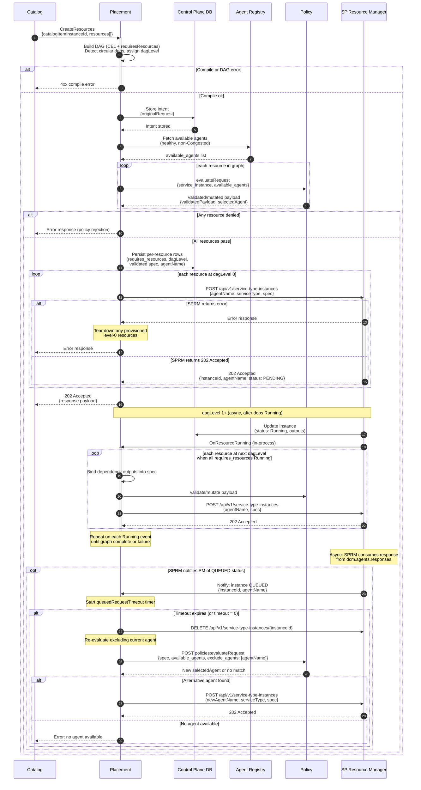
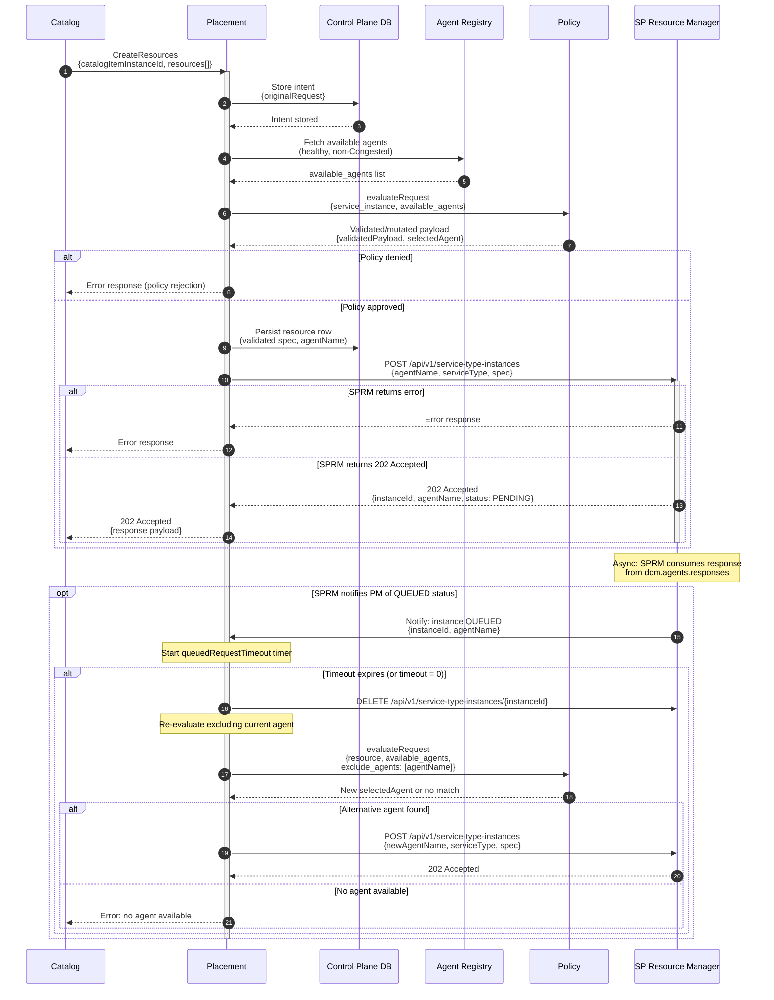
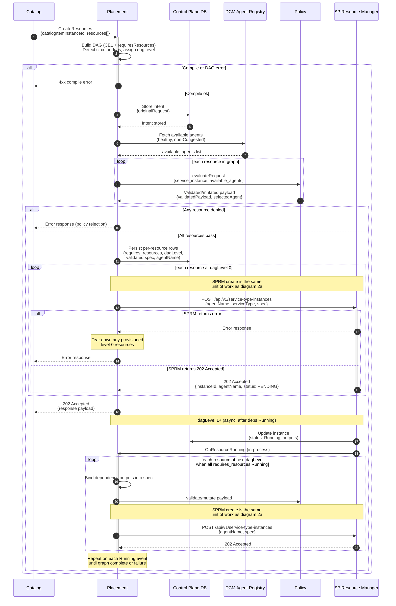

# Service Creation Flow — Diagram Options

This document compares two ways to document the Placement Manager service
creation flow.

Both options describe the same behavior:

1. Catalog calls `CreateResources` with `catalogItemInstanceId` and
   `resources[]`.
2. Placement compiles the DAG (CEL + `requiresResources`), stores intent, and
   fetches `available_agents` once from the Agent Registry.
3. Placement evaluates policy once per resource.
4. Placement persists each resource row and starts `dagLevel` 0 provisioning via
   SPRM.
5. Placement returns `202 Accepted` with `payload` to Catalog.
6. `dagLevel` 1+ continues asynchronously when dependencies reach `Running`
   state.
7. Queued-request timeout may re-evaluate policy with `exclude_agents`.

---

## Option 1 — Single full-flow sequence diagram

One diagram covering end to end flow: DAG compilation, policy, level 0
provisioning, status-driven provisioning, and queued-request handling.

---

## Option 2 — Split diagrams

Two diagrams with a clear boundary:

### 2a. End-to-end creation flow (single resource)

Unit-level path for one resource with no loops for policy.

### 2b. Multi-resource DAG orchestration

Multiple resource orchestration with DAG compilation, policy loop with status
driven provisioning. Each SPRM create follows the same unit path as diagram 2a.

