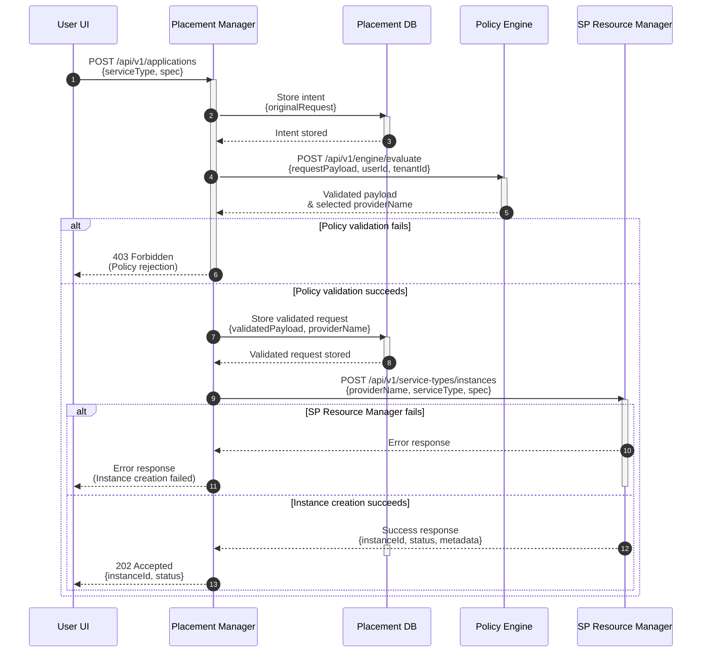

# Placement Manager

## Open Questions

1. Naming for the API?
   - /applications?
   - /services?
   - Others?
   **Note: Will update the wording across the doc after we decide.**
2. Do we want the spec to be opaque or import the service type 
   schema to restrict and validate it?
   Do we agree to have the `serviceType` on the root level?
3. Does the flow for placement (creating application) makes sense?
4. Anything else we are missing in terms of the placement flow for v1?

## Summary

The Placement Manager orchestrates applications creation requests within DCM
core. It receives user requests, validates them through the Policy Engine, and
delegates instance creation to the SP Resource Manager. The Placement Manager
focuses on request orchestration and coordination.

## Motivation

### Goals

- Define end-to-end flow of applications creation
- Define _Create_, _Read_, _Delete_ endpoints for Placement Manager
- Define Placement Manager interacts with other services within DCM core (UI,
  Policy, SP Resource Manager)
- Define orchestration responsibilities for Placement Manager

### Non-Goals

- Define Update endpoint, as this is out of scope for the first version (v1).

## Proposal

### System Architecture

The Placement Manager acts as the central orchestration service within DCM core,
coordinating between user requests, policy validation, and service instance
creation. The following diagram illustrates the system architecture and
component interactions.

```mermaid
%%{init: {'flowchart': {'rankSpacing': 100, 'nodeSpacing': 10, 'curve': 'linear'}}}%%
flowchart TD
    classDef userLayer fill:#1565c0,stroke:#90caf9,stroke-width:2px
    classDef placementManager fill:#701782,stroke:#ce93d8,stroke-width:2px
    classDef policyEngine fill:#bd6c09,stroke:#ffb74d,stroke-width:2px
    classDef spResourceManager fill:#187034,stroke:#81c784,stroke-width:2px
    classDef database fill:#9e184b,stroke:#f48fb1,stroke-width:2px
    classDef dcmCore fill:#0a120d,stroke:#bdbdbd,stroke-width:2px

    subgraph User_Layer [**User Interface**]
        User["**User UI**<br/>"]:::userLayer
    end

    subgraph DCM_Core [ ]
        PM["**Placement Manager**<br/>"]:::placementManager

        subgraph Services [ ]
            PE["**Policy Engine**<br/>Policy Validation & SP Selection"]:::policyEngine
            SPRM["**SP Resource Manager**<br/>Instance Lifecycle Management"]:::spResourceManager
        end

        subgraph Data_Layer [ ]
            PM_DB[("**Placement DB**")]:::database
        end
    end

    User -->|"1. Create/Read/Delete<br/>Application"| PM
    PM -->|"2. Validate Request<br/>& Select SP"| PE
    PE -->|"3. Validated Payload<br/>& Selected SP"| PM
    PM -->|"4. Query Application Records"| PM_DB
    PM_DB -->|"5. Application Data"| PM
    PM -->|"6. Create/Read/Delete<br/>Instance"| SPRM
    SPRM -->|"7. Instance Response"| PM
    PM -->|"8. Final Response"| User

    class User_Layer userLayer
    class DCM_Core dcmCore
    class Services dcmCore
    class Data_Layer dcmCore
```



### Integration Points

#### User Interface

- Receives applications creation requests from users
- Provides REST API endpoints for _create_, _read_, _delete_ operations on
  service instances
- Returns responses and error messages to users

#### Policy Engine

- Sends requests for validation via `POST /api/v1/engine/evaluate`
- Receives validated payload and selected Service Provider
- Receives policy rejections and constraint violations responses and forwards to
  the users

#### SP Resource Manager

- Delegates instance creation, read, and delete operations to SP Resource
  Manager
- Forwards validated requests with selected SP name
- Receives responses and forwards to the users

#### Database

- Stores the intent (original request) of the user request
- Store validated request and enables rehydration process
- Maintains record of all applications created through Placement Manager

### API Endpoints

The CRUD endpoints are consumed by the User Interface(UI) to create and manage
applications.

#### Endpoints Overview

| Method | Endpoint                             | Description                    |
| ------ | ------------------------------------ | ------------------------------ |
| POST   | /api/v1/applications                 | Create a application           |
| GET    | /api/v1/applications                 | List all applications          |
| GET    | /api/v1/applications/{applicationId} | Get a applications             |
| DELETE | /api/v1/applications/{applicationId} | Delete a applications          |
| GET    | /api/v1/health                       | Placement Manager health check |

**POST /api/v1/applications - Create an application.**

The POST endpoint creates an application that is supported by DCM.

Snippet of the request body (_TBD_)

```yaml
requestBody:
  required: true
  content:
    application/json:
      schema:
        type: object
        required:
          - serviceType
          - spec
        properties:
          serviceType:
            type: string
            description: Type of service/application to create
            example: "vm"
          spec:
            type: object
            description: |
              Service specification following one of the supported service type
              schemas (VMSpec, ContainerSpec, DatabaseSpec, or ClusterSpec).
            additionalProperties: true
```

Example of payload for incoming VM request

```json
{
  "serviceType": "vm",
  "spec": {
    "memory": { "size": "2GB" },
    "vcpu": { "count": 2 },
    "guestOS": { "type": "fedora-39" },
    "access": {
      "sshPublicKey": "ssh-ed25519 AAAAC3NzaC1lZDI1NTE5AAAAIExample..."
    },
    "metadata": { "name": "fedora-vm" }
  }
}
```

**GET /api/v1/applications**  
List all applications according to AEP standards.

Example of Response Payload

```json
[
  {
    "serviceType": "container",
    "name": "nginx-container",
    "providerName": "container-sp",
    "instanceId": "696511df-1fcb-4f66-8ad5-aeb828f383a0",
    "status": "PROVISIONING"
  },
  {
    "serviceType": "database",
    "name": "postgres-001",
    "providerName": "postgres-sp",
    "instanceId": "c66be104-eea3-4246-975c-e6cc9b32d74d",
    "status": "FAILED"
  },
  {
    "serviceType": "vm",
    "name": "ubuntu-vm",
    "providerName": "kubevirt-sp",
    "instanceId": "08aa81d1-a0d2-4d5f-a4df-b80addf07781",
    "status": "PROVISIONING"
  }
]
```

**GET /api/v1/applications/{applicationId}**  
Get an application based on id.

Example of Response Payload

```json
{
  "serviceType": "vm",
  "name": "ubuntu-vm",
  "providerName": "kubevirt-sp",
  "instanceId": "08aa81d1-a0d2-4d5f-a4df-b80addf07781",
  "status": "PROVISIONING"
}
```

**Delete /api/v1/applications/{applicationId}**  
Delete an application based on id.

**GET /api/v1/health**  
Retrieve the health status of Placement Manager.

## Design Details

### Service Creation Flow

The following sequence diagram illustrates the complete flow for creating a
applications via the `POST /api/v1/applications` endpoint.



#### Flow Description

1. **Request Reception**

- User UI sends a POST request to Placement Manager with `serviceType` and
  `spec` (application specification)
- Placement Manager receives and processes the request

2. **Record Intent**

- Placement Manager stores the original request (intent) in Placement DB
- This enables rehydration and tracking of the user's original request
- Intent is stored before any processing to ensure request persistence

3. **Policy Validation**
- Placement Manager forwards the request to Policy Engine for validation
- Policy Engine evaluates policies
- Policy Engine returns:
  - Approved or rejected
  - Validated and potentially mutated payload
  - Selected Service Provider name (`providerName`)
  - Policy constraints and patches applied
- If policy validation fails (request rejected or constraint violation):
  - Placement Manager returns 403 Forbidden to User UI
  - Request processing stops
- If policy validation succeeds:
  - Placement Manager stores the validated request in Placement DB which
    includes the validated payload and selected `providerName`

4. **Instance Creation**

- Placement Manager delegates instance creation to SP Resource Manager
- Forwards the validated request with `providerName`, `serviceType`, and `spec`
- SP Resource Manager handles SP lookup, health checks, and instance
  provisioning
- If SP Resource Manager fails to create the instance:
  - Error response is returned to Placement Manager
  - Placement Manager forwards the error to User UI
  - Request processing stops
- If instance creation succeeds:
  - SP Resource Manager returns success response with `instanceId`, `status`
  - Placement Manager returns 202 Accepted to User UI with `instanceId` and
    `status`
  - The application is now in a `PROVISIONING` state

#### Key Characteristics/Notes

- **Intent Preservation**: Original user request is stored before processing for
  audit and rehydration purposes
- **Policy-Driven**: Service Provider selection and request validation are
  handled by Policy Engine
- **Error Handling**: Clear error paths for policy rejections and instance
  creation failures
- **State Management**: Both original intent and validated request are stored
  for complete request lifecycle tracking
