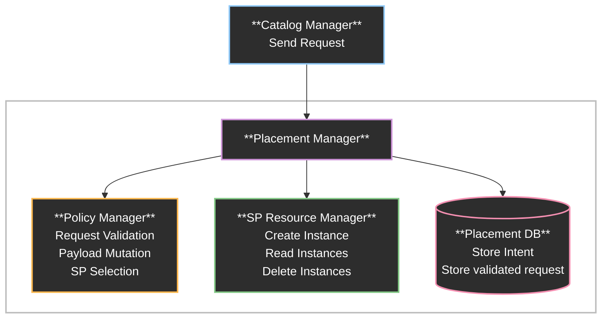
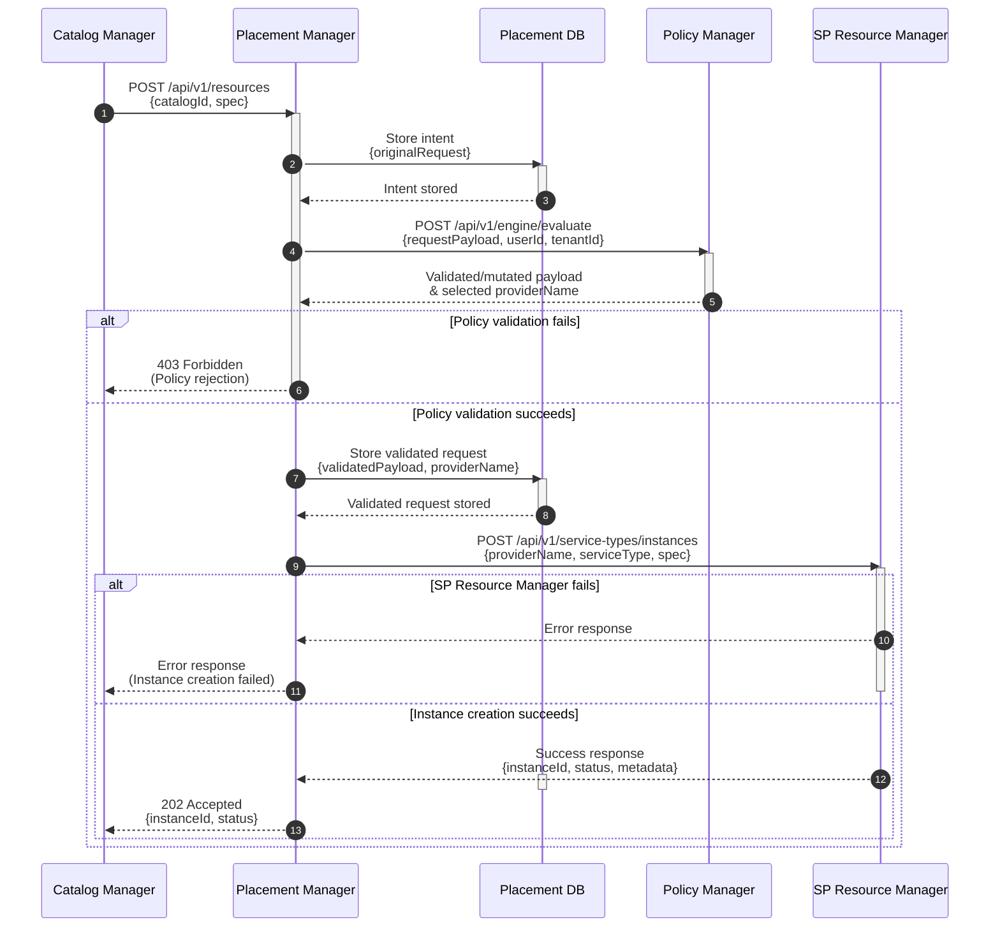

# Placement Manager

## Summary

The Placement Manager orchestrates resource requests within DCM
core. It receives user requests from the Catalog Manager, validates and 
enriches them through the Policy Manager, and delegates instance creation 
to the SP Resource Manager. The Placement Manager focuses on 
request orchestration and coordination.

## Motivation

### Goals

- Define end-to-end flow of for creating resources
- Define _Create_, _Read_, _Delete_ endpoints for Placement Manager
- Define Placement Manager interacts with other services within DCM core
  (Catalog Manager, Policy Manager, SP Resource Manager)
- Define orchestration responsibilities for Placement Manager

### Non-Goals

- Define Update endpoint, as this is out of scope for the first version (v1).

## Proposal

### System Architecture

The Placement Manager acts as the central orchestration service within DCM core,
coordinating between user requests (from Catalog), policy validation, 
and catalog instance creation. 
The following diagram illustrates the system architecture and
component interactions.



### Integration Points

#### Catalog Service

- Receives resource creation requests from users
- Provides REST API endpoints for _create_, _read_, _delete_ operations on
  catalog instances
- Returns responses and error messages to users

#### Policy Manager

- Sends requests for validation via `POST /api/v1/engine/evaluate`
- Receives validated/mutated payload and selected Service Provider
- Receives policy rejections and constraint violations responses and forwards to
  the users

#### SP Resource Manager

- Delegates instance creation, read, and delete operations to SP Resource
  Manager
- Forwards validated requests with selected SP name
- Receives responses and forwards to the users

#### Database

- Stores the intent (original request) of the user request
- Store validated request and enables rehydration process
- Maintains record of all resources created through Placement Manager

### API Endpoints

The CRUD endpoints are consumed by the User Interface(UI) to create and manage
resources.

#### Endpoints Overview

| Method | Endpoint                       | Description                    |
|--------|--------------------------------|--------------------------------|
| POST   | /api/v1/resources              | Create a resource              |
| GET    | /api/v1/resources              | List all resources             |
| GET    | /api/v1/resources/{resourceId} | Get a resource                 |
| DELETE | /api/v1/resources/{resourceId} | Delete a resource              |
| GET    | /api/v1/health                 | Placement Manager health check |

**POST /api/v1/resources - Create an resource.**

The POST endpoint creates a resource that is supported by DCM.

Snippet of the request body

```yaml
requestBody:
  required: true
  content:
    application/json:
      schema:
        type: object
        required:
          - catalogId
          - version
          - spec
        properties:
          catalog_id:
            type: string
            description: Catalog item unique identifier 
            example: "dev-vm"
          version:
            type: string
            description: Catalog item version
            example: "v1.0"
          spec:
            type: object
            description: |
              Service specification following one of the supported service type
              schemas (VMSpec, ContainerSpec, DatabaseSpec, or ClusterSpec).
            additionalProperties: true
```

Example of payload for incoming VM catalog instance request

```json
{
  "catalogId": "dev-vm",
  "version": "v1.0",
  "spec": {
    "serviceType": "vm",
    "serviceTypeVersion": "v1alpha",
    "memory": { "size": "2GB" },
    "vcpu": { "count": 2 },
    "guestOS": { "type": "fedora-39" },
    "access": {
      "sshPublicKey": "ssh-ed25519 AAAAC3NzaC1lZDI1NTE5AAAAIExample..."
    },
    "metadata": { "name": "fedora-vm" }
  }
}
```

**GET /api/v1/resources**  
List all resources according to AEP standards.

Example of Response Payload

```json
[
  {
    "serviceType": "container",
    "name": "nginx-container",
    "providerName": "container-sp",
    "instanceId": "696511df-1fcb-4f66-8ad5-aeb828f383a0",
    "status": "PROVISIONING"
  },
  {
    "serviceType": "database",
    "name": "postgres-001",
    "providerName": "postgres-sp",
    "instanceId": "c66be104-eea3-4246-975c-e6cc9b32d74d",
    "status": "FAILED"
  },
  {
    "serviceType": "vm",
    "name": "ubuntu-vm",
    "providerName": "kubevirt-sp",
    "instanceId": "08aa81d1-a0d2-4d5f-a4df-b80addf07781",
    "status": "PROVISIONING"
  }
]
```

**GET /api/v1/resources/{resourceId}**  
Get a resource based on id.

Example of Response Payload

```json
{
  "serviceType": "vm",
  "name": "ubuntu-vm",
  "providerName": "kubevirt-sp",
  "instanceId": "08aa81d1-a0d2-4d5f-a4df-b80addf07781",
  "status": "PROVISIONING"
}
```

**Delete /api/v1/resources/{resourceId}**  
Delete a resource based on id.

**GET /api/v1/health**  
Retrieve the health status of Placement Manager.

## Design Details

### Service Creation Flow

The following sequence diagram illustrates the complete flow for creating a
resources via the `POST /api/v1/resources` endpoint.



#### Flow Description

1. **Request Reception**

- Catalog Manager sends a POST request to Placement Manager with `catalogId` and
  `spec` (resource specification)
- Placement Manager receives and processes the request

2. **Record Intent**

- Placement Manager stores the original request (intent) in Placement DB
- This enables rehydration and tracking of the user's original request
- Intent is stored before any processing to ensure request persistence

3. **Policy Validation**
- Placement Manager forwards the request to Policy Manager for validation
- Policy Manager evaluates requests against policies
- Policy Manager returns:
  - Approved or rejected
  - Validated and potentially mutated payload
  - Selected Service Provider name (`providerName`)
  - Policy constraints and patches applied
- If policy validation fails (request rejected or constraint violation):
  - Placement Manager returns 403 Forbidden to User UI
  - Request processing stops
- If policy validation succeeds:
  - Placement Manager stores the validated request in Placement DB which
    includes the validated/mutated payload and selected `providerName`

4. **Instance Creation**

- Placement Manager delegates instance creation to SP Resource Manager
- Forwards the validated request with `providerName`, `serviceType`, and `spec`
- SP Resource Manager handles SP lookup, health checks, and instance
  provisioning
- If SP Resource Manager fails to create the instance:
  - Error response is returned to Placement Manager
  - Placement Manager forwards the error to User UI
  - Request processing stops
- If instance creation succeeds:
  - SP Resource Manager returns success response with `instanceId`, `status`
  - Placement Manager returns 202 Accepted to User UI with `instanceId` and
    `status`
  - The resource is now in a `PROVISIONING` state

#### Key Characteristics/Notes

- **Intent Preservation**: Original user request is stored before processing for
  audit and rehydration purposes
- **Policy-Driven**: Service Provider selection and request validation are
  handled by Policy Manager
- **Error Handling**: Clear error paths for policy rejections and instance
  creation failures
- **State Management**: Both original intent and validated request are stored
  for complete request lifecycle tracking
