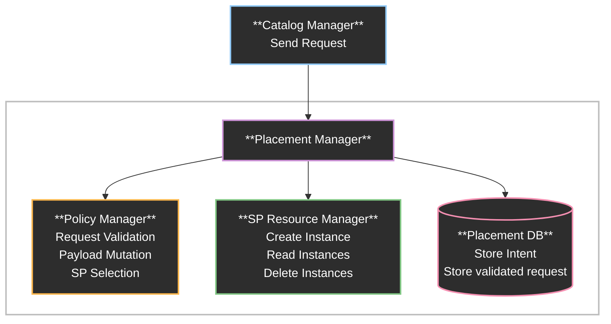
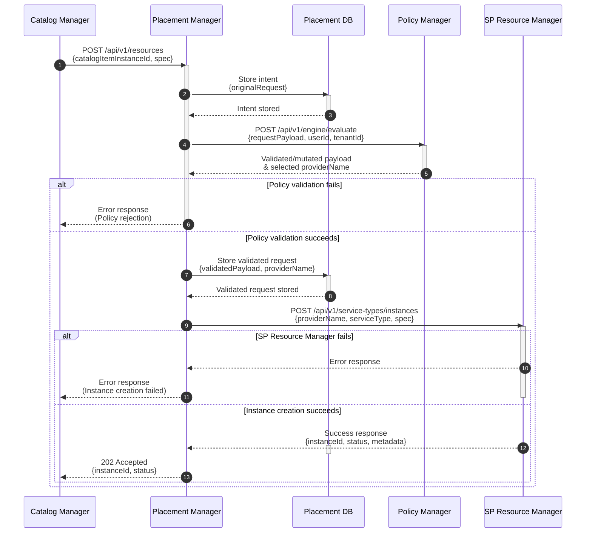

# Placement Manager

## Summary

The Placement Manager orchestrates resource requests within DCM
core. It receives user requests through the Catalog Manager, validates and 
enriches them through the Policy Manager, and delegates instance creation 
to the SP Resource Manager. The Placement Manager focuses on 
request orchestration and coordination.

## Motivation

### Goals

- Define end-to-end flow of for creating resources
- Define _Create_, _Read_, _Delete_ endpoints for Placement Manager
- Define Placement Manager interacts with other services within DCM core
  (Catalog Manager, Policy Manager, SP Resource Manager)
- Define orchestration responsibilities for Placement Manager

### Non-Goals

- Define Update endpoint, as this is out of scope for the first version (v1).

## Proposal

### System Architecture

The Placement Manager acts as the central orchestration service within DCM core,
coordinating between user requests (from Catalog), policy validation, 
and catalog instance creation. 
The following diagram illustrates the system architecture and
component interactions.


```mermaid
%%{init: {'flowchart': {'rankSpacing': 100, 'nodeSpacing': 10, 'curve': 'linear'},}}%%
flowchart TD
    classDef catalogManager fill:#2d2d2d,color:#ffffff,stroke:#90caf9,stroke-width:2px
    classDef placementManager fill:#2d2d2d,color:#ffffff,stroke:#ce93d8,stroke-width:2px
    classDef policyEngine fill:#2d2d2d,color:#ffffff,stroke:#ffb74d,stroke-width:2px
    classDef spResourceManager fill:#2d2d2d,color:#ffffff,stroke:#81c784,stroke-width:2px
    classDef database fill:#2d2d2d,color:#ffffff,stroke:#f48fb1,stroke-width:2px
    classDef dcmCore fill:#FFFFFF,stroke:#bdbdbd,stroke-width:2px

    CM["**Catalog Manager**<br/>Send Request"]:::catalogManager

    subgraph DCM_Core [ ]
        PM["**Placement Manager**<br/>"]:::placementManager
        
        PE["**Policy Manager**<br/>Request Validation<br/>Payload Mutation<br/>SP Selection"]:::policyEngine
        
        SPRM["**SP Resource Manager**<br/>Create Instance<br/> Read Instances<br/> Delete Instances"]:::spResourceManager

        PM_DB[("**Placement DB**<br/>Store Intent<br/>Store validated request")]:::database

    end

    CM --> PM
    PM --> PE
    PM --> PM_DB
    PM --> SPRM
    

    class DCM_Core dcmCore
```

### Integration Points

#### Catalog Service

- Receives resource creation requests from users
- Provides REST API endpoints for _create_, _read_, _delete_ operations on
  catalog instances
- Returns responses and error messages to users

#### Policy Manager

- Sends requests for validation via `POST /api/v1/engine/evaluate`
- Receives validated/mutated payload and selected Service Provider
- Receives policy rejections and constraint violations responses and forwards to
  the users

#### SP Resource Manager

- Delegates instance creation, read, and delete operations to SP Resource
  Manager
- Forwards validated requests with selected SP name
- Receives responses and forwards to the users

#### Database

- Stores the intent (original request) of the user request
- Store validated request and enables rehydration process
- Maintains record of all resources created through Placement Manager

### API Endpoints

The CRUD endpoints are consumed by the Catalog Manager to create and manage
resources.

#### Endpoints Overview

| Method | Endpoint                       | Description                    |
|--------|--------------------------------|--------------------------------|
| POST   | /api/v1/resources              | Create a resource              |
| GET    | /api/v1/resources              | List all resources             |
| GET    | /api/v1/resources/{resourceId} | Get a resource                 |
| DELETE | /api/v1/resources/{resourceId} | Delete a resource              |
| GET    | /api/v1/health                 | Placement Manager health check |

**POST /api/v1/resources - Create an resource.**

The POST endpoint creates a resource that is supported by DCM. The resource 
request is an instance of a catalog item and originates from the user (UI)
through the Catalog Manager.

Snippet of the request body

```yaml
requestBody:
  schemas:
    Resource:
      type: object
      description: Full resource representation
      x-aep-resource:
        type: placement.dcm.io/resource
        singular: resource
        plural: resources
        patterns:
          - resources/{resource_id}
      required:
        - catalog_item_instance_id
        - spec
```

Example of payload for incoming VM catalog instance request

```json
{
  "catalogItemInstanceId": "4baa35eb-e70d-4d37-867d-0f4efa21d05c",
  "spec": {
    "cpu": 2,    
    "memory": "2GB"
  }               
}  
```

Response payload: Returns 201 Created if successful.
```json
{
  "id": "08aa81d1-a0d2-4d5f-a4df-b80addf07781",
  "path": "resources/08aa81d1-a0d2-4d5f-a4df-b80addf07781",
  "provider_name": "kubevirt-sp",
  "catalogItemInstanceId": "f3645f8f-82c1-4efb-888f-318c0ac81a08",
  "spec": {
    "cpu": 2,
    "memory": "2GB"
  },                                
  "approval_status": "pending",
  "create_time": "2026-05-03T12:00:00Z",
  "update_time": "2026-05-03T12:00:00Z"
}
```

**Note**: This is **only** an example of the payload.

**POST /resources/{resourceId}:rehydrate**  

The POST endpoint creates a resource that is supported by DCM. 
Rehydrate re-evaluates an existing resource against current policies, provisions a new one with a new ID, and deletes the old one

Snippet of the request body

```yaml
RehydrateRequest:
  type: object
  description: Request body for resource rehydration
  required:
    - new_resource_id
  properties:
    new_resource_id:
      type: string
      description: The new resource ID to use for the rehydrated resource
      pattern: '^[a-z0-9]([a-z0-9-]{0,61}[a-z0-9])?$'
      minLength: 1
      maxLength: 63
```

Example of payload for incoming VM catalog instance request

```bash
{
  "new_resource_id": "08aa81d1-a0d2-4d5f-a4df-b80addf07781"
}
```

Example of Response Payload

```bash
{
  "id": "08aa81d1-a0d2-4d5f-a4df-b80addf07781",          
  "path": "resources/08aa81d1-a0d2-4d5f-a4df-b80addf07781",
  "provider_name": "kubevirt-sp",
  "catalogItemInstanceId": "696511df-1fcb-4f66-8ad5-aeb828f383a0",
  "spec": {
    "cpu": 2,
    "memory": "2GB"
  },
  "approval_status": "approved",
  "create_time": "2026-05-03T12:05:00Z",
  "update_time": "2026-05-03T12:05:00Z"
}
```


**GET /api/v1/resources**  
List all resources according to AEP standards.

Example of Response Payload

```json
{
 [ 
  {
    "id": "52540146-6212-4514-b534-0c3127b2836f",
    "path": "resources/52540146-6212-4514-b534-0c3127b2836f",
    "provider_name": "container-sp",
    "catalogItemInstanceId": "08aa81d1-a0d2-4d5f-a4df-b80addf07781",   
    "spec": {
      "cpu": 2,
      "memory": "2GB"
    },  
    "approval_status": "approved",
    "create_time": "2026-05-03T12:00:00Z",
    "update_time": "2026-05-03T12:30:00Z"   
  }
],                                
"next_page_token": "eyJpZCI6IjEyM2U0NTY3LWU4OWItMTJkMy1hNDU2LTQyNjYxNDE3NDAwMCJ9"              
}  
```

**GET /api/v1/resources/{resourceId}**  
Get a resource based on id.

Example of Response Payload

```json
{
  "id": "d08aa81d1-a0d2-4d5f-a4df-b80addf07781",  
  "path": "resources/08aa81d1-a0d2-4d5f-a4df-b80addf07781",
  "provider_name": "kubevirt-sp",
  "catalogItemInstanceId": "d6ebf344-bfd1-44c9-bc25-97f9fb856f22",
  "spec": {       
    "cpu": 4,
    "memory": "2GB"
  },
  "approval_status": "approved",
  "create_time": "2026-05-03T12:00:00Z",
  "update_time": "2026-05-03T12:30:00Z"
}
```

**Delete /api/v1/resources/{resourceId}**  
Delete a resource based on id.

**GET /api/v1/health**  
Retrieve the health status of Placement Manager.

Example of Response Payload

```bash
{
  "status": "healthy",
  "path": "health"    
}
```

## Design Details

### Service Creation Flow

The following sequence diagram illustrates the complete flow for creating a
resources via the `POST /api/v1/resources` endpoint.


```mermaid
sequenceDiagram
    autonumber
    participant CM as Catalog Manager
    participant PM as Placement Manager
    participant DB as Placement DB
    participant PE as Policy Manager
    participant SPRM as SP Resource Manager

    CM->>PM: POST /api/v1/resources<br/>{catalogItemInstanceId, spec}
    activate PM

    PM->>DB: Store intent<br/>{originalRequest}
    activate DB
    DB-->>PM: Intent stored
    deactivate DB

    PM->>PE: POST /api/v1/engine/evaluate<br/>{requestPayload, userId, tenantId}
    activate PE

    PE-->>PM: Validated/mutated payload<br/>& selected providerName
    deactivate PE

    alt Policy validation fails
        PM-->>CM: Error response<br/>(Policy rejection)
        deactivate PM
    else Policy validation succeeds

        PM->>DB: Store validated request<br/>{validatedPayload, providerName}
        activate DB
        DB-->>PM: Validated request stored
        deactivate DB

        PM->>SPRM: POST /api/v1/service-types/instances<br/>{providerName, serviceType, spec}
        activate SPRM

        alt SP Resource Manager fails
            SPRM-->>PM: Error response
            PM-->>CM: Error response<br/>(Instance creation failed)
            deactivate SPRM

        else Instance creation succeeds
            SPRM-->>PM: Success response<br/>{instanceId, status, metadata}
            activate DB
            deactivate DB

            PM-->>CM: 202 Accepted<br/>{instanceId, status}

        end
    end
```

#### Flow Description

1. **Request Reception**

- Catalog Manager sends a POST request to Placement Manager with `catalogItemInstanceId` and
  `spec` (resource specification)
- Placement Manager receives and processes the request

2. **Record Intent**

- Placement Manager stores the original request (intent) in Placement DB
- This enables rehydration and tracking of the user's original request
- Intent is stored before any processing to ensure request persistence

3. **Policy Validation**
- Placement Manager forwards the request to Policy Manager for validation
- Policy Manager evaluates requests against policies
- Policy Manager returns:
  - Approved or rejected
  - Validated and potentially mutated payload
  - Selected Service Provider name (`providerName`)
  - Policy constraints and patches applied
- If policy validation fails (request rejected or constraint violation):
  - Delete record from Placement DB
  - Placement Manager returns error response to Catalog Manager
  - Request processing stops
- If policy validation succeeds:
  - Placement Manager stores the validated request in Placement DB which
    includes the validated/mutated payload and selected `providerName`

4. **Instance Creation**

- Placement Manager delegates instance creation to SP Resource Manager
- Forwards the validated request with `providerName`, `serviceType`, and `spec`
- SP Resource Manager handles SP lookup, health checks, and instance
  provisioning
- If SP Resource Manager fails to create the instance:
  - Error response is returned to Placement Manager
  - Delete record from Placement DB
  - Placement Manager forwards the error to Catalog Manager
  - Request processing stops
- If instance creation succeeds:
  - SP Resource Manager returns success response with `instanceId`, `status`
  - Placement Manager returns 202 Accepted to Catalog Manager with `instanceId` and
    `status`
  - The resource is now in a `PROVISIONING` state

#### Key Characteristics/Notes

- **Intent Preservation**: Original user request is stored before processing for
  audit and rehydration purposes
- **Policy-Driven**: Service Provider selection and request validation are
  handled by Policy Manager
- **Error Handling**: Clear error paths for policy rejections and instance
  creation failures
- **State Management**: Both original intent and validated request are stored
  for complete request lifecycle tracking and rehydration purposes
