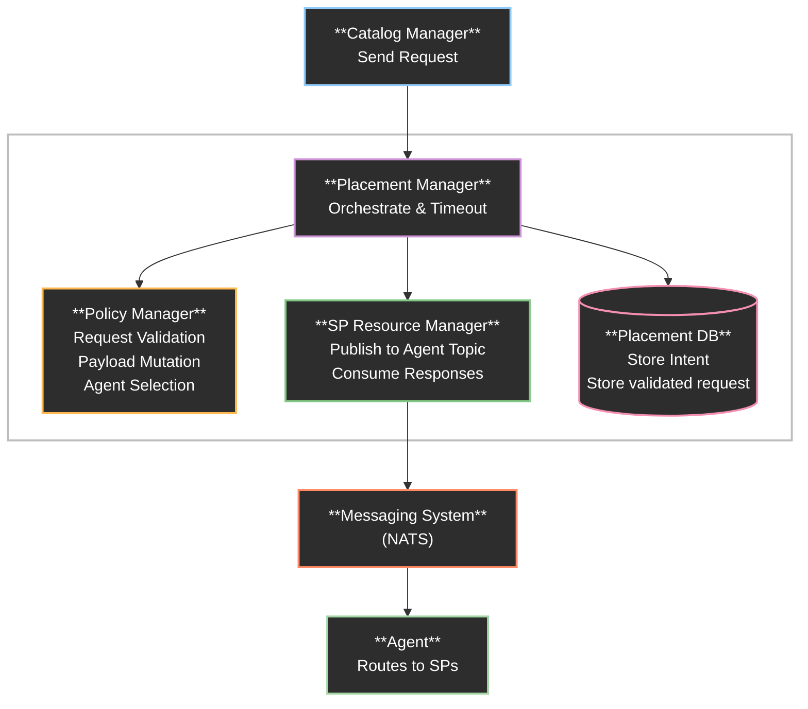
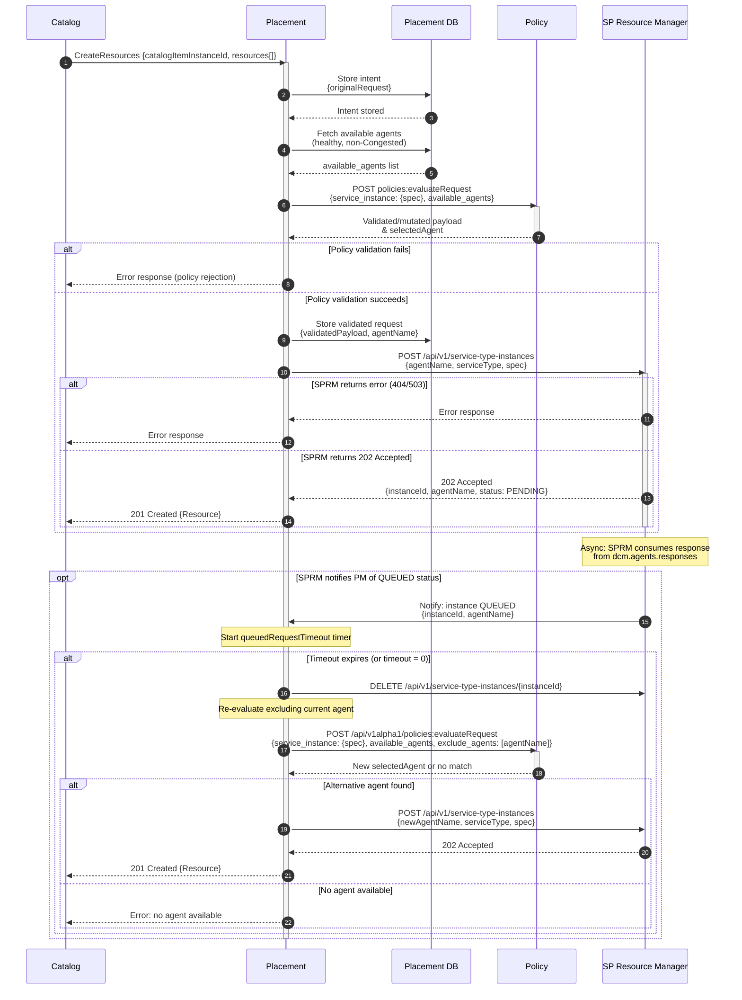
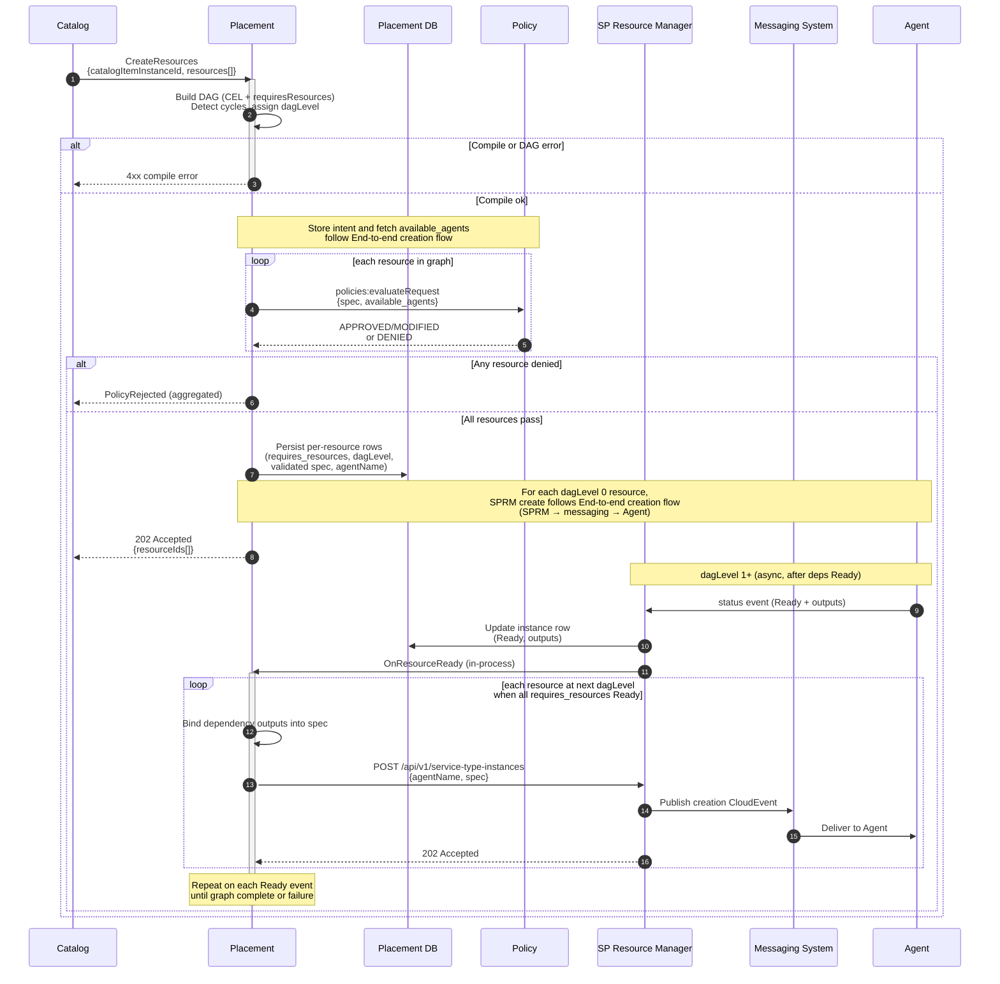
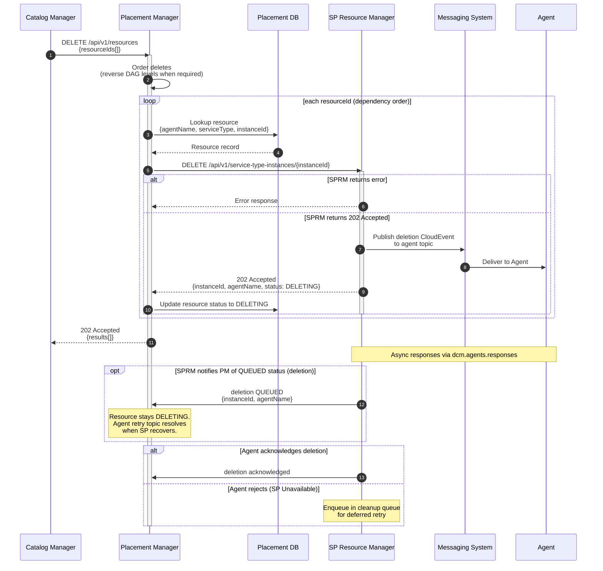

# Placement Manager

## Terminology

- **DAG (Drected Acyclic graph)**: The dependency graph Placement compiles from
  a resolved `resources[]` payload. Placement combines CEL `${resource.field}`
  references in each spec with explicit `requiresResources` to form edges,
  rejects cycles, and assigns each node a `dagLevel` via topological sort. The
  graph orders provisioning and deletion.

- **Run**: One Catalog `CreateResources` call from admission through
  orchestration of all resources in that graph to terminal success or failure. A
  run may contain a single resource or many related resources.

- **Run admission**: The synchronous phase of a run when Placement accepts a
  Catalog request: store intent, compile the DAG, evaluate policy for every
  resource (all must pass before any create), persist validated resource, return
  `202 Accepted`, and initiate provisioning for `dagLevel 0`. Later levels
  continue asynchronously when dependencies are `Ready`.

- **Run id (`runId`)**: Unique identifier Placement assigns to one run
  admission.

## Summary

The Placement Manager orchestrates resource requests within DCM core. It
receives resolved application graphs from the Catalog Manager. It builds the
dependency DAG, validates and enriches each resource through the Policy (which
now selects an Agent). Then it delegates resource creation and deletion, in DAG
order, to the SP Resource Manager, which routes through the Messaging System to
an Agent. The Placement Manager also handles timeout logic for both queued
requests (Agent reports SP is unhealthy) and pending requests (Agent never
acknowledged the creation CloudEvent after retries).

## Motivation

### Goals

- Define end-to-end flow for creating resources
- Define end-to-end flow for deleting resources (deletion flow)
- Define how Placement Manager interacts with other domains within DCM core
- Define orchestration responsibilities such as DAG compilation, per-resource
  policy validation and DAG order provisioning driven by dependency readiness
- Define queued-request timeout logic for agent-based routing

### Non-Goals

- Define Update operation, as this is out of scope for the first version (v1).
- Graph-wide policy evaluation within a single request over the full DAG
  snapshot.

## Proposal

### System Architecture

The Placement Manager acts as the central orchestration service within DCM core,
coordinating between user requests (from Catalog), policy validation, and
instance lifecycle management. The Policy Manager selects an Agent, and the SP
Resource Manager publishes requests to the Agent's messaging topic. The Agent
internally routes to its Service Providers.

The following diagram illustrates the system architecture and component
interactions.


```mermaid
%%{init: {'flowchart': {'rankSpacing': 100, 'nodeSpacing': 10, 'curve': 'linear'},}}%%
flowchart TD
    classDef catalogManager fill:#2d2d2d,color:#ffffff,stroke:#90caf9,stroke-width:2px
    classDef placementManager fill:#2d2d2d,color:#ffffff,stroke:#ce93d8,stroke-width:2px
    classDef policyEngine fill:#2d2d2d,color:#ffffff,stroke:#ffb74d,stroke-width:2px
    classDef spResourceManager fill:#2d2d2d,color:#ffffff,stroke:#81c784,stroke-width:2px
    classDef database fill:#2d2d2d,color:#ffffff,stroke:#f48fb1,stroke-width:2px
    classDef messaging fill:#2d2d2d,color:#ffffff,stroke:#ff8a65,stroke-width:2px
    classDef agent fill:#2d2d2d,color:#ffffff,stroke:#a5d6a7,stroke-width:2px
    classDef dcmCore fill:#FFFFFF,stroke:#bdbdbd,stroke-width:2px

    CM["**Catalog Manager**<br/>Send Request"]:::catalogManager

    subgraph DCM_Core [ ]
        PM["**Placement Manager**<br/>Orchestrate & Timeout"]:::placementManager
        PE["**Policy Manager**<br/>Request Validation<br/>Payload Mutation<br/>Agent Selection"]:::policyEngine
        SPRM["**SP Resource Manager**<br/>Publish to Agent Topic<br/>Consume Responses"]:::spResourceManager
        PM_DB[("**Placement DB**<br/>Store Intent<br/>Store validated request")]:::database
    end

    MS["**Messaging System**<br/>(NATS)"]:::messaging
    AG["**Agent**<br/>Routes to SPs"]:::agent

    CM --> PM
    PM --> PE
    PM --> PM_DB
    PM --> SPRM
    SPRM --> MS
    MS --> AG

    class DCM_Core dcmCore
```

### Integration Points

#### Catalog Service

- Receives resource creation and deletion requests from users
- Provides REST API endpoints for _create_, _read_, _delete_ operations on
  catalog instances
- Calls Placement Manager to admit a run and to delete resources in batch
- Returns responses and error messages to users

#### Policy Manager

- Placement fetches `available_agents` once per run admission, then calls
  `POST /api/v1/engine/evaluate` once per resource in the graph with that shared
  list
- Receives `APPROVED/MODIFIED` or `DENIED` per resource. All resources must pass
  before any provisioning starts. If any resource fails validation (i.e
  `DENIED`), policy evaluation halts, no further resource in the graph is
  validated and the request is rejected.
- `available_agents` is included in each evaluation request payload
- Optionally includes `exclude_agents` to exclude agents from consideration
  (e.g., after a queued-request timeout)
- Receives validated/mutated payload and selected Agent (`agentName`)
- Receives policy rejections and constraint violations responses and forwards to
  the users

#### SP Resource Manager

- Delegates instance creation, read, and delete per resource to SP Resource
  Manager
- Forwards `agentName`, `serviceType`, and `spec` in requests
- SPRM publishes to the agent's messaging topic
- Receives responses and forwards to the users
- Reports back: success (202), error, or queued status
- When SPRM reports "queued" status, PM handles timeout logic (see
  [Queued-Request Handling](#queued-request-handling))
- **Status consumer (SPRM):** consumes Agent status events (for example from
  `dcm.agents.responses`), updates service-type instance rows in the
  control-plane database, and notifies Placement **in-process** when a resource
  reaches `Ready`. Placement uses that signal to bind apply-time CEL and trigger
  creates for the next DAG level (see
  [Status-driven DAG progression](#status-driven-dag-progression))

#### Database

- Stores per-resource rows for each admitted node (`name`, `spec`, compiled
  `requires_resources`, `dagLevel`, `agentName`, status, and related fields)
- Stores validated request per resource and enables rehydration
- Maintains records of all resources created through Placement Manager

### Placement service operations

Catalog invokes these operations in-process via the placement client. They are
not exposed as a public Placement OpenAPI surface.

#### Operations overview

| Method | Operation         | Description                                                           |
| ------ | ----------------- | --------------------------------------------------------------------- |
| POST   | `CreateResources` | Admit a run; create one or more resources (single- or multi-resource) |
| GET    | `ListResources`   | List applications (each with nested `resources[]`)                    |
| GET    | `GetResource`     | Get a single resource by `id`                                         |
| DELETE | `DeleteResources` | Delete one or more resources by id (single- or batch)                 |

_Identifiers_: Each provisioned node has a resource `id` (returned to Catalog as
`resourceIds[]` and stored on the catalog item instance). Placement assigns a
`runId` per run admission that groups resource rows within the resource table.
`runId` appears in responses but is not sent on create or delete requests for
now.

_CreateResources_: Admit a run (single or multi-resource graph).

Catalog calls Placement after catalog resolution. The request carries the
`catalogItemInstanceId` and a resolved `resources[]` graph with one or more
nodes (names, specs, and declared dependencies). A single-node graph is valid
for single-resource catalog items. Multiple nodes form a multi-resource run.
Placement builds the DAG, runs policy once per resource, persists the run, and
starts provisioning for DAG level 0.

Snippet of the request body

```yaml
requestBody:
  required: true
  content:
    application/json:
      schema:
        type: object
        required:
          - catalogItemInstanceId
          - resources
        properties:
          catalogItemInstanceId:
            type: string
            description: The ID of the catalog item instance
            example: "4baa35eb-e70d-4d37-867d-0f4efa21d05c"
          resources:
            type: array
            minItems: 1
            description: |
              One resource from the resolved catalog graph (name, spec, and
              optional requiresResources). CEL wiring is already in spec.
            items:
              type: object
              required:
                - name
                - spec
              properties:
                name:
                  type: string
                  description: Unique resource name
                  example: "ordersDb"
                spec:
                  type: object
                  description: |
                    Service specification following one of the supported service type
                    schemas (VMSpec, ContainerSpec, DatabaseSpec, ClusterSpec, etc.).
                  additionalProperties: true
                requiresResources:
                  type: array
                  items:
                    type: string
                  description: |
                    Optional explicit dependency names.
```

Example multi-resource request payload (dev app with database + container):

```json
{
  "catalogItemInstanceId": "4baa35eb-e70d-4d37-867d-0f4efa21d05c",
  "resources": [
    {
      "name": "ordersDb",
      "spec": {
        "serviceType": "database",
        "engine": "postgresql",
        "version": "16",
        "metadata": { "name": "orders-db" }
      }
    },
    {
      "name": "app",
      "requiresResources": ["ordersDb"],
      "spec": {
        "serviceType": "container",
        "image": { "reference": "registry.example.com/orders-api:1.0" },
        "process": {
          "env": [
            {
              "name": "DATABASE_URL",
              "value": "${ordersDb.connectionString}"
            }
          ]
        },
        "metadata": { "name": "orders-api" }
      }
    }
  ]
}
```

Example of response payload (`202 Accepted`):

```json
{
  "catalogItemInstanceId": "4baa35eb-e70d-4d37-867d-0f4efa21d05c",
  "runId": "7c4e8f2a-1b3d-4e5f-9a6b-0c1d2e3f4a5b",
  "resources": [
    {
      "id": "696511df-1fcb-4f66-8ad5-aeb828f383a0",
      "name": "ordersDb",
      "path": "resources/696511df-1fcb-4f66-8ad5-aeb828f383a0",
      "agentName": "postgres-sp",
      "approvalStatus": "approved",
      "status": "Pending",
      "dagLevel": 0,
      "spec": {
        "serviceType": "database",
        "engine": "postgresql",
        "version": "16",
        "metadata": { "name": "orders-db" }
      },
      "createTime": "2026-05-03T12:00:00Z",
      "updateTime": "2026-05-03T12:00:00Z"
    },
    {
      "id": "c66be104-eea3-4246-975c-e6cc9b32d74d",
      "name": "app",
      "path": "resources/c66be104-eea3-4246-975c-e6cc9b32d74d",
      "agentName": "container-sp",
      "approvalStatus": "approved",
      "status": "Pending",
      "requiresResources": ["ordersDb"],
      "dagLevel": 1,
      "spec": {
        "serviceType": "container",
        "image": { "reference": "registry.example.com/orders-api:1.0" },
        "process": {
          "env": [
            {
              "name": "DATABASE_URL",
              "value": "${ordersDb.connectionString}"
            }
          ]
        },
        "metadata": { "name": "orders-api" }
      },
      "createTime": "2026-05-03T12:00:00Z",
      "updateTime": "2026-05-03T12:00:00Z"
    }
  ]
}
```

**ListResources**: List admitted applications.

Each `applications[]` entry is one catalog item instance
(`catalogItemInstanceId`). Nested `resources[]` holds provisioned nodes for that
instance (`id` per node).

Example of response payload:

```json
{
  "applications": [
    {
      "catalogItemInstanceId": "4baa35eb-e70d-4d37-867d-0f4efa21d05c",
      "runId": "7c4e8f2a-1b3d-4e5f-9a6b-0c1d2e3f4a5b",
      "resources": [
        {
          "id": "696511df-1fcb-4f66-8ad5-aeb828f383a0",
          "name": "ordersDb",
          "path": "resources/696511df-1fcb-4f66-8ad5-aeb828f383a0",
          "agentName": "postgres-sp",
          "approvalStatus": "approved",
          "status": "Running",
          "dagLevel": 0,
          "spec": {
            "serviceType": "database",
            "engine": "postgresql",
            "version": "16",
            "metadata": { "name": "orders-db" }
          }
        },
        {
          "id": "c66be104-eea3-4246-975c-e6cc9b32d74d",
          "name": "app",
          "path": "resources/c66be104-eea3-4246-975c-e6cc9b32d74d",
          "agentName": "container-sp",
          "approvalStatus": "approved",
          "status": "Running",
          "requiresResources": ["ordersDb"],
          "dagLevel": 1,
          "spec": {
            "serviceType": "container",
            "image": { "reference": "registry.example.com/orders-api:1.0" },
            "metadata": { "name": "orders-api" }
          }
        }
      ]
    },
    {
      "catalogItemInstanceId": "f3645f8f-82c1-4efb-888f-318c0ac81a08",
      "runId": "2d8a1c9e-4f6b-4a7d-8e3c-1b2a3c4d5e6f",
      "resources": [
        {
          "id": "08aa81d1-a0d2-4d5f-a4df-b80addf07781",
          "name": "webserver",
          "path": "resources/08aa81d1-a0d2-4d5f-a4df-b80addf07781",
          "agentName": "kubevirt-sp",
          "approvalStatus": "approved",
          "status": "Running",
          "dagLevel": 0,
          "spec": {
            "serviceType": "vm",
            "vcpu": { "count": 2 },
            "memory": { "size": "2GB" },
            "storage": { "disks": [{ "name": "boot", "capacity": "50GB" }] },
            "guestOS": { "type": "ubuntu-22.04" },
            "metadata": { "name": "ubuntu-vm" }
          }
        }
      ]
    }
  ]
}
```

**GetResource**: Get a single resource by id.

Returns one provisioned resource by its `id`. The response includes
`catalogItemInstanceId` and a nested `resources` object with the resource row
(`id`, `dagLevel`, `spec`, and related fields).

Example of response payload

```json
{
  "catalogItemInstanceId": "d6ebf344-bfd1-44c9-bc25-97f9fb856f22",
  "runId": "2d8a1c9e-4f6b-4a7d-8e3c-1b2a3c4d5e6f",
  "resources": {
    "id": "08aa81d1-a0d2-4d5f-a4df-b80addf07781",
    "name": "webserver",
    "path": "resources/08aa81d1-a0d2-4d5f-a4df-b80addf07781",
    "agentName": "kubevirt-sp",
    "approvalStatus": "approved",
    "dagLevel": 0,
    "spec": {
      "serviceType": "vm",
      "vcpu": { "count": 4 },
      "memory": { "size": "2GB" },
      "storage": { "disks": [{ "name": "boot", "capacity": "50GB" }] },
      "guestOS": { "type": "ubuntu-22.04" },
      "metadata": { "name": "ubuntu-vm" }
    }
  }
}
```

**DeleteResources**: Delete one or more resources (single or batch).

Accepts `resourceIds[]` with one or more provisioned resource ids. A single id
removes one resource. Multiple ids remove a batch (for example when deleting a
catalog item instance or canceling a run). Placement forwards delete request per
resource to SP Resource Manager. Deletion order may follow reverse DAG levels
when dependencies require it (children before parents where applicable).

Request Example:

```json
{
  "resourceIds": [
    "696511df-1fcb-4f66-8ad5-aeb828f383a0",
    "08aa81d1-a0d2-4d5f-a4df-b80addf07781"
  ]
}
```

Example of response payload

```json
{
  "resourceIds": [
    "696511df-1fcb-4f66-8ad5-aeb828f383a0",
    "08aa81d1-a0d2-4d5f-a4df-b80addf07781"
  ]
}
```

## Design Details

### Service Creation Flow

Creation is documented in two sequence diagrams for readability. One combined
diagram repeated the same Catalog → Policy → SPRM steps alongside DAG-specific
logic and was difficult to follow, so the flow is split instead:

1. **End-to-end creation flow** shows full baseline path from Catalog through
   SPRM, Agent messaging, and async queued/pending handling. This applies to
   each resource that is provisioned.
2. **Multi-resource DAG orchestration** shows Placement specific detail for a
   multi-resource graph. When Catalog sends a resolved `resources[]` graph,
   Placement compiles the DAG before policy validation and provisioning. All
   resources must pass policy before SPRM creates any resource in the graph.
   Resource with DAG Level 0 begin provisioning while dagLevel 1+ continues
   asynchronously when the status consumer reports dependencies are in ready
   state. Where a step matches the first diagram, the second diagram uses a
   **note** rather than redrawing it.

#### End-to-end creation flow

Catalog calls `CreateResources` in-process. Placement stores intent, fetches
available agents, evaluates policy, persists the resource, and delegates
resource creation to SPRM. SPRM publishes to the Agent via the messaging system.


```mermaid
sequenceDiagram
    autonumber
    participant CM as Catalog
    participant PM as Placement
    participant DB as Placement DB
    participant PE as Policy
    participant SPRM as SP Resource Manager

    CM->>PM: CreateResources {catalogItemInstanceId, resources[]}
    activate PM

    PM->>DB: Store intent<br/>{originalRequest}
    DB-->>PM: Intent stored

    PM->>DB: Fetch available agents<br/>(healthy, non-Congested)
    DB-->>PM: available_agents list

    PM->>PE: POST policies:evaluateRequest<br/>{service_instance: {spec}, available_agents}
    activate PE

    PE-->>PM: Validated/mutated payload<br/>& selectedAgent
    deactivate PE

    alt Policy validation fails
        PM-->>CM: Error response (policy rejection)
    else Policy validation succeeds

        PM->>DB: Store validated request<br/>{validatedPayload, agentName}

        PM->>SPRM: POST /api/v1/service-type-instances<br/>{agentName, serviceType, spec}
        activate SPRM

        alt SPRM returns error (404/503)
            SPRM-->>PM: Error response
            PM-->>CM: Error response

        else SPRM returns 202 Accepted
            SPRM-->>PM: 202 Accepted<br/>{instanceId, agentName, status: PENDING}
            PM-->>CM: 201 Created {Resource}
        end
        deactivate SPRM
    end

    Note over SPRM: Async: SPRM consumes response<br/>from dcm.agents.responses

    opt SPRM notifies PM of QUEUED status
        SPRM->>PM: Notify: instance QUEUED<br/>{instanceId, agentName}
        Note over PM: Start queuedRequestTimeout timer

        alt Timeout expires (or timeout = 0)
            PM->>SPRM: DELETE /api/v1/service-type-instances/{instanceId}
            Note over PM: Re-evaluate excluding current agent

            PM->>PE: POST /api/v1alpha1/policies:evaluateRequest<br/>{service_instance: {spec}, available_agents, exclude_agents: [agentName]}
            activate PE
            PE-->>PM: New selectedAgent or no match
            deactivate PE

            alt Alternative agent found
                PM->>SPRM: POST /api/v1/service-type-instances<br/>{newAgentName, serviceType, spec}
                SPRM-->>PM: 202 Accepted
                PM-->>CM: 201 Created {Resource}
            else No agent available
                PM-->>CM: Error: no agent available
            end
        end
    end
    deactivate PM
```

#### Multi-resource DAG orchestration

When Catalog sends a resolved `resources[]` graph, this diagram shows what
Placement adds on top of the end-to-end flow. Shared steps are not redrawn. See
notes in the diagram.


```mermaid
sequenceDiagram
    autonumber
    participant CM as Catalog
    participant PM as Placement
    participant DB as Placement DB
    participant PE as Policy
    participant SPRM as SP Resource Manager
    participant MS as Messaging System
    participant AG as Agent

    CM->>PM: CreateResources<br/>{catalogItemInstanceId, resources[]}
    activate PM

    PM->>PM: Build DAG (CEL + requiresResources)<br/>Detect cycles, assign dagLevel
    alt Compile or DAG error
        PM-->>CM: 4xx compile error
        deactivate PM
    else Compile ok

        Note over PM,PE: Store intent and fetch available_agents<br/>follow End-to-end creation flow

        loop each resource in graph
            PM->>PE: policies:evaluateRequest<br/>{spec, available_agents}
            PE-->>PM: APPROVED/MODIFIED<br/> or DENIED
        end

        alt Any resource denied
            PM-->>CM: PolicyRejected (aggregated)
        else All resources pass

            PM->>DB: Persist per-resource rows<br/>(requires_resources, dagLevel,<br/> validated spec, agentName)

            Note over PM,AG: For each dagLevel 0 resource,<br/>SPRM create follows End-to-end creation flow<br/>(SPRM → messaging → Agent)

            PM-->>CM: 202 Accepted<br/>{resourceIds[]}

            Note over AG,SPRM: dagLevel 1+ (async, after deps Ready)

            AG->>SPRM: status event (Ready + outputs)
            SPRM->>DB: Update instance row<br/>(Ready, outputs)
            SPRM->>PM: OnResourceReady (in-process)
            activate PM

            loop each resource at next dagLevel<br/>when all requires_resources Ready
                PM->>PM: Bind dependency outputs into spec
                PM->>SPRM: POST /api/v1/service-type-instances<br/>{agentName, spec}
                SPRM->>MS: Publish creation CloudEvent
                MS->>AG: Deliver to Agent
                SPRM-->>PM: 202 Accepted
            end

            Note over PM: Repeat on each Ready event<br/>until graph complete or failure
            deactivate PM
        end
    end
```

#### Flow Description

The steps below describes to the end-to-end diagram unless noted as DAG-specific
(see Multi-resource DAG orchestration diagram and
[Status-driven DAG progression](#status-driven-dag-progression)).

1. **Request Reception**

- Catalog calls `CreateResources` with `catalogItemInstanceId` and a resolved
  `resources[]` graph, either single or multi-resource
- Placement receives and processes the request

2. **Record Intent**

- Placement Manager stores the original request (intent) in Placement DB
- This enables rehydration and tracking of the user's original request
- Intent is stored before any processing to ensure request persistence

3. **Fetch Available Agents**

- After DAG compilation, Placement queries the Agent Registry for healthy,
  non-Congested agents
- The resulting `available_agents` list is reused for every policy evaluation in
  this iteration i.e. the same list is passed into each `evaluateRequest`

4. **Policy Validation**

- Placement loops over each resource in the graph and calls Policy with that
  resource's spec and the shared `available_agents`(with optional
  `exclude_agents`)
- Policy Manager evaluates requests against policies
- Policy Manager returns:
  - Approved, Modified or Rejected
  - Validated and potentially mutated payload
  - Selected Agent name (`selectedAgent`)
  - Policy constraints and patches applied
- If policy validation fails (request rejected or constraint violation):
  - Intent record is not deleted from Placement DB (see
    [Future Improvements](#future-improvements))
  - Placement Manager returns error response to Catalog Manager
  - Request processing stops
- If policy validation succeeds:
  - Placement Manager persists a resource row per graph node with validated
    spec, `agentName`, compiled `requires_resources`, and `dagLevel`

5. **Instance Creation**

- Placement delegates create to SPRM for each resource at dagLevel. Single
  resource requests are considered level 0 only
- SPRM publishes to the Agent messaging topic; responds with 202 or error
- On success, Placement returns `202 Accepted` with `resourceIds[]` to Catalog
- If SPRM returns an error (for example 404/503) before any resource is
  accepted, the intent record is retained (see
  [Future Improvements](#future-improvements)). Placement returns an error to
  Catalog

6. **Status-driven DAG progression (asynchronous, DAG-specific)**

See [Status-driven DAG progression](#status-driven-dag-progression).

7. **Queued-Request Handling (Asynchronous)**

- After SPRM returns 202, it continues to consume responses from
  `dcm.agents.responses`. If the Agent reports a `dcm.agent.request-queued`
  CloudEvent (the SP for the requested service type is unhealthy), SPRM
  asynchronously notifies Placement Manager of the `QUEUED` status
- Upon receiving the QUEUED notification, Placement Manager starts a
  `queuedRequestTimeout` timer
- On timeout expiry (or immediately if `queuedRequestTimeout = 0`):
  - PM tells SPRM to DELETE the queued request
  - PM re-evaluates policies by calling the Policy Manager again, this time
    including `exclude_agents: [agentName]` to exclude the timed-out agent
  - If an alternative agent is found: PM sends a new creation request to SPRM
    with the new agent
  - If no alternative agent is available: PM deletes records from Placement DB
    and returns an error to Catalog Manager

8. **Pending-Request Timeout (Asynchronous)**

- SPRM runs a periodic sweep of instance records in `PENDING` status. If a
  record has been `PENDING` longer than `pendingRequestTimeout` and the agent is
  Ready, SPRM re-publishes the creation CloudEvent and increments a retry
  counter. This handles the case where the agent consumed the message but
  crashed before responding (see
  [SP Resource Manager — Pending Request Timeout](../sp-resource-manager/sp-resource-manager.md#pending-request-timeout))
- When retries are exhausted (`pendingRequestMaxRetries`) or the agent is
  Unavailable/Congested, SPRM notifies Placement Manager
- Upon receiving the pending-timeout notification, Placement Manager
  re-evaluates policies by calling the Policy Manager with
  `exclude_agents: [agentName]` to exclude the original agent
- If an alternative agent is found:
  - PM updates the instance record in Placement DB with the new `agentName` (the
    `resourceId` is preserved so the user's reference remains valid)
  - PM sends a new creation request to SPRM with the new agent
  - SPRM publishes a `dcm.request.cancel` CloudEvent to the old agent's cancel
    topic to prevent stale message processing (see
    [Environment Agent — Cancel Topic](../environment-agent/environment-agent.md#cancel-topic))
  - If the old agent later rejects the cancellation (resource already
    provisioning on its SP), SPRM sends a deletion request to the old agent. The
    re-evaluated agent is the authoritative owner of the `resourceId`
- If no alternative agent is available: PM deletes records from Placement DB and
  returns an error to Catalog Manager

#### Status-driven DAG progression

After level 0, provisioning continues asynchronously.

1. The Agent publishes status events (for example on `dcm.agents.responses`).
2. The SPRM status consumer ingests those events and updates the corresponding
   service-type instance row in the control-plane database (status, outputs, and
   related fields).
3. When a resource reaches `Ready`, the status consumer notifies Placement.
4. Placement checks dependents via each row's `requires_resources` and
   `dagLevel`. For resources at the next level whose dependencies are all
   `Ready`, Placement binds dependency outputs, then calls SPRM to create those
   instances.
5. Repeat steps 3 to 4 while resources are still provisioning.
6. When all resources reach terminal success, the process is complete.
7. When any resource reports a terminal failure, Placement initiates rollback
   and cleanup: provisioning halts, tear down already provisioned resources in
   the graph (typically reverse DAG order via `DeleteResources`), and delete
   resource in the DB.

### Service Deletion Flow

The following sequence diagram illustrates batch deletion via
`DELETE /api/v1/resources`. Placement orders deletes by reverse DAG levels when
dependencies require it, then delegates each delete to SPRM and the Agent
messaging path.


```mermaid
sequenceDiagram
    autonumber
    participant CM as Catalog Manager
    participant PM as Placement Manager
    participant DB as Placement DB
    participant SPRM as SP Resource Manager
    participant MS as Messaging System
    participant AG as Agent

    CM->>PM: DELETE /api/v1/resources<br/>{resourceIds[]}
    activate PM

    PM->>PM: Order deletes<br/>(reverse DAG levels when required)

    loop each resourceId (dependency order)
        PM->>DB: Lookup resource<br/>{agentName, serviceType, instanceId}
        DB-->>PM: Resource record

        PM->>SPRM: DELETE /api/v1/service-type-instances/{instanceId}
        activate SPRM

        alt SPRM returns error
            SPRM-->>PM: Error response
        else SPRM returns 202 Accepted
            SPRM->>MS: Publish deletion CloudEvent<br/>to agent topic
            MS->>AG: Deliver to Agent
            SPRM-->>PM: 202 Accepted<br/>{instanceId, agentName, status: DELETING}
            PM->>DB: Update resource status to DELETING
        end
        deactivate SPRM
    end

    PM-->>CM: 202 Accepted<br/>{results[]}

    Note over AG,SPRM: Async responses via dcm.agents.responses

    opt SPRM notifies PM of QUEUED status (deletion)
        SPRM->>PM: deletion QUEUED<br/>{instanceId, agentName}
        Note over PM: Resource stays DELETING.<br/>Agent retry topic resolves<br/>when SP recovers.
    end

    alt Agent acknowledges deletion
        SPRM->>PM: deletion acknowledged
    else Agent rejects (SP Unavailable)
        Note over SPRM: Enqueue in cleanup queue<br/>for deferred retry
    end
    deactivate PM
```

#### Flow Description

1. **Request Reception**

- Catalog Manager sends a DELETE request to Placement Manager with the
  `resourceId`

2. **Resource Lookup**

- Placement Manager queries Placement DB to retrieve the resource record,
  including the `agentName`, `serviceType`, and `instanceId` needed for deletion

3. **Delegation to SP Resource Manager**

- Placement Manager sends a DELETE request to SPRM with the `instanceId`
- SPRM publishes a deletion CloudEvent to the agent's messaging topic
- SPRM always responds synchronously with one of:
  - **SPRM returns error**: Error response returned to Placement Manager, which
    forwards it to Catalog Manager
  - **SPRM returns 202 Accepted**: Deletion is in progress. PM updates the
    resource status to `DELETING` in Placement DB and returns 200 OK to Catalog
    Manager
- **SPRM notifies QUEUED (asynchronous)**: After returning 202, SPRM may
  asynchronously notify PM of a `QUEUED` status if the Agent reports the SP for
  the service type is unhealthy. Unlike creation, deletion cannot be re-routed
  to a different agent because the resource exists on the original agent's SP.
  The resource status at the PM level remains `DELETING` — the QUEUED state is
  an SPRM-level concern, not a PM resource status change. PM relies on the
  Agent's retry topic to resolve the deletion automatically: when the SP
  recovers, the Agent processes the held deletion request and reports success.
  If the SP transitions to Unavailable, the Agent rejects the held request with
  an error CloudEvent. SPRM then enqueues the deletion in its cleanup queue for
  deferred retry rather than marking the resource as failed (see
  [Rehydration Flow — Cleanup Mechanism](../rehydration-flow/rehydration-flow.md#cleanup-mechanism)).
  The cleanup scheduler retries the deletion once the Agent re-advertises the
  service type. If the retry fails (e.g., the service type is now served by a
  different SP that has no knowledge of the resource), the resource is
  considered deleted. If the Agent itself is no longer registered, the resource
  is also considered deleted since the underlying environment is presumed
  decommissioned. PM does not apply `queuedRequestTimeout` for deletions because
  the Agent retry topic and SPRM cleanup queue provide automatic resolution.

### Configuration

| Parameter                  | Type     | Default | Description                                                                                                                                                                                                                                                                                                                                                                                                                  |
| -------------------------- | -------- | ------- | ---------------------------------------------------------------------------------------------------------------------------------------------------------------------------------------------------------------------------------------------------------------------------------------------------------------------------------------------------------------------------------------------------------------------------- |
| `queuedRequestTimeout`     | Duration | `300s`  | Maximum time PM waits when SPRM reports a "queued" status for **creation** requests. On expiry, PM cancels the request and re-evaluates policies excluding the current agent. When set to `0`, PM immediately re-evaluates without waiting. This timeout does **not** apply to deletion requests — deletions rely on the Agent's retry topic for automatic resolution (see [Service Deletion Flow](#service-deletion-flow)). |
| `pendingRequestTimeout`    | Duration | `60s`   | How long SPRM waits before acting on a `PENDING` instance record that has not received an agent response. Each retry resets the window. Configured at the SPRM level; included here for visibility since PM handles the escalation path.                                                                                                                                                                                     |
| `pendingRequestMaxRetries` | integer  | `3`     | Maximum number of times SPRM re-publishes the creation CloudEvent before escalating to PM. When set to `0`, SPRM escalates immediately on the first timeout. Configured at the SPRM level.                                                                                                                                                                                                                                   |

#### DAG and CEL

| Step       | Action                                                                                          |
| ---------- | ----------------------------------------------------------------------------------------------- |
| Input      | Resolved `resources[]` from Catalog (names, spec, requiresResources)                            |
| Compile    | Merge CEL + `requiresResources` into dependencies; cycle detection; assign `dagLevel` per row   |
| Persist    | `requires_resources` and `dagLevel` on each resource row                                        |
| CEL phases | Plan-time (params, literals) before create; apply-time (dependency outputs) when deps are Ready |

### Key Characteristics/Notes

- **Intent Preservation**: Original user request is stored before processing for
  audit and rehydration purposes
- **Policy-Driven**: Agent selection and request validation are handled by
  Policy Manager. No single batch policy call in v1. Hence, every node is
  evaluated separately and all must pass before provisioning starts.
- **Agent-Based Selection**: Service Provider selection is no longer a direct
  concern of the Placement Manager. The Policy Engine selects an Agent based on
  environment, service types, and cost. The Agent internally selects the SP.
- **Queued-Request Handling**: When SPRM reports a "queued" status (the SP for
  the requested service type on the agent is unhealthy), PM differentiates by
  request type. For creation requests, PM applies `queuedRequestTimeout`: on
  expiry, PM cancels the request and re-evaluates policies excluding the
  timed-out agent. For deletion requests, PM does not apply a timeout — instead,
  it relies on the Agent's retry topic to resolve the deletion automatically
  when the SP recovers or reject it if the SP becomes Unavailable.
- **Pending-Request Handling**: When SPRM reports that a `PENDING` request has
  exhausted its retries (the agent never acknowledged the creation CloudEvent),
  PM re-evaluates policies excluding the original agent. If an alternative agent
  is found, PM updates the instance record (preserving the `resourceId`) and
  sends a new creation request. SPRM publishes a cancel CloudEvent to the old
  agent's cancel topic to prevent stale message processing.
- **Error Handling**: Clear error paths for policy rejections, instance creation
  failures, and queued-request timeouts
- **State Management**: Per-resource rows (including `requires_resources` and
  `dagLevel`) are stored for lifecycle tracking, orchestration, and rehydration
- **Status-driven waves**: After level 0, the SPRM status consumer updates
  service type instance rows and notifies Placement in-process when a resource
  is `Ready`. Placement then enqueues the next DAG level (see
  [Status-driven DAG progression](#status-driven-dag-progression)).

### Future Improvements

- Per-agent timeout overrides (allow different `queuedRequestTimeout` values per
  agent)
- Retry limits on re-evaluation (cap the number of times PM re-evaluates after
  excluding agents)
- PM-level request priority/ordering (prioritize certain requests over others
  when re-evaluating)
- Graph-level policy evaluation where a single Policy request over the full DAG
  snapshot (for example `evaluateGraph`), so cross-resource rules run without
  per-resource round-trips
- On instance creation failure, Placement retains the intent record instead of
  deleting it. This preserves the original `resources[]` graph for a future
  retry or scheduled re-admission path (for example when agents become available
  again or a transient SPRM error clears) without requiring Catalog to resubmit
  the full request.
