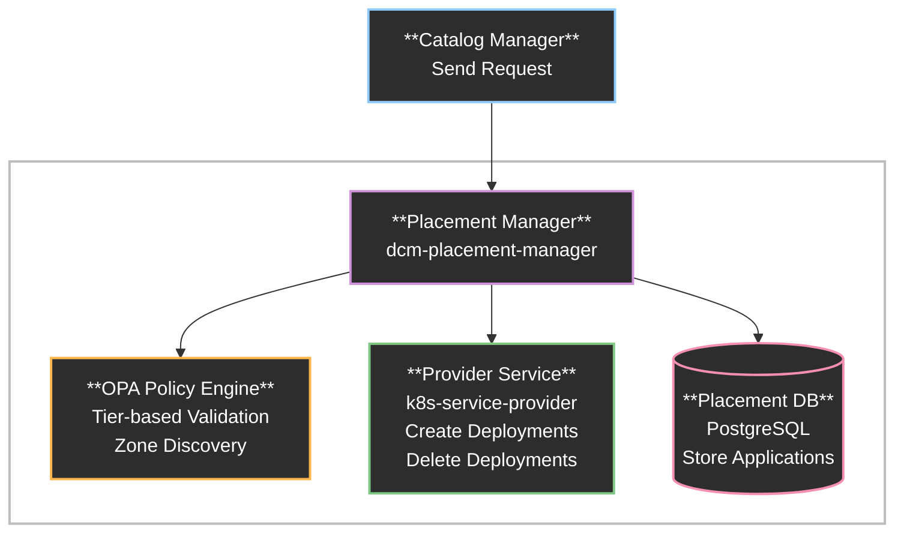
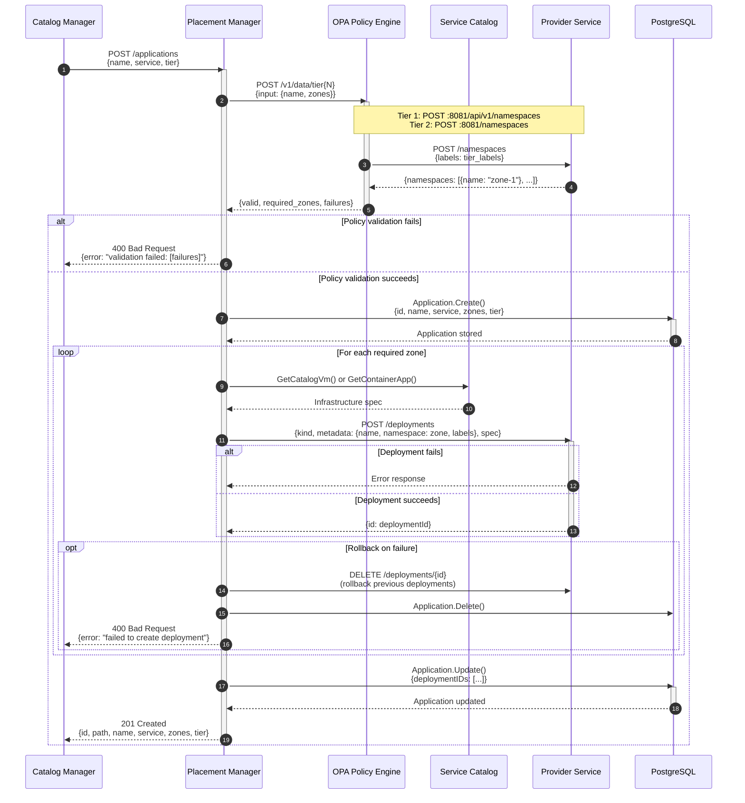

# Placement Manager

## Summary

The Placement Manager (dcm-placement-manager) orchestrates resource requests within DCM
core. It receives user requests through a REST API, validates and
enriches them through Policy Engine, and delegates deployment creation
to the Provider Service (k8s-service-provider). The Placement Manager focuses on
request orchestration by the Policy Engine, and deployment coordination by zones.

## Motivation

### Goals

- Define end-to-end flow for creating application deployments
- Define _Create_, _List_, _Delete_ endpoints for the Placement Manager
- Define how the Placement Mananger interacts with other services within DCM core
  (Catalog Manager, Policy Engine, Service Provider)
- Define orchestration responsibilities including tier-based policy routing,
  and multi-zone deployment

### Non-Goals

- Define Update endpoint, as this is out of scope for the first version (v1alpha1).

## Proposal

### System Architecture

The Placement Manager acts as the central orchestration service within DCM core,
coordinating between user requests (from the Catalog Manangement),  policy validation, and catalog instance creation.
The following diagram illustrates the system architecture and
component interactions.


```mermaid
%%{init: {'flowchart': {'rankSpacing': 100, 'nodeSpacing': 10, 'curve': 'linear'},}}%%
flowchart TD
    classDef placementManager fill:#2d2d2d,color:#ffffff,stroke:#ce93d8,stroke-width:2px
    classDef opaEngine fill:#2d2d2d,color:#ffffff,stroke:#ffb74d,stroke-width:2px
    classDef providerService fill:#2d2d2d,color:#ffffff,stroke:#81c784,stroke-width:2px
    classDef database fill:#2d2d2d,color:#ffffff,stroke:#f48fb1,stroke-width:2px
    classDef dcmCore fill:#FFFFFF,stroke:#bdbdbd,stroke-width:2px
    classDef client fill:#2d2d2d,color:#ffffff,stroke:#90caf9,stroke-width:2px

    CLIENT["**Catalog Manager**<br/>Send Request"]:::client

    subgraph DCM_Core [ ]
        PA["**Placement Manager**<br/>dcm-placement-manager<br/>"]:::placementManager

        OPA["**OPA Policy Engine**<br/>Tier-based Validation<br/>Zone Discovery<br/>"]:::opaEngine

        PS["**Provider Service**<br/>k8s-service-provider<br/>Create Deployments<br/>Delete Deployments"]:::providerService

        PA_DB[("**Placement DB**<br/>PostgreSQL<br/>Store Applications")]:::database
    end

    CLIENT --> PA
    PA --> OPA
    PA --> PA_DB
    PA --> PS

    class DCM_Core dcmCore
```

### Integration Points

#### Catalog Service

- Sends application creation, listing, and deletion requests directly via REST
- Receives responses and error messages

#### Policy Engine

- Standard Open Policy Agent instance running the stock
  `openpolicyagent/opa:latest-static` image
- Placement Manager sends validation requests via `POST {DCM_OPA_SERVER}/v1/data/tier{N}`
  (OPA's native Data API)
- Tier number (1, 2, etc.) is derived from the application's `tier` field,
  routing to different Rego policy packages (`tier1`, `tier2`)
- OPA evaluates policies and returns `{valid, required_zones, failures}`
- OPA policies perform runtime HTTP callouts to the Provider Service to discover
  available zones/namespaces by label, making OPA an active participant in
  placement decisions
- Each tier has its own zone resolution strategy with production/backup label
  fallback

#### Provider Service (k8s-service-provider)

- Delegates deployment creation and deletion via REST API
- Creates one deployment per zone via `POST {PROVIDER_SERVICE_URL}/deployments`
- Deletes deployments via `DELETE {PROVIDER_SERVICE_URL}/deployments/{id}`
- Supports two deployment kinds: `vm` and `container`
- Each deployment includes metadata with name, namespace (zone), and labels
  (app-id)
- Infrastructure specifications come from an internal hardcoded catalog, not
  from user input

#### Database (PostgreSQL)

- Stores application records after successful policy validation
- Maintains the application model: ID, name, service type, zones, tier,
  and deployment IDs
- Supports PostgreSQL (production) and SQLite (development) via GORM ORM

### API Endpoints

The REST endpoints are consumed by the Catalog Manager to create and manage resources.

#### Endpoints Overview

| Method | Endpoint              | Description                      |
|--------|-----------------------|----------------------------------|
| POST   | /applications         | Create an application            |
| GET    | /applications         | List all applications            |
| DELETE | /applications/{id}    | Delete an application            |
| GET    | /health               | Placement Manager health check   |

*The API follows [AEP](https://aep.dev/) conventions, including canonical `path`
fields on resources (e.g., `applications/{id}`). OpenAPI request validation
middleware automatically validates all incoming requests against the spec.
Swagger UI is available at `/swagger/index.html`.*

**POST /applications - Create an application.**

The POST endpoint creates an application. The service type determines the
deployment kind (VM or container), and the tier determines which Open Policy Agent
is evaluated.

Snippet of the request body schema:

```yaml
requestBody:
  required: true
  content:
    application/json:
      schema:
        type: object
        required:
          - name
          - service
        properties:
          name:
            type: string
            description: Name of the application
            example: "app-server-01"
          service:
            type: string
            description: Service type of the application
            enum:
              - "webserver"
              - "container"
          zones:
            type: array
            items:
              type: string
            description: Optional zones for the application (validated against policy)
            example: ["us-west-1", "us-west-2"]
          tier:
            type: integer
            description: Policy tier (routes to different OPA policy packages)
            default: 2
```

Example for a request payload:

```json
{
  "name": "my-app",
  "service": "webserver",
  "tier": 1
}
```

Response payload: Returns `201 Created` if successful.

```json
{
  "id": "08aa81d1-a0d2-4d5f-a4df-b80addf07781",
  "path": "applications/08aa81d1-a0d2-4d5f-a4df-b80addf07781",
  "name": "my-app",
  "service": "webserver",
  "zones": ["us-east-1", "us-east-2"],
  "tier": 1
}

***Note**: This is **only** an example of the payload.*

**GET /applications**
List all applications with pagination following AEP standards.

Query parameters:
- `max_page_size` (integer, 1-100, default 100): Maximum items per page
- `page_token` (string): Token for retrieving the next page

Example response payload:

```json
{
  "applications": [
    {
      "id": "08aa81d1-a0d2-4d5f-a4df-b80addf07781",
      "path": "applications/08aa81d1-a0d2-4d5f-a4df-b80addf07781",
      "name": "my-app",
      "service": "webserver",
      "zones": ["us-east-1", "us-east-2"],
      "tier": 1
    },
    {
      "id": "696511df-1fcb-4f66-8ad5-aeb828f383a0",
      "path": "applications/696511df-1fcb-4f66-8ad5-aeb828f383a0",
      "name": "nginx-app",
      "service": "container",
      "zones": ["us-west-1"],
      "tier": 2
    }
  ],
  "next_page_token": "eyJpZCI6IjEyM2U0NTY3LWU4OWItMTJkMy1hNDU2LTQyNjYxNDE3NDAwMCJ9"
}
```

**DELETE /applications/{id}**
Delete an application and all its associated provider deployments.
Returns `204 No Content` on success. Deployment deletions continue even if
individual deletions fail (best-effort cascade).

**GET /health**
Retrieve the health status of the Placement Manager.

```json
{
  "status": "healthy",
  "path": "health"
}
```

**Error Response Format**

All error responses use the following schema:

```json
{
  "type": "https://example.com/errors/bad-request",
  "error": "Invalid request parameters - Validation Failed",
  "code": 400
}
```

## Design Details

### Service Creation Flow

The following sequence diagram illustrates the complete flow for creating a
resources via the `POST /api/v1/resources` endpoint.


```mermaid
sequenceDiagram
    autonumber
    participant C as Catalog Manager
    participant PA as Placement Manager
    participant OPA as OPA Policy Engine
    participant CAT as Service Catalog
    participant PS as Provider Service
    participant DB as PostgreSQL

    C->>PA: POST /applications<br/>{name, service, tier}
    activate PA

    PA->>OPA: POST /v1/data/tier{N}<br/>{input: {name, zones}}
    activate OPA

    Note over OPA,PS: Tier 1: POST :8081/api/v1/namespaces<br/>Tier 2: POST :8081/namespaces
    OPA->>PS: POST /namespaces<br/>{labels: tier_labels}
    PS-->>OPA: {namespaces: [{name: "zone-1"}, ...]}

    OPA-->>PA: {valid, required_zones, failures}
    deactivate OPA

    alt Policy validation fails
        PA-->>C: 400 Bad Request<br/>{error: "validation failed: [failures]"}
    else Policy validation succeeds

        PA->>DB: Application.Create()<br/>{id, name, service, zones, tier}
        activate DB
        DB-->>PA: Application stored
        deactivate DB

        loop For each required zone
            PA->>CAT: GetCatalogVm() or GetContainerApp()
            CAT-->>PA: Infrastructure spec

            PA->>PS: POST /deployments<br/>{kind, metadata: {name, namespace: zone, labels}, spec}
            activate PS

            alt Deployment fails
                PS-->>PA: Error response
            else Deployment succeeds
                PS-->>PA: {id: deploymentId}
            end
            deactivate PS

            opt Rollback on failure
                PA->>PS: DELETE /deployments/{id}<br/>(rollback previous deployments)
                PA->>DB: Application.Delete()
                PA-->>C: 400 Bad Request<br/>{error: "failed to create deployment"}
            end
        end

        PA->>DB: Application.Update()<br/>{deploymentIDs: [...]}
        activate DB
        DB-->>PA: Application updated
        deactivate DB

        PA-->>C: 201 Created<br/>{id, path, name, service, zones, tier}
    end
    deactivate PA
```

#### Flow Description

1. **Request Reception**

- Catalog Manager sends sends a POST request to the Placement Manager with `name` (required),
  `service` (required, enum: `webserver`|`container`), `tier` (optional,
  default 2), and `zones` (optional)

2. **Policy Validation**

- Placement Manager constructs an Open Policy Agent input payload: `{input: {name, zones}}`
- The tier field determines the Policy Engine endpoint:
  `POST {DCM_OPA_SERVER}/v1/data/tier{N}` (e.g., `/v1/data/tier1`)
- Each tier has its own Rego policy package (`tier1.rego`, `tier2.rego`) with
  distinct zone resolution strategies
- OPA policies perform HTTP callouts to the Provider Service to discover
  available namespaces by label (production labels first, fallback to backup
  labels)
- Policy Engine returns:
  - `valid` (boolean): Whether the request passes validation
  - `required_zones` (string[]): Zones where deployments should be created
  - `failures` (string[]): Failure messages if validation fails
- If policy validation fails:
  - Placement Manager returns error response with failure details to the client
  - No database records are created

3. **Application Persistence**

- Only after successful Policy Engine validation, the Placement Manager creates an application
  record in PostgreSQL with: ID, name, service, zones (from Open Policy Agent), tier, and
  empty deployment IDs
- There is no separate "intent" storage step; the application record is the
  single source of truth

4. **Multi-Zone Deployment**

- Placement Manager iterates over each zone from `required_zones`
- For each zone, it resolves the infrastructure spec from the internal catalog:
  - `webserver` -> VM spec (1 CPU, 1 GB RAM, Fedora)
  - `container` -> Container spec (nginx:latest, port 80, 2 replicas)
- Sends `POST {PROVIDER_SERVICE_URL}/deployments` with:
  - `kind`: `"vm"` or `"container"`
  - `metadata`: `{name, namespace: <zone>, labels: {"app-id": <appID>}}`
  - `spec`: VMSpec or ContainerSpec from catalog
- Each zone maps to a Kubernetes namespace in the provider
- Collects all deployment IDs

5. **Rollback on Failure**

- If any deployment fails mid-loop:
  - All previously created deployments are deleted from the provider
  - The application record is deleted from the database
  - Error response is returned to the client
- If the final database update (saving deployment IDs) fails:
  - All deployments are deleted from the provider
  - Error response is returned

6. **Success Response**

- Application record is updated with all deployment IDs
- Returns `201 Created` synchronously with the application response
- The entire create-validate-deploy flow is synchronous

### Application Deletion Flow

1. Retrieve the application from the database by ID
2. Iterate over all deployment IDs and delete each from the provider service
   - Failures are logged as warnings but do not stop the process (best-effort)
3. Delete the application record from the database
4. Return `204 No Content` with the deleted application details

#### Key Characteristics

- **Policy-Driven Zone Placement**: Policy Engine determines which zones require
  deployments based on tier-specific policies with dynamic namespace discovery
- **Multi-Zone Deployments**: One deployment per zone, each mapped to a
  Kubernetes namespace
- **Synchronous Processing**: All operations complete before returning `201
  Created` to the client
- **AEP Conventions**: API follows AEP standards with canonical `path` fields
  and paginated list responses

### Data Model

The Placement Manager uses a single `Application` model persisted via GORM:

| Field         | Type             | Description                          |
|---------------|------------------|--------------------------------------|
| ID            | UUID             | Primary key                          |
| Name          | string           | Application name (required)          |
| Service       | string           | Service type: "webserver"/"container" |
| Zones         | text[]           | Zones where deployments exist        |
| Tier          | int              | Policy tier (1, 2, etc.)             |
| DeploymentIDs | text[]           | Provider deployment IDs              |
| CreatedAt     | timestamp        | Record creation time (GORM managed)  |
| UpdatedAt     | timestamp        | Last update time (GORM managed)      |
| DeletedAt     | timestamp (null) | Soft delete time (GORM managed)      |

### Deployment Topology

The system runs as four containers orchestrated via Podman Compose:

| Service              | Container Name            | Image                                           | Port |
|----------------------|---------------------------|-------------------------------------------------|------|
| Placement Manager        | placement-manager             | quay.io/dcm-project/dcm-placement-manager:latest| 8080 |
| PostgreSQL 15        | placement-db              | quay.io/sclorg/postgresql-15-c9s:latest         | 5432 |
| OPA Policy Engine    | placement-policy-engine   | docker.io/openpolicyagent/opa:latest-static     | 8181 |
| Provider Service     | k8s-service-provider      | quay.io/dcm-project/k8s-service-provider:latest | ---- |

All containers share a `placement-network` bridge network.