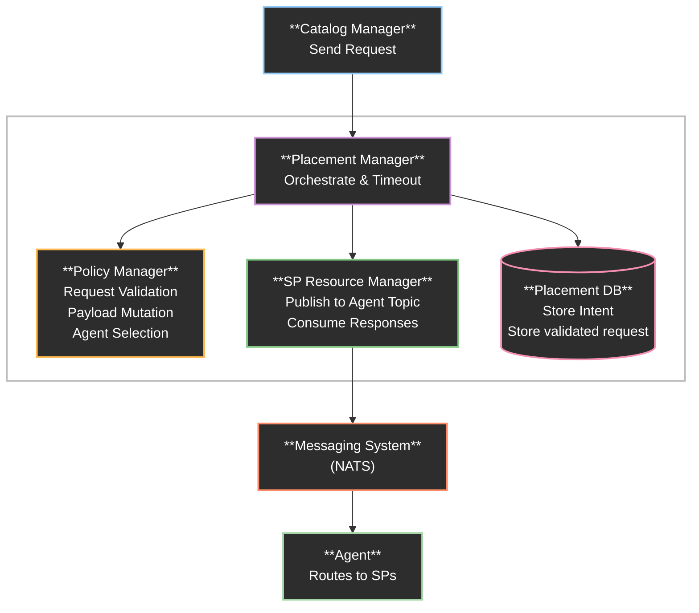
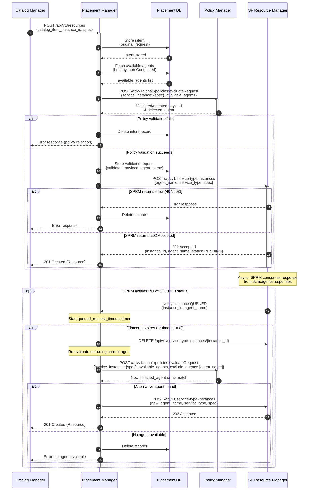
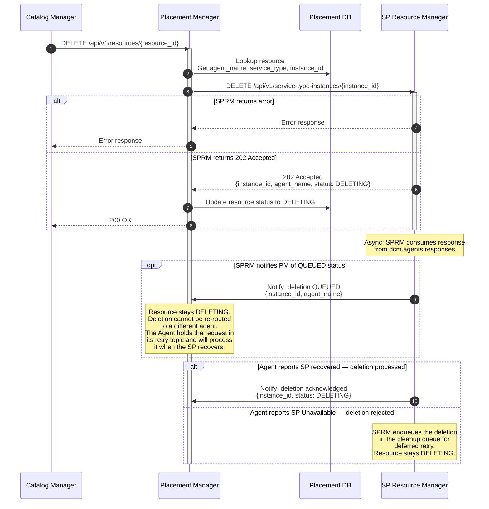

# Placement Manager

## Summary

The Placement Manager orchestrates resource requests within DCM core. It
receives user requests through the Catalog Manager, validates and enriches them
through the Policy Manager (which now selects an Agent), and delegates instance
creation and deletion to the SP Resource Manager, which routes through the
Messaging System to an Agent. The Placement Manager also handles timeout logic
for both queued requests (Agent reports SP is unhealthy) and pending requests
(Agent never acknowledged the creation CloudEvent after retries).

## Motivation

### Goals

- Define end-to-end flow for creating resources
- Define end-to-end flow for deleting resources (deletion flow)
- Define _Create_, _Read_, _Delete_ endpoints for Placement Manager
- Define how Placement Manager interacts with other services within DCM core
  (Catalog Manager, Policy Manager, SP Resource Manager)
- Define orchestration responsibilities for Placement Manager
- Define queued-request timeout logic for agent-based routing

### Non-Goals

- Define Update endpoint, as this is out of scope for the first version (v1).

## Proposal

### System Architecture

The Placement Manager acts as the central orchestration service within DCM core,
coordinating between user requests (from Catalog), policy validation, and
instance lifecycle management. The Policy Manager selects an Agent, and the SP
Resource Manager publishes requests to the Agent's messaging topic. The Agent
internally routes to its Service Providers.

The following diagram illustrates the system architecture and component
interactions.


```mermaid
%%{init: {'flowchart': {'rankSpacing': 100, 'nodeSpacing': 10, 'curve': 'linear'},}}%%
flowchart TD
    classDef catalogManager fill:#2d2d2d,color:#ffffff,stroke:#90caf9,stroke-width:2px
    classDef placementManager fill:#2d2d2d,color:#ffffff,stroke:#ce93d8,stroke-width:2px
    classDef policyEngine fill:#2d2d2d,color:#ffffff,stroke:#ffb74d,stroke-width:2px
    classDef spResourceManager fill:#2d2d2d,color:#ffffff,stroke:#81c784,stroke-width:2px
    classDef database fill:#2d2d2d,color:#ffffff,stroke:#f48fb1,stroke-width:2px
    classDef messaging fill:#2d2d2d,color:#ffffff,stroke:#ff8a65,stroke-width:2px
    classDef agent fill:#2d2d2d,color:#ffffff,stroke:#a5d6a7,stroke-width:2px
    classDef dcmCore fill:#FFFFFF,stroke:#bdbdbd,stroke-width:2px

    CM["**Catalog Manager**<br/>Send Request"]:::catalogManager

    subgraph DCM_Core [ ]
        PM["**Placement Manager**<br/>Orchestrate & Timeout"]:::placementManager
        PE["**Policy Manager**<br/>Request Validation<br/>Payload Mutation<br/>Agent Selection"]:::policyEngine
        SPRM["**SP Resource Manager**<br/>Publish to Agent Topic<br/>Consume Responses"]:::spResourceManager
        PM_DB[("**Placement DB**<br/>Store Intent<br/>Store validated request")]:::database
    end

    MS["**Messaging System**<br/>(NATS)"]:::messaging
    AG["**Agent**<br/>Routes to SPs"]:::agent

    CM --> PM
    PM --> PE
    PM --> PM_DB
    PM --> SPRM
    SPRM --> MS
    MS --> AG

    class DCM_Core dcmCore
```

### Integration Points

#### Catalog Service

- Receives resource creation and deletion requests from users
- Provides REST API endpoints for _create_, _read_, _delete_ operations on
  catalog instances
- Returns responses and error messages to users

#### Policy Manager

- Sends requests for validation via
  `POST /api/v1alpha1/policies:evaluateRequest`
- Provides `available_agents` metadata as input in the evaluation request
  payload
- Optionally includes `exclude_agents` to exclude agents from consideration
  (e.g., after a queued-request timeout)
- Receives validated/mutated payload and selected Agent (`agent_name`)
- Receives policy rejections and constraint violations responses and forwards to
  the users

#### SP Resource Manager

- Delegates instance creation, read, and delete operations to SP Resource
  Manager
- Forwards `agent_name`, `service_type`, and `spec` in requests
- SPRM publishes to the agent's messaging topic
- Receives responses and forwards to the users
- Reports back: success (202), error, or queued status
- When SPRM reports "queued" status, PM handles timeout logic (see
  [Queued-Request Handling](#queued-request-handling))

#### Database

- Stores the intent (original request) of the user request
- Stores validated request (including `agent_name`) and enables rehydration
  process
- Maintains record of all resources created through Placement Manager

### API Endpoints

The CRUD endpoints are consumed by the Catalog Manager to create and manage
resources.

#### Endpoints Overview

| Method | Endpoint                        | Description                    |
| ------ | ------------------------------- | ------------------------------ |
| POST   | /api/v1/resources               | Create a resource              |
| GET    | /api/v1/resources               | List all resources             |
| GET    | /api/v1/resources/{resource_id} | Get a resource                 |
| DELETE | /api/v1/resources/{resource_id} | Delete a resource              |
| GET    | /api/v1/health                  | Placement Manager health check |

**POST /api/v1/resources - Create a resource.**

The POST endpoint creates a resource that is supported by DCM. The resource
request is an instance of a catalog item and originates from the user (UI)
through the Catalog Manager.

Snippet of the request body

```yaml
requestBody:
  required: true
  content:
    application/json:
      schema:
        type: object
        required:
          - catalog_item_instance_id
          - spec
        properties:
          catalog_item_instance_id:
            type: string
            description: The ID of the catalog item instance
            example: "4baa35eb-e70d-4d37-867d-0f4efa21d05c"
          spec:
            type: object
            description: |
              Service specification following one of the supported service type
              schemas (VMSpec, ContainerSpec, DatabaseSpec, or ClusterSpec).
              The `service_type` field within the spec determines which Agent
              and Service Provider can fulfill the request.
            additionalProperties: true
```

Example of payload for incoming VM catalog instance request

```json
{
  "catalog_item_instance_id": "4baa35eb-e70d-4d37-867d-0f4efa21d05c",
  "spec": {
    "service_type": "vm",
    "vcpu": { "count": 2 },
    "memory": { "size": "2GB" },
    "storage": { "disks": [{ "name": "boot", "capacity": "50GB" }] },
    "guest_os": { "type": "fedora-39" },
    "access": {
      "ssh_public_key": "ssh-ed25519 AAAAC3NzaC1lZDI1NTE5AAAAIExample..."
    },
    "metadata": { "name": "fedora-vm" }
  }
}
```

Response payload: Returns 201 Created if successful.

```json
{
  "id": "08aa81d1-a0d2-4d5f-a4df-b80addf07781",
  "path": "resources/08aa81d1-a0d2-4d5f-a4df-b80addf07781",
  "catalog_item_instance_id": "4baa35eb-e70d-4d37-867d-0f4efa21d05c",
  "agent_name": "prod-eu-agent",
  "spec": {
    "service_type": "vm",
    "vcpu": { "count": 2 },
    "memory": { "size": "2GB" },
    "storage": { "disks": [{ "name": "boot", "capacity": "50GB" }] },
    "guest_os": { "type": "fedora-39" },
    "metadata": { "name": "fedora-vm" }
  },
  "approval_status": "pending",
  "create_time": "2026-05-03T12:00:00Z",
  "update_time": "2026-05-03T12:00:00Z"
}
```

**Note**: This is **only** an example of the payload.

**GET /api/v1/resources** List all resources according to AEP standards.

Example of Response Payload

```json
{
  "resources": [
    {
      "id": "696511df-1fcb-4f66-8ad5-aeb828f383a0",
      "path": "resources/696511df-1fcb-4f66-8ad5-aeb828f383a0",
      "catalog_item_instance_id": "52540146-6212-4514-b534-0c3127b2836f",
      "agent_name": "prod-us-agent",
      "spec": {
        "service_type": "container",
        "image": { "reference": "docker.io/nginx:latest" },
        "resources": {
          "cpu": { "min": 1, "max": 2 },
          "memory": { "min": "512MB", "max": "1GB" }
        },
        "metadata": { "name": "nginx-container" }
      },
      "approval_status": "approved",
      "create_time": "2026-05-03T12:00:00Z",
      "update_time": "2026-05-03T12:30:00Z"
    },
    {
      "id": "c66be104-eea3-4246-975c-e6cc9b32d74d",
      "path": "resources/c66be104-eea3-4246-975c-e6cc9b32d74d",
      "catalog_item_instance_id": "4baa35eb-e70d-4d37-867d-0f4efa21d05c",
      "agent_name": "prod-eu-agent",
      "spec": {
        "service_type": "database",
        "engine": "postgresql",
        "version": "15",
        "resources": { "cpu": 2, "memory": "8GB", "storage": "100GB" },
        "metadata": { "name": "postgres-001" }
      },
      "approval_status": "approved",
      "create_time": "2026-05-03T12:00:00Z",
      "update_time": "2026-05-03T12:30:00Z"
    },
    {
      "id": "08aa81d1-a0d2-4d5f-a4df-b80addf07781",
      "path": "resources/08aa81d1-a0d2-4d5f-a4df-b80addf07781",
      "catalog_item_instance_id": "f3645f8f-82c1-4efb-888f-318c0ac81a08",
      "agent_name": "prod-eu-agent",
      "spec": {
        "service_type": "vm",
        "vcpu": { "count": 2 },
        "memory": { "size": "2GB" },
        "storage": { "disks": [{ "name": "boot", "capacity": "50GB" }] },
        "guest_os": { "type": "ubuntu-22.04" },
        "metadata": { "name": "ubuntu-vm" }
      },
      "approval_status": "approved",
      "create_time": "2026-05-03T12:00:00Z",
      "update_time": "2026-05-03T12:30:00Z"
    }
  ],
  "next_page_token": ""
}
```

**GET /api/v1/resources/{resource_id}** Get a resource based on id.

Example of Response Payload

```json
{
  "id": "08aa81d1-a0d2-4d5f-a4df-b80addf07781",
  "path": "resources/08aa81d1-a0d2-4d5f-a4df-b80addf07781",
  "catalog_item_instance_id": "d6ebf344-bfd1-44c9-bc25-97f9fb856f22",
  "agent_name": "prod-eu-agent",
  "spec": {
    "service_type": "vm",
    "vcpu": { "count": 4 },
    "memory": { "size": "2GB" },
    "storage": { "disks": [{ "name": "boot", "capacity": "50GB" }] },
    "guest_os": { "type": "ubuntu-22.04" },
    "metadata": { "name": "ubuntu-vm" }
  },
  "approval_status": "approved",
  "create_time": "2026-05-03T12:00:00Z",
  "update_time": "2026-05-03T12:30:00Z"
}
```

**DELETE /api/v1/resources/{resource_id}** Delete a resource based on id.

**GET /api/v1/health** Retrieve the health status of Placement Manager.

Example of Response Payload

```json
{
  "status": "healthy",
  "path": "health"
}
```

## Design Details

### Service Creation Flow

The following sequence diagram illustrates the complete flow for creating a
resource via the `POST /api/v1/resources` endpoint.


```mermaid
sequenceDiagram
    autonumber
    participant CM as Catalog Manager
    participant PM as Placement Manager
    participant DB as Placement DB
    participant PE as Policy Manager
    participant SPRM as SP Resource Manager

    CM->>PM: POST /api/v1/resources<br/>{catalog_item_instance_id, spec}
    activate PM

    PM->>DB: Store intent<br/>{original_request}
    DB-->>PM: Intent stored

    PM->>DB: Fetch available agents<br/>(healthy, non-Congested)
    DB-->>PM: available_agents list

    PM->>PE: POST /api/v1alpha1/policies:evaluateRequest<br/>{service_instance: {spec}, available_agents}
    activate PE

    PE-->>PM: Validated/mutated payload<br/>& selected_agent
    deactivate PE

    alt Policy validation fails
        PM->>DB: Delete intent record
        PM-->>CM: Error response (policy rejection)
    else Policy validation succeeds

        PM->>DB: Store validated request<br/>{validated_payload, agent_name}

        PM->>SPRM: POST /api/v1/service-type-instances<br/>{agent_name, service_type, spec}
        activate SPRM

        alt SPRM returns error (404/503)
            SPRM-->>PM: Error response
            PM->>DB: Delete records
            PM-->>CM: Error response

        else SPRM returns 202 Accepted
            SPRM-->>PM: 202 Accepted<br/>{instance_id, agent_name, status: PENDING}
            PM-->>CM: 201 Created {Resource}
        end
        deactivate SPRM
    end

    Note over SPRM: Async: SPRM consumes response<br/>from dcm.agents.responses

    opt SPRM notifies PM of QUEUED status
        SPRM->>PM: Notify: instance QUEUED<br/>{instance_id, agent_name}
        Note over PM: Start queued_request_timeout timer

        alt Timeout expires (or timeout = 0)
            PM->>SPRM: DELETE /api/v1/service-type-instances/{instance_id}
            Note over PM: Re-evaluate excluding current agent

            PM->>PE: POST /api/v1alpha1/policies:evaluateRequest<br/>{service_instance: {spec}, available_agents, exclude_agents: [agent_name]}
            activate PE
            PE-->>PM: New selected_agent or no match
            deactivate PE

            alt Alternative agent found
                PM->>SPRM: POST /api/v1/service-type-instances<br/>{new_agent_name, service_type, spec}
                SPRM-->>PM: 202 Accepted
                PM-->>CM: 201 Created {Resource}
            else No agent available
                PM->>DB: Delete records
                PM-->>CM: Error: no agent available
            end
        end
    end
    deactivate PM
```

#### Flow Description

1. **Request Reception**

- Catalog Manager sends a POST request to Placement Manager with
  `catalog_item_instance_id` and `spec` (resource specification)
- Placement Manager receives and processes the request

2. **Record Intent**

- Placement Manager stores the original request (intent) in Placement DB
- This enables rehydration and tracking of the user's original request
- Intent is stored before any processing to ensure request persistence

3. **Fetch Available Agents**

- Placement Manager queries the Agent Registry for healthy, non-Congested agents
  that support the requested service type
- The resulting `available_agents` list is passed to the Policy Manager for
  evaluation

4. **Policy Validation**

- Placement Manager forwards the request to Policy Manager with
  `available_agents` and optional `exclude_agents`
- Policy Manager evaluates requests against policies
- Policy Manager returns:
  - Approved or rejected
  - Validated and potentially mutated payload
  - Selected Agent name (`selected_agent`)
  - Policy constraints and patches applied
- If policy validation fails (request rejected or constraint violation):
  - Delete intent record from Placement DB
  - Placement Manager returns error response to Catalog Manager
  - Request processing stops
- If policy validation succeeds:
  - Placement Manager stores the validated request in Placement DB which
    includes the validated/mutated payload and selected `agent_name`

5. **Store Validated Request**

- Placement Manager persists the validated/mutated payload along with the
  `agent_name` returned by the Policy Manager
- This enables rehydration and audit

6. **Instance Creation**

- Placement Manager delegates instance creation to SP Resource Manager
- Forwards `agent_name`, `service_type`, and `spec`
- SP Resource Manager publishes the request to the agent's messaging topic
- SPRM always responds synchronously with one of:
  - **SPRM returns error (404/503)**: Error response returned to Placement
    Manager. The record is deleted from Placement DB. Placement Manager forwards
    the error to Catalog Manager. Request processing stops.
  - **SPRM returns 202 Accepted**: Instance creation is in progress. Placement
    Manager returns 201 Created to Catalog Manager with a full `Resource`
    object. The resource is now in a `PENDING` state.

7. **Queued-Request Handling (Asynchronous)**

- After SPRM returns 202, it continues to consume responses from
  `dcm.agents.responses`. If the Agent reports a `dcm.agent.request-queued`
  CloudEvent (the SP for the requested service type is unhealthy), SPRM
  asynchronously notifies Placement Manager of the `QUEUED` status
- Upon receiving the QUEUED notification, Placement Manager starts a
  `queued_request_timeout` timer
- On timeout expiry (or immediately if `queued_request_timeout = 0`):
  - PM tells SPRM to DELETE the queued request
  - PM re-evaluates policies by calling the Policy Manager again, this time
    including `exclude_agents: [agent_name]` to exclude the timed-out agent
  - If an alternative agent is found: PM sends a new creation request to SPRM
    with the new agent
  - If no alternative agent is available: PM deletes records from Placement DB
    and returns an error to Catalog Manager

8. **Pending-Request Timeout (Asynchronous)**

- SPRM runs a periodic sweep of instance records in `PENDING` status. If a
  record has been `PENDING` longer than `pending_request_timeout` and the agent
  is Ready, SPRM re-publishes the creation CloudEvent and increments a retry
  counter. This handles the case where the agent consumed the message but
  crashed before responding (see
  [SP Resource Manager — Pending Request Timeout](../sp-resource-manager/sp-resource-manager.md#pending-request-timeout))
- When retries are exhausted (`pending_request_max_retries`) or the agent is
  Unavailable/Congested, SPRM notifies Placement Manager
- Upon receiving the pending-timeout notification, Placement Manager
  re-evaluates policies by calling the Policy Manager with
  `exclude_agents: [agent_name]` to exclude the original agent
- If an alternative agent is found:
  - PM updates the instance record in Placement DB with the new `agent_name`
    (the `resource_id` is preserved so the user's reference remains valid)
  - PM sends a new creation request to SPRM with the new agent
  - SPRM publishes a `dcm.request.cancel` CloudEvent to the old agent's cancel
    topic to prevent stale message processing (see
    [Environment Agent — Cancel Topic](../environment-agent/environment-agent.md#cancel-topic))
  - If the old agent later rejects the cancellation (resource already
    provisioning on its SP), SPRM sends a deletion request to the old agent. The
    re-evaluated agent is the authoritative owner of the `resource_id`
- If no alternative agent is available: PM deletes records from Placement DB and
  returns an error to Catalog Manager

### Service Deletion Flow

The following sequence diagram illustrates the complete flow for deleting a
resource via the `DELETE /api/v1/resources/{resource_id}` endpoint.


```mermaid
sequenceDiagram
    autonumber
    participant CM as Catalog Manager
    participant PM as Placement Manager
    participant DB as Placement DB
    participant SPRM as SP Resource Manager

    CM->>PM: DELETE /api/v1/resources/{resource_id}
    activate PM

    PM->>DB: Lookup resource<br/>Get agent_name, service_type, instance_id

    PM->>SPRM: DELETE /api/v1/service-type-instances/{instance_id}
    activate SPRM

    alt SPRM returns error
        SPRM-->>PM: Error response
        PM-->>CM: Error response
    else SPRM returns 202 Accepted
        SPRM-->>PM: 202 Accepted<br/>{instance_id, agent_name, status: DELETING}
        PM->>DB: Update resource status to DELETING
        PM-->>CM: 200 OK
    end
    deactivate SPRM

    Note over SPRM: Async: SPRM consumes response<br/>from dcm.agents.responses

    opt SPRM notifies PM of QUEUED status
        SPRM->>PM: Notify: deletion QUEUED<br/>{instance_id, agent_name}
        Note over PM: Resource stays DELETING.<br/>Deletion cannot be re-routed<br/>to a different agent.<br/>The Agent holds the request in<br/>its retry topic and will process<br/>it when the SP recovers.
    end

    alt Agent reports SP recovered — deletion processed
        SPRM->>PM: Notify: deletion acknowledged<br/>{instance_id, status: DELETING}
    else Agent reports SP Unavailable — deletion rejected
        Note over SPRM: SPRM enqueues the deletion<br/>in the cleanup queue for<br/>deferred retry.<br/>Resource stays DELETING.
    end
    deactivate PM
```

#### Flow Description

1. **Request Reception**

- Catalog Manager sends a DELETE request to Placement Manager with the
  `resource_id`

2. **Resource Lookup**

- Placement Manager queries Placement DB to retrieve the resource record,
  including the `agent_name`, `service_type`, and `instance_id` needed for
  deletion

3. **Delegation to SP Resource Manager**

- Placement Manager sends a DELETE request to SPRM with the `instance_id`
- SPRM publishes a deletion CloudEvent to the agent's messaging topic
- SPRM always responds synchronously with one of:
  - **SPRM returns error**: Error response returned to Placement Manager, which
    forwards it to Catalog Manager
  - **SPRM returns 202 Accepted**: Deletion is in progress. PM updates the
    resource status to `DELETING` in Placement DB and returns 200 OK to Catalog
    Manager
- **SPRM notifies QUEUED (asynchronous)**: After returning 202, SPRM may
  asynchronously notify PM of a `QUEUED` status if the Agent reports the SP for
  the service type is unhealthy. Unlike creation, deletion cannot be re-routed
  to a different agent because the resource exists on the original agent's SP.
  The resource status at the PM level remains `DELETING` — the QUEUED state is
  an SPRM-level concern, not a PM resource status change. PM relies on the
  Agent's retry topic to resolve the deletion automatically: when the SP
  recovers, the Agent processes the held deletion request and reports success.
  If the SP transitions to Unavailable, the Agent rejects the held request with
  an error CloudEvent. SPRM then enqueues the deletion in its cleanup queue for
  deferred retry rather than marking the resource as failed (see
  [Rehydration Flow — Cleanup Mechanism](../rehydration-flow/rehydration-flow.md#cleanup-mechanism)).
  The cleanup scheduler retries the deletion once the Agent re-advertises the
  service type. If the retry fails (e.g., the service type is now served by a
  different SP that has no knowledge of the resource), the resource is
  considered deleted. If the Agent itself is no longer registered, the resource
  is also considered deleted since the underlying environment is presumed
  decommissioned. PM does not apply `queued_request_timeout` for deletions
  because the Agent retry topic and SPRM cleanup queue provide automatic
  resolution.

### Configuration

| Parameter                     | Type     | Default | Description                                                                                                                                                                                                                                                                                                                                                                                                                  |
| ----------------------------- | -------- | ------- | ---------------------------------------------------------------------------------------------------------------------------------------------------------------------------------------------------------------------------------------------------------------------------------------------------------------------------------------------------------------------------------------------------------------------------- |
| `queued_request_timeout`      | Duration | `300s`  | Maximum time PM waits when SPRM reports a "queued" status for **creation** requests. On expiry, PM cancels the request and re-evaluates policies excluding the current agent. When set to `0`, PM immediately re-evaluates without waiting. This timeout does **not** apply to deletion requests — deletions rely on the Agent's retry topic for automatic resolution (see [Service Deletion Flow](#service-deletion-flow)). |
| `pending_request_timeout`     | Duration | `60s`   | How long SPRM waits before acting on a `PENDING` instance record that has not received an agent response. Each retry resets the window. Configured at the SPRM level; included here for visibility since PM handles the escalation path.                                                                                                                                                                                     |
| `pending_request_max_retries` | integer  | `3`     | Maximum number of times SPRM re-publishes the creation CloudEvent before escalating to PM. When set to `0`, SPRM escalates immediately on the first timeout. Configured at the SPRM level.                                                                                                                                                                                                                                   |

### Key Characteristics/Notes

- **Intent Preservation**: Original user request is stored before processing for
  audit and rehydration purposes
- **Policy-Driven**: Agent selection and request validation are handled by
  Policy Manager
- **Agent-Based Selection**: Service Provider selection is no longer a direct
  concern of the Placement Manager. The Policy Engine selects an Agent based on
  environment, service types, and cost. The Agent internally selects the SP.
- **Queued-Request Handling**: When SPRM reports a "queued" status (the SP for
  the requested service type on the agent is unhealthy), PM differentiates by
  request type. For creation requests, PM applies `queued_request_timeout`: on
  expiry, PM cancels the request and re-evaluates policies excluding the
  timed-out agent. For deletion requests, PM does not apply a timeout — instead,
  it relies on the Agent's retry topic to resolve the deletion automatically
  when the SP recovers or reject it if the SP becomes Unavailable.
- **Pending-Request Handling**: When SPRM reports that a `PENDING` request has
  exhausted its retries (the agent never acknowledged the creation CloudEvent),
  PM re-evaluates policies excluding the original agent. If an alternative agent
  is found, PM updates the instance record (preserving the `resource_id`) and
  sends a new creation request. SPRM publishes a cancel CloudEvent to the old
  agent's cancel topic to prevent stale message processing.
- **Error Handling**: Clear error paths for policy rejections, instance creation
  failures, and queued-request timeouts
- **State Management**: Both original intent and validated request are stored
  for complete request lifecycle tracking and rehydration purposes

### Future Improvements

- Per-agent timeout overrides (allow different `queued_request_timeout` values
  per agent)
- Retry limits on re-evaluation (cap the number of times PM re-evaluates after
  excluding agents)
- PM-level request priority/ordering (prioritize certain requests over others
  when re-evaluating)
