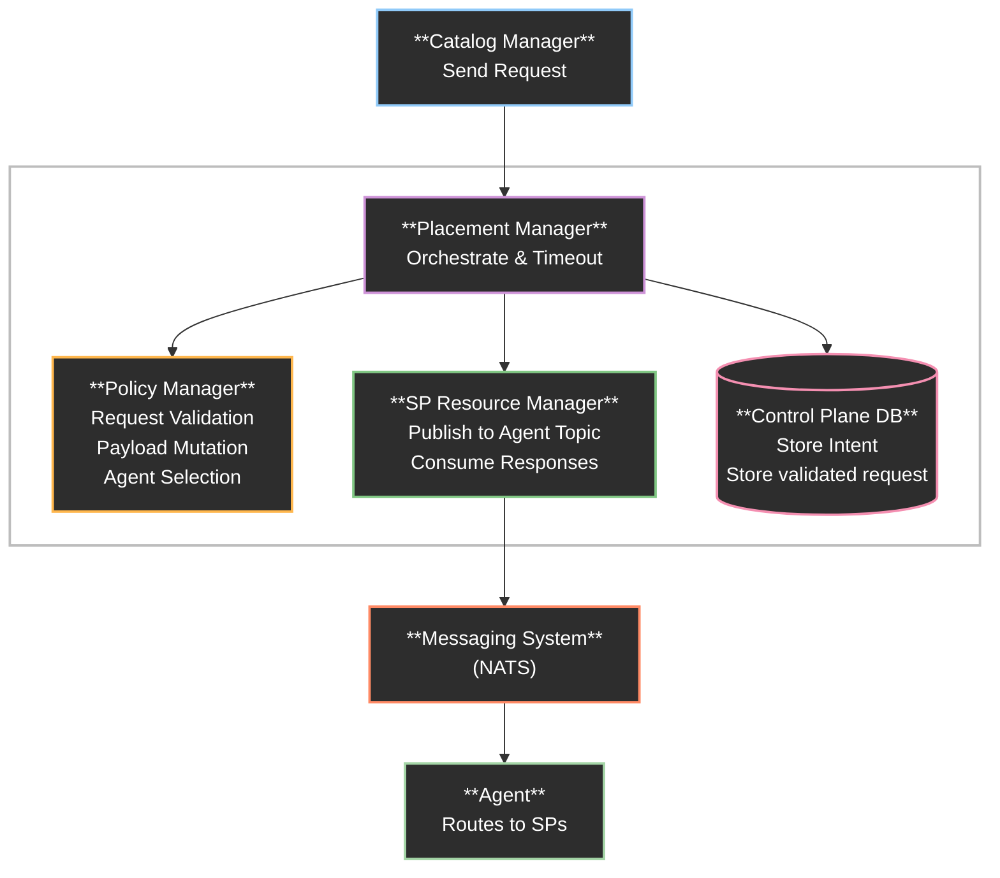
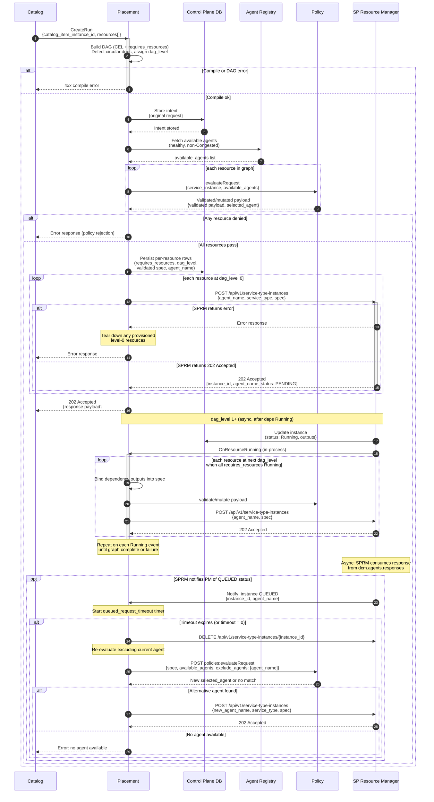
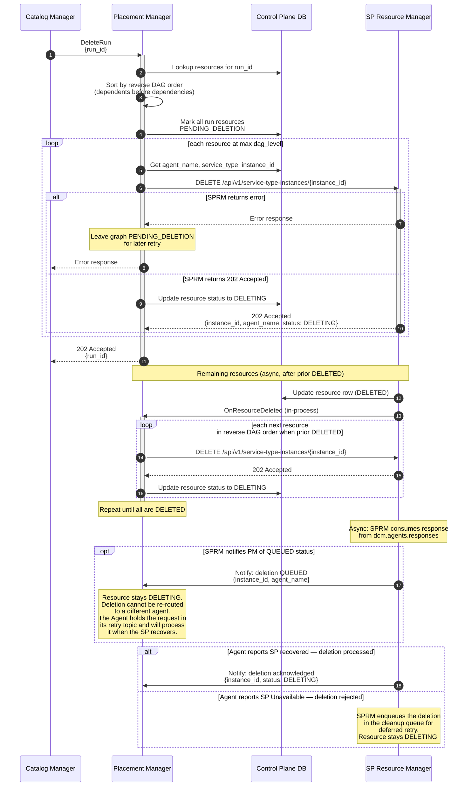

# Placement Manager

## Terminology

- **Circular dependency**: A dependency loop among resources (A depends on B and
  B depends on A, directly or through other nodes). Circular dependencies cannot
  be topologically sorted or assigned `dag_level` values, so Placement rejects
  them during DAG compile time and fails the request.

- **DAG (Directed Acyclic Graph)**: The dependency graph Placement compiles from
  a resolved `resources[]` payload. Placement combines CEL `${resource.field}`
  references in each spec with explicit `requires_resources` to form edges. If
  those edges form a circular dependency, Placement fails and returns an error;
  otherwise it assigns each node a `dag_level` via topological sort. The graph
  orders provisioning and deletion.

- **Run**: A single request from Catalog to Placement. When Placement receives a
  `run` request, it orchestrates all resources in the request graph until
  terminal success or failure. A `run` has two parts, synchronous and
  asynchronous. The synchronous part happens during initialization: store
  intent, compile the DAG, evaluate policy per resource, persist validated
  resources, start provisioning for `dag_level 0`, and return `202 Accepted`.
  Later levels continue asynchronously when dependencies are `Running`. A `run`
  may contain a single resource or many related resources.

- **Run id (`run_id`)**: Unique identifier Placement assigns when it initializes
  a `run`.

## Summary

The Placement Manager orchestrates resource requests within DCM control-plane
(CP). It receives resolved application graphs from the Catalog Manager. It
builds the dependency DAG, validates and enriches each resource through the
Policy (which now selects an Agent). Then it delegates resource creation and
deletion, in DAG order, to the SP Resource Manager, which routes through the
Messaging System to an environment agent. The Placement Manager also handles
timeout logic for both queued requests (Agent reports SP is unhealthy) and
pending requests (Agent never acknowledged the creation CloudEvent after
retries).

## Motivation

### Goals

- Define end-to-end flow for creating resources
- Define end-to-end flow for deleting resources (deletion flow)
- Define how Placement Manager interacts with other domains within DCM
  control-plane (CP)
- Define orchestration responsibilities such as DAG compilation, per-resource
  policy validation and DAG order provisioning driven by dependency readiness
- Define queued-request timeout logic for agent-based routing

### Non-Goals

- Define Update operation, as this is out of scope for the first version (v1).
- Graph-wide policy evaluation within a single request over the full DAG
  snapshot.

## Proposal

### System Architecture

The Placement Manager acts as the central orchestration service within DCM core,
coordinating between user requests (from Catalog), policy validation, and
instance lifecycle management. The Policy Manager selects an Agent, and the SP
Resource Manager publishes requests to the Agent's messaging topic. The Agent
internally routes to its Service Providers.

The following diagram illustrates the system architecture and component
interactions.


```mermaid
%%{init: {'flowchart': {'rankSpacing': 100, 'nodeSpacing': 10, 'curve': 'linear'},}}%%
flowchart TD
    classDef catalogManager fill:#2d2d2d,color:#ffffff,stroke:#90caf9,stroke-width:2px
    classDef placementManager fill:#2d2d2d,color:#ffffff,stroke:#ce93d8,stroke-width:2px
    classDef policyEngine fill:#2d2d2d,color:#ffffff,stroke:#ffb74d,stroke-width:2px
    classDef spResourceManager fill:#2d2d2d,color:#ffffff,stroke:#81c784,stroke-width:2px
    classDef database fill:#2d2d2d,color:#ffffff,stroke:#f48fb1,stroke-width:2px
    classDef messaging fill:#2d2d2d,color:#ffffff,stroke:#ff8a65,stroke-width:2px
    classDef agent fill:#2d2d2d,color:#ffffff,stroke:#a5d6a7,stroke-width:2px
    classDef dcmCore fill:#FFFFFF,stroke:#bdbdbd,stroke-width:2px

    CM["**Catalog Manager**<br/>Send Request"]:::catalogManager

    subgraph DCM_Core [ ]
        PM["**Placement Manager**<br/>Orchestrate & Timeout"]:::placementManager
        PE["**Policy Manager**<br/>Request Validation<br/>Payload Mutation<br/>Agent Selection"]:::policyEngine
        SPRM["**SP Resource Manager**<br/>Publish to Agent Topic<br/>Consume Responses"]:::spResourceManager
        PM_DB[("**Control Plane DB**<br/>Store Intent<br/>Store validated request")]:::database
    end

    MS["**Messaging System**<br/>(NATS)"]:::messaging
    AG["**Agent**<br/>Routes to SPs"]:::agent

    CM --> PM
    PM --> PE
    PM --> PM_DB
    PM --> SPRM
    SPRM --> MS
    MS --> AG

    class DCM_Core dcmCore
```

### Integration Points

#### Catalog Service

- Receives resource creation and deletion requests from users
- Provides REST API endpoints for _create_, _read_, _delete_ operations on
  catalog instances
- Calls Placement Manager to execute (`CreateRun`) and delete `DeleteRun` a run
- Returns responses and error messages to users

#### Policy Manager

- Placement fetches `available_agents` once per run, then calls
  `POST /api/v1/engine/evaluate` once per resource in the graph with that shared
  list
- Receives `APPROVED/MODIFIED` or `DENIED` per resource. All resources must pass
  before any provisioning starts. If any resource fails validation (i.e
  `DENIED`), policy evaluation halts, no further resource in the graph is
  validated and the request is rejected.
- `available_agents` is included in each evaluation request payload
- Optionally includes `exclude_agents` to exclude agents from consideration
  (e.g., after a queued-request timeout)
- Receives validated/mutated payload and selected Agent (`agent_name`)
- Receives policy rejection (`DENIED` status) with constraint violations and
  forwards to it to Catalog

#### SP Resource Manager

- Delegates instance creation, read, and delete per resource to SP Resource
  Manager
- Forwards `agent_name`, `service_type`, and `spec` in requests
- SPRM publishes to the agent's messaging topic
- Receives responses and forwards it to catalog
- Reports back: success (202), error, or queued status
- When SPRM reports "queued" status, PM handles timeout logic (see
  [Queued-Request Handling](#queued-request-handling))
- **Status consumer (SPRM):** consumes Agent status events (for example from
  `dcm.agents.responses`), updates service-type instance rows in the
  control-plane database, and notifies Placement **in-process** when a resource
  reaches `Running`. Placement uses that signal to bind apply-time CEL and
  trigger creates for the next DAG level (see
  [Status-driven DAG progression](#status-driven-dag-progression))

#### Database

- Stores per-resource rows for each node in a run (`name`, `spec`, compiled
  `requires_resources`, `dag_level`, `agent_name`, status, and related fields)
- Stores validated request per resource and enables rehydration
- Maintains records of all resources created through Placement Manager

### Placement service operations

Catalog invokes these operations in-process via the placement client. They are
not exposed as a public Placement OpenAPI surface.

#### Operations overview

| Method | Operation   | Description                                |
| ------ | ----------- | ------------------------------------------ |
| POST   | `CreateRun` | Create a run                               |
| GET    | `GetRun`    | Get a run by `run_id`                      |
| GET    | `ListRun`   | List runs (each with nested `resources[]`) |
| DELETE | `DeleteRun` | Delete a run by `run_id`                   |

_Identifiers_: Placement assigns a `run_id` when it initializes a run. That id
groups resource rows within the resource table and is returned to Catalog. Each
provisioned node still has a resource `id` for Placement/SPRM correlation.

**CreateRun**: Create a run (single or multi-resource graph).

Catalog calls Placement after catalog resolution. The request carries the
`catalog_item_instance_id` and a resolved `resources[]` graph with one or more
nodes (names, specs, and declared dependencies). A single-node graph is valid
for single-resource catalog items. Multiple nodes form a multi-resource run.
Placement builds the DAG, runs policy once per resource, persists the run, and
starts provisioning for DAG level 0.

Snippet of the request body

```yaml
requestBody:
  required: true
  content:
    application/json:
      schema:
        type: object
        required:
          - catalog_item_instance_id
          - resources
        properties:
          catalog_item_instance_id:
            type: string
            description: The ID of the catalog item instance
            example: "4baa35eb-e70d-4d37-867d-0f4efa21d05c"
          resources:
            type: array
            minItems: 1
            description: |
              One resource from the resolved catalog graph (name, spec, and
              optional requires_resources). CEL wiring is already in spec.
            items:
              type: object
              required:
                - name
                - spec
              properties:
                name:
                  type: string
                  description: Unique resource name
                  example: "ordersDb"
                spec:
                  type: object
                  description: |
                    Service specification following one of the supported service type
                    schemas (VMSpec, ContainerSpec, DatabaseSpec, ClusterSpec, etc.).
                  additionalProperties: true
                requires_resources:
                  type: array
                  items:
                    type: string
                  description: |
                    Optional explicit dependency names.
```

Example multi-resource request payload (dev app with database + container):

```json
{
  "catalog_item_instance_id": "4baa35eb-e70d-4d37-867d-0f4efa21d05c",
  "resources": [
    {
      "name": "ordersDb",
      "spec": {
        "service_type": "database",
        "engine": "postgresql",
        "version": "16",
        "metadata": { "name": "orders-db" }
      }
    },
    {
      "name": "app",
      "requires_resources": ["ordersDb"],
      "spec": {
        "service_type": "container",
        "image": { "reference": "registry.example.com/orders-api:1.0" },
        "process": {
          "env": [
            {
              "name": "DATABASE_URL",
              "value": "${ordersDb.connectionString}"
            }
          ]
        },
        "metadata": { "name": "orders-api" }
      }
    }
  ]
}
```

Example of response payload (`202 Accepted`):

```json
{
  "catalog_item_instance_id": "4baa35eb-e70d-4d37-867d-0f4efa21d05c",
  "run_id": "7c4e8f2a-1b3d-4e5f-9a6b-0c1d2e3f4a5b",
  "resources": [
    {
      "id": "696511df-1fcb-4f66-8ad5-aeb828f383a0",
      "name": "ordersDb",
      "path": "resources/696511df-1fcb-4f66-8ad5-aeb828f383a0",
      "agent_name": "dev-na-agent",
      "approval_status": "approved",
      "status": "Pending",
      "dag_level": 0,
      "spec": {
        "service_type": "database",
        "engine": "postgresql",
        "version": "16",
        "metadata": { "name": "orders-db" }
      },
      "create_time": "2026-05-03T12:00:00Z",
      "update_time": "2026-05-03T12:00:00Z"
    },
    {
      "id": "c66be104-eea3-4246-975c-e6cc9b32d74d",
      "name": "app",
      "path": "resources/c66be104-eea3-4246-975c-e6cc9b32d74d",
      "agent_name": "dev-na-agent",
      "approval_status": "approved",
      "status": "Pending",
      "requires_resources": ["ordersDb"],
      "dag_level": 1,
      "spec": {
        "service_type": "container",
        "image": { "reference": "registry.example.com/orders-api:1.0" },
        "process": {
          "env": [
            {
              "name": "DATABASE_URL",
              "value": "${ordersDb.connectionString}"
            }
          ]
        },
        "metadata": { "name": "orders-api" }
      },
      "create_time": "2026-05-03T12:00:00Z",
      "update_time": "2026-05-03T12:00:00Z"
    }
  ]
}
```

**GetRun**: Get a run by `run_id`.

Returns one run including `catalog_item_instance_id`, `run_id`, and nested
`resources[]` (`id`, `dag_level`, `spec`, and related fields).

Example of response payload

```json
{
  "catalog_item_instance_id": "d6ebf344-bfd1-44c9-bc25-97f9fb856f22",
  "run_id": "2d8a1c9e-4f6b-4a7d-8e3c-1b2a3c4d5e6f",
  "resources": [
    {
      "id": "08aa81d1-a0d2-4d5f-a4df-b80addf07781",
      "name": "webserver",
      "path": "resources/08aa81d1-a0d2-4d5f-a4df-b80addf07781",
      "agent_name": "prod-eu-agent",
      "approval_status": "approved",
      "dag_level": 0,
      "spec": {
        "service_type": "vm",
        "vcpu": { "count": 4 },
        "memory": { "size": "2GB" },
        "storage": { "disks": [{ "name": "boot", "capacity": "50GB" }] },
        "guest_os": { "type": "ubuntu-22.04" },
        "metadata": { "name": "ubuntu-vm" }
      }
    }
  ]
}
```

**ListRun**: List runs.

Each `runs[]` entry is one run and uses the same schema as the **GetRun**
response.

Example of response payload:

```json
{
  "runs": [
    {/* run - same schema as GET response */},
    {/* run - same schema as GET response */}
  ],
  "next_page_token": ""
}
```

**DeleteRun**: Delete a run by `run_id`.

Accepts `run_id`. Placement looks up all resources for that run, marks them
`PENDING_DELETION`, then deletes in **reverse DAG order**: it calls SPRM delete
for every resource at the highest `dag_level` first, and continues with
remaining resources only after prior ones reach `DELETED` (see
[Status-driven reverse-DAG deletion](#status-driven-reverse-dag-deletion)).

Request Example:

```json
{
  "run_id": "7c4e8f2a-1b3d-4e5f-9a6b-0c1d2e3f4a5b"
}
```

Example of response payload

```json
{
  "run_id": "7c4e8f2a-1b3d-4e5f-9a6b-0c1d2e3f4a5b"
}
```

## Design Details

### Service Creation Flow

The following sequence diagram illustrates the complete flow for creating
resources


```mermaid
sequenceDiagram
  autonumber
  participant CM as Catalog
  participant PM as Placement
  participant DB as Control Plane DB
  participant AR as Agent Registry
  participant PE as Policy
  participant SPRM as SP Resource Manager

  CM->>PM: CreateRun<br/>{catalog_item_instance_id, resources[]}
  activate PM

  PM->>PM: Build DAG (CEL + requires_resources)<br/>Detect circular deps, assign dag_level
  alt Compile or DAG error
    PM-->>CM: 4xx compile error
    deactivate PM
  else Compile ok

    PM->>DB: Store intent<br/>{original request}
    DB-->>PM: Intent stored

    PM->>AR: Fetch available agents<br/>(healthy, non-Congested)
    AR-->>PM: available_agents list

    loop each resource in graph
      PM->>PE: evaluateRequest<br/>{service_instance, available_agents}
      PE-->>PM: Validated/mutated payload<br/>{validated payload, selected_agent}
    end

    alt Any resource denied
      PM-->>CM: Error response (policy rejection)
    else All resources pass

      PM->>DB: Persist per-resource rows<br/>(requires_resources, dag_level,<br/>validated spec, agent_name)

      loop each resource at dag_level 0
        PM->>SPRM: POST /api/v1/service-type-instances<br/>{agent_name, service_type, spec}
        activate SPRM
        alt SPRM returns error
          SPRM-->>PM: Error response
          Note over PM: Tear down any provisioned <br/>level-0 resources
          PM-->>CM: Error response
        else SPRM returns 202 Accepted
          SPRM-->>PM: 202 Accepted<br/>{instance_id, agent_name, status: PENDING}
        end
        deactivate SPRM
      end

      PM-->>CM: 202 Accepted<br/>{response payload}

      Note over SPRM,PM: dag_level 1+ (async, after deps Running)

      SPRM->>DB: Update instance<br/>(status: Running, outputs)
      SPRM->>PM: OnResourceRunning (in-process)
      activate PM

      loop each resource at next dag_level<br/>when all requires_resources Running
        PM->>PM: Bind dependency outputs into spec
        PM->>PE: validate/mutate payload
        PM->>SPRM: POST /api/v1/service-type-instances<br/>{agent_name, spec}
        SPRM-->>PM: 202 Accepted
      end

      Note over PM: Repeat on each Running event<br/>until graph complete or failure
      deactivate PM

      Note over SPRM: Async: SPRM consumes response<br/>from dcm.agents.responses

      opt SPRM notifies PM of QUEUED status
        SPRM->>PM: Notify: instance QUEUED<br/>{instance_id, agent_name}
        Note over PM: Start queued_request_timeout timer

        alt Timeout expires (or timeout = 0)
          PM->>SPRM: DELETE /api/v1/service-type-instances/{instance_id}
          Note over PM: Re-evaluate excluding current agent

          PM->>PE: POST policies:evaluateRequest<br/>{spec, available_agents, exclude_agents: [agent_name]}
          PE-->>PM: New selected_agent or no match

          alt Alternative agent found
            PM->>SPRM: POST /api/v1/service-type-instances<br/>{new_agent_name, service_type, spec}
            SPRM-->>PM: 202 Accepted
          else No agent available
            PM-->>CM: Error: no agent available
          end
        end
      end
    end
  end
```

#### Flow Description

1. **Request Reception**

- Catalog calls `CreateRun` with `catalog_item_instance_id` and a resolved
  `resources[]` graph, either single or multi-resource
- Placement receives and processes the request

2. **DAG Compilation**

- Placement builds the DAG from CEL references and explicit
  `requires_resources`, detects circular dependencies, and assigns each node a
  `dag_level`
- For DAG compilation or circular-dependency errors, Placement returns `4xx` to
  Catalog and request processing stops.

3. **Record Intent**

- Placement Manager stores the original request (intent) in Control Plane DB
- This enables rehydration and tracking of the user's original request
- Intent is stored after successful DAG compilation

4. **Fetch Available Agents**

- Placement queries the Agent Registry for healthy, non-Congested agents
- The resulting `available_agents` list is reused for every policy evaluation in
  this iteration i.e. the same list is passed into each `evaluateRequest`

5. **Policy Validation**

- Placement loops over each resource in the graph and calls Policy with that
  resource's spec and the shared `available_agents`(with optional
  `exclude_agents`)
- Policy Manager evaluates requests against policies
- Policy Manager returns:
  - Approved, Modified or Denied
  - Validated and potentially mutated payload
  - Selected Agent name (`selected_agent`)
  - Policy constraints and patches applied
- If policy validation fails (request rejected or constraint violation):
  - Intent record is not deleted from Control Plane DB (see
    [Future Improvements](#future-improvements))
  - Placement Manager returns error response to Catalog Manager
  - Request processing stops
- If policy validation succeeds:
  - Placement Manager persists a resource row per graph node with validated
    spec, `agent_name`, compiled `requires_resources`, and `dag_level`

6. **Instance Creation**

- Placement delegates create to SPRM for each resource at dag_level 0.
  Single-resource requests are level 0 only. Multiple nodes at the same
  `dag_level` may be created in parallel (no dependency between them).
- SPRM always responds synchronously with one of:
  - **SPRM returns error (404/503)**: Error response returned to Placement
    Manager. The intent record is retained (see
    [Future Improvements](#future-improvements)). Placement Manager forwards the
    error to Catalog Manager. Request processing stops.
  - **SPRM returns 202 Accepted**: Instance creation is in progress. The
    resource status is `PENDING` until the status consumer reports progress.
    When all level 0 resource creation succeed (i.e. are accepted), Placement
    Manager returns `202 Accepted` with payload to Catalog Manager.
- When several level 0 resources are created in parallel and at least one SPRM
  call returns **202** while another returns **503** (or another error):
  - Placement stops initiating any further creates for that run (including
    remaining level-0 nodes that are not yet sent to SPRM).
  - Resources that already received **202** are torn down via `DeleteRun`.
  - Dependents at higher dag_level values are not started.
  - Placement returns an error to Catalog Manager. The intent record is retained
    (see [Future Improvements](#future-improvements)).

7. **Status-driven DAG progression (asynchronous, DAG-specific)**

- See [Status-driven DAG progression](#status-driven-dag-progression).

8. **Queued-Request Handling (Asynchronous)**

- After SPRM returns 202, it continues to consume responses from
  `dcm.agents.responses`. If the Agent reports a `dcm.agent.request-queued`
  CloudEvent (the SP for the requested service type is unhealthy), SPRM
  asynchronously notifies Placement Manager of the `QUEUED` status
- Upon receiving the QUEUED notification, Placement Manager starts a
  `queued_request_timeout` timer
- On timeout expiry (or immediately if `queued_request_timeout = 0`):
  - PM tells SPRM to DELETE the queued request
  - PM re-evaluates policies by calling the Policy Manager again, this time
    including `exclude_agents: [agent_name]` to exclude the timed-out agent
  - If an alternative agent is found: PM sends a new creation request to SPRM
    with the new agent
  - If no alternative agent is available: PM retains the records in Control
    Plane DB (See [Future Improvements](#future-improvements)) and returns an
    error to Catalog

9. **Pending-Request Timeout (Asynchronous)**

- SPRM runs a periodic sweep of instance records in `PENDING` status. If a
  record has been `PENDING` longer than `pending_request_timeout` and the agent
  is Ready, SPRM re-publishes the creation CloudEvent and increments a retry
  counter. This handles the case where the agent consumed the message but
  crashed before responding (see
  [SP Resource Manager — Pending Request Timeout](../sp-resource-manager/sp-resource-manager.md#pending-request-timeout))
- When retries are exhausted (`pending_request_max_retries`) or the agent is
  Unavailable/Congested, SPRM notifies Placement Manager
- Upon receiving the pending-timeout notification, Placement Manager
  re-evaluates policies by calling the Policy Manager with
  `exclude_agents: [agent_name]` to exclude the original agent
- If an alternative agent is found:
  - PM updates the instance record in Control Plane DB with the new `agent_name`
    (the `resource_Id` is preserved so the user's reference remains valid)
  - PM sends a new creation request to SPRM with the new agent
  - SPRM publishes a `dcm.request.cancel` CloudEvent to the old agent's cancel
    topic to prevent stale message processing (see
    [Environment Agent — Cancel Topic](../environment-agent/environment-agent.md#cancel-topic))
  - If the old agent later rejects the cancellation (resource already
    provisioning on its SP), SPRM sends a deletion request to the old agent. The
    re-evaluated agent is the authoritative owner of the `resource_id`
- If no alternative agent is available: PM retains the records in Control Plane
  DB (See [Future Improvements](#future-improvements)) and returns an error to
  Catalog

#### Status-driven DAG progression

After level 0, provisioning continues asynchronously.

1. The Agent publishes status events (for example on `dcm.agents.responses`).
2. The SPRM status consumer ingests those events and updates the corresponding
   service-type instance row in the control-plane database (status, outputs, and
   related fields).
3. When a resource reaches `Running` state and outputs are available, the SPRM
   status consumer notifies Placement.
4. Placement checks dependents via each row's `requires_resources` and
   `dag_level`. For resources at the next level whose dependencies are all
   `Running` with available outputs, Placement binds dependency outputs, runs
   policy validation on the bound resource, then calls SPRM to create those
   instances.
5. If Policy or SPRM return an error for any `dag_level` 1+, Placement applies
   the same failure rules as level 0: it stops processing for that run, tear
   down already provisioned resources in the graph (typically reverse DAG order
   via `DeleteRun`), and retain the intent record (see
   [Future Improvements](#future-improvements)).
6. Repeat steps 3 to 4 while resources are still provisioning.
7. When all resources reach terminal success, the process is complete.
8. When any resource reports a terminal failure, Placement initiates rollback
   and cleanup: provisioning halts, tears down already provisioned resources in
   the graph (typically reverse DAG order via `DeleteRun`). Placement still
   retains the records in Control Plane DB (See
   [Future Improvements](#future-improvements)).

### Service Deletion Flow

The following sequence diagram illustrates deleting a run via `DeleteRun`.


```mermaid
sequenceDiagram
    autonumber
    participant CM as Catalog Manager
    participant PM as Placement Manager
    participant DB as Control Plane DB
    participant SPRM as SP Resource Manager

    CM->>PM: DeleteRun<br/>{run_id}
    activate PM

    PM->>DB: Lookup resources for run_id
    PM->>PM: Sort by reverse DAG order<br/>(dependents before dependencies)

    PM->>DB: Mark all run resources<br/>PENDING_DELETION

    loop each resource at max dag_level
        PM->>DB: Get agent_name, service_type, instance_id
        PM->>SPRM: DELETE /api/v1/service-type-instances/{instance_id}
        activate SPRM

        alt SPRM returns error
            SPRM-->>PM: Error response
            Note over PM: Leave graph PENDING_DELETION<br/>for later retry
            PM-->>CM: Error response
        else SPRM returns 202 Accepted
            PM->>DB: Update resource status to DELETING
            SPRM-->>PM: 202 Accepted<br/>{instance_id, agent_name, status: DELETING}
        end
        deactivate SPRM
    end

    PM-->>CM: 202 Accepted<br/>{run_id}
    deactivate PM

    Note over SPRM,PM: Remaining resources (async, after prior DELETED)

    SPRM->>DB: Update resource row (DELETED)
    SPRM->>PM: OnResourceDeleted (in-process)
    activate PM

    loop each next resource<br/>in reverse DAG order when prior DELETED
        PM->>SPRM: DELETE /api/v1/service-type-instances/{instance_id}
        SPRM-->>PM: 202 Accepted
        PM->>DB: Update resource status to DELETING
    end

    Note over PM: Repeat until all are DELETED
    deactivate PM

    Note over SPRM: Async: SPRM consumes response<br/>from dcm.agents.responses

    opt SPRM notifies PM of QUEUED status
        SPRM->>PM: Notify: deletion QUEUED<br/>{instance_id, agent_name}
        Note over PM: Resource stays DELETING.<br/>Deletion cannot be re-routed<br/>to a different agent.<br/>The Agent holds the request in<br/>its retry topic and will process<br/>it when the SP recovers.
    end

    alt Agent reports SP recovered — deletion processed
        SPRM->>PM: Notify: deletion acknowledged<br/>{instance_id, status: DELETING}
    else Agent reports SP Unavailable — deletion rejected
        Note over SPRM: SPRM enqueues the deletion<br/>in the cleanup queue for<br/>deferred retry.<br/>Resource stays DELETING.
    end
```

#### Flow Description

1. **Request Reception**

- Catalog Manager sends a `DeleteRun` request to Placement Manager with `run_id`

2. **Resource lookup and reverse-DAG ordering**

- Placement Manager looks up all resource records for that `run_id`, including
  `agent_name`, `service_type`, `instance_id`, and `dag_level`
- Placement sorts the resources in reverse DAG order (dependents before
  dependencies)

3. **Update resource status**

- Placement marks all resources in the run to `PENDING_DELETION`

4. **Delegation to SP Resource Manager**

- For each resource at the highest `dag_level`, Placement sends a delete request
  to SPRM
- SPRM publishes a deletion CloudEvent to the agent's messaging topic
- SPRM always responds synchronously with one of:
  - **SPRM returns error**: Placement returns an error to Catalog and leaves all
    resource status as `PENDING_DELETION` so deletion can be retried
  - **SPRM returns 202 Accepted**: Placement marks those resources as `DELETING`
    and returns `202 Accepted` with `run_id` to Catalog. Lower level resources
    stay `PENDING_DELETION` until the deletion run continues in reverse DAG
    order (see
    [Status-driven reverse-DAG deletion](#status-driven-reverse-dag-deletion))
- **SPRM notifies QUEUED (asynchronous)**: After returning 202, SPRM may
  asynchronously notify PM of a `QUEUED` status if the Agent reports the SP for
  the service type is unhealthy. Unlike creation, deletion cannot be re-routed
  to a different agent because the resource exists on the original agent's SP.
  The resource status at the PM level remains `DELETING` — the QUEUED state is
  an SPRM-level concern, not a PM resource status change. PM relies on the
  Agent's retry topic to resolve the deletion automatically: when the SP
  recovers, the Agent processes the held deletion request and reports success.
  If the SP transitions to Unavailable, the Agent rejects the held request with
  an error CloudEvent. SPRM then enqueues the deletion in its cleanup queue for
  deferred retry rather than marking the resource as failed (see
  [Rehydration Flow — Cleanup Mechanism](../rehydration-flow/rehydration-flow.md#cleanup-mechanism)).
  The cleanup scheduler retries the deletion once the Agent re-advertises the
  service type. If the retry fails (e.g., the service type is now served by a
  different SP that has no knowledge of the resource), the resource is
  considered deleted. If the Agent itself is no longer registered, the resource
  is also considered deleted since the underlying environment is presumed
  decommissioned. PM does not apply `queued_request_timeout` for deletions
  because the Agent retry topic and SPRM cleanup queue provide automatic
  resolution.

#### Status-driven reverse-DAG deletion

After resources at the highest `dag_level` have reached `DELETED` state,
deletion continues asynchronously for the remaining resources.

1. The SPRM status consumer ingests Agent deletion events and updates each
   resource row to `DELETED` when teardown completes.
2. When a resource is deleted, Placement is notified in-process
   (`OnResourceDeleted`). It calls SPRM delete for the next `PENDING_DELETION`
   resource in reverse DAG order only when prior resources that must go first
   are already `DELETED` (so dependencies are not deleted while dependents still
   exist).
3. That next resource status is updated from `PENDING_DELETION` to `DELETING`.
4. Repeat steps 1 to 3 until every requested resource is `DELETED`.
5. If SPRM returns an error, Placement stops the deletion run. Already `DELETED`
   or `DELETING` resources keep that status while the remaining resources in
   `PENDING_DELETION` state can be retried later.

### Configuration

| Parameter                     | Type     | Default | Description                                                                                                                                                                                                                                                                                                                                                                                                                  |
| ----------------------------- | -------- | ------- | ---------------------------------------------------------------------------------------------------------------------------------------------------------------------------------------------------------------------------------------------------------------------------------------------------------------------------------------------------------------------------------------------------------------------------- |
| `queued_request_timeout`      | Duration | `300s`  | Maximum time PM waits when SPRM reports a "queued" status for **creation** requests. On expiry, PM cancels the request and re-evaluates policies excluding the current agent. When set to `0`, PM immediately re-evaluates without waiting. This timeout does **not** apply to deletion requests — deletions rely on the Agent's retry topic for automatic resolution (see [Service Deletion Flow](#service-deletion-flow)). |
| `pending_request_timeout`     | Duration | `60s`   | How long SPRM waits before acting on a `PENDING` instance record that has not received an agent response. Each retry resets the window. Configured at the SPRM level; included here for visibility since PM handles the escalation path.                                                                                                                                                                                     |
| `pending_request_max_retries` | integer  | `3`     | Maximum number of times SPRM re-publishes the creation CloudEvent before escalating to PM. When set to `0`, SPRM escalates immediately on the first timeout. Configured at the SPRM level.                                                                                                                                                                                                                                   |

#### DAG and CEL

| Step       | Action                                                                                                       |
| ---------- | ------------------------------------------------------------------------------------------------------------ |
| Input      | Resolved `resources[]` from Catalog (names, spec, requires_resources)                                        |
| Compile    | Merge CEL + `requires_resources` into dependencies; detect circular dependencies; assign `dag_level` per row |
| Persist    | `requires_resources` and `dag_level` on each resource row                                                    |
| CEL phases | Plan-time (params, literals) before create; apply-time (dependency outputs) when deps are Running            |

### Key Characteristics/Notes

- **Intent Preservation**: Original user request is stored before processing for
  audit and rehydration purposes
- **Policy-Driven**: Agent selection and request validation are handled by
  Policy Manager. No single batch policy call in v1. Hence, every node is
  evaluated separately and all must pass before provisioning starts.
- **Agent-Based Selection**: Service Provider selection is no longer a direct
  concern of the Placement Manager. The Policy Engine selects an Agent based on
  environment, service types, and cost. The Agent internally selects the SP.
- **Queued-Request Handling**: When SPRM reports a "queued" status (the SP for
  the requested service type on the agent is unhealthy), PM differentiates by
  request type. For creation requests, PM applies `queued_request_timeout`: on
  expiry, PM cancels the request and re-evaluates policies excluding the
  timed-out agent. For deletion requests, PM does not apply a timeout — instead,
  it relies on the Agent's retry topic to resolve the deletion automatically
  when the SP recovers or reject it if the SP becomes Unavailable.
- **Pending-Request Handling**: When SPRM reports that a `PENDING` request has
  exhausted its retries (the agent never acknowledged the creation CloudEvent),
  PM re-evaluates policies excluding the original agent. If an alternative agent
  is found, PM updates the instance record (preserving the `resource_id`) and
  sends a new creation request. SPRM publishes a cancel CloudEvent to the old
  agent's cancel topic to prevent stale message processing.
- **Error Handling**: Clear error paths for policy rejections, instance creation
  failures, and queued-request timeouts
- **State Management**: Per-resource rows (including `requires_resources` and
  `dag_level`) are stored for lifecycle tracking, orchestration, and rehydration
- **Status-driven waves**: After level 0, the SPRM status consumer updates
  service type instance rows and notifies Placement in-process when a resource
  is `Running`. Placement then enqueues the next DAG level (see
  [Status-driven DAG progression](#status-driven-dag-progression)).

### Future Improvements

- Per-agent timeout overrides (allow different `queued_request_timeout` values
  per agent)
- Retry limits on re-evaluation (cap the number of times PM re-evaluates after
  excluding agents)
- PM-level request priority/ordering (prioritize certain requests over others
  when re-evaluating)
- Graph-level policy evaluation where a single Policy request over the full DAG
  snapshot (for example `evaluateGraph`), so cross-resource rules execute
  without per-resource round-trips
- On instance creation failure, Placement retains the intent record instead of
  deleting it. This preserves the original `resources[]` graph for a future
  retry or scheduled path to execute the run again (for example when agents
  become available again or a transient SPRM error clears) without requiring
  Catalog to resubmit the full request.
