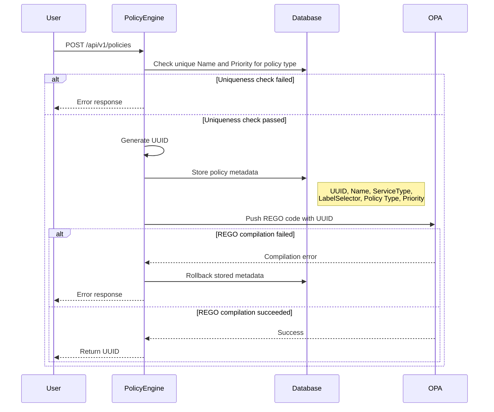
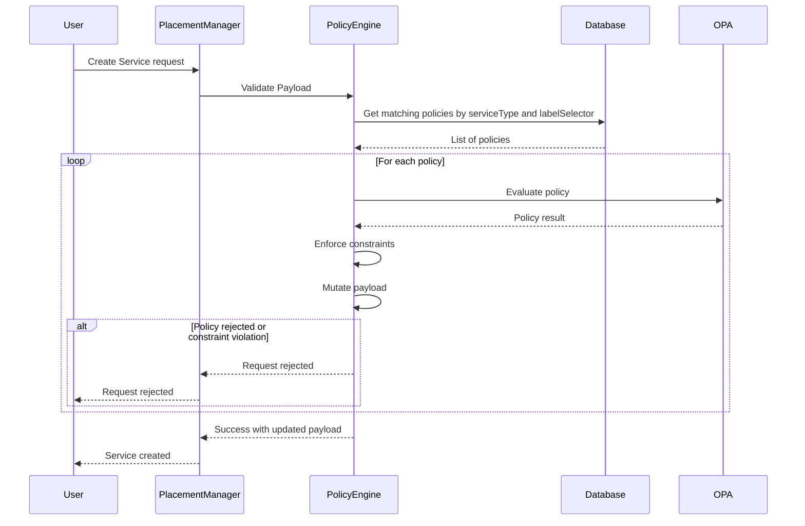

# Policy API & Execution Engine

## Summary

This ADR defines the Management and Execution API and Workflow of the DCM Policy
Engine

## Motivation

The Policy Engine operates as a specialized microservice within the Data Center
Management (DCM) application responsible for governing service creation and
modification (e.g., VirtualMachines, Containers). It enables Admins,
Tenant-Admins, and Users to inject logic that validates (Approve/Reject),
mutates (Defaulting/Altering) and assigns Service Providers to request payloads
using Open Policy Agent (OPA) and Rego.

### Goal

Define the flow of how Policies are managed and used by the Policy Engine

- Define Policy types - Global, Tenant, User
- Define Policy management
  - How policies should be added/updated
  - How policies will be stored
- Define Policy execution
  - Policy priority
  - Value immutability and constraints
- Determine which enforcement engine
  ([OPA](https://www.openpolicyagent.org/docs)) and policy language
  ([Rego](https://www.openpolicyagent.org/docs/policy-language)) to use
- Define the input format
- Define the output format

### Non-Goals

- Policy implementation
- Actionable OpenAPI specification
- While this ADR references `Tenant` level `Policy` and `ID`, `Tenants` are not
  supported in V1

## Core Concepts & Definitions

### Policy Responsibilities

Every policy may return one or more of the following outputs

1. **Reject:** Requests are approved by default. Policies may decide whether the
   request should be _Rejected_.
2. **Mutation:** Modifying the request payload (e.g., injecting default labels)
   by providing a patch map.
3. **Field Constraints:** Defining the mutability of fields for _subsequent_
   policies in the chain.
4. **Service Provider Selection:** Policies may set a value and/or constraints

### Policy Scope & Hierarchy (Execution Order)

The execution order is strictly determined by **Level** first, then
**Priority**.

1. **Global:** (Super Admin) - Runs first.
2. **Tenant:** (Tenant Admin) - Runs second.
3. **User:** (End User) - Runs last.

_Within each level, policies are sorted by the priority integer (Highest
priority first)._

### The "Rego Contract"

#### Input

The input payload includes:

- The original request payload
- The current patched request payload
  - Assumption - While policies do not have to be specific for Service Types
    they will need to know the expected content
- The current constraints
- User information
  - User ID
  - Tenant ID
- The service provider (value and constraints)

#### Output

Following the policy responsibilities, the output should be comprised of the
following elements

- **Reject** - since requests are approved by default, policies may reject them.
- **Service Provider** -
  - Value - the name of the service provider chosen to fulfill the request
  - Constraints - list of allowed SPs, can take a form of Allowlist of Regex
- **Patch** - a dictionary of the corresponding service type for setting values.
  Each internal key is optional
- **Constraints** - follows
  [JSON Schema (draft 2020-12)](https://json-schema.org/draft/2020-12/json-schema-validation).

  This standard supports:
  - Immutable: _const_
  - Numeric constraints: _minimum, maximum, multipleOf_
  - String patterns: _pattern, minLength, maxLength_
  - Enumerations: _enum_
  - Array constraints: _minItems, maxItems_
  - Conditional logic: _if/then/else_

  For the complete validation vocabulary, see the
  [JSON Schema Validation specification](https://json-schema.org/draft/2020-12/json-schema-validation).

### Policy Code Ownership and Responsibilities

- DCM admins and users implement the policies' REGO code
- DCM admins and users are responsible for correct registration of the policies
- DCM admins and users are responsible for the accuracy and performance of the
  policies
- Trying to register a REGO code snipet that fails compilation will fail

## System Architecture

The Policy API serves two distinct functions:

1. Management Plane: CRUD operations for Policy definitions and synchronization
   with the Policy Engine.
2. Execution Plane: Service requests evaluation against active policies using a
   stored-policy model.

### Policy Management

#### Policy Registration Flow

#### Pseudo API

##### POST /api/v1/policies

###### Payload

- Name
  - Must be unique at its level. That is:
    - All global policies must have unique names
    - All tenant policies must have unique names within their tenant
    - All user policies must have unique names for their user
- Policy Matching Criteria. Treated with AND.
  - ServiceType
  - Label Selector
- Policy Type
  - Global, Tenant, User
- Priority
  - Must be unique at its level
  - A lower number means a higher priority and therefore will be evaluated first
- REGO Code

###### Response Payload

- Generated UUID

###### Execution Logic & Flow

- Validate the Policy Name and Priority
  - If not unique return an error
- Generate a UUID
- Store the following information in the DB
  - UUID
  - Name
  - Service Type
  - Policy Type
  - Priority
- Push the REGO code to OPA
  - Use the UUID for naming to avoid collisions
  - If failed, rollback DB and return an error
- Return UUID to caller

##### GET /api/v1/policies

Return the list of policies. Allow for filtering

##### GET /api/v1/policies/{policyId}

Return the specific policy

##### DELETE /api/v1/policies/{policyId}

Delete the specific policy

##### PUT /api/v1/policies/{policyId}

Update the specific policy. Policy name and type are immutable

###### Payload

- Policy Matching Criteria
- Priority
- REGO Code

### Execution Plane

#### Sequence

#### Pseudo API

##### POST /api/v1/engine/evaluate

###### Payload

- Request Payload
- User ID
- Tenant ID

###### Execution Logic & Flow

The Engine acts as an orchestrator. It does not send Rego code during
evaluation; it calls pre-loaded modules in OPA.

###### _Pipeline Logic (The "Chain of Responsibility")_

- The Policy API maintains a `ConstraintContext` map in memory for the duration
  of the request.
- Fetch & Sort:
  - Query DB for active policies matching the request payload based on the
    policy’s matching criteria.
  - Sort by Level (Global -> Tenant -> User) then Priority (Desc).
- If no policies matching the request payload were found, the request will
  return successfully
- Iterate for each policy P:
  - Call `OPA`:
    - Invoke data.dcm.policy.<P.id>.result
    - Pass
      - `OriginalRequestPayload`
      - `CurrentRequestPayload`
      - `ConstraintContext`
      - `UserID`
      - `TenantID`
      - `ServiceProvider`
  - Check `Reject`
    - If `Reject` is `true`, ABORT IMMEDIATELY (Fail Fast). Return 403.
  - Validate `Constraints`:
    - A lower-level policy cannot "unlock" a field locked by a higher-level
      policy.
    - If it does, ABORT with "Policy Conflict Error"
  - Update `ConstraintContext`:
    - Merge new `Constraints` from Policy P into `ConstraintContext`.
  - Validate `Patch`:
    - Validate `Patch` against `ConstraintContext`.
    - Example: If `ConstraintContext.region` is immutable and Policy P tries to
      patch the `region`, ABORT with "Policy Conflict Error"
  - Apply `Patch`
    - Update service_payload with valid patches.
  - Validate `ServiceProvider`
    - If Policy P returned a `ServiceProvider` and `ServiceProviderConstraints`
      exists, validate it.

- Finalize: Return the final `CurrentRequestPayload` and `ServiceProvider` to
  Placement Manager.

###### _Constraint Validation Example_

- Step 1 (Global Policy):
  - Patch: {"billing_tag": "engineering"}
  - Constraint: {"billing_tag": {"mode": "immutable"}}
  - Result: Payload has billing_tag. Context has billing_tag=immutable.
- Step 2 (User Policy):
  - Patch: {"billing_tag": "marketing"}
  - Action: Engine checks Context. billing_tag is immutable.
- Result: Error. The User policy violates the Global constraint.
