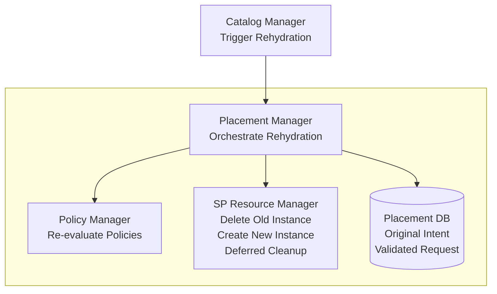
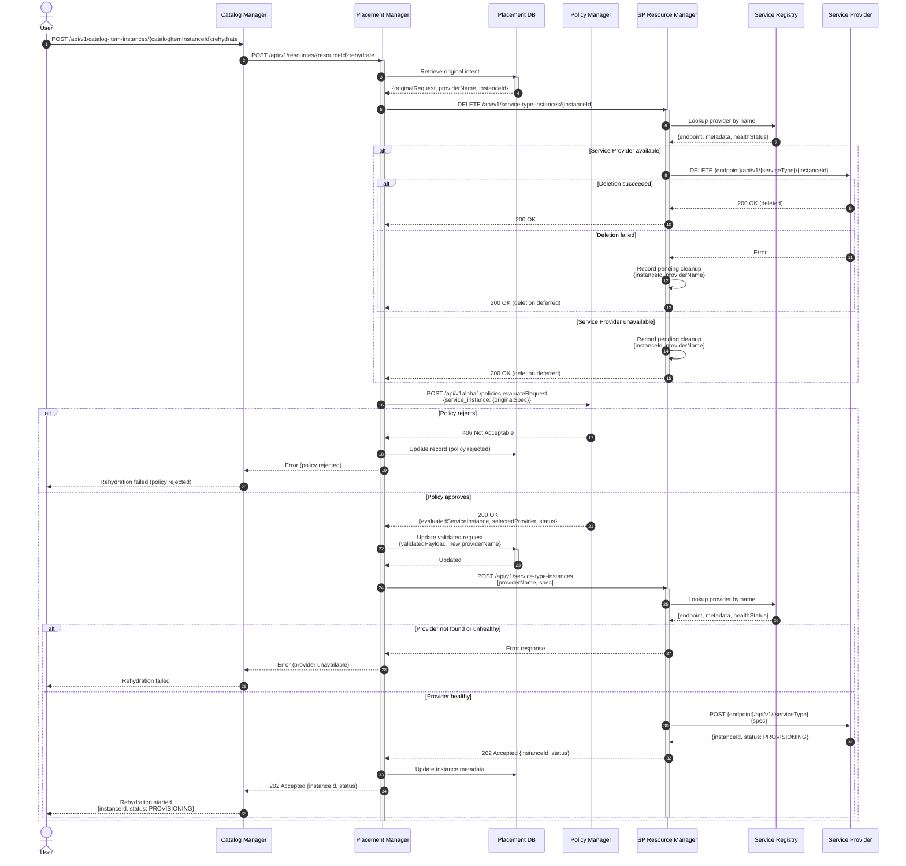
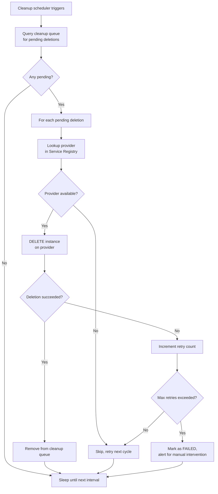
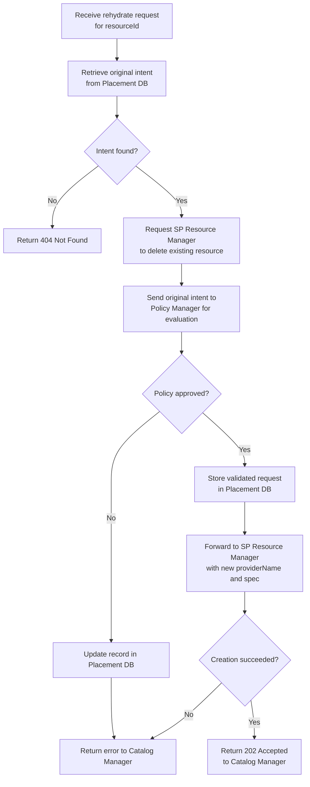

# Rehydration Flow

## Summary

Rehydration is the process of recreating an existing resource from its original
request (intent). The flow deletes the current resource and creates a new one by
re-evaluating policies against the stored intent. This allows the system to
absorb changes in policies and environment that occurred since the original
resource was provisioned.

## Motivation

Over time, policies, Service Provider availability, and environment
configurations may change. A resource that was provisioned under a previous set
of policies may no longer comply with current rules, or a more suitable Service
Provider may have become available. Rehydration enables administrators and users
to bring existing resources in line with the current state of the system without
requiring manual recreation.

### Goals

- Define the end-to-end rehydration flow across Catalog Manager, Placement
  Manager, and SP Resource Manager
- Define new API endpoints for triggering rehydration
- Define how deletion failures are handled when the original Service Provider is
  unavailable
- Define the deferred cleanup mechanism for resources that could not be deleted

### Non-Goals

- Modifying the original CatalogItemInstance, ServiceType, or CatalogItem
  definitions as part of rehydration
- Supporting partial rehydration (e.g., updating policies without recreating the
  resource)
- Defining update-in-place semantics

## Proposal

### Overview

Rehydration is triggered on an existing CatalogItemInstance. The flow
intentionally does **not** regenerate the ServiceType payload from the
CatalogItem. Instead, it uses the original intent stored in the Placement DB to
ensure that only policy and environment changes are reflected, not changes to the
underlying ServiceType or CatalogItem definitions.

The high-level flow is:

1. User triggers rehydration on a CatalogItemInstance via the Catalog Manager
2. Catalog Manager calls the Placement Manager rehydrate endpoint
3. Placement Manager instructs SP Resource Manager to delete the existing
   resource
4. Placement Manager re-evaluates policies against the original intent
5. Placement Manager instructs SP Resource Manager to create the new resource

### System Architecture



### API Endpoints

#### Catalog Manager

| Method | Endpoint                                          | Description                        |
|--------|---------------------------------------------------|------------------------------------|
| POST   | /api/v1/catalog-item-instances/{catalogItemInstanceId}:rehydrate     | Trigger rehydration of an instance |

**POST /api/v1/catalog-item-instances/{catalogItemInstanceId}:rehydrate**

Triggers rehydration of an existing CatalogItemInstance. The Catalog Manager does
**not** regenerate the ServiceType payload. It delegates directly to the
Placement Manager rehydrate endpoint.

Response: Returns `202 Accepted` if the rehydration process has started.

#### Placement Manager

| Method | Endpoint                                  | Description                       |
|--------|-------------------------------------------|-----------------------------------|
| POST   | /api/v1/resources/{resourceId}:rehydrate  | Rehydrate an existing resource    |

**POST /api/v1/resources/{resourceId}:rehydrate**

Triggers the rehydration of an existing resource. The Placement Manager retrieves
the original intent from the Placement DB and orchestrates deletion and
recreation.

Response: Returns `202 Accepted` if the rehydration process has started.

## Design Details

### Rehydration Flow



### Flow Description

1. **Rehydration Trigger**
   - User sends a POST request to the Catalog Manager rehydrate endpoint
   - Catalog Manager does **not** regenerate the ServiceType payload from the
     CatalogItem. This ensures that only policy and environment changes are
     applied, not changes to the underlying CatalogItem or ServiceType
   - Catalog Manager forwards the request to the Placement Manager rehydrate
     endpoint

2. **Intent Retrieval**
   - Placement Manager retrieves the original intent (the user's original
     request) from the Placement DB
   - The original intent includes the spec, the current providerName, and the
     instanceId

3. **Delete Existing Resource**
   - Placement Manager requests SP Resource Manager to delete the existing
     resource
   - SP Resource Manager looks up the Service Provider in the Service Registry
   - If the Service Provider is available and deletion succeeds, the resource is
     deleted normally
   - If the deletion fails for any reason (Service Provider unavailable, Service
     Provider returns an error, etc.), the deletion is deferred (see
     [Handling Unavailable Service Providers](#handling-deletion-failures))
   - In all cases, SP Resource Manager returns success to allow the flow to
     continue

4. **Policy Re-evaluation**
   - Placement Manager sends the original intent to the Policy Manager for
     evaluation against the current policy set
   - Policy Manager evaluates the request through the full policy chain
     (Global, Tenant, User)
   - If the policy rejects the request, the Placement Manager updates the
     record and returns an error
   - If the policy approves, the Placement Manager receives the evaluated
     payload and the newly selected Service Provider

5. **Resource Recreation**
   - Placement Manager stores the new validated request in the Placement DB
   - Placement Manager delegates instance creation to SP Resource Manager with
     the new providerName and evaluated spec
   - Standard creation flow applies (SP lookup, health check, instance creation)
   - On success, the resource enters `PROVISIONING` state

### Handling Deletion Failures

A core requirement of rehydration is the ability to proceed even when the
deletion of the original resource fails. This can happen when the Service
Provider is unavailable, or when the Service Provider is available but returns
an error. Since the same resource ID is used throughout the pipeline, a failed
deletion would normally block recreation. To support this, the SP Resource
Manager implements the following behavior:

#### Deferred Deletion

When the SP Resource Manager fails to delete the original resource during
a rehydration request (whether because the Service Provider is unreachable or
because it returned an error):

1. The SP Resource Manager records the pending deletion in a **cleanup queue**
   (persisted in the database) with the following information:
   - `instanceId`: The instance to be deleted
   - `providerName`: The Service Provider that hosts the instance
   - `serviceType`: The type of the service
   - `timestamp`: When the deletion was requested
2. The SP Resource Manager removes the instance record from its database so
   that the same ID can be reused for the new resource
3. The SP Resource Manager returns success to the Placement Manager, allowing
   the rehydration flow to continue

#### Cleanup Mechanism

The SP Resource Manager runs a background cleanup process that periodically
attempts to complete deferred deletions:



**Cleanup queue record:**
```json
{
  "instanceId": "08aa81d1-a0d2-4d5f-a4df-b80addf07781",
  "providerName": "kubevirt-sp",
  "serviceType": "vm",
  "requestedAt": "2026-03-23T10:00:00Z",
  "retryCount": 0,
  "status": "PENDING",
  "lastAttempt": null
}
```

#### Key Characteristics

- **Non-blocking**: Deletion failures do not block the rehydration flow
- **Persistent**: The cleanup queue is stored in the database to survive
  restarts
- **Automatic retry**: The cleanup process automatically retries deletions as
  Service Providers become available
- **Bounded retries**: After a configurable maximum number of retries, the
  entry is marked as `FAILED` for manual intervention
- **Idempotent**: Cleanup deletions are idempotent; repeated attempts to delete
  an already-deleted resource are safe

### Placement Manager Rehydration Flowchart



### Key Characteristics

- **Intent Preservation**: Rehydration operates on the original user intent, not
  the current CatalogItem or ServiceType definitions. This ensures that only
  policy and environment changes are reflected
- **Policy Re-evaluation**: Every rehydration re-evaluates the full policy
  chain, potentially selecting a different Service Provider or applying different
  mutations
- **Graceful Degradation**: The flow continues even when deletion of the
  original resource fails (whether the Service Provider is unavailable or returns
  an error), with a cleanup mechanism to handle deferred deletions
- **Idempotent Rehydration**: Rehydrating an already-rehydrated resource works
  the same way; the current resource is deleted and recreated from the original
  intent
