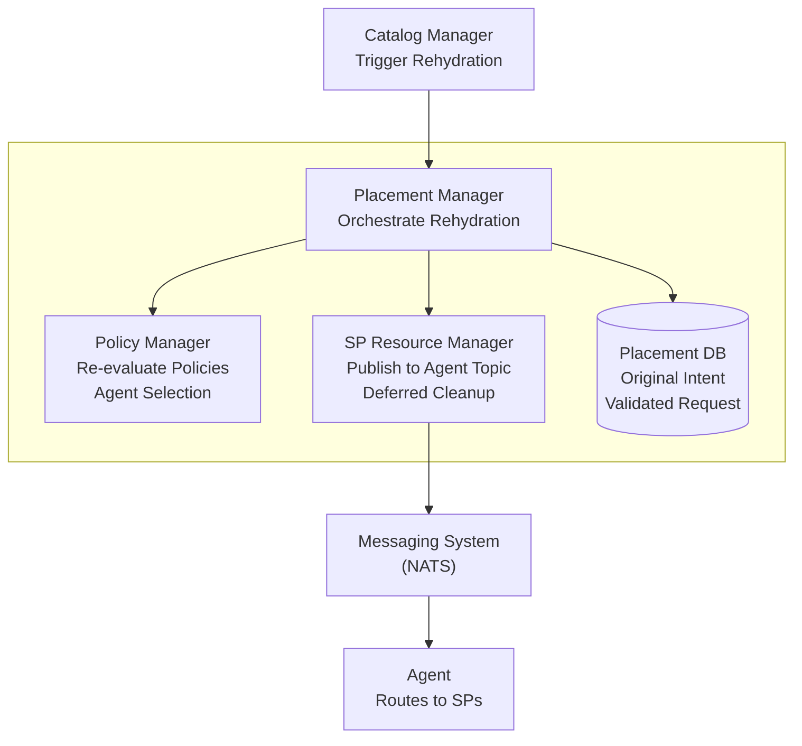
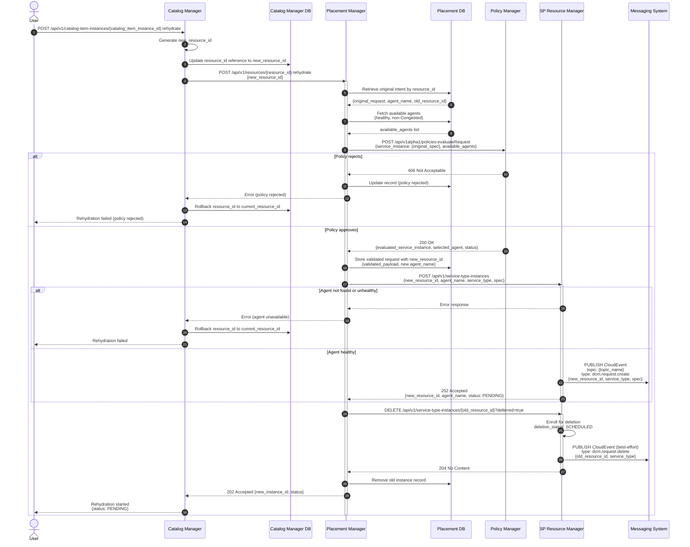
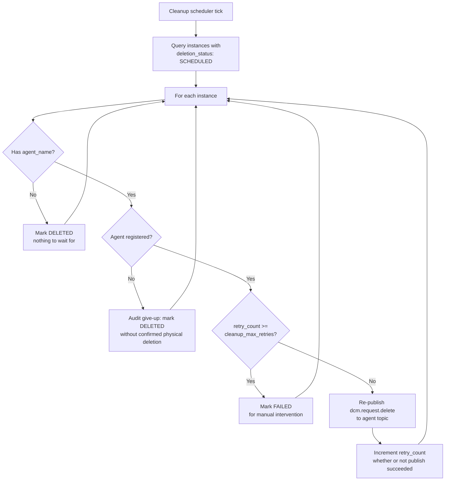
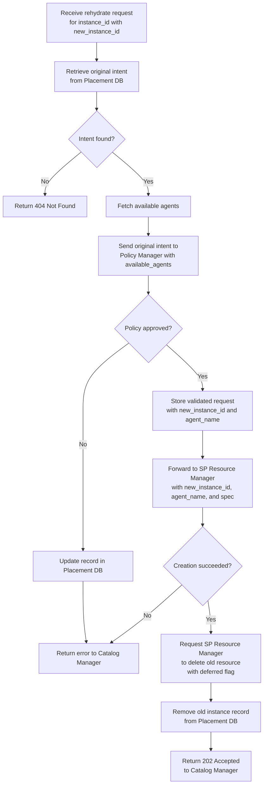

# Rehydration Flow

## Summary

Rehydration is the process of recreating an existing resource from its original
request (intent). The flow re-evaluates policies against the stored intent and
creates a new resource before deleting the old one. This allows the system to
absorb changes in policies and environment that occurred since the original
resource was provisioned.

## Motivation

Over time, policies, Agent availability, and environment configurations may
change. A resource that was provisioned under a previous set of policies may no
longer comply with current rules, or a more suitable Agent may have become
available. Rehydration enables administrators and users to bring existing
resources in line with the current state of the system without requiring manual
recreation.

### Goals

- Define the end-to-end rehydration flow across Catalog Manager, Placement
  Manager, and SP Resource Manager
- Define new API endpoints for triggering rehydration
- Define how deletion failures are handled when the original Agent is
  unavailable
- Define the deferred cleanup mechanism for resources that could not be deleted

### Non-Goals

- Modifying the original CatalogItemInstance, ServiceType, or CatalogItem
  definitions as part of rehydration
- Supporting partial rehydration (e.g., updating policies without recreating the
  resource)
- Defining update-in-place semantics

## Proposal

### Overview

Rehydration is triggered on an existing CatalogItemInstance. The flow
intentionally does **not** regenerate the ServiceType payload from the
CatalogItem. Instead, it uses the original intent stored in the Placement DB to
ensure that only policy and environment changes are reflected, not changes to
the underlying ServiceType or CatalogItem definitions.

#### ID Separation

The CatalogItemInstance ID used by the Catalog Manager is separate from the
InstanceID used by the Placement Manager and SP Resource Manager. During the
initial create flow, the Catalog Manager generates a InstanceID and passes it
downstream. The Catalog Manager maintains a mapping between its
CatalogItemInstance ID and the InstanceID. This separation is critical for
rehydration: it allows the Catalog Manager to generate a **new** InstanceID for
the recreated resource while the old InstanceID is still in use, avoiding ID
conflicts in the downstream services.

The high-level flow is:

1. User triggers rehydration on a CatalogItemInstance via the Catalog Manager
2. Catalog Manager generates a new InstanceID and calls the Placement Manager
   rehydrate endpoint with both the current and the new InstanceID
3. Placement Manager retrieves the original intent using the current InstanceID
4. Placement Manager re-evaluates policies against the original intent
5. Placement Manager instructs SP Resource Manager to create the new resource
   using the new InstanceID
6. Once the new resource is provisioned, Placement Manager instructs SP Resource
   Manager to delete the old resource using the old InstanceID

### System Architecture


```mermaid
flowchart TD
    CM["Catalog Manager<br/>Trigger Rehydration"]

    subgraph DCM_Core [" "]
        PM["Placement Manager<br/>Orchestrate Rehydration"]

        PE["Policy Manager<br/>Re-evaluate Policies<br/>Agent Selection"]

        SPRM["SP Resource Manager<br/>Publish to Agent Topic<br/>Deferred Cleanup"]

        PM_DB[("Placement DB<br/>Original Intent<br/>Validated Request")]
    end

    MS["Messaging System<br/>(NATS)"]
    AG["Agent<br/>Routes to SPs"]

    CM --> PM
    PM --> PM_DB
    PM --> PE
    PM --> SPRM
    SPRM --> MS
    MS --> AG
```

### API Endpoints

#### Catalog Manager

| Method | Endpoint                                                            | Description                        |
| ------ | ------------------------------------------------------------------- | ---------------------------------- |
| POST   | /api/v1/catalog-item-instances/{catalog_item_instance_id}:rehydrate | Trigger rehydration of an instance |

**POST /api/v1/catalog-item-instances/{catalog_item_instance_id}:rehydrate**

Triggers rehydration of an existing CatalogItemInstance. The Catalog Manager
does **not** regenerate the ServiceType payload. It generates a new InstanceID
and delegates to the Placement Manager rehydrate endpoint, passing both the
current InstanceID and the new InstanceID.

Response: Returns `202 Accepted` if the rehydration process has started.

#### Placement Manager

| Method | Endpoint                                  | Description                    |
| ------ | ----------------------------------------- | ------------------------------ |
| POST   | /api/v1/resources/{instance_id}:rehydrate | Rehydrate an existing resource |

**POST /api/v1/resources/{instance_id}:rehydrate**

Triggers the rehydration of an existing resource. The Placement Manager
retrieves the original intent from the Placement DB and orchestrates creation of
the new resource followed by deletion of the old one.

Request body:

```json
{
  "new_instance_id": "<new-instance-id>"
}
```

Response: Returns `202 Accepted` if the rehydration process has started.

## Design Details

### Rehydration Flow


```mermaid
sequenceDiagram
    autonumber
    actor User
    participant CM as Catalog Manager
    participant CM_DB as Catalog Manager DB
    participant PM as Placement Manager
    participant DB as Placement DB
    participant PE as Policy Manager
    participant SPRM as SP Resource Manager
    participant MS as Messaging System

    User->>CM: POST /api/v1/catalog-item-instances/{catalog_item_instance_id}:rehydrate
    CM->>CM: Generate new_resource_id
    CM->>CM_DB: Update resource_id reference to new_resource_id

    CM->>PM: POST /api/v1/resources/{resource_id}:rehydrate<br/>{new_resource_id}

    activate PM

    PM->>DB: Retrieve original intent by resource_id
    DB-->>PM: {original_request, agent_name, old_resource_id}

    PM->>DB: Fetch available agents<br/>(healthy, non-Congested)
    DB-->>PM: available_agents list

    PM->>PE: POST /api/v1alpha1/policies:evaluateRequest<br/>{service_instance: {original_spec}, available_agents}

    alt Policy rejects
        PE-->>PM: 406 Not Acceptable
        PM->>DB: Update record (policy rejected)
        PM-->>CM: Error (policy rejected)
        CM->>CM_DB: Rollback resource_id to current_resource_id
        CM-->>User: Rehydration failed (policy rejected)

    else Policy approves
        PE-->>PM: 200 OK<br/>{evaluated_service_instance, selected_agent, status}

        PM->>DB: Store validated request with new_resource_id<br/>{validated_payload, new agent_name}

        PM->>SPRM: POST /api/v1/service-type-instances<br/>{new_resource_id, agent_name, service_type, spec}
        activate SPRM

        alt Agent not found or unhealthy
            SPRM-->>PM: Error response
            PM-->>CM: Error (agent unavailable)
            CM->>CM_DB: Rollback resource_id to current_resource_id
            CM-->>User: Rehydration failed
        else Agent healthy
            SPRM->>MS: PUBLISH CloudEvent<br/>topic: {topic_name}<br/>type: dcm.request.create<br/>{new_resource_id, service_type, spec}
            SPRM-->>PM: 202 Accepted<br/>{new_resource_id, agent_name, status: PENDING}
        end
        deactivate SPRM

        PM->>SPRM: DELETE /api/v1/service-type-instances/{old_resource_id}?deferred=true
        activate SPRM
        SPRM->>SPRM: Enroll for deletion<br/>deletion_status: SCHEDULED
        SPRM->>MS: PUBLISH CloudEvent (best-effort)<br/>type: dcm.request.delete<br/>{old_resource_id, service_type}
        SPRM-->>PM: 204 No Content
        deactivate SPRM

        PM->>DB: Remove old instance record
        PM-->>CM: 202 Accepted {new_instance_id, status}
        CM-->>User: Rehydration started<br/>{status: PENDING}
    end
    deactivate PM
```

### Flow Description

1. **Rehydration Trigger**
   - User sends a POST request to the Catalog Manager rehydrate endpoint
   - Catalog Manager does **not** regenerate the ServiceType payload from the
     CatalogItem. This ensures that only policy and environment changes are
     applied, not changes to the underlying CatalogItem or ServiceType
   - Catalog Manager reads the current resource_id from its database
   - Catalog Manager generates a new resource_id for the downstream services
   - Catalog Manager updates its database with the new resource_id **before**
     calling Placement Manager (see
     [DB-First Update Order](#catalog-manager-db-first-update-order)). The
     update uses compare-and-swap (CAS): it only succeeds if the resource_id
     still matches the value read earlier, preventing concurrent rehydrates from
     both proceeding
   - Catalog Manager then forwards the request to the Placement Manager
     rehydrate endpoint with the current resource_id (in the URL) and the new
     resource_id (in the request body)

2. **Intent Retrieval**
   - Placement Manager retrieves the original intent (the user's original
     request) from the Placement DB using the current InstanceID
   - The original intent includes the spec, the current agent_name, and the old
     InstanceID

3. **Fetch Available Agents**
   - Placement Manager queries the Agent Registry for healthy, non-Congested
     agents that support the requested service type
   - The resulting `available_agents` list is passed to the Policy Manager for
     evaluation. The current agent should not be included in the
     `available_agents` list.

4. **Policy Re-evaluation**
   - Placement Manager sends the original intent to the Policy Manager with
     `available_agents` for evaluation against the current policy set
   - Policy Manager evaluates the request through the full policy chain (Global,
     Tenant, User)
   - If the policy rejects the request, the Placement Manager updates the record
     and returns an error to Catalog Manager, which rolls back its database to
     the original resource_id
   - If the policy approves, the Placement Manager receives the evaluated
     payload and the newly selected Agent (`selected_agent`)

5. **Resource Creation**
   - Placement Manager stores the new validated request in the Placement DB with
     the new InstanceID and the new `agent_name`
   - Placement Manager delegates instance creation to SP Resource Manager with
     the new InstanceID, the new agent_name, service_type, and the evaluated
     spec
   - Since the new InstanceID is different from the old one, there is no ID
     conflict in SP Resource Manager
   - SP Resource Manager publishes a creation CloudEvent to the agent's
     messaging topic
   - On success, the resource enters `PENDING` state
   - On failure, Catalog Manager rolls back its database to the original
     resource_id

6. **Delete Old Resource**
   - Once the new resource is created, Placement Manager requests SP Resource
     Manager to delete the old resource using the old InstanceID with the
     `deferred` flag set to `true`
   - SP Resource Manager enrolls the old instance for deletion
     (`deletion_status: SCHEDULED`) and attempts, best-effort, to publish a
     deletion CloudEvent to the agent — exactly like a non-deferred delete (see
     [Deferred Deletion](#deferred-deletion))
   - SP Resource Manager returns `204 No Content` once enrolled, regardless of
     whether the publish succeeded, so the rehydration flow is never blocked
   - Placement Manager removes the old instance record from the Placement DB and
     returns success to the Catalog Manager

### Handling Deletion of the Old Resource

#### Deferred Deletion

During rehydration, the deletion request is sent with the `deferred` flag set to
`true`. A deferred deletion request enrolls the instance for deletion
(`deletion_status: SCHEDULED` in the database) and attempts to publish a
deletion CloudEvent to the agent — **exactly like a non-deferred delete**. The
only behavior specific to `deferred=true` is that once the deletion completes,
the instance record is preserved as a tombstone (`deletion_status: DELETED`,
visible when listing or getting with `show_deleted=true`) rather than
hard-deleted.

1. The SP Resource Manager enrolls the instance for deletion, recording:
   - `instance_id`: The instance to be deleted
   - `agent_name`: The Agent that manages the instance
   - `deletion_requested_at`: When the deletion was first requested
   - `retry_count`: How many redelivery attempts the cleanup scheduler has made
     (starts at `0`)
2. The SP Resource Manager publishes a deletion CloudEvent to the agent's topic,
   best-effort
3. The SP Resource Manager returns `204 No Content` to the Placement Manager
   once enrollment succeeds, **regardless of whether the publish succeeded** — a
   publish failure is not surfaced as an error and is retried later by the
   cleanup scheduler (see [Cleanup Mechanism](#cleanup-mechanism)). This is what
   makes the call non-blocking: the rehydration flow never waits on agent
   latency or availability

#### Cleanup Mechanism

The SP Resource Manager runs a background Deletion Cleanup Scheduler that
periodically drives every instance with `deletion_status: SCHEDULED` to a
terminal outcome. This is the same scheduler used for every enrolled deletion,
not just rehydration's — a non-deferred delete whose initial publish failed is
enrolled and resolved the same way (see
[SP Resource Manager — Deletion Cleanup Scheduler](../sp-resource-manager/sp-resource-manager.md#deletion-cleanup-scheduler)
for the full behavior and configuration). This section summarizes it as it
applies to a deferred deletion queued during rehydration.


```mermaid
flowchart TD
    A[Cleanup scheduler tick] --> B[Query instances with<br/>deletion_status: SCHEDULED]
    B --> C[For each instance]
    C --> D{Has agent_name?}
    D -- No --> E[Mark DELETED<br/>nothing to wait for]
    E --> C
    D -- Yes --> F{Agent registered?}
    F -- No --> G[Audit give-up: mark DELETED<br/>without confirmed physical deletion]
    G --> C
    F -- Yes --> H{retry_count >=<br/>cleanup_max_retries?}
    H -- Yes --> I[Mark FAILED<br/>for manual intervention]
    I --> C
    H -- No --> J[Re-publish dcm.request.delete<br/>to agent topic]
    J --> K[Increment retry_count<br/>whether or not publish succeeded]
    K --> C
```

**Resolution rules:**

- **No `agent_name`**: nothing to wait for. Marked `DELETED` immediately, a
  normal (non-audited) completion.
- **Agent not registered**: the Agent and its environment are presumed
  decommissioned, and the resource may be orphaned. Marked `DELETED` as an
  audited give-up — logged as a structured audit event.
- **Agent registered, retries exhausted**: marked `FAILED` for manual/operator
  intervention. This does **not** silently resolve to `DELETED` — an operator
  must investigate.
- **Agent registered, retries remaining**: re-publishes the deletion CloudEvent
  to the agent's topic and increments `retry_count`, whether or not the publish
  itself succeeded. Actual finalization to `DELETED` happens separately, when
  the agent's `dcm.agent.deletion-acknowledged` event arrives (see
  [SP Resource Manager — Asynchronous Response Processing](../sp-resource-manager/sp-resource-manager.md#asynchronous-response-processing)).

**Instance record fields relevant to cleanup:**

```json
{
  "instance_id": "08aa81d1-a0d2-4d5f-a4df-b80addf07781",
  "agent_name": "prod-eu-agent",
  "deletion_status": "SCHEDULED",
  "deletion_requested_at": "2026-03-23T10:00:00Z",
  "retry_count": 0,
  "last_deletion_attempt": null
}
```

#### Key Characteristics

- **Non-blocking**: A deferred deletion enrolls the instance and attempts to
  publish, but never waits on or fails because of agent latency or availability
  — the calling flow is never blocked
- **Persistent**: Deletion enrollment (`deletion_status`, `retry_count`,
  `deletion_requested_at`) is stored on the instance record in the database,
  surviving restarts
- **Automatic retry**: The cleanup scheduler retries the publish until the agent
  acknowledges the deletion, the agent is found to be deregistered, or retries
  are exhausted
- **Deterministic resolution**: Every entry reaches a terminal `deletion_status`
  — `DELETED` (confirmed or audited give-up) or `FAILED` (retries exhausted,
  needs manual intervention). No entry is retried forever
- **Idempotent**: Cleanup deletions are idempotent; repeated attempts to delete
  an already-deleted resource are safe

### Placement Manager Rehydration Flowchart


```mermaid
flowchart TD
    A[Receive rehydrate request<br/>for instance_id with new_instance_id] --> B[Retrieve original intent<br/>from Placement DB]
    B --> C{Intent found?}
    C -->|No| D[Return 404 Not Found]
    C -->|Yes| E[Fetch available agents]
    E --> F[Send original intent to<br/>Policy Manager with available_agents]
    F --> G{Policy approved?}
    G -->|No| H[Update record in Placement DB]
    H --> I[Return error to Catalog Manager]
    G -->|Yes| J[Store validated request<br/>with new_instance_id and agent_name]
    J --> K[Forward to SP Resource Manager<br/>with new_instance_id, agent_name, and spec]
    K --> L{Creation succeeded?}
    L -->|No| I
    L -->|Yes| M[Request SP Resource Manager<br/>to delete old resource<br/>with deferred flag]
    M --> N[Remove old instance record<br/>from Placement DB]
    N --> O[Return 202 Accepted<br/>to Catalog Manager]
```

### Key Characteristics

- **Intent Preservation**: Rehydration operates on the original user intent, not
  the current CatalogItem or ServiceType definitions. This ensures that only
  policy and environment changes are reflected
- **Create-before-Delete**: The new resource is created before the old one is
  deleted. This ensures the system is never left without a running resource
  during the rehydration process
- **ID Separation**: The CatalogItemInstance ID is separate from the InstanceID
  used downstream. This allows the Catalog Manager to issue a new InstanceID for
  the recreated resource, avoiding ID conflicts in downstream services
- **Policy Re-evaluation**: Every rehydration re-evaluates the full policy
  chain, potentially selecting a different Agent or applying different mutations
- **Deferred Cleanup**: Deletion of the old resource is always requested with
  `deferred=true` during rehydration. The SP Resource Manager enrolls the old
  instance for deletion and attempts to publish to the Agent, but never blocks
  on or fails because of agent availability or publish errors — a failed publish
  is retried later by the cleanup scheduler (see
  [Deferred Deletion](#deferred-deletion))
- **Idempotent Rehydration**: Rehydrating an already-rehydrated resource works
  the same way; a new resource is created from the original intent and the
  current resource is deleted afterward

### Catalog Manager: DB-First Update Order

The Catalog Manager uses a **DB-first** approach when updating the `resource_id`
during rehydration. The database is updated before calling Placement Manager,
and rolled back if the PM call fails.

#### Why DB-First?

The alternative approach (PM-first) would call Placement Manager before updating
the database. While this ensures the database always points to a resource that
exists in PM, it introduces a significant risk: **orphaned resources**.

| Approach     | Tradeoff                                                                                                                                                                                                 |
| ------------ | -------------------------------------------------------------------------------------------------------------------------------------------------------------------------------------------------------- |
| **PM-first** | DB always points to something real, but if the DB update fails, PM has provisioned a resource that the DB doesn't reference. These orphans are invisible to the system and silently leak infrastructure. |
| **DB-first** | DB may briefly point to a `resource_id` that PM hasn't provisioned yet (a window of milliseconds), but we rollback immediately on PM failure, and any inconsistency is easily detected.                  |

The key insight: **DB inconsistencies are cheap to detect and fix; PM orphans
leak real infrastructure silently.**
