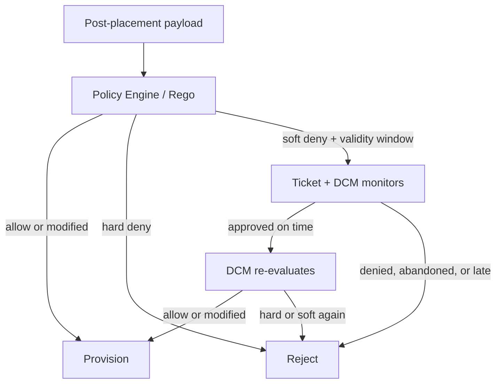
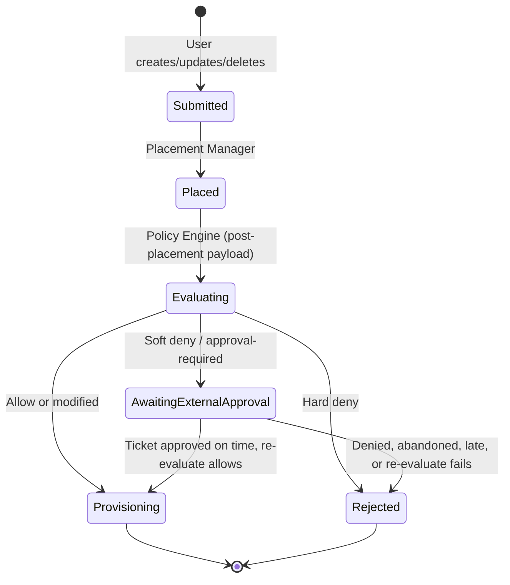
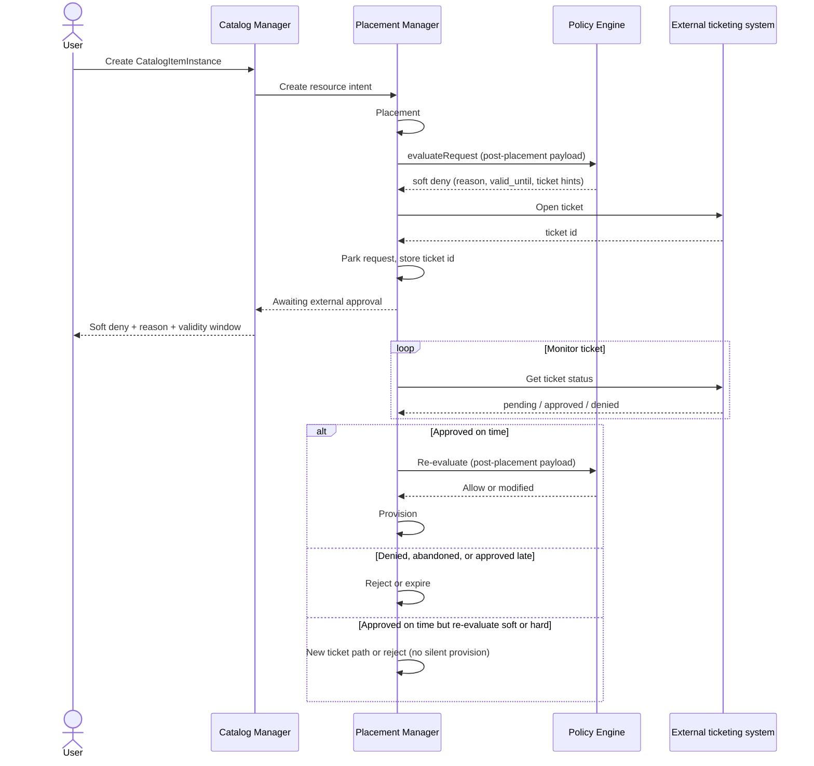

# Request approval

## Open Questions

These need team validation before implementation. Where a proposed approach is
stated, it is a suggestion only, not a decision.

The primary shape is proposed below (Rego + external ticketing). The in-DCM
grant/deny alternative is documented under
[Alternative 1](#alternative-1-dcm-native-pending-override-and-grantdeny-api).

1. **How DCM and the ticket connect**  
   Who opens the ticket, how DCM learns it was approved, and what “on time”
   means?

   > [!NOTE] **Proposed approach**  
   > Soft outcome includes a stable `reason` and an **approval validity window**
   > from policy (for example “until end of Q2”). **DCM opens** the ticket in
   > the external ticketing system when it parks the request, stores the ticket
   > id, and **monitors** ticket status. How DCM learns of changes depends on
   > what the external ticketing system supports (for example outbound events
   > when available, otherwise periodic status checks).  
   > When the ticket is **approved inside the validity window**, DCM
   > **re-evaluates**, then continues to provision only if evaluate allows.  
   > When approval is **after the window**, or the ticket is denied/abandoned,
   > the approval is **not valid**. DCM does not provision (reject or expire).

2. **Operations in scope**  
   Create only, or also update and delete when evaluation soft-denies?

   > [!NOTE] **Proposed approach**  
   > Soft-deny / ticket path applies to create, update, and delete **only when
   > policy soft-denies that operation**. It is not “every delete needs
   > approval.” Owner delete (and other cases) can stay allow in Rego. Soft on
   > rehydration is deferred (see Deferred items).

3. **Composite requests (UC #2)**  
   Soft deny per child or one parent-level ticket?

   > [!NOTE] **Proposed approach**  
   > Per child. Policy evaluates each child. Each soft-denied child needs its
   > own ticket (or policy allow) before that child proceeds. Parent status
   > follows composite orchestration. See
   > [Composite requests](#composite-requests).

4. **GitOps**  
   Soft deny after a merged PR still needs a ticket. Is that acceptable?

   > [!NOTE] **Proposed approach**  
   > Same policy path for GitOps and API. Git review does not replace a soft
   > deny. Platform admins can encode known exceptions in Rego (or a standing
   > ticket/change record) so soft deny does not fire. Do not skip policy for
   > GitOps-managed instances.

5. **Auth / ticket identity**  
   When DCM opens a ticket, how is the DCM requester represented in the
   ticketing system?

   > [!NOTE] **Proposed approach**  
   > Open the ticket with a **DCM service account** (reliable open/monitor
   > without per-user sync). Always set required ticket fields from the
   > authenticated DCM actor (for example requester id/email, request id) so
   > approvers and audit still see who asked.  
   > Opening the ticket **as the end user** (not only filling requester fields)
   > stays optional later, if the org already maps DCM identities into the
   > ticketing system.  
   > Closing this question needs two things: a stable authenticated DCM actor
   > from [authentication](../authentication/authentication.md), and an agreed
   > mapping of which ticketing fields carry requester and request context.

6. **Evaluate outcome shape**  
   How is soft deny / approval-required represented next to today’s `APPROVED` /
   `MODIFIED` / hard reject?

   > [!NOTE] **Proposed approach**  
   > Soft deny is an **explicit evaluate outcome** owned by the
   > [policy-engine](../policy-engine/policy-engine.md) enhancement (OpenAPI +
   > Rego contract). This request-approval enhancement consumes that outcome. It
   > does not invent a side-channel soft reject. See
   > [Required from the policy-engine enhancement](#required-from-the-policy-engine-enhancement).

## Summary

This enhancement covers **UC #16** (policy override / approval when policy
blocks a request) without building an in-DCM approval product.

**Initial scope** means: express approval needs as Rego policies in the Policy
Engine. Run soft/hard outcomes on the **post-placement** payload. Use an
external ticketing system (for example ServiceNow) as the human system of
record. DCM parks the request, monitors the ticket, and on approve-on-time
**re-evaluates** before provision. Known exceptions are encoded in policy (or a
standing ticket record), not as a DCM exemption API. Hard denials stay
non-overridable.

## Motivation

SREs and platform admins sometimes need a governed exception when policy blocks
a request that still has to go through for a business reason (for example a
short capacity burst or a soft sizing rule). DCM already has automated allow,
deny, and mutate in the Policy Engine. Adding a second human-approval lifecycle
inside DCM (`PendingOverride`, grant/deny APIs, exemption inventory, CLI/UI)
duplicates what external ticketing tools already do for audit, SLA, and routing.

If there is no official path at all, teams tend to provision outside DCM or
loosen policy so the soft case always passes. The cheaper fix is: write clear
approval-oriented Rego, return a soft outcome when a human is required, and let
ServiceNow (or similar) own the human decision. DCM stays automation-first and
policy-first.

### Goals

- Depend on a Policy Engine **soft deny / approval-required** evaluate outcome
  (defined in the policy-engine enhancement) on the post-placement payload
- Let teams express “needs human approval” and known auto-allow exceptions as
  Rego (and policy data), using the existing Policy Engine
- Integrate with an external ticketing system as the human system of record for
  soft outcomes. **DCM opens** the ticket when parking, monitors it, and on
  valid approval **re-evaluates** before provision
- Enforce an **approval validity window** from the soft outcome (for example
  until end of Q2). Late approval does not count
- Keep hard deny fail-fast with no ticket path
- Keep CatalogItem validation early. Soft/hard approval outcomes after placement
- Document what stays out of DCM so scope does not grow into a full approval
  product

### Non-Goals

- A DCM-native pending override state with in-product grant/deny APIs and
  approver UI as the system of record
- Thin soft-deny exemption objects, standing grants, or waiver inventory inside
  DCM
- A pre-provision queue that parks requests for a human even when policy did not
  soft-deny
- Dual approval, sequential chains, or quorum inside DCM
- Replacing or redesigning the Policy Engine allow / deny / mutate pipeline
  beyond the soft-outcome contract
- Shipping a library of production Rego policies (this doc defines the contract.
  Sample Rego in use-cases is illustrative only)
- Building ServiceNow (or any ticketing product) itself. Only the DCM↔ticket
  open/monitor contract
- Requiring the **client** to open the ticket (DCM opens it when parking)
- Closing Open Question 5 without auth and ticketing field mapping design
- Enforcing approver ≠ requester (or other SoD) inside DCM for this path

## Proposal

Concrete scenarios live in [`use-cases.md`](./use-cases.md).

### Assumptions

- Policy evaluation already runs through Placement Manager and Policy Engine
- Soft and hard outcomes run on the **post-placement** payload. CatalogItem
  checks stay early
- The **policy-engine enhancement** will define and ship the soft deny /
  approval-required evaluate contract listed under
  [Required from the policy-engine enhancement](#required-from-the-policy-engine-enhancement).
  This enhancement is blocked on that contract for the ticket path
- An external ticketing system (for example ServiceNow) is available where UC
  #16 needs a human step. Deployments without that system keep hard deny and
  must encode exceptions in Rego only. The soft/ticket path stays off
- The external ticketing system is the human system of record. DCM does not
  expose grant/deny as the approval UI. DCM **opens** the ticket when parking,
  **monitors** it, and drives continue / expire
- Soft outcome includes (or implies) an **approval validity window** from policy
- Authenticated DCM identity exists for the requester so ticket fields can carry
  requester context (see Open Question 5)
- DCM does **not** enforce approver ≠ requester. Approver eligibility and
  segregation of duties are owned by the external ticketing system (revisit only
  if Alternative 1 returns)

### Required from the policy-engine enhancement

This request-approval work **consumes** Policy Engine evaluate. It does not own
the soft-outcome schema. The [policy-engine](../policy-engine/policy-engine.md)
enhancement (or a follow-on edit to it) must define at least:

| PE must define                                                                                                   | Why request-approval needs it                                                                                                                                   |
| ---------------------------------------------------------------------------------------------------------------- | --------------------------------------------------------------------------------------------------------------------------------------------------------------- |
| Soft deny / approval-required as an evaluate outcome distinct from `APPROVED`, `MODIFIED`, and hard reject       | Placement Manager must park instead of provision or hard-fail                                                                                                   |
| Stable machine-readable `reason` code (or equivalent) on soft outcome                                            | Ticket body, audit, dashboards, matching known exceptions in Rego data. Illustrative values like `vm.memory.soft_max` are reason codes, not payload field paths |
| Approval **validity window** on soft outcome (for example `valid_until`, or a period PE resolves to a timestamp) | DCM rejects late ticket approvals                                                                                                                               |
| How Rego signals soft vs hard (package/rule contract or documented reject fields)                                | Authors can write approval policies without ad-hoc PM logic                                                                                                     |
| OpenAPI / evaluate response field names and backwards compatibility                                              | Clients and PM integrate against one contract                                                                                                                   |
| Behaviour when multiple policies disagree (soft vs hard)                                                         | Hard must win or conflict must be explicit. No silent soft                                                                                                      |

**Owned by this enhancement (not by policy-engine):**

- Opening, storing, and **monitoring** external tickets (**DCM opens** the
  ticket when it parks a soft-denied request)
- Re-evaluate / expire when approval is on time, late, denied, or abandoned
- DCM waiting-request lifecycle and UX status for “awaiting external approval”

**Delivery order:** land the PE soft-outcome contract (spec then implementation)
before or with the DCM ticket-monitor path. Until PE exposes soft, treat soft as
unavailable (hard-only or feature-flagged off).

### Proposed solution

1. **Rego policies** decide allow, mutate, hard deny, or soft deny /
   approval-required. Soft means “do not provision until a valid external
   approval is detected. Hard means “reject, no ticket path.”
2. **Policy Engine** returns that outcome after placement, including a stable
   `reason` and validity bound (absolute time or period such as end of Q2).
3. **DCM opens** a ticket in the external ticketing system (for example
   ServiceNow) when it parks the request. Human grant/deny happens there. Audit
   and routing live there.
4. **DCM monitors** the ticket using the integration the ticketing system
   supports (outbound events when available, otherwise periodic status checks).
   On **approve within the validity window**, DCM **re-evaluates**, then
   continues to provision only if evaluate allows. On **deny**, **abandon**, or
   **approve too late**, DCM does not provision (expire / reject with reason).
5. **Known exceptions** (“stop asking every time”) are Rego data or policy
   updates, or standing ticket records. Not a DCM exemption CRUD API.



### Soft vs hard outcome

Soft and hard are **evaluate outcomes**, not two separate product policy types.
Any Rego module may return hard reject or soft / approval-required.

| Outcome                       | Meaning                       | Next step                                                                         |
| ----------------------------- | ----------------------------- | --------------------------------------------------------------------------------- |
| Allow / modified              | Policy satisfied (or patched) | Provision                                                                         |
| Soft deny / approval-required | Needs human decision          | Ticket + DCM monitors. Re-evaluate after approve-on-time. Provision only if allow |
| Hard deny                     | Non-skippable                 | Reject at once                                                                    |

**Example soft reason code:** `vm.memory.soft_max` (illustrative stable code
from policy, not a payload field path and not a policy id) when memory is above
a soft ceiling but placement still found an agent.

**Example hard reason code:** guest OS not on the approved image list.

### Stop repeating the same soft deny

If the same soft reason keeps needing approval, update Rego or policy data so
matching requests allow without a ticket, or let policy read a standing
ticket/change record. Prefer updating Rego when the same soft reason recurs. Do
not rely on repeated tickets alone. Do not add a DCM exemption inventory or CRUD
API for that.

### Composite requests

A composite (UC #2) has several children. Soft/hard evaluate per child after
that child’s placement. Exact timing in the composite pipeline is owned by
composite orchestration (see Open Question 3).

**Proposed approach:**

- Soft-denied child → ticket path for that child
- Allowed children are not held for a parent-level ticket
- Children on the same DAG level may proceed independently (one soft-denied
  child does not stop peer evaluation)
- Whether later DAG levels wait for soft-denied children is owned by composite
  orchestration, not by this enhancement (Open Question 3)
- What the parent shows when children disagree is owned by composite
  orchestration, not by this enhancement

### User Stories

#### Story 1: Soft deny, ticket approved on time

As a platform engineer, my VM create soft-denies after placement for memory
above the soft max. Policy says approval is valid until end of Q2. **DCM opens**
a ServiceNow ticket, parks the request, and monitors the ticket. An approver
approves in ServiceNow before end of Q2. DCM detects the approval,
**re-evaluates**, and provisions if evaluate allows. Human decision is recorded
in ServiceNow. DCM records ticket link, validity check, re-evaluate, and
continue.

#### Story 2: Soft deny, ticket denied, abandoned, or late

As an SRE, I deny the ticket, nobody acts, or someone approves **after** the
validity window (for example after Q2). DCM does not provision. The requester
sees the policy reason and why approval was invalid or missing.

#### Story 3: Hard deny

As a user, hard compliance policy rejects my request. There is no ticket path. I
must change the request or the policy.

#### Story 4: Known exception in Rego

As a platform admin, I update Rego or policy data so the soft reason
`vm.memory.soft_max` no longer soft-denies for an agreed scope (for example a
burst window). Matching creates allow without a ticket until that data is
removed or expires in policy.

### Implementation Details/Notes/Constraints

#### Relationship to Policy Engine

Today `POST .../policies:evaluateRequest` returns success (`APPROVED` or
`MODIFIED`) or hard rejection. Soft deny / approval-required is **not** defined
here. See
[Required from the policy-engine enhancement](#required-from-the-policy-engine-enhancement).

Once PE exposes soft, Placement Manager must:

- Not provision on soft
- Park the request, **open** a ticket in the external ticketing system, monitor
  it
- On approve-on-time → **re-evaluate**, then provision only if allow. On deny /
  abandon / late → expire or reject

Illustrative soft outcome **consumed** by this enhancement (field names from PE
OpenAPI when defined):

```yaml
outcome: soft_deny # name from policy-engine OpenAPI
reason: vm.memory.soft_max # stable reason code (illustrative)
message: Memory above soft max. Approval required
valid_until: "2026-06-30T23:59:59Z" # e.g. end of Q2
ticket_hints:
  category: capacity_exception
```

#### Sample Rego (illustrative only)

Not production policy. Shows soft vs hard shape:

```rego
package dcm.approval.vm

# Hard: unsupported guest image
hard_deny if {
  not input.spec.image in data.approved_images
}

# Soft: large memory needs human approval unless this reason is excepted
soft_deny if {
  input.spec.memory_gb > data.soft_max_memory_gb
  not data.soft_deny_exceptions["vm.memory.soft_max"]
}
```

How these map onto evaluate fields is owned by the policy-engine enhancement.
This doc only shows intent.

#### Ticketing integration (conceptual)

- **Open:** **DCM creates** the ticket (service account) with soft `reason`,
  request id, validity window, and required requester fields from the
  authenticated DCM actor (see Open Question 5)
- **Approve / deny:** Happens in the external ticketing system (human system of
  record). DCM does not enforce who may approve
- **Monitor:** DCM watches ticket status using what the ticketing system
  supports (outbound events when available, otherwise periodic status checks)
- **On approve:** If `now <= valid_until` (or within the policy window), DCM
  **re-evaluates** the post-placement payload, then provisions only if evaluate
  allows. If approval is late, treat as invalid (do not provision)
- **On deny / abandon / window elapsed with no valid approve:** expire or reject
- DCM does not implement ServiceNow workflows or an in-product grant/deny UI

#### Deferred items

Do **not** treat these as required for the initial scope unless Goals expand:

1. DCM-native `PendingOverride` and in-product grant/deny APIs
2. DCM thin exemption / standing-grant inventory
3. Pre-provision human queue without a soft deny
4. Dual approval or quorum inside DCM
5. GitOps-specific skip of soft deny
6. Soft on **rehydration** when PE soft lands (inherit vs treat as hard). Not an
   epic AC. Rehydration already calls the same evaluate API.
7. Policy-engine mutate and re-validate loops until stable, and cycle detection
   (policy-engine domain)
8. Full five-mechanism catalog from external design input

### Risks and Mitigations

| Risk                                           | Mitigation                                                                                                                |
| ---------------------------------------------- | ------------------------------------------------------------------------------------------------------------------------- |
| Soft outcome missing in Policy Engine          | Block ticket path until PE soft contract lands. See Required from the policy-engine enhancement                           |
| External ticketing unavailable or not deployed | Soft/ticket path off. Rego allow/hard-deny only until ticketing is configured                                             |
| Ticket monitor or late-approval rules unclear  | Close Open Question 1. Confirm how DCM observes ticket updates for the chosen ticketing system. Late approval is invalid. |
| Teams loosen Rego instead of using tickets     | Keep soft reasons visible. Review policies that soft-deny often                                                           |
| Scope creeps back to in-DCM approval product   | Non-Goals, Deferred items, and Alternative 1. New surface needs a Goals change                                            |
| Composite / DAG timing unclear                 | Open Question 3. Align with composite orchestration design                                                                |

## Design Details

### Request lifecycle (initial scope)



`AwaitingExternalApproval` is DCM waiting while monitoring an external ticket.
It is not an in-product grant/deny API. Name may change.

### Soft deny and ticket sequence



### Data model (conceptual)

**Example:** soft evaluate outcome (field names from policy-engine OpenAPI)

```json
{
  "outcome": "soft_deny",
  "reason": "vm.memory.soft_max",
  "message": "Memory above soft max. Approval required",
  "valid_until": "2026-06-30T23:59:59Z",
  "ticket_hints": {
    "category": "capacity_exception"
  }
}
```

`reason` is a stable reason code from policy (illustrative value above), not a
payload field path and not a policy id.

**Example:** waiting request marker (illustrative)

```yaml
resource_request_id: req-123
ticket_id: CHG0012345
valid_until: "2026-06-30T23:59:59Z"
status: awaiting_external_approval
```

### Upgrade / Downgrade Strategy

- **Upgrade:** Soft outcome is additive. Clients that treat every non-success as
  hard reject keep working until they handle soft deny.
- **Downgrade / disable:** Feature flag or config turns soft outcome off. Soft
  cases behave as hard reject (or allow only via Rego changes). Document in
  release notes.

## Implementation History

N/A . Draft in review. Track progress in the PR and commit history.

## Drawbacks

- **Two systems.** Operators must use DCM and the ticketing system. Resume must
  be reliable or users get stuck after ticket approval. Acceptable if Open
  Question 1 is closed and the integrator is thin.
- **Weaker in-product UX.** No first-class DCM approver inbox. Acceptable if the
  ticketing system is already the org’s approval tool.
- **Environments without an external ticketing system** cannot use the soft path
  unless everything is expressed as Rego allow/deny only.

## Alternatives

### Alternative 1: DCM-native pending override and grant/deny API

#### Description

Instead of Rego soft deny + external ticketing, DCM would own the human step:
park soft-denied requests in DCM (`PendingOverride`), and let approvers grant or
deny via DCM API/CLI/UI. Optional exemption objects could live in DCM as well.

#### Pros

- Single product surface for requesters and approvers
- No external ticketing dependency for UC #16

#### Cons

- Builds an approval product (state, SoD, timeout, UI, exemptions)
- Duplicates ticketing audit and routing where ServiceNow already exists
- Larger product and review surface than Rego soft deny plus external ticketing

#### Status

Rejected for initial scope

#### Rationale

Operational and product cost of an in-DCM approval lifecycle outweighs the
benefit when an external ticketing system can own the human step and Rego can
own the decision. Revisit only if ticketing integration is blocked and UC #16
still requires an in-product path.

### Alternative 2: Pre-provision approval queue as initial scope

#### Description

Park matching creates for a human even when policy did not soft-deny.

#### Pros

- Matches “approve before processed” requirements literally

#### Cons

- Slower happy path. Fights automation-first
- Still needs a human system of record (DCM or external ticketing)

#### Status

Deferred

#### Rationale

Latency and scope outweigh the benefit. Soft deny + ticket covers governed
exceptions. Revisit if product requirements insist on approve-before-process
even when policy did not soft-deny.

### Alternative 3: Soft deny as hard reject only (no ticket path)

#### Description

No soft outcome. Operators only change Rego or fail the request.

#### Pros

- Smallest change to Policy Engine

#### Cons

- No governed human exception path for UC #16
- Encourages bypass or permanent policy looseness

#### Status

Rejected

#### Rationale

UC #16 needs a human path. External tickets provide it without a DCM approval
product.

## Infrastructure Needed

N/A for new DCM repositories. Needs Policy Engine soft-outcome support and a
ticketing integration path (config, credentials, and monitor contract) in the
deployments that enable this capability.
