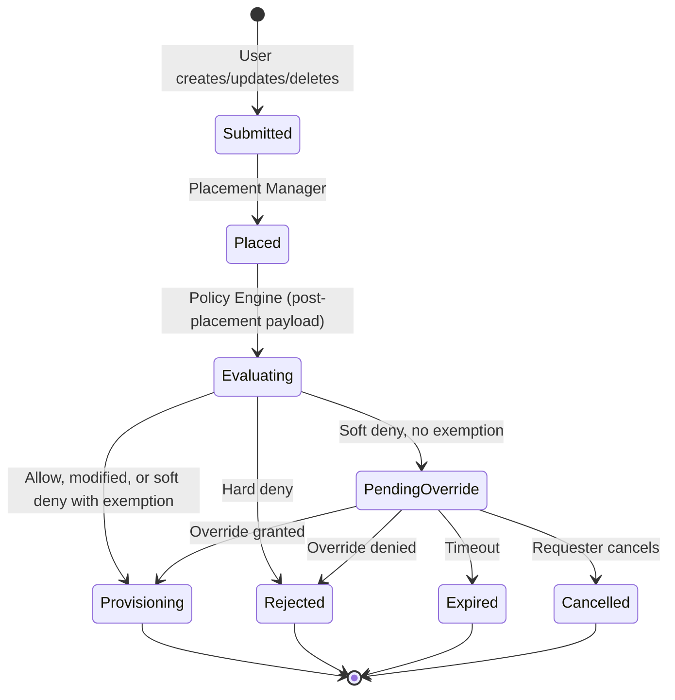
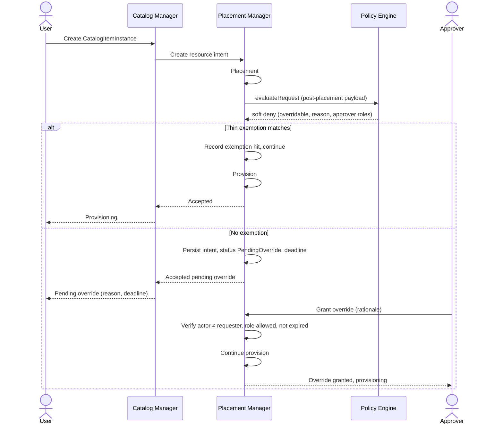

# Request approval

## Open Questions

These need team validation before implementation. Where a proposed approach is
stated, it is a suggestion only, not a decision.

1. **Primary model**  
   Some requirements ask for approving requests before they are processed. The
   Policy Engine and related design input favor automated allow or deny, with a
   human step only when a soft policy blocks. Confirm or reject?

   > [!NOTE] **Proposed approach**  
   > Keep automation as the default. A human is involved only after a soft
   > policy has already blocked the request; that person may grant or deny a
   > timed override for that denial.  
   > Out of initial scope: a separate “approve before process” gate that holds
   > creates for human review even when policy did not deny them. That idea
   > stays deferred.

2. **Approver identity**  
   Who may approve in the initial scope (global admin only, roles from the
   policy outcome, or a configurable list)?

   > [!NOTE] **Proposed approach**  
   > When the Policy Engine returns a soft deny, it also returns which roles may
   > approve. The person who grants or denies must hold one of those roles and
   > must not be the same person who submitted the request.

3. **Operations in scope**  
   Create only, or also update and delete when a soft policy blocks?

   > [!NOTE] **Proposed approach**  
   > Apply the same soft-deny override path to create, update, and delete
   > whenever those operations already run through policy evaluation.

4. **Composite requests (UC #2)**  
   When a composite create (or other lifecycle op) soft-denies, should override
   apply per child resource or once for the whole parent application?

   > [!NOTE] **Proposed approach**  
   > Per child. See
   > [Composite requests (parent vs child override)](#composite-requests-parent-vs-child-override).

5. **GitOps**  
   GitOps already has a human step before apply. The GitOps controller submits
   through the same catalog and placement path as the API, so a soft deny can
   still park the request in `PendingOverride`. That creates a second human gate
   after git review, and it is unclear who the requester and approver are when
   the submitter is a controller identity, not a person. What should the initial
   scope do?

   - **Same override flow:** GitOps-submitted requests can enter
     `PendingOverride` like any other client. Ops grant or deny via the override
     API after the PR already merged.
   - **Skip human override for GitOps:** Treat git review as enough. Soft deny
     for GitOps-managed instances does not wait on `PendingOverride` (exact rule
     TBD: auto-allow, fail soft deny as hard, or another policy).
   - **Out of initial scope:** Do not special-case GitOps yet. Soft deny behaves
     the same for every client, and a GitOps-specific rule waits until both
     features are in use together.

   No proposed approach yet.

6. **Auth / RBAC**  
   Is [authentication](../authentication/authentication.md) plus enough RBAC for
   “approver is not the requester” required before the initial implementation?

7. **Five override mechanisms**  
   Are Override Policy, Exception Grant, Manual Override, Compensating Control,
   and Dual Approval required? Confirm?

   > [!NOTE] **Proposed approach**  
   > For the initial scope, ship one-shot human override per request (**Manual
   > Override**) and a thin soft-deny exemption so a known exception class can
   > auto-allow without a human (see Soft-deny exemption in Proposal). Leave
   > full standing grants and the other three mechanisms for later.

8. **Exemption match shape**  
   How coarse may initial-scope matching be (policy id / reason code plus
   optional namespace, team, or catalog type)?

   > [!NOTE] **Proposed approach**  
   > Match only on soft-deny reason or policy id, plus optional coarse scope
   > such as namespace, team, or catalog type. Do not match on rich payload
   > fields in the initial scope. That level of matching waits for full standing
   > grants.

## Summary

This enhancement adds a governed human step when a **soft** policy blocks a
service request. Automation stays the default: if policy allows the request, it
provisions as today. If policy soft-denies, the request can wait for another
person (not the requester) to grant or deny a timed override through the API
(CLI and UI use the same API). Hard denials stay non-overridable. The initial
scope also proposes a thin exemption so a known soft-deny class can auto-allow
without asking a human every time. Full standing grants come later.

**Initial scope** means the first delivery of this enhancement: one-shot
soft-deny override plus thin exemption. Later work is under Deferred and
Non-Goals. Reviewer scenarios: [`use-cases.md`](./use-cases.md).

## Motivation

SREs and platform admins sometimes need a governed exception when policy blocks
a request that still has to go through for a business reason (for example a
short capacity burst or a soft placement rule). Today DCM only has automated
allow, deny, and mutate in the Policy Engine. There is no audited human path to
unblock a soft denial, and no lifecycle for waiting on an approver. If DCM has
no official override path, teams tend to provision outside DCM or loosen the
policy so the soft case always passes. Repeating the same soft deny for an
already decided exception class also trains rubber-stamping. This enhancement
adds a human path and a minimal way to skip re-asking for a known class, while
keeping automation as the default.

### Goals

- When a soft policy blocks a request and no thin exemption matches, park the
  request in `PendingOverride` (name may change) instead of rejecting it at once
- Let an authorized actor who is not the requester **grant** or **deny** a one
  shot, timed override via API (CLI and UI use the same API)
- On grant, resume placement and provisioning for that request. On deny or
  timeout, end the request with a clear reason
- Let an authorized admin create a **thin soft-deny exemption** so matching soft
  denies auto-allow and never enter `PendingOverride`
- Keep hard policy denials non overridable in the initial scope
- Audit one-shot grant, deny, expiry, and exemption use with actor, rationale,
  and scope
- Document deferred approval ideas so the team can schedule them later

### Non-Goals

- Replacing or redesigning the Policy Engine allow, deny, mutate, and agent
  selection pipeline
- A **pre-provision approval queue** where matching requests wait for a human
  before provisioning starts (see Deferred)
- Dual approval, sequential multi approver chains, or quorum (N of M)
- **Full standing grants** in the initial scope (rich matchers, planned
  exception workflows, auto-promoting a one-shot human grant into a reusable
  rule, delegated issuer product flows). See thin exemption vs standing grants
  below
- The rest of the five mechanism catalog beyond Manual Override and the thin
  exemption
- Depending on unmerged UDLM Class hierarchy or related proposals
- Integrating ServiceNow (or similar) so an external ticket is the official
  approve/deny decision. DCM owns the override lifecycle
- Shipping a library of Rego policies. This doc defines the override contract
  and lifecycle only

## Proposal

Concrete reviewer scenarios (payloads, flows, initial scope vs deferred) live in
[`use-cases.md`](./use-cases.md).

### Assumptions

- Policy evaluation already runs on create (and later on other lifecycle ops)
  through Placement Manager and Policy Engine
- Soft and hard deny run on the **post-placement** payload (CatalogItem
  validation stays early). See [`use-cases.md`](./use-cases.md)
- Policies can mark denials as **soft** (overridable) or **hard** (not
  overridable), or the initial scope adds that to the evaluate response
- Authenticated actor identity is available on grant, deny, and exemption
  management calls (see Open Question 6)

### Soft-deny exemption (thin object)

> [!NOTE] This is a **proposed implementation choice**, not a closed decision.
> The intent is to ship a small auto-skip for “we already decided this exception
> class, stop asking every time,” and leave room for follow-up work that grows
> into **full standing grants** without rewriting the human override path.

**Initial-scope thin exemption (proposed):**

- A named, revocable object with optional `expires_at`
- Match is coarse: soft-deny reason or policy id, plus optional scope
  (namespace, team, or catalog type). See Open Question 8
- When a soft deny would fire and an active exemption matches, DCM **allows**
  and does not enter `PendingOverride`
- Created and revoked by a policy or platform admin role (not the requester’s
  one-shot approve path)
- Each auto-allow records which exemption applied

**Example:** Soft deny reason `vm.memory.soft_max` would normally park a large
VM create in `PendingOverride`. A platform admin creates exemption `ex-burst-q3`
for that reason, scoped to team `platform`, with `expires_at` at end of quarter.
While it is active, matching creates for that team auto-allow. Audit records
`ex-burst-q3`. After expiry (or revoke), the next matching create parks for a
human again.

**Order at the soft-deny gate:**

1. Soft deny candidate on the post-placement payload
2. If a thin exemption matches → allow (no human)
3. Else → `PendingOverride` → human grant or deny

**Why not full standing grants in the first implementation:**

- Less surface to build and review first: one-shot approve/deny for a parked
  request, plus a simple create/revoke exemption. Full standing grants need a
  richer inventory, matchers, and admin UX. Ship the human override path before
  that larger product
- Coarse match avoids designing a full waiver query language and inventory
  product up front
- Who may create, renew, and audit long-lived waivers is an org process question
  (roles, review cadence, blast radius). Agreeing that process is separate from
  agreeing that one person can approve one soft-denied request
- Auto-promoting a one-shot human grant into a reusable rule needs match
  inference and collision rules. That is easy to get wrong early

**Temporary limitations (solved later by standing grants):**

| Initial-scope thin exemption limit                | Standing grants later                                        |
| ------------------------------------------------- | ------------------------------------------------------------ |
| Coarse match only                                 | Rich match on payload fields and composed conditions         |
| No planned-exception / Override Policy workflow   | First-class planned waiver lifecycle                         |
| Human one-shot grant does not create an exemption | Optional capture of a human decision as a lasting rule       |
| Simple create / revoke / optional expiry          | Renew, supersede, delegated issuers, richer audit product    |
| Exemption and Manual Override are separate        | Unified exception inventory with clear skip vs no-skip rules |

**Evolution:** Treat the thin exemption as a subset shape of a future standing
grant (or migrate exemptions in a follow-on enhancement). The initial scope can
ship without waiting for the full standing-grant design to be finished.

### Composite requests (parent vs child override)

A composite request (UC #2) is one parent application made of several child
resources (for example a VM and a database). Soft deny can hit one child and not
the others. That raises a design choice for this enhancement.

**The problem:**

- Soft deny and hard deny evaluate per child after that child’s placement, not
  on the parent as a single blob
- If only one child soft-denies, should a human approve that child alone, or
  approve the whole parent once?
- Parent-only approval is simpler for the requester (“one button for the app”)
  but hides which child failed, and can over-approve children that never needed
  an override
- Child-only approval matches how policy already runs, and keeps audit tied to
  the real denial, but the parent composite must stay incomplete until every
  blocked child is granted, denied, expired, or cancelled
- Thin exemptions also apply per child soft deny, not at parent level

**Proposed approach (Open Question 4):**

- Each soft-denied child gets its own `PendingOverride` (or thin-exemption
  auto-allow) using the same rules as a standalone request
- Children with no soft deny are not asked for override
- The parent stays pending while any child is still in `PendingOverride`
- On child grant, that child continues. On child deny or timeout, that child
  ends as rejected or expired. What the parent shows when children disagree
  (some provisioned, some failed) is owned by the composite orchestration
  design, not by this override enhancement
- A single parent-level approval gate that covers all children stays deferred

> [!NOTE] Confirm or reject in Open Question 4 before treating parent-level
> approval as in scope.

### User Stories

#### Story 1: Soft policy blocks, override granted

As a platform engineer, when my VM create is blocked by a soft sizing or
placement policy, I ask for an override and give a rationale. An authorized SRE
(not me) grants a timed override. DCM resumes provisioning for that request
only. The grant and later progress are auditable.

#### Story 2: Soft policy blocks, override denied or expired

As an SRE, I deny an override, or nobody acts before timeout. The request ends
as denied or expired. The requester sees why. Nothing is provisioned.

#### Story 3: Hard policy blocks

As a user, when a hard compliance policy denies my request, DCM rejects it at
once. There is no override API for that denial in the initial scope.

#### Story 4: Admin reviews pending overrides

As an SRE, I list pending overrides in CLI or UI, check requester, reason, and
deadline, then grant or deny.

#### Story 5: Known exception class skips the human

As a platform admin, I create a thin exemption for soft deny reason
`vm.memory.soft_max` in team `platform` until a given date. Later VM creates
that would soft-deny for that reason in that team auto-allow. No
`PendingOverride`. The audit trail names the exemption. When the exemption
expires or is revoked, the next matching request parks for human override again.

### Implementation Details/Notes/Constraints

#### Relationship to Policy Engine

Today `POST .../policies:evaluateRequest` returns success (`APPROVED` or
`MODIFIED`) or rejection. The initial scope extends the soft-deny path so
Placement Manager can:

1. After placement, evaluate soft or hard deny on the resolved payload
2. On soft deny, check active thin exemptions. On match, allow and continue
3. If no exemption matches, persist the intent as `PendingOverride` with a
   deadline and return a client visible pending state
4. On one-shot grant, continue the existing SP Resource Manager path
5. On deny or timeout, mark the intent terminal and stop

Field names belong in OpenAPI at implementation time. This enhancement requires
these **outcome classes**: allow, hard deny, soft deny overridable (then
exemption match or pending override).

#### Proposed API surface (conceptual)

- List or get pending override requests (filter by status, requester, deadline)
- Grant override by an authorized actor
- Deny override by an authorized actor
- Requester may cancel their pending override
- Create, list, revoke thin soft-deny exemptions (admin)

CLI and UI are clients of this API (epic acceptance criteria). Paths and field
names belong in OpenAPI at implementation time. Illustrative bodies:

```yaml
# Grant override
request_id: req-123
rationale: Temporary capacity burst for launch week
expires_at: "2026-09-30T00:00:00Z" # optional

# Deny override
request_id: req-123
rationale: Soft max still applies; resize the VM

# Create thin soft-deny exemption (admin)
reason_or_policy_id: vm.memory.soft_max
scope:
  team: platform
expires_at: "2026-09-30T00:00:00Z"
rationale: Platform burst window Q3
```

#### Timeout

Every pending override has a deadline. On expiry, DCM cancels the request and
records `Expired`. Default duration is configuration. Policies may suggest a
shorter bound (details at implementation).

#### Deferred items

Do **not** treat these as required for the initial scope unless the team expands
Goals later:

1. **Pre-provision approval queue**: park requests in `PendingApproval` when a
   rule matches, before provisioning, even if no policy denied
2. **Dual approval, sequential chains, or quorum**
3. **Override Policy** artifacts (standing planned exceptions)
4. **Full standing grants / Exception Grant**: richer matchers, planned waiver
   lifecycle, optional capture of a human one-shot decision as a lasting rule.
   The initial scope’s thin exemption is the intentional subset. See Soft-deny
   exemption
5. **Compensating Control** substitution flows
6. **Parent only approval** for composite applications
7. **GitOps specific** human gates (until OQ 5 is closed)
8. Dependence on unmerged UDLM Class or profile floors as a prerequisite
9. Policy-engine **mutate and re-validate until stable** loops, and cycle or
   non-determinism detection at execution or admission time. Those belong in
   policy-engine (or related) enhancements, not in this approval lifecycle

Dropping deferred items later is expected, not a design failure.

### Risks and Mitigations

| Risk                                                                            | Mitigation                                                                                                             |
| ------------------------------------------------------------------------------- | ---------------------------------------------------------------------------------------------------------------------- |
| Requirements are read as needing a full pre-provision and multi mechanism model | State the initial scope in Goals, Non-Goals, and Deferred items. Keep Open Question 1 open until validated             |
| Soft vs hard is missing in the current Policy Engine                            | Add an explicit denial class in the evaluate outcome before enabling pending override                                  |
| Self approval breaks separation of duties                                       | Reject grant when actor equals requester. Require an approver role match                                               |
| Pending overrides pile up forever                                               | Mandatory timeout with auto cancel. List or alert near deadlines                                                       |
| Thin exemptions become a silent bypass catalog                                  | Require rationale, expiry or review, and metrics on exemption hits vs human overrides                                  |
| Auth or RBAC is not ready                                                       | Call out OQ 6. Gate the API behind a feature flag until identity exists                                                |
| Scope creep from external maximal designs                                       | Goals, Non-Goals, and Deferred items define the initial scope. New mechanisms need a new enhancement or a Goals change |

## Design Details

### Request lifecycle (initial scope)



### Soft deny override sequence



### Data model (conceptual)

**Example:** pending override

```json
{
  "id": "ovr-...",
  "resource_request_id": "...",
  "status": "pending|granted|denied|expired|cancelled",
  "denial_class": "soft",
  "policy_reason": "...",
  "eligible_approver_roles": ["platform-sre"],
  "requester_actor_id": "...",
  "approver_actor_id": null,
  "rationale": null,
  "created_at": "...",
  "expires_at": "...",
  "resolved_at": null
}
```

**Example:** thin soft-deny exemption

```json
{
  "id": "ex-...",
  "reason_or_policy_id": "vm.memory.soft_max",
  "scope": {
    "team": "platform"
  },
  "rationale": "Platform burst window Q3",
  "created_by_actor_id": "...",
  "created_at": "...",
  "expires_at": "...",
  "revoked_at": null
}
```

### Upgrade / Downgrade Strategy

- **Upgrade:** New statuses, override APIs, and exemption APIs are additive.
  Clients that treat any policy rejection as a hard error keep working if soft
  deny pending is a distinct status they can ignore until they update.
- **Downgrade / disable:** A feature flag or config turns soft deny pending and
  exemptions off. Soft denials then behave as today (immediate rejection).
  Inflight `PendingOverride` records should expire or cancel on disable.
  Document the choice in release notes.

## Implementation History

N/A — Draft still in review. Track progress in the PR and commit history
instead.

## Drawbacks

- **A second path beside pure automation.** People may lean on overrides instead
  of fixing policies. That raises operational load and weakens the signal from
  governance. Acceptable if overrides are timed, audited, and metrics flag
  policies that are overridden often.
- **Thin exemptions can hide soft policy debt.** A coarse skip may stay forever
  if nobody reviews expiry. Acceptable if exemptions require rationale, prefer
  an end date, and standing grants later add a stronger inventory and review
  model.
- **Initial scope is narrower than a full pre-provision approval product.**
  Teams that expect every matching create to wait for a human may call this
  incomplete. Goals, Deferred items, and Open Question 1 make that disagreement
  visible before coding.

## Alternatives

### Alternative 1: Pre-provision approval queue as initial scope

#### Description

Matching rules send selected requests to `PendingApproval` before provisioning,
even when no policy denied. Humans approve to start work.

#### Pros

- Matches requirements that want approve-before-processed
- Familiar ServiceNow style request gate

#### Cons

- Slower happy path. Fights automation first
- Larger auth and UX surface before override semantics exist
- Easy to confuse with Policy Engine `APPROVED` status naming

#### Status

Deferred

#### Rationale

Latency and scope outweigh the benefit for the initial scope. Soft deny override
covers the governed exception path in UC #16. Revisit if Open Question 1’s
proposed approach is rejected in review.

### Alternative 2: Full five mechanism catalog in the initial scope

#### Description

Ship Override Policy, Exception Grant, Manual Override, Compensating Control,
and Dual Approval together as the epic’s “several approval policies.”

#### Pros

- Matches maximal external design input in one pass
- Covers planned, pre authorized, and emergency paths

#### Cons

- High design and review cost. Unclear done criteria
- Most mechanisms stay unused until org process matures
- Blocks merge on decisions the initial scope does not need

#### Status

Deferred

#### Rationale

Breadth can wait. Manual Override plus a thin exemption covers the human loop
and “stop re-asking” without the full catalog. Extra mechanisms should be follow
on enhancements or later Goals edits.

### Alternative 3: Full standing grants in the initial scope (no thin subset)

#### Description

Ship rich Exception Grant / standing grants as the primary soft-deny resolution.
Human `PendingOverride` is only the rare fallback. Include rich matchers, waiver
lifecycle, and optionally promote a human grant into a lasting rule.

#### Pros

- Matches the “human-in-the-loop must stay rare” product direction strongly
- Avoids a later migration from thin exemption to standing grant

#### Cons

- Larger match, RBAC, and inventory surface before the one-shot path is proven
- Org process for long-lived waivers is undecided
- Auto-capture of human decisions needs inference rules the initial scope does
  not have

#### Status

Deferred (evolution of the thin exemption)

#### Rationale

Operational and design cost of full standing grants outweighs shipping UC #16
and a coarse auto-skip first. The thin exemption is the deliberate on-ramp.

### Alternative 4: Automated Policy Engine only (no human path)

#### Description

Keep allow, deny, and mutate only. Operators change Rego or ask for policy
updates when blocked.

#### Pros

- No new lifecycle or approval UX
- Already designed in the policy engine enhancement

#### Cons

- No governed exception for soft blocks
- Does not meet the human approval acceptance need for this capability

#### Status

Rejected

#### Rationale

Epic acceptance needs a human approval path. Pure automation is necessary but
not enough.

## Infrastructure Needed

N/A. No new repositories or CI systems. Implementation uses existing control
plane APIs, CLI, and UI once auth and RBAC prerequisites are met.
