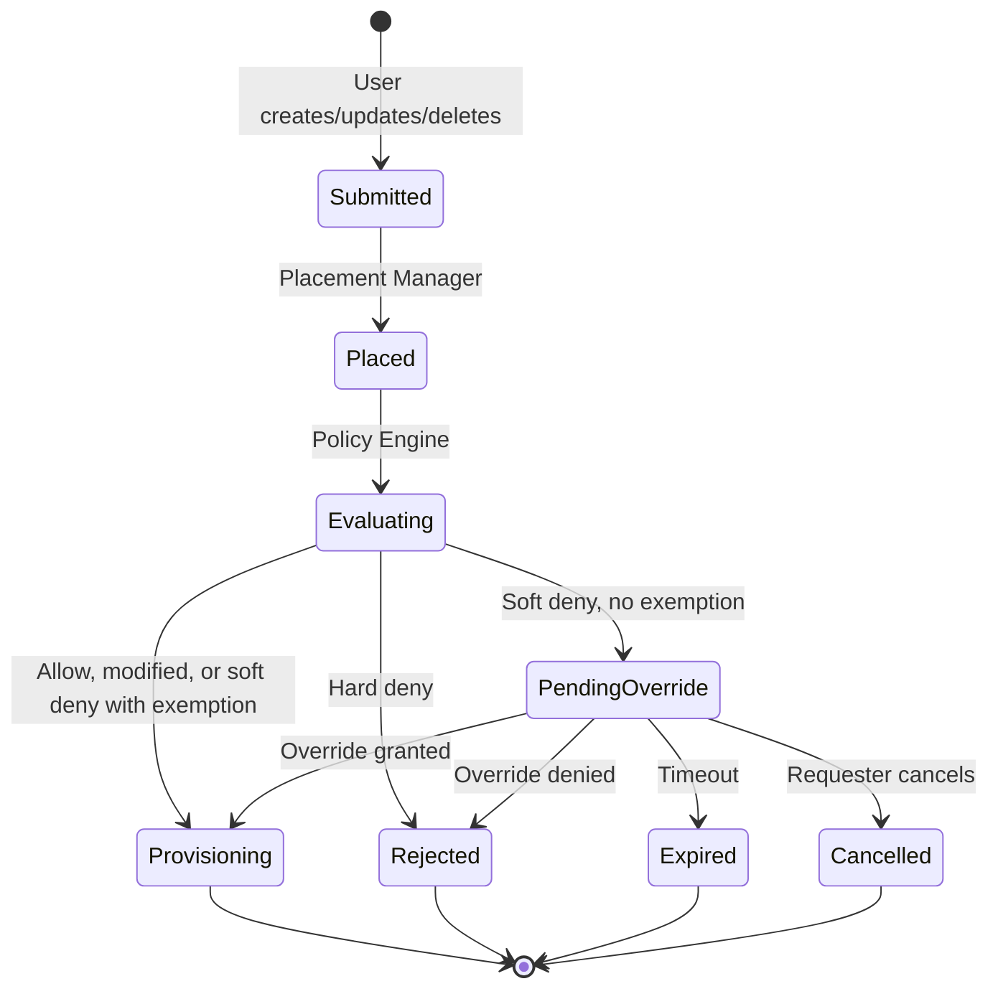

# Request approval: use cases

Companion to [`request-approval.md`](./request-approval.md). Local scenarios for
review. Not the DCM UC #1–#21 numbering. Status names may change at
implementation time.

Initial scope targets **UC #16** (policy override after soft deny). **UC #19**
(profile policy resolution) is out of scope here. See the enhancement Summary
for what **initial scope** means. Composite parent vs child override is defined
in the enhancement (Open Question 4), not as a scenario here.

Pre-provision approval without a policy deny is deferred (see Deferred and
enhancement Open Question 1).

## Diagrams

Lifecycle for these scenarios (soft/hard deny after placement; thin exemption
can skip `PendingOverride`). Same shape as the enhancement request lifecycle.

Sequence detail:
[Soft deny override sequence](./request-approval.md#soft-deny-override-sequence).

## Approval scenarios

Unless noted, **Scope:** Initial scope · **Maps to:** UC #16.

Soft-deny and hard-deny evaluation run **after placement**, on the
post-placement payload (not on bare catalog intent alone). CatalogItem checks
still run earlier as today.

### Soft deny

#### Granted

Soft policy blocks a create. An authorized approver (not the requester) approves
a timed override and records a reason. Provisioning continues.

Soft policy examples:

- `container`: soft deny image tag `latest`
- `database`: soft deny create without `labels.owner`
- `cluster`: soft deny `nodes.control_plane.count: 1` when `labels.tier` is `ha`
- `storage`: soft deny `volume_mode: Block`
- `vm`: soft deny memory above `64GB`

**Flow:**

1. Create is accepted and CatalogItem validation runs as today.
2. Placement Manager runs placement (agents and post-placement payload).
3. Policy Engine returns soft deny with reason and eligible approver roles.
4. No thin exemption matches. Request stored as `PendingOverride` with a
   deadline.
5. Approver approves the override and records a reason.
6. Provisioning continues for that placed request (SP Resource Manager path).

**End state:** Resource provisions. Audit links requester, approver, reason, and
the soft denial.

Other outcomes:

- **Denied:** Approver denies and records a reason. End state: `Rejected`.
  Nothing provisioned.
- **Timed out:** Deadline passes with no grant, deny, or cancel. End state:
  `Expired`. Nothing provisioned.
- **Cancelled by requester:** Requester cancels. End state: `Cancelled`.
- **Self approval rejected:** Requester tries to approve their own override.
  Approval is rejected. End state: still `PendingOverride` until another
  eligible approver acts or timeout.

### Hard deny

#### Not overridable

Hard policy blocks a create. No override path.

Hard policy examples:

- `container`: image must come from an approved registry
- `database`: only `postgresql` is allowed for this tenant
- `cluster`: Kubernetes version must be at least `4.16`
- `storage`: access mode must not be `ReadWriteMany`
- `vm`: guest OS must be on the approved image list

**Flow:**

1. Placement Manager runs placement.
2. Policy Engine returns hard deny.
3. DCM rejects at once. No `PendingOverride`.

**End state:** Immediate rejection with reason.

### Soft deny on delete

**Scope:** Initial scope if Open Question 3 includes delete.

#### Granted

Soft policy blocks a delete. Approver approves the override and records a
reason. Delete proceeds.

Soft policy examples:

- `container`: soft deny delete outside the maintenance window
- `database`: soft deny delete of a shared database
- `cluster`: soft deny delete of a production cluster
- `storage`: soft deny delete of volumes marked retain
- `vm`: soft deny delete when the VM still has attached volumes

**End state:** Resource deleted. Audit ties the approval and reason to the
delete intent.

### Soft deny with thin exemption

**Scope:** Initial scope · **Maps to:** UC #16 (auto-skip branch).

Known exception class: soft deny would fire, but an active thin exemption
matches. No human step.

Example: soft deny reason `vm.memory.soft_max`, exemption for team `platform`.

**Flow:**

1. Placement completes. Soft deny candidate on the post-placement payload.
2. Thin exemption matches (reason/policy id, optional scope such as team).
3. No `PendingOverride`. Request proceeds.
4. Audit records the exemption id.

**End state:** Allowed without a human. If the exemption expires or is revoked,
the next matching request uses the Soft deny human path above.

### Deferred

**Scope:** Deferred · **Maps to:** not UC #16 as initial scope.

- **Pre-provision gate:** Approve matching creates before provision even when
  policies allow. See enhancement Open Question 1.
- **Dual approval:** Two approvers required for a destructive delete.
- **Full standing grants:** Richer match, waiver lifecycle, and optional
  “promote a one-shot grant into a lasting rule.” Initial scope stops at the
  thin exemption scenario above.
