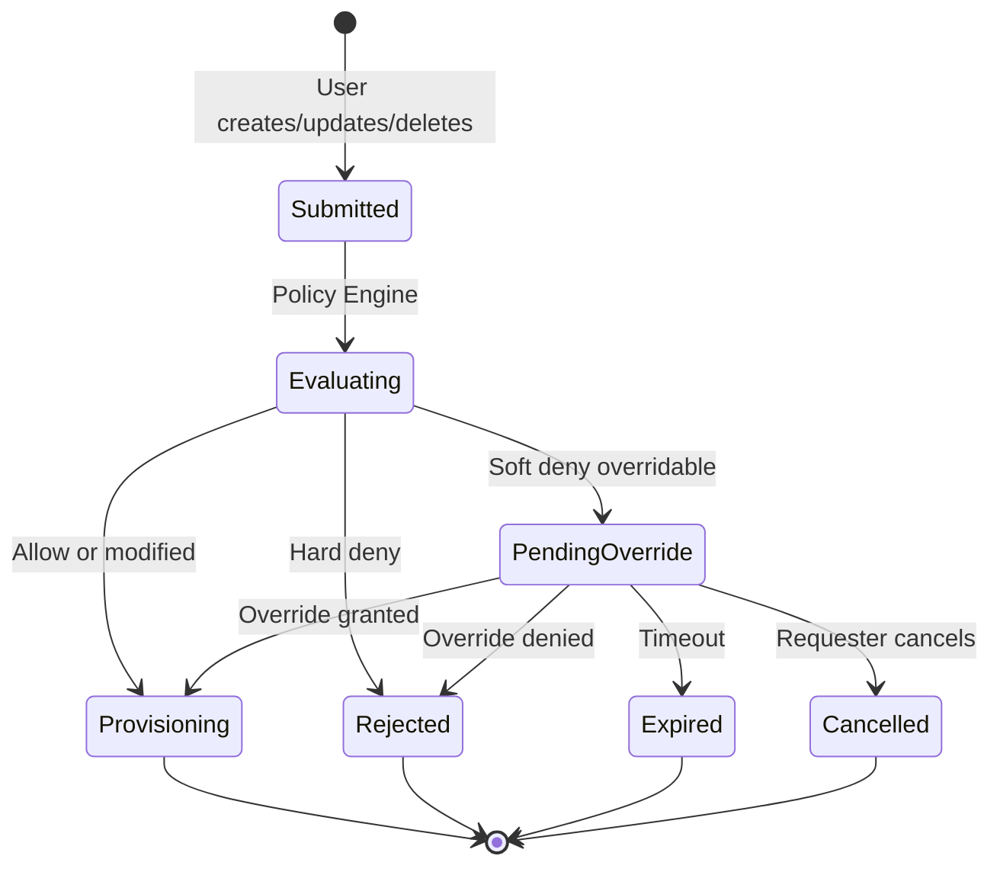

# Request approval: use cases

Companion to [`request-approval.md`](./request-approval.md). Local scenarios for
review. Not the DCM UC #1–#21 numbering. Status names may change at
implementation time.

V1 targets **UC #16** (policy override after soft deny). **UC #2** is composite
context only. **UC #19** (profile policy resolution) is out of scope here.

Pre-provision approval without a policy deny is deferred (see Deferred and
enhancement Open Question 1).

## Diagrams

Copied for review convenience. Canonical copy:
[Request lifecycle (V1)](./request-approval.md#request-lifecycle-v1). Sequence
detail:
[Soft deny override sequence](./request-approval.md#soft-deny-override-sequence).

## Approval scenarios

Unless noted, **Scope:** V1 · **Maps to:** UC #16.

### Soft deny

#### Granted

Soft policy blocks a create. An authorized approver (not the requester) approves
a timed override and records a reason. Provisioning continues.

Soft policy examples:

- `container`: soft deny image tag `latest`
- `database`: soft deny create without `labels.owner`
- `cluster`: soft deny `nodes.control_plane.count: 1` when `labels.tier` is `ha`
- `storage`: soft deny `volume_mode: Block`
- `vm`: soft deny memory above `64GB`

**Flow:**

1. Create reaches Placement Manager and Policy Engine.
2. Soft deny with reason and eligible approver roles.
3. Intent stored as `PendingOverride` with a deadline.
4. Approver approves the override and records a reason.
5. Placement and provisioning resume for that request.

**End state:** Resource provisions. Audit links requester, approver, reason, and
the soft denial.

Other outcomes:

- **Denied:** Approver denies and records a reason. End state: `Rejected`.
  Nothing provisioned.
- **Timed out:** Deadline passes with no grant, deny, or cancel. End state:
  `Expired`. Nothing provisioned.
- **Cancelled by requester:** Requester cancels. End state: `Cancelled`.
- **Self approval rejected:** Requester tries to approve their own override.
  Approval is rejected. End state: still `PendingOverride` until another
  eligible approver acts or timeout.

### Hard deny

#### Not overridable

Hard policy blocks a create. No override path.

Hard policy examples:

- `container`: image must come from an approved registry
- `database`: only `postgresql` is allowed for this tenant
- `cluster`: Kubernetes version must be at least `4.16`
- `storage`: access mode must not be `ReadWriteMany`
- `vm`: guest OS must be on the approved image list

**Flow:**

1. Policy Engine returns hard deny.
2. DCM rejects at once.

**End state:** Immediate rejection with reason.

### Soft deny on delete

**Scope:** V1 if Open Question 3 includes delete.

#### Granted

Soft policy blocks a delete. Approver approves the override and records a
reason. Delete proceeds.

Soft policy examples:

- `container`: soft deny delete outside the maintenance window
- `database`: soft deny delete of a shared database
- `cluster`: soft deny delete of a production cluster
- `storage`: soft deny delete of volumes marked retain
- `vm`: soft deny delete when the VM still has attached volumes

**End state:** Resource deleted. Audit ties the approval and reason to the
delete intent.

### Composite

**Scope:** V1 lean if Open Question 4 is per child · **Maps to:** UC #16 on a UC
#2 child.

#### Child needs override

Composite create (for example vm + database). One child soft denies. The other
is allowed.

Soft policy examples:

- `database` child: soft deny create without `labels.owner` (blocked)
- `vm` child: no matching soft deny (allowed)

**Flow:**

1. Orchestration evaluates children.
2. Allowed children may proceed or wait per orchestration rules.
3. Soft denied child enters `PendingOverride` for that child only.
4. Approver approves the override for the blocked child and records a reason.
5. Composite stays pending until that child clears.

**End state:** Children provision after the child override. No parent level
approval in V1.

### Deferred

**Scope:** Deferred · **Maps to:** not UC #16.

- **Pre-provision gate:** Approve matching creates before provision even when
  policies allow. See enhancement Alternative 1 and Open Question 1.
- **Dual approval:** Two approvers required for a destructive delete.
- **Standing exception grant:** Pre-authorized waiver for a time window, not a
  one-shot override per request.
