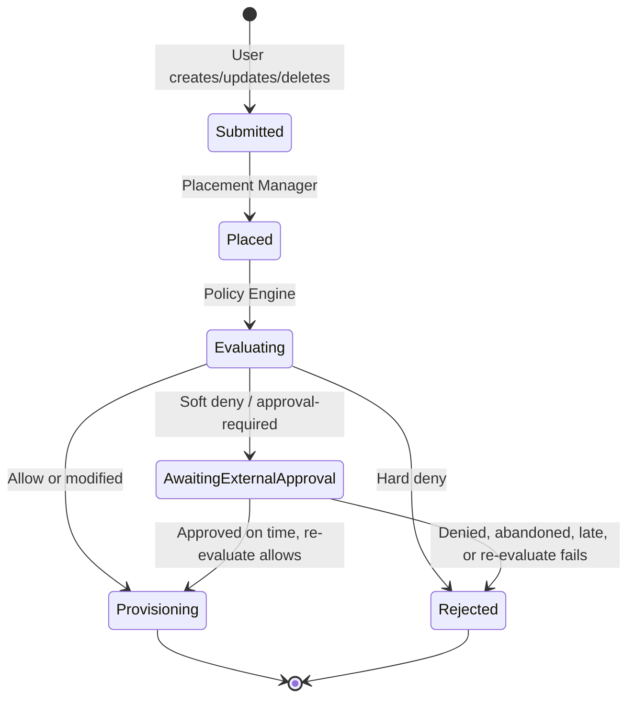

# Request approval: use cases

Companion to [`request-approval.md`](./request-approval.md). Local scenarios for
review. Not the DCM UC #1. #21 numbering. Outcome names may change at
implementation time.

Initial scope targets **UC #16**: soft deny / approval-required via Rego, human
step in an external ticketing system. See the enhancement Summary for what
**initial scope** means. Composite parent vs child is defined in the enhancement
(Open Question 3), not as a full scenario here.

## Diagrams

Lifecycle: soft/hard outcomes after placement. Soft path waits on external
approval.

Sequence detail:
[Soft deny and ticket sequence](./request-approval.md#soft-deny-and-ticket-sequence).

## Approval scenarios

Unless noted, **Scope:** Initial scope · **Maps to:** UC #16.

Soft and hard outcomes run **after placement**, on the post-placement payload.
CatalogItem checks still run earlier as today.

### Soft deny

#### Ticket approved on time

Evaluation soft-denies a create. Policy sets a validity window (for example
until end of Q2). **DCM opens** a ticket, parks, and monitors. Human approves in
the ticketing system before the window ends. DCM detects approve-on-time,
**re-evaluates**, and provisions only if evaluate allows.

Soft outcome examples (illustrative Rego reasons):

- `container`: soft deny image tag `latest`
- `database`: soft deny create without `labels.owner`
- `cluster`: soft deny `nodes.control_plane.count: 1` when `labels.tier` is `ha`
- `storage`: soft deny `volume_mode: Block`
- `vm`: soft deny memory above `64GB`

**Flow:**

1. Create is accepted and CatalogItem validation runs as today.
2. Placement Manager runs placement (agents and post-placement payload).
3. Policy Engine returns soft deny with `reason` and `valid_until` (or
   equivalent).
4. DCM parks the request, **opens** a ticket, and monitors status.
5. Approver approves in the ticketing system while still inside the validity
   window.
6. DCM detects approval, checks it is on time, **re-evaluates**, and provisions
   only if evaluate allows.

**End state:** Resource provisions after approve-on-time and re-evaluate allow.
Late approval is not accepted (see other outcomes).

Other outcomes:

- **Ticket denied:** Approver denies in the ticketing system. End state: not
  provisioned / rejected.
- **Abandoned:** No ticket action before validity ends. End state: expired / not
  provisioned.
- **Approved late:** Ticket approved after `valid_until`. End state: not
  provisioned. Approval invalid.
- **Re-evaluate soft or hard:** Approve-on-time but evaluate soft-denies again
  or hard-denies. End state: new ticket path or reject (no silent provision).

### Hard deny

#### Not overridable

Hard outcome rejects a create. No ticket path.

Hard outcome examples:

- `container`: image must come from an approved registry
- `database`: only `postgresql` is allowed for this tenant
- `cluster`: Kubernetes version must be at least `4.16`
- `storage`: access mode must not be `ReadWriteMany`
- `vm`: guest OS must be on the approved image list

**Flow:**

1. Placement Manager runs placement.
2. Policy Engine returns hard deny.
3. DCM rejects at once. No external approval path.

**End state:** Immediate rejection with reason.

### Soft deny on delete

**Scope:** Initial scope · **Maps to:** UC #16 (same ticket path as create).

Soft/ticket on delete only when **policy soft-denies that delete**. Not every
delete needs approval. Owner delete can stay allow in Rego.

#### Ticket approved on time

Soft deny on delete. **DCM opens** a ticket, parks, and monitors. Approver
approves in the ticketing system inside the validity window. DCM detects
approve-on-time, **re-evaluates**, and the delete proceeds only if evaluate
allows.

Soft outcome examples:

- `container`: soft deny delete outside the maintenance window
- `database`: soft deny delete of a shared database
- `cluster`: soft deny delete of a production cluster
- `storage`: soft deny delete of volumes marked retain
- `vm`: soft deny delete when the VM still has attached volumes

**End state:** Resource deleted after approve-on-time. Denied, abandoned, or
late approval: delete does not proceed.

### Soft deny on update

**Scope:** Initial scope · **Maps to:** UC #16 (same ticket path as create).

Same flow as create: soft deny after placement → DCM opens ticket → monitor →
re-evaluate → apply update only if approved on time and evaluate allows.

### Known exception in Rego

**Scope:** Initial scope · **Maps to:** UC #16 (no ticket branch).

Policy data (or Rego) excepts a soft **reason code** so soft deny does not fire.

Example: reason `vm.memory.soft_max` would soft-deny, but
`data.soft_deny_exceptions["vm.memory.soft_max"]` is set for a burst window.
(`vm.memory.soft_max` is an illustrative reason code, not a payload field path.)

**Flow:**

1. Placement completes. Evaluate runs on the post-placement payload.
2. Rego finds the reason excepted. Outcome is allow (or modified).
3. No ticket. Request provisions.

**End state:** Allowed without external ticketing. When exception data is
removed, the next matching create soft-denies again.

### Deferred

**Scope:** Deferred · **Maps to:** not UC #16 as initial scope.

- **Pre-provision gate:** Human approval even when policy did not soft-deny.
- **DCM-native pending override / grant API:** In-product human system of
  record.
- **DCM exemption inventory:** Standing grants as DCM objects.
- **Dual approval inside DCM.**
- **Soft on rehydration:** Decide when PE soft lands (inherit vs treat as hard).
  Not an epic AC. Rehydration already shares evaluate.
