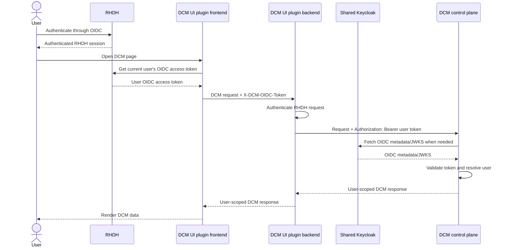

# RHDH DCM UI plugin authentication

## Open Questions

The following questions were considered and are resolved by this enhancement:

1. **How does a guest RHDH user authenticate?** When a guest user selects the
   DCM plugin in the RHDH UI, RHDH displays a popup requiring the user to log in
   through the configured Keycloak identity provider.
2. **What happens when RHDH authentication is disabled or no identity provider
   is configured?** The DCM UI plugin does not pass authentication to DCM, so it
   cannot use the authenticated-user flow described here.
3. **What is supported by the standalone DCM UI plugin development app?** The
   standalone app supports guest access only and does not provide full user
   authentication. Full RHDH is required for authenticated DCM UI requests.

## Summary

This enhancement enables the Red Hat Developer Hub (RHDH) DCM UI plugin to use
the user's RHDH-authenticated OIDC session and pass that user's access token
through to DCM. RHDH and DCM use the same Keycloak instance and realm, allowing
DCM to validate the forwarded token and resolve the individual user rather than
using a shared plugin identity. The legacy shared client-credentials token
exchange is removed from the normal UI path. This enhancement covers only the
interactive RHDH DCM UI flow. The `dcm-proxy` client and client-credentials
authentication remain available for programmatic RHDH integrations, CI
pipelines, and other non-interactive callers defined by the parent
authentication enhancement.

## Motivation

The DCM UI is rendered inside RHDH, where users already authenticate through
OIDC. A shared client-credentials token makes all UI requests appear to DCM as
the same actor and prevents DCM from applying identity-specific behavior. It
also creates a second token-acquisition path that is unnecessary when the RHDH
session already has an access token for the user.

The flow must preserve RHDH authentication while supplying DCM with the token
that DCM is expected to validate. The two credentials therefore have distinct
roles: the normal RHDH `Authorization` header authenticates the request to the
RHDH backend, and `X-DCM-OIDC-Token` carries the user's token for the DCM
upstream request.

### Goals

- Use the authenticated RHDH user's OIDC access token for DCM API requests.
- Preserve the normal RHDH `Authorization` header and require RHDH
  authentication before proxying a request.
- Carry the DCM token in `X-DCM-OIDC-Token` from the browser-side plugin client
  to the RHDH backend proxy.
- Forward that token to DCM as `Authorization: Bearer <token>`.
- Keep DCM JWT signature, issuer, expiry, and audience validation enabled.
- Resolve distinct DCM actors for distinct RHDH users.
- Remove the obsolete shared client-credentials and `/token` flow from normal
  DCM UI operation.
- Avoid logging or recording access tokens, secrets, complete authorization
  headers, or browser storage.

### Non-Goals

- Replacing the authentication architecture defined by the parent
  [authentication enhancement](/enhancements/authentication/authentication.md).
- Adding authorization or RBAC policy for DCM resources.
- Introducing a second Keycloak instance or separate DCM realm that requires
  token exchange or federation.
- Changing Keycloak user lifecycle, password management, or SSO behavior.
- Defining one universal Keycloak audience value for all RHDH deployments.
- Supporting unauthenticated DCM UI requests when DCM authentication is enabled.

## Proposal

The DCM UI plugin obtains the current user's OIDC access token through the RHDH
authentication API and adds it to the dedicated `X-DCM-OIDC-Token` header on
requests to the RHDH DCM backend route. The backend authenticates the incoming
request with RHDH's normal authentication service, requires a non-empty DCM
token header, and forwards the token to DCM as a bearer token.

RHDH and DCM must use the same Keycloak instance and realm because DCM directly
validates the RHDH-issued token. DCM's accepted audience is configurable and
must be present in that token, either through the client configuration or an
audience mapper. A separate DCM realm would require token exchange or federation
and is outside this enhancement. The example uses the `dcm` realm and `dcm-api`
audience, but these are not plugin requirements.

### User Stories

- As an authenticated RHDH user, I can open the DCM UI and have DCM apply
  permissions and audit behavior to my individual identity.
- As a guest RHDH user, when I select the DCM plugin, I receive a Keycloak login
  popup and can continue after authenticating through the configured identity
  provider.
- As an administrator running RHDH without authentication or without an identity
  provider, I do not receive an unauthenticated token forwarded to DCM.
- As a developer using the standalone DCM UI plugin app, I can use guest access,
  but I need full RHDH to exercise authenticated user requests.

### Assumptions

- RHDH and DCM can reach the same Keycloak issuer and trust its TLS certificate.
- The RHDH session has a user OIDC access token available through the RHDH
  authentication API.
- DCM is configured with the issuer for the same Keycloak realm used by RHDH.
- The RHDH-issued token contains the audience DCM expects. This may be
  configured directly on the client or added with a Keycloak audience mapper.
- The resulting issuer and audience are explicitly checked without recording the
  token.
- The RHDH backend proxy route is reachable by the DCM UI plugin and the DCM
  control-plane endpoint is reachable by the RHDH backend.

### Implementation Details/Notes/Constraints

The plugin's DCM API clients obtain the current OIDC access token for each DCM
request and add it as `X-DCM-OIDC-Token`. The backend proxy performs these
checks in order:

1. Authenticate the incoming request with RHDH's normal authentication
   mechanism.
2. Require a non-empty `X-DCM-OIDC-Token` header.
3. Send the header value upstream as `Authorization: Bearer <token>`.
4. Do not replace or repurpose the incoming RHDH `Authorization` header.
5. Do not log either token or include token values in diagnostics or test
   evidence.

Missing RHDH authentication or a missing `X-DCM-OIDC-Token` header is rejected.
The DCM control plane remains responsible for cryptographic JWT validation,
including signature, issuer, expiry, and audience checks. The plugin and proxy
do not weaken those checks or disable TLS verification.

The audience must not be inferred from the RHDH client ID. The RHDH Keycloak
client must include a dedicated DCM audience in the access token, either through
its client configuration or an audience mapper. The example uses `dcm-api`, and
DCM is configured with `AUTH_JWT_AUDIENCE=dcm-api`. The generic Keycloak
`account` audience observed during early lab validation is not suitable for the
documented DCM integration because it is not specific to the RHDH-to-DCM flow.

The authenticated flow requires full RHDH with a configured identity provider.
When RHDH authentication is disabled or no identity provider is configured, the
plugin must not forward authentication to DCM. The standalone plugin development
app supports guest access only and is not an equivalent environment for testing
full RHDH authentication.

### Risks and Mitigations

| Risk                                                                                          | Mitigation                                                                                                                                       |
| --------------------------------------------------------------------------------------------- | ------------------------------------------------------------------------------------------------------------------------------------------------ |
| DCM rejects valid RHDH tokens because the configured audience does not match the token.       | Inspect the token without recording it, configure DCM with the emitted audience, or add a Keycloak audience mapper and test the resulting token. |
| The custom DCM header is used to bypass RHDH authentication.                                  | Authenticate the normal RHDH request before reading or forwarding `X-DCM-OIDC-Token`.                                                            |
| A shared client-credentials token remains enabled and collapses all users into one DCM actor. | Remove the token acquisition utility from the UI proxy path and require the per-user header for every proxied DCM request.                       |
| Access tokens leak through logs, test output, browser artifacts, or error messages.           | Never log header values or raw tokens; sanitize evidence to status codes, header names, usernames, and sanitized actor IDs.                      |
| RHDH or DCM cannot validate the shared Keycloak issuer because of TLS trust problems.         | Install the required CA trust for the environment and keep certificate verification enabled; do not use insecure TLS overrides.                  |
| A user's token expires while the RHDH session remains active.                                 | Obtain the current token through the RHDH authentication API for each request and rely on the normal RHDH token-refresh behavior.                |

## Design Details

### RHDH DCM UI plugin request flow



### Token and audience contract

Here, **Proxy** refers to the backend portion of the DCM UI plugin running
inside RHDH. It receives requests from the plugin frontend, authenticates the
incoming RHDH request, and forwards the user's DCM token to the DCM control
plane as a bearer token. It does not acquire a shared token or replace the RHDH
authentication credential.

The relevant request contract is:

```text
RHDH request to proxy:
  Authorization: <RHDH session credential>
  X-DCM-OIDC-Token: <user OIDC access token>

Proxy request to DCM:
  Authorization: Bearer <user OIDC access token>
```

The example DCM configuration contract is:

```yaml
env:
  AUTH_DISABLED: "false"
  AUTH_ISSUER_URL: "https://<shared-keycloak>/realms/dcm"
  AUTH_JWT_AUDIENCE: "dcm-api"
```

These are the actual DCM control-plane environment variables. The RHDH client
must be configured so its access token contains `dcm-api`, either directly or
through a Keycloak audience mapper. Deployments may use another realm and
audience, but the shared realm, issuer, token audience, and DCM values must
remain consistent.

### Validation scenarios

Acceptance evidence must come from an environment containing real Keycloak,
RHDH, and DCM components. Unit tests with mocked identity providers may
supplement this evidence but do not replace it. The browser or API integration
path should publish a redacted pass/fail report and identify any failed
scenario:

| Scenario                 | Required executable evidence                                                                                                                                      |
| ------------------------ | ----------------------------------------------------------------------------------------------------------------------------------------------------------------- |
| Actor separation         | Authenticate as Alice and Bob through the same RHDH and Keycloak setup, make DCM requests for each user, and verify that DCM resolves different actor identities. |
| Authentication rejection | Verify that requests without RHDH authentication or without `X-DCM-OIDC-Token` are rejected by the RHDH proxy.                                                    |
| JWT validation           | Submit tokens with an invalid issuer, signature, expiry, and configured audience, and verify that DCM rejects each token.                                         |
| Legacy flow removal      | Capture the UI request flow and verify that it does not call a shared `/token` endpoint or use a client-credentials token.                                        |
| TLS verification         | Exercise the RHDH-to-DCM and DCM-to-Keycloak connections with certificate verification enabled, and verify that an untrusted certificate is rejected.             |
| Token redaction          | Inspect application logs, diagnostics, browser storage, and CI artifacts and verify that they contain no raw tokens, secrets, or complete authorization headers.  |

### Upgrade / Downgrade Strategy

N/A - This is a net-new enhancement and does not change an existing deployed
implementation. The parent authentication enhancement's programmatic and CI
authentication paths remain outside this upgrade and downgrade scope.

## Implementation History

- 2026-09-09: Added the enhancement describing user-token forwarding from the
  RHDH DCM UI plugin to DCM.
- 2026-09-09: Replaced the generic `account` audience path with the dedicated
  `dcm-api` audience requirement.
- 2026-09-22: Clarified the boundary between interactive RHDH UI authentication
  and programmatic or CI authentication, and documented acceptance scenarios.

## Drawbacks

- The flow couples the RHDH plugin and DCM proxy to a dedicated header and
  requires both components to be upgraded consistently.
- DCM administrators must understand the audience emitted by their Keycloak
  configuration; the audience may differ between RHDH releases or client
  configurations.
- Per-user token forwarding means DCM must handle more user identities and token
  expiry behavior than a shared service identity would.

These costs are accepted because they preserve user identity, avoid a second
credential exchange, and allow DCM's existing JWT validation to enforce the
security boundary.

## Alternatives

### Alternative 1: Shared client-credentials token

#### Description

The current legacy implementation keeps a client ID and client secret in the
backend proxy, acquires one shared token, and uses that token for all DCM UI
requests.

#### Pros

- Does not require the plugin to obtain a user access token.
- Gives the proxy a stable machine identity and simple token lifecycle.

#### Cons

- All users appear as the same DCM actor.
- User-specific policy and audit behavior cannot be preserved.
- Requires storage and rotation of a shared client secret.
- Retains a separate token endpoint and failure mode.

#### Status

Replaced

#### Rationale

This implementation is being replaced because the loss of per-user identity and
the operational cost of a shared secret outweigh the simpler proxy
implementation for an interactive RHDH UI.

### Alternative 2: Configure a separate Keycloak instance for DCM

#### Description

Use one Keycloak instance for RHDH and another for DCM, then exchange or
federate tokens between them.

#### Pros

- Separates administration and client configuration.
- Allows DCM to control its own identity-provider lifecycle.

#### Cons

- Adds another identity system, issuer, trust relationship, and operational
  failure mode.
- Requires token exchange or federation configuration.
- Makes the tested per-user forwarding path more complex.

#### Status

Rejected

#### Rationale

The additional identity-provider and token-exchange complexity serves no current
use case because RHDH and DCM are intended to use the same Keycloak instance.
This alternative could be revisited if future requirements call for separate
identity-provider administration or isolation between RHDH and DCM.

## Infrastructure Needed

- A shared Keycloak instance and realm reachable by RHDH and DCM.
- A configured RHDH client and, where needed, a Keycloak audience mapper that
  adds the dedicated DCM audience to user access tokens.
- TLS trust configuration between RHDH, DCM, and Keycloak with certificate
  verification enabled.
- A full RHDH environment with a configured identity provider for validating
  authenticated user flows.
- The standalone DCM UI plugin development app for guest-only development and
  validation; it does not replace the full RHDH environment.
