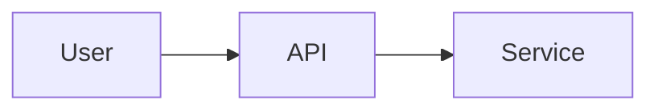

# Sample Enhancement

This is a sample enhancement to demonstrate the format and structure.

## Summary

Add a new feature that improves X by doing Y.

## Motivation

Users currently struggle with Z. This enhancement addresses that.

### Goals

- Demonstrate the enhancement format
- Show how to include images

### Non-Goals

- Production-ready implementation

## Proposal

The proposed solution adds a new component as shown below:

### Implementation Details/Notes/Constraints

Keep it simple for the first iteration.

### Risks and Mitigations

**Risk:** Example risk. _Mitigation:_ Example mitigation.

## Design Details

See diagram above.

## Alternatives

### Alternative 1

**Description:** Do nothing.

**Why rejected:** Doesn't solve the problem.
