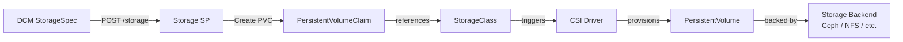
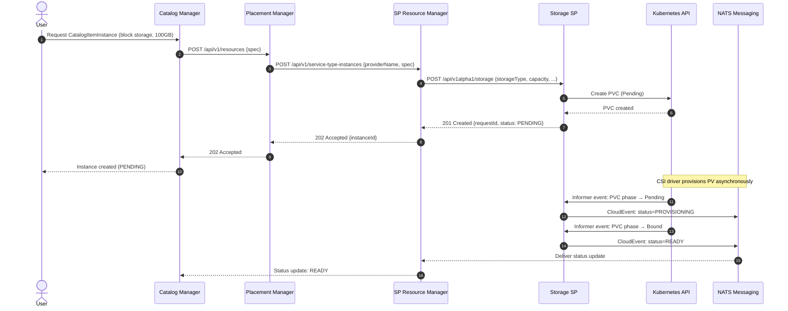
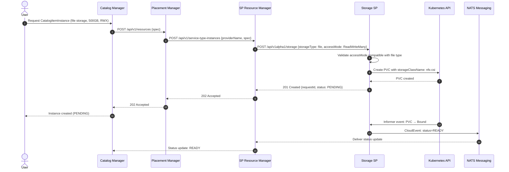
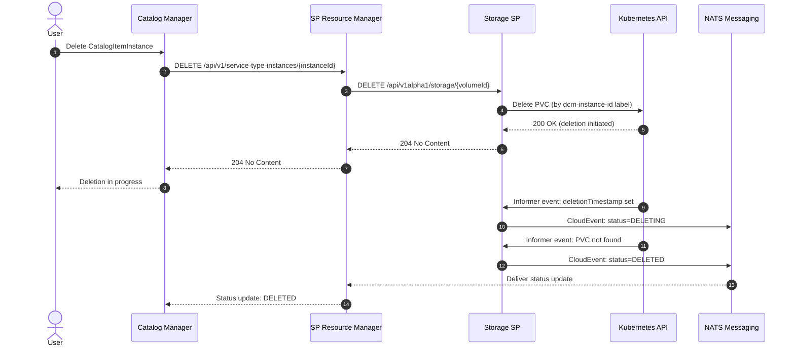

# CSI Storage Service Provider

## Open Questions

> 1. Should StorageClass discovery be a dedicated endpoint
>    (`GET /api/v1alpha1/storage/classes`) or embedded in the registration
>    metadata advertised to DCM? The current proposal keeps both — registration
>    metadata carries a static snapshot while the endpoint reflects live cluster
>    state.
> 2. Should the Storage SP manage its own Kubernetes namespace for PVCs, or
>    should it accept a per-request namespace override via `providerHints`? v1
>    uses a single configured namespace; per-request namespace is deferred.
> 3. The `service-type-definitions.md` currently lists standalone storage as a
>    Non-Goal. This document introduces `storage` as a fifth service type.
>    Updating that document is a prerequisite for this SP to be accepted.

## Summary

The CSI Storage Service Provider (Storage SP) is a REST API that manages
persistent storage volumes on Kubernetes clusters via the Container Storage
Interface (CSI). It supports two storage categories: block storage (PVCs backed
by block devices such as Ceph RBD) and file storage (PVCs backed by shared
filesystems such as NFS or CephFS). The SP implements the `storage` service
type schema, which must be added to
`enhancements/service-type-definitions/service-type-definitions.md` as a
prerequisite. The Storage SP is deployed as a Podman container alongside the
other DCM services using `podman-compose`, and connects to one or more target
Kubernetes clusters externally via a kubeconfig file.

## Motivation

Persistent storage is a first-class infrastructure concern. The existing service
type definitions explicitly exclude standalone storage volumes, and the K8s
Container SP marks "Persistent volume support" as a Non-Goal. This leaves a gap
in DCM's ability to manage the full lifecycle of infrastructure resources.
Applications deployed via the K8s Container SP or KubeVirt SP often need
dedicated, persistent volumes that outlive individual workloads, can be shared
across pods, or must be provisioned independently from the compute layer.

### Goals

- Define the lifecycle of a Service Provider managing persistent storage on
  Kubernetes clusters via CSI.
- Define the registration flow with the DCM SP Registry, including capability
  advertisement.
- Define `CREATE`, `READ`, `DELETE`, and `LIST` endpoints for PersistentVolumeClaims
  (PVCs).
- Define a `StorageClass` discovery endpoint so DCM and users can determine
  valid `providerHints` values without trial and error.
- Define the status reporting mechanism using CloudEvents over NATS.
- Support both block storage and file storage types within a single SP instance.
- Define the `storage` service type schema (`StorageSpec`).

### Non-Goals

- Day 2 operations: resize, snapshot, clone, backup, or any update to an
  existing volume.
- CSI driver installation or management — the driver must be pre-installed on
  the target cluster.
- StorageClass creation or management — StorageClasses must be pre-configured
  on the target cluster.
- Direct PersistentVolume (PV) management — the SP manages PVCs; the CSI driver
  handles PV lifecycle.
- Attaching volumes to workloads (Pods, VMs, containers) — v1 provisions
  standalone storage only.
- Multi-cluster storage replication or disaster recovery.
- `UPDATE` endpoint — deferred to a future version.
- Per-request namespace override — deferred to a future version.

## Proposal

### User Stories

#### Story 1 — Block Storage for a Stateful Workload

As a platform engineer, I want to provision a 100 GB block storage volume
backed by Ceph RBD on my production cluster, so that my database workload has a
dedicated, high-performance persistent volume that survives pod restarts.

#### Story 2 — Shared File Storage for a Multi-Writer Application

As a developer, I want to provision a 500 GB file storage volume accessible by
multiple pods simultaneously (`ReadWriteMany`), so that my shared data pipeline
can write from several workers at once without coordinating storage access
manually.

#### Story 3 — Admin Visibility into Available Storage

As an administrator, I want to query the Storage SP for the list of available
StorageClasses (including their provisioner, reclaim policy, and supported
access modes), so that I can configure catalog offerings that reference valid
storage tiers without having to log in to the cluster directly.

### Assumptions

- The target Kubernetes cluster has a compatible CSI driver installed and at
  least one StorageClass configured.
- The Storage SP has RBAC permissions to manage `PersistentVolumeClaim`,
  `PersistentVolume`, and `StorageClass` resources in its configured namespace.
- The DCM Service Provider Registry is reachable for registration.
- The Storage SP has valid Kubernetes credentials (kubeconfig mounted into the
  container).
- The DCM NATS messaging system is reachable for publishing status updates.
- Network policies allow the Storage SP container to reach both the DCM control
  plane and the target Kubernetes API server.

### Integration Points

#### Kubernetes CSI Integration

The Storage SP uses `k8s.io/client-go` to interact with the Kubernetes API
server of the target cluster. It does not communicate directly with the CSI
driver; instead it relies on Kubernetes' dynamic provisioning: creating a PVC
against a configured StorageClass triggers the CSI driver to provision a PV
automatically.



During creation, each PVC is labeled with:

- `managed-by=dcm`
- `dcm-instance-id=<UUID>`
- `dcm-service-type=storage`

The `dcm-instance-id` UUID is generated by DCM and passed in the request. If a
PVC with the same `metadata.name` already exists in the configured namespace,
the SP returns `409 Conflict` without modifying the existing resource.

#### DCM SP Registry

The Storage SP registers automatically on startup with the DCM SP Registrar.
See
[DCM Registration Flow](https://github.com/dcm-project/enhancements/blob/main/enhancements/sp-registration-flow/sp-registration-flow.md)
for the full process.

#### DCM SP Health Check

The Storage SP must expose a health endpoint
`http://<provider-ip>:<port>/api/v1alpha1/health` for the DCM control plane to
poll every 10 seconds. See
[SP Health Check](https://github.com/dcm-project/enhancements/blob/main/enhancements/service-provider-health-check/service-provider-health-check.md).

The health check verifies:

- Connectivity to the target Kubernetes API server.
- Availability of the default StorageClass (`SP_DEFAULT_STORAGE_CLASS`).

#### DCM SP Status Reporting

The Storage SP publishes status updates to the NATS messaging system using
CloudEvents format. Events are published to the subject:

`dcm.providers.{providerName}.storage.instances.{instanceId}.status`

See
[SP Status Reporting](https://github.com/dcm-project/enhancements/blob/main/enhancements/state-management/service-provider-status-reporting.md).

A `SharedIndexInformer` watches PVC resources labeled with
`managed-by=dcm,dcm-service-type=storage` and triggers status publications on
state changes.

### SP Configuration

The Storage SP is configured entirely through environment variables, which are
set in the `docker-compose.yml` file (see [Running the SP](#running-the-sp)).

| Variable                 | Required | Default | Description                                 |
| ------------------------ | -------- | ------- | ------------------------------------------- |
| `SP_NAME`                | Yes      |         | Unique provider name for DCM registration   |
| `SP_ENDPOINT`            | Yes      |         | Full URL of this SP's base API endpoint     |
| `SP_K8S_KUBECONFIG`      | Yes      |         | Path to the mounted kubeconfig file         |
| `SP_NATS_URL`            | Yes      |         | NATS server URL (e.g., `nats://nats:4222`)  |
| `SP_K8S_NAMESPACE`       | Yes      |         | Kubernetes namespace for all managed PVCs   |
| `SP_DEFAULT_STORAGE_CLASS` | No     | `standard` | Default StorageClass when none specified |

### Registration Flow

The Storage SP must successfully register with DCM before it can receive
requests. Registration runs in a background goroutine after the HTTP listener
is ready. Failures are retried with exponential backoff.

Example registration payload:

```golang
dcm "github.com/dcm-project/service-provider-api/pkg/registration/client"

request := &dcm.RegistrationRequest{
    Name:        "csi-storage-sp",
    ServiceType: "storage",
    DisplayName: "CSI Storage Service Provider",
    Endpoint:    fmt.Sprintf("%s/api/v1alpha1/storage", apiHost),
    Metadata: dcm.Metadata{
        Capabilities: dcm.ProviderCapabilities{
            SupportedStorageTypes: []string{"block", "file"},
            SupportedAccessModes: []string{
                "ReadWriteOnce",
                "ReadOnlyMany",
                "ReadWriteMany",
            },
            AvailableStorageClasses: []string{"ceph-rbd", "nfs-csi", "standard"},
        },
    },
    Operations: []string{"CREATE", "READ", "DELETE"},
}
```

#### Capability Advertisement

The `metadata.Capabilities` field advertises what this SP instance supports.
DCM and the Placement Manager can query registered providers to match storage
requests to capable providers before routing.

| Field                    | Type       | Description                                          |
| ------------------------ | ---------- | ---------------------------------------------------- |
| `supportedStorageTypes`  | `[]string` | Storage types this SP can provision: `block`, `file` |
| `supportedAccessModes`   | `[]string` | PVC access modes: `ReadWriteOnce`, `ReadWriteMany`, `ReadOnlyMany` |
| `availableStorageClasses` | `[]string` | StorageClass names available on the target cluster  |

The SP populates `availableStorageClasses` by listing all StorageClasses on
the target cluster at startup. If a request specifies a StorageClass not in
this list, the SP returns `422 Unprocessable Entity`.

#### Registration Request Validation

The registration payload must conform to the requirements defined in the
[SP registration flow](https://github.com/dcm-project/enhancements/blob/main/enhancements/sp-registration-flow/sp-registration-flow.md).

Storage SP-specific requirements:

- `serviceType` must be set to `"storage"`.
- `operations` must include at minimum: `CREATE`, `READ`, `DELETE`.

### API Endpoints

The CRUD endpoints are consumed by the DCM SP Resource Manager.

#### Endpoints Overview

| Method | Endpoint                                | Description                       |
| ------ | --------------------------------------- | --------------------------------- |
| POST   | `/api/v1alpha1/storage`                 | Create a new storage volume       |
| GET    | `/api/v1alpha1/storage`                 | List all storage volumes          |
| GET    | `/api/v1alpha1/storage/{volumeId}`      | Get a storage volume              |
| DELETE | `/api/v1alpha1/storage/{volumeId}`      | Delete a storage volume           |
| GET    | `/api/v1alpha1/storage/classes`         | List available StorageClasses     |
| GET    | `/api/v1alpha1/health`                  | Storage SP health check           |

These endpoints are defined based on AEP standards and use `aep-openapi-linter`
to check for compliance with AEP.

#### POST /api/v1alpha1/storage

**Description:** Create a new storage volume (PVC).

The request body follows the `StorageSpec` schema defined in the
[StorageSpec Schema](#storagespec-schema) section below. PVC names must be
lowercase alphanumeric with hyphens only and must not exceed 253 characters. If
`metadata.name` violates these constraints, the SP returns `422 Unprocessable
Entity` with an explanation rather than forwarding an invalid name to Kubernetes.

**Example Request — Block Storage:**

```json
{
  "storageType": "block",
  "capacity": "100GB",
  "accessMode": "ReadWriteOnce",
  "metadata": { "name": "database-volume" },
  "providerHints": {
    "kubernetes": {
      "storageClassName": "ceph-rbd",
      "volumeMode": "Filesystem"
    }
  },
  "serviceType": "storage"
}
```

**Example Request — File Storage:**

```json
{
  "storageType": "file",
  "capacity": "500GB",
  "accessMode": "ReadWriteMany",
  "metadata": { "name": "shared-data" },
  "providerHints": {
    "kubernetes": {
      "storageClassName": "nfs-csi"
    }
  },
  "serviceType": "storage"
}
```

**Response:** Returns `201 Created`. The initial status is always `PENDING`.

```json
{
  "requestId": "123e4567-e89b-12d3-a456-426614174000",
  "name": "database-volume",
  "status": "PENDING",
  "storageType": "block",
  "capacity": "100GB",
  "accessMode": "ReadWriteOnce",
  "metadata": {
    "namespace": "dcm-storage",
    "createdAt": "2026-05-10T12:00:00Z"
  }
}
```

**Error Handling:**

| Code | Condition                                                              |
| ---- | ---------------------------------------------------------------------- |
| 400  | Invalid request payload or missing required fields                     |
| 409  | PVC with the same `metadata.name` already exists in the namespace      |
| 422  | Unsupported `storageType`, invalid `accessMode` for type, invalid PVC name, or unknown `storageClassName` |
| 500  | Unexpected error during PVC creation                                   |

> **Note on admission webhooks:** Some Kubernetes clusters enforce PVC
> admission policies via webhooks (e.g., resource quotas, storage policies). If
> the Kubernetes API server rejects the PVC creation due to a webhook, the SP
> maps this to `422 Unprocessable Entity` rather than `500 Internal Server
> Error`.

> **Note on concurrent DELETE:** A PVC in `Pending` state can be deleted. The
> SP will issue the Kubernetes `DELETE` call immediately and set the DCM status
> to `DELETING`.

#### GET /api/v1alpha1/storage

**Description:** List all storage volumes managed by this SP, with pagination.

**Query Parameters:**

- `max_page_size` (optional): Maximum number of volumes per page. Default: 50.
- `page_token` (optional): Pagination token from a previous response.

The handler queries PVCs labeled with `managed-by=dcm,dcm-service-type=storage`
and returns fully-populated volume objects per AEP-132.

**Example Response:**

```json
{
  "results": [
    {
      "requestId": "123e4567-e89b-12d3-a456-426614174000",
      "name": "database-volume",
      "status": "READY",
      "storageType": "block",
      "capacity": "100GB",
      "accessMode": "ReadWriteOnce"
    }
  ],
  "next_page_token": "a1b2c3d4"
}
```

**Error Handling:**

- **400 Bad Request**: Invalid pagination parameters.
- **500 Internal Server Error**: Unexpected error querying the cluster.

#### GET /api/v1alpha1/storage/{volumeId}

**Description:** Get a specific storage volume by its DCM instance ID.

The SP looks up the PVC by the `dcm-instance-id` label. The response schema is
identical to the POST response.

**Error Handling:**

- **404 Not Found**: No PVC with the specified `volumeId` exists.
- **500 Internal Server Error**: Unexpected error querying the cluster.

#### DELETE /api/v1alpha1/storage/{volumeId}

**Description:** Delete a storage volume.

Deletes the PVC identified by `dcm-instance-id` label and returns
`204 No Content` on success.

> **Note on reclaim policy:** Kubernetes' reclaim policy on the backing
> StorageClass determines whether the PV (and its data) is deleted or retained
> after the PVC is removed. StorageClasses with `Retain` policy will leave the
> PV intact; this SP does not manage PV cleanup.

**Error Handling:**

- **404 Not Found**: No PVC with the specified `volumeId` exists.
- **500 Internal Server Error**: Unexpected error during deletion.

#### GET /api/v1alpha1/storage/classes

**Description:** List all StorageClasses available on the target cluster.

This endpoint is unique to the Storage SP. It enables DCM administrators and
users to discover valid values for `providerHints.kubernetes.storageClassName`
without requiring direct cluster access.

**Example Response:**

```json
{
  "results": [
    {
      "name": "ceph-rbd",
      "provisioner": "rbd.csi.ceph.com",
      "reclaimPolicy": "Delete",
      "allowVolumeExpansion": true,
      "supportedAccessModes": ["ReadWriteOnce"]
    },
    {
      "name": "nfs-csi",
      "provisioner": "nfs.csi.k8s.io",
      "reclaimPolicy": "Delete",
      "allowVolumeExpansion": false,
      "supportedAccessModes": ["ReadWriteOnce", "ReadOnlyMany", "ReadWriteMany"]
    }
  ]
}
```

**Error Handling:**

- **500 Internal Server Error**: Unable to list StorageClasses from the cluster.

#### GET /api/v1alpha1/health

**Description:** Health check for the Storage SP.

Verifies connectivity to the Kubernetes API server and availability of the
default StorageClass. Returns `200 OK` with optional body per the
[SP Health Check](https://github.com/dcm-project/enhancements/blob/main/enhancements/service-provider-health-check/service-provider-health-check.md)
specification.

```json
{
  "status": "pass",
  "version": "v0.1.0",
  "uptime": 3600
}
```

### StorageSpec Schema

The `storage` service type is a new fifth service type that must be added to
`enhancements/service-type-definitions/service-type-definitions.md`. The schema
follows the same common-fields pattern (`serviceType`, `metadata`,
`providerHints`) used by all other service types.

#### Core Fields

Plus common fields: `serviceType`, `metadata`, `providerHints`, `id`, `status`,
`statusMessage`, `createTime`, `updateTime`.

| Field         | Required | Type   | Description                                              |
| ------------- | -------- | ------ | -------------------------------------------------------- |
| `storageType` | Yes      | string | `block` or `file`                                        |
| `capacity`    | Yes      | string | Requested size with unit (e.g., `"100GB"`, `"1TB"`)      |
| `accessMode`  | No       | string | `ReadWriteOnce` (default for block), `ReadOnlyMany`, or `ReadWriteMany` (default for file) |

#### providerHints.kubernetes Fields

| Field              | Type              | Description                                     |
| ------------------ | ----------------- | ----------------------------------------------- |
| `storageClassName` | string            | Target StorageClass; defaults to `SP_DEFAULT_STORAGE_CLASS` |
| `volumeMode`       | string            | `Filesystem` (default) or `Block`; `Block` is only valid with `storageType: block` |
| `mountOptions`     | `[]string`        | Additional mount options passed to the CSI driver |
| `annotations`      | `map[string]string` | Arbitrary PVC annotations for CSI-driver-specific metadata (e.g., Ceph pool name, QoS class) |

#### Validation Rules

- `storageType: file` requires `accessMode: ReadWriteMany` or `ReadOnlyMany`.
  If `accessMode: ReadWriteOnce` is specified with `file`, the SP returns
  `422 Unprocessable Entity`.
- `volumeMode: Block` is only valid when `storageType: block`.
- `storageClassName`, if specified, must be present in the cluster's
  StorageClass list; otherwise the SP returns `422 Unprocessable Entity`.
- `metadata.name` must be a valid Kubernetes name: lowercase alphanumeric and
  `-`, max 253 characters, must not start or end with `-`.

### Translation Logic

The SP translates the provider-agnostic `StorageSpec` into a Kubernetes PVC.
Capacity values are converted from SI units (GB, TB) to Kubernetes binary units
(Gi, Ti): `1 GB = 1000/1024 Gi ≈ 0.931 Gi`; for simplicity, the SP rounds to
the nearest Gi.

| StorageSpec Field           | Kubernetes PVC Field                     |
| --------------------------- | ---------------------------------------- |
| `metadata.name`             | `metadata.name`                          |
| `storageType`               | Label `dcm-storage-type`                 |
| `capacity`                  | `spec.resources.requests.storage` (converted to Gi) |
| `accessMode`                | `spec.accessModes[]`                     |
| `providerHints.kubernetes.storageClassName` | `spec.storageClassName`  |
| `providerHints.kubernetes.volumeMode`       | `spec.volumeMode`        |
| `providerHints.kubernetes.mountOptions`     | StorageClass `mountOptions` (passed as annotation) |
| `providerHints.kubernetes.annotations`      | `metadata.annotations`   |

**Resulting PVC — Block Storage Example:**

```yaml
apiVersion: v1
kind: PersistentVolumeClaim
metadata:
  name: database-volume
  namespace: dcm-storage
  labels:
    managed-by: dcm
    dcm-instance-id: 123e4567-e89b-12d3-a456-426614174000
    dcm-service-type: storage
    dcm-storage-type: block
spec:
  accessModes:
    - ReadWriteOnce
  volumeMode: Filesystem
  resources:
    requests:
      storage: 93Gi
  storageClassName: ceph-rbd
```

**Resulting PVC — File Storage Example:**

```yaml
apiVersion: v1
kind: PersistentVolumeClaim
metadata:
  name: shared-data
  namespace: dcm-storage
  labels:
    managed-by: dcm
    dcm-instance-id: 456e7890-e89b-12d3-a456-426614174001
    dcm-service-type: storage
    dcm-storage-type: file
spec:
  accessModes:
    - ReadWriteMany
  volumeMode: Filesystem
  resources:
    requests:
      storage: 465Gi
  storageClassName: nfs-csi
```

### Status Reporting to DCM

The Storage SP uses a `SharedIndexInformer` to watch PVC resources and report
status changes asynchronously to DCM via CloudEvents over NATS.

#### Informer Setup

Resources are watched with the label selector `managed-by=dcm,dcm-service-type=storage`.
The `dcm-instance-id` label value is used as the `instanceId` in the CloudEvent
subject. An additional indexer on `dcm-instance-id` enables O(1) lookups during
event processing.

#### CloudEvent Format

```golang
type StorageStatus struct {
    Status   string `json:"status"`
    Capacity string `json:"capacity,omitempty"`
    Message  string `json:"message"`
}

event := cloudevents.NewEvent()
event.SetID("event-uuid")
event.SetSource("csi-storage-sp")
event.SetType("dcm.providers.csi-storage-sp.status.update")
event.SetSubject("dcm.providers.csi-storage-sp.storage.instances.{instanceId}.status")
event.SetData(cloudevents.ApplicationJSON, StorageStatus{
    Status:   "READY",
    Capacity: "93Gi",
    Message:  "PVC bound to PV successfully.",
})
```

#### Status Mapping

| DCM Status     | PVC Phase / Condition           | Description                          |
| -------------- | ------------------------------- | ------------------------------------ |
| `PENDING`      | Newly created (POST response)   | PVC created, awaiting CSI            |
| `PROVISIONING` | `Pending`                       | Waiting for CSI driver to provision  |
| `READY`        | `Bound`                         | PVC is bound to a PV                 |
| `FAILED`       | `Lost`                          | Backing PV is no longer available    |
| `DELETING`     | `deletionTimestamp` is set      | PVC deletion is in progress          |
| `DELETED`      | PVC not found                   | PVC has been fully removed           |

> **Note on NATS subject pattern:** This document follows the hierarchical
> subject format (`dcm.providers.{providerName}.{serviceType}.instances.{instanceId}.status`)
> used by the newer SPs (k8s-container-sp, acm-cluster-sp) rather than the
> flat `dcm.{serviceType}` pattern in the original status-reporting document.
> The hierarchical pattern is the authoritative convention going forward.

### User Flows

#### Create Block Storage Volume (End-to-End)



#### Create File Storage Volume (End-to-End)



#### Delete Storage Volume (End-to-End)



### Implementation Details

#### PVC Naming Validation

Kubernetes PVC names must satisfy RFC 1123 subdomain rules: lowercase
alphanumeric characters or hyphens, starting and ending with an alphanumeric
character, maximum 253 characters. The SP validates `metadata.name` before
sending any request to the Kubernetes API and returns `422 Unprocessable Entity`
with a descriptive message if the name is invalid.

### Risks and Mitigations

| Risk | Mitigation |
| ---- | ---------- |
| **WaitForFirstConsumer StorageClasses** — PVC stays `Pending` indefinitely until mounted by a Pod. Since v1 provisions standalone storage only (no Pod mounting), these StorageClasses will not work with this SP. | Document as a known limitation. Check StorageClass `volumeBindingMode` at creation time; if `WaitForFirstConsumer` is detected and no workload attachment is requested, return `422 Unprocessable Entity`. |
| **PVC protection** — Kubernetes defers PVC deletion while it is actively used by a Pod (`kubernetes.io/pvc-protection` finalizer). The SP issues the DELETE but the PVC may remain until the consuming Pod is removed. | Publish `DELETING` status immediately on DELETE request. Continue watching the informer until the PVC is fully removed and then publish `DELETED`. |
| **PVC admission webhook rejection** — Cluster admission controllers can reject PVC creation for quota, policy, or naming reasons. | Map Kubernetes admission webhook errors (HTTP 403 or rejection bodies) to `422 Unprocessable Entity` in the SP's error handling layer. |
| **StorageClass exhaustion** — The target StorageClass may run out of available capacity on the backend. | The CSI driver reports this via PVC events. The informer catches `ProvisioningFailed` events and publishes a `FAILED` status with the event message as `statusMessage`. |
| **NATS unavailability** — Status updates are lost if NATS is temporarily down. | Implement exponential backoff with a local in-memory retry queue for CloudEvent publishing. Critical transitions (READY, FAILED, DELETED) are retried for up to 5 minutes. |
| **Informer cache staleness** — The local informer cache can diverge from cluster state during network partitions. | Configure a 10-minute resync period on the `SharedIndexInformer` to force a full reconciliation. |

## Design Details

### Test Plan

- **Unit tests**: StorageSpec validation logic, translation logic (capacity
  conversion, PVC struct assembly), status mapping function, PVC name
  validation.
- **Integration tests** (against a real cluster using KIND): full CREATE →
  PENDING → PROVISIONING → READY → DELETE → DELETED lifecycle; 409 on
  duplicate name; 422 on unsupported StorageClass; StorageClass discovery
  endpoint.
- **End-to-end tests**: Trigger provisioning through DCM Catalog Manager using
  both block and file storage CatalogItems; verify CloudEvent delivery to NATS.

### Upgrade / Downgrade Strategy

- The Storage SP is stateless with respect to its own process — all state lives
  in Kubernetes PVC labels and in the DCM database. Upgrading the container
  image and restarting via `podman-compose up --pull always` is sufficient.
- No database migrations are required for v1.
- On downgrade, the informer will continue watching existing PVCs and report
  correct status. PVCs created by a newer version of the SP are backward
  compatible because they use only standard Kubernetes PVC fields.

## Implementation History

- **2026-05-10**: Initial enhancement document created.

## Drawbacks

The strongest argument against implementing this SP now is that the existing
service type definitions document explicitly excluded standalone storage, and
accepting this SP requires changing that decision. If the DCM architecture
moves toward bundled compute-plus-storage definitions (e.g., adding optional
PVC specs to ContainerSpec), a standalone Storage SP may be redundant. The
counter-argument is that many real-world workloads require independently
managed storage that outlives their compute layer.

## Alternatives

### Alternative 1: Direct CSI gRPC

#### Description

Communicate directly with the CSI driver's gRPC endpoints (`CreateVolume`,
`DeleteVolume`) instead of going through the Kubernetes PVC API.

#### Pros

- Lower latency for provisioning (bypasses Kubernetes reconciliation).
- Direct access to CSI driver-specific parameters.

#### Cons

- Duplicates the reconciliation and error-handling logic that Kubernetes already
  provides through the PVC controller.
- Requires SP-specific code per CSI driver (no portability across drivers).
- CSI gRPC is an internal interface not meant for external consumers.
- Loses Kubernetes RBAC, audit logging, and admission control benefits.

#### Status

Rejected

#### Rationale

The Kubernetes PVC API provides a stable, driver-agnostic abstraction. Using it
keeps the SP portable across all CSI drivers (Ceph RBD, NFS-CSI, AWS EBS, etc.)
without any driver-specific code in the SP.

### Alternative 2: Operator / CRD Pattern

#### Description

Deploy a Kubernetes Operator that watches a custom `StorageVolume` CRD and
reconciles it to PVCs, rather than exposing a REST API directly.

#### Pros

- Kubernetes-native reconciliation loop handles partial failures automatically.
- Declarative model aligns with GitOps practices.

#### Cons

- Breaks the REST API consistency maintained by all other DCM Service Providers.
- Requires installing a CRD and Operator on the target cluster, increasing the
  deployment footprint.
- The DCM SP Resource Manager expects a REST API; an Operator would need an
  adapter layer.

#### Status

Rejected

#### Rationale

All DCM Service Providers expose a REST API. Deviating to an Operator pattern
for a single SP would create an inconsistent integration surface for the SP
Resource Manager.

### Alternative 3: Block Storage Only in v1

#### Description

Support only block storage in the first version and defer file storage support.

#### Pros

- Smaller implementation scope and fewer test combinations.

#### Cons

- File storage (NFS/CephFS) uses the exact same Kubernetes PVC API as block
  storage. The only difference is in the `accessMode` and `storageClassName`.
  Implementing file storage alongside block adds negligible complexity.

#### Status

Rejected

#### Rationale

Since both storage types map to PVCs and the only differentiation is in
validation rules and default values, supporting both from the start avoids a
separate follow-up PR for a trivially small addition.

## Infrastructure Needed

### Repository

A new repository: `dcm-project/csi-storage-service-provider`

### Container Image

`quay.io/dcm-project/csi-storage-sp`

Built and published via GitHub Actions using the project's shared workflows.

### CI

GitHub Actions pipeline with:

- `make build` — build and push container image.
- `make test` — unit and integration tests against a KIND cluster.
- `make lint` — Go linter + `aep-openapi-linter`.

### Running the SP

The Storage SP is deployed as a Podman container using `podman-compose` (or
`docker-compose`). It does **not** run inside the Kubernetes cluster it manages;
it connects to the target cluster externally via a mounted kubeconfig file.

#### Prerequisites

- Podman ≥ 4.0 and `podman-compose` ≥ 1.0 (or Docker with docker-compose v2).
- A kubeconfig file with access to the target Kubernetes cluster.
- A running NATS server (provided by the DCM stack's own compose file).
- At least one StorageClass configured on the target cluster.

#### docker-compose.yml

```yaml
services:
  csi-storage-sp:
    image: quay.io/dcm-project/csi-storage-sp:latest
    ports:
      - "8080:8080"
    environment:
      SP_NAME: csi-storage-sp
      SP_ENDPOINT: http://csi-storage-sp:8080/api/v1alpha1/storage
      SP_K8S_KUBECONFIG: /kubeconfig/config
      SP_NATS_URL: nats://nats:4222
      SP_K8S_NAMESPACE: dcm-storage
      SP_DEFAULT_STORAGE_CLASS: standard
    volumes:
      - ${KUBECONFIG:-~/.kube/config}:/kubeconfig/config:ro
    healthcheck:
      test: ["CMD", "curl", "-f", "http://localhost:8080/api/v1alpha1/health"]
      interval: 10s
      timeout: 5s
      retries: 3
```

#### Makefile Targets (SP Repository)

```makefile
IMAGE ?= quay.io/dcm-project/csi-storage-sp
TAG   ?= latest

build:
	podman build -t $(IMAGE):$(TAG) .

push:
	podman push $(IMAGE):$(TAG)

run:
	podman-compose up -d

stop:
	podman-compose down

dev:
	go run ./cmd/csi-storage-sp/main.go

test:
	go test ./...

lint:
	golangci-lint run ./...

.PHONY: build push run stop dev test lint
```

#### Quickstart

```bash
# 1. Clone the repository
git clone https://github.com/dcm-project/csi-storage-service-provider.git
cd csi-storage-service-provider

# 2. Set kubeconfig path (or rely on the default ~/.kube/config)
export KUBECONFIG=/path/to/your/kubeconfig

# 3. Start the SP alongside the DCM stack
podman-compose up -d

# 4. Verify the SP is healthy
curl http://localhost:8080/api/v1alpha1/health

# 5. List available StorageClasses on the target cluster
curl http://localhost:8080/api/v1alpha1/storage/classes
```

## Known Limitations

1. **WaitForFirstConsumer StorageClasses**: StorageClasses with
   `volumeBindingMode: WaitForFirstConsumer` require a Pod to be scheduled
   before the PVC is bound. Since the Storage SP provisions standalone volumes
   with no associated workload, PVCs backed by such StorageClasses will remain
   in `Pending` indefinitely. The SP detects this at creation time and returns
   `422 Unprocessable Entity`.

2. **PVC protection finalizer**: Kubernetes adds the
   `kubernetes.io/pvc-protection` finalizer to PVCs that are mounted by a Pod.
   If a PVC is later mounted by a workload outside of DCM, the DELETE endpoint
   will initiate deletion but the PVC will not be fully removed until that
   workload releases the volume. The SP continues to report `DELETING` until the
   informer observes the PVC disappearing.

3. **No volume attachment in v1**: The Storage SP creates standalone PVCs only.
   Attaching a provisioned volume to a VM (via KubeVirt SP) or a container
   (via K8s Container SP) is not supported in v1 and is deferred to a future
   integration.

4. **Single namespace per SP instance**: All PVCs created by one SP instance
   land in the namespace defined by `SP_K8S_NAMESPACE`. Multi-namespace
   deployments require running multiple SP instances, each configured for a
   different namespace.

## Follow-Up Work

The following items are explicitly out of scope for this document but must be
tracked:

- Update `enhancements/service-type-definitions/service-type-definitions.md`:
  add `storage` as a fifth service type and remove the "standalone storage
  volumes are NOT included" Non-Goal.
- Update `enhancements/state-management/service-provider-status-reporting.md`:
  add the `storage` status enum (`PENDING`, `PROVISIONING`, `READY`, `FAILED`,
  `DELETING`, `DELETED`) and the `StorageStatus` Go struct.
- Update `enhancements/user-flows/user-flows.md`: add Storage SP to the system
  overview table (section 1) and to the SP instance creation flow (section 6.4).
