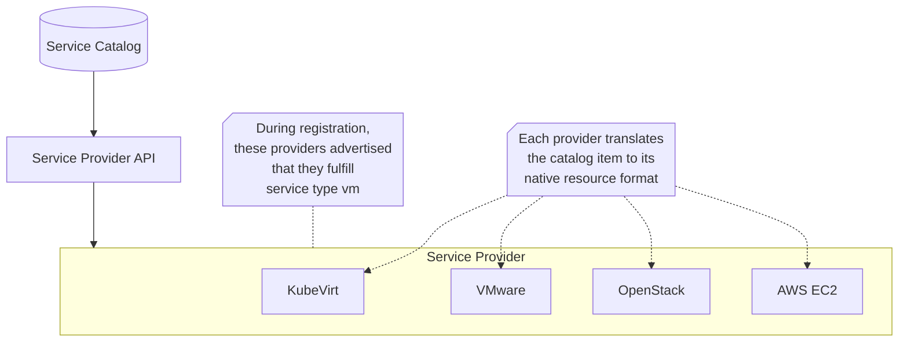

# Service Type Definition

This enhancement defines standardized schemas for DCM service types to enable
cross-platform portability.

<!-- ## Open Questions -->

<!--
Call out areas of the design that require closure before deciding to implement.
Example:
> 1. This requires exposing previously private resources. Can we do this?
-->

## Summary

This ADR defines provider-agnostic schemas for DCM service types. These schemas
enable Service Providers to provision four core service types — virtual
machines, containers, databases, and Kubernetes clusters — across different
infrastructure platforms without vendor lock-in. The key principle is
_portability first_: schemas contain only minimal fields common across all
implementations, with platform-specific configuration delegated to
_providerHints_.

## Motivation

Define a generic schema structure that ensures portability across infrastructure
platforms while allowing extensibility for platform-specific optimizations
without breaking compatibility.

### Goals

- Define a generic schema that works for any serviceType, ensure portability,
  and allows extensibility without schema changes.
- Define an initial set of four primary service types applying this pattern:
  - _VM_  
    Virtual machines with compute, storage, and OS specifications
  - _Container_  
    Containerized workloads running on any container platform
  - _Kubernetes Cluster_  
    Kubernetes Container Platform of any distribution (Kubernetes, OpenShift,
    EKS, AWS, GKE, etc.)
  - _Database_  
    Database services with various engines (PostgreSQL, MySQL, etc.)

### Non-Goals

- Allow runtime editability through API operations so administrators can create
  and modify templates without code changes
- Tooling to validate Service Provider compliance with catalog schemas
  (conformance test suites, reference implementations, automated validation
  frameworks)
- Migration strategies for breaking schema changes
- Provider-specific implementation details (each provider handles translation
  independently)
- Additional service types beyond VMs, containers, databases, and Kubernetes
  clusters (deferred to future phases)
- Standalone storage volumes or separately provisioned networks are _not_
  included. All storage (disk size, ephemeral allocation) and networking
  (interfaces, IPs, subnets, security groups) must be defined and bundled
  directly with the compute specification. Future iterations may decouple these
  services, but the current principle is monolithic definition for simplified
  deployment.
- Multiple service type schema versions. Initial release supports only the
  current schema version; service type versioning deferred to future phases.

## Proposal

### Implementation Details/Notes/Constraints

All schemas use OpenAPI 3.1.0 to leverage JSON Schema features like `contains`
for array validation.

## Generic Service

All service schemas share common fields defined once in
[common.yaml](https://github.com/gciavarrini/service-provider-api-archived/blob/add-catalog-item/api/v1alpha1/common.yaml)

## Schema Structure

| Field         | Required | Type                                   | Description                                                        |
| :------------ | :------- | :------------------------------------- | :----------------------------------------------------------------- |
| serviceType   | Yes      | string                                 | Service type identifier (_vm_, _container_, _database_, _cluster_) |
| metadata      | Yes      | [Metadata](#metadata-object)           | Service identification and labels                                  |
| providerHints | No       | [ProviderHints](#providerhints-object) | Platform-specific configuration                                    |

### Metadata Object

| Field  | Required | Type              | Description                                                                                            |
| :----- | :------- | :---------------- | :----------------------------------------------------------------------------------------------------- |
| name   | Yes      | string            | Unique service name identifier                                                                         |
| labels | No       | map[string]string | Key-value pairs for tagging and organization (e.g., _environment: production_, _owner: platform-team_) |

### ProviderHints Object

| Field             | Required | Type           | Description                                                                                            |
| :---------------- | :------- | :------------- | :----------------------------------------------------------------------------------------------------- |
| \<provider-name\> | No       | map[string]any | Provider-specific configuration keyed by provider identifier (e.g., _kubevirt_, _vmware_, _openstack_) |

_providerHints_ is key to portability: providers use hints they recognize and
ignore the rest. This means catalog offering using only common fields (`vcpu`,
`memory`, `guestOS`) can be provisioned by any compatible provider. The
_providerHints_ section allows adding platform-specific optimizations: providers
use hints they recognize and silently ignore the rest, so the same catalog item
remains portable across platforms.

## Specific services

Any _serviceType_ can be defined by inheriting from
[common.yaml](https://github.com/gciavarrini/service-provider-api-archived/blob/add-catalog-item/api/v1alpha1/common.yaml)
and adding type-specific fields. For the first milestone, DCM will support the
following serviceTypes:

- Virtual Machine  
  Virtual machines with CPU, memory, storage, and OS specifications
- Container  
  Fields common to Kubernetes, Docker, Podman, Openshift, CRI-O, containerd
- Cluster  
  Fields common to Kubernetes, OpenShift, EKS, GKE, AKS, and other distributions
- Database  
  Fields common across all database types (SQL, NoSQL, search, time-series,
  etc.)

### Virtual Machine

The following sections detail the VM schema architecture.

#### Schema

For easier review, the schema is accessible here
[vmspec.yaml](https://github.com/gciavarrini/service-provider-api-archived/blob/add-catalog-item/api/v1alpha1/vmspec.yaml).  
Plus
common fields: _serviceType, metadata, providerHints_

| Field   | Required | Type                          | Description                    |
| :------ | :------- | :---------------------------- | :----------------------------- |
| vcpu    | Yes      | [Vcpu](#vm-vcpu-object)       | Virtual CPU configuration      |
| memory  | Yes      | [Memory](#vm-memory-object)   | Memory configuration           |
| storage | Yes      | [Storage](#vm-storage-object) | Storage configuration          |
| guestOS | Yes      | [GuestOS](#vm-guestos-object) | Operating system specification |
| access  | No       | [Access](#vm-access-object)   | VM access configuration        |

#### VM vcpu Object

| Field | Required | Type    | Description            |
| :---- | :------- | :------ | :--------------------- |
| count | Yes      | integer | Number of virtual CPUs |

#### VM memory Object

| Field | Required | Type   | Description                                 |
| :---- | :------- | :----- | :------------------------------------------ |
| size  | Yes      | string | Memory size with unit (e.g., _8GB_, _16GB_) |

#### VM storage Object

| Field | Required | Type                           | Description                                  |
| :---- | :------- | :----------------------------- | :------------------------------------------- |
| disks | Yes      | array[[Disk](#vm-disk-object)] | List of disks; must include one named _boot_ |

Disk names must be unique within the VM.

#### VM disk Object

| Field    | Required | Type   | Description                                       |
| :------- | :------- | :----- | :------------------------------------------------ |
| name     | Yes      | string | Disk identifier; root volume must be named _boot_ |
| capacity | Yes      | string | Disk capacity with unit (e.g., _100GB_, _2TB_)    |

#### VM guestOS Object

| Field | Required | Type   | Description                                                           |
| :---- | :------- | :----- | :-------------------------------------------------------------------- |
| type  | Yes      | string | OS identifier (e.g., _rhel-9_, _ubuntu-22.04_, _windows-server-2022_) |

#### VM access Object

| Field        | Required | Type   | Description                  |
| :----------- | :------- | :----- | :--------------------------- |
| sshPublicKey | No       | string | SSH public key for VM access |

### Containers

The following sections detail the Container schema architecture.

#### Schema

For easier review, the schema is accessible here
[containerspec.yaml](https://github.com/gciavarrini/service-provider-api-archived/blob/add-catalog-item/api/v1alpha1/containerspec.yaml).  
Plus
common fields: _serviceType, metadata, providerHints_

| Field     | Required | Type                                     | Description                   |
| :-------- | :------- | :--------------------------------------- | :---------------------------- |
| image     | Yes      | [Image](#container-image-object)         | Container image specification |
| resources | Yes      | [Resources](#container-resources-object) | CPU and memory limits         |
| process   | No       | [Process](#container-process-object)     | Process configuration         |
| network   | No       | [Network](#container-network-object)     | Network configuration         |

#### Container image Object

| Field     | Required | Type   | Description                                                                      |
| :-------- | :------- | :----- | :------------------------------------------------------------------------------- |
| reference | Yes      | string | Container image reference (e.g., _quay.io/myapp:v1.2_, _docker.io/nginx:latest_) |

#### Container resources Object

| Field  | Required | Type                                         | Description                 |
| :----- | :------- | :------------------------------------------- | :-------------------------- |
| cpu    | Yes      | [Cpu](#container-resources-cpu-object)       | CPU resource constraints    |
| memory | Yes      | [Memory](#container-resources-memory-object) | Memory resource constraints |

#### Container resources.cpu Object

| Field | Required | Type    | Description                  |
| :---- | :------- | :------ | :--------------------------- |
| min   | Yes      | integer | Minimum guaranteed CPU cores |
| max   | Yes      | integer | Maximum allowed CPU cores    |

#### Container resources.memory Object

| Field | Required | Type   | Description                                              |
| :---- | :------- | :----- | :------------------------------------------------------- |
| min   | Yes      | string | Minimum guaranteed memory with unit (e.g., _1GB_, _2GB_) |
| max   | Yes      | string | Maximum allowed memory with unit (e.g., _2GB_, _4GB_)    |

#### Container process Object

| Field   | Required | Type                                   | Description                 |
| :------ | :------- | :------------------------------------- | :-------------------------- |
| command | No       | array[string]                          | Entrypoint override         |
| args    | No       | array[string]                          | Arguments to the entrypoint |
| env     | No       | array[[EnvVar](#container-env-object)] | Environment variables       |

#### Container env Object

| Field | Required | Type   | Description                |
| :---- | :------- | :----- | :------------------------- |
| name  | Yes      | string | Environment variable name  |
| value | Yes      | string | Environment variable value |

#### Container network Object

| Field | Required | Type                                  | Description     |
| :---- | :------- | :------------------------------------ | :-------------- |
| ports | Yes      | array[[Port](#container-port-object)] | Ports to expose |

#### Container port Object

| Field         | Required | Type    | Description                                 |
| :------------ | :------- | :------ | :------------------------------------------ |
| containerPort | Yes      | integer | Port number to expose (e.g., _8080_, _443_) |

### Database

The following sections detail the Database schema architecture.

#### Schema

For easier review, the schema is accessible here
[databasespec.yaml](https://github.com/gciavarrini/service-provider-api-archived/blob/add-catalog-item/api/v1alpha1/databasespec.yaml).  
Plus
common fields: _serviceType, metadata, providerHints_

| Field     | Required | Type                                    | Description                                                   |
| :-------- | :------- | :-------------------------------------- | :------------------------------------------------------------ |
| engine    | Yes      | string                                  | Database engine type (e.g., _postgresql_, _mysql_, _mariadb_) |
| version   | Yes      | string                                  | Engine version (e.g., _15_, _8.11_, _8.0_)                    |
| resources | Yes      | [Resources](#database-resources-object) | Compute and storage resources                                 |

#### Database resources Object

| Field   | Required | Type    | Description                                   |
| :------ | :------- | :------ | :-------------------------------------------- |
| cpu     | Yes      | integer | Number of CPU cores                           |
| memory  | Yes      | string  | Memory size with unit (e.g., _8GB_, _16GB_)   |
| storage | Yes      | string  | Storage size with unit (e.g., _100GB_, _2TB_) |

### Kubernetes Cluster

The cluster schema works across all Kubernetes distributions: OpenShift, EKS,
GKE, AKS, etc.

#### Schema

For easier review, the schema is available here:
[clusterspec.yaml](https://github.com/gciavarrini/service-provider-api-archived/blob/add-catalog-item/api/v1alpha1/clusterspec.yaml).  
Plus
common fields: _serviceType, metadata, providerHints_

| Field   | Required | Type                           | Description                               |
| :------ | :------- | :----------------------------- | :---------------------------------------- |
| version | Yes      | string                         | Kubernetes version (e.g., _1.29_, _1.30_) |
| nodes   | Yes      | [Nodes](#cluster-nodes-object) | Node pool configuration                   |

#### Cluster nodes Object

| Field        | Required | Type                                         | Description                      |
| :----------- | :------- | :------------------------------------------- | :------------------------------- |
| controlPlane | Yes      | [ControlPlane](#cluster-controlplane-object) | Control plane node configuration |
| worker       | Yes      | [Worker](#cluster-worker-object)             | Worker node configuration        |

#### Cluster controlPlane Object

| Field   | Required | Type    | Description                                         |
| :------ | :------- | :------ | :-------------------------------------------------- |
| count   | Yes      | integer | Number of control plane nodes (1, 3, or 5)          |
| cpu     | Yes      | integer | Number of CPUs per node                             |
| memory  | Yes      | string  | Memory per node with unit (e.g., _16GB_, _32GB_)    |
| storage | Yes      | string  | Storage per node with unit (e.g., _120GB_, _500GB_) |

#### Cluster worker Object

| Field   | Required | Type    | Description                                         |
| :------ | :------- | :------ | :-------------------------------------------------- |
| count   | Yes      | integer | Number of worker nodes                              |
| cpu     | Yes      | integer | Number of CPUs per node                             |
| memory  | Yes      | string  | Memory per node with unit (e.g., _8GB_, _16GB_)     |
| storage | Yes      | string  | Storage per node with unit (e.g., _120GB_, _500GB_) |

### Schema Compatibility

DCM supports only the current API version for each service type. Service
Providers must implement the latest schema definitions. Support for multiple
service type versions is planned for future releases.

## Implementation History

<!-- TBD -->

## Drawbacks

<!-- TBD -->

## Alternatives

### Comprehensive schemas with all platform features

**Description:** We considered including all possible fields (CPU topology,
security contexts, HA configuration, etc.) in the core schema.

**Why rejected:** Not all fields exist on all platforms. This would force
providers to handle features they don't support, or force users to understand
which fields work where. Portability would be compromised.

### Virtual Machine Alternatives

#### Pure OVF XML Format

**Description:** We considered using OVF XML directly as our catalog format.
This would provide perfect alignment with the standard but creates practical
problems. OVF XML is verbose with complex nested structures, XML namespaces, and
numeric resource type codes (3 for CPU, 4 for memory).

**Pros:** Perfect standard compliance, well-understood by virtualization teams

**Cons:** XML complexity, poor API ergonomics, includes packaging concepts
irrelevant to catalog specs

#### TOSCA Cloud Orchestration

**Description:** TOSCA (Topology and Orchestration Specification for Cloud
Applications) is an OASIS standard designed specifically for cloud resource
orchestration. It provides a comprehensive model with node templates,
capabilities, requirements, and relationship definitions. While powerful, TOSCA
introduces significant complexity with its topology-based approach. For a
catalog specification that describes individual resource templates, TOSCA's
relationship modeling and orchestration features are overkill.

**Pros:** Purpose-built for cloud, handles complex deployments

**Cons:** Steep learning curve, heavyweight for simple resource specs, less
tooling ecosystem

#### Custom Schema from Scratch

**Description:** We could design a completely custom schema without reference to
existing standards, optimizing purely for our immediate needs. This provides
maximum flexibility and simplicity initially but loses the benefit of industry
knowledge embedded in standards like OVF. Provider translation becomes harder
because engineers must learn our invented vocabulary rather than mapping to
familiar concepts they already know from OVF, OpenStack, or other systems.

**Pros:** Perfect fit for current needs, no standard overhead

**Cons:** Reinventing solved problems, harder provider adoption, no external
validation

#### OpenStack-Style Flavors

**Description:** OpenStack's approach separates compute templates (_flavors_)
from images. Users select a flavor (_m1.small, m1.medium_) and an image
separately. While simple, this creates a two-level hierarchy that feels
unnatural for a general catalog system. It also doesn't handle the full richness
of VM configuration, storage configuration, and network interfaces.
Initialization is handled separately rather than as part of a cohesive
specification.

**Pros:** Simple flavor model, proven in OpenStack

**Cons:** Limited to compute specs, doesn't handle full VM configuration,
creates artificial separation

### Container Alternatives

#### Kubernetes Pod Specification

**Description:** Using Kubernetes Pod/Deployment YAML directly as the catalog
format would provide immediate familiarity for Kubernetes users but creates
vendor lock-in.

**Pros:** Familiar to Kubernetes users, rich feature set, comprehensive
documentation, established ecosystem

**Cons:** Kubernetes-specific (incompatible with Docker/Podman standalone),
includes orchestration concepts unnecessary for resource specifications, ties
catalog to Kubernetes API versions, prevents portability to non-Kubernetes
platforms

#### Compose Specification

**Description:** The Compose Specification provides a YAML format for defining
multi-container applications, now an open specification supported by Docker,
Podman, and other runtimes.

**Pros:** Simple and approachable, widely known format, open specification, good
for multi-container applications

**Cons:** Designed for application composition not individual resource
specifications, doesn't map cleanly to single-container catalog items, less
granular than OCI for runtime configuration, focuses on orchestration rather
than resource provisioning

#### Containerfile Build Instructions

**Description:** Define containers through Dockerfile/Containerfile rather than
runtime specifications.

**Pros:** Reproducible builds, version control friendly, defines complete
container image

**Cons:** Build-time specification not runtime specification, requires build
infrastructure in catalog system, doesn't address runtime configuration
(resources, networking, security), mixes build concerns with deployment concerns

#### Custom Schema

**Description:** Design a container schema without reference to existing
standards like OCI, optimizing purely for DCM's immediate needs.

**Pros:** Optimized for DCM requirements, simpler for current use cases, no
standard overhead

**Cons:** Reinventing problems OCI already solved, harder provider adoption
(engineers learn new vocabulary instead of familiar OCI concepts), no external
validation, loses portability benefits, incompatible with existing container
tooling

### Database Alternatives

#### Single Cloud Provider Model

**Description:** Using AWS RDS, Azure Database, or Google Cloud SQL
specification directly as the catalog format.

**Pros:** Complete feature coverage, well-documented, proven in production

**Cons:** Vendor lock-in, cloud-specific terminology and features, doesn't work
with on-premise or Kubernetes-based databases, prevents multi-cloud portability

#### Kubernetes Operator CRD

**Description:** Using a specific Kubernetes database operator CRD
(CloudNativePG, Percona) as the standard.

**Pros:** Kubernetes-native, rich feature set, battle-tested

**Cons:** Kubernetes-specific, incompatible with cloud DBaaS providers, ties
catalog to specific operator versions, doesn't support VM-based database
deployments

#### SQL Standard Only

**Description:** Focus purely on SQL standards (ANSI SQL, SQL:2016) for database
specifications.

**Pros:** Well-established standard, vendor-neutral

**Cons:** Only covers query language not provisioning/infrastructure, no
coverage for NoSQL databases, doesn't address compute/storage/backup
configuration, mixes application concerns with infrastructure.

#### Custom Schema

**Description:** Design database schema without reference to existing patterns.

**Pros:** Optimized for DCM needs, simpler initially

**Cons:** Reinventing patterns cloud providers and operators already solved,
harder adoption, no external validation, incompatible with existing tooling and
knowledge

### Kubernetes Cluster Alternatives

#### Full install-config.yaml

**Description:** Using OpenShift's complete _install-config.yaml_ format as the
catalog schema.

**Pros:** Comprehensive coverage of all OpenShift deployment options, official
Red Hat format, well-documented

**Cons:** Platform-specific sections create complexity, includes infrastructure
credentials and bootstrapping details inappropriate for catalog specifications,
ties catalog to OpenShift installer API versions, verbose for users who just
want node sizing

#### Cluster API (CAPI) Specification

**Description:** Adopting Kubernetes Cluster API CRDs as the standard for all
cluster provisioning.

**Pros:** Kubernetes community standard, cloud-agnostic, supports multiple
platforms

**Cons:** Still maturing as a standard, OpenShift has its own established
patterns, CAPI abstractions don't always align with OpenShift's architecture,
requires CAPI operator infrastructure

#### Managed OpenShift Service APIs

**Description:** Using cloud provider managed OpenShift APIs (ROSA for AWS, ARO
for Azure) as the specification format.

**Pros:** Native to cloud providers, optimized for managed OpenShift services

**Cons:** Cloud-specific, incompatible with on-premise and self-managed
OpenShift deployments, each provider has different API structure, doesn't work
with standard OpenShift IPI/UPI installations, prevents portability to vSphere
or bare metal

#### Custom Cluster Schema

**Description:** Design a cluster schema without reference to existing standards
or patterns.

**Pros:** Optimized for DCM requirements, simpler for current use cases

**Cons:** Ignores established OpenShift configuration patterns, harder for users
familiar with install-config.yaml, no validation against industry knowledge,
incompatible with existing automation and tooling

## Infrastructure Needed

TBD
