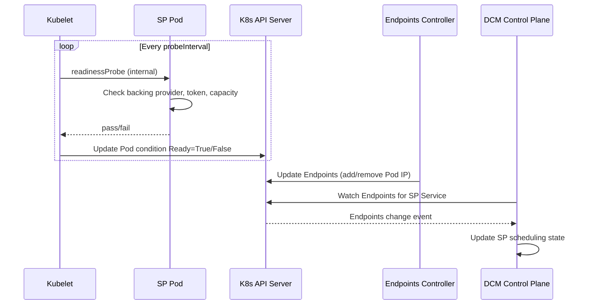

# SP Health Check V2

## Open Questions

None at this time.

## Summary

This enhancement proposes replacing the current HTTP-based health check polling
mechanism with a Kubernetes-native approach where DCM observes SP Pod readiness
conditions via the Kubernetes API. The SP owns the availability decision through
a standard readiness probe, and DCM consumes the result through a Kubernetes
watch rather than polling a separate HTTP endpoint.

## Motivation

The current health check design
([service-provider-health-check](/enhancements/service-provider-health-check/service-provider-health-check.md))
requires each SP to expose a public `/health` HTTP endpoint that DCM polls every
10 seconds. This design has two architectural problems:

1. **Leaks Kubernetes-internal semantics.** Readiness and liveness probes are an
   internal contract between the kubelet and the pod. Exposing them as a public
   HTTP service re-invents a Kubernetes primitive outside its intended scope.

2. **Inverts the authority model.** The SP returns a `status` field
   (`healthy`/`unhealthy`) and DCM interprets it to decide availability. This
   leaks SP implementation details — DCM knows whether the backing provider is
   down, rather than simply knowing the SP cannot accept work. The SP should own
   the availability decision; the consumer should only see "ready" or "not
   ready."

By using Kubernetes-native readiness, one mechanism serves three purposes:

1. **Kubernetes Service routing** — only Pods with `Ready=True` remain in the
   Service Endpoints. DCM's CRUD calls to the SP naturally reach only healthy
   Pods without any DCM-side filtering logic.
2. **DCM scheduling** — DCM watches the Service Endpoints and detects SP
   unavailability before any user-facing request fails.
3. **Pod lifecycle** — the kubelet manages restart decisions independently via
   liveness probes.

In v1 these signals are disconnected: an SP might report `"healthy"` on
`/health` while individual Pods behind the Service are failing readiness, or
vice versa. With v2, there is a single source of truth — the readiness probe
simultaneously controls Service routing and DCM awareness.

### Goals

- Eliminate the public `/health` HTTP endpoint as a requirement for SPs.
- Let the SP own its availability decision via a standard Kubernetes readiness
  probe.
- Have DCM observe SP readiness through the Kubernetes Endpoints API.
- Provide a migration path from v1 (HTTP polling) to v2 (Kubernetes watch).
- Preserve operator observability through structured diagnostics that do not
  affect scheduling logic.

### Non-Goals

- Cross-cluster health checking — this enhancement targets same-cluster
  deployments where DCM and SPs share a Kubernetes API server.
- Define the specific readiness probe implementation for each SP — that is each
  SP's responsibility.
- Replace Kubernetes liveness probes — liveness remains a kubelet concern for
  pod restart decisions.
- Define a custom CRD for SP health — this proposal uses standard Kubernetes
  Endpoints.

## Proposal

### Architecture

DCM watches the Kubernetes Endpoints object for each registered SP's Service.
When all Pod addresses are removed from the Endpoints (all Pods fail readiness),
DCM marks the SP as unavailable for scheduling. When at least one address
reappears, DCM marks it as ready.



The SP's readiness probe performs whatever internal checks are necessary to
determine if it can fulfill requests. These checks are opaque to DCM — the probe
is the SP's decision boundary.

### Assumptions

- DCM and SPs are deployed in the same Kubernetes cluster. DCM uses its
  in-cluster service account for API access.
- SPs are deployed as Kubernetes Deployments or StatefulSets with standard Pod
  readiness probes configured.
- SPs are fronted by a Kubernetes Service whose name and namespace can be
  derived from the registered endpoint URL.

### SP Readiness Probe Contract

Each SP configures a readiness probe that checks all conditions required to
fulfill requests. The probe is internal to the kubelet — it is not exposed as an
HTTP service.

Example checks an SP readiness probe might perform:

- Backing provider connectivity (e.g., fulfillment service is reachable)
- Authentication token validity (e.g., OIDC JWT is current)
- Minimum resource availability (e.g., at least one hub has capacity)
- Internal service dependencies (e.g., database connection)

If any check fails, the probe fails, and Kubernetes marks the Pod as not ready.
The SP does not need to expose why it failed — only that it cannot serve.

### DCM Watch Mechanism

DCM uses a Kubernetes informer (SharedIndexInformer) to watch the Endpoints
object for each registered SP's Service. The Service name and namespace are
derived from the SP's registered endpoint URL. Only Pods listed in the Endpoints
(i.e., Pods that pass their readiness probe) are considered available.

This is inherently safe: the Endpoints controller only includes Pods that match
the Service selector AND have `Ready=True`. No additional validation is needed —
Kubernetes enforces the association.

**State Mapping:**

| Endpoints State                   | DCM State   |
| --------------------------------- | ----------- |
| At least one address in Endpoints | Ready       |
| No addresses in Endpoints         | Unavailable |
| Endpoints object deleted          | Removed     |

### Scope: Same-Cluster Only

This enhancement targets deployments where DCM and SPs run in the same
Kubernetes cluster. DCM uses its in-cluster service account to watch Endpoints —
no additional credentials are required.

Cross-cluster deployments are out of scope. If DCM gains Kubernetes API access
to remote clusters in the future, the same informer pattern applies without
changes — it targets the K8s API regardless of topology.

### Observability

For operator diagnostics, SPs can expose structured health details without
affecting DCM's scheduling logic. None of these mechanisms influence scheduling
— DCM only reads the `Ready` condition.

**Option 1: Kubernetes Events (recommended)**

The SP emits Events referencing its own Pod when health state changes. The
kubelet already emits probe failure events for free (e.g.,
`Readiness probe failed: HTTP probe failed with status code: 503`). SPs can
supplement with custom Events explaining the root cause:

```yaml
apiVersion: v1
kind: Event
metadata:
  name: my-sp-abc123.backing-provider-down
  namespace: dcm-providers
involvedObject:
  kind: Pod
  name: my-sp-abc123
  namespace: dcm-providers
reason: BackingProviderUnreachable
message: "Backing fulfillment service connection timed out after 5s"
type: Warning
```

Events auto-expire (default TTL: 1h), require no Pod patching, and are visible
through standard tooling (`kubectl describe pod`, `kubectl get events`).

**Option 2: Custom Pod Condition**

The SP controller writes a custom condition to the Pod status:

```yaml
status:
  conditions:
    - type: Ready
      status: "False"
    - type: BackingProviderReady
      status: "False"
      reason: FulfillmentServiceUnreachable
      message: "Connection to fulfillment service timed out after 5s"
      lastTransitionTime: "2026-06-29T18:00:00Z"
```

Requires RBAC for the SP to patch its own Pod status. Useful when operators need
queryable, persistent conditions for dashboards or alerting rules.

**Option 3: Pod Annotation**

```yaml
metadata:
  annotations:
    dcm.io/health-details: |
      {"fulfillmentService":"unreachable","oidcToken":"valid","hubs":0}
```

Requires RBAC for the SP to patch its own Pod metadata. Suitable for structured
diagnostic payloads that operators consume programmatically.

### Registration Integration

No changes to the SP registration schema are required. DCM derives the Service
name and namespace from the SP's existing registered `endpoint` field (e.g.,
`http://my-sp.dcm-providers:8080/...` → Service `my-sp` in namespace
`dcm-providers`) and watches the corresponding Endpoints object automatically.

### User Stories

#### Story 1: SP Loses Backing Provider Connectivity

As a DCM operator, when the SP's backing provider becomes unreachable, the SP's
readiness probe fails, Kubernetes removes the Pod from the Service Endpoints,
DCM observes the Endpoints change, and stops routing requests to the SP — all
without the SP exposing internal failure details to DCM.

#### Story 2: SP Recovers After Outage

As a DCM operator, when the backing provider recovers, the SP's readiness probe
passes again, Kubernetes adds the Pod back to the Service Endpoints, DCM
observes the Endpoints change, and resumes routing requests to the SP.

#### Story 3: Operator Diagnoses Unhealthy SP

As a platform operator, when an SP is not ready, I inspect the Pod's custom
conditions or annotations to understand why — without relying on DCM logs or a
separate health endpoint.

### Implementation Details/Notes/Constraints

#### Informer Cache

DCM maintains an informer cache of SP Endpoints. The cache is keyed by SP name
(derived from the Service name) and stores the last-known readiness state. This
avoids redundant API calls and provides constant-time lookups during scheduling.

#### Multi-Replica SPs

For SPs with multiple replicas, DCM considers the SP available if the Endpoints
object contains at least one address. The SP is marked unavailable only when the
Endpoints object has zero addresses (all Pods failed readiness).

#### Probe Configuration

The readiness probe configuration (interval, timeout, failure threshold) is the
SP's responsibility. DCM does not prescribe probe parameters — it only observes
the resulting Pod condition.

#### Startup Grace Period

DCM ignores Pod readiness during the initial startup period (configurable,
default: 60s after Pod creation). This prevents flapping during SP
initialization when the Pod is starting up and the readiness probe has not yet
passed.

### Risks and Mitigations

| Risk                                                        | Mitigation                                                                                                            |
| ----------------------------------------------------------- | --------------------------------------------------------------------------------------------------------------------- |
| Readiness probe flapping causes rapid Endpoints churn       | DCM applies a debounce window (default: 30s) before transitioning an SP to unavailable                                |
| SP Service or Endpoints object accidentally deleted         | DCM treats missing Endpoints as unavailable; recovery occurs when Endpoints are recreated (standard K8s self-healing) |
| Custom conditions require SP code changes for observability | Custom conditions are optional; Endpoints membership alone is sufficient for scheduling                               |

## Design Details

### Mechanism Comparison

| Aspect       | v1 HTTP Poll                           | v2 Kubernetes Watch                    |
| ------------ | -------------------------------------- | -------------------------------------- |
| Signal       | HTTP status + JSON body                | Pod Ready condition                    |
| Latency      | 10s poll + 3 failures (30s worst case) | Near real-time + debounce (30s)        |
| Network      | One HTTP request per SP per interval   | Persistent watch connection            |
| Scalability  | O(n) requests per interval             | O(1) connection, events only on change |
| Auth         | SP endpoint may need TLS/auth          | Kubernetes RBAC on Pod read            |
| Precision    | Healthy/unhealthy (SP-reported)        | Ready=True/False (exact)               |
| Failure mode | Timeout = SP might be down             | Watch disconnect = reconnect           |

### RBAC Requirements

DCM requires the following Kubernetes RBAC:

```yaml
apiVersion: rbac.authorization.k8s.io/v1
kind: ClusterRole
metadata:
  name: dcm-sp-health-watcher
rules:
  - apiGroups: [""]
    resources: ["endpoints"]
    verbs: ["get", "list", "watch"]
```

DCM only needs read access to Endpoints objects. In namespaced deployments, a
Role with namespace restriction is sufficient.

### Upgrade / Downgrade Strategy

**Upgrade (v1 to v2):**

1. SPs add readiness probes that perform the same checks their `/health`
   endpoint currently performs.
2. DCM is updated to watch Endpoints instead of polling `/health`. No
   registration schema changes — DCM derives the Service from the existing
   `endpoint` field.
3. SPs remove the `/health` endpoint (no longer needed).

**Downgrade (v2 to v1):**

1. DCM reverts to the HTTP polling monitor.
2. SPs re-expose the `/health` endpoint.
3. No data loss — scheduling state is ephemeral and reconstructed on startup.

## Implementation History

- 2026-06-29: Initial enhancement proposal created.

## Drawbacks

The primary drawback is the RBAC requirement — DCM needs read-only access to
Endpoints objects that it does not currently require. However, this is minimal
(`get`, `list`, `watch` verbs only) and aligns with how Kubernetes-native
controllers already observe Service membership.

A secondary drawback is that the health signal becomes binary (in Endpoints or
not) rather than the v1 three-state model (`Ready`/`Unhealthy`/`Unavailable`).
DCM can no longer distinguish "SP reachable but backing provider down" from "SP
completely gone." This is an intentional design choice — the SP owns the
availability decision and DCM should not interpret internal failure modes — but
it means operators must use Pod Events or custom conditions for diagnostics
rather than DCM's health state.

## Alternatives

### Alternative 1: HTTP Endpoint with Simplified Semantics (200/503)

#### Description

Keep the HTTP `/health` endpoint but simplify the contract: the SP returns
`200 OK` when ready and `503 Service Unavailable` when not ready. DCM only
checks the HTTP status code — no JSON body parsing for scheduling decisions. The
response body contains optional diagnostic details for operators.

#### Pros

- No Kubernetes API dependency for DCM
- Minimal change from current design — SPs change response code, DCM simplifies
  parsing
- Standard HTTP semantics that load balancers and monitoring already understand

#### Cons

- Still exposes an internal readiness concept as a public HTTP service
- Duplicates what Kubernetes readiness probes already provide
- Requires a separate polling loop in DCM (O(n) per interval)
- SP must maintain both a Kubernetes readiness probe (for kubelet) and an HTTP
  endpoint (for DCM) that perform the same checks

#### Status

Rejected

#### Rationale

While simpler than the current v1 design, this alternative still requires SPs to
maintain two parallel mechanisms (readiness probe + HTTP endpoint) that answer
the same question. The Kubernetes-native approach eliminates this redundancy and
leverages existing infrastructure.

### Alternative 2: Implicit via Kubernetes Service Endpoint Removal

#### Description

No dedicated health mechanism at all. The SP configures a readiness probe. When
it fails, Kubernetes removes the Pod from the Service endpoints. DCM's regular
CRUD calls to the SP fail (connection refused), and DCM marks the SP as
unavailable through its existing retry/failover logic.

#### Pros

- Zero additional infrastructure — relies entirely on existing Kubernetes
  behavior
- No health endpoint, no watch, no additional RBAC
- Simplest possible design

#### Cons

- Detection is reactive, not proactive — DCM only discovers unavailability when
  a request fails
- Slower recovery detection — DCM must attempt a request to discover the SP is
  back
- No distinction between "SP is down" and "SP rejected this specific request"
- User-facing requests fail before DCM can route elsewhere

#### Status

Rejected

#### Rationale

Reactive failure detection is unacceptable for a scheduling system. DCM needs to
know SP availability before routing requests, not after a user-facing failure.
The proactive watch approach detects unavailability before any request is
affected.

## Infrastructure Needed

- Kubernetes RBAC configuration granting DCM read access to Endpoints in SP
  namespaces.
- SP Deployments must include readiness probe configuration and be fronted by a
  Kubernetes Service.
- No new repositories or CI/CD changes required.
