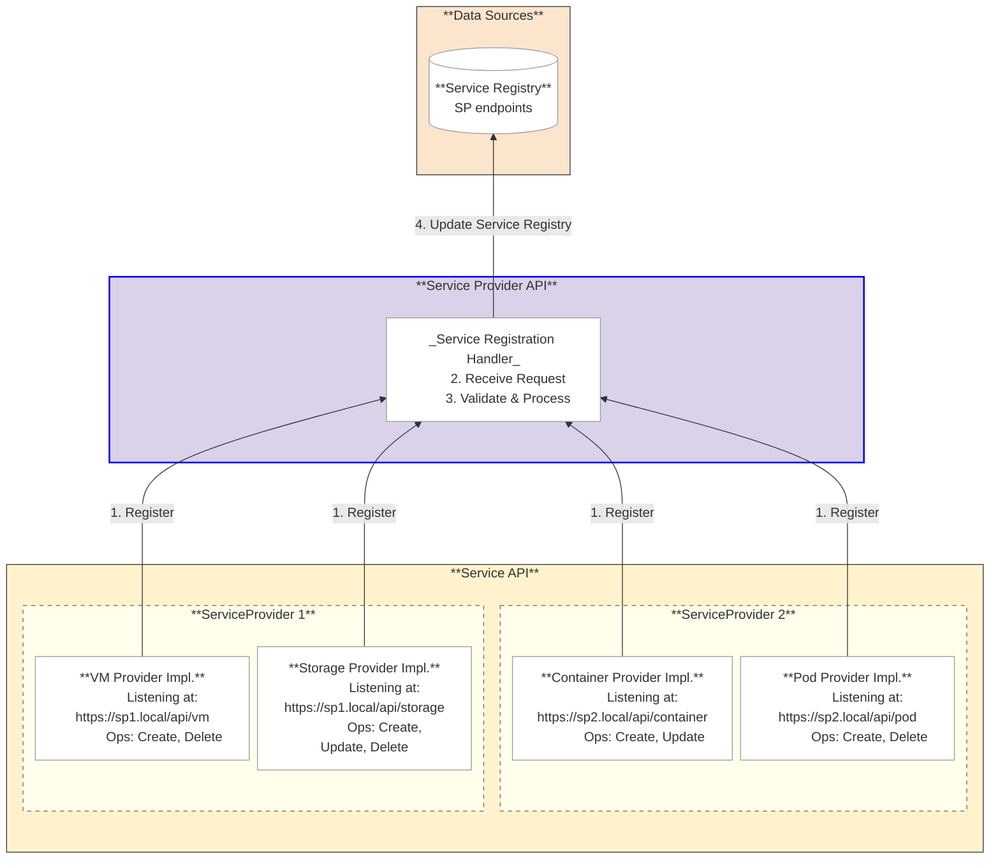
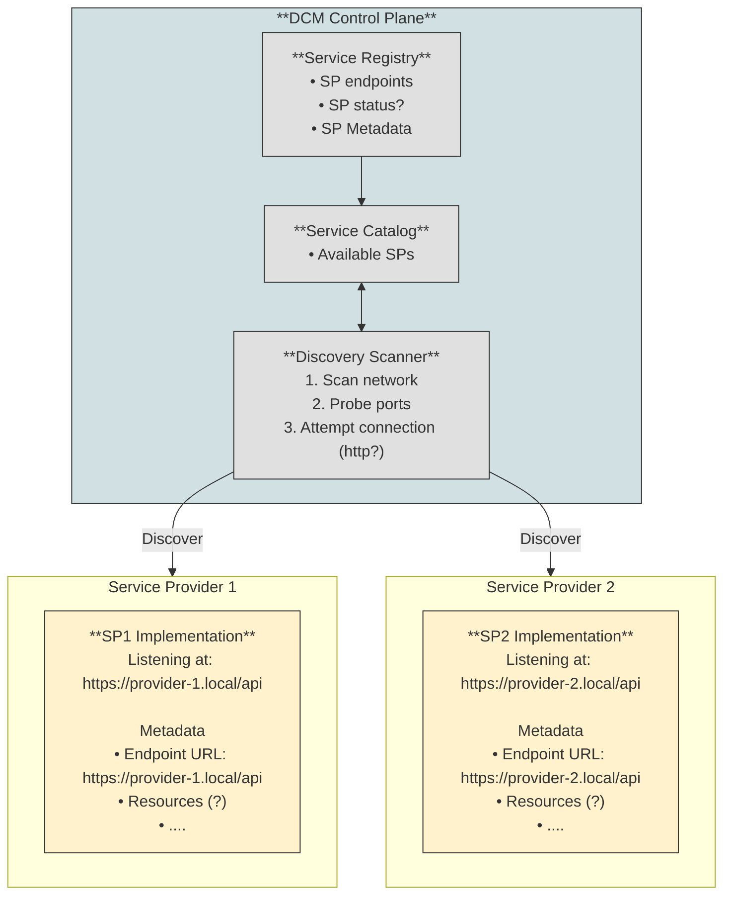
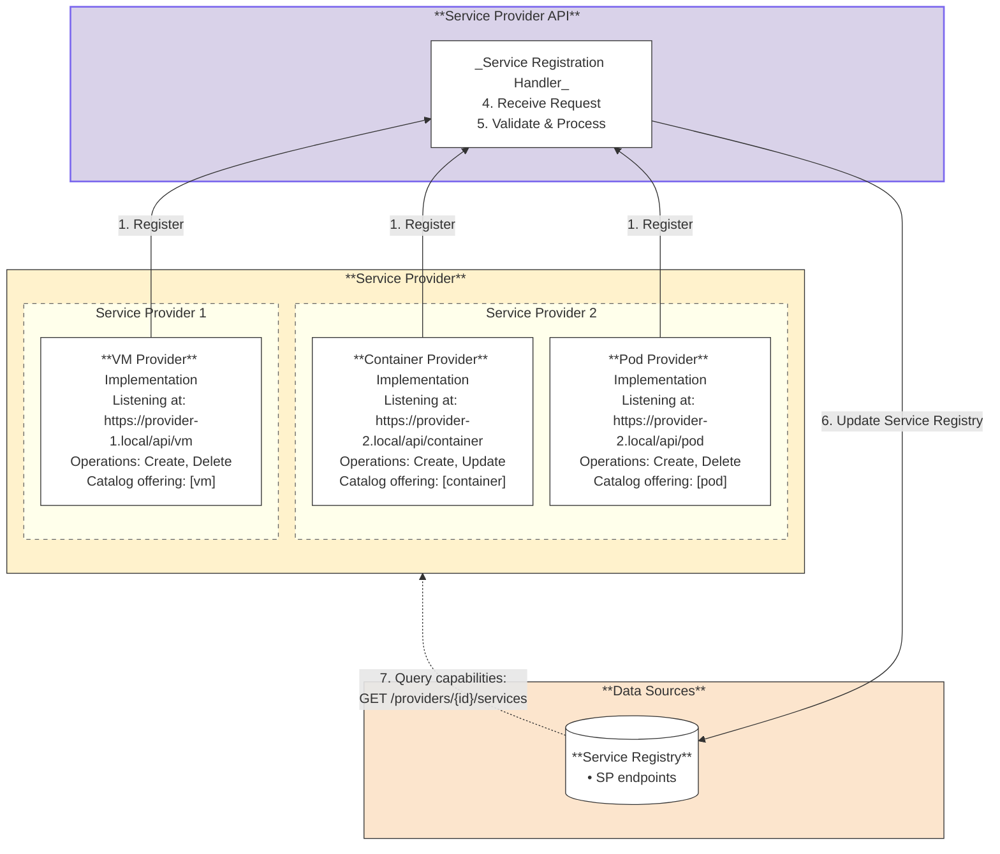

# Service Provider Registration Flow

## Summary

The DCM (Data Center Management) is designed to provide a unified control plane
for managing distributed infrastructure across multiple enclaves, including
air-gapped environments, regional datacenters, and isolated security zones (e.g.
ships, edge locations). A fundamental architectural decision must be made about
how Service Providers (SP) — the components that execute infrastructure
provisioning work — become known to and integrate with the DCM Control Plane.
This decision directly impacts scalability, security, network topology,
operational model (whether centralized DCM teams or distributed SME teams manage
Service Provider lifecycle).

## Motivation

### Goals

- Define the registration mechanism by which Service Providers become known to
  and communicate with the DCM Control Plane.

### Non-Goals

- Implementing details of registration API
- Service Provider Authentication/Authorization
- Service catalog schema
- DCM Control Plane definition
- Meta-service-provider design
- Service Provider's policies

## Proposal

### Implementation Details/Notes/Constraints

#### Terminology

Service Providers must register using the DCM Service Provider API to operate
within the DCM system. The Registration Handler component implements the
provider registration endpoints of the Service Provider API. The registration
phase provides to the DCM Control Plane the SP endpoint, metadata and
capabilities so it can route requests to the appropriate SP. The registration
call can be initiated either by the SP itself during start up phase or by a
third party (e.g. platform admins) on behalf of the SP. Both approaches use the
same registration API.

The _initial implementation_ will focus only on the **self registration flow**.

The _Service Provider API_ is located in the Egress layer and defines the
contract between the DCM Control Plane and Service Providers. It includes
endpoints for provider registration, service management, and provider queries.
The
[Service Provider API specification](https://github.com/Fale/dcm/blob/od/api/interoperabilityAPI.yaml)
is under development.

Within this architecture, the _Registration Handler_ is a component within the
Service Provider API that implements the provider registration endpoints
(`POST /providers` and related endpoints). When an SP registers, the
Registration Handler communicates with the Control Plane to update the Service
Registry.

#### Architectural Assumptions

There must be network connectivity between Service Providers and the Service
Provider API. If the Service Provider API cannot reach an SP, it cannot route
provisioning requests to it, regardless of the registration or discovery method
used.

#### Registration Flow

##### Static approach

Registration is per service type. Each Service Provider may support multiple
service types (e.g., VMs and Containers), but it must register **separately**
for each type. This design provides clear endpoint separation and avoids complex
capability matrices.



- Admins predefine supported ServiceTypes (e.g., "vm", "database")
- Each Service Provider must implement Service Provider API contract at a
  reachable endpoint
- A registration call must be made to the Service Provider API (Registration
  Handler endpoint) for each service type the SP supports. The payload structure
  is not finalized and may evolve during implementation. It may include, just as
  an example:
  1. Unique provider name
  2. Unique providerID
  3. Endpoint URL (e.g.,
     [https://provider-1.local/api](https://provider-1.local/api))
  4. Metadata (zone, region, resource constraints)
  5. Operations supported for this service type (e.g., _"create", "delete"_)
  6. References catalog service kind this provider can fulfill (e.g, "vm",
     "container")
- The Registration Handler processes and validates the metadata
- The Registration Handler internally updates the Service Registry with:
  1. SP endpoint
  1. metadata
- When user requests a catalog offering, Control Plane matches it to registered
  SPs that can fulfill it and calls the selected SP endpoint (endpoint must be
  reachable)

The Service Provider's _name_ is the natural key used to match existing
registrations.

The registration endpoint is idempotent. During the registration phase:

- If the _name_ does not exist in DCM, a new SP entry is created. If no
  _providerID_ is specified, DCM will automatically generate one.
- If the _name_ already exists and no _providerID_ is provided (or the same
  _providerID_ is provided), the existing entry is updated and the same
  _providerID_ is returned.
- If the _name_ already exists but a **different** _providerID_ is provided,
  registration fails (conflict: another SP is attempting to register with a
  taken name).
- If a new _name_ is provided but the _providerID_ already exists in DCM,
  registration fails (conflict: _providerID_ is already assigned to another SP).

The response to a registration request will always include the _providerID_,
regardless of whether it was generated or provided. Consistent with AEP, the
response payload mirrors the request payload with possibly updated values.

##### Update Service Provider capabilities flow

The registration endpoint is idempotent. If an SP's capabilities change
(typically due to a new version following a restart), the SP (or admin) can call
the same registration endpoint again. The Registration Handler will update the
existing SP entry rather than creating a duplicate.

- SP serviceType changes
- SP restarts and re-registers using the same Service Provider API registration
  endpoint
- The Registration Handler updates the existing Service Provider Registry and
  Service Catalog entry with the new serviceType
- The Registration Handler detects that the SP already exists by matching the
  Service Provider _name_
- The Registration Handler updates the existing Service Registry entry with the
  new serviceType and returns the same providerID.
- There are 3 potential scenarios for updating a Service Provider within DCM:

1. SP's _name_ update: If only the SP's name changes (but the providerID remains
   the same), DCM updates the SP's name. An attempt to update with a
   pre-existing SP's name will result in failure.
2. _providerID_ update: If only the _providerID_ changes (but the SP's _name_
   remains the same), DCM updates the providerID. An attempt to update with a
   pre-existing _providerID_ will result in failure.
3. Both the SP's name and providerID change: DCM cannot reliably determine if
   this is an update to the existing SP or a new registration of a distinct SP.
   In this scenario the required action is to delete and re-create the SP.

###### Example

- First registration:

`POST /api/v1/providers`

```yaml
{
  "endpoint": "https://sp1.example.com/api/v1/vm",
  "name": "kubevirt-123",
  "displayName": "KubeVirt Service Provider",
  "serviceType": "vm",
  "metadata": {
    "region": "us-east-1",
    "status": "healthy",
    "resources": {
      "totalCpu": 200,
      "totalMemory": "1TB",
      "totalStorage": "2TB",
      "totalNode": 100
      }
  }
}

Response:
{
"providerID": "uuid-1234",
"status": "registered"
}
```

- Re-registration (SP restarts, same endpoint):

`POST /api/v1/providers`

```yaml
{
"endpoint": "https://sp1.example.com/api/v1/vm",
"name": "kubevirt-123",
"displayName": "KubeVirt Service Provider",
"serviceType": "vm",
"metadata": {
  "region": "us-east-1",
  "zone": "datacenter-b"
  }
}

Response:
{
"providerID": "uuid-1234",
"status": "updated"
}
```

### Risks and Mitigations

### Dynamic Approach

This approach separates registration from capability advertisement. The benefit
is that the Control Plane always queries real-time capacity and availability
during placement decisions, rather than relying on potentially stale cached
capabilities. This is useful when SP capabilities change frequently based on
resource availability. Same as the static approach the registration process is
per service type.



- Admins predefine supported ServiceTypes (e.g., "vm", "database")
- Each Service Provider must implement Services API contract at a reachable
  endpoint
- Each Service Provider must make a _minimal_ registration call to the Service
  Provider API (Registration Handler endpoint) for each service type with:
  1. Endpoint URL (e.g.,
     [https://provider-1.local/api](https://provider-1.local/api))
  2. Basic Metadata
  3. (Note: no capabilities or catalog references at registration time)
- The Registration Handler receives the request
- The Registration Handler processes and validates the metadata
- The Registration Handler internally updates only the Service Registry
- Periodically, the control Plane makes a call to each SP registered
  `/providers/{id}/services` API
- Each registered SP returns:
  1. real-time capabilities, capacity, and availability
  2. which serviceType it can currently fulfill
- When a user requests a catalog offering, Control Plane selects the best SP and
  calls its endpoint.

The Service Provider registration operates on a **push model**, where the SPs
proactively send registration information to the Service Provider API
(Registration Handler endpoints). However, during placement operations, the DCM
Control Plane **pulls** information from the Service Provider API.

- _Registration:_ The SP initiates the process by pushing registration
  information to the Control Plane.
- Workflow Execution The Control Plane pushes provisioning requests to the SP.

#### Advantages

- Decentralized Control It's the SME team that maintains control over when their
  SPs become active in the system
- Efficient Registration Complete metadata is provided in a single registration
  call.
- Scalability Supports large-scale deployments, handling tens to hundreds of
  distributed SP instances
- Industry Alignment Consistent with established industry patterns (e.g.,
  Kubernetes, Crossplane, Consul).

#### Drawbacks

- Protocol Understanding SP implementers are required to understand the
  registration protocol.
- Explicit Registration An explicit registration step is necessary; automatic
  discovery is not supported.
- Re-registration on Change Any changes to the SP endpoint necessitate a
  re-registration process.

### DCM discovers Service Providers

The DCM actively scans endpoints to discover and register SPs.



#### Registration Flow

1. SP deploys and implements Services API that are listening on a network
   endpoint
2. Discovery Scanner periodically scans ip addresses/ports/dns names (?)
   invoking the `GET /discover`
3. SP replies with metadata payload
4. Control Plane validates response and authenticate the SP identity
5. CP updates Service Registry with SP endpoints and metadata
6. CP update Service Catalog with SP offered services

#### Advantages

- Automatic Discovery No explicit registration step is needed from the Service
  Provider (SP).
- Centralized Control The Control Plane manages the discovery process, providing
  a centralized view and timing control.
- Passive SPs SPs are passive; they wait to be discovered instead of actively
  registering.
- Automatic Change Detection Changes to SP endpoints can be automatically
  detected via re-scanning, provided the endpoint is reachable.

#### Disadvantages

- Air-Gapped Discovery fails in disconnected networks
- Firewall Issues Inbound scanning is typically blocked by network security
  policies.
- Scalability Concerns Scanning is impractical for hundreds of SPs across
  various networks and security zones.
- Discovery Delay A time gap exists between SP deployment and its actual
  discovery (dependent on the scan interval).
- Network Configuration Overhead Requires maintenance of network ranges and port
  configurations for scanning.
- SP Cooperation Still Needed SPs must still implement a discovery endpoint and
  respond with metadata.
- Security Risks Network scanning can trigger security alerts or violate
  existing security policies.
- Lack of Readiness Control SME teams cannot control when SPs join the system or
  signal maintenance windows
- Persistent Network Routes The Control Plane must maintain network routes to
  all SP networks.
