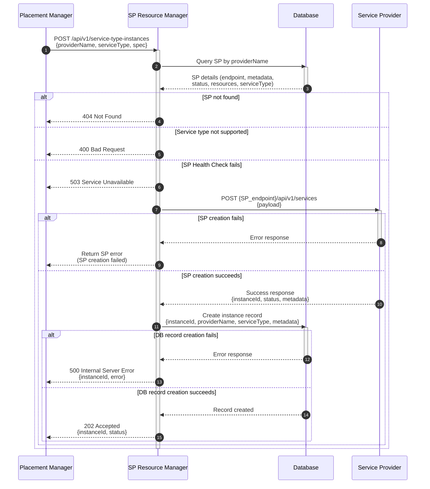

# Service Provider Resource Manager

## Summary

The DCM Service Provider Resource Manager provides a centralized intermediary
service between Placement Manager and Service Providers (SPs) for creating and
managing service type instances. Rather than having Placement Manager directly
call individual SPs, the Resource Manager abstracts SP interactions by handling
SP lookup (retrieving SP endpoints and metadata from the Service Registry),
health validation, instance tracking, and database persistence. This design
simplifies Placement Manager logic, ensures consistent instance management
across all SPs, and provides a single point of control for instance lifecycle
operations within DCM core.

## Motivation

### Goals

- Define CRUD endpoints for creating and managing service type instance.

### Non-Goals

- Define flow for registering/de-registering providers (covered in
  [Registration Flow documentation](https://github.com/dcm-project/enhancements/blob/main/enhancements/sp-registration-flow/sp-registration-flow.md))
- Define status reporting mechanism for SPs (covered in Status reporting
  documentation)
- Define health check status reporting for SPS (covered in SP Provider health
  check)
- Define authentication and authorization.
- Define Update endpoint is out of scope for the first version (v1)

## Proposal

### Assumptions

- The SP Resource Manager has connectivity to the registered SPs.
- The SP Resource Manager has access/permission to the database.
- The SP Resource Manager is reachable from the Placement Manager.
- The SP Resource Manager lives within the SP API.
- The database persists both SP registry information and created resource

### Integrations Points

#### Database Integration

- **Service Registry**:
  - Stores Service Provider's registration information
  - Used for retrieving SP details during instance creation
  - SP info includes `endpoints`, `metadata`, `status` and `resource
    capacity`
- **Service Type Instance Records**:
  - Stores created service type instance information
  - Instance data includes `instanceId`, `providerName`, `serviceType`,
    `status`.
  - Maintains record of all created instances within DCM core

### API Endpoints

The CRUD endpoints are consumed by the DCM Placement Manager to create
and manage instances of service types.

#### Endpoints Overview

| Method | Endpoint                                    | Description                      |
|--------|---------------------------------------------|----------------------------------|
| POST   | /api/v1/service-type-instances              | Create a service type instance   |
| GET    | /api/v1/service-type-instances              | List all service type instances  |
| GET    | /api/v1/service-type-instances/{instanceId} | Get a service type instance      |
| DELETE | /api/v1/service-type-instances/{instanceId} | Delete a service type instance   |
| GET    | /api/v1/health                              | SP Resource Manager health check |

###### AEP Compliance

These endpoints are defined based on AEP standards and use aep-openapi-linter to
check for compliance with AEP.

**POST /api/v1/service-type-instances**  
Create a service type instance.

The POST endpoint provides an interface to create instances of
service types that are supported by DCM.

Snippet of supported service type schema for the request body

```yaml
requestBody:
  required: true
  content:
    application/json:
      schema:
        type: object
        required:
          - providerName
          - serviceType
          - spec
        properties:
          providerName:
            type: string
            description: The unique identifier of the target Service Provider
            example: "kubevirt-sp"
          serviceType:
            type: string
            description: Type of service to create
            example: "vm"
          spec:
            type: object
            description: |
              Service specification following one of the supported service type
              schemas (VMSpec, ContainerSpec, DatabaseSpec, or ClusterSpec).
            additionalProperties: true
```

Example of payload for incoming VM request
```json
{
  "providerName": "kubevirt-sp",
  "serviceType": "vm",
  "spec": {
    "memory": { "size": "2GB" },
    "vcpu": { "count": 2 },
    "guestOS": { "type": "fedora-39" },
    "access":
    { "sshPublicKey": "ssh-ed25519 AAAAC3NzaC1lZDI1NTE5AAAAIExample..." },
    "metadata": { "name": "fedora-vm" }
  }
}
```

**GET /api/v1/service-type-instances**  
List all service type instances according to AEP standards.

Example of Response Payload
```json
[
  {
    "serviceType": "container",
    "name": "nginx-container",
    "providerName": "container-sp",
    "instanceId": "696511df-1fcb-4f66-8ad5-aeb828f383a0",
    "status": "PROVISIONING"
  },
  {
    "serviceType": "database",
    "name": "postgres-001",
    "providerName": "postgres-sp",
    "instanceId": "c66be104-eea3-4246-975c-e6cc9b32d74d",
    "status": "FAILED"
  },
  {
    "serviceType": "vm",
    "name": "ubuntu-vm",
    "providerName": "kubevirt-sp",
    "instanceId": "08aa81d1-a0d2-4d5f-a4df-b80addf07781",
    "status": "PROVISIONING"
  }
]
```

**GET /api/v1/service-type-instances/{instanceId}**  
Get a service type instance based on id.

Example of Response Payload
```json
{
  "serviceType": "vm",
  "name": "ubuntu-vm",
  "providerName": "kubevirt-sp",
  "instanceId": "08aa81d1-a0d2-4d5f-a4df-b80addf07781",
  "status": "PROVISIONING"
}
```

**Delete /api/v1/service-type-instances/{instanceId}**  
Delete a service type instance based on id.

**GET /api/v1/health**  
Retrieve the health status of SP Resource Manager.

## Design Details

### Service Type Instance Creation Flow

This flow demonstrates the creation of a service type instance (VMs, containers,
databases, or clusters) through the SP Resource Manager. It involves
communication between the Placement Manager, SP Resource Manager, database, and
the targeted Service Provider.



#### Steps

- **Request Reception**
  - SP Resource Manager receives a POST request (`/api/v1/service-type-instances`) from
    Placement Manager with:
    - `providerName`: The unique identifier of the target Service Provider
    - `spec`: The detailed spec following any of service type 
       schema (VMSpec, ContainerSpec, DatabaseSpec, or ClusterSpec)
    - `serviceType`: The type of service instance requested
- **Service Provider Lookup**
  - Queries the Service Registry database using the `providerName`
  - Retrieves:
    - Service Provider endpoint URL
    - SP metadata (region, providerName etc)
    - Current SP status (healthy, degraded, unavailable)
  - If SP is not found, returns 404 error to Placement Manager
  - If SP status is degraded or unavailable, returns 503 error to Placement Manager
  - If `serviceType` is not supported, returns 400 Bad Request
- **Service Provider Invocation**
  - Calls the Service Provider's API endpoint:
    `POST {SP_endpoint}/api/v1/services`
  - Forwards the service specification (payload) to the SP
  - If SP instance creation fails, forward the SP's error response to Placement Manager
- **Persist Response**
  - Receives response from Service Provider containing:
    - `instanceId`: Unique identifier for the created instance
    - `status`: Creation status (`PROVISIONING`)
  - Stores instance metadata in the database
  - If database record creation fails, returns 500 Internal Server Error with
    `instanceId` included in error response (instance was created by SP but
    tracking failed)
- **Response to Placement Manager**
  - Returns success response (202 Accepted) with:
    - `instanceId`: The created instance identifier
    - `status`: Current instance status
  - Returns error response with appropriate HTTP status code and error details
    if any step fails

#### Error Handling

- **404 Not Found**: Service Provider with the given `providerName` is not
  registered
- **400 Bad Request**: Invalid request schema or unsupported service type
- **503 Service Unavailable**: Service Provider is not healthy
- **500 Internal Server Error**: Unexpected error in SP Resource Manager
