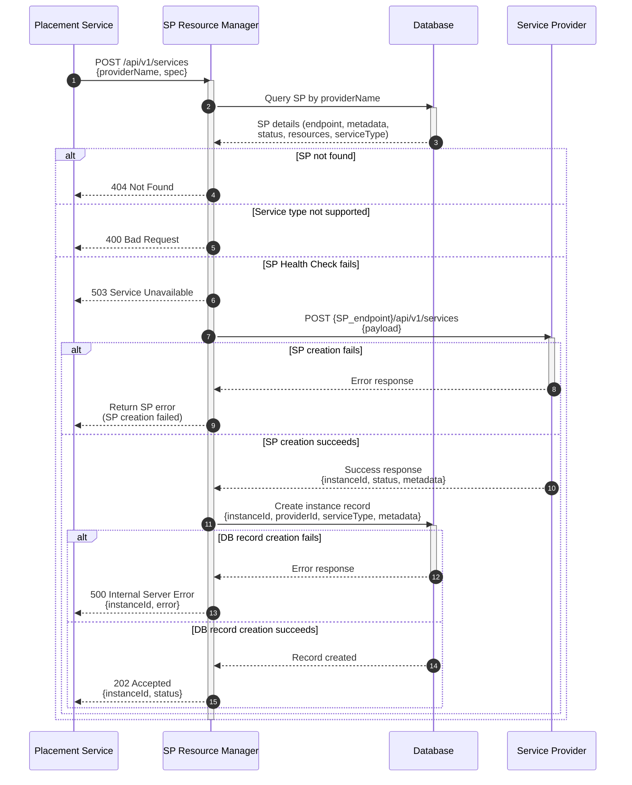

# Service Provider Resource Manager

## Summary

The DCM Service Provider Resource manager interfaces with the all the
registered providers to create and manage resources within DCM core.

## Motivation

### Goals

- Define CRUD endpoints for creating and managing resources.  
  **Note**: Update endpoint is out of scope for the first version (v1)

### Non-Goals

- Define flow for registering/de-registering providers (covered in
  [Registration Flow documentation](https://github.com/dcm-project/enhancements/blob/main/enhancements/sp-registration-flow/sp-registration-flow.md))
- Define status reporting mechanism for SPs (covered in Status reporting
  documentation)
- Define health check status reporting for SPS (covered in SP Provider health
  check)
- Define authentication and authorization.

## Proposal

### Assumptions

- The SP Resource Manager has connectivity to the registered SPs.
- The SP Resource Manager has access/permission to the database.
- The SP Resource Manager is reachable from the Placement service.
- The SP Resource Manager lives within the SP API.
- The database persists both SP registry information and created resource

### Integrations Points

#### Database Integration

- **Service Registry**:
  - Stores Service Provider's registration information
  - SP metadata includes (`endpoints`, `metadata`, `status` and `resource
    capacity`)
  - For retrieving SP details during resource/instance creation
- **Resource/Service Instance Records**:
  - Stores created service instance information
  - Instance metadata includes (`instanceId`, `providerId`, `serviceType`,
    `status`)
  - Maintains record of all created instances within DCM core

### API Endpoints

The CRUD endpoints are consumed by the DCM Placement Service/Manager to create
and manage instances of service types.

#### Endpoints Overview

| Method | Endpoint                      | Description                      |
| ------ | ----------------------------- | -------------------------------- |
| POST   | /api/v1/services              | Create a service instance        |
| GET    | /api/v1/services              | List all resources.              |
| GET    | /api/v1/services/{instanceId} | Get a service instance           |
| DELETE | /api/v1/services/{instanceId} | Delete a service instance        |
| GET    | /api/v1/health                | SP Resource Manager health check |

###### AEP Compliance

These endpoints are defined based on AEP standards and use aep-openapi-linter to
check for compliance with AEP.

**POST /api/v1/services**  
Create a service instance.

The POST endpoint follows the contract defined in DCM service type schemas. It
can create instances/resources of service types that are supported by DCM.

Snippet of supported service type schema for the request body (for full schema, see
[Schema documentation](https://github.com/dcm-project/enhancements/blob/main/enhancements/service-type-definitions/service-type-definitions.md))

```yaml
content:
  application/json:
    schema:
      type: object
      required:
        - providerId
        - spec
      properties:
        providerId:
          type: string
          description: The unique identifier of the target Service Provider
          example: "b4c9c543-fad8-4e0e-b027-a7bca416214f"
        spec:
          description:
            Service specification following one of the supported service type
            schemas
          oneOf:
            - $ref: "#/components/schemas/VMSpec"
            - $ref: "#/components/schemas/ContainerSpec"
            - $ref: "#/components/schemas/DatabaseSpec"
            - $ref: "#/components/schemas/ClusterSpec"
```

Example of payload for incoming VM request
```json
{
  "providerId": "d679e1a7-77bd-4eea-b25c-865b534e56e2",
  "spec": {
    "memory": { "size": "2GB" },
    "vcpu": { "count": 2 },
    "guestOS": { "type": "fedora-39" },
    "access":
    { "sshPublicKey": "ssh-ed25519 AAAAC3NzaC1lZDI1NTE5AAAAIExample..." },
    "metadata": { "name": "fedora-vm" },
    "schemaVersion": "v1alpha1",
    "serviceType": "vm"
  }
}
```

**GET /api/v1/services**  
List all service instances with limit.

**GET /api/v1/services/{instanceId}**  
Get a service instance based on id.

**Delete /api/v1/services/{instanceId}**  
Delete a service instance based on id.

**GET /api/v1/health**  
Retrieve the health status of SP Resource Manager.

## Design Details

### Service Instance Creation Flow

This flow demonstrates the creation of a service instance (VMs, containers,
databases, or clusters) through the SP Resource Manager. It involves
coordination between the Placement Service, SP Resource Manager, database, and
the target Service Provider.  
**Note**: The `serviceType` field is extracted from within the spec field of 
the incoming request. For the schema structure definition, see 
[common fields](https://github.com/dcm-project/enhancements/blob/main/enhancements/service-type-definitions/service-type-definitions.md#schema-structure)
and 
[vmspec](https://github.com/dcm-project/enhancements/blob/main/enhancements/service-type-definitions/service-type-definitions.md#schema-structure).



#### Steps

- **Request Reception**
  - SP Resource Manager receives a POST request (`/api/v1/services`) from
    Placement Service with:
    - `providerId`: The unique identifier of the target Service Provider
    - Service specification: The detailed spec following the service type schema
      (VMSpec, ContainerSpec, DatabaseSpec, or ClusterSpec)
- **Request Validation**
  - SP Resource Manager validates the request payload against the service type
    schema
  - Verifies required fields are present
  - Validates data types and constraints
- **Service Provider Lookup**
  - Queries the Service Registry database using the `providerId`
  - Retrieves:
    - Service Provider endpoint URL
    - SP metadata (region, etc)
    - Current SP status (healthy, degraded, unavailable)
  - If SP is not found, returns 404 error to Placement Service
- **Resource Availability Check**
  - Validates that the SP supports the requested `serviceType`
  - Checks available resource capacity against the service specification:
    - CPU availability
    - Memory availability
    - Storage availability
    - Node capacity (for cluster types)
  - Verifies resource constraints and quotas
  - If resources are insufficient, returns 503 Service Unavailable
  - If `serviceType` is not supported, returns 400 Bad Request
- **Service Provider Invocation**
  - Calls the Service Provider's API endpoint:
    `POST {SP_endpoint}/api/v1/services`
  - Forwards the service specification (payload) to the SP
- **Persist Response**
  - Receives response from Service Provider containing:
    - `instanceId`: Unique identifier for the created instance
    - `status`: Creation status (`PROVISIONING`)
  - Stores instance metadata in the database
- **Response to Placement Service**
  - Returns success response (202 Accepted) with:
    - `instanceId`: The created instance identifier
    - `status`: Current instance status
  - Returns error response with appropriate HTTP status code and error details
    if any step fails

#### Error Handling

- **404 Not Found**: Service Provider with the given `providerId` is not
  registered
- **400 Bad Request**: Invalid request schema or unsupported service type
- **503 Service Unavailable**: Service Provider has insufficient resources
- **500 Internal Server Error**: Unexpected error in SP Resource Manager
