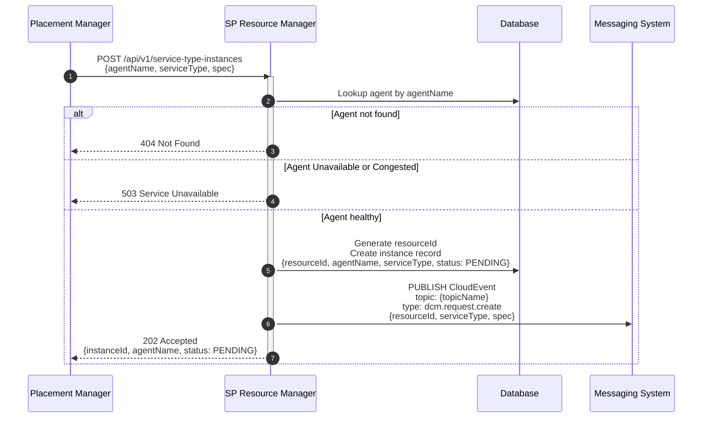
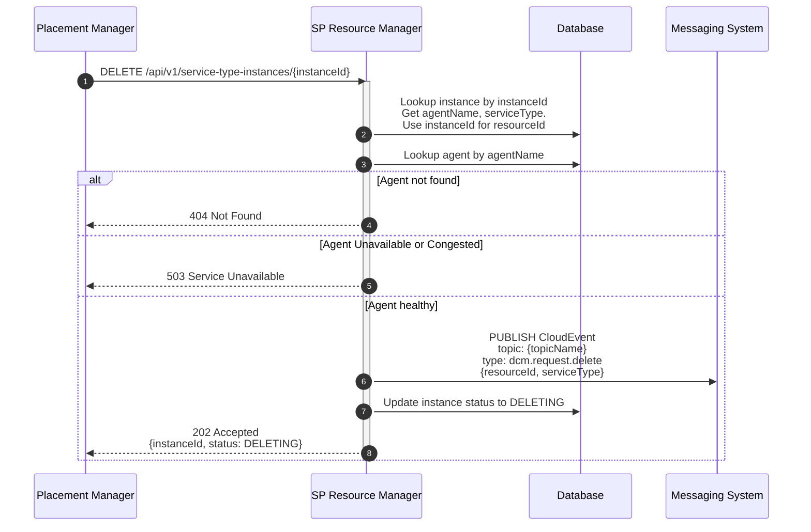
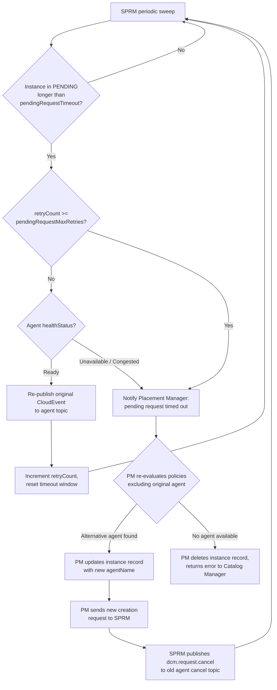

# Service Provider Resource Manager

## Summary

The DCM Service Provider Resource Manager (SPRM) provides a centralized
intermediary service between Placement Manager and Environment Agents for
creating and managing service type instances. Rather than having Placement
Manager interact with Service Providers directly, the Resource Manager abstracts
agent interactions by looking up agent details from the Agent Registry, checking
agent health and congestion state, publishing creation and deletion CloudEvents
to the agent's messaging topic, and consuming responses from
`dcm.agents.responses`. This design simplifies Placement Manager logic, ensures
consistent instance management across all agents, and provides a single point of
control for instance lifecycle operations within DCM core.

## Motivation

### Goals

- Define CRUD endpoints for creating and managing service type instance.

### Non-Goals

- Define flow for registering/de-registering providers (covered in
  [Registration Flow documentation](https://github.com/dcm-project/enhancements/blob/main/enhancements/sp-registration-flow/sp-registration-flow.md))
- Define status reporting mechanism for SPs (covered in Status reporting
  documentation)
- Define health check status reporting for SPS (covered in SP Provider health
  check)
- Define authentication and authorization.
- Define Update endpoint is out of scope for the first version (v1)

## Proposal

### Assumptions

- The SP Resource Manager has access to the Messaging System for publishing
  CloudEvents and consuming responses.
- A Messaging System (e.g., NATS) is deployed and accessible.
- The SP Resource Manager has access to the Agent Registry and instance record
  database.
- The SP Resource Manager is reachable from the Placement Manager.
- The SP Resource Manager lives within the SP API.

### Integrations Points

#### Database Integration

- **Agent Registry**:
  - Stores Agent registration information (name, environment, serviceTypes,
    topicName, cost, healthStatus, consumerLag)
  - Used for retrieving agent details during instance creation and deletion
- **Service Type Instance Records**:
  - Stores created service type instance information
  - Instance data includes `instanceId`, `agentName`, `serviceType`, `status`.
    The `providerName` field is populated asynchronously from the agent's
    creation-acknowledged CloudEvent.
  - Maintains record of all created instances within DCM core

#### Messaging System

- **Publishing**: SPRM publishes creation and deletion request CloudEvents to
  the agent's main topic (`{agentTopicName}`), and cancel CloudEvents to the
  agent's cancel topic (`{agentTopicName}.cancel`)
- **Consuming**: SPRM consumes response CloudEvents from `dcm.agents.responses`

### API Endpoints

The CRUD endpoints are consumed by the DCM Placement Manager to create and
manage instances of service types.

#### Endpoints Overview

| Method | Endpoint                                    | Description                      |
| ------ | ------------------------------------------- | -------------------------------- |
| POST   | /api/v1/service-type-instances              | Create a service type instance   |
| GET    | /api/v1/service-type-instances              | List all service type instances  |
| GET    | /api/v1/service-type-instances/{instanceId} | Get a service type instance      |
| DELETE | /api/v1/service-type-instances/{instanceId} | Delete a service type instance   |
| GET    | /api/v1/health                              | SP Resource Manager health check |

###### AEP Compliance

These endpoints are defined based on AEP standards and use aep-openapi-linter to
check for compliance with AEP.

**POST /api/v1/service-type-instances**  
Create a service type instance.

The POST endpoint provides an interface to create instances of service types
that are supported by DCM.

Snippet of supported service type schema for the request body

```yaml
requestBody:
  required: true
  content:
    application/json:
      schema:
        type: object
        required:
          - agentName
          - serviceType
          - spec
        properties:
          agentName:
            type: string
            description: The name of the target Environment Agent
            example: "prod-eu-agent"
          serviceType:
            type: string
            description:
              The type of service to create (e.g., vm, container, database,
              cluster)
            example: "vm"
          spec:
            type: object
            description: |
              Service specification following one of the supported service type
              schemas (VMSpec, ContainerSpec, DatabaseSpec, or ClusterSpec).
            additionalProperties: true
```

Example of payload for incoming VM request

```json
{
  "agentName": "prod-eu-agent",
  "serviceType": "vm",
  "spec": {
    "memory": { "size": "2GB" },
    "vcpu": { "count": 2 },
    "guestOS": { "type": "fedora-39" },
    "access": {
      "sshPublicKey": "ssh-ed25519 AAAAC3NzaC1lZDI1NTE5AAAAIExample..."
    },
    "metadata": { "name": "fedora-vm" }
  }
}
```

**GET /api/v1/service-type-instances**  
List all service type instances according to AEP standards.

Example of Response Payload

```json
[
  {
    "name": "nginx-container",
    "agentName": "container-agent",
    "instanceId": "696511df-1fcb-4f66-8ad5-aeb828f383a0",
    "status": "RUNNING"
  },
  {
    "name": "postgres-001",
    "agentName": "postgres-agent",
    "instanceId": "c66be104-eea3-4246-975c-e6cc9b32d74d",
    "status": "FAILED"
  },
  {
    "name": "ubuntu-vm",
    "agentName": "prod-eu-agent",
    "instanceId": "08aa81d1-a0d2-4d5f-a4df-b80addf07781",
    "status": "PENDING"
  }
]
```

**GET /api/v1/service-type-instances/{instanceId}**  
Get a service type instance based on id.

Example of Response Payload

```json
{
  "name": "ubuntu-vm",
  "agentName": "prod-eu-agent",
  "instanceId": "08aa81d1-a0d2-4d5f-a4df-b80addf07781",
  "status": "RUNNING"
}
```

**Delete /api/v1/service-type-instances/{instanceId}**  
Delete a service type instance based on id.

**GET /api/v1/health**  
Retrieve the health status of SP Resource Manager.

## Design Details

### Service Type Instance Creation Flow

This flow demonstrates the creation of a service type instance (VMs, containers,
databases, or clusters) through the SP Resource Manager. It involves
communication between the Placement Manager, SP Resource Manager, database, and
the Messaging System.


```mermaid
sequenceDiagram
    autonumber
    participant PS as Placement Manager
    participant SPRM as SP Resource Manager
    participant DB as Database
    participant MS as Messaging System

    PS->>SPRM: POST /api/v1/service-type-instances<br/>{agentName, serviceType, spec}
    activate SPRM

    SPRM->>DB: Lookup agent by agentName
    alt Agent not found
        SPRM-->>PS: 404 Not Found
    else Agent Unavailable or Congested
        SPRM-->>PS: 503 Service Unavailable

    else Agent healthy
        SPRM->>DB: Generate resourceId<br/>Create instance record<br/>{resourceId, agentName, serviceType, status: PENDING}

        SPRM->>MS: PUBLISH CloudEvent<br/>topic: {topicName}<br/>type: dcm.request.create<br/>{resourceId, serviceType, spec}

        SPRM-->>PS: 202 Accepted<br/>{instanceId, agentName, status: PENDING}
    end
    deactivate SPRM
```

#### Steps

- **Request Reception**
  - SP Resource Manager receives a POST request
    (`/api/v1/service-type-instances`) from Placement Manager with:
    - `agentName`: The name of the target Environment Agent
    - `serviceType`: The type of service to create (e.g., vm, container)
    - `spec`: The detailed spec following any of the service type schemas
      (VMSpec, ContainerSpec, DatabaseSpec, or ClusterSpec)
- **Agent Lookup**
  - Queries the Agent Registry by `agentName`
  - Retrieves:
    - `topicName`: The agent's messaging topic
    - `healthStatus`: Current agent health (Ready, Unavailable)
    - `consumerLag`: Current consumer lag for congestion detection
  - If agent is not found, returns 404 error to Placement Manager
  - If agent is Unavailable (missed heartbeats) or Congested (consumer lag
    threshold exceeded), returns 503 error to Placement Manager
- **Instance Record Creation**
  - Generates a `resourceId` for the new instance
  - Creates an instance record in the database with status `PENDING`
  - The record includes `resourceId`, `agentName`, `serviceType`, and `status`
- **CloudEvent Publishing**
  - Publishes a creation request CloudEvent to the agent's topic (`{topicName}`)
    via the Messaging System
  - CloudEvent type: `dcm.request.create`
  - CloudEvent data: `{resourceId, serviceType, spec}`
  - See
    [Environment Agent - CloudEvent Message Definitions](../environment-agent/environment-agent.md#cloudevent-message-definitions)
    for the full CloudEvent schema
- **Response to Placement Manager**
  - Returns 202 Accepted with:
    - `instanceId`: The created instance identifier
    - `agentName`: The target agent
    - `status`: `PENDING`
  - At this point only `agentName` is known; `providerName` is populated
    asynchronously when the agent's creation-acknowledged response arrives

### Service Type Instance Deletion Flow

This flow demonstrates the deletion of a service type instance through the SP
Resource Manager. It mirrors the creation flow, publishing a deletion CloudEvent
instead of a creation one.


```mermaid
sequenceDiagram
    autonumber
    participant PS as Placement Manager
    participant SPRM as SP Resource Manager
    participant DB as Database
    participant MS as Messaging System

    PS->>SPRM: DELETE /api/v1/service-type-instances/{instanceId}
    activate SPRM

    SPRM->>DB: Lookup instance by instanceId<br/>Get agentName, serviceType.<br/>Use instanceId for resourceId

    SPRM->>DB: Lookup agent by agentName
    alt Agent not found
        SPRM-->>PS: 404 Not Found
    else Agent Unavailable or Congested
        SPRM-->>PS: 503 Service Unavailable
    else Agent healthy
        SPRM->>MS: PUBLISH CloudEvent<br/>topic: {topicName}<br/>type: dcm.request.delete<br/>{resourceId, serviceType}

        SPRM->>DB: Update instance status to DELETING
        SPRM-->>PS: 202 Accepted<br/>{instanceId, status: DELETING}
    end
    deactivate SPRM
```

#### Steps

- **Request Reception**
  - SP Resource Manager receives a DELETE request
    (`/api/v1/service-type-instances/{instanceId}`) from Placement Manager
- **Instance Lookup**
  - Queries the database by `instanceId`
  - Retrieves `agentName` and `serviceType` from the instance record
  - `resourceId` is set with the value of `instanceId`
- **Agent Lookup**
  - Queries the Agent Registry by `agentName`
  - Retrieves `topicName`, `healthStatus`, and `consumerLag`
  - If agent is not found, returns 404 error to Placement Manager
  - If agent is Unavailable or Congested, returns 503 error to Placement Manager
- **CloudEvent Publishing**
  - Publishes a deletion request CloudEvent to the agent's topic (`{topicName}`)
    via the Messaging System
  - CloudEvent type: `dcm.request.delete`
  - CloudEvent data: `{resourceId, serviceType}`
  - See
    [Environment Agent - CloudEvent Message Definitions](../environment-agent/environment-agent.md#cloudevent-message-definitions)
    for the full CloudEvent schema
- **Instance Record Update**
  - Updates the instance record status to `DELETING`
- **Response to Placement Manager**
  - Returns 202 Accepted with:
    - `instanceId`: The instance identifier
    - `status`: `DELETING`

> **Note:** For **queued creation requests**, the Placement Manager also uses
> this DELETE endpoint to cancel the queued creation when its
> `queuedRequestTimeout` expires. PM then re-evaluates policies (excluding the
> timed-out agent) to route the creation to an alternative agent. The agent
> handles creation/deletion dedup in its retry topic — if both the original
> creation request and the cancellation DELETE are present, they cancel out (see
> [Environment Agent — Retry Topic](../environment-agent/environment-agent.md#retry-topic)).
> For **queued deletion requests**, re-routing to a different agent is not
> possible because the resource exists on the original agent's SP. The deletion
> request remains in the Agent's retry topic and is processed automatically when
> the SP recovers, or rejected if the SP becomes Unavailable (see
> [Environment Agent — Retry Topic](../environment-agent/environment-agent.md#retry-topic)).

### Instance Status Lifecycle

An instance transitions through the following statuses during its lifecycle.
`PENDING` is the initial status set synchronously when SPRM publishes the
creation CloudEvent. `PROVISIONING` is set asynchronously once the Agent
acknowledges the request, confirming that an SP has begun processing it.

| Status         | Meaning                                                      |
| -------------- | ------------------------------------------------------------ |
| `PENDING`      | CloudEvent published to agent topic; awaiting acknowledgment |
| `QUEUED`       | Agent received request but SP is unhealthy; held in retry    |
| `PROVISIONING` | Agent acknowledged; SP is actively provisioning              |
| `RUNNING`      | Resource provisioned and operational                         |
| `DELETING`     | Deletion request published or acknowledged                   |
| `FAILED`       | Agent or SP reported an error                                |
| `DELETED`      | Resource deleted                                             |

### Asynchronous Response Processing

The SP Resource Manager consumes response CloudEvents from the
`dcm.agents.responses` topic. These responses are published by Environment
Agents after processing creation or deletion requests. The following table
describes the actions taken for each response type:

| CloudEvent Type                   | Action                                                                                                                                                                                                                          |
| --------------------------------- | ------------------------------------------------------------------------------------------------------------------------------------------------------------------------------------------------------------------------------- |
| `dcm.agent.creation-acknowledged` | Update instance record: status from `PENDING` to `PROVISIONING`, store `providerName` from response                                                                                                                             |
| `dcm.agent.deletion-acknowledged` | Update instance record: status to `DELETING`                                                                                                                                                                                    |
| `dcm.agent.error`                 | Update instance record: status to `FAILED`, store error details. Notify Placement Manager.                                                                                                                                      |
| `dcm.agent.request-queued`        | Update instance record: status to `QUEUED`. Report queued status to Placement Manager (PM handles timeout logic).                                                                                                               |
| `dcm.agent.cancel-rejected`       | The agent could not cancel the creation (resource already provisioning on its SP). SPRM sends a deletion request to the old agent to remove the resource, since the re-evaluated agent is the authoritative `resourceId` owner. |

Note: `providerName` in instance records is populated asynchronously. At 202
response time, only `agentName` is known. The `providerName` is set when the
agent's `dcm.agent.creation-acknowledged` CloudEvent arrives, which includes the
SP that ultimately handled the request.

See
[Environment Agent - CloudEvent Message Definitions](../environment-agent/environment-agent.md#cloudevent-message-definitions)
for the full CloudEvent type definitions and data schemas.

### Pending Request Timeout

If an agent consumes a creation request from its topic but crashes before
publishing a response (creation-acknowledged, request-queued, or error), the
instance record remains in `PENDING` indefinitely. The retry topic only covers
the case where the agent explicitly holds a request because its SP is Unhealthy.
To address the gap where a consumed message is lost due to an agent crash, SPRM
runs a periodic sweep of `PENDING` instance records and applies a configurable
timeout with retries.

#### Flow


```mermaid
flowchart TD
    A[SPRM periodic sweep] --> B{Instance in PENDING<br/>longer than<br/>pendingRequestTimeout?}
    B -- No --> A
    B -- Yes --> C{retryCount >=<br/>pendingRequestMaxRetries?}
    C -- No --> D{Agent healthStatus?}
    D -- Ready --> E[Re-publish original CloudEvent<br/>to agent topic]
    E --> F[Increment retryCount,<br/>reset timeout window]
    F --> A
    D -- Unavailable / Congested --> G[Notify Placement Manager:<br/>pending request timed out]
    C -- Yes --> G
    G --> H{PM re-evaluates policies<br/>excluding original agent}
    H -- Alternative agent found --> I[PM updates instance record<br/>with new agentName]
    I --> J[PM sends new creation<br/>request to SPRM]
    J --> K[SPRM publishes dcm.request.cancel<br/>to old agent cancel topic]
    K --> A
    H -- No agent available --> L[PM deletes instance record,<br/>returns error to Catalog Manager]
```

#### Behavior

1. SPRM periodically scans instance records with status `PENDING`
2. For each record older than `pendingRequestTimeout`:
   - If `retryCount < pendingRequestMaxRetries` **and** the agent is Ready: SPRM
     re-publishes the original CloudEvent to the agent's topic, increments
     `retryCount`, and resets the timeout window
   - If `retryCount >= pendingRequestMaxRetries` **or** the agent is
     Unavailable/Congested: SPRM notifies Placement Manager that the pending
     request has timed out. PM takes over (see
     [Placement Manager — Pending Request Timeout](../placement-manager/placement-manager.md#pending-request-timeout))
3. When PM re-evaluates and routes the request to a different agent, SPRM
   publishes a `dcm.request.cancel` CloudEvent to the **old** agent's cancel
   topic (`{agentTopicName}.cancel`) to prevent stale message processing (see
   [Environment Agent — Cancel Topic](../environment-agent/environment-agent.md#cancel-topic))
4. When PM re-evaluates and no alternative agent is available, PM deletes the
   instance record and returns an error to Catalog Manager

#### Configuration

| Parameter                  | Type     | Default | Description                                                                                                                                                                                       |
| -------------------------- | -------- | ------- | ------------------------------------------------------------------------------------------------------------------------------------------------------------------------------------------------- |
| `pendingRequestTimeout`    | Duration | `60s`   | How long SPRM waits before acting on a `PENDING` instance record that has not received an agent response. Each retry resets the window.                                                           |
| `pendingRequestMaxRetries` | integer  | `3`     | Maximum number of times SPRM re-publishes the creation CloudEvent before escalating to Placement Manager. When set to `0`, SPRM escalates immediately on the first timeout without re-publishing. |

#### Re-publish / Response Race

Because SPRM consumes agent responses asynchronously, there is a window where
the agent has published a `creation-acknowledged` response but SPRM has not yet
processed it into the database. A timeout sweep during this window may
re-publish a CloudEvent that the agent has already processed. This race is
acceptable because SPs are expected to guarantee idempotent creation: if a
creation request arrives for a resource that is already provisioned or
in-progress, the SP rejects the duplicate without side effects. See
[SP Idempotency Requirement](#sp-idempotency-requirement).

#### Cancel on Re-evaluation

When Placement Manager re-evaluates and selects a different agent, SPRM
publishes a `dcm.request.cancel` CloudEvent to the old agent's cancel topic. If
the old agent later rejects the cancellation (the resource is already
provisioning on its SP), SPRM sends a deletion request to the old agent to
remove the resource, preserving the re-evaluated agent as the authoritative
owner of the `resourceId`.

### SP Idempotency Requirement

The pending request timeout mechanism may cause an agent to receive the same
creation CloudEvent more than once. Additionally, re-evaluation to a different
agent while the original agent later recovers can result in two agents receiving
creation requests for the same `resourceId`.

SPs are expected to guarantee idempotent creation. The SP determines which
attribute(s) to use for detecting duplicates (e.g., `resourceId`,
`metadata.name`, or another unique attribute). If a creation request arrives for
a resource that the SP has already provisioned or is actively provisioning, the
SP rejects the request without creating a duplicate resource.

This requirement is documented as an assumption. The specific idempotency
mechanism is an SP implementation concern — different SPs may use different
strategies depending on the underlying platform.

#### Error Handling

- **404 Not Found**: Agent with the given `agentName` is not registered
- **400 Bad Request**: Invalid request schema
- **503 Service Unavailable**: Agent is Unavailable (missed heartbeats) or
  Congested (consumer lag threshold exceeded)
- **500 Internal Server Error**: Unexpected error in SP Resource Manager

### Future Improvements

- Dead-letter handling for unprocessable responses
- Batch publishing of CloudEvents
