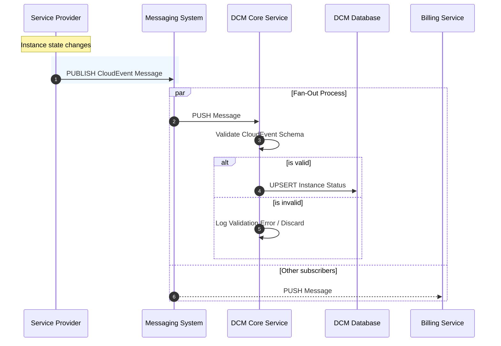

# Service Provider Status Reporting via messaging system by CloudEvents

## Summary

This proposal outlines the event-driven architecture for reporting Service
Provider resource states (e.g., VM or Container status). By leveraging the
messaging system and [CloudEvents](https://cloudevents.io/) as the standard data
format, we establish a scalable "fire-and-forget" mechanism. Service Providers
will publish status updates to a message bus, which the DCM subscribes to,
ensuring the observed state of the system is updated in near real-time without
tight coupling or API bottlenecks.

## Motivation

As the platform scales to support thousands of instances across multiple
providers, the current synchronous HTTP `PUT` model poses significant risks:

1.  **Scalability:** High-frequency status updates (e.g., during mass
    provisioning or region recovery) can flood the DCM API.
2.  **Coupling:** Providers require knowledge of specific DCM endpoints and must
    implement complex retry logic for downtime.
3.  **Extensibility:** Adding new consumers (e.g., Billing, Auditing) requires
    modifying the Provider to make additional API calls.

Moving to message system and **CloudEvents** resolves these issues by decoupling
the Producer (Provider) from the Consumer (DCM) and standardizing the event
envelope.

### Goals

- Define a standardized, event-driven contract for Service Providers to report
the "observed state" of resources.
- Decouple the Service Provider implementation from the DCM backend logic.
- Support high-throughput status reporting without degrading DCM API
  performance.
- Standardize event metadata using the CNCF CloudEvents specification.

### Non-Goals

- Defining the internal monitoring logic of specific Service Providers.
- Defining "Provider Health" (heartbeats), which is covered in a separate
  proposal.
- Authentication between DCM and SPs.

## Proposal

We propose adopting a **Kubernetes-style Declarative Model** where Service
Providers act as **Publishers** and the DCM acts as a **Subscriber**.

Instead of calling a specific API endpoint, Providers will emit events to a
message bus subject whenever an instance's state changes. The payload will
adhere to a strict schema (VMStatus/ContainerStatus) wrapped in a CloudEvent
envelope.

### User Stories

- **As a Service Provider Developer**, I want to reliantly publish a status update message
  ("fire and forget") so that I don't have to implement complex retry logic if
  the DCM is briefly unavailable.
- **As a Platform Admin**, I want to see the status of VMs update in real-time
  on my dashboard without waiting for a polling interval.
- **As a Billing System Maintainer**, I want to listen to "Instance Stopped"
events to calculate costs without asking the Core Team to build a new API for
  me.

### Risks and Mitigations

| Risk                  | Mitigation                                                                                                                                        |
| :-------------------- | :------------------------------------------------------------------------------------------------------------------------------------------------ |
| **Message Loss**      | For critical transitions, we can use message system persistence to ensure at-least-once delivery with persistence, also to not overload database. |
| **Flooding/Flapping** | Providers must implement "Debounce" logic to avoid sending updates for rapid status oscillation (e.g., running->error->running) within milliseconds.     |

## Design Details

### 1. Flow diagram



### 2. Message system Subject Hierarchy

Providers must publish events with type formatted as follow to allow for
granular subscriptions:

`dcm.providers.{providerName}.{serviceType}.instances.{instanceId}.status`

- `providerName`: Unique name of the Service Provider.
- `serviceType`: Unique name of the Service Type.
- `instanceId`: Unique UUID of the service.

### 3. CloudEvents Format

All messages must be valid JSON CloudEvents (v1.0). We currently define only
very simple format for `VmStatus` and `ContainerStatus`.

```golang
type VmStatus struct {
  Status string `json:"status"`
  Message string `json:"message"`
}
```

```golang
type ContainerStatus struct {
  Status string `json:"status"`
  Message string `json:"message"`
}
```

**Example golang event**

```golang
cloudevents "github.com/cloudevents/sdk-go/v2"

type VmStatus struct {
  Status string `json:"status"`
  Message string `json:"message"`
}

event := cloudevents.NewEvent()
event.SetID("event-123-456")
event.SetSource("{providerName}-{environmentName}")
event.SetType("dcm.providers.{providerName}.{serviceType}.instances.{instanceId}.status")
event.SetData(cloudevents.ApplicationJSON, VmStatus{Status: "Running", Message: "VM is running."})
```

### 4. Status mapping

To ensure a consistent user experience across different cloud backends (e.g.,
AWS, Azure, On-Premise), the DCM enforces a strict **Generic Status Enum**.
Service Providers are responsible for normalizing their internal raw state into
these generic states before publishing the CloudEvent.

##### VM Status

Providers must map their hypervisor-specific states to the following DCM
Lifecycle Phases: `PROVISIONING`, `RUNNING`, `STOPPED`, `ERROR`, `DELETED`,
`DELETING`, `PAUSED`, `STOPPING`.

| DCM Generic Status | AWS EC2 Equivalent                              | Azure VM Equivalent      | VMWare Equivalent       |
| :----------------- | :---------------------------------------------- | :----------------------- | :---------------------- |
| **PROVISIONING**   | `pending`                                       | `Creating`               | `PoweredOff`            |
| **RUNNING**        | `running`                                       | `running`                | `PoweredOn`             |
| **STOPPED**        | `stopped`, `stopping`                           | `stopped`, `deallocated` | `PoweredOff`            |
| **FAILED**         | `terminated`, `error`                           | `Failed`                 | `Error`                 |
| **DELETED**        | `terminated`                                    | `Deleted`                | `Ref Not Found`         |
| **DELETING**       | `shutting-down`                                 | `Deleting`               | `Destroying`            |
| **PAUSED**         | `N/A (AWS does not pause, only stop/hibernate)` | `paused`                 | `Suspended`             |
| **STOPPING**       | `stopping`                                      | `stopping`               | `GuestOS Shutting Down` |

_Note: If a provider has a state that is ambiguous, they should default to the
closest "active" state or `ERROR` if functionality is impaired._

##### Container status

For container providers, we align closely with the Kubernetes Pod Phase model
but simplified for general consumption. **Target Statuses:** `PENDING`,
`RUNNING`, `SUCCEEDED`, `FAILED`, `UNKNOWN`.

| DCM Generic Status | Kubernetes / Docker Equivalent                     |
| :----------------- | :------------------------------------------------- |
| **PENDING**        | `Pending`, `ContainerCreating`, `ImagePullBackOff` |
| **RUNNING**        | `Running`                                          |
| **SUCCEEDED**      | `Succeeded`, `Exited (0)`                          |
| **FAILED**         | `Failed`, `CrashLoopBackOff`, `Exited (non-zero)`  |
| **UNKNOWN**        | `Unknown` (Node lost)                              |

##### Cluster status

For managed clusters (e.g., K8s clusters), the status reflects the health of the
control plane and worker nodes as a single unit. **Target Statuses:**
`CREATING`, `ACTIVE`, `UPDATING`, `DEGRADED`, `DELETED`.

| DCM Generic Status | Kubernetes                                                         |
| :----------------- | :----------------------------------------------------------------- |
| **CREATING**       | Control plane is provisioning; API is not yet reachable.           |
| **ACTIVE**         | Control plane is healthy and minimum worker nodes are ready.       |
| **UPDATING**       | Rolling upgrade in progress (API remains reachable).               |
| **DEGRADED**       | Control plane is reachable, but critical components are unhealthy. |
| **DELETED**        | Cluster resources have been de-provisioned.                        |

## Message systems

We evaluated several architectural approaches for using message system.

1. Apache Kafka is a distributed event streaming platform known for its high
durability and strict ordering, which allows for replaying historical events.
   While excellent for long-term data retention and audit trails, its heavy
   operational footprint (requiring ZooKeeper or KRaft clusters) and higher
   end-to-end latency make it less ideal for simple, real-time ephemeral state
   synchronization.

2. RabbitMQ offers robust reliability and complex routing capabilities through
   its "Exchange" architecture, ensuring messages are rarely lost via mature
   acknowledgement mechanisms. However, its "smart broker" design can become a
   throughput bottleneck during high-load bursts, and managing queues for
   thousands of dynamic provider instances adds significant configuration
overhead.

3. REST API (Synchronous HTTP) Sticking with the status quo of synchronous PUT
   requests offers the highest simplicity and ease of debugging using standard
   HTTP tools. However, this approach enforces tight coupling between the
   Provider and DCM, where high-frequency bursts (such as a region recovery) can
overwhelm the API server and force developers to implement complex retry
   logic.

4. gRPC Streaming provides high performance and strong typing via binary
   Protobuf serialization, ensuring low-latency communication over HTTP/2. The
   primary downside is its point-to-point nature; it lacks inherent "fan-out"
capabilities, requiring a custom dispatcher implementation to forward status
   updates to multiple downstream consumers like Billing or Auditing.

5. NATS is a lightweight messaging system designed for high scalability,
offering "fire-and-forget" publishing and efficient subject-based fan-out to
multiple subscribers. While it drastically reduces operational overhead and
   latency, it defaults to "at-most-once" delivery, meaning persistence (via
   JetStream) is required if strict delivery guarantees are needed over raw
   speed.

## Making the approach explicitly generic

The core proposal is resource-agnostic, but to make it explicitly and safely
reusable across arbitrary resource types we add the following requirements and
examples.

### Resource identity & type

- Use a clear resource type identifier. Prefer a CloudEvent extension `resourceType`
  (e.g. `resourceType: "vm" | "container" | "volume" | "network" | "cluster"`) or
  include it in the subject (`dcm.providers.{provider}.{resourceType}.{resourceId}.status`).
- The `serviceType` term used earlier should be treated as an alias for
  `resourceType` when the resource is not a VM/Container.

Example subject patterns:

- Instance-like resources: `dcm.providers.{provider}.{resourceType}.instances.{instanceId}.status`
- Non-instance resources: `dcm.providers.{provider}.{resourceType}.{resourceId}.status`
- Wildcards for consumer subscriptions: `dcm.providers.*.volume.*.status` or `dcm.providers.*.*.*.status`

### Common event data contract

Require a small, common status object for all resource types. Resource-specific
fields live alongside this common contract in the `data` payload.

CommonStatus (JSON):

```json
{
  "status": "RUNNING",
  "message": "human readable message",
  "reason": "optional short code",
  "lastTransitionTime": "2025-12-31T23:59:59Z",
  "metadata": { "region": "eu-west-1", "environment": "prod" },
  "resourceSpecific": { }
}
```

- `status` must be one of the DCM Generic Status Enum values described above.
- `reason` is a short machine-friendly string for diagnostics.
- `lastTransitionTime` lets consumers know when the last meaningful state change occurred.
- `metadata` is a free-form map for routing/labels (region, zone, tenant, etc.).
- `resourceSpecific` is an object containing schema-validated fields for that resource.

### Schema registry & versioning

- Require the CloudEvent `dataSchema` attribute to point to a versioned schema
  URI, e.g. `https://schemas.dcm.org/{resourceType}/status-v1.json`.
- Maintain a public schema registry (JSON Schema) for each resource type and
  version. Consumers should validate and handle unknown fields gracefully.
- Versioning rules: only additive, non-breaking changes within a minor version.
  Breaking changes increment the major version and must be coordinated.

### Example resource schemas (abridged)

Volume status (example fields inside `resourceSpecific`):

```json
{
  "sizeGb": 100,
  "attachedTo": "instance-uuid-or-null",
  "iops": 3000
}
```

Network status (example fields inside `resourceSpecific`):

```json
{
  "cidr": "10.0.0.0/24",
  "availableIps": 200,
  "gateway": "10.0.0.1"
}
```

(Full JSON Schemas must be published under the schema registry and referenced
by the `dataSchema` attribute.)

### Delivery semantics, idempotency and deduplication

- Define the delivery contract per subject. By default treat messages as
  "best-effort" (at-most-once) unless the provider publishes to a persisted
  stream (Kafka, NATS JetStream) where at-least-once delivery is available.
- Events MUST include a stable `id` (CloudEvent id). Consumers should use that
  id to deduplicate by persisting recently-seen IDs or using an idempotency
table.
- When at-least-once is used, providers should include an idempotency key when
the same logical update may be retried.

### Consumer validation & graceful failure

- Consumers MUST validate `dataSchema` and `resourceType`. If a message is not
  understood, log and discard or move to a DLQ (dead-letter queue) for manual
  inspection.
- Consumers should implement a conservative default mapping when encountering
  unknown statuses: prefer `UNKNOWN` or `ERROR` until the schema/producer is
  upgraded.

### Operational recommendations

- For low-latency, many-subscriber scenarios prefer NATS with JetStream for
  optional persistence and replay.
- For long-term auditability and replay across partitions prefer Kafka.
- Monitor subject cardinality; create conventions for provider naming and
tenancy to avoid explosion of subjects.
- Enforce publish rate limits per provider and recommend client-side debouncing
  and aggregation for frequent health churn.

## Examples

Example CloudEvent for a volume status (JSON):

```json
{
  "specversion": "1.0",
  "id": "evt-20250101-0001",
  "source": "provider-a-prod",
  "type": "dcm.providers.provider-a.volume.volume-123.status",
  "time": "2025-01-01T00:00:00Z",
  "dataSchema": "https://schemas.dcm.org/volume/status-v1.json",
  "data": {
    "status": "RUNNING",
    "message": "Volume attached and healthy",
    "lastTransitionTime": "2025-01-01T00:00:00Z",
    "metadata": { "region": "eu-west-1" },
    "resourceSpecific": { "sizeGb": 100, "attachedTo": "instance-123" }
  }
}
```

Example CloudEvent for a network status (JSON):

```json
{
  "specversion": "1.0",
  "id": "evt-20250101-0002",
  "source": "provider-a-prod",
  "type": "dcm.providers.provider-a.network.net-123.status",
  "time": "2025-01-01T00:00:00Z",
  "dataSchema": "https://schemas.dcm.org/network/status-v1.json",
  "data": {
    "status": "ACTIVE",
    "message": "Network functional",
    "lastTransitionTime": "2025-01-01T00:00:00Z",
    "resourceSpecific": { "cidr": "10.0.0.0/24", "availableIps": 200 }
  }
}
```

## Backwards compatibility

- Existing providers emitting the VM/Container payloads can continue to do so
  and should add `dataSchema` when possible. Consumers should accept both the
  old and new shapes while logging schema URIs to plan migrations.

---