# DCM User Flows

This document summarizes the primary user flows in the DCM system, covering policy management, service type and catalog item management, service provider lifecycle, and end-to-end CatalogItemInstance creation.

## Table of Contents

- [1. System Overview](#1-system-overview)
- [2. Managing Policies](#2-managing-policies)
  - [2.1 Create Policy](#21-create-policy)
  - [2.2 Policy Evaluation](#22-policy-evaluation)
- [3. Managing ServiceTypes](#3-managing-servicetypes)
  - [3.1 ServiceType Registration](#31-servicetype-registration)
  - [3.2 Supported ServiceTypes](#32-supported-servicetypes)
- [4. Managing CatalogItems](#4-managing-catalogitems)
  - [4.1 Create CatalogItem](#41-create-catalogitem)
  - [4.2 CatalogItem to ServiceType Translation](#42-catalogitem-to-servicetype-translation)
- [5. Service Provider Lifecycle](#5-service-provider-lifecycle)
  - [5.1 Service Provider Registration](#51-service-provider-registration)
  - [5.2 Service Provider Health Checks](#52-service-provider-health-checks)
  - [5.3 Service Provider Status Reporting](#53-service-provider-status-reporting)
- [6. CatalogItemInstance Creation (End-to-End)](#6-catalogiteminstance-creation-end-to-end)
  - [6.1 Full Creation Flow](#61-full-creation-flow)
  - [6.2 Placement Manager Flow](#62-placement-manager-flow)
  - [6.3 SP Resource Manager Flow](#63-sp-resource-manager-flow)
  - [6.4 Service Provider Instance Creation](#64-service-provider-instance-creation)
  - [6.5 Continuous Status Reporting](#65-continuous-status-reporting)

---

## 1. System Overview

The DCM system is composed of the following core components:

| Component | Responsibility |
|---|---|
| **Catalog Manager** | Entry point for user requests; manages CatalogItems and CatalogItemInstances |
| **Catalog DB** | Stores CatalogItems, CatalogItemInstances, and ServiceType definitions |
| **Placement Manager** | Orchestrates instance creation; coordinates policy evaluation and SP selection |
| **Policy Manager (Policy Engine)** | Validates, mutates, and selects Service Providers via REGO policies and OPA |
| **SP Resource Manager** | Intermediary between Placement Manager and Service Providers; handles SP lookup and health validation |
| **Service Registry** | Stores Service Provider registration, endpoints, and metadata |
| **Service Providers** | Execute infrastructure provisioning (KubeVirt SP, K8s Container SP, ACM Cluster SP) |
| **Messaging System** | Handles CloudEvents for asynchronous status reporting (NATS) |

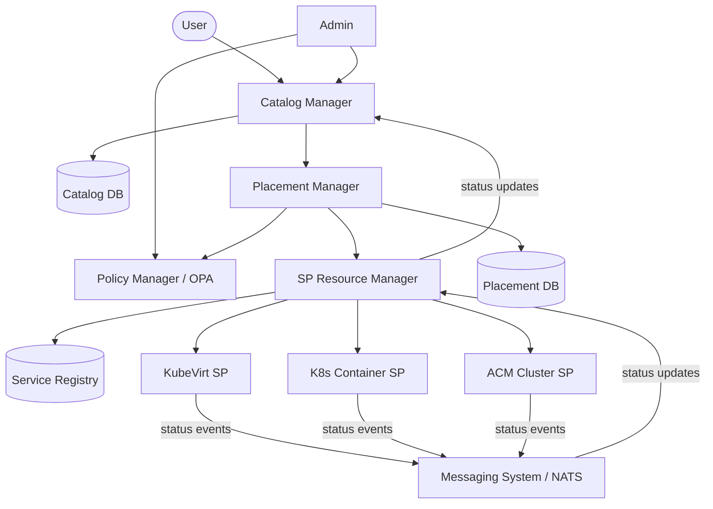
```mermaid
graph TB
    User([User])
    Admin[Admin]
    CM[Catalog Manager]
    CDB[(Catalog DB)]
    PM[Placement Manager]
    POL[Policy Manager / OPA]
    SPRM[SP Resource Manager]
    SR[(Service Registry)]
    DB[(Placement DB)]
    MSG[Messaging System / NATS]

    SP1[KubeVirt SP]
    SP2[K8s Container SP]
    SP3[ACM Cluster SP]

    User --> CM
    Admin --> CM
    Admin --> POL
    CM --> CDB
    CM --> PM
    PM --> POL
    PM --> SPRM
    PM --> DB
    SPRM --> SR
    SPRM --> SP1
    SPRM --> SP2
    SPRM --> SP3

    SP1 -->|status events| MSG
    SP2 -->|status events| MSG
    SP3 -->|status events| MSG
    MSG -->|status updates| SPRM
    SPRM -->|status updates| CM
```

---

## 2. Managing Policies

Policies control validation, mutation, and Service Provider selection for all resource requests. They are organized in a three-level hierarchy: **Global** (Super Admin), **Tenant** (Tenant Admin), and **User** (End User).

### 2.1 Create Policy

An administrator creates a policy by providing a name, type, priority, label selector, and REGO code. The Policy Manager validates uniqueness, compiles the REGO via OPA, and stores the policy metadata.

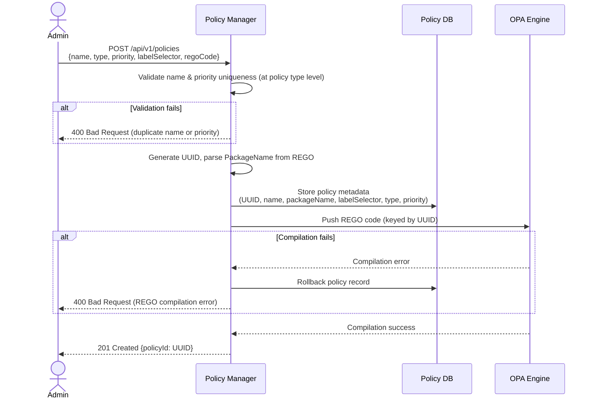
```mermaid
sequenceDiagram
    actor Admin
    participant PM as Policy Manager
    participant DB as Policy DB
    participant OPA as OPA Engine

    Admin->>PM: POST /api/v1/policies<br/>{name, type, priority, labelSelector, regoCode}
    PM->>PM: Validate name & priority uniqueness (at policy type level)
    alt Validation fails
        PM-->>Admin: 400 Bad Request (duplicate name or priority)
    end
    PM->>PM: Generate UUID, parse PackageName from REGO
    PM->>DB: Store policy metadata<br/>(UUID, name, packageName, labelSelector, type, priority)
    PM->>OPA: Push REGO code (keyed by UUID)
    alt Compilation fails
        OPA-->>PM: Compilation error
        PM->>DB: Rollback policy record
        PM-->>Admin: 400 Bad Request (REGO compilation error)
    end
    OPA-->>PM: Compilation success
    PM-->>Admin: 201 Created {policyId: UUID}
```

**Policy payload example:**
```json
{
  "name": "restrict-region",
  "type": "Global",
  "priority": 10,
  "labelSelector": { "serviceType": "vm" },
  "enabled": true,
  "regoCode": "package restrict_region\n..."
}
```

### 2.2 Policy Evaluation

When a resource request arrives, the Policy Manager fetches all matching enabled policies, sorts them by level (Global → Tenant → User) then priority (ascending), and evaluates them in a chain-of-responsibility pipeline. Each policy can reject the request, apply patches (mutations), set constraints, and influence Service Provider selection.

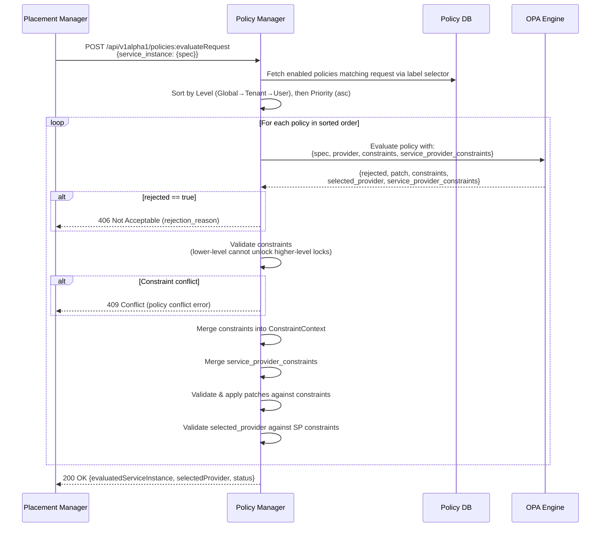
```mermaid
sequenceDiagram
    participant PM as Placement Manager
    participant PE as Policy Manager
    participant DB as Policy DB
    participant OPA as OPA Engine

    PM->>PE: POST /api/v1alpha1/policies:evaluateRequest<br/>{service_instance: {spec}}

    PE->>DB: Fetch enabled policies matching request via label selector
    PE->>PE: Sort by Level (Global→Tenant→User), then Priority (asc)

    loop For each policy in sorted order
        PE->>OPA: Evaluate policy with:<br/>{spec, provider, constraints, service_provider_constraints}
        OPA-->>PE: {rejected, patch, constraints,<br/>selected_provider, service_provider_constraints}

        alt rejected == true
            PE-->>PM: 406 Not Acceptable (rejection_reason)
        end

        PE->>PE: Validate constraints<br/>(lower-level cannot unlock higher-level locks)
        alt Constraint conflict
            PE-->>PM: 409 Conflict (policy conflict error)
        end

        PE->>PE: Merge constraints into ConstraintContext
        PE->>PE: Merge service_provider_constraints
        PE->>PE: Validate & apply patches against constraints
        PE->>PE: Validate selected_provider against SP constraints
    end

    PE-->>PM: 200 OK {evaluatedServiceInstance, selectedProvider, status}
```

**Evaluation request (Placement Manager → Policy Manager):**
```json
{
  "service_instance": {
    "spec": {
      "serviceType": "vm",
      "memory": { "size": "2GB" },
      "vcpu": { "count": 2 },
      "guestOS": { "type": "fedora-39" },
      "metadata": { "name": "fedora-vm" }
    }
  }
}
```

**Policy input (per policy, passed to OPA):**
```json
{
  "spec": {
    "serviceType": "vm",
    "memory": { "size": "2GB" },
    "vcpu": { "count": 2 },
    "guestOS": { "type": "fedora-39" },
    "metadata": { "name": "fedora-vm" }
  },
  "provider": "",
  "constraints": {},
  "service_provider_constraints": {}
}
```

**Policy decision format (per policy, returned by OPA):**
```json
{
  "rejected": false,
  "rejection_reason": "",
  "patch": {
    "billing_tag": "engineering",
    "region": "us-east-1"
  },
  "constraints": {
    "region": { "const": "us-east-1" },
    "vcpu": { "minimum": 2, "maximum": 8 }
  },
  "selected_provider": "kubevirt-sp",
  "service_provider_constraints": {
    "allow_list": ["kubevirt-sp", "vmware-sp"],
    "patterns": []
  }
}
```

**Evaluation response (returned to Placement Manager):**
```json
{
  "evaluatedServiceInstance": { "...": "final mutated spec" },
  "selectedProvider": "kubevirt-sp",
  "status": "APPROVED | MODIFIED"
}
```

**Key rules:**
- Lower-level policies cannot override constraints set by higher-level policies (e.g., a User policy cannot unlock a field locked by a Global policy).
- A `rejected: true` from any policy immediately aborts evaluation (fail-fast).
- Patches are applied cumulatively; the final payload reflects all mutations.
- Status is `APPROVED` if no patches were applied, `MODIFIED` if the spec was mutated.

---

## 3. Managing ServiceTypes

ServiceTypes define provider-agnostic schemas for infrastructure resources. They use JSON Schema (draft 2020-12) for validation.

### 3.1 ServiceType Registration

ServiceTypes are defined as JSON Schemas that describe the shape of a service request. All ServiceTypes share a common structure with `serviceType`, `metadata`, and optional `providerHints`.

In V1, dynamic registration of `ServiceType` is not supported

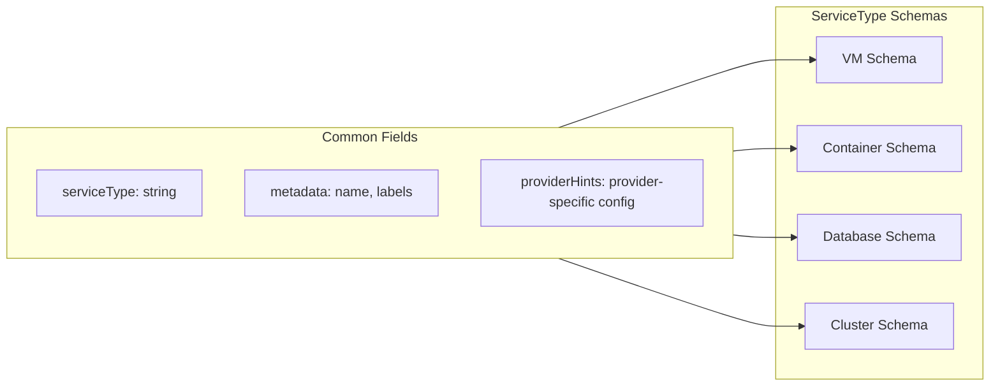
```mermaid
graph LR
    subgraph CommonFields[Common Fields]
        ST[serviceType: string]
        MD[metadata: name, labels]
        PH[providerHints: provider-specific config]
    end

    subgraph ServiceTypeSchemas[ServiceType Schemas]
        VM[VM Schema]
        CT[Container Schema]
        DBS[Database Schema]
        CL[Cluster Schema]
    end

    CommonFields --> VM
    CommonFields --> CT
    CommonFields --> DBS
    CommonFields --> CL
```

### 3.2 Supported ServiceTypes

#### VM (`serviceType: vm`)

| Field | Type | Required | Description |
|---|---|---|---|
| `vcpu.count` | integer | yes | Number of virtual CPUs |
| `memory.size` | string | yes | Memory size (e.g., `"8GB"`) |
| `storage.disks[]` | array | no | Disks; root disk must be named `"boot"` |
| `guestOS.type` | string | yes | OS image (e.g., `"rhel-9"`, `"ubuntu-22.04"`) |
| `access.sshPublicKey` | string | no | SSH public key for access |

#### Container (`serviceType: container`)

| Field | Type | Required | Description |
|---|---|---|---|
| `image.reference` | string | yes | Container image (e.g., `"quay.io/myapp:v1.2"`) |
| `resources.cpu.min/max` | integer | yes | CPU requests/limits |
| `resources.memory.min/max` | string | yes | Memory requests/limits |
| `process.command` | array | no | Entrypoint command |
| `process.env[]` | array | no | Environment variables |
| `network.ports[]` | array | no | Container ports |

#### Database (`serviceType: database`)

| Field | Type | Required | Description |
|---|---|---|---|
| `engine` | string | yes | Database engine (e.g., `"postgresql"`) |
| `version` | string | yes | Engine version |
| `resources.cpu` | integer | yes | CPU allocation |
| `resources.memory` | string | yes | Memory allocation |
| `resources.storage` | string | yes | Storage allocation |

#### Cluster (`serviceType: cluster`)

| Field | Type | Required | Description |
|---|---|---|---|
| `version` | string | yes | Kubernetes version |
| `nodes.controlPlane.count` | integer | yes | Control plane node count (1, 3, or 5) |
| `nodes.controlPlane.cpu/memory/storage` | various | yes | Control plane resources |
| `nodes.worker.count` | integer | yes | Worker node count |
| `nodes.worker.cpu/memory/storage` | various | yes | Worker node resources |

---

## 4. Managing CatalogItems

CatalogItems wrap ServiceType schemas with defaults, validation rules, and editability constraints. They enable administrators to create curated service offerings for end users.

### 4.1 Create CatalogItem

An administrator defines a CatalogItem by specifying the target ServiceType, field defaults, editability flags, and validation schemas.

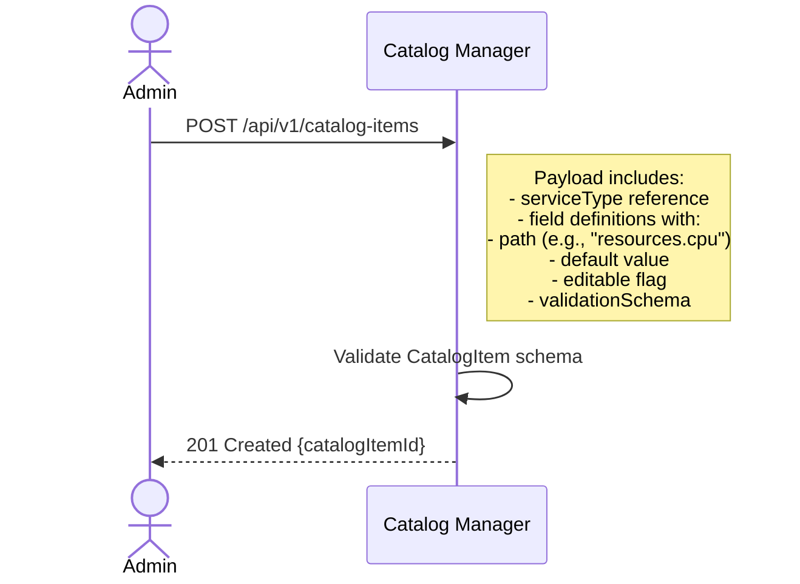
```mermaid
sequenceDiagram
    actor Admin
    participant CM as Catalog Manager

    Admin->>CM: POST /api/v1/catalog-items
    Note right of CM: Payload includes:<br/>- serviceType reference<br/>- field definitions with:<br/>  - path (e.g., "resources.cpu")<br/>  - default value<br/>  - editable flag<br/>  - validationSchema

    CM->>CM: Validate CatalogItem schema
    CM-->>Admin: 201 Created {catalogItemId}
```

**CatalogItem example:**
```yaml
apiVersion: v1alpha1
kind: CatalogItem
metadata:
  name: production-postgres
spec:
  serviceType: database
  fields:
    - path: "engine"
      default: "postgresql"
      editable: false
    - path: "version"
      editable: true
      default: "15"
      validationSchema:
        enum: ["14", "15", "16"]
    - path: "resources.cpu"
      editable: true
      default: 4
      validationSchema:
        minimum: 2
        maximum: 16
    - path: "resources.memory"
      editable: true
      default: "16GB"
    - path: "resources.storage"
      editable: true
      default: "100GB"
```

### 4.2 CatalogItem to ServiceType Translation

When a user orders an item from a CatalogItem, the system merges user input with CatalogItem defaults and validates against the field schemas, producing a ServiceType payload.

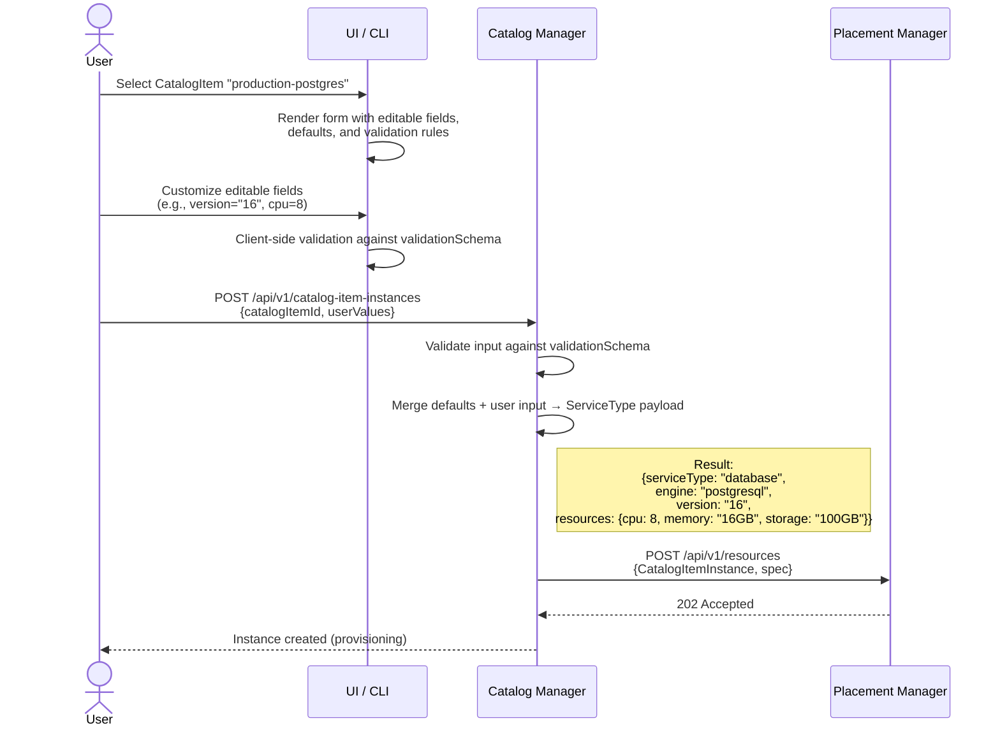
```mermaid
sequenceDiagram
    actor User
    participant UI as UI / CLI
    participant CM as Catalog Manager
    participant PM as Placement Manager

    User->>UI: Select CatalogItem "production-postgres"
    UI->>UI: Render form with editable fields,<br/>defaults, and validation rules
    User->>UI: Customize editable fields<br/>(e.g., version="16", cpu=8)
    UI->>UI: Client-side validation against validationSchema
    User->>CM: POST /api/v1/catalog-item-instances<br/>{catalogItemId, userValues}
    CM->>CM: Validate input against validationSchema
    CM->>CM: Merge defaults + user input → ServiceType payload
    Note right of CM: Result:<br/>{serviceType: "database",<br/> engine: "postgresql",<br/> version: "16",<br/> resources: {cpu: 8, memory: "16GB", storage: "100GB"}}
    CM->>PM: POST /api/v1/resources<br/>{CatalogItemInstance, spec}
    PM-->>CM: 202 Accepted
    CM-->>User: Instance created (provisioning)
```

---

## 5. Service Provider Lifecycle

### 5.1 Service Provider Registration

Service Providers register with DCM per service type. Registration is idempotent — re-registering with the same name updates the existing entry.

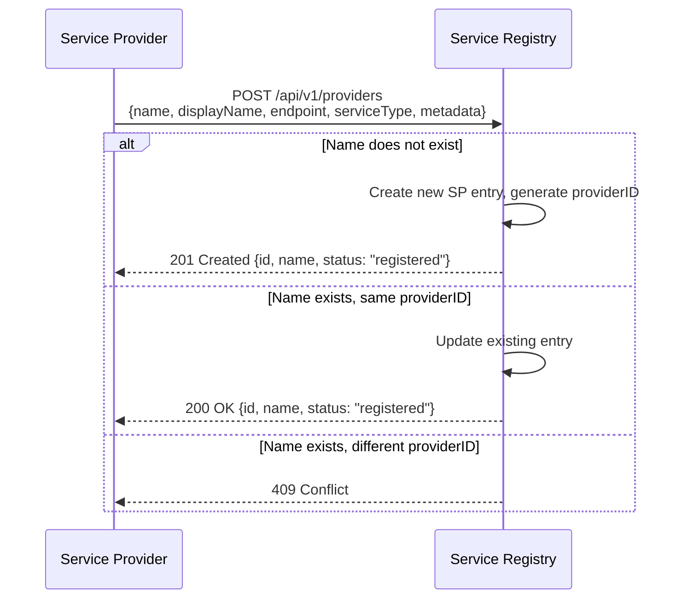
```mermaid
sequenceDiagram
    participant SP as Service Provider
    participant SR as Service Registry

    SP->>SR: POST /api/v1/providers<br/>{name, displayName, endpoint, serviceType, metadata}

    alt Name does not exist
        SR->>SR: Create new SP entry, generate providerID
        SR-->>SP: 201 Created {id, name, status: "registered"}
    else Name exists, same providerID
        SR->>SR: Update existing entry
        SR-->>SP: 200 OK {id, name, status: "registered"}
    else Name exists, different providerID
        SR-->>SP: 409 Conflict
    end
```

**Registration payload example:**
```json
{
  "name": "kubevirt-sp",
  "displayName": "KubeVirt Service Provider",
  "endpoint": "https://sp1.example.com/api/v1/vm",
  "serviceType": "vm",
  "metadata": {
    "region": "us-east-1",
    "resources": {
      "totalCpu": 200,
      "totalMemory": "1TB",
      "totalStorage": "2TB"
    }
  }
}
```

### 5.2 Service Provider Health Checks

DCM polls each registered Service Provider's `/health` endpoint at a configurable interval (default: every 10 seconds). Health status determines whether a provider can receive new requests.

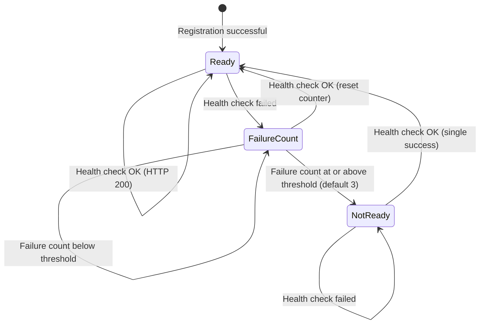
```mermaid
stateDiagram-v2
    [*] --> Ready: Registration successful

    Ready --> Ready: Health check OK (HTTP 200)
    Ready --> FailureCount: Health check failed
    FailureCount --> Ready: Health check OK (reset counter)
    FailureCount --> FailureCount: Failure count below threshold
    FailureCount --> NotReady: Failure count at or above threshold (default 3)
    NotReady --> Ready: Health check OK (single success)
    NotReady --> NotReady: Health check failed
```

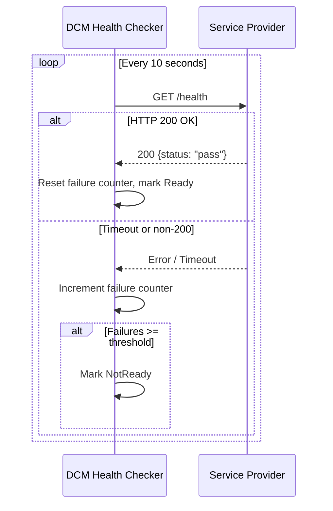
```mermaid
sequenceDiagram
    participant DCM as DCM Health Checker
    participant SP as Service Provider

    loop Every 10 seconds
        DCM->>SP: GET /health
        alt HTTP 200 OK
            SP-->>DCM: 200 {status: "pass"}
            DCM->>DCM: Reset failure counter, mark Ready
        else Timeout or non-200
            SP-->>DCM: Error / Timeout
            DCM->>DCM: Increment failure counter
            alt Failures >= threshold
                DCM->>DCM: Mark NotReady
            end
        end
    end
```

### 5.3 Service Provider Status Reporting

Service Providers report instance status changes to DCM via CloudEvents published to a messaging system (NATS). This decoupled approach supports multiple consumers (billing, auditing, etc.) and scales independently.

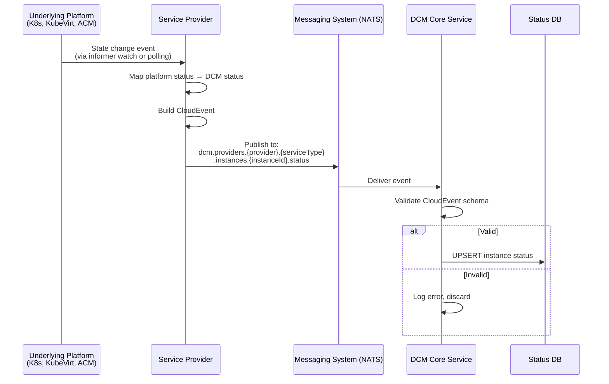
```mermaid
sequenceDiagram
    participant Platform as Underlying Platform<br/>(K8s, KubeVirt, ACM)
    participant SP as Service Provider
    participant MSG as Messaging System (NATS)
    participant DCM as DCM Core Service
    participant DB as Status DB

    Platform->>SP: State change event<br/>(via informer watch or polling)
    SP->>SP: Map platform status → DCM status
    SP->>SP: Build CloudEvent
    SP->>MSG: Publish to:<br/>dcm.providers.{provider}.{serviceType}<br/>.instances.{instanceId}.status

    MSG->>DCM: Deliver event
    DCM->>DCM: Validate CloudEvent schema
    alt Valid
        DCM->>DB: UPSERT instance status
    else Invalid
        DCM->>DCM: Log error, discard
    end
```

**Status enums by ServiceType:**

| VM | Container | Cluster |
|---|---|---|
| PROVISIONING | PENDING | CREATING |
| RUNNING | RUNNING | ACTIVE |
| STOPPED | SUCCEEDED | UPDATING |
| PAUSED | FAILED | DEGRADED |
| FAILED | UNKNOWN | DELETED |
| DELETING | | |
| DELETED | | |

---

## 6. CatalogItemInstance Creation (End-to-End)

This is the primary user flow: creating an infrastructure resource from a CatalogItem. The request flows through the Catalog Manager, Placement Manager (with policy evaluation), SP Resource Manager, and finally to the selected Service Provider.

### 6.1 Full Creation Flow

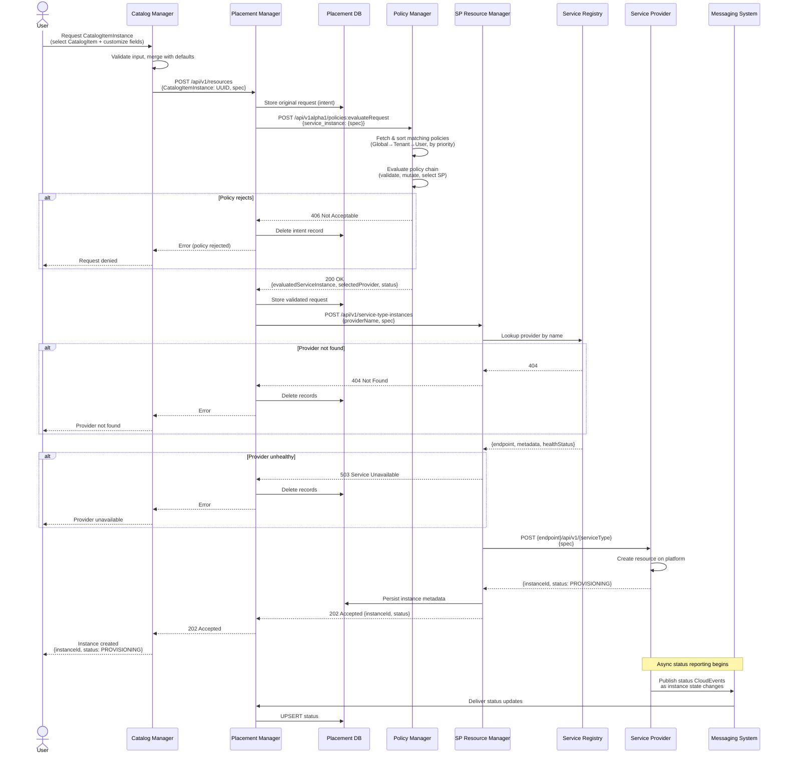
```mermaid
sequenceDiagram
    actor User
    participant CM as Catalog Manager
    participant PM as Placement Manager
    participant DB as Placement DB
    participant PE as Policy Manager
    participant SPRM as SP Resource Manager
    participant SR as Service Registry
    participant SP as Service Provider
    participant MSG as Messaging System

    User->>CM: Request CatalogItemInstance<br/>(select CatalogItem + customize fields)
    CM->>CM: Validate input, merge with defaults
    CM->>PM: POST /api/v1/resources<br/>{CatalogItemInstance: UUID, spec}

    %% Intent preservation
    PM->>DB: Store original request (intent)

    %% Policy evaluation
    PM->>PE: POST /api/v1alpha1/policies:evaluateRequest<br/>{service_instance: {spec}}
    PE->>PE: Fetch & sort matching policies<br/>(Global→Tenant→User, by priority)
    PE->>PE: Evaluate policy chain<br/>(validate, mutate, select SP)

    alt Policy rejects
        PE-->>PM: 406 Not Acceptable
        PM->>DB: Delete intent record
        PM-->>CM: Error (policy rejected)
        CM-->>User: Request denied
    end

    PE-->>PM: 200 OK<br/>{evaluatedServiceInstance, selectedProvider, status}
    PM->>DB: Store validated request

    %% SP Resource Manager
    PM->>SPRM: POST /api/v1/service-type-instances<br/>{providerName, spec}

    SPRM->>SR: Lookup provider by name
    alt Provider not found
        SR-->>SPRM: 404
        SPRM-->>PM: 404 Not Found
        PM->>DB: Delete records
        PM-->>CM: Error
        CM-->>User: Provider not found
    end
    SR-->>SPRM: {endpoint, metadata, healthStatus}

    alt Provider unhealthy
        SPRM-->>PM: 503 Service Unavailable
        PM->>DB: Delete records
        PM-->>CM: Error
        CM-->>User: Provider unavailable
    end

    %% Instance creation
    SPRM->>SP: POST {endpoint}/api/v1/{serviceType}<br/>{spec}
    SP->>SP: Create resource on platform
    SP-->>SPRM: {instanceId, status: PROVISIONING}
    SPRM->>DB: Persist instance metadata
    SPRM-->>PM: 202 Accepted {instanceId, status}
    PM-->>CM: 202 Accepted
    CM-->>User: Instance created<br/>{instanceId, status: PROVISIONING}

    %% Continuous status reporting
    Note over SP,MSG: Async status reporting begins
    SP->>MSG: Publish status CloudEvents<br/>as instance state changes
    MSG->>PM: Deliver status updates
    PM->>DB: UPSERT status
```

### 6.2 Placement Manager Flow

The Placement Manager is the central orchestrator. It preserves the user's original intent, delegates policy evaluation, and coordinates with the SP Resource Manager.

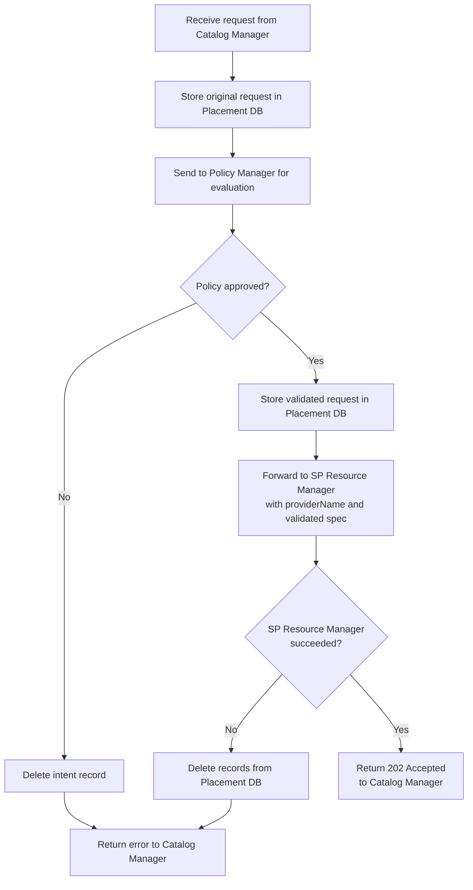
```mermaid
flowchart TD
    A[Receive request from Catalog Manager] --> B[Store original request in Placement DB]
    B --> C[Send to Policy Manager for evaluation]
    C --> D{Policy approved?}
    D -->|No| E[Delete intent record]
    E --> F[Return error to Catalog Manager]
    D -->|Yes| G[Store validated request in Placement DB]
    G --> H[Forward to SP Resource Manager<br/>with providerName and validated spec]
    H --> I{SP Resource Manager<br/>succeeded?}
    I -->|No| J[Delete records from Placement DB]
    J --> F
    I -->|Yes| K[Return 202 Accepted<br/>to Catalog Manager]
```

**Request payload (Catalog Manager → Placement Manager):**
```json
{
  "CatalogItemInstance": "4baa35eb-e70d-4d37-867d-0f4efa21d05c",
  "spec": {
    "serviceType": "vm",
    "memory": { "size": "2GB" },
    "vcpu": { "count": 2 },
    "guestOS": { "type": "fedora-39" },
    "access": { "sshPublicKey": "ssh-ed25519 ..." },
    "metadata": { "name": "fedora-vm" }
  }
}
```

**Response payload (Placement Manager → Catalog Manager):**
```json
{
  "CatalogItemInstanceId": "f3645f8f-82c1-4efb-888f-318c0ac81a08",
  "resource_name": "fedora-vm",
  "providerName": "kubevirt-sp",
  "id": "08aa81d1-a0d2-4d5f-a4df-b80addf07781"
}
```

### 6.3 SP Resource Manager Flow

The SP Resource Manager handles Service Provider lookup, health validation, and instance creation delegation.

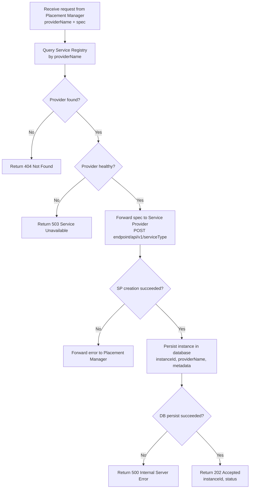
```mermaid
flowchart TD
    A[Receive request from Placement Manager<br/>providerName + spec] --> B[Query Service Registry<br/>by providerName]
    B --> C{Provider found?}
    C -->|No| D[Return 404 Not Found]
    C -->|Yes| E{Provider healthy?}
    E -->|No| F[Return 503 Service Unavailable]
    E -->|Yes| G[Forward spec to Service Provider<br/>POST endpoint/api/v1/serviceType]
    G --> H{SP creation succeeded?}
    H -->|No| I[Forward error to Placement Manager]
    H -->|Yes| J[Persist instance in database<br/>instanceId, providerName, metadata]
    J --> K{DB persist succeeded?}
    K -->|No| L[Return 500 Internal Server Error]
    K -->|Yes| M[Return 202 Accepted<br/>instanceId, status]
```

### 6.4 Service Provider Instance Creation

Each Service Provider translates the provider-agnostic ServiceType spec into platform-native resources.

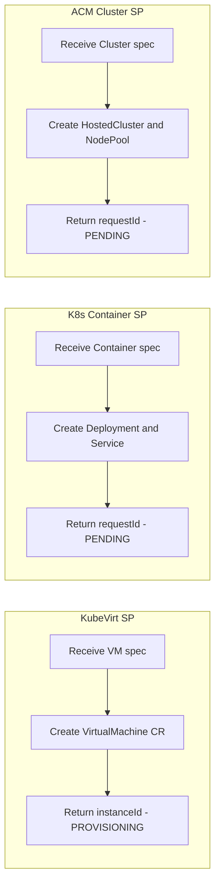
```mermaid
flowchart LR
    subgraph KubeVirtSP[KubeVirt SP]
        A1[Receive VM spec] --> A2[Create VirtualMachine CR]
        A2 --> A3[Return instanceId - PROVISIONING]
    end

    subgraph K8sContainerSP[K8s Container SP]
        B1[Receive Container spec] --> B2[Create Deployment and Service]
        B2 --> B3[Return requestId - PENDING]
    end

    subgraph ACMClusterSP[ACM Cluster SP]
        C1[Receive Cluster spec] --> C2[Create HostedCluster and NodePool]
        C2 --> C3[Return requestId - PENDING]
    end
```

### 6.5 Continuous Status Reporting

After instance creation, Service Providers continuously monitor the underlying platform and report status changes via CloudEvents.

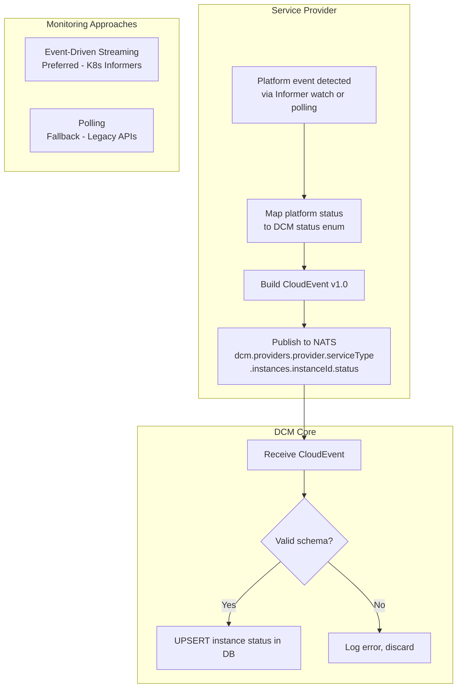
```mermaid
flowchart TD
    subgraph Service Provider
        A[Platform event detected<br/>via Informer watch or polling]
        A --> B[Map platform status<br/>to DCM status enum]
        B --> C[Build CloudEvent v1.0]
        C --> D[Publish to NATS<br/>dcm.providers.provider.serviceType<br/>.instances.instanceId.status]
    end

    subgraph DCM Core
        D --> E[Receive CloudEvent]
        E --> F{Valid schema?}
        F -->|Yes| G[UPSERT instance status in DB]
        F -->|No| H[Log error, discard]
    end

    subgraph Monitoring Approaches
        I[Event-Driven Streaming<br/>Preferred - K8s Informers]
        J[Polling<br/>Fallback - Legacy APIs]
    end
```

**Platform status mapping examples:**

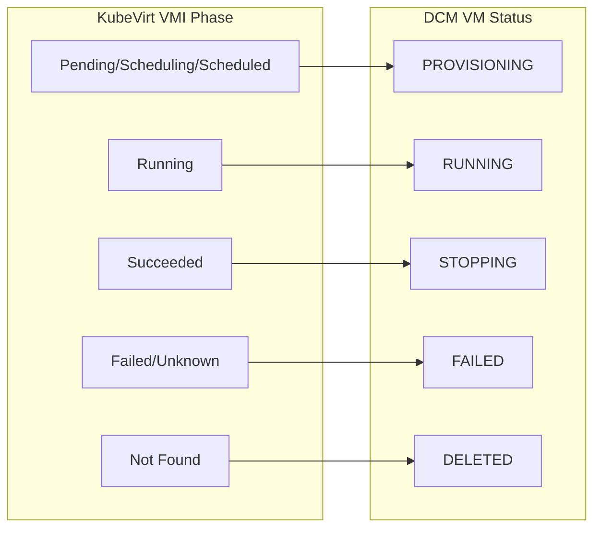
```mermaid
graph LR
    subgraph KubeVirt VMI Phase
        VP1[Pending/Scheduling/Scheduled]
        VP2[Running]
        VP3[Succeeded]
        VP4[Failed/Unknown]
        VP5[Not Found]
    end

    subgraph DCM VM Status
        DS1[PROVISIONING]
        DS2[RUNNING]
        DS3[STOPPING]
        DS4[FAILED]
        DS5[DELETED]
    end

    VP1 --> DS1
    VP2 --> DS2
    VP3 --> DS3
    VP4 --> DS4
    VP5 --> DS5
```

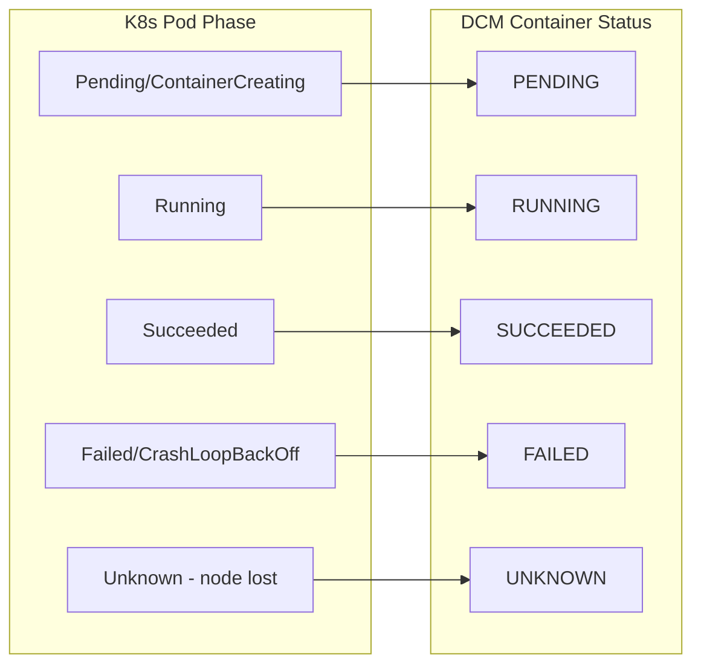
```mermaid
graph LR
    subgraph K8s Pod Phase
        KP1[Pending/ContainerCreating]
        KP2[Running]
        KP3[Succeeded]
        KP4[Failed/CrashLoopBackOff]
        KP5[Unknown - node lost]
    end

    subgraph DCM Container Status
        CS1[PENDING]
        CS2[RUNNING]
        CS3[SUCCEEDED]
        CS4[FAILED]
        CS5[UNKNOWN]
    end

    KP1 --> CS1
    KP2 --> CS2
    KP3 --> CS3
    KP4 --> CS4
    KP5 --> CS5
```

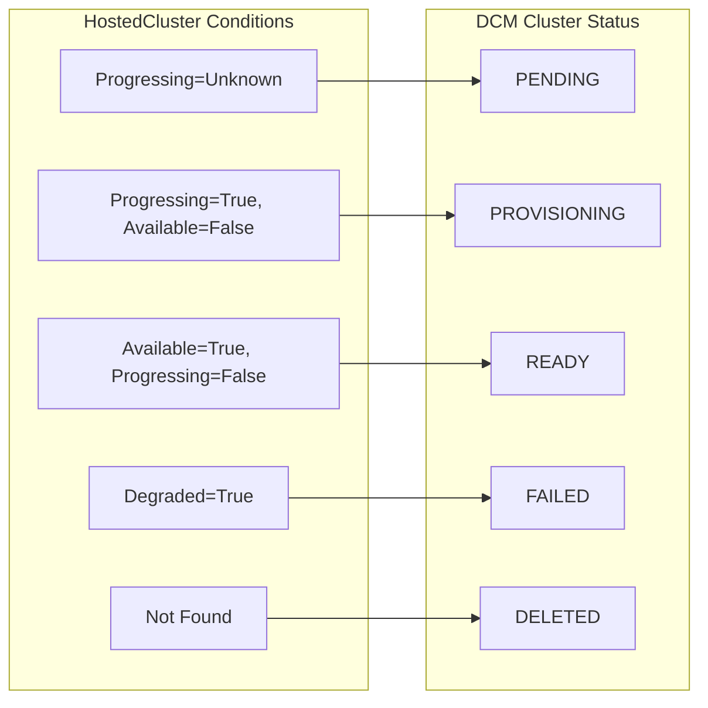
```mermaid
graph LR
    subgraph HostedCluster Conditions
        HC1[Progressing=Unknown]
        HC2[Progressing=True, Available=False]
        HC3[Available=True, Progressing=False]
        HC4[Degraded=True]
        HC5[Not Found]
    end

    subgraph DCM Cluster Status
        DC1[PENDING]
        DC2[PROVISIONING]
        DC3[READY]
        DC4[FAILED]
        DC5[DELETED]
    end

    HC1 --> DC1
    HC2 --> DC2
    HC3 --> DC3
    HC4 --> DC4
    HC5 --> DC5
```
